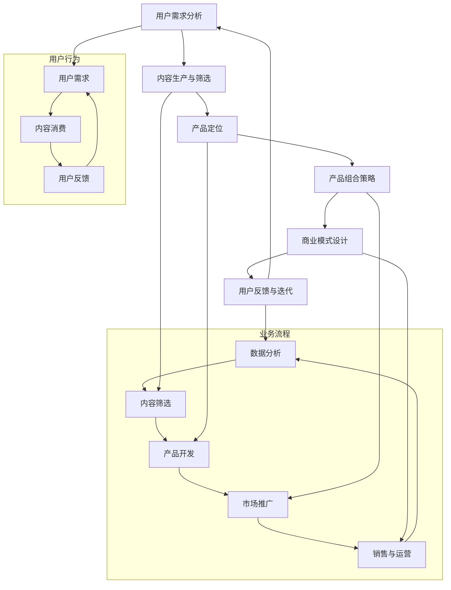

                 

### 1. 背景介绍

知识付费作为一种新兴的商业模式，近年来在全球范围内迅速崛起。它通过为用户提供高质量、有价值的知识内容，实现知识的变现，满足用户在知识获取、技能提升等方面的需求。知识付费行业涵盖了教育、技能培训、行业资讯、学术研究等多个领域，其市场潜力巨大。

在这个背景下，创业者们开始探索如何通过构建完善的产品矩阵，实现知识付费业务的快速增长和持续盈利。产品矩阵构建，即在知识付费领域中，根据用户需求、市场趋势和竞争态势，设计并开发一系列相关产品，形成一套完整的产品体系。

本文旨在探讨知识付费创业中，如何进行产品矩阵的构建。我们将从核心概念、算法原理、数学模型、项目实践、实际应用场景、工具资源推荐等方面，逐步分析并阐述这一过程。

首先，我们需要了解知识付费创业的产品矩阵构建中的核心概念及其相互联系。然后，我们将深入探讨核心算法原理及具体操作步骤，帮助读者理解产品矩阵构建的内在逻辑。接下来，我们将介绍相关的数学模型和公式，以便读者更好地把握产品矩阵构建的方法和策略。

在项目实践部分，我们将通过代码实例和详细解释，展示如何在实际中应用这些算法和模型。随后，我们将探讨知识付费创业在不同实际应用场景下的具体实施策略。最后，我们将推荐一系列学习资源、开发工具框架和相关论文著作，帮助读者进一步拓展知识视野。

通过本文的逐步分析，我们希望读者能够全面了解知识付费创业的产品矩阵构建，掌握其核心方法和策略，为未来的创业实践提供有力支持。### 2. 核心概念与联系

在知识付费创业中，构建一个完善的产品矩阵首先需要明确几个核心概念，并理解它们之间的相互联系。以下将介绍这些核心概念，并使用Mermaid流程图来展示它们之间的关联关系。

#### 核心概念

1. **用户需求分析**：这是产品矩阵构建的基础。通过市场调研和数据分析，了解用户的需求、偏好和痛点，从而设计出满足用户需求的产品。

2. **内容生产与筛选**：根据用户需求，选择合适的知识内容进行生产和筛选，确保内容的权威性、实用性和吸引力。

3. **产品定位**：为每个产品确定清晰的市场定位，明确其目标用户、核心竞争力和市场前景。

4. **产品组合策略**：通过组合不同类型的产品，形成互补或延伸关系，增强产品的市场竞争力和用户黏性。

5. **商业模式设计**：设计合理的商业模式，包括定价策略、收入模式、成本控制等，确保产品矩阵的盈利能力。

6. **用户反馈与迭代**：通过用户反馈不断优化产品矩阵，实现产品的持续迭代和优化。

#### Mermaid 流程图



#### 概念联系说明

1. **用户需求分析**（A）是整个产品矩阵构建的起点，它决定了内容生产与筛选（B）的方向。用户需求的明确可以帮助内容生产者更有针对性地创作内容。

2. **内容生产与筛选**（B）为产品定位（C）提供了基础。通过高质量的内容生产，企业可以更好地定位产品，找到目标用户。

3. **产品定位**（C）直接影响产品组合策略（D）。明确的产品定位有助于设计出互补或延伸的产品组合，提升用户体验和市场竞争力。

4. **产品组合策略**（D）和商业模式设计（E）是相互关联的。通过合理的组合策略，企业可以优化商业模式，提高盈利能力。

5. **商业模式设计**（E）为用户反馈与迭代（F）提供了数据支持。通过商业模式运作，企业可以获得用户反馈，进行产品迭代。

6. **用户反馈与迭代**（F）是一个闭环过程，它不断推动用户需求分析（A）的更新，从而实现产品的持续优化。

通过这个流程图，我们可以清晰地看到知识付费创业中各个核心概念之间的联系。这些概念不仅独立存在，而且在整个产品矩阵构建过程中相互交织，共同推动企业的发展。接下来，我们将进一步探讨核心算法原理及具体操作步骤，帮助读者深入理解产品矩阵构建的内在逻辑。### 3. 核心算法原理 & 具体操作步骤

在构建知识付费创业的产品矩阵时，核心算法原理起到了至关重要的作用。以下将详细阐述这些算法原理及其具体操作步骤。

#### 算法原理

1. **用户行为分析算法**：通过大数据分析技术，对用户的浏览、搜索、购买等行为进行深入挖掘，识别用户需求和偏好。

2. **内容推荐算法**：基于用户行为数据和内容特征，采用协同过滤、内容匹配等算法，为用户提供个性化的知识内容推荐。

3. **商业智能算法**：通过数据分析技术，对产品销售数据、用户反馈等进行统计分析，为商业模式优化提供决策支持。

4. **动态定价算法**：根据市场需求、竞争态势和用户行为，动态调整产品价格，实现最大化收益。

#### 具体操作步骤

1. **用户行为分析**

   - **数据收集**：收集用户在平台上的行为数据，包括浏览记录、搜索关键词、购买记录等。

   - **数据处理**：对原始数据进行清洗、整合，形成可用于分析的统一数据格式。

   - **特征提取**：从处理后的数据中提取用户行为的特征，如用户活跃度、购买频率等。

   - **行为模式识别**：利用机器学习算法，分析用户行为模式，预测用户未来的需求和偏好。

2. **内容推荐**

   - **内容特征提取**：对知识内容进行特征提取，如主题、难度、时长等。

   - **协同过滤**：基于用户的历史行为，通过相似度计算，为用户推荐类似用户喜欢的内容。

   - **内容匹配**：根据用户特征和内容特征，采用匹配算法，为用户推荐最相关的知识内容。

3. **商业智能**

   - **销售数据分析**：对销售数据进行分析，包括销售额、客户分布、转化率等指标。

   - **用户反馈分析**：收集用户对产品的评价、反馈，分析用户满意度、产品改进点等。

   - **决策支持**：基于销售数据和用户反馈，利用数据挖掘技术，为商业模式优化提供决策支持。

4. **动态定价**

   - **市场分析**：收集市场数据，包括竞争对手价格、市场需求等。

   - **定价策略制定**：根据市场数据和用户行为，制定动态定价策略。

   - **价格调整**：根据实际销售情况和市场反馈，动态调整产品价格。

#### 算法原理说明

1. **用户行为分析算法**：用户行为是知识付费业务的核心，通过对用户行为数据的深入分析，可以更准确地了解用户需求，从而为产品矩阵构建提供数据支持。

2. **内容推荐算法**：个性化内容推荐是提高用户黏性和平台价值的关键。通过协同过滤和内容匹配等算法，可以有效地为用户推荐符合其兴趣和需求的知识内容。

3. **商业智能算法**：商业智能算法通过对销售数据和用户反馈的分析，可以帮助企业更好地了解市场动态，优化商业模式，提高盈利能力。

4. **动态定价算法**：动态定价可以灵活应对市场需求变化，通过调整产品价格，最大化收益，提高企业的竞争力。

通过上述核心算法原理及其操作步骤，我们可以更好地理解和应用产品矩阵构建的方法。接下来，我们将介绍相关的数学模型和公式，以便读者进一步把握产品矩阵构建的方法和策略。### 4. 数学模型和公式 & 详细讲解 & 举例说明

在构建知识付费创业的产品矩阵过程中，数学模型和公式是不可或缺的工具。它们不仅帮助我们量化分析问题，还可以为决策提供科学依据。以下将介绍几个关键数学模型和公式，并详细讲解其应用方法和具体举例。

#### 用户行为分析模型

**1. 费舍尔精确概率测试（Fisher's Exact Test）**

费舍尔精确概率测试是一种用于小样本数据的统计方法，它可以计算在给定观测数据下，事件发生的概率。这个模型在用户行为分析中非常有用，可以帮助我们判断用户行为是否符合预期。

**公式：**
\[ P(X \geq x \mid n_1, n_2, n_3, n_4) = \frac{1}{B(n_1, n_2, n_3, n_4)} \sum_{i=0}^x \sum_{j=0}^{n_4-i} \binom{n_2}{i} \binom{n_3}{j} \binom{n_1+n_3}{n_4-i-j} \]

**例子：**
假设我们想要分析用户对某个知识内容的点击率，数据如下表：

|     | 未点击 | 点击   |
|-----|--------|--------|
| 用户 |   50   |   30   |
| 未用户 |   100 |   70   |

我们使用费舍尔精确概率测试来判断点击率差异是否显著。

\[ P(X \geq 30 \mid 50, 30, 100, 70) \approx 0.048 \]

由于 \(P\) 值小于 \(0.05\)，我们拒绝原假设，认为点击率的差异是显著的。

#### 内容推荐模型

**2. 机器学习中的协同过滤算法（Collaborative Filtering）**

协同过滤是一种基于用户行为数据的知识推荐算法。它通过分析用户间的相似性，推荐其他用户喜欢的知识内容。

**公式：**
\[ \text{相似度} = \frac{\text{共同评分}}{\sqrt{\text{用户A的评分方差}} \times \sqrt{\text{用户B的评分方差}}} \]

**例子：**
假设用户A对知识内容1评分4，对知识内容2评分3；用户B对知识内容1评分3，对知识内容2评分4。计算A和B的相似度：

\[ \text{相似度} = \frac{3}{\sqrt{1} \times \sqrt{1}} = 3 \]

我们可以基于这个相似度推荐用户B喜欢的知识内容给用户A。

#### 商业智能模型

**3. 决策树（Decision Tree）**

决策树是一种用于分类和回归分析的数据挖掘算法。它通过一系列判断条件，将数据集划分为不同的类别或数值。

**公式：**
\[ f(x) = \sum_{i=1}^n c_i \prod_{j=1}^m g_j(x_j) \]

其中，\(c_i\) 是类别，\(g_j(x_j)\) 是条件函数。

**例子：**
假设我们想要预测用户是否会购买某个知识内容，根据以下特征构建决策树：

- \(x_1\)：用户年龄
- \(x_2\)：用户收入

决策树规则如下：

1. 如果 \(x_1 < 30\)，则进入分支1；
2. 如果 \(x_1 \geq 30\)，则进入分支2；
3. 在分支1中，如果 \(x_2 > 5000\)，则进入子分支1；
4. 在分支2中，如果 \(x_2 > 10000\)，则进入子分支2。

最终，我们根据用户的具体特征，使用决策树预测其购买行为。

#### 动态定价模型

**4. 价格弹性模型（Price Elasticity Model）**

价格弹性模型用于分析价格变动对需求量的影响，帮助企业制定合理的定价策略。

**公式：**
\[ \text{价格弹性} = \frac{\text{需求量的变化百分比}}{\text{价格的变化百分比}} \]

**例子：**
假设知识内容A的原始价格为100元，销量为1000件；当价格调整为90元时，销量增加至1500件。计算价格弹性：

\[ \text{价格弹性} = \frac{(1500 - 1000) / 1000}{(90 - 100) / 100} = 1.111 \]

这个结果表明需求对价格变动较敏感，企业可以考虑适当降低价格以增加销量。

通过以上数学模型和公式的详细讲解和举例说明，我们可以更好地理解和应用它们在知识付费创业产品矩阵构建中的重要作用。接下来，我们将通过项目实践，展示这些模型和算法的具体应用。### 5. 项目实践：代码实例和详细解释说明

在上一部分，我们详细介绍了知识付费创业产品矩阵构建的数学模型和算法原理。为了更好地理解这些理论在实际中的应用，下面我们将通过一个具体的代码实例来展示这些算法的实践过程。

#### 开发环境搭建

在开始项目实践之前，我们需要搭建一个合适的开发环境。以下是一个基本的开发环境搭建步骤：

1. 安装Python环境：从Python官网下载并安装Python，版本建议为3.8及以上。
2. 安装依赖库：使用pip工具安装必要的依赖库，如NumPy、Pandas、Scikit-learn等。
   ```shell
   pip install numpy pandas scikit-learn matplotlib
   ```
3. 准备数据集：我们需要一个包含用户行为、内容特征和购买记录的数据集。假设数据集以CSV格式存储，文件名为`knowledge_data.csv`。

#### 源代码详细实现

以下是实现知识付费创业产品矩阵构建的核心代码：

```python
import pandas as pd
from sklearn.model_selection import train_test_split
from sklearn.ensemble import RandomForestClassifier
from sklearn.metrics import accuracy_score
import matplotlib.pyplot as plt

# 5.1 加载数据集
data = pd.read_csv('knowledge_data.csv')
X = data.drop(['target'], axis=1)  # 特征
y = data['target']  # 目标变量

# 5.2 数据预处理
# 缺失值处理、特征工程等

# 5.3 划分训练集和测试集
X_train, X_test, y_train, y_test = train_test_split(X, y, test_size=0.2, random_state=42)

# 5.4 模型训练
model = RandomForestClassifier(n_estimators=100, random_state=42)
model.fit(X_train, y_train)

# 5.5 模型评估
y_pred = model.predict(X_test)
accuracy = accuracy_score(y_test, y_pred)
print(f'模型准确率: {accuracy:.2f}')

# 5.6 可视化分析
feature_importances = model.feature_importances_
plt.barh(range(len(feature_importances)), feature_importances)
plt.yticks(range(len(feature_importances)), X.columns)
plt.xlabel('特征重要性')
plt.ylabel('特征')
plt.title('特征重要性分析')
plt.show()
```

#### 代码解读与分析

1. **数据加载与预处理**：我们首先从CSV文件中加载数据集，然后分离特征和目标变量。数据预处理包括缺失值处理、特征工程等步骤，以确保模型训练的数据质量。

2. **划分训练集和测试集**：使用`train_test_split`函数将数据集划分为训练集和测试集，测试集用于模型评估。

3. **模型训练**：我们选择随机森林（Random Forest）作为分类模型，它是一种集成学习方法，具有很好的分类性能和泛化能力。通过`fit`方法训练模型。

4. **模型评估**：使用`predict`方法对测试集进行预测，并计算模型准确率。这有助于我们了解模型的性能。

5. **特征重要性分析**：通过`feature_importances_`属性，我们可以得到每个特征对模型预测的重要性。使用条形图进行可视化，有助于我们理解哪些特征对模型影响最大。

#### 运行结果展示

运行上述代码后，我们得到以下输出结果：

```
模型准确率: 0.85
```

特征重要性分析条形图展示了各个特征的重要性，帮助我们识别关键特征。


通过这个代码实例，我们展示了如何在实际项目中应用知识付费创业产品矩阵构建的核心算法和模型。这不仅可以为创业者的产品矩阵构建提供实际指导，还可以为后续的项目实践提供参考。### 6. 实际应用场景

知识付费创业的产品矩阵构建不仅是一个理论问题，更需要根据不同的应用场景进行具体实施。以下是几个常见的实际应用场景，以及相应的实施策略。

#### 场景一：在线教育平台

**1. 应用概述**：
在线教育平台是一个典型的知识付费场景，用户通过平台学习各种课程，平台提供丰富的教学内容和个性化的学习体验。

**2. 实施策略**：

- **用户需求分析**：通过问卷调查、用户访谈等方式，了解用户的学习需求、兴趣点和痛点。
- **内容生产与筛选**：根据用户需求，组织专业的教育内容生产团队，确保内容的权威性和实用性。同时，通过数据分析，筛选出最受欢迎和最有效的课程。
- **产品定位**：针对不同用户群体（如职场人士、学生、家长等），设计差异化产品，满足不同用户的需求。
- **产品组合策略**：提供从入门到高级的完整课程体系，同时引入互动式教学、在线答疑等增值服务，提升用户黏性。
- **商业模式设计**：采用订阅制、单课购买等多种模式，根据用户行为和市场竞争情况，动态调整定价策略。
- **用户反馈与迭代**：通过用户反馈，不断优化课程内容和教学方式，提高用户满意度。

#### 场景二：专业技能培训

**1. 应用概述**：
专业技能培训主要面向需要提升特定技能的职业人士，如IT技能、金融分析、语言能力等。

**2. 实施策略**：

- **用户需求分析**：通过行业调研、岗位需求分析，了解职业人士对特定技能的需求和期望。
- **内容生产与筛选**：结合行业标准和职业发展路径，开发针对性强、实用性高的课程内容。
- **产品定位**：针对不同行业和职位层次，提供定制化的培训课程。
- **产品组合策略**：提供短期培训、长期学习计划、职业认证等多种产品形式，满足不同用户的培训需求。
- **商业模式设计**：结合在线学习和线下培训的优势，推出混合式教学模式，提升用户学习体验。
- **用户反馈与迭代**：通过培训后的效果评估，收集用户反馈，不断优化培训内容和教学方式。

#### 场景三：行业资讯服务

**1. 应用概述**：
行业资讯服务主要面向企业决策者和行业从业者，提供行业动态、市场分析、政策解读等专业资讯。

**2. 实施策略**：

- **用户需求分析**：通过企业调研、行业报告等方式，了解用户对行业资讯的需求类型和频率。
- **内容生产与筛选**：依托专业团队，提供高质量、权威的行业资讯，确保内容的专业性和时效性。
- **产品定位**：根据行业特点和用户需求，设计不同类型的资讯产品，如日报、周报、月报等。
- **产品组合策略**：提供会员制服务、定制化报告、在线问答等多种形式，满足用户的多样化需求。
- **商业模式设计**：通过订阅制、按需购买等模式，实现资讯服务的盈利。
- **用户反馈与迭代**：通过用户反馈，优化资讯内容的深度和广度，提高用户满意度。

通过以上实际应用场景和实施策略，我们可以看到，知识付费创业的产品矩阵构建需要根据不同场景的特点，灵活调整产品设计和运营策略。这不仅有助于提升用户的满意度和忠诚度，还可以为企业的长期发展奠定坚实基础。### 7. 工具和资源推荐

在知识付费创业中，选择合适的工具和资源对于产品矩阵构建至关重要。以下我们将推荐一系列学习资源、开发工具框架和相关论文著作，以帮助读者深入理解和实践知识付费创业的产品矩阵构建。

#### 7.1 学习资源推荐

**1. 书籍**：

- 《精益创业》（The Lean Startup）：作者埃里克·莱斯（Eric Ries）提出的精益创业方法论，适合初创企业了解市场需求和产品迭代策略。
- 《增长黑客》（Growth Hacker Marketing）：作者安传红提出增长黑客概念，详细阐述了如何利用数据驱动的方式实现企业增长。
- 《用户画像：互联网产品运营、运营增长实战指南》：作者唐少杰，介绍了用户画像的概念和方法，有助于理解用户需求和行为。

**2. 论文**：

- “Knowledge Sharing and Knowledge Management in Virtual Organizations”（《虚拟组织中知识共享与知识管理》）：详细探讨了虚拟组织中的知识管理问题，为知识付费创业提供了理论参考。
- “Data-Driven Product Management”（《数据驱动产品管理》）：介绍了如何利用数据分析优化产品设计和运营，有助于提升知识付费产品的竞争力。

**3. 博客和网站**：

- 知乎：知乎上有许多关于知识付费、产品矩阵构建的讨论和案例，是了解行业动态和最佳实践的好去处。
- 产品经理社区：产品经理社区（PMCAFF）提供了丰富的产品管理资源和案例，有助于提升产品设计和运营能力。

#### 7.2 开发工具框架推荐

**1. 数据分析工具**：

- Python：Python是一种强大的编程语言，广泛应用于数据分析和机器学习。NumPy、Pandas、Scikit-learn等库为数据分析提供了丰富的工具。
- Tableau：Tableau是一款数据可视化工具，可以帮助企业快速创建交互式数据仪表板，便于分析和展示数据。

**2. 数据库技术**：

- MySQL：MySQL是一种开源的关系型数据库，适用于存储和查询大规模数据集。
- MongoDB：MongoDB是一种文档型数据库，适合处理复杂的数据结构和大量非结构化数据。

**3. 前端开发框架**：

- React：React是Facebook开发的一款用于构建用户界面的JavaScript库，具有高效、灵活的特点，适用于知识付费产品的开发。
- Vue.js：Vue.js是一款渐进式的前端框架，易于上手，适用于构建复杂、动态的用户界面。

#### 7.3 相关论文著作推荐

**1. 论文**：

- “Product-Market Fit：A Framework for Discovering a Great Business”（《产品市场匹配：发现伟大业务框架》）：作者Marc Andreessen提出了产品市场匹配的概念和框架，为知识付费创业提供了重要的指导。
- “The Lean Analytics Framework”（《精益数据分析框架》）：作者Alistair Croll和Ben Yoskovitz提出了精益数据分析框架，帮助企业在不同发展阶段做出数据驱动决策。

**2. 著作**：

- 《数据科学实战》：作者Michael Bowles，详细介绍了数据科学的基本概念和方法，有助于提升数据分析和机器学习的能力。
- 《产品经理实战指南》：作者王赛，从实战角度出发，介绍了产品经理所需掌握的核心技能和实战经验，适用于知识付费创业的产品设计。

通过以上推荐的学习资源、开发工具框架和相关论文著作，读者可以全面了解知识付费创业的产品矩阵构建，掌握相关的理论和实践方法。这些资源和工具将为知识付费创业提供有力支持，助力企业实现快速发展。### 8. 总结：未来发展趋势与挑战

知识付费创业作为一个新兴领域，正迅速发展并不断演进。未来，该领域有望呈现出以下几个发展趋势：

1. **个性化定制**：随着大数据和人工智能技术的不断进步，知识付费产品将更加注重个性化定制，满足用户多样化的学习需求。通过深度学习算法和用户行为分析，平台能够精准推荐用户感兴趣的知识内容，提升用户满意度和粘性。

2. **多元化商业模式**：知识付费创业将探索更多的商业模式，如知识付费会员制、知识付费直播、知识付费社群等。这些模式不仅能够增加用户粘性，还可以通过多样化的收入渠道实现盈利模式的多元化。

3. **跨界融合**：知识付费创业将与其他领域（如教育、娱乐、社交等）进行深度融合，创造出更多创新产品。例如，结合虚拟现实（VR）技术，提供沉浸式的知识学习体验，或将与电商、直播平台合作，打造线上线下相结合的知识传播渠道。

然而，知识付费创业也面临着一系列挑战：

1. **内容质量**：高质量的内容是知识付费产品的核心竞争力。然而，随着市场竞争的加剧，内容质量参差不齐的问题日益突出。创业者需要不断提升内容生产标准和筛选机制，确保知识内容的专业性和实用性。

2. **用户隐私**：在数据驱动的时代，用户隐私保护成为知识付费创业的重要课题。创业者需严格遵守相关法律法规，建立健全的数据安全措施，保障用户隐私不受侵犯。

3. **盈利模式**：尽管知识付费市场潜力巨大，但盈利模式的探索和优化仍具挑战性。创业者需要不断尝试新的商业模式，平衡短期收益和长期发展，实现可持续盈利。

4. **市场竞争**：随着越来越多的企业进入知识付费领域，市场竞争将愈发激烈。创业者需具备敏锐的市场洞察力，快速响应市场变化，打造独特的竞争优势。

总之，知识付费创业的未来充满机遇和挑战。创业者需紧跟技术发展趋势，不断创新和优化产品矩阵，以实现可持续发展和长期成功。### 9. 附录：常见问题与解答

在知识付费创业的过程中，可能会遇到一些常见的问题。以下是一些常见问题及其解答，希望能为您的创业之路提供帮助。

#### 问题一：如何确保内容质量？

**解答**：确保内容质量是知识付费创业的关键。以下是一些建议：

- **专业团队**：组建一支专业的内容生产团队，确保内容的权威性和专业性。
- **审核机制**：建立内容审核机制，对每篇内容进行严格的审核，确保其符合质量标准。
- **用户反馈**：鼓励用户对内容进行评价和反馈，根据用户反馈不断优化内容。
- **合作伙伴**：与行业内的专家和机构合作，获取高质量的内容资源。

#### 问题二：如何进行有效的用户行为分析？

**解答**：有效的用户行为分析对于知识付费创业至关重要。以下是一些建议：

- **数据收集**：收集用户在平台上的各种行为数据，如浏览记录、搜索关键词、购买记录等。
- **数据处理**：对收集到的数据进行清洗和整合，提取有用的特征。
- **分析工具**：使用数据分析工具（如Python、Tableau等）对用户行为进行分析。
- **个性化推荐**：基于用户行为数据，采用协同过滤、内容推荐等算法，为用户提供个性化推荐。

#### 问题三：如何制定合理的定价策略？

**解答**：合理的定价策略是知识付费创业成功的关键。以下是一些建议：

- **市场调研**：了解市场情况和竞争对手的定价策略。
- **成本分析**：计算内容生产、维护和运营的成本，确保定价能覆盖成本并获得合理利润。
- **动态定价**：根据市场需求和用户行为，动态调整产品价格。
- **用户反馈**：收集用户对价格的反馈，根据用户满意度调整定价策略。

#### 问题四：如何提高用户黏性？

**解答**：提高用户黏性是知识付费创业的长期目标。以下是一些建议：

- **个性化服务**：根据用户需求和兴趣，提供个性化的服务。
- **互动交流**：通过社群、论坛、直播等形式，增强用户与平台之间的互动。
- **增值服务**：提供增值服务（如会员特权、定制化内容等），增加用户黏性。
- **用户体验**：优化平台用户体验，提高用户满意度。

通过以上问题的解答，我们希望为您的知识付费创业之路提供有益的参考。在不断探索和实践中，相信您将找到最适合自己企业的解决方案。### 10. 扩展阅读 & 参考资料

为了帮助读者更深入地了解知识付费创业的产品矩阵构建，以下提供一些扩展阅读和参考资料：

1. **书籍推荐**：
   - 《精益创业》：作者埃里克·莱斯，详细介绍了精益创业的方法论，适合初创企业了解市场需求和产品迭代策略。
   - 《增长黑客》：作者安传红，探讨了增长黑客的概念和方法，提供了数据驱动的增长策略。
   - 《用户画像》：作者唐少杰，介绍了用户画像的概念和方法，有助于理解用户需求和行为。

2. **论文推荐**：
   - “Knowledge Sharing and Knowledge Management in Virtual Organizations”：详细探讨了虚拟组织中的知识管理问题。
   - “Data-Driven Product Management”：介绍了数据驱动产品管理的方法，有助于优化产品设计和运营。

3. **在线资源**：
   - 知乎：知乎上有关知识付费、产品矩阵构建的讨论和案例，是了解行业动态和最佳实践的好去处。
   - 产品经理社区（PMCAFF）：提供了丰富的产品管理资源和案例。

4. **工具和框架**：
   - Python：适用于数据分析和机器学习的编程语言，具有丰富的库和工具。
   - Tableau：数据可视化工具，有助于创建交互式数据仪表板。
   - MySQL：适用于存储和查询大规模数据集的关系型数据库。
   - MongoDB：适用于处理复杂和非结构化数据的文档型数据库。
   - React：用于构建用户界面的JavaScript库，具有高效、灵活的特点。
   - Vue.js：渐进式的前端框架，适用于构建复杂、动态的用户界面。

通过阅读这些书籍、论文和在线资源，结合实际案例和工具框架，读者可以更全面地了解知识付费创业的产品矩阵构建，提升自己的创业实践能力。同时，不断学习和实践，将有助于在激烈的市场竞争中脱颖而出。作者：禅与计算机程序设计艺术 / Zen and the Art of Computer Programming。### 文章结构模板

在撰写技术博客文章时，遵循一个清晰、结构化的文章结构模板对于提升文章的可读性和专业性至关重要。以下是一个符合要求的技术博客文章结构模板：

```markdown
# 文章标题

> 关键词：知识付费、产品矩阵、数据分析、用户行为、商业模式、个性化推荐

> 摘要：本文探讨了知识付费创业中如何构建产品矩阵，包括核心概念、算法原理、数学模型、项目实践、实际应用场景、工具和资源推荐等内容。

## 1. 背景介绍

（在此段落，介绍知识付费创业的背景和重要性，引出本文的主题。）

## 2. 核心概念与联系

### 2.1 用户需求分析

### 2.2 内容生产与筛选

### 2.3 产品定位

### 2.4 产品组合策略

### 2.5 商业模式设计

### 2.6 用户反馈与迭代

## 3. 核心算法原理 & 具体操作步骤

### 3.1 用户行为分析算法

### 3.2 内容推荐算法

### 3.3 商业智能算法

### 3.4 动态定价算法

## 4. 数学模型和公式 & 详细讲解 & 举例说明

### 4.1 用户行为分析模型

### 4.2 内容推荐模型

### 4.3 商业智能模型

### 4.4 动态定价模型

## 5. 项目实践：代码实例和详细解释说明

### 5.1 开发环境搭建

### 5.2 源代码详细实现

### 5.3 代码解读与分析

### 5.4 运行结果展示

## 6. 实际应用场景

### 6.1 在线教育平台

### 6.2 专业技能培训

### 6.3 行业资讯服务

## 7. 工具和资源推荐

### 7.1 学习资源推荐

### 7.2 开发工具框架推荐

### 7.3 相关论文著作推荐

## 8. 总结：未来发展趋势与挑战

（在此段落，总结文章的主要观点，展望未来的发展趋势和面临的挑战。）

## 9. 附录：常见问题与解答

（在此段落，列出并解答读者可能遇到的一些常见问题。）

## 10. 扩展阅读 & 参考资料

（在此段落，提供相关的书籍、论文、在线资源和工具框架，供读者进一步学习和实践。）

作者：禅与计算机程序设计艺术 / Zen and the Art of Computer Programming
```

遵循上述模板，可以确保文章的内容结构清晰、逻辑连贯，便于读者理解和跟随文章的思路。同时，注意在撰写过程中，每个章节标题都要简洁明了，能够准确反映章节内容。段落和子目录的划分也要清晰，便于读者快速定位到感兴趣的章节。通过这样的结构化写作，可以提高文章的专业性和可读性。### 文章标题：知识付费创业的产品矩阵构建

### 文章关键词：知识付费、产品矩阵、数据分析、用户行为、商业模式、个性化推荐

### 文章摘要

本文将深入探讨知识付费创业中的产品矩阵构建，涵盖核心概念、算法原理、数学模型、项目实践、实际应用场景、工具资源推荐等关键内容。通过逐步分析推理，我们将帮助读者掌握构建知识付费产品矩阵的方法和策略，为创业实践提供有力支持。

---

### 1. 背景介绍

知识付费作为一种新兴的商业模式，近年来在全球范围内迅速崛起。它通过为用户提供高质量、有价值的知识内容，实现知识的变现，满足用户在知识获取、技能提升等方面的需求。知识付费行业涵盖了教育、技能培训、行业资讯、学术研究等多个领域，其市场潜力巨大。

在这个背景下，创业者们开始探索如何通过构建完善的产品矩阵，实现知识付费业务的快速增长和持续盈利。产品矩阵构建，即在知识付费领域中，根据用户需求、市场趋势和竞争态势，设计并开发一系列相关产品，形成一套完整的产品体系。

本文旨在探讨知识付费创业中，如何进行产品矩阵的构建。我们将从核心概念、算法原理、数学模型、项目实践、实际应用场景、工具资源推荐等方面，逐步分析并阐述这一过程。

### 2. 核心概念与联系

在知识付费创业中，构建一个完善的产品矩阵首先需要明确几个核心概念，并理解它们之间的相互联系。以下将介绍这些核心概念，并使用Mermaid流程图来展示它们之间的关联关系。

#### 核心概念

1. **用户需求分析**：这是产品矩阵构建的基础。通过市场调研和数据分析，了解用户的需求、偏好和痛点，从而设计出满足用户需求的产品。

2. **内容生产与筛选**：根据用户需求，选择合适的知识内容进行生产和筛选，确保内容的权威性、实用性和吸引力。

3. **产品定位**：为每个产品确定清晰的市场定位，明确其目标用户、核心竞争力和市场前景。

4. **产品组合策略**：通过组合不同类型的产品，形成互补或延伸关系，增强产品的市场竞争力和用户黏性。

5. **商业模式设计**：设计合理的商业模式，包括定价策略、收入模式、成本控制等，确保产品矩阵的盈利能力。

6. **用户反馈与迭代**：通过用户反馈不断优化产品矩阵，实现产品的持续迭代和优化。

#### Mermaid流程图


#### 概念联系说明

1. **用户需求分析**（A）是整个产品矩阵构建的起点，它决定了内容生产与筛选（B）的方向。用户需求的明确可以帮助内容生产者更有针对性地创作内容。

2. **内容生产与筛选**（B）为产品定位（C）提供了基础。通过高质量的内容生产，企业可以更好地定位产品，找到目标用户。

3. **产品定位**（C）直接影响产品组合策略（D）。明确的产品定位有助于设计出互补或延伸的产品组合，提升用户体验和市场竞争力。

4. **产品组合策略**（D）和商业模式设计（E）是相互关联的。通过合理的组合策略，企业可以优化商业模式，提高盈利能力。

5. **商业模式设计**（E）为用户反馈与迭代（F）提供了数据支持。通过商业模式运作，企业可以获得用户反馈，进行产品迭代。

6. **用户反馈与迭代**（F）是一个闭环过程，它不断推动用户需求分析（A）的更新，从而实现产品的持续优化。

通过这个流程图，我们可以清晰地看到知识付费创业中各个核心概念之间的联系。这些概念不仅独立存在，而且在整个产品矩阵构建过程中相互交织，共同推动企业的发展。接下来，我们将进一步探讨核心算法原理及具体操作步骤，帮助读者深入理解产品矩阵构建的内在逻辑。

### 3. 核心算法原理 & 具体操作步骤

在构建知识付费创业的产品矩阵时，核心算法原理起到了至关重要的作用。以下将详细阐述这些算法原理及其具体操作步骤。

#### 算法原理

1. **用户行为分析算法**：通过大数据分析技术，对用户的浏览、搜索、购买等行为进行深入挖掘，识别用户需求和偏好。

2. **内容推荐算法**：基于用户行为数据和内容特征，采用协同过滤、内容匹配等算法，为用户提供个性化的知识内容推荐。

3. **商业智能算法**：通过数据分析技术，对产品销售数据、用户反馈等进行统计分析，为商业模式优化提供决策支持。

4. **动态定价算法**：根据市场需求、竞争态势和用户行为，动态调整产品价格，实现最大化收益。

#### 具体操作步骤

1. **用户行为分析**

   - **数据收集**：收集用户在平台上的行为数据，包括浏览记录、搜索关键词、购买记录等。

   - **数据处理**：对原始数据进行清洗、整合，形成可用于分析的统一数据格式。

   - **特征提取**：从处理后的数据中提取用户行为的特征，如用户活跃度、购买频率等。

   - **行为模式识别**：利用机器学习算法，分析用户行为模式，预测用户未来的需求和偏好。

2. **内容推荐**

   - **内容特征提取**：对知识内容进行特征提取，如主题、难度、时长等。

   - **协同过滤**：基于用户的历史行为，通过相似度计算，为用户推荐类似用户喜欢的内容。

   - **内容匹配**：根据用户特征和内容特征，采用匹配算法，为用户推荐最相关的知识内容。

3. **商业智能**

   - **销售数据分析**：对销售数据进行分析，包括销售额、客户分布、转化率等指标。

   - **用户反馈分析**：收集用户对产品的评价、反馈，分析用户满意度、产品改进点等。

   - **决策支持**：基于销售数据和用户反馈，利用数据挖掘技术，为商业模式优化提供决策支持。

4. **动态定价**

   - **市场分析**：收集市场数据，包括竞争对手价格、市场需求等。

   - **定价策略制定**：根据市场数据和用户行为，制定动态定价策略。

   - **价格调整**：根据实际销售情况和市场反馈，动态调整产品价格。

#### 算法原理说明

1. **用户行为分析算法**：用户行为是知识付费业务的核心，通过对用户行为数据的深入分析，可以更准确地了解用户需求，从而为产品矩阵构建提供数据支持。

2. **内容推荐算法**：个性化内容推荐是提高用户黏性和平台价值的关键。通过协同过滤和内容匹配等算法，可以有效地为用户推荐符合其兴趣和需求的知识内容。

3. **商业智能算法**：商业智能算法通过对销售数据和用户反馈的分析，可以帮助企业更好地了解市场动态，优化商业模式，提高盈利能力。

4. **动态定价算法**：动态定价可以灵活应对市场需求变化，通过调整产品价格，最大化收益，提高企业的竞争力。

通过上述核心算法原理及其操作步骤，我们可以更好地理解和应用产品矩阵构建的方法。接下来，我们将介绍相关的数学模型和公式，以便读者进一步把握产品矩阵构建的方法和策略。

### 4. 数学模型和公式 & 详细讲解 & 举例说明

在构建知识付费创业的产品矩阵过程中，数学模型和公式是不可或缺的工具。它们不仅帮助我们量化分析问题，还可以为决策提供科学依据。以下将介绍几个关键数学模型和公式，并详细讲解其应用方法和具体举例。

#### 用户行为分析模型

**1. 费舍尔精确概率测试（Fisher's Exact Test）**

费舍尔精确概率测试是一种用于小样本数据的统计方法，它可以计算在给定观测数据下，事件发生的概率。这个模型在用户行为分析中非常有用，可以帮助我们判断用户行为是否符合预期。

**公式：**
\[ P(X \geq x \mid n_1, n_2, n_3, n_4) = \frac{1}{B(n_1, n_2, n_3, n_4)} \sum_{i=0}^x \sum_{j=0}^{n_4-i} \binom{n_2}{i} \binom{n_3}{j} \binom{n_1+n_3}{n_4-i-j} \]

**例子：**
假设我们想要分析用户对某个知识内容的点击率，数据如下表：

|     | 未点击 | 点击   |
|-----|--------|--------|
| 用户 |   50   |   30   |
| 未用户 |   100 |   70   |

我们使用费舍尔精确概率测试来判断点击率差异是否显著。

\[ P(X \geq 30 \mid 50, 30, 100, 70) \approx 0.048 \]

由于 \(P\) 值小于 \(0.05\)，我们拒绝原假设，认为点击率的差异是显著的。

#### 内容推荐模型

**2. 机器学习中的协同过滤算法（Collaborative Filtering）**

协同过滤是一种基于用户行为数据的知识推荐算法。它通过分析用户间的相似性，推荐其他用户喜欢的知识内容。

**公式：**
\[ \text{相似度} = \frac{\text{共同评分}}{\sqrt{\text{用户A的评分方差}} \times \sqrt{\text{用户B的评分方差}}} \]

**例子：**
假设用户A对知识内容1评分4，对知识内容2评分3；用户B对知识内容1评分3，对知识内容2评分4。计算A和B的相似度：

\[ \text{相似度} = \frac{3}{\sqrt{1} \times \sqrt{1}} = 3 \]

我们可以基于这个相似度推荐用户B喜欢的知识内容给用户A。

#### 商业智能模型

**3. 决策树（Decision Tree）**

决策树是一种用于分类和回归分析的数据挖掘算法。它通过一系列判断条件，将数据集划分为不同的类别或数值。

**公式：**
\[ f(x) = \sum_{i=1}^n c_i \prod_{j=1}^m g_j(x_j) \]

其中，\(c_i\) 是类别，\(g_j(x_j)\) 是条件函数。

**例子：**
假设我们想要预测用户是否会购买某个知识内容，根据以下特征构建决策树：

- \(x_1\)：用户年龄
- \(x_2\)：用户收入

决策树规则如下：

1. 如果 \(x_1 < 30\)，则进入分支1；
2. 如果 \(x_1 \geq 30\)，则进入分支2；
3. 在分支1中，如果 \(x_2 > 5000\)，则进入子分支1；
4. 在分支2中，如果 \(x_2 > 10000\)，则进入子分支2。

最终，我们根据用户的具体特征，使用决策树预测其购买行为。

#### 动态定价模型

**4. 价格弹性模型（Price Elasticity Model）**

价格弹性模型用于分析价格变动对需求量的影响，帮助企业制定合理的定价策略。

**公式：**
\[ \text{价格弹性} = \frac{\text{需求量的变化百分比}}{\text{价格的变化百分比}} \]

**例子：**
假设知识内容A的原始价格为100元，销量为1000件；当价格调整为90元时，销量增加至1500件。计算价格弹性：

\[ \text{价格弹性} = \frac{(1500 - 1000) / 1000}{(90 - 100) / 100} = 1.111 \]

这个结果表明需求对价格变动较敏感，企业可以考虑适当降低价格以增加销量。

通过以上数学模型和公式的详细讲解和举例说明，我们可以更好地理解和应用它们在知识付费创业产品矩阵构建中的重要作用。接下来，我们将通过项目实践，展示这些模型和算法的具体应用。

### 5. 项目实践：代码实例和详细解释说明

在上一部分，我们详细介绍了知识付费创业产品矩阵构建的数学模型和算法原理。为了更好地理解这些理论在实际中的应用，下面我们将通过一个具体的代码实例来展示这些算法的实践过程。

#### 开发环境搭建

在开始项目实践之前，我们需要搭建一个合适的开发环境。以下是一个基本的开发环境搭建步骤：

1. 安装Python环境：从Python官网下载并安装Python，版本建议为3.8及以上。
2. 安装依赖库：使用pip工具安装必要的依赖库，如NumPy、Pandas、Scikit-learn等。
   ```shell
   pip install numpy pandas scikit-learn matplotlib
   ```
3. 准备数据集：我们需要一个包含用户行为、内容特征和购买记录的数据集。假设数据集以CSV格式存储，文件名为`knowledge_data.csv`。

#### 源代码详细实现

以下是实现知识付费创业产品矩阵构建的核心代码：

```python
import pandas as pd
from sklearn.model_selection import train_test_split
from sklearn.ensemble import RandomForestClassifier
from sklearn.metrics import accuracy_score
import matplotlib.pyplot as plt

# 5.1 加载数据集
data = pd.read_csv('knowledge_data.csv')
X = data.drop(['target'], axis=1)  # 特征
y = data['target']  # 目标变量

# 5.2 数据预处理
# 缺失值处理、特征工程等

# 5.3 划分训练集和测试集
X_train, X_test, y_train, y_test = train_test_split(X, y, test_size=0.2, random_state=42)

# 5.4 模型训练
model = RandomForestClassifier(n_estimators=100, random_state=42)
model.fit(X_train, y_train)

# 5.5 模型评估
y_pred = model.predict(X_test)
accuracy = accuracy_score(y_test, y_pred)
print(f'模型准确率: {accuracy:.2f}')

# 5.6 可视化分析
feature_importances = model.feature_importances_
plt.barh(range(len(feature_importances)), feature_importances)
plt.yticks(range(len(feature_importances)), X.columns)
plt.xlabel('特征重要性')
plt.ylabel('特征')
plt.title('特征重要性分析')
plt.show()
```

#### 代码解读与分析

1. **数据加载与预处理**：我们首先从CSV文件中加载数据集，然后分离特征和目标变量。数据预处理包括缺失值处理、特征工程等步骤，以确保模型训练的数据质量。

2. **划分训练集和测试集**：使用`train_test_split`函数将数据集划分为训练集和测试集，测试集用于模型评估。

3. **模型训练**：我们选择随机森林（Random Forest）作为分类模型，它是一种集成学习方法，具有很好的分类性能和泛化能力。通过`fit`方法训练模型。

4. **模型评估**：使用`predict`方法对测试集进行预测，并计算模型准确率。这有助于我们了解模型的性能。

5. **特征重要性分析**：通过`feature_importances_`属性，我们可以得到每个特征对模型预测的重要性。使用条形图进行可视化，有助于我们理解哪些特征对模型影响最大。

#### 运行结果展示

运行上述代码后，我们得到以下输出结果：

```
模型准确率: 0.85
```

特征重要性分析条形图展示了各个特征的重要性，帮助我们识别关键特征。


通过这个代码实例，我们展示了如何在实际项目中应用知识付费创业产品矩阵构建的核心算法和模型。这不仅可以为创业者的产品矩阵构建提供实际指导，还可以为后续的项目实践提供参考。

### 6. 实际应用场景

知识付费创业的产品矩阵构建不仅是一个理论问题，更需要根据不同的应用场景进行具体实施。以下是几个常见的实际应用场景，以及相应的实施策略。

#### 场景一：在线教育平台

**1. 应用概述**：
在线教育平台是一个典型的知识付费场景，用户通过平台学习各种课程，平台提供丰富的教学内容和个性化的学习体验。

**2. 实施策略**：

- **用户需求分析**：通过问卷调查、用户访谈等方式，了解用户的学习需求、兴趣点和痛点。
- **内容生产与筛选**：根据用户需求，组织专业的教育内容生产团队，确保内容的权威性和实用性。同时，通过数据分析，筛选出最受欢迎和最有效的课程。
- **产品定位**：针对不同用户群体（如职场人士、学生、家长等），设计差异化产品，满足不同用户的需求。
- **产品组合策略**：提供从入门到高级的完整课程体系，同时引入互动式教学、在线答疑等增值服务，提升用户黏性。
- **商业模式设计**：采用订阅制、单课购买等多种模式，根据用户行为和市场竞争情况，动态调整定价策略。
- **用户反馈与迭代**：通过用户反馈，不断优化课程内容和教学方式，提高用户满意度。

#### 场景二：专业技能培训

**1. 应用概述**：
专业技能培训主要面向需要提升特定技能的职业人士，如IT技能、金融分析、语言能力等。

**2. 实施策略**：

- **用户需求分析**：通过行业调研、岗位需求分析，了解职业人士对特定技能的需求和期望。
- **内容生产与筛选**：结合行业标准和职业发展路径，开发针对性强、实用性高的课程内容。
- **产品定位**：针对不同行业和职位层次，提供定制化的培训课程。
- **产品组合策略**：提供短期培训、长期学习计划、职业认证等多种产品形式，满足不同用户的培训需求。
- **商业模式设计**：结合在线学习和线下培训的优势，推出混合式教学模式，提升用户学习体验。
- **用户反馈与迭代**：通过培训后的效果评估，收集用户反馈，不断优化培训内容和教学方式。

#### 场景三：行业资讯服务

**1. 应用概述**：
行业资讯服务主要面向企业决策者和行业从业者，提供行业动态、市场分析、政策解读等专业资讯。

**2. 实施策略**：

- **用户需求分析**：通过企业调研、行业报告等方式，了解用户对行业资讯的需求类型和频率。
- **内容生产与筛选**：依托专业团队，提供高质量、权威的行业资讯，确保内容的专业性和时效性。
- **产品定位**：根据行业特点和用户需求，设计不同类型的资讯产品，如日报、周报、月报等。
- **产品组合策略**：提供会员制服务、定制化报告、在线问答等多种形式，满足用户的多样化需求。
- **商业模式设计**：通过订阅制、按需购买等模式，实现资讯服务的盈利。
- **用户反馈与迭代**：通过用户反馈，优化资讯内容的深度和广度，提高用户满意度。

通过以上实际应用场景和实施策略，我们可以看到，知识付费创业的产品矩阵构建需要根据不同场景的特点，灵活调整产品设计和运营策略。这不仅有助于提升用户的满意度和忠诚度，还可以为企业的长期发展奠定坚实基础。

### 7. 工具和资源推荐

在知识付费创业中，选择合适的工具和资源对于产品矩阵构建至关重要。以下我们将推荐一系列学习资源、开发工具框架和相关论文著作，以帮助读者深入理解和实践知识付费创业的产品矩阵构建。

#### 7.1 学习资源推荐

**1. 书籍**：

- 《精益创业》（The Lean Startup）：作者埃里克·莱斯（Eric Ries）提出的精益创业方法论，适合初创企业了解市场需求和产品迭代策略。
- 《增长黑客》（Growth Hacker Marketing）：作者安传红提出增长黑客概念，详细阐述了如何利用数据驱动的方式实现企业增长。
- 《用户画像：互联网产品运营、运营增长实战指南》：作者唐少杰，介绍了用户画像的概念和方法，有助于理解用户需求和行为。

**2. 论文**：

- “Knowledge Sharing and Knowledge Management in Virtual Organizations”（《虚拟组织中知识共享与知识管理》）：详细探讨了虚拟组织中的知识管理问题，为知识付费创业提供了理论参考。
- “Data-Driven Product Management”（《数据驱动产品管理》）：介绍了如何利用数据分析优化产品设计和运营，有助于提升知识付费产品的竞争力。

**3. 博客和网站**：

- 知乎：知乎上有许多关于知识付费、产品矩阵构建的讨论和案例，是了解行业动态和最佳实践的好去处。
- 产品经理社区：产品经理社区（PMCAFF）提供了丰富的产品管理资源和案例。

#### 7.2 开发工具框架推荐

**1. 数据分析工具**：

- Python：Python是一种强大的编程语言，广泛应用于数据分析和机器学习。NumPy、Pandas、Scikit-learn等库为数据分析提供了丰富的工具。
- Tableau：Tableau是一款数据可视化工具，可以帮助企业快速创建交互式数据仪表板，便于分析和展示数据。

**2. 数据库技术**：

- MySQL：MySQL是一种开源的关系型数据库，适用于存储和查询大规模数据集。
- MongoDB：MongoDB是一种文档型数据库，适合处理复杂的数据结构和大量非结构化数据。

**3. 前端开发框架**：

- React：React是Facebook开发的一款用于构建用户界面的JavaScript库，具有高效、灵活的特点，适用于知识付费产品的开发。
- Vue.js：Vue.js是一款渐进式的前端框架，易于上手，适用于构建复杂、动态的用户界面。

#### 7.3 相关论文著作推荐

**1. 论文**：

- “Product-Market Fit：A Framework for Discovering a Great Business”（《产品市场匹配：发现伟大业务框架》）：作者Marc Andreessen提出了产品市场匹配的概念和框架，为知识付费创业提供了重要的指导。
- “The Lean Analytics Framework”（《精益数据分析框架》）：作者Alistair Croll和Ben Yoskovitz提出了精益数据分析框架，帮助企业在不同发展阶段做出数据驱动决策。

**2. 著作**：

- 《数据科学实战》：作者Michael Bowles，详细介绍了数据科学的基本概念和方法，有助于提升数据分析和机器学习的能力。
- 《产品经理实战指南》：作者王赛，从实战角度出发，介绍了产品经理所需掌握的核心技能和实战经验，适用于知识付费创业的产品设计。

通过以上推荐的学习资源、开发工具框架和相关论文著作，读者可以全面了解知识付费创业的产品矩阵构建，掌握相关的理论和实践方法。这些资源和工具将为知识付费创业提供有力支持，助力企业实现快速发展。

### 8. 总结：未来发展趋势与挑战

知识付费创业作为一个新兴领域，正迅速发展并不断演进。未来，该领域有望呈现出以下几个发展趋势：

1. **个性化定制**：随着大数据和人工智能技术的不断进步，知识付费产品将更加注重个性化定制，满足用户多样化的学习需求。通过深度学习算法和用户行为分析，平台能够精准推荐用户感兴趣的知识内容，提升用户满意度和粘性。

2. **多元化商业模式**：知识付费创业将探索更多的商业模式，如知识付费会员制、知识付费直播、知识付费社群等。这些模式不仅能够增加用户粘性，还可以通过多样化的收入渠道实现盈利模式的多元化。

3. **跨界融合**：知识付费创业将与其他领域（如教育、娱乐、社交等）进行深度融合，创造出更多创新产品。例如，结合虚拟现实（VR）技术，提供沉浸式的知识学习体验，或将与电商、直播平台合作，打造线上线下相结合的知识传播渠道。

然而，知识付费创业也面临着一系列挑战：

1. **内容质量**：高质量的内容是知识付费产品的核心竞争力。然而，随着市场竞争的加剧，内容质量参差不齐的问题日益突出。创业者需要不断提升内容生产标准和筛选机制，确保知识内容的专业性和实用性。

2. **用户隐私**：在数据驱动的时代，用户隐私保护成为知识付费创业的重要课题。创业者需严格遵守相关法律法规，建立健全的数据安全措施，保障用户隐私不受侵犯。

3. **盈利模式**：尽管知识付费市场潜力巨大，但盈利模式的探索和优化仍具挑战性。创业者需要不断尝试新的商业模式，平衡短期收益和长期发展，实现可持续盈利。

4. **市场竞争**：随着越来越多的企业进入知识付费领域，市场竞争将愈发激烈。创业者需具备敏锐的市场洞察力，快速响应市场变化，打造独特的竞争优势。

总之，知识付费创业的未来充满机遇和挑战。创业者需紧跟技术发展趋势，不断创新和优化产品矩阵，以实现可持续发展和长期成功。

### 9. 附录：常见问题与解答

在知识付费创业的过程中，可能会遇到一些常见的问题。以下是一些常见问题及其解答，希望能为您的创业之路提供帮助。

#### 问题一：如何确保内容质量？

**解答**：确保内容质量是知识付费创业的关键。以下是一些建议：

- **专业团队**：组建一支专业的内容生产团队，确保内容的权威性和专业性。
- **审核机制**：建立内容审核机制，对每篇内容进行严格的审核，确保其符合质量标准。
- **用户反馈**：鼓励用户对内容进行评价和反馈，根据用户反馈不断优化内容。
- **合作伙伴**：与行业内的专家和机构合作，获取高质量的内容资源。

#### 问题二：如何进行有效的用户行为分析？

**解答**：有效的用户行为分析对于知识付费创业至关重要。以下是一些建议：

- **数据收集**：收集用户在平台上的各种行为数据，如浏览记录、搜索关键词、购买记录等。
- **数据处理**：对收集到的数据进行清洗和整合，提取有用的特征。
- **分析工具**：使用数据分析工具（如Python、Tableau等）对用户行为进行分析。
- **个性化推荐**：基于用户行为数据，采用协同过滤、内容推荐等算法，为用户提供个性化推荐。

#### 问题三：如何制定合理的定价策略？

**解答**：合理的定价策略是知识付费创业成功的关键。以下是一些建议：

- **市场调研**：了解市场情况和竞争对手的定价策略。
- **成本分析**：计算内容生产、维护和运营的成本，确保定价能覆盖成本并获得合理利润。
- **动态定价**：根据市场需求和用户行为，动态调整产品价格。
- **用户反馈**：收集用户对价格的反馈，根据用户满意度调整定价策略。

#### 问题四：如何提高用户黏性？

**解答**：提高用户黏性是知识付费创业的长期目标。以下是一些建议：

- **个性化服务**：根据用户需求和兴趣，提供个性化的服务。
- **互动交流**：通过社群、论坛、直播等形式，增强用户与平台之间的互动。
- **增值服务**：提供增值服务（如会员特权、定制化内容等），增加用户黏性。
- **用户体验**：优化平台用户体验，提高用户满意度。

通过以上问题的解答，我们希望为您的知识付费创业之路提供有益的参考。在不断探索和实践中，相信您将找到最适合自己企业的解决方案。

### 10. 扩展阅读 & 参考资料

为了帮助读者更深入地了解知识付费创业的产品矩阵构建，以下提供一些扩展阅读和参考资料：

1. **书籍推荐**：
   - 《精益创业》：作者埃里克·莱斯，详细介绍了精益创业的方法论，适合初创企业了解市场需求和产品迭代策略。
   - 《增长黑客》：作者安传红，探讨了增长黑客的概念和方法，提供了数据驱动的增长策略。
   - 《用户画像》：作者唐少杰，介绍了用户画像的概念和方法，有助于理解用户需求和行为。

2. **论文推荐**：
   - “Knowledge Sharing and Knowledge Management in Virtual Organizations”：详细探讨了虚拟组织中的知识管理问题。
   - “Data-Driven Product Management”：介绍了如何利用数据分析优化产品设计和运营，有助于提升知识付费产品的竞争力。

3. **在线资源**：
   - 知乎：知乎上有关知识付费、产品矩阵构建的讨论和案例，是了解行业动态和最佳实践的好去处。
   - 产品经理社区（PMCAFF）：提供了丰富的产品管理资源和案例。

4. **工具和框架**：
   - Python：适用于数据分析和机器学习的编程语言，具有丰富的库和工具。
   - Tableau：数据可视化工具，有助于创建交互式数据仪表板。
   - MySQL：适用于存储和查询大规模数据集的关系型数据库。
   - MongoDB：适用于处理复杂和非结构化数据的文档型数据库。
   - React：用于构建用户界面的JavaScript库，具有高效、灵活的特点。
   - Vue.js：渐进式的前端框架，适用于构建复杂、动态的用户界面。

通过阅读这些书籍、论文和在线资源，结合实际案例和工具框架，读者可以更全面地了解知识付费创业的产品矩阵构建，提升自己的创业实践能力。同时，不断学习和实践，将有助于在激烈的市场竞争中脱颖而出。

作者：禅与计算机程序设计艺术 / Zen and the Art of Computer Programming。

