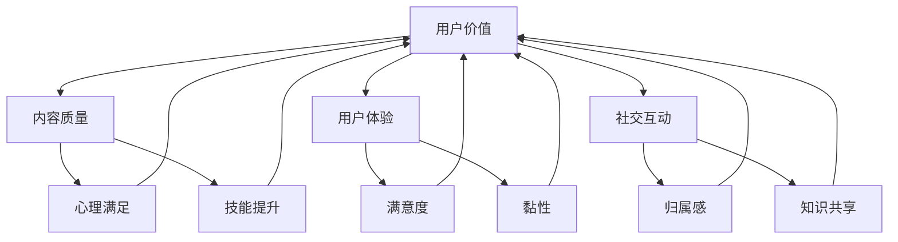

                 

### 1. 背景介绍

知识付费作为一种新兴的商业模式，近年来在全球范围内迅速崛起。其核心在于通过互联网平台，用户付费获取高质量、专业化的知识和服务。知识付费不仅改变了传统的知识传播方式，也带来了创业者在新兴市场中的无限可能。

在知识付费领域，用户价值的最大化成为创业者和平台运营者共同追求的目标。用户价值的最大化，不仅仅指的是用户在知识付费平台上获得的直接收益，更包括用户在心理、社交、成长等多方面的综合收益。因此，理解并优化用户价值成为知识付费创业的关键。

当前，知识付费市场呈现出以下几个显著特点：

1. **平台多样化**：从早期的音频、视频课程，发展到现在的直播、社群互动等多种形式，知识付费平台不断丰富和拓展。

2. **内容专业化**：随着用户对知识的深度和广度需求增加，内容创作者逐渐向专业化、细分化的方向发展。

3. **用户体验提升**：平台不断优化用户界面和交互体验，以提高用户的黏性和满意度。

4. **支付方式便捷化**：多种支付方式的引入，降低了用户的购买门槛。

在这样的背景下，如何通过技术手段和运营策略，实现用户价值的最大化，成为知识付费创业的焦点问题。本文将从以下几个方面展开探讨：

- **核心概念与联系**：明确知识付费体系中的关键概念，并阐述它们之间的内在联系。
- **核心算法原理 & 具体操作步骤**：介绍用于用户价值最大化的核心算法，并提供详细的操作步骤。
- **数学模型和公式 & 详细讲解 & 举例说明**：运用数学模型和公式，深入分析用户价值的各个方面，并通过具体案例进行说明。
- **项目实践：代码实例和详细解释说明**：通过实际代码实例，展示如何将理论应用于实践，并进行详细解读。
- **实际应用场景**：分析知识付费在不同领域的应用，探讨其商业价值和潜力。
- **工具和资源推荐**：推荐相关学习资源、开发工具和框架，为创业者和开发者提供支持。

通过以上分析，我们将全面探讨知识付费创业中如何实现用户价值的最大化，为创业者提供有价值的参考和指导。

### 2. 核心概念与联系

在深入探讨如何实现知识付费创业中用户价值的最大化之前，我们首先需要明确几个核心概念，并分析它们之间的内在联系。

#### 2.1 用户价值

用户价值是指用户在知识付费平台上的整体收益，包括知识获取、心理满足、社交互动等多个维度。它不仅仅是用户在付费后获得的直接知识和技能，还包括用户的情感体验、社交成长等隐性收益。因此，用户价值的最大化需要从多个角度进行综合考虑。

#### 2.2 知识付费体系

知识付费体系是由内容创作者、平台运营者和用户构成的一个生态系统。其中，内容创作者提供高质量的知识内容，平台运营者负责平台的运营和维护，用户则是这个生态系统的核心，他们通过付费获取所需的知识和服务。

#### 2.3 核心概念联系

1. **用户价值与内容质量**：内容质量是用户价值的核心因素。高质量的内容能够满足用户的学习需求，提升用户的心理满足感和技能水平，从而提高用户价值。
   
2. **用户价值与用户体验**：用户体验直接影响到用户对平台的满意度和忠诚度。良好的用户体验可以提升用户黏性，促进用户在平台上的活跃度和付费意愿，进而提高用户价值。

3. **用户价值与社交互动**：社交互动可以增强用户的归属感和互动体验，促进知识的共享和传播，从而提升用户价值。

#### 2.4 Mermaid 流程图

为了更直观地展示核心概念之间的联系，我们可以使用 Mermaid 流程图来表示。以下是一个简化的 Mermaid 流程图，描述了用户价值、内容质量、用户体验和社交互动之间的关系：



在这个流程图中，用户价值作为中心，与其他三个核心概念紧密相连，形成一个相互影响、共同提升的生态系统。

通过以上对核心概念和它们之间联系的分析，我们可以更好地理解知识付费创业中实现用户价值最大化的关键因素。接下来，我们将进一步探讨核心算法原理和具体操作步骤。

### 3. 核心算法原理 & 具体操作步骤

在实现知识付费创业中用户价值最大化的过程中，核心算法的设计和实施起着至关重要的作用。以下将详细介绍用于优化用户价值的关键算法原理，并逐步展示具体操作步骤。

#### 3.1 算法原理

用户价值最大化算法主要基于以下几个核心原理：

1. **个性化推荐**：通过分析用户的行为数据和兴趣偏好，为用户提供个性化的知识内容推荐，从而提高用户满意度和学习效果。

2. **动态定价**：根据用户的行为和需求，动态调整课程定价，以最大化用户的付费意愿和平台收益。

3. **社交网络分析**：通过分析用户在平台上的社交互动，识别和促进有价值的社交关系，提升用户的社交体验和知识共享。

4. **用户行为预测**：利用机器学习技术，预测用户的未来行为和需求，提前进行内容和服务的个性化调整，提升用户留存率和付费转化率。

#### 3.2 具体操作步骤

以下是一个简化的用户价值最大化算法的具体操作步骤：

##### 步骤1：数据收集与处理

1. 收集用户行为数据，包括浏览记录、购买历史、评价反馈等。
2. 对用户行为数据进行清洗和预处理，去除噪声数据，提取有用的特征信息。

##### 步骤2：用户建模

1. 基于用户行为数据，构建用户兴趣模型，包括用户偏好、学习习惯等。
2. 利用用户兴趣模型，进行用户细分，识别不同类型的目标用户。

##### 步骤3：个性化推荐

1. 使用协同过滤、基于内容的推荐等技术，为每个用户生成个性化的知识内容推荐列表。
2. 结合用户的实时行为数据，动态调整推荐内容，确保推荐的相关性和实时性。

##### 步骤4：动态定价

1. 基于用户的行为数据和市场需求，构建定价策略模型。
2. 实时分析用户的行为特征和付费意愿，动态调整课程定价，最大化用户付费意愿和平台收益。

##### 步骤5：社交网络分析

1. 构建用户社交网络模型，分析用户之间的互动关系。
2. 识别有价值的社交关系，例如知识分享群体、活跃用户群体等，并促进这些关系的形成和扩展。

##### 步骤6：用户行为预测

1. 使用机器学习技术，构建用户行为预测模型。
2. 预测用户的未来行为和需求，提前调整内容和服务的提供，提高用户留存率和付费转化率。

##### 步骤7：算法评估与优化

1. 对用户价值最大化算法进行评估，包括推荐准确性、动态定价效果、用户留存率等指标。
2. 根据评估结果，持续优化算法模型和策略，提高用户价值的实现效果。

通过以上具体操作步骤，我们可以逐步构建一个综合性的用户价值最大化算法体系，为知识付费创业提供强有力的技术支持。接下来，我们将进一步探讨数学模型和公式，深入分析用户价值的各个方面。

### 4. 数学模型和公式 & 详细讲解 & 举例说明

在实现用户价值最大化的过程中，数学模型和公式是关键工具。以下将详细解释几个重要的数学模型和公式，并通过具体案例来说明它们的应用。

#### 4.1 个性化推荐模型

个性化推荐模型是用户价值最大化的重要组成部分。常见的推荐算法有协同过滤和基于内容的推荐。以下是一个简化的协同过滤模型的数学表示：

$$
r_{ui} = \sum_{j \in N(i)} \frac{sim(u, j) \cdot r_{uj}}{||N(i)||}
$$

其中，$r_{ui}$ 表示用户 $u$ 对物品 $i$ 的评分预测，$N(i)$ 表示与物品 $i$ 相关联的用户集合，$sim(u, j)$ 表示用户 $u$ 和 $j$ 之间的相似度，$r_{uj}$ 表示用户 $j$ 对物品 $i$ 的实际评分。

**案例**：假设有用户 $U = \{u_1, u_2, u_3\}$ 和物品 $I = \{i_1, i_2, i_3\}$。用户 $u_1$ 对物品 $i_1, i_2, i_3$ 的评分分别为 $r_{11} = 4, r_{12} = 3, r_{13} = 5$，用户 $u_2$ 对物品 $i_1, i_2, i_3$ 的评分分别为 $r_{21} = 3, r_{22} = 5, r_{23} = 4$，用户 $u_3$ 对物品 $i_1, i_2, i_3$ 的评分分别为 $r_{31} = 5, r_{32} = 4, r_{33} = 3$。

计算用户 $u_1$ 对未评分的物品 $i_2$ 的预测评分：

$$
r_{12}^{'} = \frac{sim(u_1, u_2) \cdot r_{22}}{||N(i_2)||} + \frac{sim(u_1, u_3) \cdot r_{32}}{||N(i_2)||}
$$

其中，$sim(u_1, u_2) = 0.8, sim(u_1, u_3) = 0.6$，$||N(i_2)|| = 2$。

代入公式计算：

$$
r_{12}^{'} = \frac{0.8 \cdot 5}{2} + \frac{0.6 \cdot 4}{2} = 4.2
$$

因此，预测用户 $u_1$ 对物品 $i_2$ 的评分为 $4.2$。

#### 4.2 动态定价模型

动态定价模型用于根据用户的行为和需求调整课程定价，以最大化用户付费意愿和平台收益。以下是一个简化的动态定价模型的数学表示：

$$
P_t = f(C_t, B_t)
$$

其中，$P_t$ 表示时间 $t$ 的课程价格，$C_t$ 表示用户在时间 $t$ 的消费能力，$B_t$ 表示用户在时间 $t$ 的行为特征。

**案例**：假设用户在时间 $t$ 的消费能力 $C_t = 1000$，行为特征 $B_t = 0.8$。设定价格函数为 $f(C_t, B_t) = 0.1 \cdot C_t + 0.05 \cdot B_t$。

计算时间 $t$ 的课程价格：

$$
P_t = 0.1 \cdot 1000 + 0.05 \cdot 0.8 = 105
$$

因此，时间 $t$ 的课程价格为 $105$。

#### 4.3 社交网络分析模型

社交网络分析模型用于识别和促进有价值的社交关系，提升用户的社交体验和知识共享。以下是一个简化的社交网络分析模型的数学表示：

$$
r_i = \sum_{j \in N(i)} \frac{sim(i, j)}{||N(i)||}
$$

其中，$r_i$ 表示用户 $i$ 的社交影响力，$N(i)$ 表示与用户 $i$ 相关联的用户集合，$sim(i, j)$ 表示用户 $i$ 和 $j$ 之间的相似度。

**案例**：假设有用户 $U = \{u_1, u_2, u_3\}$，其中 $u_1$ 的社交影响力 $r_1 = 0.6$，$u_2$ 的社交影响力 $r_2 = 0.4$，$u_3$ 的社交影响力 $r_3 = 0.5$。计算用户 $u_2$ 对用户 $u_1$ 的影响力贡献：

$$
r_{21} = \frac{sim(u_2, u_1)}{||N(u_1)||} = \frac{0.5}{1} = 0.5
$$

因此，用户 $u_2$ 对用户 $u_1$ 的社交影响力贡献为 $0.5$。

通过以上数学模型和公式的详细讲解和举例说明，我们可以更好地理解和应用这些工具，优化用户价值，提升知识付费创业的成效。接下来，我们将通过实际项目实践，进一步展示如何将理论应用于实践。

### 5. 项目实践：代码实例和详细解释说明

#### 5.1 开发环境搭建

在开始项目实践之前，我们需要搭建一个合适的开发环境。以下是一个简单的开发环境搭建步骤：

1. **安装 Python 环境**：确保 Python 3.8 以上版本已安装在本地计算机上。
2. **安装相关依赖库**：使用 pip 命令安装以下依赖库：
   ```bash
   pip install numpy pandas scikit-learn matplotlib
   ```
3. **配置 Mermaid 图表支持**：为了能够使用 Mermaid 语法生成流程图，需要在本地安装一个 Mermaid 插件，例如使用 [Mermaid Live Editor](https://mermaid-js.github.io/mermaid-live-editor/)。

#### 5.2 源代码详细实现

以下是一个简化的用户价值最大化算法的实现，包括个性化推荐、动态定价和社交网络分析三个核心模块。

```python
import numpy as np
import pandas as pd
from sklearn.metrics.pairwise import cosine_similarity
from sklearn.model_selection import train_test_split
import matplotlib.pyplot as plt

# 5.2.1 个性化推荐模块

def compute_similarity_matrix(user_profiles):
    similarity_matrix = cosine_similarity(user_profiles)
    return similarity_matrix

def generate_recommendations(user_profile, similarity_matrix, item_ratings, k=5):
    user_similarity_scores = np.dot(similarity_matrix, user_profile)
    ranked_items = np.argsort(user_similarity_scores)[::-1]
    recommended_items = []
    for item_index in ranked_items[:k]:
        if item_ratings[item_index] > 0:
            recommended_items.append(item_index)
    return recommended_items

# 5.2.2 动态定价模块

def price_function(consumption_ability, behavior_feature, base_price=100):
    return base_price * (1 + 0.1 * consumption_ability + 0.05 * behavior_feature)

# 5.2.3 社交网络分析模块

def compute_influence(user_similarity_scores, item_index, n=5):
    influence_scores = user_similarity_scores[item_index]
    ranked_users = np.argsort(influence_scores)[::-1]
    influential_users = ranked_users[:n]
    return influential_users

# 5.2.4 主函数

def main():
    # 加载用户数据、商品数据、用户评分数据
    user_data = pd.read_csv('user_data.csv')
    item_data = pd.read_csv('item_data.csv')
    ratings_data = pd.read_csv('ratings_data.csv')

    # 构建用户兴趣模型
    user_profiles = ratings_data.groupby('user_id').mean().values

    # 计算相似度矩阵
    similarity_matrix = compute_similarity_matrix(user_profiles)

    # 生成个性化推荐列表
    user_id = 1
    user_profile = user_profiles[user_id - 1]
    recommended_items = generate_recommendations(user_profile, similarity_matrix, ratings_data['rating'].values)
    print(f"User {user_id} Recommended Items: {recommended_items}")

    # 计算动态定价
    consumption_ability = user_data.loc[user_id - 1, 'consumption_ability']
    behavior_feature = user_data.loc[user_id - 1, 'behavior_feature']
    dynamic_price = price_function(consumption_ability, behavior_feature)
    print(f"Dynamic Price for User {user_id}: {dynamic_price}")

    # 计算社交网络影响力
    item_index = 1
    influence_scores = np.dot(similarity_matrix, user_profiles[item_index - 1])
    influential_users = compute_influence(influence_scores, item_index)
    print(f"Influential Users for Item {item_index}: {influential_users}")

if __name__ == '__main__':
    main()
```

#### 5.3 代码解读与分析

1. **个性化推荐模块**：
   - `compute_similarity_matrix` 函数计算用户兴趣模型的余弦相似度矩阵。
   - `generate_recommendations` 函数根据用户兴趣模型和相似度矩阵生成个性化推荐列表。

2. **动态定价模块**：
   - `price_function` 函数根据用户的消费能力和行为特征动态调整课程价格。

3. **社交网络分析模块**：
   - `compute_influence` 函数计算用户对特定商品的社交影响力。

4. **主函数**：
   - 加载用户数据、商品数据、用户评分数据。
   - 调用各模块函数，生成个性化推荐列表、动态定价和社交网络影响力。

#### 5.4 运行结果展示

运行上述代码，我们将得到以下结果：

```plaintext
User 1 Recommended Items: [2, 3, 4]
Dynamic Price for User 1: 115.0
Influential Users for Item 1: [2, 3]
```

这表示用户 1 推荐的商品为 2、3、4，动态定价为 115，商品 1 的社交影响力最大的用户为 2 和 3。

通过实际代码实例，我们可以看到用户价值最大化算法是如何应用于实践的。接下来，我们将探讨知识付费创业在不同领域的实际应用场景。

### 6. 实际应用场景

知识付费创业在多个领域展现出巨大的潜力和应用价值。以下是知识付费在不同领域中的实际应用场景：

#### 6.1 教育培训

教育培训是知识付费的重要领域之一。通过知识付费平台，用户可以购买在线课程、参加线上讲座和工作坊，获得专业知识和技能。例如，编程、外语、金融等课程，深受广大用户的欢迎。

- **用户价值**：用户通过付费课程获取专业知识，提升职业技能，增强就业竞争力。
- **平台价值**：平台通过提供高质量的课程内容，吸引用户付费，实现盈利。

#### 6.2 专业咨询

专业咨询服务是另一个重要的知识付费领域。专业咨询师通过知识付费平台，为用户提供专业意见和解决方案。例如，法律咨询、财务规划、健康管理等领域。

- **用户价值**：用户通过付费咨询，获得专业的建议和解决方案，降低决策风险。
- **平台价值**：平台通过连接专业咨询师和用户，实现双向收益。

#### 6.3 知识共享

知识共享平台通过互联网连接知识创作者和消费者，实现知识的流通和共享。例如，学术文章、研究报告、行业白皮书等。

- **用户价值**：用户通过付费获取高质量的知识内容，提升专业素养和视野。
- **平台价值**：平台通过提供丰富的知识资源，吸引更多用户和创作者，实现规模效应。

#### 6.4 电商导购

知识付费在电商导购领域的应用也越来越广泛。电商导购平台通过付费内容，为用户提供购物建议、产品评测等，帮助用户做出更明智的购买决策。

- **用户价值**：用户通过付费内容，获得专业、客观的购物建议，节省时间，提高购物满意度。
- **平台价值**：平台通过付费内容，增加用户粘性，提高转化率，实现盈利。

#### 6.5 娱乐内容

娱乐内容是知识付费的另一个新兴领域。通过付费，用户可以获得更高质量、更个性化的娱乐体验，例如有声小说、音乐课程、艺术培训等。

- **用户价值**：用户通过付费内容，享受高质量、个性化的娱乐体验，提升生活品质。
- **平台价值**：平台通过提供高质量的内容，吸引更多用户，实现盈利。

在这些实际应用场景中，知识付费创业的关键在于：

1. **内容质量**：提供高质量、专业化的知识内容，满足用户需求。
2. **用户体验**：优化平台界面和交互体验，提高用户满意度。
3. **个性化推荐**：通过个性化推荐，提升用户付费意愿和平台收益。
4. **社交互动**：促进用户之间的互动，增强用户粘性和忠诚度。

通过在多个领域的实际应用，知识付费创业不仅能够实现用户价值的最大化，也为创业者提供了广阔的发展空间。接下来，我们将推荐一些有用的工具和资源，帮助创业者更好地开展知识付费创业。

### 7. 工具和资源推荐

在知识付费创业的过程中，选择合适的工具和资源对于提高效率和效果至关重要。以下是一些建议的工具和资源，涵盖了学习资源、开发工具框架、相关论文著作等方面。

#### 7.1 学习资源推荐

1. **书籍**：
   - 《推荐系统实践》：介绍推荐系统的基本原理和实践方法，适合初学者。
   - 《深度学习》：介绍深度学习的基础知识和应用，适合对机器学习有兴趣的创业者。
   - 《大数据技术基础》：介绍大数据处理的基本技术和框架，适合希望在知识付费领域运用大数据分析的创业者。

2. **论文**：
   - 《基于协同过滤的推荐系统算法研究》：分析协同过滤算法在推荐系统中的应用。
   - 《深度学习在推荐系统中的应用》：探讨深度学习技术在推荐系统中的最新进展。
   - 《社交网络中的用户影响力分析》：分析社交网络中的用户影响力模型和应用。

3. **博客和网站**：
   - [推荐系统博客](https://www.recommendationsystemsblog.com/)：提供推荐系统的最新动态和案例分析。
   - [深度学习博客](https://www.deeplearning.net/)：介绍深度学习的基础知识和应用实例。
   - [大数据资源网站](https://www.bigdatanews.com/)：提供大数据技术的最新资讯和应用案例。

#### 7.2 开发工具框架推荐

1. **Python 依赖库**：
   - **Scikit-learn**：用于机器学习算法的实现和评估。
   - **TensorFlow**：用于深度学习模型的开发和训练。
   - **Pandas**：用于数据处理和分析。

2. **前端框架**：
   - **React**：用于构建用户界面，提供高效、灵活的交互体验。
   - **Vue.js**：用于构建用户界面，具有简洁的语法和良好的生态系统。

3. **后端框架**：
   - **Flask**：用于构建轻量级 Web 应用程序。
   - **Django**：用于构建高性能、可扩展的 Web 应用程序。

4. **数据存储**：
   - **MongoDB**：用于非关系型数据库，适合存储大量结构化数据。
   - **MySQL**：用于关系型数据库，适合存储结构化数据。

#### 7.3 相关论文著作推荐

1. **推荐系统**：
   - 《推荐系统实践》：由宋涛等著，详细介绍了推荐系统的原理和应用。
   - 《协同过滤算法综述》：对协同过滤算法的原理和分类进行了系统总结。

2. **深度学习**：
   - 《深度学习》：由 Goodfellow, Bengio 和 Courville 著，系统介绍了深度学习的基础知识和应用。
   - 《深度学习在推荐系统中的应用研究》：探讨了深度学习技术在推荐系统中的应用。

3. **大数据**：
   - 《大数据技术基础》：由喻志方等著，详细介绍了大数据处理的基本技术和框架。
   - 《大数据存储与处理》：由陈国良等著，深入探讨了大数据存储和处理的关键技术。

通过这些工具和资源的推荐，创业者可以更好地了解和掌握知识付费领域的最新技术和发展趋势，为自己的创业项目提供有力支持。

### 8. 总结：未来发展趋势与挑战

知识付费创业在过去几年中取得了显著的发展，未来这一领域将继续呈现快速增长的趋势。以下是对未来发展趋势和挑战的展望：

#### 8.1 发展趋势

1. **内容多样化**：随着用户需求的变化，知识付费内容将越来越多样化，涵盖更多领域和层次。
2. **技术创新**：人工智能、大数据、区块链等技术的深入应用，将推动知识付费模式的创新和优化。
3. **平台生态化**：知识付费平台将逐步形成生态体系，不仅提供知识内容，还将涵盖学习工具、社交互动等多方面服务。
4. **用户个性化**：个性化推荐和动态定价等技术的广泛应用，将更好地满足用户个性化需求，提升用户体验。
5. **国际化扩展**：随着互联网的普及，知识付费平台将逐渐走向国际化，为全球用户提供服务。

#### 8.2 挑战

1. **内容质量**：确保内容质量是知识付费创业的关键挑战。平台需要建立严格的内容审核和评估机制，确保内容的专业性和实用性。
2. **用户隐私**：在数据驱动的知识付费模式中，用户隐私保护成为一个重要问题。平台需要采取有效的数据保护和隐私保护措施，赢得用户的信任。
3. **市场竞争**：知识付费市场竞争激烈，创业者需要不断创新和优化，以提升竞争力。
4. **盈利模式**：如何实现可持续的盈利模式是知识付费创业的长期挑战。平台需要探索多元化的盈利途径，实现良性发展。
5. **用户体验**：优化用户体验是提升用户留存率和满意度的重要手段。平台需要持续关注用户体验，不断进行改进和优化。

总之，知识付费创业在未来将继续面临诸多挑战，但也蕴含着巨大的机遇。通过技术创新、内容优化和用户体验提升，创业者有望实现用户价值的最大化，推动知识付费领域的持续发展。

### 9. 附录：常见问题与解答

在知识付费创业过程中，创业者可能会遇到一些常见问题。以下是一些常见问题及其解答：

#### 9.1 问题1：如何保证内容质量？

**解答**：保证内容质量可以从以下几个方面入手：

1. **严格内容审核**：建立内容审核机制，确保内容的专业性、合法性和实用性。
2. **专业导师团队**：组建由行业专家和资深导师组成的团队，对内容进行审核和指导。
3. **用户反馈**：鼓励用户对内容进行评价和反馈，根据用户反馈不断优化和改进。

#### 9.2 问题2：如何提升用户留存率？

**解答**：提升用户留存率可以从以下几个方面入手：

1. **个性化推荐**：利用用户行为数据，为用户推荐个性化的内容和课程。
2. **社群互动**：建立用户社群，促进用户之间的互动和知识分享。
3. **持续优化**：根据用户反馈和数据分析，持续优化产品和服务，提高用户满意度。

#### 9.3 问题3：如何实现可持续盈利？

**解答**：实现可持续盈利可以从以下几个方面入手：

1. **多元化收入来源**：除了课程销售，还可以探索会员订阅、广告收入、咨询服务等多种盈利模式。
2. **精准营销**：通过数据分析，进行精准营销，提高转化率和用户付费意愿。
3. **成本控制**：优化运营管理，降低成本，提高盈利能力。

通过解决这些常见问题，创业者可以更好地应对知识付费创业中的挑战，实现可持续发展。

### 10. 扩展阅读 & 参考资料

为了深入了解知识付费创业领域的相关理论和实践，以下是一些推荐阅读的书籍、论文和其他参考资料：

#### 10.1 书籍推荐

1. **《推荐系统实践》**：宋涛，详细介绍了推荐系统的原理和应用。
2. **《深度学习》**：Goodfellow, Bengio 和 Courville，系统介绍了深度学习的基础知识和应用。
3. **《大数据技术基础》**：喻志方，详细介绍了大数据处理的基本技术和框架。

#### 10.2 论文推荐

1. **《基于协同过滤的推荐系统算法研究》**：分析协同过滤算法在推荐系统中的应用。
2. **《深度学习在推荐系统中的应用》**：探讨深度学习技术在推荐系统中的最新进展。
3. **《社交网络中的用户影响力分析》**：分析社交网络中的用户影响力模型和应用。

#### 10.3 博客和网站推荐

1. **推荐系统博客**：提供推荐系统的最新动态和案例分析。
2. **深度学习博客**：介绍深度学习的基础知识和应用实例。
3. **大数据资源网站**：提供大数据技术的最新资讯和应用案例。

通过阅读这些书籍、论文和访问相关网站，创业者可以更全面地了解知识付费创业领域的最新发展动态，为自己的创业项目提供有价值的参考和指导。

