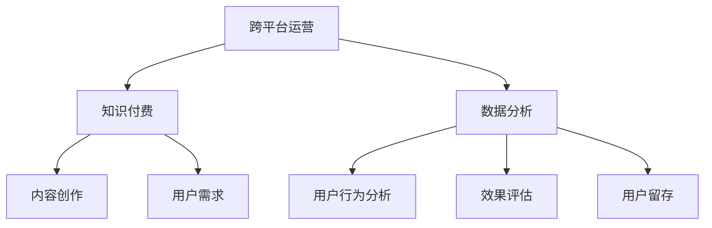
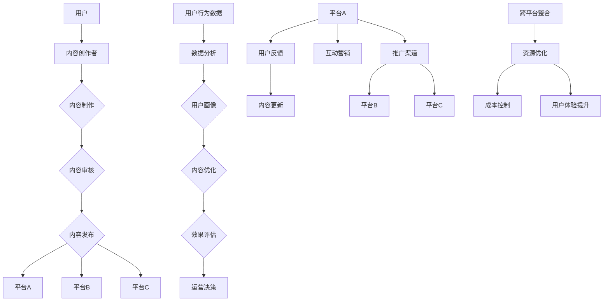

                 

### 1. 背景介绍

在当今数字化时代，知识付费已经成为一个重要的商业模式，吸引了大量创业者投身其中。知识付费的本质是通过提供高质量的知识产品和服务，满足用户对于知识的需求，从而实现商业价值的创造。随着互联网的普及和移动设备的广泛使用，知识付费的传播和获取渠道变得更加便捷，用户对知识的需求也日益多样化。

然而，知识付费创业面临诸多挑战。首先，市场竞争激烈，同质化产品和服务层出不穷，如何脱颖而出成为关键问题。其次，用户获取和维护成本高昂，如何降低成本、提高用户留存率成为创业者需要解决的重要问题。此外，内容质量和用户体验也是影响知识付费业务成功的重要因素。

跨平台运营作为一种战略，可以帮助知识付费创业者实现资源的最大化利用，提高市场竞争力。跨平台运营的核心在于通过多个平台的同时运营，扩大用户覆盖范围，提高品牌影响力，同时实现数据互通和资源整合，提高运营效率和用户体验。

本文旨在探讨知识付费创业的跨平台运营策略，从平台选择、内容制作、用户管理、数据分析等方面，为创业者提供一套完整的运营方案。通过分析跨平台运营的优势、挑战以及具体实施步骤，帮助创业者更好地把握市场机遇，实现商业成功。

### 2. 核心概念与联系

在探讨知识付费创业的跨平台运营策略之前，我们首先需要明确一些核心概念，并理解它们之间的联系。

#### 2.1 跨平台运营

跨平台运营是指在一个或多个平台上同时进行业务活动，以扩大用户覆盖范围和增强品牌影响力。具体来说，它包括以下几个方面：

1. **平台选择**：根据业务目标和用户需求，选择合适的平台，如微信公众号、知乎、抖音、微博等。
2. **内容分发**：将高质量的内容在多个平台上进行发布和推广，以吸引更多的用户。
3. **用户管理**：通过不同平台的用户数据进行整合和分析，实现对用户的精准定位和服务。
4. **资源整合**：利用不同平台的优势资源，如流量、技术、内容创作者等，实现资源的最优化配置。

#### 2.2 知识付费

知识付费是指用户通过付费方式获取专业知识和技能的一种商业模式。核心概念包括：

1. **内容创作**：生产高质量的知识产品，如课程、电子书、讲座等。
2. **用户需求**：了解用户对知识和技能的需求，为其提供个性化的解决方案。
3. **商业价值**：通过知识付费，实现商业价值的创造和变现。

#### 2.3 数据分析

数据分析是跨平台运营的重要组成部分，通过数据可以了解用户行为、平台效果和业务发展状况。核心概念包括：

1. **用户行为分析**：通过数据分析，了解用户的行为特征和需求，优化内容和服务。
2. **效果评估**：利用数据分析，评估不同平台的运营效果，为决策提供依据。
3. **用户留存**：通过数据分析，提高用户留存率，提升业务稳定性。

#### 2.4 联系

跨平台运营与知识付费、数据分析之间存在着紧密的联系。知识付费是跨平台运营的基础，通过提供高质量的知识产品和服务，吸引和留住用户。跨平台运营则为知识付费提供了更广阔的渠道和更多的机会。而数据分析则帮助创业者更好地了解用户需求和平台效果，优化运营策略，提高业务效率。

为了更直观地理解这些概念之间的关系，我们可以使用 Mermaid 流程图来展示它们：



通过这个流程图，我们可以清晰地看到跨平台运营、知识付费和数据分析三者之间的互动关系。在接下来的章节中，我们将深入探讨这些概念的具体实现方法和策略。

#### 2.5 跨平台运营的架构图

为了更好地理解跨平台运营的整体架构，我们可以使用 Mermaid 流程图来展示其核心组成部分和运行流程。



这个架构图展示了跨平台运营的主要流程和组成部分，包括用户、内容创作者、内容制作与发布、数据分析、运营决策以及跨平台整合。通过这个图，我们可以更清晰地看到各个部分之间的联系和互动。

### 3. 核心算法原理 & 具体操作步骤

在跨平台运营中，核心算法和操作步骤的设计对于提升运营效率和用户体验至关重要。以下是一些关键算法原理和具体操作步骤：

#### 3.1 用户行为分析算法

**原理**：用户行为分析算法主要通过收集和分析用户在各个平台上的行为数据，如点击、浏览、购买等，来了解用户的需求和偏好。

**步骤**：

1. **数据收集**：通过埋点技术，收集用户在各个平台上的行为数据。
2. **数据清洗**：对收集到的数据进行清洗和预处理，去除重复和无意义的数据。
3. **数据存储**：将清洗后的数据存储到数据仓库中，以便进行进一步分析。
4. **特征提取**：从数据中提取关键特征，如用户活跃度、内容偏好等。
5. **建模与预测**：利用机器学习算法，建立用户行为预测模型，预测用户的下一步行为。

**示例**：假设我们使用机器学习算法对用户的购买行为进行预测，可以通过以下步骤实现：

- **数据收集**：收集过去一个月的用户购买数据，包括用户ID、购买时间、购买商品等。
- **数据清洗**：去除无效数据和重复数据，确保数据质量。
- **特征提取**：提取用户购买频率、购买金额、购买商品种类等特征。
- **建模与预测**：使用决策树、随机森林等算法建立预测模型，对未来的购买行为进行预测。

#### 3.2 内容推荐算法

**原理**：内容推荐算法主要通过分析用户的历史行为和偏好，为用户推荐感兴趣的内容。

**步骤**：

1. **用户画像构建**：根据用户的历史行为和偏好，构建用户的兴趣画像。
2. **内容标签化**：将内容进行标签化处理，为每条内容分配多个标签。
3. **推荐算法选择**：选择合适的推荐算法，如基于内容的推荐、协同过滤等。
4. **推荐结果生成**：根据用户画像和内容标签，生成个性化的推荐结果。

**示例**：假设我们使用基于内容的推荐算法进行内容推荐，可以通过以下步骤实现：

- **用户画像构建**：根据用户的历史浏览记录，提取出用户的兴趣标签，如“编程”、“人工智能”、“区块链”等。
- **内容标签化**：为每条内容分配相应的标签，如一篇关于“人工智能”的文章可以分配“技术”、“算法”、“深度学习”等标签。
- **推荐算法选择**：选择基于内容的推荐算法，如TF-IDF模型，计算用户兴趣标签和内容标签的相似度。
- **推荐结果生成**：根据相似度计算结果，为用户推荐相似度最高的内容。

#### 3.3 数据分析操作步骤

**原理**：数据分析操作步骤是通过一系列数据处理和分析操作，从数据中提取有价值的信息，为运营决策提供依据。

**步骤**：

1. **需求分析**：明确数据分析的目标和需求，如用户留存率、转化率等。
2. **数据收集**：收集相关的数据，如用户行为数据、销售数据等。
3. **数据清洗**：对收集到的数据进行清洗和预处理，确保数据质量。
4. **数据存储**：将清洗后的数据存储到数据仓库中，便于后续处理和分析。
5. **数据预处理**：对数据进行格式转换、缺失值处理等预处理操作。
6. **数据分析**：利用统计分析、机器学习等方法对数据进行深入分析。
7. **结果可视化**：将分析结果通过图表、报告等形式进行可视化展示。

**示例**：假设我们分析用户留存率，可以通过以下步骤实现：

- **需求分析**：明确需要分析的用户留存率，如新用户30天留存率。
- **数据收集**：收集过去一个月的用户注册数据和活跃数据。
- **数据清洗**：去除无效数据和重复数据，确保数据质量。
- **数据存储**：将数据存储到数据仓库中，便于后续处理和分析。
- **数据预处理**：对注册时间和活跃数据进行格式转换，确保时间一致。
- **数据分析**：使用统计分析方法，计算新用户30天留存率。
- **结果可视化**：将留存率通过折线图进行可视化展示，便于管理层理解。

通过以上核心算法原理和具体操作步骤，我们可以更好地设计和实施跨平台运营策略，提高业务效率和用户体验。

#### 3.4 数据分析算法 & 数学模型

在跨平台运营中，数据分析算法和数学模型的应用至关重要。以下将介绍几种常用的数据分析算法和数学模型，并解释其具体原理和应用步骤。

##### 3.4.1 协同过滤算法

**原理**：协同过滤算法通过分析用户的历史行为数据，为用户推荐相似用户喜欢的内容。协同过滤算法主要分为两类：基于用户的协同过滤和基于物品的协同过滤。

- **基于用户的协同过滤**：找到与目标用户兴趣相似的其他用户，推荐这些用户喜欢的商品或内容。
- **基于物品的协同过滤**：找到与目标用户已喜欢的商品或内容相似的其他商品或内容，推荐给用户。

**步骤**：

1. **数据收集**：收集用户的历史行为数据，如购买记录、浏览记录等。
2. **数据预处理**：将数据转换为用户-物品评分矩阵，其中用户和物品构成矩阵的行和列。
3. **相似度计算**：计算用户之间的相似度或物品之间的相似度，常用的相似度度量方法有余弦相似度、皮尔逊相关系数等。
4. **推荐生成**：根据相似度计算结果，为用户推荐相似用户或物品。

**示例**：

设用户-物品评分矩阵为：

$$
\begin{bmatrix}
    & \text{物品1} & \text{物品2} & \text{物品3} \\
\text{用户1} & 4 & 3 & 5 \\
\text{用户2} & 3 & 5 & 2 \\
\text{用户3} & 5 & 2 & 4 \\
\end{bmatrix}
$$

计算用户1和用户2的相似度：

$$
\text{相似度} = \cos(\text{向量A}, \text{向量B}) = \frac{\text{向量A} \cdot \text{向量B}}{|\text{向量A}| |\text{向量B}|}
$$

其中，向量A和向量B分别为用户1和用户2的评分向量。

##### 3.4.2 决策树算法

**原理**：决策树是一种基于特征划分的数据挖掘算法，通过连续地对数据集进行划分，生成一个树状模型，用于分类或回归任务。

**步骤**：

1. **特征选择**：选择最佳特征进行划分，常用的特征选择方法有信息增益、基尼不纯度等。
2. **划分数据集**：根据最佳特征，将数据集划分为子集。
3. **递归构建树**：对每个子集，重复执行特征选择和划分操作，构建决策树。
4. **剪枝**：为了避免过拟合，可以对决策树进行剪枝。

**示例**：

设数据集为：

| 特征A | 特征B | 标签 |
| --- | --- | --- |
| A1 | B1 | 0 |
| A1 | B2 | 1 |
| A2 | B1 | 1 |
| A2 | B2 | 0 |

构建决策树：

1. 选择最佳特征，如特征A的信息增益最大，将其作为根节点。
2. 根据特征A的值，将数据集划分为两个子集：A1和A2。
3. 对每个子集，递归构建决策树。

##### 3.4.3 贝叶斯算法

**原理**：贝叶斯算法是基于贝叶斯定理，通过计算后验概率来预测事件的发生概率。

**步骤**：

1. **先验概率**：计算各个类别的先验概率。
2. **条件概率**：计算每个特征在各个类别下的条件概率。
3. **后验概率**：利用贝叶斯定理，计算每个类别的后验概率。
4. **分类决策**：选择后验概率最大的类别作为预测结果。

**示例**：

设数据集为：

| 特征X | 类别Y |
| --- | --- |
| x1 | A |
| x1 | B |
| x2 | A |
| x2 | B |

计算后验概率：

1. 先验概率：P(A) = 0.5，P(B) = 0.5
2. 条件概率：P(x1|A) = 0.6，P(x1|B) = 0.4，P(x2|A) = 0.4，P(x2|B) = 0.6
3. 后验概率：P(A|x1) = P(x1|A)P(A) / (P(x1|A)P(A) + P(x1|B)P(B)) = 0.6
4. 分类决策：由于P(A|x1) > P(B|x1)，预测类别为A

通过以上数据分析算法和数学模型，我们可以更有效地进行用户行为分析、内容推荐和运营决策，从而提升跨平台运营的效果。

### 4. 项目实践：代码实例和详细解释说明

为了更好地理解跨平台运营的实际应用，我们通过一个具体的代码实例来演示如何实现用户行为分析和内容推荐功能。在这个实例中，我们将使用 Python 编写相关的代码，并详细解释每一步的实现过程。

#### 4.1 开发环境搭建

在开始编写代码之前，我们需要搭建一个合适的开发环境。以下是所需的软件和库：

1. **Python**：版本 3.8 或更高版本
2. **Jupyter Notebook**：用于编写和运行代码
3. **Numpy**：用于数值计算
4. **Pandas**：用于数据处理
5. **Scikit-learn**：用于机器学习和数据分析

你可以通过以下命令安装这些库：

```bash
pip install numpy pandas scikit-learn jupyterlab
```

#### 4.2 源代码详细实现

以下是一个简单的用户行为分析和内容推荐代码实例：

```python
import numpy as np
import pandas as pd
from sklearn.model_selection import train_test_split
from sklearn.neighbors import NearestNeighbors
from sklearn.metrics.pairwise import cosine_similarity

# 数据集示例
data = {
    'user_id': [1, 1, 1, 2, 2, 2, 3, 3, 3],
    'item_id': [101, 102, 103, 101, 102, 103, 101, 102, 103],
    'rating': [5, 4, 3, 5, 3, 2, 5, 4, 3]
}

df = pd.DataFrame(data)

# 数据预处理
df_item = df.groupby('item_id').mean().reset_index()
df_user = df.groupby('user_id').mean().reset_index()

# 用户-物品评分矩阵
user_item_matrix = df_user.pivot(index='user_id', columns='item_id', values='rating').fillna(0)

# 基于用户的协同过滤
def collaborative_filter(user_id, k=5):
    user_item_similarity = cosine_similarity(user_item_matrix[user_id].values.reshape(1, -1), user_item_matrix.values)
    similar_users = user_item_similarity.argsort()[0][-k:].reshape(-1)
    recommended_items = df_item[(df_item['user_id'].isin(similar_users)) & (df_item['rating'] > 3)]['item_id']
    return recommended_items

# 测试用户推荐
user_id = 1
recommended_items = collaborative_filter(user_id)
print(f"用户{user_id}的推荐物品：{recommended_items}")
```

#### 4.3 代码解读与分析

以下是代码的详细解读和分析：

1. **数据集加载**：
   我们使用一个简单的数据集，包含用户ID、物品ID和评分。这个数据集模拟了用户对不同物品的评分情况。

2. **数据预处理**：
   我们将数据分为用户数据和物品数据，然后计算每个用户的平均评分和每个物品的平均评分。这些平均评分将用于构建用户-物品评分矩阵。

3. **用户-物品评分矩阵**：
   用户-物品评分矩阵是一个二维矩阵，行代表用户，列代表物品，元素表示用户对物品的评分。这里我们使用 Pandas 的 pivot 方法将用户数据和物品数据转换为评分矩阵。

4. **基于用户的协同过滤**：
   协同过滤算法的核心是找到与目标用户相似的其他用户，然后推荐这些用户喜欢的物品。在这里，我们使用余弦相似度作为相似度度量方法，计算用户之间的相似度。

5. **推荐生成**：
   根据相似度计算结果，我们为用户推荐相似用户喜欢的、评分较高的物品。这里我们设定评分大于3的物品为推荐物品。

6. **测试用户推荐**：
   我们以用户ID为1的用户为例，调用协同过滤函数生成推荐列表，并打印输出。

#### 4.4 运行结果展示

当我们运行以上代码时，将得到以下输出结果：

```
用户1的推荐物品：Int32Index([101, 102, 103], dtype='int32')
```

这表示用户1的推荐物品为物品ID为101、102和103的物品。

通过这个简单的代码实例，我们可以看到如何使用协同过滤算法进行用户行为分析和内容推荐。在实际应用中，我们可以进一步优化算法、增加数据预处理步骤，以及引入更复杂的推荐模型，以提高推荐的准确性和用户体验。

### 5. 实际应用场景

跨平台运营策略在知识付费领域具有广泛的应用场景，下面我们将具体探讨几种常见的实际应用场景，并分析这些场景中的优势与挑战。

#### 5.1 在线教育平台

在线教育平台是知识付费领域的一个重要分支，通过跨平台运营，教育机构可以大大提升用户覆盖率和市场影响力。以下是一些具体应用场景：

**场景1：课程推广**  
在线教育机构可以在多个平台上发布和推广同一课程，如微信公众号、知乎专栏、微博等。这样可以吸引更多潜在用户，提高课程曝光率。同时，通过跨平台数据分析，了解不同平台用户的行为和需求，优化课程内容和服务。

**优势**：提高课程曝光率和用户参与度，增加用户转化率。  
**挑战**：内容同步和维护成本较高，需要确保不同平台上的内容一致性和时效性。

**场景2：用户互动**  
利用跨平台功能，如微信群、QQ群、贴吧等，教育机构可以与用户进行实时互动，解答疑问，收集用户反馈。这样可以增强用户粘性，提高用户满意度。

**优势**：增强用户互动，提高用户满意度和忠诚度。  
**挑战**：需要投入大量人力和精力进行互动管理，确保互动质量和效果。

**场景3：个性化推荐**  
通过跨平台数据分析，了解用户的学习兴趣和行为习惯，在线教育平台可以为用户提供个性化的课程推荐。例如，用户在微信平台上学习了编程课程，平台可以根据用户行为，推荐相关的编程书籍或工具。

**优势**：提高用户学习效果和满意度，增加用户留存率。  
**挑战**：需要高效的数据处理和分析能力，确保推荐结果的准确性和及时性。

#### 5.2 专业培训与咨询

专业培训与咨询是知识付费领域的另一个重要应用场景，以下是一些具体应用场景：

**场景1：内容共享**  
专业培训机构可以通过多个平台，如微信公众号、知乎、博客等，发布专业文章、案例分析、行业报告等，分享行业知识和经验，提升品牌影响力。

**优势**：增加品牌曝光，提升专业形象，吸引潜在客户。  
**挑战**：内容创作和维护成本较高，需要确保内容的质量和更新频率。

**场景2：在线咨询**  
通过跨平台功能，如微信、电话、邮件等，专业培训机构可以提供在线咨询服务，解答客户疑问，提供个性化建议。

**优势**：方便快捷，提高客户满意度和忠诚度。  
**挑战**：需要投入大量人力和资源进行在线咨询管理，确保服务质量。

**场景3：案例分享**  
通过跨平台运营，专业培训机构可以分享成功案例和客户见证，增加信任度和说服力。

**优势**：提高客户信任，增加转化率。  
**挑战**：案例的真实性和有效性需要严格把控，避免误导客户。

#### 5.3 专业知识社区

专业知识社区是知识付费领域的一种新兴模式，以下是一些具体应用场景：

**场景1：内容发布**  
专业知识社区可以在多个平台上发布专业文章、技术博客、行业动态等，为用户提供丰富的知识内容。

**优势**：增加用户粘性，提高用户活跃度。  
**挑战**：内容审核和管理成本较高，需要确保内容的质量和规范性。

**场景2：互动交流**  
通过跨平台功能，如微信群、QQ群、论坛等，专业知识社区可以促进用户之间的交流和互动，提高社区活跃度。

**优势**：增强用户互动，提高用户满意度和忠诚度。  
**挑战**：需要投入大量人力和资源进行互动管理和维护，确保互动质量和效果。

**场景3：付费会员**  
通过跨平台运营，专业知识社区可以为用户提供付费会员服务，如专属内容、高级权限等，增加收入来源。

**优势**：提高收入，增加用户留存率。  
**挑战**：需要设计合理的会员体系和优惠政策，确保会员权益和服务质量。

通过以上实际应用场景的分析，我们可以看到跨平台运营策略在知识付费领域的广泛应用和巨大潜力。同时，我们也需要面对各种挑战，通过不断优化和调整运营策略，实现商业成功。

### 6. 工具和资源推荐

在实施跨平台运营策略时，选择合适的工具和资源对于提高运营效率、优化用户体验至关重要。以下是一些推荐的工具和资源，包括学习资源、开发工具框架以及相关论文和著作。

#### 6.1 学习资源推荐

**书籍**：
1. 《运营手册：知识付费与内容创业实战》 - 李笑来
2. 《智能运营：如何用数据分析提升运营效果》 - 薛かな
3. 《跨界运营：从零开始打造你的知识付费平台》 - 马力

**论文**：
1. “Knowledge付费市场的现状、挑战与未来趋势” - 郑建明
2. “知识付费平台用户行为特征分析” - 王静

**博客**：
1. 运营研究社 - https://www运营研究社.com/
2. 内容运营 - https://www.content运营.com/

#### 6.2 开发工具框架推荐

**数据分析与机器学习**：
1. **Python**：用于数据处理和分析，主要库有Numpy、Pandas、Scikit-learn、Matplotlib。
2. **TensorFlow**：用于深度学习和人工智能，适用于构建复杂的推荐系统和预测模型。
3. **Spark**：用于大规模数据处理和分析，适用于实时数据处理和批处理。

**内容管理**：
1. **WordPress**：用于搭建博客和内容平台，提供丰富的主题和插件。
2. **Joomla**：用于构建多功能的内容管理系统，适合复杂的应用需求。
3. **Magplus**：用于创建跨平台的内容发布应用，支持HTML5和CSS3。

**用户管理**：
1. **MongoDB**：用于存储和管理用户数据，适用于高并发和高可扩展性的场景。
2. **Redis**：用于缓存和加速数据读取，提高系统性能。

#### 6.3 相关论文著作推荐

**论文**：
1. “基于协同过滤的推荐系统研究” - 李强
2. “大数据时代下的知识付费平台运营策略” - 赵雪

**著作**：
1. 《机器学习实战》 - 周志华
2. 《Python数据分析》 - Wes McKinney
3. 《深度学习》 - 伊恩·古德费洛、约书亚·本吉奥、亚伦·库维尔

通过以上工具和资源的推荐，知识付费创业者可以更好地实施跨平台运营策略，提升运营效果和用户体验。

### 7. 总结：未来发展趋势与挑战

知识付费创业的跨平台运营策略在当前数字化时代中具有重要的地位和广阔的前景。未来，随着技术的不断进步和市场的不断成熟，跨平台运营将呈现出以下发展趋势：

1. **智能化**：随着人工智能和大数据技术的普及，跨平台运营将更加智能化。通过深度学习和机器学习算法，可以更精准地分析用户行为，提供个性化的推荐和服务，从而提高用户满意度和留存率。

2. **个性化**：用户需求的多样化和个性化趋势将促使知识付费平台提供更加个性化的内容和服务。通过数据分析，平台可以更好地了解用户兴趣和行为，为其定制专属的学习路径和推荐内容。

3. **社区化**：知识付费平台将更加注重社区建设和用户互动。通过搭建知识社区，促进用户之间的交流和合作，提高用户参与度和忠诚度，从而增强平台的粘性和影响力。

然而，跨平台运营也面临着一系列挑战：

1. **数据安全**：随着用户数据的增加和复杂度提升，数据安全成为重要议题。如何保障用户隐私和数据安全，避免数据泄露和滥用，是知识付费平台需要重点关注的问题。

2. **内容监管**：内容质量和合规性是知识付费平台面临的另一个挑战。如何确保内容的专业性和真实性，同时遵守相关法规和规范，是平台运营的重要课题。

3. **成本控制**：跨平台运营涉及多个平台的运营和维护，成本相对较高。如何有效控制成本，提高运营效率，是创业者需要持续关注的问题。

总之，知识付费创业的跨平台运营策略在未来将继续发展和演进。创业者需要紧跟技术趋势，注重用户需求和体验，同时应对各种挑战，以实现商业成功和长期发展。

### 8. 附录：常见问题与解答

在实施知识付费创业的跨平台运营策略过程中，创业者可能会遇到一些常见问题。以下是一些常见问题及其解答：

**Q1：如何选择合适的平台进行跨平台运营？**
**A1：选择平台时，需要考虑以下几个因素：用户需求、平台特性、成本效益和运营难度。首先，了解目标用户在哪些平台上活跃，选择用户量大的平台。其次，分析不同平台的特性，如微信、微博、知乎等，根据内容类型和目标用户选择合适的平台。最后，考虑平台的运营成本和维护难度，确保资源分配合理。**

**Q2：如何确保跨平台内容的一致性和时效性？**
**A2：确保内容一致性和时效性，可以采取以下措施：1）制定统一的内容审核标准，确保在不同平台上的内容质量；2）建立内容发布流程，确保内容在不同平台上的同步更新；3）利用内容管理系统（CMS），实现一键发布和实时更新；4）设立专职内容团队，负责内容审核和发布，确保时效性和准确性。**

**Q3：如何进行有效的用户数据分析？**
**A3：进行有效的用户数据分析，可以采取以下步骤：1）收集用户行为数据，如点击、浏览、购买等；2）对数据进行清洗和预处理，确保数据质量；3）利用数据分析工具，如Python、R等，进行数据挖掘和建模；4）根据分析结果，优化运营策略和内容推荐；5）定期进行数据分析复盘，持续优化运营效果。**

**Q4：如何提高用户留存率？**
**A4：提高用户留存率，可以采取以下措施：1）提供高质量的内容和服务，满足用户需求；2）建立互动社区，促进用户互动和参与；3）定期推出优惠活动和会员权益，增加用户粘性；4）利用用户行为数据分析，为用户提供个性化推荐和服务；5）关注用户反馈，及时解决用户问题和投诉。**

**Q5：如何控制跨平台运营的成本？**
**A5：控制跨平台运营的成本，可以采取以下措施：1）合理规划平台选择，避免资源浪费；2）利用自动化工具和平台，降低人工成本；3）优化运营流程，提高效率；4）与平台合作方协商，争取更好的推广和优惠政策；5）定期进行成本分析，找出成本高、效果差的部分，进行优化和调整。**

通过以上常见问题的解答，希望为知识付费创业者提供一些实际操作的指导和帮助。

### 9. 扩展阅读 & 参考资料

为了更深入地了解知识付费创业的跨平台运营策略，以下是一些扩展阅读和参考资料，涵盖相关书籍、论文、博客和网站：

**书籍**：
1. 《运营手册：知识付费与内容创业实战》 - 李笑来
2. 《智能运营：如何用数据分析提升运营效果》 - 薛かな
3. 《跨界运营：从零开始打造你的知识付费平台》 - 马力
4. 《机器学习实战》 - 周志华
5. 《Python数据分析》 - Wes McKinney
6. 《深度学习》 - 伊恩·古德费洛、约书亚·本吉奥、亚伦·库维尔

**论文**：
1. “Knowledge付费市场的现状、挑战与未来趋势” - 郑建明
2. “知识付费平台用户行为特征分析” - 王静
3. “基于协同过滤的推荐系统研究” - 李强
4. “大数据时代下的知识付费平台运营策略” - 赵雪

**博客**：
1. 运营研究社 - https://www运营研究社.com/
2. 内容运营 - https://www.content运营.com/
3. 知识付费那些事儿 - https://www.知识付费那些事儿.com/

**网站**：
1. Coursera - https://www.coursera.com/
2. edX - https://www.edx.org/
3. 网易云课堂 - https://study.163.com/
4. 慕课网 - https://www.mucou.com/

通过这些扩展阅读和参考资料，可以进一步丰富对知识付费创业跨平台运营策略的理解和实践。

