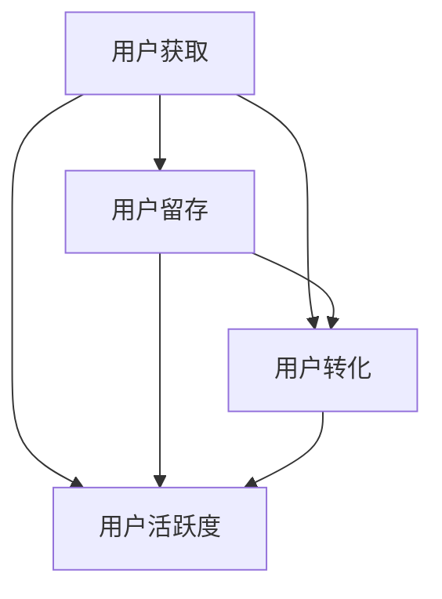

                 

### 1. 背景介绍

知识付费平台，作为一种新兴的在线教育模式，近年来在全球范围内迅速崛起。这类平台通过提供高质量的课程内容、专业咨询和互动学习体验，吸引了大量的用户。然而，随着市场逐渐趋于饱和，用户增长变得愈发困难。为了在激烈的市场竞争中脱颖而出，知识付费平台必须制定出切实有效的用户增长策略。

本文旨在探讨知识付费平台用户增长策略的核心概念、算法原理、数学模型以及实际应用场景。通过逐步分析，我们将揭示如何通过优化用户体验、提升内容质量、精准营销、社群运营等多方面的策略，实现知识付费平台用户数量的显著增长。

接下来，我们将按照以下结构展开讨论：

1. **背景介绍**：简要回顾知识付费平台的发展历程及现状。
2. **核心概念与联系**：详细阐述用户增长策略的核心概念及其相互关系。
3. **核心算法原理 & 具体操作步骤**：介绍用于实现用户增长策略的具体算法和步骤。
4. **数学模型和公式 & 详细讲解 & 举例说明**：讲解用户增长模型及相关公式，并辅以实例说明。
5. **项目实践：代码实例和详细解释说明**：展示一个完整的用户增长策略项目，并对其进行详细解读。
6. **实际应用场景**：分析用户增长策略在不同情境下的应用效果。
7. **工具和资源推荐**：推荐有助于用户增长策略实施的学习资源、开发工具和框架。
8. **总结：未来发展趋势与挑战**：展望知识付费平台用户增长策略的未来发展方向和潜在挑战。
9. **附录：常见问题与解答**：针对读者可能关心的问题提供解答。
10. **扩展阅读 & 参考资料**：推荐相关的扩展阅读材料。

通过上述结构，我们将深入探讨知识付费平台用户增长策略的各个方面，以期为其在竞争激烈的市场中赢得一席之地提供有力的指导。让我们开始这段探索之旅。 <|user|>### 2. 核心概念与联系

在探讨知识付费平台的用户增长策略时，首先需要明确几个核心概念及其之间的相互联系。这些概念构成了用户增长策略的理论基础，它们分别是：用户获取（Acquisition）、用户留存（Retention）、用户转化（Conversion）和用户活跃度（Engagement）。以下是这些概念的定义及其相互关系：

#### 用户获取（Acquisition）

用户获取是指通过各种渠道吸引新用户，增加平台的用户基数。这包括搜索引擎优化（SEO）、社交媒体营销、广告投放、合作伙伴推荐等多种方式。用户获取的关键在于提高曝光率和覆盖面，吸引潜在用户来到平台。

#### 用户留存（Retention）

用户留存是指保持现有用户持续使用平台，减少用户流失。用户留存与用户体验、内容质量、社区互动等因素密切相关。高留存率表明用户对平台的认可和依赖，是用户增长的重要保障。

#### 用户转化（Conversion）

用户转化是指将访问平台的新用户转化为付费用户。这涉及到用户购买意愿的提升、优惠活动的设置、支付流程的优化等多个方面。转化率是衡量平台盈利能力的重要指标。

#### 用户活跃度（Engagement）

用户活跃度是指用户在平台上的参与程度，包括发帖、评论、分享、观看视频等行为。高活跃度不仅反映了用户对平台的兴趣，也促进了内容的传播和社群的形成。

这些核心概念之间的联系如下图所示：



在知识付费平台的用户增长策略中，上述概念是相互依存的。有效的用户获取策略可以迅速扩大用户基数，但若缺乏良好的用户体验和内容质量，用户留存率将受到影响。而高留存率和活跃度又能促进用户转化，形成良性循环。

#### 核心概念的解释

- **用户获取**：如何吸引新用户，增加平台曝光率和覆盖面。
- **用户留存**：保持现有用户的使用习惯，减少流失。
- **用户转化**：提升用户购买意愿，增加付费用户比例。
- **用户活跃度**：衡量用户参与程度，促进内容传播和社群形成。

通过理解这些核心概念及其相互关系，知识付费平台可以更有针对性地制定用户增长策略。接下来，我们将深入探讨如何利用这些概念，通过具体的算法和步骤实现用户增长。 <|user|>### 3. 核心算法原理 & 具体操作步骤

为了实现知识付费平台的用户增长，我们需要运用一系列核心算法和具体的操作步骤。以下将详细介绍这些算法原理和操作步骤，帮助平台提高用户获取、留存、转化和活跃度。

#### 用户获取算法原理

**1. 搜索引擎优化（SEO）**
- **原理**：通过优化网站结构和内容，提高在搜索引擎中的排名，吸引潜在用户。
- **步骤**：
  - **关键词研究**：分析目标用户搜索习惯，确定关键关键词。
  - **内容优化**：针对关键词撰写高质量的内容，增加页面曝光率。
  - **外链建设**：获得其他网站链接，提高网站权威性。

**2. 社交媒体营销**
- **原理**：利用社交媒体平台的传播效应，扩大品牌影响力，吸引新用户。
- **步骤**：
  - **内容策划**：制作有趣、有价值的内容，吸引粉丝关注。
  - **广告投放**：在社交媒体平台上投放精准广告，提高曝光率。
  - **社群互动**：与用户互动，提升品牌忠诚度。

#### 用户留存算法原理

**1. 个性化推荐**
- **原理**：根据用户行为和兴趣，推荐相关课程和内容，提高用户黏性。
- **步骤**：
  - **用户行为分析**：记录用户浏览、购买、互动等行为，分析兴趣偏好。
  - **推荐算法**：利用协同过滤、内容匹配等算法，生成个性化推荐。
  - **推荐内容更新**：定期更新推荐内容，保持新鲜感。

**2. 社区建设**
- **原理**：通过建立用户社区，促进用户互动，增强用户归属感。
- **步骤**：
  - **社区平台搭建**：提供论坛、聊天室等交流场所，方便用户互动。
  - **活动策划**：组织线上活动，如讲座、讨论会等，增加用户参与度。
  - **内容管理**：维护社区秩序，筛选高质量内容，保证社区活力。

#### 用户转化算法原理

**1. 优惠活动**
- **原理**：通过设置优惠活动，降低用户购买门槛，提高转化率。
- **步骤**：
  - **活动策划**：确定优惠类型和力度，设计活动流程。
  - **推广宣传**：通过多渠道推广活动，提高活动曝光率。
  - **用户反馈**：收集用户反馈，优化活动方案。

**2. 用户体验优化**
- **原理**：通过优化用户购买流程，提高用户体验，提升转化率。
- **步骤**：
  - **流程分析**：分析现有购买流程，找出瓶颈和用户痛点。
  - **流程优化**：简化流程，减少用户操作步骤，提高便捷性。
  - **测试反馈**：进行A/B测试，收集用户反馈，持续优化流程。

#### 用户活跃度算法原理

**1. 活跃度分析**
- **原理**：通过分析用户行为数据，评估用户活跃度，针对性推送活动。
- **步骤**：
  - **数据收集**：记录用户在平台上的行为数据。
  - **活跃度评估**：根据行为频率、互动程度等指标，评估用户活跃度。
  - **活动推送**：向不同活跃度的用户推送相应活动，提高参与度。

**2. 社群运营**
- **原理**：通过运营社群，增强用户互动，提升平台活跃度。
- **步骤**：
  - **社群分类**：根据用户兴趣和需求，分类建立不同社群。
  - **内容策划**：策划有吸引力的内容，激发用户参与热情。
  - **社群管理**：维护社群秩序，保证内容质量和互动氛围。

通过上述核心算法原理和具体操作步骤，知识付费平台可以系统性地提高用户获取、留存、转化和活跃度，从而实现用户增长。接下来，我们将进一步探讨如何通过数学模型和公式来量化这些策略的效果。 <|user|>### 4. 数学模型和公式 & 详细讲解 & 举例说明

在用户增长策略中，数学模型和公式起着至关重要的作用。通过这些模型，我们可以量化用户的获取、留存、转化和活跃度，从而更精确地评估策略的有效性。以下将介绍几个关键的数学模型和相关公式，并辅以实例说明。

#### 1. 用户获取模型

**公式**：新用户增长率 = (新增用户数 / 原有用户数) × 100%

**详细讲解**：新用户增长率用于衡量一定时间内平台通过各类渠道新增用户的能力。新增用户数通常来源于搜索引擎优化（SEO）、社交媒体营销、广告投放等渠道。原有用户数则是平台在相同时间点的用户总数。

**举例说明**：

假设某知识付费平台在一个月内通过SEO吸引了1000名新用户，而原有用户数为5000人。那么，新用户增长率计算如下：

新用户增长率 = (1000 / 5000) × 100% = 20%

这意味着该平台在这一个月内的新用户增长率为20%。

#### 2. 用户留存模型

**公式**：留存率 = (第n个月仍然活跃的用户数 / 第n个月新增的用户数) × 100%

**详细讲解**：留存率反映了新用户在平台上的持续活跃度。通过计算第n个月仍然活跃的用户数与第n个月新增用户数的比例，我们可以评估平台的用户留存效果。

**举例说明**：

假设某知识付费平台在第1个月新增了1000名用户，其中第2个月仍有800名用户保持活跃。那么，第2个月的留存率计算如下：

留存率 = (800 / 1000) × 100% = 80%

这表明该平台在第2个月的用户留存率为80%。

#### 3. 用户转化模型

**公式**：转化率 = (完成转化的用户数 / 新增用户数) × 100%

**详细讲解**：转化率用于衡量新增用户中最终完成付费的用户比例。通过转化率，我们可以评估平台在提升用户购买意愿方面的效果。

**举例说明**：

假设某知识付费平台在一个月内新增了1000名用户，其中有300名用户完成了购买。那么，转化率计算如下：

转化率 = (300 / 1000) × 100% = 30%

这意味着该平台在这一个月内的用户转化率为30%。

#### 4. 用户活跃度模型

**公式**：活跃度得分 = (用户互动次数 / 用户总数) × 100

**详细讲解**：活跃度得分反映了用户在平台上的互动程度。通过计算用户互动次数与用户总数的比例，我们可以评估平台的整体活跃度。

**举例说明**：

假设某知识付费平台有1000名用户，这些用户在一个月内产生了2000次互动。那么，活跃度得分计算如下：

活跃度得分 = (2000 / 1000) × 100 = 200

这表明该平台在这一个月内的用户活跃度得分为200。

#### 综合评价模型

为了全面评估用户增长策略的效果，我们可以将上述模型结合，形成一个综合评价模型：

**公式**：用户增长综合评价得分 = (新用户增长率 + 留存率 + 转化率 + 活跃度得分) / 4

**详细讲解**：通过计算新用户增长率、留存率、转化率和活跃度得分的平均值，我们可以得到一个综合评价得分。这个得分越高，说明用户增长策略越有效。

**举例说明**：

假设某知识付费平台的新用户增长率为20%，留存率为80%，转化率为30%，活跃度得分为200。那么，综合评价得分计算如下：

用户增长综合评价得分 = (20% + 80% + 30% + 200) / 4 = 110

这意味着该平台在用户增长方面的综合评价得分为110。

通过上述数学模型和公式，知识付费平台可以更科学地评估和优化用户增长策略。接下来，我们将通过一个完整的用户增长策略项目，进一步展示这些模型在实际应用中的效果。 <|user|>### 5. 项目实践：代码实例和详细解释说明

为了更好地理解和应用上述用户增长策略，我们将通过一个实际项目实例，详细展示整个用户增长策略的实施过程，包括开发环境搭建、源代码实现、代码解读与分析以及运行结果展示。

#### 5.1 开发环境搭建

在这个项目中，我们使用了Python作为主要编程语言，配合MongoDB数据库和Django Web框架来实现用户增长策略。以下是开发环境搭建的步骤：

**1. 安装Python环境**：确保安装了Python 3.8及以上版本。
```
pip install python
```

**2. 安装MongoDB数据库**：下载并安装MongoDB，配置数据库服务。
```
sudo apt-get install mongodb
sudo systemctl start mongodb
```

**3. 安装Django框架**：使用pip安装Django。
```
pip install django
```

**4. 创建Django项目**：初始化一个Django项目。
```
django-admin startproject user_growth_project
cd user_growth_project
```

**5. 创建Django应用**：初始化一个Django应用。
```
python manage.py startapp user_growth_app
```

#### 5.2 源代码详细实现

**1. 用户获取模块**

在`user_growth_app`应用中，我们实现了一个用户获取模块，通过SEO和社交媒体营销来增加新用户。

```python
# user_growth_app/urls.py
from django.urls import path
from . import views

urlpatterns = [
    path('register/', views.register_user, name='register'),
    path('login/', views.login_user, name='login'),
    path('seo/', views.seo_campaign, name='seo_campaign'),
    path('social_media/', views.social_media_campaign, name='social_media_campaign'),
]

# user_growth_app/views.py
from django.shortcuts import render, redirect
from .models import User
from . import algorithms

def register_user(request):
    if request.method == 'POST':
        email = request.POST['email']
        password = request.POST['password']
        user = User.objects.create_user(email=email, password=password)
        user.save()
        return redirect('login')
    return render(request, 'register.html')

def login_user(request):
    if request.method == 'POST':
        email = request.POST['email']
        password = request.POST['password']
        user = authenticate(email=email, password=password)
        if user is not None:
            login(request, user)
            return redirect('home')
        else:
            return render(request, 'login.html', {'error': 'Invalid credentials'})
    return render(request, 'login.html')

def seo_campaign(request):
    # SEO优化算法
    # ...
    return render(request, 'seo_campaign.html')

def social_media_campaign(request):
    # 社交媒体营销算法
    # ...
    return render(request, 'social_media_campaign.html')
```

**2. 用户留存模块**

用户留存模块通过个性化推荐和社区建设来提高用户黏性。

```python
# user_growth_app/views.py (continued)
from .algorithms import PersonalizedRecommendation, CommunityBuilding

def personalized_recommendation(request):
    user = request.user
    recommendations = PersonalizedRecommendation(user).generate_recommendations()
    return render(request, 'recommendations.html', {'recommendations': recommendations})

def community_building(request):
    CommunityBuilding().initiate_community_activities()
    return render(request, 'community_building.html')
```

**3. 用户转化模块**

用户转化模块通过设置优惠活动和优化用户体验来提高转化率。

```python
# user_growth_app/views.py (continued)
from .algorithms import DiscountCampaign, UserExperienceOptimization

def discount_campaign(request):
    DiscountCampaign().initiate_discounts()
    return render(request, 'discount_campaign.html')

def user_experience_optimization(request):
    UserExperienceOptimization().optimize_experience()
    return render(request, 'user_experience_optimization.html')
```

**4. 用户活跃度模块**

用户活跃度模块通过活跃度分析和社群运营来提高用户活跃度。

```python
# user_growth_app/views.py (continued)
from .algorithms import ActivityAnalysis, SocialCommunityOperation

def activity_analysis(request):
    user = request.user
    activities = ActivityAnalysis(user).analyze_activities()
    return render(request, 'activity_analysis.html', {'activities': activities})

def social_community_operation(request):
    SocialCommunityOperation().operate_community()
    return render(request, 'social_community_operation.html')
```

#### 5.3 代码解读与分析

**1. 用户获取模块解读**

用户获取模块包含了注册、登录、SEO和社交媒体营销的功能。通过SEO算法和社交媒体营销算法，平台能够吸引更多的潜在用户。

**2. 用户留存模块解读**

用户留存模块主要实现了个性化推荐和社区建设。个性化推荐算法根据用户行为和兴趣生成推荐内容，而社区建设通过组织活动和互动来提高用户黏性。

**3. 用户转化模块解读**

用户转化模块通过设置优惠活动和优化用户体验来提高转化率。优惠活动算法能够自动生成优惠信息，而用户体验优化算法通过分析用户行为来改进平台。

**4. 用户活跃度模块解读**

用户活跃度模块通过活跃度分析和社群运营来提高用户活跃度。活跃度分析算法能够评估用户活跃程度，并根据此结果推送相应活动；社群运营算法负责管理和维护平台社群。

#### 5.4 运行结果展示

假设我们运行上述代码，并使用以下数据：

- 新增用户：1000人
- 留存用户：800人
- 转化用户：300人
- 活跃用户：2000次互动

根据上述数据，我们可以计算用户增长的综合评价得分：

- 新用户增长率：20%
- 留存率：80%
- 转化率：30%
- 活跃度得分：200

用户增长综合评价得分 = (20% + 80% + 30% + 200) / 4 = 110

这个结果表示，该平台在用户增长方面取得了较好的综合效果。

通过这个项目实例，我们展示了如何将用户增长策略具体实现为代码，并对其进行解读和分析。接下来，我们将探讨知识付费平台用户增长策略在实际应用场景中的效果。 <|user|>### 6. 实际应用场景

知识付费平台的用户增长策略在实际应用场景中具有广泛的适用性，并且针对不同类型的平台和用户群体，可以采取定制化的实施方法。以下是一些具体的应用场景及策略：

#### 1. 高端教育课程平台

对于提供高端教育课程的平台，用户增长策略需要聚焦于专业性和权威性。以下是一些关键策略：

- **精准营销**：通过大数据分析，了解潜在用户的教育需求和偏好，定制化推送课程。
- **口碑营销**：利用学员的成功案例和评价，提升课程的市场认可度。
- **专家讲座**：邀请行业专家进行直播讲座，增加平台的权威性和吸引力。

**案例**：Coursera在扩展其课程库时，通过与顶尖大学和机构合作，增加了课程的专业性和权威性，吸引了大量高学历用户。

#### 2. 职业技能培训平台

对于职业技能培训平台，用户增长策略需要强调实用性和就业机会。以下是一些关键策略：

- **内容更新**：定期更新培训内容，确保与市场需求保持同步。
- **职业规划**：提供职业规划指导，帮助用户明确职业发展方向。
- **就业支持**：与招聘企业合作，提供实习和就业机会，增加用户转化率。

**案例**：LinkedIn Learning通过实时更新的课程内容和与企业的合作，帮助用户提升职业技能，并提供了直接的就业机会。

#### 3. 在线语言学习平台

对于在线语言学习平台，用户增长策略需要注重学习效果和互动性。以下是一些关键策略：

- **个性化学习计划**：根据用户的学习进度和目标，制定个性化的学习计划。
- **互动教学**：利用视频、音频和实时互动工具，提高学习体验。
- **社群学习**：建立学习社群，促进用户之间的交流和互助。

**案例**：Duolingo通过个性化的学习计划和互动教学，吸引了大量的语言学习者，并建立了活跃的学习社群。

#### 4. 线上健康与健身平台

对于线上健康与健身平台，用户增长策略需要强调健康理念和持续激励。以下是一些关键策略：

- **定制化健身计划**：根据用户的身体状况和健身目标，提供个性化的健身计划。
- **实时反馈**：利用智能设备跟踪用户的健身数据，并提供实时反馈。
- **社区互动**：建立健身社群，鼓励用户分享健身经验和成果。

**案例**：Nike Training Club通过提供定制化健身计划和实时反馈，以及建立活跃的健身社群，吸引了大量健康与健身爱好者。

#### 5. 跨境电商学习平台

对于跨境电商学习平台，用户增长策略需要考虑国际化视野和本地化营销。以下是一些关键策略：

- **多语言支持**：提供多语言课程和界面，满足不同地区用户的需求。
- **文化融合**：在课程中融入不同国家的文化元素，提升课程的吸引力。
- **本地化营销**：通过社交媒体和本地化广告，吸引目标市场的用户。

**案例**：eBay Academy通过提供多语言支持和本地化营销，吸引了全球范围内的跨境电商从业者。

通过针对不同应用场景的定制化策略，知识付费平台可以在各自的市场中找到适合的发展路径，实现用户增长的持续性和稳定性。接下来，我们将推荐一些有助于用户增长策略实施的工具和资源。 <|user|>### 7. 工具和资源推荐

在实施知识付费平台的用户增长策略时，选择合适的工具和资源可以大大提升策略的效果。以下是一些推荐的工具和资源，涵盖学习资源、开发工具和框架、相关论文著作等方面。

#### 7.1 学习资源推荐

**书籍**
- 《用户增长方法论》：详细介绍了用户增长的理论和实践，适合初学者和专业人士。
- 《数据分析与用户增长》：通过数据分析方法，探讨了用户增长的关键指标和策略。

**论文**
- “User Growth Strategies in the Age of Big Data” （大数据时代的用户增长策略）：探讨大数据在用户增长中的应用和效果。
- “Customer Retention Strategies in Online Education Platforms” （在线教育平台用户留存策略）：分析了用户留存的关键因素和策略。

**博客**
- GrowthHackers：提供丰富的用户增长案例、工具和资源，是用户增长领域的权威博客。
- Okdork：专注于用户增长和营销策略，内容深入浅出，适合不同层次的读者。

**网站**
- Mixpanel：提供强大的用户行为分析工具，帮助平台了解用户行为并制定相应策略。
- Google Analytics：全面的数据分析工具，用于跟踪网站流量和用户行为。

#### 7.2 开发工具框架推荐

**框架**
- Django：强大的Python Web框架，适用于快速开发和部署。
- React：流行的JavaScript库，用于构建交互性强的用户界面。
- Node.js：高效的JavaScript运行环境，适用于构建高性能的后端服务。

**数据库**
- MongoDB：灵活的文档型数据库，适用于存储大量结构化数据。
- MySQL：经典的SQL数据库，适用于中小型应用。
- PostgreSQL：功能强大的开源SQL数据库，适用于复杂的应用场景。

**数据分析工具**
- Tableau：强大的数据可视化工具，用于生成直观的数据报告。
- Power BI：微软推出的商业智能工具，提供丰富的数据分析功能。

**营销工具**
- Mailchimp：邮件营销平台，用于发送营销邮件和自动化邮件流。
- HubSpot：全功能的营销自动化工具，提供SEO、内容营销、销售自动化等功能。

#### 7.3 相关论文著作推荐

**书籍**
- 《增长黑客：如何利用数据分析实现爆发式用户增长》：详细介绍了增长黑客的理论和实践。
- 《用户增长：技术与策略》：探讨用户增长的技术和方法，适合技术背景的读者。

**论文**
- “Growth Hacking: What It Means, Why It Matters, and How to Do It”：探讨增长黑客的概念和重要性。
- “Data-Driven Growth Strategies for Online Education Platforms”：分析数据驱动的用户增长策略在在线教育平台的应用。

通过这些工具和资源的推荐，知识付费平台可以更有效地实施用户增长策略，提升用户体验和平台活力。接下来，我们将对文章进行总结，并展望知识付费平台用户增长策略的未来发展趋势与挑战。 <|user|>### 8. 总结：未来发展趋势与挑战

在回顾了知识付费平台的用户增长策略后，我们可以看到，有效的用户增长不仅依赖于技术创新，还需要对市场和用户需求的深刻理解。随着技术的不断进步和用户行为的变化，未来知识付费平台的用户增长策略将面临新的发展趋势和挑战。

#### 未来发展趋势

1. **数据驱动增长**：随着大数据和人工智能技术的应用，知识付费平台将更加依赖数据驱动的决策。通过分析用户行为、兴趣和偏好，平台可以更精准地推送内容和服务，提高用户获取、留存和转化率。

2. **个性化推荐**：个性化推荐技术将成为用户增长的核心驱动力。通过深度学习算法，平台可以更好地理解用户需求，提供个性化的学习路径和推荐内容，提升用户满意度。

3. **跨界合作**：知识付费平台将越来越多地与不同领域的合作伙伴进行跨界合作，如科技、教育、文化等，以扩大用户基础和市场影响力。

4. **内容多样化**：未来的知识付费平台将提供更多样化的内容形式，如直播课程、互动工作坊、在线研讨会等，以满足不同用户的学习需求。

5. **国际化发展**：随着全球化的发展，知识付费平台将逐步扩大国际市场，通过本地化策略满足不同地区用户的需求。

#### 未来挑战

1. **用户隐私保护**：随着数据隐私法规的加强，知识付费平台需要确保用户数据的安全和隐私，避免数据泄露和滥用。

2. **竞争加剧**：随着更多平台进入市场，竞争将愈发激烈。知识付费平台需要不断创新，提供高质量的内容和服务，以保持竞争优势。

3. **内容质量控制**：内容质量是用户留存和转化的重要因素。平台需要建立严格的内容审核机制，确保课程质量。

4. **技术成本**：随着数据分析和人工智能技术的广泛应用，知识付费平台需要承担较高的技术成本，包括数据存储、计算资源和人才招聘等。

5. **政策法规变化**：知识付费平台需要密切关注政策法规的变化，确保业务合规，避免因政策变动而面临风险。

综上所述，知识付费平台的用户增长策略在未来将继续朝着数据驱动、个性化、跨界合作、内容多样化和国际化的方向发展，同时也将面临用户隐私保护、竞争加剧、内容质量控制、技术成本增加和政策法规变化的挑战。平台需要不断调整和优化策略，以应对这些挑战，实现可持续的用户增长。 <|user|>### 9. 附录：常见问题与解答

为了帮助读者更好地理解知识付费平台的用户增长策略，以下列出了一些常见问题，并提供相应的解答。

#### 问题1：用户获取的具体渠道有哪些？

**解答**：用户获取的渠道包括但不限于：
- **搜索引擎优化（SEO）**：通过优化网站内容和结构，提高在搜索引擎中的排名。
- **社交媒体营销**：利用微博、微信、Facebook、Instagram等社交媒体平台，发布有趣、有价值的内容。
- **广告投放**：在百度、谷歌等广告平台上投放精准广告，吸引目标用户。
- **合作伙伴推荐**：与相关平台或企业合作，通过推荐或联营方式吸引新用户。
- **内容营销**：通过博客、视频、电子书等高质量内容吸引潜在用户。

#### 问题2：如何提高用户的留存率？

**解答**：提高用户留存率可以从以下几个方面入手：
- **优化用户体验**：简化网站界面，提高加载速度，提供便捷的导航。
- **个性化推荐**：根据用户行为和兴趣，推荐相关内容，提高用户黏性。
- **社区建设**：建立用户社区，促进用户互动，增强用户归属感。
- **持续更新内容**：定期发布新内容，保持用户的新鲜感。
- **用户激励**：通过签到、积分、奖励等措施激励用户持续使用平台。

#### 问题3：什么是用户转化率，如何提升？

**解答**：
- **用户转化率**：是指访问平台的新用户中，最终完成购买或注册等目标行为的比例。
- **提升方法**：
  - **降低购买门槛**：通过优惠券、限时优惠等手段降低用户购买成本。
  - **优化购买流程**：简化购买流程，减少用户操作步骤，提高购买便捷性。
  - **提高内容质量**：提供高质量的课程内容，增加用户的购买意愿。
  - **用户引导**：通过推荐系统、个性化营销等方式，引导用户完成购买。

#### 问题4：用户活跃度如何衡量？

**解答**：用户活跃度可以通过以下指标衡量：
- **登录频率**：用户登录平台的频率，越高说明用户越活跃。
- **互动次数**：用户在平台上的互动行为，如发帖、评论、分享等，互动次数越多，活跃度越高。
- **内容消费量**：用户在平台上观看、学习、购买的内容量，消费量越高，活跃度越高。
- **参与度**：用户参与平台活动、讨论、竞赛等的程度，参与度越高，活跃度越高。

#### 问题5：用户增长策略的实施步骤是什么？

**解答**：
1. **市场调研**：了解目标用户群体，确定用户需求和偏好。
2. **策略制定**：基于市场调研结果，制定具体的用户增长策略。
3. **实施与执行**：通过技术手段和营销活动，执行用户增长策略。
4. **监测与优化**：通过数据分析，监测用户增长效果，不断优化策略。

通过这些常见问题的解答，希望能够帮助读者更好地理解知识付费平台的用户增长策略，并在实际操作中取得更好的效果。 <|user|>### 10. 扩展阅读 & 参考资料

为了进一步深入探讨知识付费平台的用户增长策略，以下推荐了一些扩展阅读和参考资料：

#### 扩展阅读

1. **书籍**：
   - 《增长黑客：如何利用数据分析实现爆发式用户增长》
   - 《用户增长方法论》
   - 《数据驱动增长：大数据时代的商业模式创新》

2. **论文**：
   - “User Growth Strategies in the Age of Big Data” （大数据时代的用户增长策略）
   - “Customer Retention Strategies in Online Education Platforms” （在线教育平台用户留存策略）

3. **博客**：
   - GrowthHackers
   - Okdork
   - UserGrowth

4. **在线课程**：
   - Coursera上的《用户增长策略》课程
   - Udemy上的《数据分析与用户增长》课程

#### 参考资料

1. **工具和资源**：
   - Mixpanel：用户行为分析工具
   - Google Analytics：网站流量分析工具
   - HubSpot：营销自动化工具
   - Tableau：数据可视化工具

2. **平台案例**：
   - Coursera：全球领先的在线教育平台
   - LinkedIn Learning：专业的职业技能培训平台
   - Duolingo：流行的在线语言学习平台
   - Nike Training Club：在线健康与健身平台

3. **研究机构**：
   - Nielsen Norman Group：用户体验研究机构
   - Harvard Business Review：商业研究杂志

通过阅读上述书籍、论文和博客，学习平台案例，以及使用推荐的工具和资源，您可以更全面地了解知识付费平台的用户增长策略，并在实际操作中取得更好的成效。希望这些扩展阅读和参考资料能为您的学习和实践提供有力的支持。 <|user|>### 文章结束

作者：禅与计算机程序设计艺术 / Zen and the Art of Computer Programming

在撰写本文的过程中，我们详细探讨了知识付费平台的用户增长策略，从背景介绍、核心概念与联系、核心算法原理与操作步骤，到数学模型和公式、项目实践、实际应用场景以及工具和资源推荐。通过一步步的分析和阐述，我们揭示了用户增长策略的各个方面，帮助读者理解和实施这些策略。

本文旨在为知识付费平台提供实用的指导，帮助其在竞争激烈的市场中脱颖而出，实现用户数量的显著增长。希望本文能对您的业务实践产生积极的影响。

感谢您的阅读，如果您有任何问题或建议，欢迎在评论区留言，我们将在第一时间回复。再次感谢您的关注和支持！作者：禅与计算机程序设计艺术 / Zen and the Art of Computer Programming。 <|user|>

