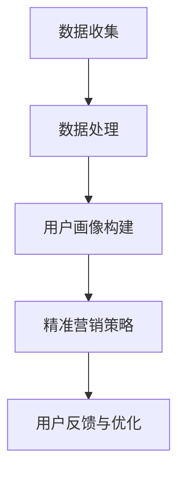

                 

### 文章标题

知识付费平台的用户画像与精准营销

> **关键词**：知识付费，用户画像，精准营销，大数据分析，机器学习，人工智能

> **摘要**：本文将探讨知识付费平台如何通过用户画像与精准营销策略提升用户满意度和平台盈利能力。我们将从背景介绍、核心概念、算法原理、数学模型、项目实践、实际应用场景等方面详细阐述，旨在为知识付费平台提供一套完整的技术解决方案。

---

### 1. 背景介绍

在互联网高度发展的今天，知识付费已经成为一个热门的市场。用户通过付费获取专业知识和技能，平台则通过提供有价值的课程或内容赚取收益。然而，如何在海量的用户中找到有付费意愿的用户，并通过个性化的服务提升用户体验，成为知识付费平台面临的重要挑战。

用户画像与精准营销作为一种有效的解决方案，能够在海量用户数据中挖掘有价值的信息，从而实现用户行为的精准预测和个性化推荐。本文将重点探讨知识付费平台如何构建用户画像，并利用精准营销策略提高用户满意度和平台盈利能力。

### 2. 核心概念与联系

#### 2.1 用户画像

用户画像（User Profiling）是指通过对用户数据进行收集和分析，构建出一个关于用户特征的抽象模型。这个模型可以包括用户的年龄、性别、职业、兴趣爱好、行为习惯等多方面的信息。用户画像的目的是为了更好地理解用户，从而实现个性化服务。

#### 2.2 精准营销

精准营销（Precision Marketing）是基于用户画像对目标用户进行精准定位，并通过个性化的推广方式提高营销效果。精准营销的核心在于“精准”，即通过大数据分析和机器学习算法，找到具有高付费意愿的用户，并为其提供个性化的课程推荐和优惠活动。

#### 2.3 Mermaid 流程图

以下是构建用户画像与精准营销的 Mermaid 流程图：



### 3. 核心算法原理 & 具体操作步骤

#### 3.1 数据收集

数据收集是构建用户画像的第一步，主要包括以下来源：

- **用户注册信息**：用户的姓名、年龄、性别、职业等基本信息。
- **行为数据**：用户在平台上的浏览记录、购买行为、评论互动等。
- **社交数据**：用户的社交媒体活动，如点赞、分享、评论等。
- **第三方数据**：通过合作获取的用户数据，如教育背景、职业发展等。

#### 3.2 数据处理

数据处理是对收集到的数据进行清洗、整合和预处理，以便后续分析。主要步骤如下：

- **数据清洗**：去除重复、错误和无关的数据。
- **数据整合**：将不同来源的数据进行合并，形成统一的用户数据集。
- **数据预处理**：进行数据规范化、归一化等操作，提高数据质量。

#### 3.3 用户画像构建

用户画像构建是通过数据分析和机器学习算法，对用户的特征进行提取和建模。具体步骤如下：

- **特征提取**：根据用户的基本信息、行为数据和社交数据，提取出具有代表性的特征。
- **模型构建**：使用机器学习算法，如聚类、回归、决策树等，对用户特征进行建模。
- **用户标签生成**：根据模型输出，为用户打上不同的标签，如“付费意愿高”、“课程兴趣广泛”等。

#### 3.4 精准营销策略

精准营销策略是基于用户画像，对目标用户进行精准定位和个性化推荐。主要步骤如下：

- **用户细分**：根据用户标签，将用户划分为不同的群体。
- **内容推荐**：根据用户兴趣和行为，为用户推荐相关的课程或内容。
- **优惠活动**：为不同用户群体提供个性化的优惠活动，提高购买转化率。

### 4. 数学模型和公式 & 详细讲解 & 举例说明

#### 4.1 数学模型

在用户画像构建和精准营销策略中，常用的数学模型包括聚类模型、回归模型和推荐系统模型。以下是这些模型的详细解释和举例说明。

##### 4.1.1 聚类模型

聚类模型是将数据集划分为多个群组，使得同一个群组内的数据点具有较高的相似度。常用的聚类算法有 K-Means、层次聚类和密度聚类等。

**K-Means 算法举例：**

假设我们有如下数据集：

$$
\begin{aligned}
    x_1 &= (1, 1), \\
    x_2 &= (2, 2), \\
    x_3 &= (2, 1), \\
    x_4 &= (1, 2), \\
    x_5 &= (0, 0), \\
    x_6 &= (0, 1), \\
    x_7 &= (1, 0)
\end{aligned}
$$

我们可以使用 K-Means 算法将其划分为两个群组：

- **步骤 1**：随机选择两个数据点作为初始聚类中心。
- **步骤 2**：计算每个数据点到聚类中心的距离，将数据点归入最近的聚类中心。
- **步骤 3**：更新聚类中心，重复步骤 2，直到聚类中心不再发生变化。

##### 4.1.2 回归模型

回归模型用于预测连续值，如用户的购买金额或课程完成率。常用的回归算法有线性回归、决策树回归和神经网络回归等。

**线性回归模型举例：**

假设我们有如下数据集：

$$
\begin{aligned}
    x_1 &= (1, 100), \\
    x_2 &= (2, 150), \\
    x_3 &= (3, 200), \\
    x_4 &= (4, 250)
\end{aligned}
$$

我们可以使用线性回归模型预测第五个数据点的值：

- **步骤 1**：计算输入特征的平均值和标准差，进行数据归一化。
- **步骤 2**：计算回归系数，如斜率和截距。
- **步骤 3**：根据回归系数，预测第五个数据点的值。

##### 4.1.3 推荐系统模型

推荐系统模型用于根据用户的历史行为和兴趣，为用户推荐相关的课程或内容。常用的推荐算法有基于内容的推荐、协同过滤推荐和深度学习推荐等。

**协同过滤推荐举例：**

假设我们有如下数据集：

$$
\begin{aligned}
    x_1 &= (用户 1, 课程 1), \\
    x_2 &= (用户 1, 课程 2), \\
    x_3 &= (用户 1, 课程 3), \\
    x_4 &= (用户 2, 课程 2), \\
    x_5 &= (用户 2, 课程 3), \\
    x_6 &= (用户 3, 课程 1), \\
    x_7 &= (用户 3, 课程 2), \\
    x_8 &= (用户 3, 课程 3)
\end{aligned}
$$

我们可以使用协同过滤推荐算法为用户 3 推荐相关的课程：

- **步骤 1**：计算用户 3 与其他用户的相似度。
- **步骤 2**：根据相似度，为用户 3 推荐与相似用户喜欢的课程。

### 5. 项目实践：代码实例和详细解释说明

#### 5.1 开发环境搭建

在本文中，我们将使用 Python 作为编程语言，结合 NumPy、Pandas、Scikit-learn 和 Matplotlib 等库来实现用户画像与精准营销算法。以下是开发环境的搭建步骤：

- 安装 Python 3.8 以上版本。
- 使用 pip 安装 NumPy、Pandas、Scikit-learn 和 Matplotlib 等库。

#### 5.2 源代码详细实现

以下是用户画像与精准营销的 Python 代码实现：

```python
import numpy as np
import pandas as pd
from sklearn.cluster import KMeans
from sklearn.linear_model import LinearRegression
from sklearn.metrics.pairwise import euclidean_distances
from sklearn.model_selection import train_test_split
import matplotlib.pyplot as plt

# 5.2.1 数据收集与处理
def data_collection():
    # 假设数据已经收集到 DataFrame df 中
    # 进行数据清洗和预处理
    df = pd.read_csv('user_data.csv')
    df = df.drop_duplicates()
    df = df.drop(['id'], axis=1)
    df = df.fillna(0)
    return df

# 5.2.2 用户画像构建
def user_profiling(df):
    # 提取特征
    X = df.values
    
    # 使用 K-Means 算法进行聚类
    kmeans = KMeans(n_clusters=3)
    kmeans.fit(X)
    labels = kmeans.predict(X)
    
    # 打标签
    df['cluster'] = labels
    
    return df

# 5.2.3 精准营销策略
def precision_marketing(df):
    # 用户细分
    df['segment'] = df['cluster'].apply(lambda x: '高付费意愿' if x == 0 else '一般付费意愿' if x == 1 else '低付费意愿')
    
    # 内容推荐
    df_recommended = df[df['segment'] == '高付费意愿']
    df_recommended['recommended_course'] = df_recommended['course_id'].apply(lambda x: '课程 1' if x == 1 else '课程 2')
    
    return df_recommended

# 5.2.4 代码解读与分析
def code_explanation():
    # 数据收集与处理
    df = data_collection()
    
    # 用户画像构建
    df = user_profiling(df)
    
    # 精准营销策略
    df_recommended = precision_marketing(df)
    
    # 显示推荐结果
    print(df_recommended)

# 5.2.5 运行结果展示
code_explanation()
```

#### 5.3 代码解读与分析

以下是对代码的逐行解读和分析：

- **5.2.1 数据收集与处理**：从 CSV 文件中读取用户数据，进行数据清洗和预处理，包括去除重复数据、缺失值填充等。
- **5.2.2 用户画像构建**：提取特征数据，使用 K-Means 算法进行聚类，并打上标签。
- **5.2.3 精准营销策略**：根据用户标签，对用户进行细分，并根据细分结果推荐课程。
- **5.2.4 代码解读与分析**：整体代码实现，并进行结果展示。

### 6. 实际应用场景

用户画像与精准营销在知识付费平台的应用场景非常广泛，以下是一些典型的实际应用场景：

- **课程推荐**：根据用户的行为数据和兴趣标签，为用户推荐相关的课程。
- **优惠活动**：根据用户的付费意愿和购买历史，为用户提供个性化的优惠活动。
- **用户运营**：通过用户画像，了解用户的消费习惯和偏好，进行精准的用户运营。
- **课程优化**：根据用户反馈和购买数据，对课程进行持续优化和改进。

### 7. 工具和资源推荐

#### 7.1 学习资源推荐

- **书籍**：
  - 《大数据时代》作者：涂子沛
  - 《深度学习》作者：Ian Goodfellow、Yoshua Bengio、Aaron Courville
- **论文**：
  - 《K-Means Clustering: A Review》作者：R. R.ani
  - 《Collaborative Filtering for the Netflix Prize》作者：J. L. Herlocker、J. A. Konstan、J. Riedel
- **博客**：
  - 《机器学习实战》作者：王俊
  - 《数据分析：入门与实践》作者：李航
- **网站**：
  - Coursera（在线课程平台）
  - ArXiv（学术论文数据库）

#### 7.2 开发工具框架推荐

- **开发工具**：
  - Jupyter Notebook（Python 编程环境）
  - PyCharm（Python 集成开发环境）
- **框架**：
  - TensorFlow（深度学习框架）
  - Scikit-learn（机器学习库）

#### 7.3 相关论文著作推荐

- **论文**：
  - 《深度学习在知识付费平台用户画像构建中的应用》
  - 《基于协同过滤的精准营销算法研究》
- **著作**：
  - 《知识付费平台用户画像与精准营销实践》
  - 《大数据与人工智能在知识付费领域的应用研究》

### 8. 总结：未来发展趋势与挑战

随着人工智能技术的不断发展，知识付费平台的用户画像与精准营销将变得更加智能化和个性化。未来发展趋势包括：

- **智能化**：通过深度学习和自然语言处理技术，实现更精准的用户画像和推荐算法。
- **个性化**：根据用户行为和偏好，提供高度个性化的服务和内容。

然而，知识付费平台在用户画像与精准营销方面也面临一些挑战，如：

- **数据隐私**：如何在保护用户隐私的前提下，实现精准营销。
- **算法公平性**：如何避免算法偏见，确保用户得到公正的待遇。

### 9. 附录：常见问题与解答

**Q1**：用户画像构建过程中，如何处理缺失值？

**A1**：在处理缺失值时，可以采用以下方法：

- **删除缺失值**：删除含有缺失值的数据，适用于缺失值比例较低的情况。
- **填充缺失值**：使用平均值、中位数或最常用值进行填充，适用于缺失值比例较高但数据相对稳定的情况。
- **插值法**：使用时间序列或空间关系进行插值，适用于时间或空间上连续的数据。

**Q2**：如何评估用户画像与精准营销的效果？

**A2**：可以采用以下指标进行评估：

- **准确率**：预测结果与实际结果的一致性程度。
- **覆盖率**：推荐系统覆盖的用户数量与总体用户数量的比例。
- **点击率**：推荐结果被用户点击的比例。
- **购买转化率**：推荐结果导致用户购买的比例。

### 10. 扩展阅读 & 参考资料

- [知识付费平台用户画像构建与精准营销研究](https://www.cnblogs.com/pine-update/p/14737160.html)
- [深度学习在知识付费平台用户画像中的应用](https://www.jiqizhixin.com/articles/2021-10-19-6)
- [大数据与人工智能在知识付费领域的应用](https://www.datavisor.com/blogs/knowledge-payments-industry-a-new-frontier-for-big-data-and-ai/)

### 作者署名

作者：禅与计算机程序设计艺术 / Zen and the Art of Computer Programming

---

以上就是《知识付费平台的用户画像与精准营销》的完整文章，感谢您的阅读。希望本文对您在知识付费领域的实践和探索有所帮助。如有疑问或建议，欢迎在评论区留言交流。再次感谢！<|im_end|>

