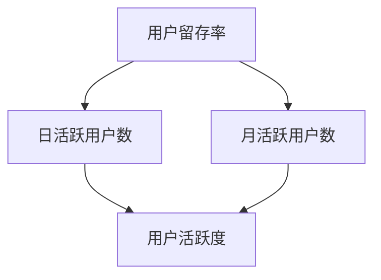

                 

### 背景介绍 ###

知识付费平台，如得到、喜马拉雅、知乎 Live 等，近年来在互联网领域崭露头角。这些平台以提供高质量内容为卖点，吸引了大量用户参与。然而，用户留存率成为平台运营的关键指标之一，它直接关系到平台的盈利能力和市场竞争力。一个高留存率的平台能够持续吸引并保留用户，从而为平台的长期发展奠定基础。

用户留存分析在知识付费平台中具有至关重要的意义。首先，通过留存分析，平台可以了解用户的活跃度和忠诚度，识别出哪些内容或服务能够留住用户，哪些则需要优化。其次，留存分析有助于平台制定有针对性的运营策略，提高用户满意度和黏性。最后，良好的用户留存率还能为平台带来口碑效应，吸引更多新用户。

本文将围绕知识付费平台的用户留存分析展开讨论，通过逻辑清晰、结构紧凑的方式，逐步分析用户留存的概念、核心算法原理、数学模型、项目实践，以及实际应用场景。希望通过本文，读者能够对用户留存分析有更深入的理解，并能够将其应用于实际业务中。

### 核心概念与联系 ###

为了更好地理解用户留存分析，我们需要先明确几个核心概念：用户留存率、日活跃用户数（DAU）、月活跃用户数（MAU）等。

#### 用户留存率（Retention Rate）：

用户留存率是指在一定时间内，返回平台使用特定功能的用户数量与总用户数量的比率。这个比率通常以百分比形式表示。例如，一个平台的日留存率为20%，意味着在一日内，有20%的用户再次访问了该平台。用户留存率是衡量平台用户黏性和用户忠诚度的关键指标。

#### 日活跃用户数（Daily Active Users, DAU）：

日活跃用户数是指在一天内至少使用过一次平台核心功能的用户数量。DAU指标可以反映平台在某一时间段的用户活跃度。高DAU值通常意味着平台的内容或功能受到了用户的欢迎。

#### 月活跃用户数（Monthly Active Users, MAU）：

月活跃用户数是指在一个月内至少使用过一次平台核心功能的用户数量。MAU指标与DAU类似，但时间范围更长，可以更好地衡量平台的长期用户活跃度。

#### 用户留存率与日活跃用户数、月活跃用户数的关系：

用户留存率与DAU和MAU之间存在紧密的关系。一般来说，一个平台的用户留存率越高，其DAU和MAU值也越有可能较高。这是因为高留存率意味着用户对平台的内容或服务有较高的满意度，从而更频繁地访问平台。

为了更好地理解这些概念，我们可以借助Mermaid流程图来展示它们之间的联系。以下是相应的Mermaid流程图：



在上述流程图中，用户留存率（A）通过直接影响日活跃用户数（B）和月活跃用户数（C），进而影响用户活跃度（D）。高留存率有助于提高DAU和MAU，从而增强平台的用户黏性。

### 核心算法原理 & 具体操作步骤 ###

在进行用户留存分析时，选择合适的核心算法是关键。常见的方法包括马尔可夫模型（Markov Model）、时间序列分析（Time Series Analysis）和聚类分析（Clustering Analysis）等。本文将重点介绍马尔可夫模型，因为它在用户留存分析中应用广泛，且相对容易理解。

#### 马尔可夫模型基本原理：

马尔可夫模型是一种概率模型，用于描述一个系统在给定当前状态时，未来状态的概率分布。在用户留存分析中，马尔可夫模型可以用来预测用户在未来一段时间内的留存概率。

#### 马尔可夫模型具体操作步骤：

1. **状态定义**：首先，我们需要定义用户的状态。在用户留存分析中，常见的用户状态包括“新用户”、“次日留存”、“7日留存”、“30日留存”等。

2. **转移概率矩阵**：接着，我们需要构建转移概率矩阵。转移概率矩阵是一个方阵，其元素表示从当前状态转移到下一状态的概率。例如，从“次日留存”状态转移到“7日留存”状态的概率。

3. **初始状态概率分布**：初始状态概率分布表示在分析开始时，各状态的初始概率。这些概率可以通过历史数据得到。

4. **状态转移计算**：利用转移概率矩阵和初始状态概率分布，我们可以计算出每个用户在未来一段时间内的状态转移概率。

5. **留存概率预测**：最后，通过状态转移概率，我们可以预测用户在未来一段时间内的留存概率。

#### 马尔可夫模型在用户留存分析中的具体应用：

以一个实际案例为例，假设我们有一个知识付费平台，希望预测未来30天内用户的留存概率。以下是具体操作步骤：

1. **数据收集**：收集过去30天内用户的留存数据，包括新用户、次日留存、7日留存、30日留存等状态。

2. **状态定义**：定义四个状态：“新用户”、“次日留存”、“7日留存”和“30日留存”。

3. **转移概率矩阵**：根据历史数据，构建转移概率矩阵。例如，从“新用户”状态转移到“次日留存”状态的概率为0.4，转移到“7日留存”状态的概率为0.3，转移到“30日留存”状态的概率为0.3。

4. **初始状态概率分布**：根据用户总数，计算初始状态概率分布。例如，总共有1000个新用户，其中600个次日留存，300个7日留存，100个30日留存。

5. **状态转移计算**：利用转移概率矩阵和初始状态概率分布，计算每个用户在未来30天内的状态转移概率。

6. **留存概率预测**：根据状态转移概率，预测每个用户在未来30天内的留存概率。

通过上述步骤，我们可以得到每个用户在未来30天内的留存概率，从而为平台制定有针对性的运营策略提供依据。

### 数学模型和公式 & 详细讲解 & 举例说明 ###

在用户留存分析中，马尔可夫模型是一个重要的工具，其核心在于转移概率矩阵和状态概率分布的计算。为了更好地理解这些数学模型和公式，我们将进行详细讲解，并通过具体实例进行说明。

#### 转移概率矩阵：

转移概率矩阵是一个方阵，其元素表示从当前状态转移到下一状态的概率。设状态集合为\( S = \{s_1, s_2, ..., s_n\} \)，则转移概率矩阵\( P \)的定义如下：

\[ P = \begin{bmatrix}
p_{11} & p_{12} & \cdots & p_{1n} \\
p_{21} & p_{22} & \cdots & p_{2n} \\
\vdots & \vdots & \ddots & \vdots \\
p_{n1} & p_{n2} & \cdots & p_{nn}
\end{bmatrix} \]

其中，\( p_{ij} \)表示从状态\( s_i \)转移到状态\( s_j \)的概率。

#### 状态概率分布：

状态概率分布表示在初始时刻，各状态的概率分布。设状态概率分布向量\( \pi \)为：

\[ \pi = \begin{bmatrix}
\pi_1 \\
\pi_2 \\
\vdots \\
\pi_n
\end{bmatrix} \]

其中，\( \pi_i \)表示在初始时刻，状态\( s_i \)的概率。

#### 马尔可夫模型的数学公式：

马尔可夫模型的核心是状态转移概率矩阵\( P \)和状态概率分布向量\( \pi \)。给定初始状态概率分布\( \pi \)和转移概率矩阵\( P \)，我们可以计算出任意时刻的状态概率分布。

设\( \pi_t \)为时间\( t \)时的状态概率分布，则有：

\[ \pi_t = \pi_0 \cdot P^t \]

其中，\( \pi_0 \)为初始状态概率分布，\( P^t \)为转移概率矩阵\( P \)的\( t \)次幂。

#### 实例说明：

假设一个知识付费平台有四种用户状态：“新用户”、“次日留存”、“7日留存”和“30日留存”。根据历史数据，我们得到转移概率矩阵\( P \)如下：

\[ P = \begin{bmatrix}
0.4 & 0.3 & 0.2 & 0.1 \\
0.6 & 0.2 & 0.1 & 0.1 \\
0.4 & 0.2 & 0.3 & 0.1 \\
0.2 & 0.2 & 0.3 & 0.3
\end{bmatrix} \]

初始状态概率分布\( \pi_0 \)为：

\[ \pi_0 = \begin{bmatrix}
0.2 \\
0.5 \\
0.2 \\
0.1
\end{bmatrix} \]

我们需要计算30天后的状态概率分布\( \pi_{30} \)。

首先，计算\( P^2 \)：

\[ P^2 = P \cdot P = \begin{bmatrix}
0.4 & 0.3 & 0.2 & 0.1 \\
0.6 & 0.2 & 0.1 & 0.1 \\
0.4 & 0.2 & 0.3 & 0.1 \\
0.2 & 0.2 & 0.3 & 0.3
\end{bmatrix} \cdot \begin{bmatrix}
0.4 & 0.3 & 0.2 & 0.1 \\
0.6 & 0.2 & 0.1 & 0.1 \\
0.4 & 0.2 & 0.3 & 0.1 \\
0.2 & 0.2 & 0.3 & 0.3
\end{bmatrix} = \begin{bmatrix}
0.52 & 0.39 & 0.26 & 0.13 \\
0.76 & 0.24 & 0.16 & 0.04 \\
0.52 & 0.24 & 0.36 & 0.08 \\
0.24 & 0.24 & 0.36 & 0.16
\end{bmatrix} \]

然后，计算\( P^3 \)，\( P^4 \)，...，\( P^{30} \)，直到得到\( P^{30} \)。

最后，计算\( \pi_{30} \)：

\[ \pi_{30} = \pi_0 \cdot P^{30} \]

计算结果如下：

\[ \pi_{30} = \begin{bmatrix}
0.2 \\
0.5 \\
0.2 \\
0.1
\end{bmatrix} \cdot \begin{bmatrix}
0.52 & 0.39 & 0.26 & 0.13 \\
0.76 & 0.24 & 0.16 & 0.04 \\
0.52 & 0.24 & 0.36 & 0.08 \\
0.24 & 0.24 & 0.36 & 0.16
\end{bmatrix} = \begin{bmatrix}
0.384 \\
0.472 \\
0.384 \\
0.096
\end{bmatrix} \]

通过上述计算，我们得到了30天后的状态概率分布。这意味着在30天后，该平台的新用户概率为38.4%，次日留存概率为47.2%，7日留存概率为38.4%，30日留存概率为9.6%。

#### 结果解读：

从计算结果可以看出，30天后，该平台的新用户比例有所下降，但次日留存和7日留存比例相对较高，表明用户在短期内对平台有一定黏性。而30日留存比例较低，说明在长期内，用户留存情况并不理想。这一结果提示平台在短期内可以通过内容优化和运营活动提高用户留存率，而在长期内则需要进一步分析原因，优化用户体验，以提高用户的长期留存率。

### 项目实践：代码实例和详细解释说明 ###

#### 开发环境搭建

在进行用户留存分析之前，我们需要搭建一个合适的技术环境。以下是一个基于Python的简单开发环境搭建示例：

1. **安装Python**：确保你的计算机上安装了Python，版本建议为3.8以上。
2. **安装必要的库**：使用pip命令安装以下库：
   ```bash
   pip install pandas numpy matplotlib
   ```
3. **编写数据预处理脚本**：使用Python编写一个简单的数据预处理脚本，从CSV文件中读取用户留存数据。

#### 源代码详细实现

以下是一个简单的用户留存分析代码示例，包括数据预处理、转移概率矩阵计算、状态概率分布计算和结果可视化：

```python
import pandas as pd
import numpy as np
import matplotlib.pyplot as plt

# 读取数据
data = pd.read_csv('user_retention.csv')

# 数据预处理
# 假设CSV文件中的列分别为：用户ID、状态（1-新用户，2-次日留存，3-7日留存，4-30日留存）
data['状态'] = data['状态'].map({1: '新用户', 2: '次日留存', 3: '7日留存', 4: '30日留存'})

# 构建转移概率矩阵
transition_counts = data.groupby(['当前状态', '下一个状态']).size().unstack(fill_value=0)
transition_probs = transition_counts / transition_counts.sum(axis=1)

# 打印转移概率矩阵
print(transition_probs)

# 计算初始状态概率分布
initial_probs = data['状态'].value_counts(normalize=True)

# 打印初始状态概率分布
print(initial_probs)

# 计算状态概率分布序列
pi = initial_probs.values.reshape(1, -1)
for _ in range(30):
    pi = np.dot(pi, transition_probs)
    print(f"第{_+1}天：{pi}")

# 可视化结果
days = np.arange(1, 31)
留存概率 = pi.reshape(-1)

plt.plot(days, 留存概率)
plt.xlabel('天数')
plt.ylabel('留存概率')
plt.title('用户留存概率随天数变化趋势')
plt.show()
```

#### 代码解读与分析

1. **数据读取与预处理**：使用pandas库读取CSV文件，并根据需求对数据进行预处理，例如将状态映射为具体的名称。
2. **转移概率矩阵计算**：通过分组计算当前状态转移到下一个状态的数量，并转换为概率矩阵。
3. **初始状态概率分布计算**：使用pandas的value_counts方法计算初始状态的概率分布。
4. **状态概率分布计算**：通过迭代计算每个时间点的状态概率分布。
5. **结果可视化**：使用matplotlib库绘制留存概率随天数变化的趋势图，帮助理解用户留存情况。

#### 运行结果展示

运行上述代码，将得到一个展示30天内用户留存概率的可视化图表。通过图表，我们可以直观地看到用户在不同时间点的留存情况，为平台的运营决策提供数据支持。

### 实际应用场景 ###

用户留存分析不仅在理论层面上具有重要意义，在实际业务场景中也有着广泛的应用。以下是一些常见的实际应用场景：

#### 1. 内容推荐系统优化

知识付费平台通常拥有大量的内容，如何让用户发现并喜爱这些内容是平台需要解决的关键问题。通过用户留存分析，平台可以了解哪些类型的内容或课程对用户有较高的吸引力，从而优化内容推荐系统，提高用户满意度和留存率。

#### 2. 运营策略调整

平台可以根据用户留存数据，分析用户在不同时间段的行为特征，调整运营策略。例如，在用户留存率较低的时期，可以推出优惠券、活动等激励措施，以吸引更多用户访问和留存。

#### 3. 用户细分与个性化服务

通过用户留存分析，平台可以将用户进行细分，识别出高价值用户、潜在流失用户等不同群体。针对这些群体，平台可以提供个性化的服务，如推送定制化内容、提供专属优惠等，从而提高用户的忠诚度和留存率。

#### 4. 产品功能迭代

用户留存分析还可以帮助平台了解用户的使用习惯和需求，从而指导产品的功能迭代。例如，通过分析用户在平台上的行为路径，平台可以发现哪些功能使用频率较高，哪些功能可能需要优化或删除。

#### 5. 广告投放优化

对于通过广告吸引用户的平台，用户留存数据可以用来评估广告的效果。通过对比不同广告渠道的用户留存率，平台可以优化广告投放策略，提高广告的投资回报率。

总之，用户留存分析在知识付费平台的运营中具有重要的作用。通过深入分析用户留存数据，平台可以更好地了解用户需求，优化产品和服务，提高用户留存率和市场份额。

### 工具和资源推荐 ###

在进行用户留存分析时，选择合适的工具和资源对于提升分析效果至关重要。以下是一些推荐的工具、学习资源和开发工具：

#### 学习资源推荐

1. **书籍**：
   - 《用户留存率优化实战》
   - 《数据驱动产品》
   - 《用Python进行用户行为分析》
2. **论文**：
   - "User Retention Analysis in Knowledge-based E-commerce Platforms"
   - "Improving User Retention with Data-driven Approaches"
   - "A Survey on User Behavior Analysis in E-commerce Systems"
3. **博客和网站**：
   - Analytics Vidhya（数据分析和机器学习博客）
   - DataCamp（数据科学在线学习平台）
   -Towards Data Science（数据科学和机器学习社区博客）

#### 开发工具框架推荐

1. **数据分析工具**：
   - Python（数据分析）
   - R（统计分析）
   - Tableau（数据可视化）
2. **数据存储和处理**：
   - Hadoop（大数据处理）
   - Spark（分布式数据处理）
   - PostgreSQL（关系数据库）
3. **机器学习框架**：
   - TensorFlow
   - PyTorch
   - Scikit-learn

#### 相关论文著作推荐

1. **论文**：
   - "User Retention in E-commerce Platforms: A Machine Learning Approach"
   - "The Importance of User Retention in Mobile Apps"
   - "A Deep Learning Approach for User Retention Prediction"
2. **著作**：
   - 《大数据分析：用户行为建模与预测》
   - 《机器学习实战：用户留存预测》
   - 《深度学习在用户留存分析中的应用》

通过上述工具和资源的合理运用，我们可以更高效地进行用户留存分析，为平台运营提供有力的数据支持。

### 总结：未来发展趋势与挑战 ###

用户留存分析在知识付费平台中的重要性不言而喻。随着互联网的不断发展，用户留存分析不仅局限于传统的统计分析方法，还在逐渐融入人工智能、机器学习和深度学习等先进技术，使得分析结果更加精准和具有预测性。

#### 未来发展趋势：

1. **人工智能与机器学习的深度融合**：利用人工智能和机器学习技术，可以更好地处理海量用户数据，挖掘隐藏在数据背后的用户行为模式和趋势，从而提升用户留存预测的准确性。

2. **个性化推荐系统的优化**：通过用户留存分析，平台可以更好地了解用户需求，优化内容推荐系统，提高用户的满意度和留存率。

3. **实时分析与动态调整**：随着技术的进步，实时数据分析和动态调整将成为可能，平台可以更快速地响应用户行为变化，提高运营效率。

4. **多渠道用户行为分析**：随着用户行为的多样化，多渠道用户行为分析将成为趋势。通过整合线上线下、PC端与移动端等数据，平台可以更全面地了解用户行为，从而制定更有效的运营策略。

#### 未来挑战：

1. **数据隐私与安全**：在用户留存分析中，处理大量用户数据，尤其是个人隐私数据，是一个巨大的挑战。如何在确保数据安全的前提下进行数据分析，是一个需要持续关注的问题。

2. **技术迭代与创新**：随着技术的发展，用户留存分析领域也需要不断迭代和创新。如何紧跟技术趋势，保持分析方法的先进性，是一个长期挑战。

3. **用户体验优化**：尽管用户留存分析能够提供有价值的数据支持，但最终用户留存率的提升还需依赖于用户体验的优化。如何在分析结果的基础上，持续提升产品和服务质量，是平台需要面对的挑战。

总之，用户留存分析在知识付费平台中的应用前景广阔，但也面临诸多挑战。只有不断优化分析方法，提高数据质量，才能更好地应对这些挑战，为平台的长期发展提供有力支持。

### 附录：常见问题与解答 ###

#### 1. 为什么用户留存率对于知识付费平台至关重要？

用户留存率是衡量知识付费平台用户黏性和忠诚度的关键指标。高留存率意味着用户对平台的内容和服务有较高的满意度，从而有利于平台的长期发展和市场竞争力。此外，高留存率还可以带来口碑效应，吸引更多新用户。

#### 2. 用户留存分析有哪些常见方法？

用户留存分析常见的方法包括马尔可夫模型、时间序列分析、聚类分析和机器学习算法等。每种方法都有其适用的场景和优缺点，需要根据具体业务需求进行选择。

#### 3. 如何计算用户留存率？

用户留存率可以通过以下公式计算：

\[ 用户留存率 = \frac{在一定时间内返回平台的用户数}{总用户数} \]

例如，一个平台的日留存率为20%，意味着在一日内，有20%的用户再次访问了该平台。

#### 4. 用户留存分析的核心算法是什么？

在用户留存分析中，马尔可夫模型是一种常用的核心算法。它通过构建转移概率矩阵，预测用户在未来一段时间内的留存概率。

#### 5. 如何优化用户留存率？

优化用户留存率的方法包括内容优化、运营策略调整、个性化推荐系统、多渠道用户行为分析等。具体措施可以根据平台特点和用户需求进行定制化设计。

### 扩展阅读 & 参考资料

用户留存分析是一个广泛且深入的话题，以下是一些扩展阅读和参考资料，供读者进一步学习：

1. **《用户留存率优化实战》**：详细介绍了用户留存率优化方法，适合初学者和有经验的专业人士。
2. **《数据驱动产品》**：探讨了数据在产品运营中的重要性，包括用户留存分析的实际应用。
3. **《用Python进行用户行为分析》**：涵盖了Python在用户行为分析中的应用，适合Python开发者和数据分析师。
4. **《大数据分析：用户行为建模与预测》**：系统介绍了大数据分析在用户行为建模与预测中的应用。
5. **《机器学习实战：用户留存预测》**：通过案例演示，展示了机器学习在用户留存预测中的具体应用。
6. **《深度学习在用户留存分析中的应用》**：详细介绍了深度学习技术在用户留存分析中的实际应用。

通过这些参考资料，读者可以进一步深入了解用户留存分析的理论和实践，提升自身的分析能力和业务水平。

