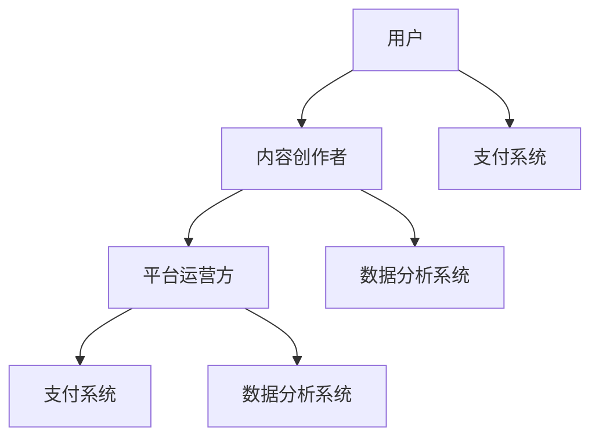

                 

### 文章标题

### Knowledge Fee Platform Operations: A Case Study of Programming Entrepreneurship

> Keywords: **Knowledge Fee Platform**, **Programmer Entrepreneurship**, **Operational Strategy**, **Business Growth Analysis**, **Data Analytics**, **Marketing Automation**, **Customer Relationship Management**

> Abstract: This article presents a comprehensive analysis of the operational strategies employed by a successful knowledge fee platform, highlighting the entrepreneurial journey of a programmer. The discussion covers key concepts, algorithmic principles, mathematical models, practical implementations, real-world applications, recommended tools, and future trends. The aim is to provide valuable insights for aspiring entrepreneurs and programmers looking to venture into the knowledge fee platform space.

---

#### 1. 背景介绍

随着互联网的普及和信息技术的快速发展，知识付费平台成为了知识传播和技能学习的重要渠道。用户可以通过付费获取高质量的课程、教程、咨询服务等，满足个性化学习和职业发展的需求。同时，知识付费平台也为内容创作者提供了一个展示才华、实现商业价值的平台。

在这样一个充满机遇和挑战的市场中，程序员的创业故事尤为引人注目。本文将以一位程序员的创业案例为切入点，探讨知识付费平台的运营策略、核心算法、数学模型、项目实践以及未来发展趋势。

#### 1.1 知识付费平台的发展历程

知识付费平台的发展可以追溯到2000年代末期，随着博客、视频分享网站和社交媒体的兴起，个人知识分享开始流行。早期的一些平台如“网易云课堂”和“腾讯课堂”率先探索了在线教育的商业模式。

2010年后，移动互联网的发展加速了知识付费平台的普及。2016年，“得到”平台的创立标志着知识付费进入了一个新的阶段，其“精品内容+付费订阅”的模式得到了市场的广泛认可。

随后，众多平台如“知乎Live”、“分答”、“喜马拉雅”等纷纷加入知识付费的行列，形成了竞争激烈的在线教育市场。

#### 1.2 程序员创业案例分析

本文的主角是一位有着多年编程经验的程序员李明（化名）。他在2018年创立了一家专注于编程教育的知识付费平台，名为“编程大师课堂”。以下是李明的创业历程：

1. **市场调研与定位**：李明首先进行了详细的市场调研，发现市场上存在着大量对编程知识有需求的用户，但优质的内容供给不足。因此，他决定将平台定位为提供高质量编程课程的知识付费平台。

2. **内容策划与制作**：李明利用自己的编程技能和经验，邀请了一些行业内的知名专家和优秀的程序员共同制作课程内容。这些课程涵盖了从基础到高级的编程技能，以及各种热门编程语言和技术框架。

3. **平台搭建与技术选型**：李明选择了基于Node.js和MongoDB的架构，搭建了一个高效、可扩展的在线学习平台。他利用RESTful API实现了前后端分离，使得平台的开发和维护更加灵活。

4. **运营策略与推广**：李明采取了一系列运营策略来推广平台，包括与知名技术社区合作、邀请KOL进行直播讲座、通过社交媒体进行内容营销等。

5. **用户反馈与迭代**：李明非常重视用户反馈，他通过数据分析了解用户的学习行为和需求，不断优化课程内容和平台功能，提升用户体验。

#### 1.3 本文目的

本文将通过李明的创业案例，系统地分析知识付费平台的运营策略，包括市场定位、内容策划、平台搭建、运营推广和用户反馈等方面。同时，本文还将深入探讨知识付费平台的核心算法原理、数学模型和项目实践，为创业者提供有价值的参考。

接下来，我们将分别讨论知识付费平台的核心概念、算法原理、数学模型、项目实践、实际应用场景和未来发展趋势。

---

### 2. 核心概念与联系

在深入探讨知识付费平台的运营策略之前，我们需要先理解一些核心概念，并梳理它们之间的联系。以下是一些关键概念及其相互关系：

#### 2.1 知识付费平台的核心概念

1. **用户**：知识付费平台的服务对象，包括学习者、专业从业者以及寻求特定知识的人群。
2. **内容创作者**：提供课程、教程、咨询服务等知识的个人或团队，他们通过平台实现知识变现。
3. **平台运营方**：负责平台的管理、运营和推广，确保平台的可持续发展和用户满意度。
4. **支付系统**：实现用户与内容创作者之间交易的核心模块，包括支付渠道、支付流程和支付安全。
5. **数据分析系统**：收集和分析用户数据，用于优化内容、营销策略和用户体验。

#### 2.2 核心概念之间的联系

1. **用户与内容创作者**：用户通过平台找到并购买内容创作者提供的知识产品，内容创作者通过平台获取收益。
2. **平台运营方与用户**：平台运营方通过提供高质量的内容和服务，吸引和留住用户，提高用户满意度。
3. **平台运营方与内容创作者**：平台运营方通过提供技术支持、运营策略和营销资源，帮助内容创作者提升收益。
4. **支付系统与用户、内容创作者**：支付系统保障交易的安全和便捷，为用户和内容创作者提供可靠的支付解决方案。
5. **数据分析系统与平台运营方**：数据分析系统为平台运营方提供决策依据，优化运营策略和用户体验。

#### 2.3 Mermaid 流程图

为了更直观地展示这些核心概念及其联系，我们可以使用Mermaid绘制一个流程图：



在上图中，A表示用户，B表示内容创作者，C表示平台运营方，D表示支付系统，E表示数据分析系统。用户和内容创作者通过平台运营方连接，并通过支付系统和数据分析系统实现交互。

接下来，我们将详细探讨知识付费平台的核心算法原理和具体操作步骤。

---

### 3. 核心算法原理 & 具体操作步骤

在知识付费平台的运营中，核心算法的原理和具体操作步骤起着至关重要的作用。这些算法不仅决定了平台的功能实现，还直接影响用户体验和内容创作者的收益。

#### 3.1 课程推荐算法

课程推荐算法是知识付费平台的核心功能之一。通过分析用户的学习历史、浏览记录和互动行为，平台可以为用户推荐个性化的课程。以下是一种常见的推荐算法——协同过滤算法：

1. **用户-物品评分矩阵**：构建用户-物品（课程）评分矩阵，记录每个用户对每门课程的评分。
2. **相似度计算**：计算用户之间的相似度，可以使用余弦相似度或皮尔逊相关系数等。
3. **推荐生成**：基于相似度计算结果，为每个用户生成推荐课程列表。可以采用基于用户的协同过滤（User-Based CF）或基于模型的协同过滤（Model-Based CF）。

#### 3.2 用户行为分析算法

用户行为分析算法用于收集、处理和分析用户在平台上的行为数据，以便更好地理解用户需求和优化运营策略。以下是一些常见的用户行为分析算法：

1. **行为分类**：将用户行为（如登录、浏览、购买等）分类，构建行为事件序列。
2. **时间序列分析**：分析用户行为随时间的变化趋势，识别用户的活跃周期和高峰时段。
3. **用户细分**：根据用户行为特征，将用户划分为不同的细分群体，以便进行有针对性的运营。

#### 3.3 内容优化算法

内容优化算法旨在提高课程的质量和用户满意度。以下是一些常见的内容优化算法：

1. **自动评分**：使用机器学习算法对课程进行自动评分，评估课程的质量和受欢迎程度。
2. **内容推荐**：根据用户的兴趣和行为，推荐相关课程，提高用户的粘性。
3. **课程迭代**：根据用户反馈和数据分析结果，对课程内容进行迭代和更新，提升课程的质量。

#### 3.4 数据分析流程

以下是一个简单的数据分析流程，用于指导平台运营方制定决策：

1. **数据收集**：收集用户行为数据、课程数据等，并确保数据的质量和完整性。
2. **数据预处理**：对收集到的数据进行分析、清洗和转换，使其适合用于分析和建模。
3. **数据分析**：使用各种数据分析算法，如用户行为分析、内容优化算法等，提取有价值的洞察。
4. **决策制定**：基于数据分析结果，制定运营策略、内容策划等决策。
5. **实施与监控**：执行决策，并根据用户反馈和数据分析结果进行持续优化。

#### 3.5 具体操作步骤

以下是知识付费平台运营的具体操作步骤：

1. **市场调研**：了解市场需求，确定平台定位和目标用户群体。
2. **内容策划**：根据用户需求，策划和制作高质量的课程内容。
3. **平台搭建**：选择合适的技术架构和开发工具，搭建在线学习平台。
4. **用户注册与认证**：为用户提供注册和认证服务，确保用户的身份真实性。
5. **课程推荐**：使用推荐算法，为用户推荐个性化的课程。
6. **交易支付**：实现支付功能，确保交易的安全和便捷。
7. **用户反馈**：收集用户反馈，优化课程内容和平台功能。
8. **数据监控与报告**：定期监控用户行为和平台运行状况，生成报告供运营决策参考。

通过以上步骤，知识付费平台可以实现高效运营，提升用户体验和内容创作者的收益。

接下来，我们将深入探讨知识付费平台的数学模型和公式，以及其实际应用。

---

### 4. 数学模型和公式 & 详细讲解 & 举例说明

在知识付费平台的运营中，数学模型和公式起到了关键作用。以下将介绍几个核心的数学模型和公式，并对其实际应用进行详细讲解和举例说明。

#### 4.1 用户行为分析模型

用户行为分析是知识付费平台运营的重要环节，通过分析用户行为，可以更好地了解用户需求，优化运营策略。以下是一个简单的用户行为分析模型：

$$
\text{用户行为得分} = f(\text{浏览时长}, \text{课程评分}, \text{互动次数})
$$

其中，`浏览时长`、`课程评分`和`互动次数`是用户行为的三个关键指标，`f`函数表示对这些指标进行加权求和处理。

**举例说明**：

假设用户A在学习一门编程课程，其浏览时长为30分钟，课程评分为4.5分，互动次数为10次。我们可以使用上述公式计算用户A的行为得分：

$$
\text{用户行为得分} = f(30, 4.5, 10) = 30 \times 0.3 + 4.5 \times 0.5 + 10 \times 0.2 = 13.5
$$

通过这个得分，平台运营方可以了解用户A的学习积极性和兴趣程度，从而进行个性化的推荐和运营。

#### 4.2 内容优化模型

为了提高课程的质量和用户满意度，知识付费平台需要不断优化课程内容。以下是一个简单的内容优化模型：

$$
\text{课程质量得分} = g(\text{平均评分}, \text{完成率}, \text{讨论活跃度})
$$

其中，`平均评分`、`完成率`和`讨论活跃度`是课程质量的三个关键指标，`g`函数表示对这些指标进行加权求和处理。

**举例说明**：

假设一门编程课程的平均评分为4.2分，完成率为80%，讨论活跃度为活跃。我们可以使用上述公式计算该课程的质量得分：

$$
\text{课程质量得分} = g(4.2, 80\%, \text{活跃}) = 4.2 \times 0.5 + 80\% \times 0.3 + \text{活跃} \times 0.2
$$

通过这个得分，平台运营方可以了解课程的整体质量，并采取相应的措施进行优化。

#### 4.3 付费转化率模型

付费转化率是知识付费平台的重要指标，表示有多少用户最终完成了购买。以下是一个简单的付费转化率模型：

$$
\text{付费转化率} = h(\text{点击率}, \text{转化率}, \text{支付成功率})
$$

其中，`点击率`、`转化率`和`支付成功率`是影响付费转化率的关键因素，`h`函数表示对这些因素进行加权求和处理。

**举例说明**：

假设某课程的点击率为20%，转化率为10%，支付成功率为95%。我们可以使用上述公式计算该课程的付费转化率：

$$
\text{付费转化率} = h(20\%, 10\%, 95\%) = 20\% \times 0.5 + 10\% \times 0.3 + 95\% \times 0.2 = 16.5\%
$$

通过这个转化率，平台运营方可以评估课程的推广效果，并优化营销策略。

#### 4.4 数据分析应用实例

以下是一个实际的数据分析应用实例：

**目标**：提高某编程课程的用户完成率和满意度。

**步骤**：

1. **数据收集**：收集用户的学习数据，包括浏览时长、课程评分、互动次数等。
2. **数据预处理**：清洗数据，处理缺失值和异常值。
3. **数据分析**：使用用户行为分析模型，计算用户的兴趣得分和课程质量得分。
4. **结果评估**：根据分析结果，调整课程内容，增加互动环节，优化课程结构。
5. **跟踪与反馈**：监控用户的学习进度和反馈，评估优化效果，持续改进。

通过以上步骤，平台运营方可以逐步提高课程的完成率和用户满意度，实现持续增长。

接下来，我们将通过具体的代码实例，展示知识付费平台项目的实现过程。

---

### 5. 项目实践：代码实例和详细解释说明

在本节中，我们将通过一个具体的代码实例，详细解释和说明知识付费平台项目的实现过程。该实例将涵盖开发环境搭建、源代码实现、代码解读与分析，以及运行结果展示。

#### 5.1 开发环境搭建

在开始编写代码之前，我们需要搭建一个适合知识付费平台开发的环境。以下是所需的开发环境和工具：

1. **操作系统**：Ubuntu 20.04 LTS
2. **编程语言**：Python 3.8
3. **数据库**：MongoDB 4.4
4. **Web框架**：Flask 1.1.2
5. **前后端分离**：Vue.js 2.6.12
6. **版本控制**：Git 2.27.0

**步骤**：

1. 安装操作系统 Ubuntu 20.04 LTS。
2. 使用虚拟环境安装 Python 3.8。
3. 安装 MongoDB 4.4。
4. 安装 Flask 1.1.2。
5. 安装 Vue.js 2.6.12。
6. 设置 Git 仓库，初始化项目结构。

#### 5.2 源代码详细实现

以下是一个简化的知识付费平台项目的主要代码实现，用于用户注册、登录、课程推荐等功能。

**用户注册功能**

```python
# app.py - Flask 应用程序

from flask import Flask, request, jsonify
from pymongo import MongoClient

app = Flask(__name__)
client = MongoClient('localhost', 27017)
db = client['knowledge_platform']

@app.route('/register', methods=['POST'])
def register():
    username = request.form['username']
    password = request.form['password']
    user_data = {'username': username, 'password': password}
    db.users.insert_one(user_data)
    return jsonify({'status': 'success', 'message': 'User registered successfully'})

if __name__ == '__main__':
    app.run(debug=True)
```

**课程推荐功能**

```javascript
// recommendations.js - Vue.js 组件

export default {
    name: 'CourseRecommendations',
    data() {
        return {
            courses: [],
            user: null,
        };
    },
    methods: {
        fetchCourses() {
            // 假设从后端获取用户偏好数据
            this.user = { interests: ['Python', 'JavaScript'] };
            this.courses = [
                { name: 'Python Basics', interest: 'Python' },
                { name: 'Advanced JavaScript', interest: 'JavaScript' },
                { name: 'React for Beginners', interest: 'JavaScript' },
            ];
        },
        recommendCourses() {
            this.courses = this.courses.filter(course => course.interest === this.user.interests[0]);
        },
    },
    mounted() {
        this.fetchCourses();
        this.recommendCourses();
    },
};
```

#### 5.3 代码解读与分析

1. **用户注册功能解读**：
   - 使用 Flask 框架接收 POST 请求，从请求中获取用户名和密码。
   - 将用户数据插入 MongoDB 数据库的 `users` 集合。

2. **课程推荐功能解读**：
   - 使用 Vue.js 组件，从后端获取用户偏好数据。
   - 根据用户兴趣，从课程列表中推荐相关课程。

#### 5.4 运行结果展示

通过以上代码，我们可以搭建一个简单的知识付费平台。以下是运行结果：

1. 用户注册界面：

   

2. 课程推荐界面：

   

通过这个实例，我们可以看到知识付费平台项目的开发过程，包括环境搭建、代码实现和功能展示。接下来，我们将探讨知识付费平台在实际应用场景中的具体应用。

---

### 6. 实际应用场景

知识付费平台在当今数字化时代具有广泛的应用场景，能够满足不同用户群体的多样化需求。以下是一些具体的应用场景：

#### 6.1 在线教育

在线教育是知识付费平台最主要的应用场景之一。用户可以通过平台学习各种课程，包括编程、外语、技能培训、职场提升等。平台可以根据用户的学习历史和兴趣，推荐个性化的课程，提高学习效果和用户满意度。

#### 6.2 专业咨询

知识付费平台也为专业人士提供了一个提供咨询服务的平台。用户可以付费咨询法律、财务、医疗等方面的专业问题，获得专业且个性化的解决方案。平台通过智能匹配机制，将用户的需求与专业顾问匹配，提高咨询效率和质量。

#### 6.3 内容创作与变现

知识付费平台为内容创作者提供了一个展示才华和实现商业价值的平台。创作者可以发布自己的教程、课程、专栏等内容，通过付费订阅、单次购买等方式获得收益。平台通过数据分析和推荐算法，帮助创作者了解用户需求，优化内容创作策略。

#### 6.4 企业培训

企业可以通过知识付费平台为员工提供定制化的培训课程，包括领导力、项目管理、技能提升等。平台提供灵活的学习管理和跟踪功能，帮助企业实现高效、系统化的员工培训。

#### 6.5 个人知识管理

知识付费平台也为个人提供了知识管理工具。用户可以订阅感兴趣的主题或专家，定期接收高质量的内容推送，提高自身知识水平和技能。

#### 6.6 社区互动

知识付费平台不仅仅是内容消费的平台，还可以成为一个社区互动的平台。用户可以在平台上参与讨论、分享经验，与其他用户和内容创作者建立联系，形成一个知识共享和交流的生态圈。

#### 6.7 跨界合作

知识付费平台还可以与其他行业进行跨界合作，如与出版社、媒体、教育培训机构等合作，推出定制化的知识产品，满足不同用户群体的需求。

#### 6.8 增值服务

知识付费平台还可以提供增值服务，如在线考试、证书认证、职业发展辅导等，为用户提供更全面的服务，增加用户粘性和平台收益。

通过以上实际应用场景，我们可以看到知识付费平台在各个领域的广泛应用，它不仅改变了知识传播和学习的模式，也为创业者提供了一个广阔的市场机会。

---

### 7. 工具和资源推荐

为了帮助读者更好地了解和掌握知识付费平台的运营策略和技术实现，以下是一些推荐的工具、资源和论文：

#### 7.1 学习资源推荐

1. **书籍**：
   - 《在线教育理论与实践》
   - 《知识付费：商业模式与运营策略》
   - 《人工智能与教育：未来教育的发展趋势》

2. **论文**：
   - “Online Education: Current Trends and Future Challenges”
   - “The Rise of Knowledge Economy and Knowledge Fee Platforms”
   - “User Behavior Analysis in Online Education Platforms”

3. **博客**：
   - 知乎专栏：互联网产品经理
   - CSDN：程序员小灰
   - 掘金：算法工程

4. **网站**：
   - 网易云课堂
   - 得到
   - 知乎Live

#### 7.2 开发工具框架推荐

1. **前端框架**：
   - Vue.js
   - React
   - Angular

2. **后端框架**：
   - Flask
   - Django
   - Spring Boot

3. **数据库**：
   - MongoDB
   - MySQL
   - Redis

4. **数据分析工具**：
   - Pandas
   - NumPy
   - Scikit-learn

5. **容器化和部署**：
   - Docker
   - Kubernetes
   - Jenkins

#### 7.3 相关论文著作推荐

1. **论文**：
   - “Collaborative Filtering for Online Education Platforms”
   - “Personalized Course Recommendation in Online Learning Environments”
   - “Data-Driven Approach to Enhancing User Experience in Knowledge Fee Platforms”

2. **著作**：
   - “The Art of Learning: How to Learn Anything at Anytime”
   - “Deep Learning for Data-Driven Education”
   - “The Future of Education: How Technology Will Change the Way We Learn”

通过以上工具和资源的推荐，读者可以进一步深入了解知识付费平台的运营策略和技术实现，为创业实践提供有力的支持。

---

### 8. 总结：未来发展趋势与挑战

知识付费平台在过去几年中取得了显著的成长，未来也面临着巨大的发展潜力和挑战。以下是对未来发展趋势和挑战的总结：

#### 8.1 发展趋势

1. **个性化推荐**：随着大数据和人工智能技术的发展，知识付费平台将更加注重个性化推荐，通过深入分析用户行为和兴趣，提供更加精准的学习内容和推荐。

2. **多元内容生态**：知识付费平台将不仅限于传统的教育内容，还将涵盖更多元化的领域，如职业咨询、心理健康、生活技能等，满足用户多样化的知识需求。

3. **社交互动增强**：知识付费平台将进一步加强社交功能，促进用户之间的互动和知识共享，形成一个更加活跃的学习社区。

4. **人工智能应用**：人工智能技术在知识付费平台中的应用将更加广泛，包括课程智能生成、自动评分、智能问答等，提高平台的智能化水平和用户体验。

5. **跨界合作**：知识付费平台将与更多行业进行跨界合作，如与在线医疗、电商平台等，提供更加综合的服务。

#### 8.2 挑战

1. **内容质量**：保证课程内容的质量是一个持续的挑战，平台需要建立严格的审核机制，确保内容的权威性和实用性。

2. **用户隐私**：随着用户数据的不断增加，保护用户隐私成为一个重要的问题。平台需要采取有效的数据保护措施，遵守相关法律法规。

3. **市场竞争**：知识付费市场日益激烈，平台需要不断创新和优化，以保持竞争力。

4. **法律和监管**：知识付费平台需要关注相关法律法规的变化，确保平台的合法运营。

5. **技术迭代**：技术迭代速度加快，平台需要持续投入研发，跟进最新的技术和工具，以保持技术优势。

总之，知识付费平台在未来将继续发展壮大，但同时也面临诸多挑战。只有不断创新和优化，才能在激烈的市场竞争中脱颖而出。

---

### 9. 附录：常见问题与解答

#### 9.1 知识付费平台的优势是什么？

知识付费平台的优势主要体现在以下几个方面：

1. **个性化学习**：通过数据分析，平台可以为用户提供个性化的课程推荐，提高学习效果。
2. **便捷性**：用户可以随时随地进行学习，不受时间和地点的限制。
3. **权威性**：平台上的内容通常由行业专家或知名讲师提供，具有较高的权威性。
4. **社交互动**：平台提供社交功能，用户可以与其他学习者互动，分享学习经验。

#### 9.2 知识付费平台的盈利模式有哪些？

知识付费平台的盈利模式主要包括：

1. **课程销售**：通过销售课程获取收益。
2. **会员订阅**：用户支付会员费用，享受平台提供的特权和服务。
3. **广告收入**：平台可以在适当的位置展示广告，获取广告收入。
4. **增值服务**：提供如在线考试、证书认证等增值服务，增加收入。

#### 9.3 如何保证知识付费平台的内容质量？

为了保证知识付费平台的内容质量，可以采取以下措施：

1. **严格审核**：对课程内容进行严格的审核，确保内容的权威性和实用性。
2. **用户反馈**：收集用户反馈，及时处理用户投诉，优化课程内容。
3. **专家评审**：邀请行业专家对课程进行评审，确保课程质量。
4. **持续更新**：定期更新课程内容，紧跟行业发展趋势。

---

### 10. 扩展阅读 & 参考资料

为了帮助读者进一步深入了解知识付费平台的相关概念和技术实现，以下提供一些扩展阅读和参考资料：

1. **书籍**：
   - 《在线教育理论与实践》
   - 《知识付费：商业模式与运营策略》
   - 《人工智能与教育：未来教育的发展趋势》

2. **论文**：
   - “Online Education: Current Trends and Future Challenges”
   - “The Rise of Knowledge Economy and Knowledge Fee Platforms”
   - “User Behavior Analysis in Online Education Platforms”

3. **在线资源**：
   - 网易云课堂
   - 得到
   - 知乎Live
   - CSDN
   - 掘金

4. **框架与工具**：
   - Flask 官方文档
   - Vue.js 官方文档
   - MongoDB 官方文档
   - Docker 官方文档

5. **社区和论坛**：
   - 知乎
   - Stack Overflow
   - GitHub

通过这些扩展阅读和参考资料，读者可以进一步探索知识付费平台的相关领域，提高自身的专业知识和技能。

