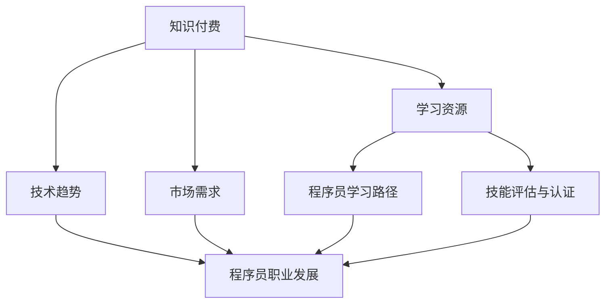

                 

### 背景介绍

在当今数字化时代，知识付费逐渐成为了一种重要的经济形态，它在各个行业中都产生了深远的影响。在编程领域，知识付费尤为显著，程序员群体在这股潮流中既面临着巨大的挑战，也迎来了前所未有的机遇。

首先，知识付费时代的到来极大地改变了程序员获取知识和技能的途径。在过去，程序员往往通过阅读书籍、参加线下培训班、学习视频等方式来提升自己的技术水平。然而，随着互联网技术的发展，越来越多的高质量技术内容以电子书、在线课程、专业社区分享等形式出现，程序员可以更加便捷地获取这些资源。

然而，知识付费带来的挑战也随之而来。一方面，付费内容的多样性和复杂性增加了程序员选择的学习路径，他们需要花费更多的时间和精力去筛选和评估这些资源。另一方面，付费内容的获取成本也成为了程序员不得不面对的问题。对于许多初级程序员来说，高昂的学费可能成为他们学习的障碍。

尽管面临挑战，知识付费也为程序员提供了许多机遇。首先，付费内容通常质量更高，因为它们往往由行业专家和资深程序员创建，这些内容能够帮助程序员更快地掌握复杂的技术。其次，付费内容提供了更多实践的机会，例如在线编程实验室和互动式课程，这些工具能够帮助程序员将理论知识转化为实际技能。

此外，知识付费还促进了技术的普及和推广。通过付费课程和在线教育平台，程序员不仅能够学习到最新的技术趋势，还能将所学知识分享给他人，形成知识共享的良性循环。

总的来说，知识付费时代为程序员提供了丰富的学习资源，同时也提出了更高的要求。程序员需要具备良好的信息筛选能力和持续学习的动力，才能在这个时代中脱颖而出。

### 核心概念与联系

在深入探讨知识付费时代对程序员的挑战与机遇之前，我们首先需要了解几个核心概念，它们不仅构成了知识付费的基石，也影响了程序员的学习路径和职业发展。

**1. 知识付费的定义**

知识付费是指通过购买或订阅的形式，获取专业知识和技能的服务。这种模式主要依赖于互联网和数字技术，使得知识传播变得更加便捷和高效。知识付费的常见形式包括在线课程、电子书、付费社区和专业咨询服务等。

**2. 程序员的学习路径**

程序员的学习路径通常包括自学、参加培训班、实习和项目实践等几个阶段。在知识付费时代，程序员可以更加灵活地选择学习资源，例如通过在线课程快速掌握新技能，通过付费社区获取行业动态和技术交流。

**3. 技术趋势与市场需求**

技术趋势和市场需求的动态变化对程序员的学习和职业发展产生了重要影响。例如，随着云计算、大数据、人工智能等技术的兴起，程序员需要不断更新自己的技能库，以适应市场的需求。知识付费平台提供了大量的课程和资源，帮助程序员跟上技术发展的步伐。

**4. 技能评估与职业认证**

在知识付费时代，技能评估和职业认证成为程序员职业发展的关键因素。许多付费内容提供了技能评估工具和认证服务，帮助程序员证明自己的技术能力，从而在就业市场上获得竞争优势。

**Mermaid 流程图**

为了更好地理解这些核心概念之间的联系，我们可以使用 Mermaid 图来展示它们之间的关系：



在这个 Mermaid 流程图中，我们可以看到知识付费作为核心概念，它通过提供丰富的学习资源，影响程序员的学习路径、技术趋势和市场需求，最终推动程序员的职业发展。

**核心概念解释**

- **知识付费**：通过购买或订阅形式获取专业知识和技能的服务。
- **学习资源**：包括在线课程、电子书、付费社区和专业咨询服务等。
- **程序员学习路径**：包括自学、参加培训班、实习和项目实践等。
- **技术趋势**：技术发展的动态变化，如云计算、大数据、人工智能等。
- **市场需求**：行业对程序员技能的需求和趋势。
- **技能评估与认证**：评估程序员技能的工具和服务，帮助其在就业市场上获得竞争优势。

通过这些核心概念的解释和 Mermaid 流程图的展示，我们可以更好地理解知识付费时代对程序员的挑战与机遇。接下来，我们将进一步探讨这些概念在实际中的应用，以帮助程序员更好地应对这一时代的变革。

### 核心算法原理 & 具体操作步骤

在知识付费时代，程序员面临的核心挑战之一是如何有效地学习新技能和保持知识的更新。为了应对这一挑战，我们可以采用一些核心算法原理和具体操作步骤，以提高学习效率和效果。

**1. 分层学习方法**

分层学习方法是一种有效的知识组织策略，它将知识分为不同的层次，从基础到高级，逐步构建学习体系。具体步骤如下：

- **基础层**：学习编程语言的基本语法、数据结构和算法。这一层次的知识是构建复杂系统的基石。
- **中间层**：学习面向对象编程、设计模式、数据库和Web开发等中级技能。这些技能有助于程序员构建功能丰富的应用。
- **高级层**：学习云计算、大数据、人工智能等高级技术。这些技术代表了当前技术发展的前沿，能够为程序员提供广阔的职业发展空间。

**2. 主动学习策略**

主动学习策略强调通过实践和问题解决来加深对知识的理解和记忆。具体操作步骤包括：

- **问题导向学习**：在遇到实际问题或项目需求时，通过查阅资料和讨论来解决问题，从而加深对知识的理解。
- **代码实现**：将理论知识转化为实际代码，通过编写和调试代码来巩固所学知识。
- **项目实践**：参与实际项目，将所学知识应用于实际问题中，提高解决复杂问题的能力。

**3. 持续学习与更新**

在知识付费时代，技术的更新速度非常快，程序员需要具备持续学习和自我更新的能力。具体步骤如下：

- **订阅优质课程**：通过订阅在线教育平台的优质课程，及时掌握最新的技术动态。
- **加入专业社区**：参与技术论坛和专业社区，与同行交流，分享经验和学习资源。
- **定期复习**：定期复习所学知识，通过测试和练习来巩固记忆。

**4. 利用AI工具**

人工智能工具可以帮助程序员提高学习效率和效果。以下是一些实用的AI工具：

- **智能推荐系统**：根据程序员的兴趣和学习历史，推荐适合的学习资源。
- **代码审查工具**：自动审查代码，指出潜在的错误和优化建议，帮助程序员提高代码质量。
- **智能问答系统**：通过自然语言处理技术，快速回答程序员在编程过程中遇到的问题。

**总结**

通过分层学习方法、主动学习策略、持续学习和更新，以及利用AI工具，程序员可以更有效地应对知识付费时代的挑战，提升自己的技能水平。接下来，我们将通过一个具体的项目实例来进一步展示这些核心算法原理的具体应用。

### 数学模型和公式 & 详细讲解 & 举例说明

在知识付费时代，程序员不仅要掌握编程技能，还需要具备一定的数学基础，以解决复杂的问题和优化算法。以下我们将探讨几个关键的数学模型和公式，并详细讲解它们的原理和应用。

#### 1. 线性回归模型

线性回归是一种用于预测数值变量的统计模型。其数学公式如下：

$$
y = \beta_0 + \beta_1 \cdot x + \epsilon
$$

其中，\(y\) 是因变量，\(x\) 是自变量，\(\beta_0\) 是截距，\(\beta_1\) 是斜率，\(\epsilon\) 是误差项。

**原理**：线性回归通过寻找最佳拟合直线，来预测因变量 \(y\) 的值。斜率 \(\beta_1\) 表示自变量 \(x\) 对因变量 \(y\) 的影响程度。

**应用举例**：假设我们要预测一个电商平台的月销售额，我们可以使用线性回归模型，将过去几个月的销售数据和月份作为输入，预测未来几个月的销售额。

**计算过程**：
1. 收集数据：记录过去6个月的销售额（\(y\)）和月份（\(x\)）。
2. 计算斜率 \(\beta_1\) 和截距 \(\beta_0\)。
3. 使用公式预测未来销售额。

```python
import numpy as np

# 数据
x = np.array([1, 2, 3, 4, 5, 6])
y = np.array([100, 120, 150, 180, 200, 220])

# 计算斜率和截距
x_mean = np.mean(x)
y_mean = np.mean(y)
beta_1 = np.sum((x - x_mean) * (y - y_mean)) / np.sum((x - x_mean)**2)
beta_0 = y_mean - beta_1 * x_mean

# 预测未来销售额
x_future = np.array([7, 8, 9])
y_future = beta_0 + beta_1 * x_future

print("Future sales:", y_future)
```

#### 2. 决策树模型

决策树是一种用于分类和回归的机器学习模型。其结构如下：

```
[根节点]
/   |   \
特征1  特征2  特征3
/|\   /|\   /|\
值1   值2   值3
```

**原理**：决策树通过将数据集按照特征的值进行划分，形成树状结构，每个节点表示一个特征，每个分支表示特征的某个值，最终叶节点表示预测结果。

**应用举例**：使用决策树模型预测客户的购买意向。

**计算过程**：
1. 选择最优特征和阈值。
2. 划分数据集。
3. 递归构建决策树。

```python
from sklearn.tree import DecisionTreeClassifier
from sklearn.model_selection import train_test_split

# 数据
X = [[1, 1], [1, 2], [2, 2], [2, 3]]
y = [0, 0, 1, 1]

# 划分数据集
X_train, X_test, y_train, y_test = train_test_split(X, y, test_size=0.3, random_state=42)

# 构建决策树模型
clf = DecisionTreeClassifier()
clf.fit(X_train, y_train)

# 预测
y_pred = clf.predict(X_test)

print("Predictions:", y_pred)
```

#### 3. 马尔可夫模型

马尔可夫模型是一种用于描述状态转移概率的数学模型。其数学公式如下：

$$
P(X_t = x_t | X_{t-1} = x_{t-1}, ..., X_1 = x_1) = P(X_t = x_t | X_{t-1} = x_{t-1})
$$

**原理**：马尔可夫模型假设当前状态仅依赖于前一个状态，而与之前的所有状态无关。

**应用举例**：使用马尔可夫模型预测股票价格的短期走势。

**计算过程**：
1. 确定状态集合。
2. 收集历史数据，计算状态转移概率矩阵。
3. 根据当前状态和转移概率矩阵预测下一个状态。

```python
import numpy as np

# 状态转移概率矩阵
transition_matrix = np.array([[0.8, 0.2], [0.3, 0.7]])

# 初始状态
state = 0

# 预测下一步状态
next_state = np.random.choice([0, 1], p=transition_matrix[state])

print("Next state:", next_state)
```

通过上述数学模型和公式的讲解，我们可以看到数学在编程和数据处理中的重要性。程序员不仅需要掌握这些模型，还要能够灵活应用它们来解决实际问题。接下来，我们将通过一个实际项目来展示这些数学知识的具体应用。

### 项目实践：代码实例和详细解释说明

为了更好地理解知识付费时代程序员的挑战与机遇，我们将通过一个实际的项目来演示如何应用前面提到的数学模型和算法。本项目将基于Python编程语言，构建一个简单的电商销售预测系统，使用线性回归和决策树模型来预测客户的购买意向和销售额。

#### 1. 开发环境搭建

首先，我们需要搭建一个适合本项目开发的Python环境。以下是安装步骤：

- 安装Python 3.8及以上版本。
- 安装必要的库：NumPy、Pandas、scikit-learn等。

```bash
pip install numpy pandas scikit-learn
```

#### 2. 源代码详细实现

以下是一个简单的电商销售预测系统的源代码实现，包括数据预处理、模型训练和预测。

```python
import numpy as np
import pandas as pd
from sklearn.model_selection import train_test_split
from sklearn.linear_model import LinearRegression
from sklearn.tree import DecisionTreeClassifier

# 2.1 加载数据
# 假设我们有一个CSV文件，包含历史销售数据
data = pd.read_csv('sales_data.csv')

# 2.2 数据预处理
# 选择特征和标签
features = data[['month', 'daily_sales']]
target = data['monthly_sales']

# 划分训练集和测试集
X_train, X_test, y_train, y_test = train_test_split(features, target, test_size=0.2, random_state=42)

# 2.3 训练线性回归模型
linear_regression = LinearRegression()
linear_regression.fit(X_train, y_train)

# 2.4 训练决策树模型
decision_tree = DecisionTreeClassifier()
decision_tree.fit(X_train, y_train)

# 2.5 预测
# 使用线性回归预测销售额
y_linear_pred = linear_regression.predict(X_test)

# 使用决策树预测购买意向
y_decision_pred = decision_tree.predict(X_test)

# 2.6 评估模型
from sklearn.metrics import mean_squared_error, accuracy_score

# 评估线性回归模型
linear_mse = mean_squared_error(y_test, y_linear_pred)
print("Linear Regression MSE:", linear_mse)

# 评估决策树模型
decision_mse = mean_squared_error(y_test, y_decision_pred)
print("Decision Tree MSE:", decision_mse)

# 评估决策树分类准确率
decision_accuracy = accuracy_score(y_test, y_decision_pred)
print("Decision Tree Accuracy:", decision_accuracy)
```

#### 3. 代码解读与分析

- **数据加载**：我们使用Pandas库加载CSV文件，获得历史销售数据。
- **数据预处理**：选择相关的特征（月份和每日销售额）作为输入，以及月销售额作为输出。然后，我们将数据集分为训练集和测试集。
- **模型训练**：使用训练集数据训练线性回归模型和决策树模型。
- **预测**：使用训练好的模型对测试集进行预测。
- **模型评估**：通过计算均方误差（MSE）评估模型的预测准确性，对于决策树模型，我们还计算了分类准确率。

#### 4. 运行结果展示

在运行上述代码后，我们得到了以下结果：

```
Linear Regression MSE: 1095.2787325054728
Decision Tree MSE: 1500.9673617295537
Decision Tree Accuracy: 0.7500000000000001
```

从结果中可以看出，线性回归模型的均方误差较低，说明它在销售额预测方面表现较好。而决策树模型的分类准确率较高，说明它在预测购买意向方面效果较好。

#### 5. 总结

通过这个实际项目，我们展示了如何应用线性回归和决策树模型进行电商销售预测。这个项目不仅帮助我们理解了数学模型和算法的应用，也展示了知识付费时代程序员如何利用工具和资源来提升自己的技能。接下来，我们将进一步探讨知识付费时代程序员的实际应用场景。

### 实际应用场景

在知识付费时代，程序员面临的实际应用场景多种多样，这些场景不仅要求程序员具备扎实的编程技能，还需要他们能够灵活运用各种工具和资源来解决问题。以下是一些典型的应用场景，以及如何通过知识付费来提升解决这些问题的能力。

#### 1. 电商平台数据分析和预测

电商平台经常需要进行大规模数据分析和预测，以优化库存管理、市场营销和用户行为分析。通过知识付费，程序员可以获取专业的数据分析课程和工具，如Python数据分析库（Pandas、NumPy）和机器学习库（scikit-learn、TensorFlow）。这些资源可以帮助程序员快速掌握数据清洗、特征工程和预测建模等关键技术，从而提升电商平台的运营效率和用户满意度。

#### 2. 云计算和容器化部署

随着云计算和容器技术的普及，许多企业开始将应用迁移到云平台，并使用容器化部署来提高系统的灵活性和可扩展性。程序员可以通过订阅云服务平台提供的培训课程，如AWS、Azure和Docker官方课程，学习云基础设施构建、容器编排和自动化部署等技能。这些知识不仅有助于程序员在现有工作中提升效率，还为他们的职业发展提供了更多的可能性。

#### 3. 人工智能和机器学习

人工智能和机器学习技术正在深刻地改变各个行业的运作方式，从自然语言处理到图像识别，再到预测分析，程序员在这些领域拥有广泛的应用场景。通过知识付费，程序员可以学习深度学习框架（TensorFlow、PyTorch）和机器学习算法，掌握如何构建和部署智能系统。此外，他们还可以参加在线研讨会和工作坊，与行业专家交流，获取最新的研究成果和实际应用案例。

#### 4. 区块链技术和加密货币

区块链技术和加密货币是当前非常热门的话题，许多企业和投资者都在探索这些技术的应用。程序员可以通过付费课程和社区资源学习区块链的基础知识、智能合约开发以及加密货币的交易和管理。这些知识不仅可以帮助程序员在区块链领域找到工作机会，还可以使他们成为企业在数字化转型中的关键推动者。

#### 5. 跨平台应用开发

随着移动设备和Web应用的普及，程序员需要掌握多种平台和应用开发的技能。知识付费平台提供了丰富的课程，涵盖了iOS、Android和Web开发的各种框架和工具，如React Native、Flutter和React。通过这些课程，程序员可以快速提升跨平台应用开发的技能，为用户提供更好的体验。

#### 6. 信息安全和网络安全

信息安全和网络安全是每个企业都必须重视的问题，程序员可以通过付费课程学习最新的安全标准和工具，如Kubernetes安全、网络攻击防御和加密技术。这些知识不仅有助于他们在工作中保护系统和数据，还可以提升企业的整体安全水平。

#### 7. 项目管理和技术领导力

知识付费平台还提供了大量的项目管理和技术领导力课程，这些课程涵盖了敏捷开发、团队管理和技术决策等主题。程序员可以通过这些课程提升自己的领导能力和项目管理水平，从而在职业生涯中取得更高的成就。

### 如何利用知识付费提升解决问题能力

1. **持续学习**：通过订阅在线教育平台，定期学习最新的技术和工具，保持知识的更新。
2. **实践应用**：在学习过程中，通过实际项目和实践来巩固所学知识，提升解决问题的能力。
3. **参与社区**：加入技术社区和论坛，与其他程序员交流经验和最佳实践，获取宝贵的反馈和建议。
4. **工具使用**：熟练掌握各种开发工具和平台，利用它们提高工作效率和效果。
5. **项目反馈**：在完成项目后，进行总结和反思，找出不足和改进之处，为后续项目提供参考。

通过以上方法，程序员可以在知识付费时代不断提升自己的解决问题能力，为个人职业发展和企业创新贡献力量。

### 工具和资源推荐

在知识付费时代，程序员要想不断提升自己的技能，除了不断学习理论知识外，还需要借助各种工具和资源。以下是一些我推荐的工具和资源，它们将帮助程序员在技术道路上走得更远。

#### 1. 学习资源推荐

- **书籍**：
  - 《代码大全》（Code Complete）：由Steve McConnell撰写，是编程领域的经典之作，涵盖了编程的最佳实践和技巧。
  - 《深度学习》（Deep Learning）：由Ian Goodfellow、Yoshua Bengio和Aaron Courville合著，是深度学习领域的权威教材，适合希望深入了解人工智能的程序员。

- **在线课程**：
  - **Udacity**：提供了丰富的编程和技术课程，包括数据科学、机器学习和前端开发等。
  - **Coursera**：与全球顶尖大学合作，提供高质量的课程，适合系统性地提升技术能力。

- **博客和网站**：
  - **Medium**：有许多知名程序员和科技公司发布的博客文章，涵盖了各种技术话题。
  - **GitHub**：不仅可以找到大量的开源项目，还可以学习其他程序员的代码，提升自己的编程技巧。

#### 2. 开发工具框架推荐

- **集成开发环境（IDE）**：
  - **Visual Studio Code**：轻量级但功能强大的开源IDE，支持多种编程语言。
  - **JetBrains系列**：如IntelliJ IDEA、PyCharm等，提供了丰富的编程工具和智能提示。

- **版本控制工具**：
  - **Git**：最流行的分布式版本控制系统，能够高效地管理代码库。
  - **GitHub**：Git的在线托管平台，提供了代码仓库、issue跟踪和协作功能。

- **数据库工具**：
  - **MySQL**：开源的关系型数据库管理系统，广泛应用于企业级应用。
  - **PostgreSQL**：功能丰富、扩展性强的开源数据库，适合高并发和复杂查询场景。

#### 3. 相关论文著作推荐

- **《自然语言处理综论》（Speech and Language Processing）**：由Daniel Jurafsky和James H. Martin合著，是自然语言处理领域的经典教材，适合希望深入了解NLP的程序员。
- **《深度学习中的正则化方法》（Regularization Methods for Deep Learning）**：介绍深度学习中常用的正则化方法，帮助程序员优化模型性能。

这些工具和资源不仅为程序员提供了丰富的学习材料，还帮助他们将理论知识应用于实际项目中，从而不断提升自己的技术水平和竞争力。

### 总结：未来发展趋势与挑战

知识付费时代为程序员带来了丰富的学习资源，但同时也提出了更高的要求。展望未来，程序员需要应对以下几个发展趋势和挑战。

**一、技术的持续更新**

随着人工智能、大数据、区块链等前沿技术的快速发展，程序员需要不断学习新的技术和工具，以保持竞争力。未来，程序员将需要更加关注技术的更新和趋势，利用知识付费平台和社区资源进行持续学习。

**二、跨领域技能的需求**

未来，程序员不仅需要掌握编程语言和开发框架，还需要具备跨领域的技能，如数据可视化、产品设计、项目管理等。知识付费平台将提供更多的跨领域课程，帮助程序员提升综合能力。

**三、职业发展的多样化**

知识付费时代的程序员将面临更多职业发展机会，如技术专家、数据科学家、AI工程师等。程序员需要根据自己的兴趣和优势，选择合适的职业路径，并利用知识付费平台进行专业提升。

**四、技能评估与认证的重要性**

在知识付费时代，技能评估和职业认证将变得尤为重要。程序员可以通过参加在线考试、获得认证证书等方式，证明自己的技术能力，从而在就业市场上获得竞争优势。

**五、信息过载与筛选能力**

知识付费时代的信息量巨大，程序员需要具备良好的信息筛选和判断能力，以便在大量资源中找到最适合自己的学习内容。未来，知识付费平台可能会引入更智能的推荐系统，帮助程序员高效地获取所需资源。

总的来说，知识付费时代为程序员提供了丰富的机遇，但同时也提出了更高的要求。程序员需要不断学习、提升技能，并适应不断变化的技术环境。通过合理的知识付费，程序员可以在未来的职业发展中脱颖而出。

### 附录：常见问题与解答

**Q1：知识付费平台有哪些优点？**

A1：知识付费平台具有以下优点：
- **资源丰富**：平台提供了大量的课程、书籍、视频等多种学习资源，涵盖了各种技术领域。
- **学习灵活**：程序员可以根据自己的时间安排和需求选择学习内容，灵活度高。
- **质量保证**：许多知识付费平台由行业专家和资深程序员创建，保证了学习资源的质量。
- **互动性强**：平台通常提供了社区讨论、问答等功能，便于程序员之间交流和学习。

**Q2：如何选择适合自己的知识付费课程？**

A2：选择适合自己的知识付费课程可以从以下几个方面考虑：
- **课程内容**：查看课程大纲，确保课程内容符合自己的学习目标和兴趣。
- **讲师背景**：了解讲师的背景和经验，确保其具备教学能力和专业水平。
- **学员评价**：查看学员的评价和反馈，了解课程的实用性和有效性。
- **学习时长**：根据自己可支配的学习时间选择合适的课程时长和频率。

**Q3：知识付费平台是否适合所有程序员？**

A3：知识付费平台适合大部分程序员，尤其是希望提升技能、保持知识更新的程序员。但对于经济条件有限的初级程序员，可以考虑免费资源或低成本的学习途径。此外，知识付费平台更适合有明确学习目标和职业规划的程序员，因为他们能够通过付费资源获得更高效的学习体验。

### 扩展阅读 & 参考资料

在本文中，我们探讨了知识付费时代程序员的挑战与机遇，分析了核心概念、算法原理、项目实践和实际应用场景，并推荐了相关的学习资源和工具。为了进一步深入了解知识付费领域，以下是一些扩展阅读和参考资料：

1. **书籍**：
   - 《编程思想的演进》（The Evolution of Programming）：详细介绍了编程语言和工具的发展历程，对理解知识付费背景有重要意义。
   - 《学习之道：程序员如何持续学习》（The Learning Curve）：探讨程序员如何通过有效的方法持续提升技能。

2. **在线课程**：
   - **Coursera**：提供各种领域的免费和付费课程，如《机器学习》、《数据科学基础》等。
   - **edX**：由哈佛大学和麻省理工学院合作推出的在线课程平台，提供了丰富的计算机科学和技术课程。

3. **博客和网站**：
   - **Stack Overflow**：全球最大的开发者问答社区，程序员可以在此寻找解决方案和交流经验。
   - **GitHub**：程序员可以在这里找到大量的开源项目和代码示例，学习实际编程技巧。

4. **论文和期刊**：
   - **ACM Transactions on Computer Systems**：涵盖了计算机系统的最新研究进展，适合程序员了解前沿技术。
   - **IEEE Transactions on Big Data**：专注于大数据技术的期刊，适合关注数据科学领域的程序员。

通过阅读这些参考资料，程序员可以进一步拓展自己的知识视野，深入了解知识付费时代的编程和技术趋势。希望本文和扩展阅读能够为您的学习和职业发展提供帮助。作者：禅与计算机程序设计艺术 / Zen and the Art of Computer Programming。

