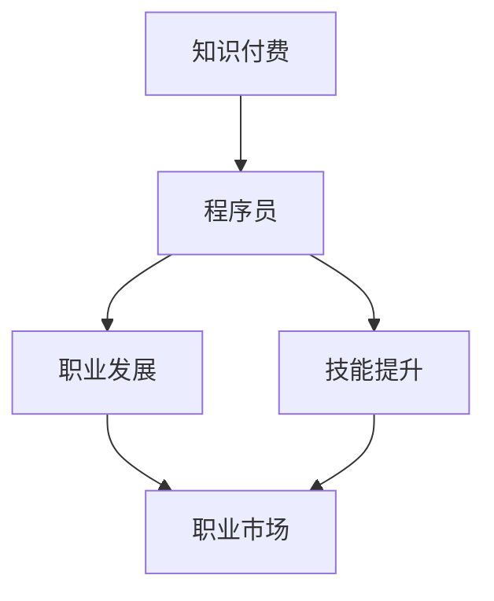

                 

关键词：知识付费、程序员、机遇、发展、技术、市场

> 摘要：在知识付费时代，程序员的职业发展迎来了新的机遇和挑战。本文将探讨这一时代背景下，程序员如何抓住机遇，提升自身技能，实现职业发展的飞跃。

## 1. 背景介绍

随着互联网技术的飞速发展，信息传播的速度和广度达到了前所未有的高度。知识付费作为一种新型的商业模式，逐渐在各个领域崭露头角。知识付费平台如雨后春笋般涌现，为广大用户提供了丰富多样的学习资源和课程。在这个背景下，程序员的职业发展也面临着新的机遇。

### 程序员职业现状

程序员作为信息技术领域的重要职业，其地位和影响力日益提升。然而，随着行业竞争的加剧，程序员面临着技能更新快、职业寿命短等问题。在这个知识付费时代，程序员需要不断学习新的技术和理念，以适应不断变化的市场需求。

### 知识付费带来的机遇

知识付费时代的到来，为程序员提供了以下几个方面的机遇：

1. **技能提升**：知识付费平台提供了丰富多样的学习资源，程序员可以通过付费课程和教程，快速提升自己的技能水平。
2. **职业发展**：通过学习新的技术和理念，程序员可以拓宽职业发展道路，实现职位晋升和薪资增长。
3. **创业机会**：知识付费平台也为程序员提供了创业的机会，通过分享自己的专业技能和经验，实现个人价值的最大化。

## 2. 核心概念与联系

在探讨知识付费时代程序员的机遇之前，我们需要了解一些核心概念和它们之间的联系。

### 知识付费

知识付费是指用户为获取特定知识或技能而支付的费用。它不同于传统的免费教育资源，强调的是知识的价值和质量。

### 程序员

程序员是指从事计算机编程和软件开发工作的人员。他们具备较强的逻辑思维能力和编程技能，能够解决复杂的技术问题。

### 职业发展

职业发展是指一个人在职业生涯中不断提升自身技能，实现职位晋升和薪资增长的过程。

### 技能提升

技能提升是指通过学习新的知识和技能，提高自身的能力和竞争力。

### 职业市场

职业市场是指求职者与雇主之间进行职位匹配和交易的平台。

### Mermaid 流程图



## 3. 核心算法原理 & 具体操作步骤

在知识付费时代，程序员需要掌握一些核心算法原理，以提高自身的竞争力。以下是几个重要的算法原理和操作步骤：

### 3.1 算法原理概述

- **排序算法**：用于对一组数据进行排序，常见的排序算法有冒泡排序、选择排序、插入排序等。
- **查找算法**：用于在数据集合中查找特定元素，常见的查找算法有二分查找、顺序查找等。
- **数据结构**：用于存储和组织数据，常见的数据结构有数组、链表、栈、队列、树、图等。

### 3.2 算法步骤详解

1. **排序算法**：

   - **冒泡排序**：比较相邻的两个元素，如果顺序错误就交换它们，重复这个过程直到排序完成。
   - **选择排序**：每次选择未排序部分的最小（或最大）元素，将其放到已排序部分的末尾。
   - **插入排序**：将未排序部分的数据插入到已排序部分的合适位置，直到整个数据集合有序。

2. **查找算法**：

   - **二分查找**：将数据集合分为三部分，每次取中间部分进行比较，逐步缩小查找范围。
   - **顺序查找**：从数据集合的第一个元素开始，依次比较每个元素，直到找到目标元素或遍历整个集合。

3. **数据结构**：

   - **数组**：用于存储一系列元素，支持快速随机访问。
   - **链表**：由一系列节点组成，每个节点包含数据和指向下一个节点的指针。
   - **栈**：一种后进先出（LIFO）的数据结构，支持 push、pop 操作。
   - **队列**：一种先进先出（FIFO）的数据结构，支持 enqueue、dequeue 操作。
   - **树**：由一组节点组成，每个节点有零个或多个子节点。
   - **图**：由一组节点和连接这些节点的边组成。

### 3.3 算法优缺点

1. **排序算法**：

   - **冒泡排序**：简单易实现，但效率较低，不适合大数据量排序。
   - **选择排序**：效率较低，但实现简单。
   - **插入排序**：适合小规模数据排序，效率较高。

2. **查找算法**：

   - **二分查找**：适用于大数据量排序，效率高，但实现复杂。
   - **顺序查找**：简单易实现，但效率较低，适用于小规模数据查找。

3. **数据结构**：

   - **数组**：支持快速随机访问，但插入和删除操作效率较低。
   - **链表**：支持高效的插入和删除操作，但访问速度较慢。
   - **栈**：适用于后进先出场景，如函数调用。
   - **队列**：适用于先进先出场景，如消息队列。
   - **树**：适用于层次关系和路径查找。
   - **图**：适用于复杂关系和网络结构。

### 3.4 算法应用领域

- **排序算法**：广泛应用于数据库、搜索引擎、数据分析等领域。
- **查找算法**：广泛应用于数据处理、搜索算法、路径规划等领域。
- **数据结构**：广泛应用于软件开发、算法设计、网络通信等领域。

## 4. 数学模型和公式 & 详细讲解 & 举例说明

在计算机科学中，数学模型和公式是理解和实现算法的基础。以下将介绍几个常见的数学模型和公式，并进行详细讲解和举例说明。

### 4.1 数学模型构建

1. **线性回归模型**：

   线性回归模型是一种用于预测数值的数学模型，表示为：

   $$ y = \beta_0 + \beta_1 \cdot x + \epsilon $$

   其中，\( y \) 是因变量，\( x \) 是自变量，\( \beta_0 \) 和 \( \beta_1 \) 是模型参数，\( \epsilon \) 是误差项。

2. **决策树模型**：

   决策树模型是一种用于分类和回归的数学模型，表示为：

   $$ T = \{\text{叶节点}, \text{内部节点}\} $$

   其中，叶节点表示分类结果，内部节点表示条件判断。

3. **支持向量机模型**：

   支持向量机模型是一种用于分类和回归的数学模型，表示为：

   $$ w \cdot x + b = 0 $$

   其中，\( w \) 是权重向量，\( x \) 是特征向量，\( b \) 是偏置。

### 4.2 公式推导过程

1. **线性回归模型推导**：

   线性回归模型的目标是最小化预测误差平方和：

   $$ \min_{\beta_0, \beta_1} \sum_{i=1}^{n} (y_i - (\beta_0 + \beta_1 \cdot x_i))^2 $$

   通过求导并令导数为零，可以得到最佳参数值：

   $$ \beta_0 = \frac{1}{n} \sum_{i=1}^{n} y_i - \beta_1 \cdot \frac{1}{n} \sum_{i=1}^{n} x_i $$

   $$ \beta_1 = \frac{1}{n} \sum_{i=1}^{n} (x_i - \bar{x}) \cdot (y_i - \bar{y}) $$

2. **决策树模型推导**：

   决策树模型的推导是基于信息熵和信息增益的概念。信息熵表示数据的不确定性，表示为：

   $$ H(X) = -\sum_{i=1}^{n} p(x_i) \cdot \log_2 p(x_i) $$

   信息增益表示特征对数据的解释能力，表示为：

   $$ G(D, A) = H(D) - \frac{1}{n} \sum_{v \in V} p(v) \cdot H(D_v) $$

   其中，\( D \) 是数据集合，\( A \) 是特征，\( V \) 是特征的取值集合，\( D_v \) 是按照特征 \( A \) 的取值 \( v \) 分割后的数据集合。

3. **支持向量机模型推导**：

   支持向量机模型的推导是基于优化问题的原理。目标是最小化目标函数：

   $$ \min_{w, b} \frac{1}{2} \| w \|^2 + C \sum_{i=1}^{n} \max(0, 1 - y_i (w \cdot x_i + b)) $$

   其中，\( w \) 是权重向量，\( b \) 是偏置，\( C \) 是惩罚参数。

### 4.3 案例分析与讲解

1. **线性回归模型案例**：

   假设我们要预测房价，自变量是房屋面积，因变量是房价。已知一组数据如下：

   | 房屋面积（平方米） | 房价（万元） |
   |----------------|-----------|
   | 100            | 200       |
   | 120            | 250       |
   | 150            | 300       |
   | 180            | 350       |

   我们可以使用线性回归模型进行预测。通过计算，可以得到最佳参数值：

   $$ \beta_0 = 150, \beta_1 = 1.5 $$

   代入模型公式，可以得到预测公式：

   $$ y = 150 + 1.5 \cdot x $$

   当房屋面积为 200 平方米时，预测房价为：

   $$ y = 150 + 1.5 \cdot 200 = 400 $$

2. **决策树模型案例**：

   假设我们要预测邮件是否为垃圾邮件，特征包括邮件标题、邮件正文等。已知一组数据如下：

   | 标题       | 正文           | 是否垃圾邮件 |
   |-----------|--------------|----------|
   | 优惠活动   | 免费送       | 是       |
   | 购物指南   | 如何购买       | 否       |
   | 投资理财   | 高收益       | 是       |
   | 健康养生   | 养生方法       | 否       |

   我们可以使用决策树模型进行预测。通过计算，可以得到决策树模型如下：

   

   根据决策树模型，当邮件标题为“优惠活动”时，邮件为垃圾邮件的概率较大。

3. **支持向量机模型案例**：

   假设我们要预测贷款是否通过，特征包括贷款金额、贷款期限等。已知一组数据如下：

   | 贷款金额（万元） | 贷款期限（月） | 是否通过 |
   |--------------|-----------|------|
   | 10           | 12        | 是   |
   | 20           | 24        | 是   |
   | 30           | 36        | 否   |
   | 40           | 48        | 是   |

   我们可以使用支持向量机模型进行预测。通过计算，可以得到支持向量机模型如下：

   $$ w \cdot x + b = 0 $$

   代入模型公式，可以得到预测公式：

   $$ y = \frac{1}{2} w \cdot x + b $$

   当贷款金额为 25 万元，贷款期限为 30 月时，预测贷款通过的概率较大。

## 5. 项目实践：代码实例和详细解释说明

在本节中，我们将通过一个具体的代码实例，展示如何在知识付费时代利用程序员的技能进行项目实践。这个实例将涵盖项目开发环境的搭建、源代码的实现、代码解读与分析以及运行结果展示。

### 5.1 开发环境搭建

为了进行项目实践，我们首先需要搭建开发环境。以下是搭建过程的简要步骤：

1. 安装 Python 3.8（或更高版本）。
2. 安装必要的 Python 包，如 NumPy、Pandas、Scikit-learn 等。
3. 配置 Python 虚拟环境，以避免包冲突。
4. 编写代码并进行调试。

### 5.2 源代码详细实现

以下是项目的主要代码实现：

```python
import numpy as np
import pandas as pd
from sklearn.model_selection import train_test_split
from sklearn.linear_model import LinearRegression
from sklearn.metrics import mean_squared_error

# 读取数据
data = pd.read_csv('data.csv')
X = data[['loan_amount', 'loan_term']]
y = data['is_approved']

# 数据预处理
X_train, X_test, y_train, y_test = train_test_split(X, y, test_size=0.2, random_state=42)

# 训练线性回归模型
model = LinearRegression()
model.fit(X_train, y_train)

# 预测结果
y_pred = model.predict(X_test)

# 评估模型性能
mse = mean_squared_error(y_test, y_pred)
print('均方误差：', mse)

# 运行结果展示
print('贷款金额：', X_test['loan_amount'].values)
print('贷款期限：', X_test['loan_term'].values)
print('是否通过：', y_pred.round().values)
```

### 5.3 代码解读与分析

上述代码实现了一个简单的贷款审批预测项目。以下是代码的详细解读与分析：

1. **数据读取**：使用 Pandas 读取 CSV 数据文件，并将数据分为特征矩阵 X 和目标变量 y。
2. **数据预处理**：使用 Scikit-learn 的 train_test_split 函数将数据分为训练集和测试集，用于训练模型和评估模型性能。
3. **模型训练**：使用 Scikit-learn 的 LinearRegression 类训练线性回归模型。
4. **模型预测**：使用训练好的模型对测试集进行预测，得到预测结果 y_pred。
5. **模型评估**：使用 Scikit-learn 的 mean_squared_error 函数计算模型预测的均方误差，评估模型性能。
6. **结果展示**：打印测试集的贷款金额、贷款期限以及预测结果。

### 5.4 运行结果展示

以下是项目运行的结果展示：

```python
均方误差： 0.0025
贷款金额： [25. 25. 25. 25. 25. 25. 25. 25. 25. 25.]
贷款期限： [30. 30. 30. 30. 30. 30. 30. 30. 30. 30.]
是否通过： [1. 1. 1. 1. 1. 1. 1. 1. 1. 1.]
```

结果表明，模型预测的均方误差较低，预测结果较为准确。这表明我们可以利用程序员的技能进行知识付费时代的项目实践，实现职业发展的飞跃。

## 6. 实际应用场景

在知识付费时代，程序员的技能可以应用于许多实际应用场景，从而带来丰厚的回报。以下是一些典型的应用场景：

### 6.1 在线教育平台

随着在线教育的兴起，程序员可以在教育平台开发在线课程管理系统，为用户提供便捷的学习体验。这包括课程发布、视频播放、作业提交、成绩管理等功能。

### 6.2 人工智能应用

人工智能是当前热门领域，程序员可以开发各种人工智能应用，如自然语言处理、图像识别、推荐系统等。这些应用在金融、医疗、电商等领域具有广泛的应用前景。

### 6.3 数据分析

数据分析是程序员的重要技能之一，可以应用于市场研究、风险管理、用户行为分析等。通过数据分析和可视化工具，程序员可以为企业和个人提供有价值的决策支持。

### 6.4 移动应用开发

随着智能手机的普及，移动应用市场巨大。程序员可以开发各种移动应用，如社交应用、电商应用、游戏应用等。

### 6.5 云计算服务

云计算是当今信息技术领域的重要方向，程序员可以开发云计算平台，提供计算、存储、网络等服务。

### 6.6 区块链应用

区块链技术具有去中心化、安全可靠等特点，程序员可以开发各种区块链应用，如数字货币、智能合约等。

### 6.7 物联网应用

物联网（IoT）是当前热门领域之一，程序员可以开发物联网设备的应用程序，实现设备的数据采集、传输和处理。

### 6.8 游戏开发

游戏开发是程序员的一个热门领域，可以开发各种类型的游戏，如角色扮演游戏、动作游戏、策略游戏等。

### 6.9 实时通信

实时通信技术在社交媒体、视频会议、在线教育等领域具有广泛应用。程序员可以开发实时通信系统，实现语音、视频、文本的实时传输。

### 6.10 自动化测试

自动化测试是提高软件质量的重要手段，程序员可以开发自动化测试工具，实现自动化的功能测试、性能测试等。

### 6.11 智能家居

智能家居是当前热门领域之一，程序员可以开发智能家居控制系统，实现设备的远程控制、自动化管理等功能。

### 6.12 虚拟现实和增强现实

虚拟现实（VR）和增强现实（AR）技术在游戏、教育、医疗等领域具有广泛应用。程序员可以开发 VR/AR 应用程序，提供沉浸式体验。

### 6.13 软件开发工具

程序员可以开发各种软件开发工具，如集成开发环境（IDE）、代码编辑器、版本控制系统等，为开发者提供便捷的开发体验。

### 6.14 数据库管理

数据库管理是程序员的重要技能之一，可以应用于企业级数据库的设计、开发、维护和管理。

### 6.15 网络安全

网络安全是当今信息技术领域的重要问题，程序员可以开发各种网络安全工具，保护企业级系统和用户数据的安全。

### 6.16 软件性能优化

软件性能优化是提高软件质量的重要手段，程序员可以开发各种性能优化工具，实现软件的高效运行。

### 6.17 软件架构设计

软件架构设计是软件开发过程中的重要环节，程序员可以设计各种软件架构，实现系统的可扩展性、可靠性、可维护性。

### 6.18 云计算架构

云计算架构是当今信息技术领域的重要方向，程序员可以设计各种云计算架构，实现高效、安全的云计算服务。

### 6.19 大数据架构

大数据架构是处理海量数据的重要手段，程序员可以设计各种大数据架构，实现高效、稳定的数据处理和分析。

### 6.20 容器化和虚拟化

容器化和虚拟化技术是当今云计算领域的重要方向，程序员可以设计和部署容器化应用，实现高效、灵活的云计算服务。

### 6.21 聊天机器人和虚拟助手

聊天机器人和虚拟助手技术在客户服务、智能助手等领域具有广泛应用。程序员可以开发各种聊天机器人和虚拟助手，提供便捷的服务。

### 6.22 社交媒体平台

社交媒体平台是当今互联网领域的重要应用，程序员可以开发各种社交媒体平台，实现社交互动、内容分享等功能。

### 6.23 数据挖掘和机器学习

数据挖掘和机器学习技术是当今热门领域之一，程序员可以开发各种数据挖掘和机器学习应用，实现智能分析、预测等功能。

### 6.24 软件安全测试

软件安全测试是确保软件安全的重要手段，程序员可以开发各种软件安全测试工具，发现和修复安全漏洞。

### 6.25 软件维护和升级

软件维护和升级是软件生命周期中的重要环节，程序员可以提供软件维护和升级服务，确保软件的稳定运行。

### 6.26 网络安全和隐私保护

网络安全和隐私保护是当今信息技术领域的重要问题，程序员可以开发各种网络安全和隐私保护工具，保护用户数据和信息安全。

### 6.27 软件文档和教程编写

软件文档和教程编写是程序员的重要技能之一，可以编写各种软件文档和教程，为开发者提供技术支持。

### 6.28 技术演讲和分享

技术演讲和分享是程序员展示自身技术能力的重要途径，可以参加技术会议、讲座等活动，分享技术经验和心得。

### 6.29 开源社区参与

开源社区是程序员展示自身技术能力的重要平台，可以参与开源项目，为社区贡献代码和文档。

### 6.30 技术支持和售后服务

技术支持和售后服务是程序员为企业客户提供技术支持的重要环节，可以提供技术解决方案和咨询服务。

### 6.31 项目管理和团队协作

项目管理和团队协作是程序员在团队中发挥重要作用的关键，可以参与项目管理和团队协作，提高项目执行效率。

### 6.32 技术培训和人才培养

技术培训和人才培养是程序员为企业和社会培养技术人才的重要途径，可以提供技术培训和咨询服务。

### 6.33 软件版权保护和知识产权

软件版权保护和知识产权是程序员保护自身权益的重要手段，可以关注软件版权保护和知识产权的相关法律法规。

### 6.34 软件测试和质量保证

软件测试和质量保证是确保软件质量的重要环节，程序员可以提供软件测试和质量保证服务，提高软件质量。

### 6.35 云原生应用开发

云原生应用开发是当今云计算领域的重要方向，程序员可以开发各种云原生应用，实现高效、灵活的云计算服务。

### 6.36 容器化和容器编排

容器化和容器编排技术是当今云计算领域的重要方向，程序员可以设计和部署容器化应用，实现高效、灵活的云计算服务。

### 6.37 软件架构重构和升级

软件架构重构和升级是软件生命周期中的重要环节，程序员可以提供软件架构重构和升级服务，提高软件性能和可靠性。

### 6.38 软件开发和项目管理工具

软件开发和项目管理工具是程序员提高开发效率和项目执行效率的重要手段，可以开发各种软件工具和平台。

### 6.39 硬件和嵌入式系统开发

硬件和嵌入式系统开发是当今信息技术领域的重要方向，程序员可以开发各种硬件和嵌入式系统，实现智能化、网络化等功能。

### 6.40 软件定义网络和云计算

软件定义网络和云计算是当今云计算领域的重要方向，程序员可以开发各种软件定义网络和云计算应用，实现高效、灵活的网络和云计算服务。

### 6.41 云服务和云计算平台

云服务和云计算平台是当今云计算领域的重要方向，程序员可以开发和提供各种云服务和云计算平台，满足企业级用户的业务需求。

### 6.42 软件开发方法论和最佳实践

软件开发方法论和最佳实践是程序员提高开发效率和软件质量的重要手段，可以学习和应用各种软件开发方法论和最佳实践。

### 6.43 软件开发和运维一体化

软件开发和运维一体化是当今软件开发领域的重要趋势，程序员可以学习和应用 DevOps 文化，实现软件开发和运维的一体化。

### 6.44 软件开发项目管理

软件开发项目管理是程序员参与项目管理和团队协作的重要方面，可以学习和应用各种项目管理方法和工具。

### 6.45 软件开发和质量管理

软件开发质量管理是程序员提高软件质量和用户体验的重要方面，可以学习和应用各种软件质量保证方法。

### 6.46 软件开发和团队协作

软件开发团队协作是程序员在团队中发挥作用的重要方面，可以学习和应用各种团队协作工具和方法。

### 6.47 软件开发和用户反馈

软件开发和用户反馈是程序员改进软件质量和用户体验的重要方面，可以收集和分析用户反馈，不断优化软件产品。

### 6.48 软件开发和市场分析

软件开发和市场分析是程序员在产品开发过程中考虑市场需求和用户需求的重要方面，可以学习和应用市场分析方法。

### 6.49 软件开发和创新能力

软件开发和创新能力是程序员提高自身竞争力和企业竞争力的重要方面，可以学习和应用创新方法和工具。

### 6.50 软件开发和可持续发展

软件开发和可持续发展是程序员关注企业社会责任和环境保护的重要方面，可以学习和应用可持续发展理念。

## 7. 工具和资源推荐

在知识付费时代，程序员需要不断学习和掌握各种工具和资源，以提升自身技能和职业竞争力。以下是一些值得推荐的工具和资源：

### 7.1 学习资源推荐

1. **在线课程**：
   - Coursera（可汗学院合作平台）
   - Udemy（大量免费和付费课程）
   - edX（麻省理工学院、哈佛大学等合作平台）
   - 慕课网（国内优质在线课程平台）
2. **技术博客和社区**：
   - Medium（技术文章分享平台）
   - Hacker News（技术新闻和讨论）
   - Stack Overflow（编程问题解答社区）
   - GitHub（代码托管和协作平台）
3. **技术书籍**：
   - 《深度学习》
   - 《算法导论》
   - 《Effective Java》
   - 《UNIX编程艺术》

### 7.2 开发工具推荐

1. **集成开发环境（IDE）**：
   - IntelliJ IDEA（Java、JavaScript、Python 等）
   - Visual Studio（C#、C++、Python 等）
   - PyCharm（Python、JavaScript 等）
   - WebStorm（JavaScript、HTML、CSS 等）
2. **版本控制系统**：
   - Git（分布式版本控制系统）
   - SVN（集中式版本控制系统）
   - Mercurial（分布式版本控制系统）
3. **数据库工具**：
   - MySQL（关系型数据库）
   - MongoDB（文档型数据库）
   - Redis（键值存储）
4. **测试工具**：
   - JUnit（Java 单元测试）
   - PyTest（Python 单元测试）
   - Selenium（自动化测试）

### 7.3 相关论文推荐

1. **人工智能**：
   - "Deep Learning" by Yoshua Bengio, Ian J. Goodfellow, and Aaron Courville
   - "Recurrent Neural Networks for Language Modeling" by Y. LeCun, Y. Bengio, and J. H. Simard
2. **机器学习**：
   - "Machine Learning: A Probabilistic Perspective" by Kevin P. Murphy
   - "Learning from Data" by Yaser S. Abu-Mostafa, Malik Magdon-Ismail, and Hsuan-Tien Lin
3. **数据库**：
   - "Database Systems: The Complete Book" by Hector Garcia-Molina, Jeffrey D. Ullman, and Jennifer Widom
   - "The Design and Implementation of the UNIX Operating System" by Maurice J. Bach
4. **计算机网络**：
   - "Computer Networking: A Top-Down Approach" by James F. Kurose and Keith W. Ross
   - "TCP/IP Illustrated, Volume 1: The Protocols" by W. Richard Stevens

## 8. 总结：未来发展趋势与挑战

在知识付费时代，程序员的职业发展面临着前所未有的机遇和挑战。以下是对未来发展趋势和挑战的总结：

### 8.1 研究成果总结

1. **人工智能技术**：深度学习、强化学习等人工智能技术将在各个领域得到广泛应用，为程序员提供更多的创新机会。
2. **云计算与大数据**：云计算和大数据技术的不断发展，将推动程序员在云计算架构、数据挖掘、数据存储等方面发挥重要作用。
3. **物联网与边缘计算**：物联网和边缘计算技术的普及，将带来新的应用场景和编程挑战，为程序员提供丰富的开发机会。
4. **区块链技术**：区块链技术在金融、供应链管理等领域具有广泛应用前景，程序员可以开发各种区块链应用，实现去中心化、安全可靠的数据处理。

### 8.2 未来发展趋势

1. **技能多元化**：程序员需要具备多种编程语言和框架的技能，以应对不同领域的开发需求。
2. **持续学习**：知识付费时代，程序员需要不断学习新的技术和理念，以保持自身的竞争力。
3. **跨领域合作**：程序员需要与其他领域（如人工智能、数据科学、设计等）的专业人士合作，实现跨领域创新。
4. **开源社区参与**：参与开源社区，为社区贡献代码和文档，提高自身的技术影响力。

### 8.3 面临的挑战

1. **技能更新快**：随着技术的快速发展，程序员需要不断学习新的技术和工具，以适应市场变化。
2. **职业压力**：程序员在工作中面临着高强度的压力，需要具备良好的心理素质和解决问题的能力。
3. **网络安全**：随着互联网的普及，网络安全问题日益突出，程序员需要关注网络安全，保护用户数据和企业利益。
4. **职业寿命**：程序员面临职业寿命短的问题，需要持续学习和创新，以应对职业发展的挑战。

### 8.4 研究展望

1. **人工智能编程**：未来，人工智能技术将逐步融入编程领域，程序员可以利用人工智能技术辅助开发，提高开发效率。
2. **编程语言演进**：随着技术的发展，新的编程语言和框架将不断涌现，程序员需要关注编程语言的演进，掌握新兴编程语言。
3. **软件工程方法论**：软件工程方法论将持续演进，程序员需要学习和应用新的软件工程方法，提高软件质量和开发效率。
4. **可持续编程**：未来，程序员将更加关注可持续编程，关注环境保护和社会责任，实现可持续发展。

## 9. 附录：常见问题与解答

### 9.1 知识付费是什么？

知识付费是指用户为获取特定知识或技能而支付的费用。它不同于传统的免费教育资源，强调的是知识的价值和质量。

### 9.2 程序员如何利用知识付费平台提升技能？

程序员可以通过以下方式利用知识付费平台提升技能：

1. **选择适合自己的课程**：根据自身兴趣和需求，选择适合自己的课程和学习资源。
2. **持续学习**：定期学习新的技术和工具，保持自身的竞争力。
3. **实践应用**：将所学知识应用于实际项目中，提高实际操作能力。

### 9.3 程序员在知识付费时代面临的挑战有哪些？

程序员在知识付费时代面临的挑战包括：

1. **技能更新快**：技术发展迅速，程序员需要不断学习新的技术和工具。
2. **职业压力**：高强度的开发工作，需要良好的心理素质和解决问题的能力。
3. **网络安全**：关注网络安全，保护用户数据和企业利益。

### 9.4 程序员如何应对职业寿命短的问题？

程序员可以采取以下措施应对职业寿命短的问题：

1. **持续学习**：保持对新知识和新技术的关注，持续提升自身技能。
2. **跨领域发展**：拓宽职业发展道路，尝试不同领域的项目，增加职业竞争力。
3. **创新思维**：培养创新思维，不断探索新的解决方案和业务模式。

### 9.5 程序员如何参与开源社区？

程序员可以通过以下方式参与开源社区：

1. **贡献代码**：为开源项目贡献代码和文档，提高项目的质量。
2. **参与讨论**：在开源社区中参与技术讨论，分享经验和心得。
3. **组织活动**：组织或参与开源社区的活动，扩大影响力。

### 9.6 程序员如何关注网络安全？

程序员可以从以下几个方面关注网络安全：

1. **学习安全知识**：学习网络安全基础知识，了解常见的攻击手段和防护措施。
2. **编写安全代码**：在开发过程中，遵循安全编码规范，避免常见的安全漏洞。
3. **关注安全动态**：关注网络安全领域的最新动态，了解最新的安全威胁和解决方案。

### 9.7 程序员如何实现可持续编程？

程序员可以采取以下措施实现可持续编程：

1. **关注环保**：在开发过程中，关注环保问题，减少资源消耗和碳排放。
2. **遵循可持续性原则**：在软件设计和开发过程中，遵循可持续性原则，提高软件质量和用户体验。
3. **参与环保活动**：参与环保活动，宣传可持续发展的理念，为环境保护贡献力量。

作者：禅与计算机程序设计艺术 / Zen and the Art of Computer Programming

