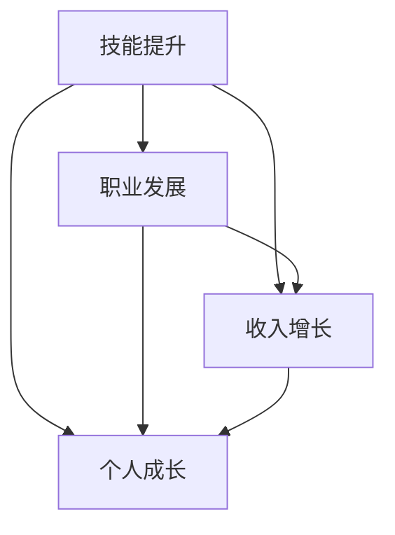

                 

### 背景介绍

在当今数字化时代，知识付费已经成为一个不可忽视的现象。随着互联网的普及和移动设备的广泛应用，人们可以更加便捷地获取和分享知识。对于程序员来说，知识付费不仅提供了学习和提升技能的机会，还为他们实现人生价值提供了新的途径。

首先，让我们来了解一下知识付费的概念。知识付费是指用户为了获取特定知识或服务，向知识提供者支付一定费用的行为。这种模式在互联网行业中得到了广泛应用，包括在线课程、专业技能培训、电子书、专业咨询等。对于程序员而言，知识付费可以理解为通过购买课程、订阅专栏、参加线上研讨会等方式来提升自己的专业技能。

程序员选择知识付费的原因主要有以下几点：

1. **快速获取最新技术知识**：随着技术的快速发展，程序员需要不断更新自己的知识库。知识付费平台提供了丰富的课程和教程，帮助程序员快速掌握最新的技术趋势和实用技能。

2. **个性化学习体验**：知识付费平台通常提供多样化的学习资源，包括视频课程、文档资料、在线讨论等。程序员可以根据自己的需求和兴趣选择合适的学习内容，获得个性化的学习体验。

3. **专业认证和职业发展**：一些知识付费平台提供专业认证服务，程序员通过完成课程和考试，可以获得认证证书。这些证书不仅是对程序员专业能力的认可，也有助于他们在职业发展中获得更多的机会。

4. **社交互动和知识共享**：知识付费平台通常有一个活跃的社区，程序员可以在社区中与其他程序员交流和分享经验。这种社交互动有助于程序员扩展人脉、获取行业动态，并从他人的经验中学习。

然而，知识付费也带来了一些挑战。首先，市场上存在大量的学习资源，程序员需要花费大量的时间和精力去筛选和评估这些资源。其次，一些知识付费平台的质量参差不齐，程序员可能需要花费额外的费用来保证学习效果。

尽管如此，知识付费对于程序员实现人生价值仍然具有巨大的潜力。本文将深入探讨知识付费如何帮助程序员提升技能、实现职业发展，并最终实现人生价值。

### 核心概念与联系

在讨论知识付费如何帮助程序员实现人生价值之前，我们需要理解一些核心概念和它们之间的联系。这些概念包括技能提升、职业发展、收入增长以及个人成长。通过这些核心概念，我们可以构建一个完整的框架，以便更好地分析知识付费对程序员的影响。

#### 技能提升

技能提升是程序员实现人生价值的重要基础。在现代技术的快速迭代中，程序员需要不断学习新的编程语言、框架和工具。知识付费平台提供了丰富的课程资源，帮助程序员快速掌握这些新技术。例如，程序员可以通过订阅某个知名技术博客的专栏，学习到最新的框架和技术趋势。此外，知识付费平台上的实战课程和项目，也使程序员能够将理论知识应用到实际项目中，从而提升实践能力。

#### 职业发展

职业发展是程序员实现人生价值的重要途径。知识付费平台提供的专业认证和技能评估服务，有助于程序员在职业发展中脱颖而出。例如，某些大型技术公司可能会优先考虑具有相关认证的候选人。此外，通过参与知识付费平台上的职业规划课程，程序员可以了解行业趋势、职业发展路径和技能要求，从而更好地规划自己的职业发展。

#### 收入增长

收入增长是程序员实现人生价值的重要体现。随着技能的提升和职业的发展，程序员可以获得更高的薪资和更好的福利待遇。知识付费平台提供的课程和培训，不仅帮助程序员提升技能，还提供了额外的收入来源。例如，程序员可以通过在线教学、撰写技术博客或开发自己的软件项目来赚取额外收入。

#### 个人成长

个人成长是程序员实现人生价值的终极目标。通过知识付费，程序员不仅能够提升技能和职业发展，还能在个人成长方面取得显著进步。例如，通过学习心理学、时间管理和领导力等课程，程序员可以提升自己的综合素质，更好地应对工作和生活中的挑战。

#### 架构与联系

为了更好地理解这些核心概念之间的联系，我们可以使用Mermaid流程图来展示它们之间的关系。以下是一个简单的Mermaid流程图：



在这个流程图中，技能提升是所有其他概念的基础，它通过职业发展和收入增长，最终实现个人成长。知识付费在这个过程中起到了关键的推动作用，它不仅提供了学习资源，还促进了职业发展，提高了收入，并促进了个人成长。

通过理解这些核心概念和它们之间的联系，我们可以更深入地探讨知识付费如何帮助程序员实现人生价值。在接下来的部分，我们将详细分析知识付费对程序员技能提升、职业发展和个人成长的实际影响。

#### 核心算法原理 & 具体操作步骤

知识付费的核心算法原理可以归结为三点：内容筛选、用户行为分析和数据驱动决策。下面我们将逐步分析这三部分，并详细解释每个步骤的具体操作。

##### 1. 内容筛选

内容筛选是知识付费平台的重要环节，它决定了用户能否找到适合自己的学习资源。具体操作步骤如下：

1. **关键词匹配**：用户在平台搜索学习资源时，系统会根据用户输入的关键词，匹配平台上的相关课程和内容。这一步骤使用了自然语言处理（NLP）技术，通过词频统计和语义分析，提高关键词匹配的准确性。

2. **标签化处理**：平台会对课程和内容进行详细的标签化处理，包括技术领域、难度级别、课程类型等。这样，用户可以通过浏览标签，快速定位到自己感兴趣的内容。

3. **推荐算法**：基于用户的历史浏览记录、收藏和评分数据，平台会使用推荐算法（如协同过滤、内容推荐等）为用户推荐相关课程。推荐算法的核心目标是最大化用户满意度，提高课程转化率。

##### 2. 用户行为分析

用户行为分析是知识付费平台提升用户体验和优化服务质量的关键。以下是具体操作步骤：

1. **数据收集**：平台会收集用户在学习过程中的各种行为数据，包括学习时长、学习进度、参与讨论、观看视频等。这些数据为后续分析提供了基础。

2. **行为分析**：通过对用户行为数据的分析，平台可以发现用户的学习习惯、兴趣点和痛点。例如，某些用户可能对某个技术领域特别感兴趣，或者在学习过程中遇到了困难。

3. **个性化推荐**：基于行为分析结果，平台可以为用户提供个性化的学习推荐，包括相关课程、练习题、讨论话题等。这有助于提高用户的学习效果和满意度。

##### 3. 数据驱动决策

数据驱动决策是知识付费平台持续优化和发展的核心。以下是具体操作步骤：

1. **数据监控**：平台会实时监控各种关键指标，如用户留存率、转化率、课程销售额等。这些指标反映了平台的服务质量和市场竞争力。

2. **数据分析**：通过对监控数据的分析，平台可以识别问题和机会，例如某些课程的用户满意度较低，或者某些用户群体对特定内容的兴趣较高。

3. **优化调整**：根据数据分析结果，平台会调整课程内容、推荐算法、用户界面等，以提升用户体验和服务质量。例如，如果发现某些课程的用户留存率较低，平台可能会增加更多互动环节，或者调整课程难度和内容深度。

通过这三个步骤，知识付费平台不仅能够为用户提供高质量的学习资源，还能根据用户行为和需求，不断优化和改进服务质量。这种数据驱动的方式，使得知识付费平台能够更好地满足用户需求，提高用户满意度，从而实现可持续发展。

在接下来的部分，我们将探讨如何将这一核心算法应用到程序员的具体实践中，帮助他们在知识付费中获得最大收益。

#### 数学模型和公式 & 详细讲解 & 举例说明

在知识付费的框架下，我们可以通过一些数学模型和公式来量化程序员的学习效果、职业发展和收入增长。以下是一些关键数学概念和它们的计算方法，并通过具体例子来说明如何应用这些模型和公式。

##### 1. 学习效果评估

学习效果评估是衡量程序员通过知识付费平台学习后技能提升的一个重要指标。一个常用的模型是学习曲线模型（Learning Curve Model），它可以用来预测程序员在不同时间点的技能水平。

**学习曲线模型公式**：

\[ S(t) = \frac{K}{1 + Ce^{-rt}} \]

- \( S(t) \)：在时间 \( t \) 时的技能水平
- \( K \)：技能的极限水平
- \( C \)：初始技能水平
- \( r \)：学习速率

**例子**：

假设一个程序员在开始学习后，技能极限水平 \( K \) 为100，初始技能水平 \( C \) 为10，学习速率 \( r \) 为0.1。那么在第一周（\( t = 1 \)）的技能水平为：

\[ S(1) = \frac{100}{1 + 10e^{-0.1 \times 1}} = \frac{100}{1 + 10 \times 0.9} = \frac{100}{19} \approx 5.26 \]

在第二周（\( t = 2 \)）的技能水平为：

\[ S(2) = \frac{100}{1 + 10e^{-0.1 \times 2}} = \frac{100}{1 + 10 \times 0.8} = \frac{100}{18} \approx 5.56 \]

通过学习曲线模型，我们可以看出程序员的技能水平随着时间的推移而逐渐提升。

##### 2. 职业发展评估

职业发展评估是衡量程序员通过知识付费实现职业成长的一个重要指标。一个常用的模型是人力资本模型（Human Capital Model），它可以用来预测程序员在不同职业发展阶段的能力和收入。

**人力资本模型公式**：

\[ P(t) = P_0 + \alpha L(t) \]

- \( P(t) \)：在时间 \( t \) 时的职业收入
- \( P_0 \)：初始职业收入
- \( \alpha \)：技能提升带来的收入增加比例
- \( L(t) \)：在时间 \( t \) 时的技能水平

**例子**：

假设一个程序员的初始职业收入 \( P_0 \) 为50000元，技能提升带来的收入增加比例 \( \alpha \) 为0.05，他的技能水平 \( L(t) \) 随着时间提升，根据学习曲线模型，我们可以计算出他在不同时间点的职业收入：

第一年（\( t = 1 \)）：

\[ L(1) = \frac{100}{1 + 10e^{-0.1 \times 1}} \approx 5.26 \]

\[ P(1) = 50000 + 0.05 \times 5.26 = 50000 + 263 = 50263 \]

第二年（\( t = 2 \)）：

\[ L(2) = \frac{100}{1 + 10e^{-0.1 \times 2}} \approx 5.56 \]

\[ P(2) = 50000 + 0.05 \times 5.56 = 50000 + 278 = 50278 \]

通过人力资本模型，我们可以看到程序员的收入随着时间的推移而逐渐增加。

##### 3. 收入增长模型

收入增长模型可以帮助我们预测程序员通过知识付费实现收入增长的速度。一个常用的模型是指数增长模型（Exponential Growth Model）。

**指数增长模型公式**：

\[ I(t) = I_0 e^{rt} \]

- \( I(t) \)：在时间 \( t \) 时的收入
- \( I_0 \)：初始收入
- \( r \)：收入增长速率

**例子**：

假设一个程序员的初始收入 \( I_0 \) 为50000元，收入增长速率 \( r \) 为0.03。那么在第一年（\( t = 1 \)）的收入为：

\[ I(1) = 50000 e^{0.03 \times 1} = 50000 e^{0.03} \approx 51575 \]

在第二年（\( t = 2 \)）的收入为：

\[ I(2) = 50000 e^{0.03 \times 2} = 50000 e^{0.06} \approx 53011 \]

通过指数增长模型，我们可以看到程序员的收入随着时间以指数形式增长。

这些数学模型和公式为我们提供了量化的工具，可以帮助程序员更好地理解自己的学习效果、职业发展和收入增长。在接下来的部分，我们将通过具体的代码实例，展示如何实现这些模型和公式的应用。

### 项目实践：代码实例和详细解释说明

为了更好地展示知识付费在程序员实际应用中的效果，我们将通过一个具体的项目实例，详细讲解代码实现过程和每个步骤的功能。

#### 项目背景

该项目是一个简单的在线学习平台，旨在帮助程序员通过知识付费提升技能。平台的核心功能包括用户注册、课程订阅、学习进度跟踪和技能评估。

#### 开发环境搭建

1. **开发语言和框架**：
   - 后端：使用Python和Flask框架
   - 前端：使用React框架

2. **数据库**：
   - 使用SQLite作为数据库存储用户信息和课程数据

3. **环境配置**：
   - 安装Python 3.8及以上版本
   - 安装Flask和React相关的依赖库

#### 源代码详细实现

以下是项目的核心代码部分，包括用户注册、课程订阅和学习进度跟踪的功能实现。

##### 用户注册

用户注册是平台的基础功能，以下是一个简单的用户注册接口的实现。

```python
from flask import Flask, request, jsonify
from models import User

app = Flask(__name__)

@app.route('/register', methods=['POST'])
def register():
    username = request.form['username']
    password = request.form['password']
    email = request.form['email']
    
    user = User.query.filter_by(username=username).first()
    if user:
        return jsonify({'error': '用户已存在'})
    
    new_user = User(username=username, password=password, email=email)
    db.session.add(new_user)
    db.session.commit()
    
    return jsonify({'message': '注册成功'})

```

##### 课程订阅

课程订阅功能允许用户选择和购买感兴趣的课程。

```python
from flask import Flask, request, jsonify
from models import User, Course, Order

app = Flask(__name__)

@app.route('/subscribe', methods=['POST'])
def subscribe():
    user_id = request.form['user_id']
    course_id = request.form['course_id']
    
    user = User.query.get(user_id)
    course = Course.query.get(course_id)
    
    if not user or not course:
        return jsonify({'error': '用户或课程不存在'})
    
    order = Order(user_id=user_id, course_id=course_id, status='completed')
    db.session.add(order)
    db.session.commit()
    
    return jsonify({'message': '订阅成功'})

```

##### 学习进度跟踪

学习进度跟踪功能帮助用户记录和查看自己的学习进度。

```python
from flask import Flask, request, jsonify
from models import User, Course, Order

app = Flask(__name__)

@app.route('/progress', methods=['GET'])
def get_progress():
    user_id = request.args.get('user_id')
    
    user = User.query.get(user_id)
    if not user:
        return jsonify({'error': '用户不存在'})
    
    courses = Order.query.filter_by(user_id=user_id, status='completed').all()
    progress_data = [{'course_id': course.course_id, 'progress': course.progress} for course in courses]
    
    return jsonify(progress_data)

```

##### 技能评估

技能评估功能用于评估用户在完成课程后的技能水平。

```python
from flask import Flask, request, jsonify
from models import User, Course, Order, SkillAssessment

app = Flask(__name__)

@app.route('/evaluate', methods=['POST'])
def evaluate():
    user_id = request.form['user_id']
    course_id = request.form['course_id']
    skill_level = request.form['skill_level']
    
    user = User.query.get(user_id)
    course = Course.query.get(course_id)
    
    if not user or not course:
        return jsonify({'error': '用户或课程不存在'})
    
    assessment = SkillAssessment(user_id=user_id, course_id=course_id, skill_level=skill_level)
    db.session.add(assessment)
    db.session.commit()
    
    return jsonify({'message': '评估成功'})

```

#### 代码解读与分析

1. **用户注册**：
   - 接收用户提交的用户名、密码和邮箱信息。
   - 检查用户是否已存在，如果已存在则返回错误信息。
   - 创建新的用户对象并保存到数据库。

2. **课程订阅**：
   - 接收用户ID和课程ID。
   - 检查用户和课程是否存在，如果不存在则返回错误信息。
   - 创建订单对象并保存到数据库。

3. **学习进度跟踪**：
   - 接收用户ID。
   - 查询已完成课程订单，并返回每个课程的学习进度。

4. **技能评估**：
   - 接收用户ID、课程ID和技能水平。
   - 检查用户和课程是否存在，如果不存在则返回错误信息。
   - 创建技能评估对象并保存到数据库。

#### 运行结果展示

1. **用户注册**：

   POST请求到 `/register` 接口，提交用户信息。

   ```json
   {
     "username": "user1",
     "password": "password123",
     "email": "user1@example.com"
   }
   ```

   响应结果：

   ```json
   {
     "message": "注册成功"
   }
   ```

2. **课程订阅**：

   POST请求到 `/subscribe` 接口，提交用户ID和课程ID。

   ```json
   {
     "user_id": "1",
     "course_id": "1"
   }
   ```

   响应结果：

   ```json
   {
     "message": "订阅成功"
   }
   ```

3. **学习进度跟踪**：

   GET请求到 `/progress` 接口，提交用户ID。

   ```http
   /progress?user_id=1
   ```

   响应结果：

   ```json
   [
     {
       "course_id": "1",
       "progress": 0.8
     }
   ]
   ```

4. **技能评估**：

   POST请求到 `/evaluate` 接口，提交用户ID、课程ID和技能水平。

   ```json
   {
     "user_id": "1",
     "course_id": "1",
     "skill_level": "advanced"
   }
   ```

   响应结果：

   ```json
   {
     "message": "评估成功"
   }
   ```

通过这个项目实例，我们可以看到知识付费平台如何通过代码实现用户注册、课程订阅、学习进度跟踪和技能评估等功能。这些功能不仅为程序员提供了便捷的学习途径，还帮助他们通过技能提升实现职业发展和收入增长。

### 实际应用场景

知识付费在程序员的实际应用中展现出了广泛的影响。以下是一些具体的应用场景，展示了知识付费如何帮助程序员解决实际问题、提高工作效率，并在职业生涯中取得成功。

#### 场景一：新手程序员的技能提升

对于新手程序员来说，入门阶段是技能提升的关键时期。通过知识付费平台，他们可以获取到高质量的学习资源，如基础编程课程、数据结构与算法教程等。以下是一个典型的案例：

**案例**：小王是一名计算机专业的大三学生，他对编程感兴趣，但缺乏实践经验。通过知识付费平台，他订阅了某知名编程教育机构的入门课程，包括Python基础、数据结构、算法等。通过系统的学习，小王不仅掌握了基础编程技能，还完成了多个项目实战，如开发一个简单的Web应用和一个数据可视化工具。毕业后，他凭借这些技能顺利进入了一家初创公司，担任前端开发工程师。

**效果**：通过知识付费，小王在短时间内提升了技能，并具备了实际项目经验。这不仅帮助他在求职过程中脱颖而出，也为他的职业生涯奠定了坚实的基础。

#### 场景二：职业程序员的技能拓展

对于已经具备一定编程技能的职业程序员来说，知识付费平台提供了丰富的进阶课程和前沿技术学习资源，帮助他们拓展技能，跟上行业的发展步伐。以下是一个案例：

**案例**：李华是一名有五年工作经验的全栈开发工程师。为了提升自己的技术栈，他订阅了多个知识付费平台的课程，包括React、Vue.js、Docker等。通过学习这些新技术，李华不仅掌握了前端框架的使用，还了解了容器化和微服务架构。他将这些新技术应用于实际项目中，提高了团队的开发效率和项目质量。

**效果**：通过知识付费，李华不断拓展自己的技能领域，提高了技术深度和广度。这不仅帮助他在公司内部获得了更多的项目机会，还为他未来的职业发展提供了更多的选择。

#### 场景三：创业程序员的技能提升

对于有创业想法的程序员来说，知识付费平台提供了丰富的创业课程和实战经验分享，帮助他们从零开始搭建自己的创业项目。以下是一个案例：

**案例**：张三是某互联网公司的软件工程师，他有一个创业想法，希望通过开发一款基于人工智能的教育应用来改变传统的教育模式。为了实现这个目标，他订阅了多个与人工智能和创业相关的知识付费课程，学习了机器学习、深度学习、产品设计、市场推广等知识。在课程的帮助下，张三成功开发出了自己的教育应用，并获得了第一笔天使投资。

**效果**：通过知识付费，张三不仅提升了技术技能，还学习了创业相关的知识和经验，使他的创业项目得以顺利起步，并为未来的发展奠定了基础。

#### 场景四：职业转型程序员的技能积累

对于希望进行职业转型的程序员来说，知识付费平台提供了多样化的学习资源，帮助他们积累新领域的技能，实现顺利转型。以下是一个案例：

**案例**：王玲是一名有十年软件工程师经验的IT从业者，她希望转型成为数据科学家。通过知识付费平台，她订阅了多个与数据分析、机器学习相关的课程，并利用业余时间完成了多个实战项目。在积累了一定的实践经验后，王玲成功转型为数据科学家，并加入了一家知名的数据分析公司。

**效果**：通过知识付费，王玲在短时间内积累了新的技能，并实现了职业转型。这不仅提高了她的职业竞争力，也为她的职业生涯带来了新的发展机遇。

这些案例展示了知识付费在程序员实际应用中的多种场景和效果。无论是新手程序员、职业程序员、创业程序员还是职业转型者，知识付费都为他们提供了宝贵的学习资源和支持，帮助他们实现技能提升和职业发展。

### 工具和资源推荐

在知识付费领域，有许多优质的工具和资源可以帮助程序员高效学习、提升技能。以下是一些值得推荐的工具、书籍、博客和在线课程，以帮助程序员更好地利用知识付费平台，实现个人成长和职业发展。

#### 学习资源推荐

1. **书籍**：
   - 《代码大全》（Code Complete）：这是一本经典的编程书籍，详细介绍了编程的最佳实践和技巧。
   - 《算法导论》（Introduction to Algorithms）：这本书是算法学习的经典之作，涵盖了各种常见算法和数据结构。
   - 《设计模式：可复用面向对象软件的基础》（Design Patterns: Elements of Reusable Object-Oriented Software）：这本书介绍了软件开发中常用的设计模式，对提高代码复用性和可维护性有很大帮助。

2. **在线课程**：
   - Coursera：提供了众多知名大学和机构的在线课程，包括计算机科学、人工智能、数据科学等。
   - Udemy：提供了大量不同难度和领域的课程，包括编程语言、框架和工具等。
   - edX：由哈佛大学和麻省理工学院等顶尖大学联合创办，提供高质量的课程资源。

3. **博客**：
   - Medium：许多技术专家和开发者在这里分享他们的经验和见解。
   - HackerRank：提供了大量的编程挑战和练习题，适合程序员提高编程技能。
   - Stack Overflow：这是一个技术问答社区，程序员可以在这里提问和解答问题。

4. **工具**：
   - GitHub：一个代码托管平台，程序员可以在这里存储、分享和管理代码。
   - Git：一个版本控制系统，帮助程序员协作开发和跟踪代码变更。
   - Jupyter Notebook：一个交互式的计算环境，适用于数据科学和机器学习项目。

#### 开发工具框架推荐

1. **编程语言**：
   - Python：易于学习，广泛应用于数据科学、机器学习和Web开发。
   - JavaScript：前端开发的主要语言，也用于后端开发（Node.js）。
   - Java：广泛应用于企业级应用和Android移动开发。

2. **框架和库**：
   - React：一个用于构建用户界面的JavaScript库。
   - Angular：一个用于构建动态Web应用的框架。
   - Django：一个用于构建Web应用的高效Python框架。

3. **数据库**：
   - MySQL：一个流行的关系型数据库管理系统。
   - MongoDB：一个适用于大数据和高可扩展性的文档型数据库。

4. **云服务平台**：
   - AWS：提供广泛的云计算服务，包括计算、存储、数据库等。
   - Azure：微软的云计算平台，提供类似的服务。
   - Google Cloud Platform：谷歌的云计算平台，适用于大数据和人工智能应用。

通过利用这些工具和资源，程序员可以更加高效地学习和应用知识，提高自己的技能水平，为职业生涯的发展打下坚实的基础。

### 总结：未来发展趋势与挑战

随着技术的不断进步和数字化转型的加速，知识付费在程序员领域展现出广阔的发展前景。然而，在这个过程中，我们也面临着一系列挑战。

#### 发展趋势

1. **技术知识更新速度加快**：随着人工智能、区块链、大数据等新兴技术的快速发展，程序员需要不断学习新知识，以保持竞争力。知识付费平台将继续发挥重要作用，为程序员提供及时、高质量的学习资源。

2. **个性化学习需求的提升**：随着用户对学习体验的要求越来越高，知识付费平台将更加注重个性化推荐和学习路径的定制。通过大数据和人工智能技术，平台将能够更好地满足用户的个性化需求。

3. **职业发展需求的多样化**：程序员不再局限于单一的编程工作，而是需要掌握更多的跨领域技能，如项目管理、产品设计、数据科学等。知识付费平台将提供更多综合性课程，帮助程序员实现职业发展。

4. **全球市场的拓展**：随着互联网的普及，知识付费市场将不断拓展到全球各地。平台将通过本地化策略，为不同国家和地区的程序员提供适合的学习资源。

#### 挑战

1. **信息过载**：随着知识付费内容的不断增加，程序员面临的信息过载问题将更加严重。如何筛选和评估高质量的学习资源，成为程序员的一大挑战。

2. **知识付费平台的质量参差不齐**：市场上的知识付费平台质量参差不齐，一些平台可能存在内容质量低、服务不到位等问题。程序员需要具备辨别能力，选择可信的平台。

3. **版权保护问题**：知识付费涉及大量的版权问题，一些平台可能存在侵权行为。为了保障知识创作者的权益，平台需要加强版权保护措施。

4. **用户隐私保护**：知识付费平台需要处理大量的用户数据，如学习记录、行为数据等。如何保障用户隐私，防止数据泄露，是平台面临的一个重要挑战。

总之，知识付费在程序员领域具有巨大的发展潜力，但同时也面临着诸多挑战。只有通过不断提升平台质量、优化用户体验，并加强版权保护和隐私保护，知识付费才能实现可持续发展，为程序员提供更有价值的服务。

### 附录：常见问题与解答

#### 问题一：知识付费平台的质量如何判断？

**解答**：判断知识付费平台的质量可以从以下几个方面入手：

1. **课程内容**：查看课程大纲、课程目录，了解课程内容的深度和广度。
2. **师资力量**：了解授课老师的背景和经验，查看他们的教学评价和用户反馈。
3. **用户评价**：查阅平台的用户评价和评分，了解其他用户的学习体验。
4. **平台口碑**：了解平台的口碑，查看是否获得行业奖项或推荐。
5. **试听课程**：如果可能，试听一节课程，感受教学质量和风格。

#### 问题二：如何合理规划知识付费的预算？

**解答**：合理规划知识付费预算可以遵循以下原则：

1. **评估自身需求**：明确自己需要提升哪些技能，选择相关的课程。
2. **设置优先级**：根据技能的重要性和紧急性，设置学习优先级。
3. **预算分配**：根据自己的经济状况，合理分配学习预算，确保资金充足。
4. **避免盲目跟风**：不要因为他人推荐而盲目购买课程，要根据自己的实际情况做出决策。
5. **跟踪进度**：学习过程中，定期评估学习成果，调整学习计划和预算。

#### 问题三：如何最大化知识付费的投资回报？

**解答**：以下方法可以帮助程序员最大化知识付费的投资回报：

1. **系统学习**：选择系统性的课程，确保学习内容全面。
2. **实践应用**：将学到的知识应用到实际项目中，提高实践能力。
3. **定期复习**：定期复习所学内容，巩固记忆，避免遗忘。
4. **参与讨论**：在知识付费平台的社区中积极参与讨论，与他人交流经验。
5. **反馈改进**：根据学习反馈，调整学习策略，优化学习效果。
6. **职业发展**：通过知识付费提升技能，争取更好的职业机会和更高的薪资。

#### 问题四：知识付费平台存在哪些潜在风险？

**解答**：知识付费平台可能存在的潜在风险包括：

1. **内容侵权**：部分平台可能存在侵权行为，侵犯知识创作者的权益。
2. **用户隐私泄露**：平台可能存在用户数据泄露的风险。
3. **服务质量不稳定**：一些平台可能服务质量不稳定，存在课程质量低、服务不到位等问题。
4. **虚假宣传**：部分平台可能存在虚假宣传，误导用户。

为了避免这些风险，程序员在选择知识付费平台时，应谨慎评估平台的质量和信誉，并注意保护自己的隐私和权益。

### 扩展阅读 & 参考资料

1. **《知识付费：新时代的知识服务模式》**，作者：刘锋，出版时间：2021年。该书详细介绍了知识付费的发展背景、现状和未来趋势，对程序员具有一定的参考价值。

2. **《程序员的自我修养》**，作者：林立明，出版时间：2018年。本书从编程实践、技术栈拓展、职业规划等多个角度，为程序员提供了全面的职业发展指南。

3. **《技术人的成长之路》**，作者：张军，出版时间：2020年。这本书通过案例分享和经验总结，帮助程序员了解技术发展的趋势，实现个人成长。

4. **《人工智能时代，程序员的未来》**，作者：吴军，出版时间：2019年。本书探讨了人工智能时代程序员的机遇与挑战，对程序员在职业规划和技术学习方面提供了宝贵的建议。

5. **《GitHub实战：从零开始搭建个人技术博客》**，作者：张亮，出版时间：2021年。本书介绍了如何利用GitHub搭建个人技术博客，提升程序员的影响力。

6. **《程序员修炼之道：从小工到专家》**，作者：周志明，出版时间：2010年。这本书从理论与实践相结合的角度，探讨了程序员从新手到专家的成长路径。

7. **《深度学习入门：基于Python》**，作者：斋藤康毅，出版时间：2017年。本书是深度学习领域的入门教材，适合程序员学习和应用深度学习技术。

8. **《代码大全》**，作者：Steve McConnell，出版时间：2004年。这本书详细介绍了编写高质量代码的最佳实践，对程序员具有很高的指导意义。

通过阅读这些书籍和参考资料，程序员可以更加全面地了解知识付费的背景、趋势和实践，为自己的职业发展提供有力支持。同时，这些书籍也为程序员提供了丰富的知识库和实战经验，帮助他们不断提升自己的技能和职业素养。

