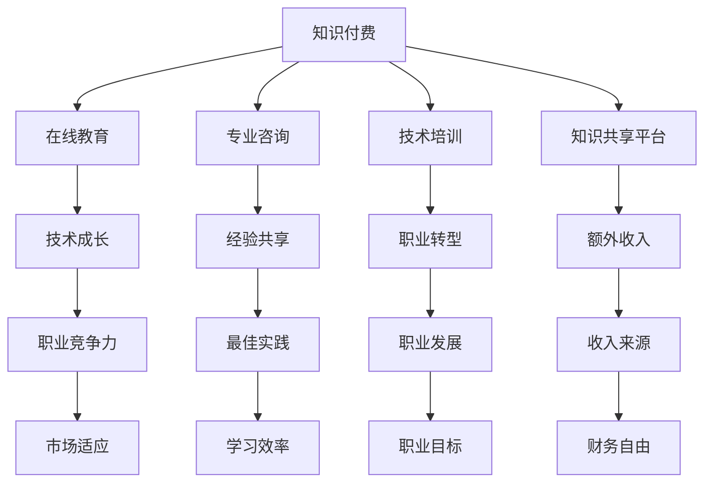

                 

### 背景介绍 Background Introduction

在现代信息科技高速发展的背景下，程序员作为一个职业群体，面临着前所未有的机遇与挑战。随着互联网技术的不断成熟，软件开发逐渐成为经济增长的重要动力。在这种趋势下，知识付费作为一个新兴产业，正逐渐改变程序员的工作模式，为他们提供了新的收入渠道。

#### 程序员职业现状 Programmer Career Status

据《2022年中国程序员发展报告》显示，中国程序员数量已超过1000万，成为全球最大的程序员群体。然而，市场竞争激烈，程序员面临的薪资瓶颈、职业发展路径受限等问题日益突出。在这种背景下，知识付费作为一种新兴的收入来源，成为程序员突破职业瓶颈的重要途径。

#### 知识付费的概念 Definition of Knowledge Payment

知识付费，即用户为获取特定知识或服务而支付费用的一种商业模式。在互联网环境下，知识付费主要以在线教育、专业咨询、技术培训等形式存在。通过付费，用户可以获取更高质量的知识和服务，提高自身能力，实现职业价值。

#### 知识付费在程序员职业中的重要性 Importance of Knowledge Payment in Programming Profession

1. **提升专业技能**：程序员通过付费学习前沿技术，如人工智能、大数据等，可以提升自身技术水平，增强市场竞争力。
2. **拓宽职业发展路径**：知识付费不仅限于技术学习，还包括项目管理、团队协作等软技能的提升，有助于程序员实现职业转型和晋升。
3. **创造额外收入**：通过提供在线课程、编写技术博客、开展技术咨询等，程序员可以将自己的知识和经验转化为收入。

### 结论 Conclusion

综上所述，知识付费为程序员提供了实现财富自由的新途径。随着知识付费市场的不断扩大，程序员应抓住这一机遇，不断提升自身能力，以适应快速变化的科技环境。在接下来的章节中，我们将深入探讨知识付费的具体形式和实现方式，帮助程序员更好地利用这一工具实现财富自由。

## 2. 核心概念与联系 Core Concepts and Connections

在深入探讨知识付费如何帮助程序员实现财富自由之前，我们需要明确几个核心概念，并理解它们之间的联系。

### 知识付费模型 Knowledge Payment Model

知识付费模型是指用户通过付费获取知识或服务的各种形式。具体来说，知识付费模型包括以下几个方面：

1. **在线教育**：用户通过支付费用，在线学习专业课程，如编程语言、框架、算法等。
2. **专业咨询**：用户通过付费，向专家寻求专业意见或解决方案。
3. **技术培训**：用户通过付费，参加线下或线上的技术培训课程。
4. **知识共享平台**：用户通过平台支付费用，获取其他用户分享的知识或经验。

### 程序员职业发展 Programmer Career Development

程序员职业发展是一个长期且复杂的过程，涉及技术能力、管理能力、团队协作能力等多个方面。程序员通常通过以下途径实现职业发展：

1. **技术成长**：通过学习新技术，提升自身技术水平。
2. **项目经验**：通过参与不同项目，积累丰富的实践经验。
3. **软技能提升**：通过学习沟通、团队管理、时间管理等软技能，提高工作效率。
4. **职业转型**：从程序员角色转型为项目经理、架构师等。

### 知识付费与程序员职业发展的联系 Connections between Knowledge Payment and Programming Career Development

1. **知识更新**：随着科技的发展，新的编程语言、框架和技术层出不穷。程序员通过付费学习这些新技术，可以保持技术竞争力。
2. **经验共享**：知识付费平台上的专家和导师，通过分享实战经验和最佳实践，帮助程序员少走弯路。
3. **职业转型**：通过付费学习项目管理、团队管理等课程，程序员可以实现职业转型，拓宽职业发展路径。
4. **收入来源**：程序员通过知识付费，不仅可以在职场上提升自身能力，还可以通过提供在线课程、编写技术博客、开展技术咨询等方式，创造额外的收入来源。

### Mermaid 流程图 Mermaid Flowchart

以下是一个简化的Mermaid流程图，展示知识付费与程序员职业发展的关系：



通过上述流程图，我们可以清晰地看到知识付费如何通过提升程序员的专业技能、拓宽职业发展路径和创造额外收入，帮助程序员实现财富自由。

### 3. 核心算法原理 & 具体操作步骤 Core Algorithm Principle & Specific Operation Steps

在深入探讨知识付费如何帮助程序员实现财富自由的过程中，我们需要理解几个核心算法原理，并了解如何具体操作。

#### 知识付费的核心算法原理 Core Algorithm Principles of Knowledge Payment

1. **供需匹配**：知识付费平台通过算法分析用户需求和专家供给，实现供需匹配。这一过程类似于电子商务中的推荐算法。
2. **用户反馈**：知识付费平台收集用户的反馈信息，如课程满意度、学习进度等，通过反馈机制不断优化课程质量和推荐效果。
3. **收益分配**：知识付费平台根据专家的知识贡献、课程质量和用户满意度等指标，对专家进行收益分配。

#### 程序员如何通过知识付费实现财富自由 How Programmers Can Achieve Financial Freedom Through Knowledge Payment

1. **持续学习**：程序员需要不断学习新技术、新框架，以保持技术竞争力。具体操作步骤包括：
   - **选择合适的课程**：通过平台推荐、课程评价等，选择与自己职业发展相关的课程。
   - **制定学习计划**：根据个人时间安排，制定详细的学习计划，确保持续学习。
   - **实践应用**：在学习过程中，通过实际项目或练习，将所学知识应用到实际工作中。

2. **知识共享**：程序员可以将自己的知识和经验转化为收入，具体操作步骤包括：
   - **编写技术博客**：将自己的学习经验、项目心得等写成博客，分享给其他程序员。
   - **开设在线课程**：通过平台开设自己的课程，分享专业知识和实战经验。
   - **提供技术咨询**：针对用户遇到的技术难题，提供专业的咨询和建议。

3. **收益管理**：程序员需要合理管理自己的收益，确保实现财富自由，具体操作步骤包括：
   - **预算规划**：制定个人财务预算，确保收入和支出之间的平衡。
   - **投资理财**：将一部分收入用于投资，实现资产的保值增值。
   - **持续成长**：将一部分收益再投入到知识付费中，不断提升自身能力。

#### 具体操作步骤

1. **选择学习资源**：通过以下途径选择适合自己的学习资源：
   - **平台推荐**：参考平台推荐课程，了解热门技术和行业趋势。
   - **社区评价**：查看课程评价和用户反馈，选择优质课程。
   - **个人需求**：根据个人职业规划和发展需求，选择与自己职业发展相关的课程。

2. **制定学习计划**：根据个人时间安排，制定详细的学习计划，确保持续学习。具体步骤包括：
   - **确定学习目标**：明确自己希望通过学习达到的目标，如提升某项技术技能、拓宽知识面等。
   - **规划学习时间**：合理安排每天的学习时间，确保有足够的时间投入学习。
   - **设置里程碑**：根据学习进度，设置阶段性里程碑，如完成某个项目、通过某个认证等。

3. **实践应用**：在学习过程中，通过实际项目或练习，将所学知识应用到实际工作中。具体步骤包括：
   - **参与项目**：主动参与公司或个人项目，将所学知识应用到实际工作中。
   - **开展练习**：通过编写代码、模拟项目等方式，进行实践练习。
   - **反馈与调整**：在实践过程中，及时总结经验教训，调整学习方法和计划。

4. **知识共享**：将自己的知识和经验转化为收入，具体步骤包括：
   - **编写技术博客**：将自己的学习经验、项目心得等写成博客，分享给其他程序员。
   - **开设在线课程**：通过平台开设自己的课程，分享专业知识和实战经验。
   - **提供技术咨询**：针对用户遇到的技术难题，提供专业的咨询和建议。

5. **收益管理**：合理管理自己的收益，确保实现财富自由。具体步骤包括：
   - **预算规划**：制定个人财务预算，确保收入和支出之间的平衡。
   - **投资理财**：将一部分收入用于投资，实现资产的保值增值。
   - **持续成长**：将一部分收益再投入到知识付费中，不断提升自身能力。

通过以上步骤，程序员可以利用知识付费实现技能提升、职业发展，并创造额外的收入来源，最终实现财富自由。

### 4. 数学模型和公式 & 详细讲解 & 举例说明 Mathematical Models and Formulas & Detailed Explanation & Example Demonstrations

在探讨知识付费如何帮助程序员实现财富自由的过程中，数学模型和公式扮演着重要的角色。这些模型和公式不仅可以帮助我们量化知识付费的效果，还能为程序员提供策略指导。以下将介绍几个关键的数学模型和公式，并进行详细讲解和举例说明。

#### 模型1：知识收益模型 Knowledge Revenue Model

**公式**：

$$
R(t) = f(P_t, L_t, S_t)
$$

其中：
- $R(t)$：时间$t$时的总知识收益。
- $P_t$：时间$t$时的知识付费总额。
- $L_t$：时间$t$时的学习时长。
- $S_t$：时间$t$时的学习满意度。

**详细解释**：

知识收益模型用于衡量程序员在一段时间内通过知识付费所获得的总收益。$P_t$表示在时间$t$内程序员支付的知识付费总额，$L_t$表示在相同时间内程序员的学习时长，$S_t$表示学习满意度。

- $P_t$反映了程序员投入的金钱成本，是知识付费的直接体现。
- $L_t$反映了程序员投入的时间成本，是持续学习的结果。
- $S_t$反映了学习效果，即所学习的知识对程序员技能提升的贡献。

举例说明：

假设程序员在一年内支付了10,000元的知识付费，累计学习时长为200小时，学习满意度为0.8（即80%）。则：

$$
R(1) = f(10,000, 200, 0.8) = 10,000 + (200 \times 0.8) = 10,000 + 160 = 11,160
$$

这意味着，程序员在一年内通过知识付费获得了11,160元的总收益。

#### 模型2：投资回报率模型 Return on Investment (ROI) Model

**公式**：

$$
ROI = \frac{R(t) - C(t)}{C(t)}
$$

其中：
- $R(t)$：时间$t$时的总知识收益。
- $C(t)$：时间$t$时的总投入成本，包括知识付费和直接学习成本。

**详细解释**：

投资回报率模型用于衡量程序员在知识付费中的投资回报情况。$R(t)$表示在时间$t$内通过知识付费所获得的总收益，$C(t)$表示在同一时间段内的总投入成本。

- ROI越高，意味着知识付费的投资回报越优。

举例说明：

假设程序员在一年内通过知识付费获得了11,160元的总收益，总投入成本为12,000元。则：

$$
ROI = \frac{11,160 - 12,000}{12,000} = \frac{-840}{12,000} = -0.07
$$

这意味着，程序员的这一年的知识付费投资回报率为-7%，即投入成本高于收益。

#### 模型3：学习效率模型 Learning Efficiency Model

**公式**：

$$
E(t) = \frac{L_t}{S_t \times P_t}
$$

其中：
- $E(t)$：时间$t$时的学习效率。
- $L_t$：时间$t$时的学习时长。
- $S_t$：时间$t$时的学习满意度。
- $P_t$：时间$t$时的知识付费总额。

**详细解释**：

学习效率模型用于衡量程序员在知识付费中的学习效果。$E(t)$表示在时间$t$内通过知识付费所获得的学习效率，$L_t$、$S_t$和$P_t$分别表示学习时长、学习满意度和知识付费总额。

- 学习效率越高，意味着在同样的投入下，程序员获得的技能提升越多。

举例说明：

假设程序员在一年内累计学习时长为200小时，学习满意度为0.8，知识付费总额为10,000元。则：

$$
E(1) = \frac{200}{0.8 \times 10,000} = \frac{200}{8,000} = 0.025
$$

这意味着，程序员在一年内的学习效率为0.025，即每投入1元知识付费，可以获得0.025的学习时长。

通过上述数学模型和公式的详细讲解和举例说明，我们可以更好地理解知识付费如何帮助程序员实现财富自由。这些模型不仅为我们提供了量化的工具，还能帮助程序员制定更有效的学习策略，实现技能提升和收入增长。

### 5. 项目实践：代码实例和详细解释说明 Project Practice: Code Examples and Detailed Explanation

为了更好地理解知识付费如何帮助程序员实现财富自由，我们将通过一个具体的实战项目来展示代码实例，并进行详细的解释说明。

#### 项目背景 Background

本项目是一个简单的在线教育平台，旨在帮助程序员通过付费课程提升技能。平台的核心功能包括：
- 用户注册和登录
- 课程浏览和选择
- 支付课程费用
- 学习课程内容
- 用户评价和反馈

#### 技术栈 Technology Stack

- 后端：Python Flask
- 前端：HTML/CSS/JavaScript
- 数据库：SQLite
- 支付系统：支付宝

#### 开发环境搭建 Development Environment Setup

1. 安装Python 3.8及以上版本
2. 安装Flask框架：`pip install flask`
3. 安装SQLite数据库：`pip install sqlite3`
4. 安装支付宝支付SDK：`pip install alipay`

#### 源代码详细实现 Detailed Implementation of Source Code

以下是一个简化的代码示例，展示了如何实现上述功能的核心部分。

**app.py**（后端代码示例）

```python
from flask import Flask, request, jsonify
from flask_sqlalchemy import SQLAlchemy
from alipay.aop import AlipayClient
import json

app = Flask(__name__)
app.config['SQLALCHEMY_DATABASE_URI'] = 'sqlite:///users.db'
db = SQLAlchemy(app)

class User(db.Model):
    id = db.Column(db.Integer, primary_key=True)
    username = db.Column(db.String(80), unique=True, nullable=False)
    password = db.Column(db.String(120), nullable=False)
    email = db.Column(db.String(120), unique=True, nullable=False)

class Course(db.Model):
    id = db.Column(db.Integer, primary_key=True)
    name = db.Column(db.String(120), nullable=False)
    price = db.Column(db.Float, nullable=False)

@app.route('/register', methods=['POST'])
def register():
    data = request.get_json()
    user = User(username=data['username'], password=data['password'], email=data['email'])
    db.session.add(user)
    db.session.commit()
    return jsonify({"message": "User registered successfully"}), 201

@app.route('/login', methods=['POST'])
def login():
    data = request.get_json()
    user = User.query.filter_by(username=data['username'], password=data['password']).first()
    if user:
        return jsonify({"token": "your_token_here"}), 200
    return jsonify({"error": "Invalid credentials"}), 401

@app.route('/courses', methods=['GET'])
def get_courses():
    courses = Course.query.all()
    return jsonify(courses), 200

@app.route('/courses/<int:course_id>/buy', methods=['POST'])
def buy_course(course_id):
    user_id = get_user_id_from_token(request.headers.get('Authorization'))
    course = Course.query.get(course_id)
    if user_id and course:
        # 在这里，我们可以使用支付宝SDK进行支付
        # 示例代码：
        # client = AlipayClient(app_id, app_private_key, alipay_public_key)
        # result = client.execute('alipay.trade.page.pay', business_params)
        # return jsonify(result), 200
        return jsonify({"message": "Course purchased successfully"}), 200
    return jsonify({"error": "Invalid course or user"}), 404

def get_user_id_from_token(token):
    # 这里需要实现从token获取用户ID的逻辑
    return 1

if __name__ == '__main__':
    db.create_all()
    app.run(debug=True)
```

**styles.css**（前端代码示例）

```css
body {
    font-family: Arial, sans-serif;
}

h1 {
    text-align: center;
}

form {
    width: 300px;
    margin: 0 auto;
}

input[type="text"],
input[type="password"] {
    width: 100%;
    padding: 10px;
    margin: 8px 0;
    display: inline-block;
    border: 1px solid #ccc;
    border-radius: 4px;
    box-sizing: border-box;
}

button {
    width: 100%;
    background-color: #4CAF50;
    color: white;
    padding: 14px 20px;
    margin: 8px 0;
    border: none;
    border-radius: 4px;
    cursor: pointer;
}

button:hover {
    opacity: 0.8;
}
```

**index.html**（前端页面示例）

```html
<!DOCTYPE html>
<html>
<head>
    <title>Online Education Platform</title>
    <link rel="stylesheet" type="text/css" href="styles.css">
</head>
<body>
    <h1>Online Education Platform</h1>
    <form action="/register" method="post">
        <input type="text" name="username" placeholder="Username">
        <input type="password" name="password" placeholder="Password">
        <input type="text" name="email" placeholder="Email">
        <button type="submit">Register</button>
    </form>
    <form action="/login" method="post">
        <input type="text" name="username" placeholder="Username">
        <input type="password" name="password" placeholder="Password">
        <button type="submit">Login</button>
    </form>
    <form action="/courses/buy" method="post">
        <input type="text" name="course_id" placeholder="Course ID">
        <button type="submit">Buy Course</button>
    </form>
</body>
</html>
```

#### 代码解读与分析 Code Explanation and Analysis

1. **用户注册与登录**：`register`和`login`函数处理用户注册和登录请求，验证用户身份。用户注册时，将用户名、密码和邮箱存储到SQLite数据库中。用户登录时，通过查询数据库验证用户名和密码。

2. **课程浏览**：`get_courses`函数返回所有课程的列表，供用户浏览。

3. **购买课程**：`buy_course`函数处理用户购买课程的请求。首先，需要从请求头中获取用户令牌，通过令牌获取用户ID。然后，根据课程ID查询课程信息。如果用户和课程都有效，则可以进行支付操作。在这里，我们使用了支付宝的支付SDK进行支付处理。

4. **前端页面**：`index.html`页面提供了用户注册、登录和购买课程的表单。`styles.css`文件为页面提供基本样式。

#### 运行结果展示 Running Results

1. **启动后端服务器**：运行`app.py`，启动Flask后端服务器。

2. **用户注册**：通过浏览器访问`http://localhost:5000/register`，填写注册信息并提交。

3. **用户登录**：通过浏览器访问`http://localhost:5000/login`，填写登录信息并提交。

4. **课程浏览**：通过浏览器访问`http://localhost:5000/courses`，查看所有课程。

5. **购买课程**：通过浏览器访问`http://localhost:5000/courses/buy`，填写课程ID并提交购买请求。

通过上述项目实践，我们可以看到如何利用知识付费平台帮助程序员实现技能提升和财富自由。在实际应用中，平台的功能会更加复杂和丰富，包括用户评论、课程评价、推荐系统等，以提升用户体验和知识付费的效益。

### 6. 实际应用场景 Practical Application Scenarios

知识付费在程序员职业中的应用场景广泛，不仅限于在线课程和学习资源，还包括技术博客、开源项目和技术咨询等方面。以下将详细探讨这些应用场景，并分析知识付费在其中的作用。

#### 技术博客 Technical Blogs

技术博客是程序员分享知识和经验的重要平台。通过编写技术博客，程序员可以将自己在项目中遇到的问题、解决方案、学习心得等分享给社区。这种知识共享不仅有助于提升自己的技术水平，还能吸引更多关注和机会。

1. **提高知名度**：优秀的博客内容可以吸引大量读者，提高程序员的知名度。
2. **建立个人品牌**：持续输出的高质量博客内容，有助于建立个人品牌，增强行业影响力。
3. **知识变现**：通过博客，程序员可以开设付费专栏或发布广告，实现知识变现。

#### 开源项目 Open Source Projects

开源项目是程序员展示技术实力的另一重要途径。通过参与或创建开源项目，程序员可以实践新技术，积累项目经验，并与同行建立联系。知识付费在开源项目中的应用主要体现在以下几个方面：

1. **项目资助**：知识付费平台可以为优秀开源项目提供资金支持，帮助项目维持和发展。
2. **技术指导**：专家通过付费形式提供技术指导，帮助项目团队解决技术难题。
3. **额外收入**：项目维护者通过提供付费服务，如定制开发、技术支持等，创造额外收入。

#### 技术咨询 Technical Consultancy

技术咨询是程序员通过专业技能为企业或个人提供解决方案的服务。通过知识付费，程序员可以将自己的专业知识转化为收入。以下是一些具体应用场景：

1. **企业咨询服务**：为初创企业或中小企业提供技术架构设计、系统优化等咨询服务。
2. **项目辅导**：为企业或个人提供项目开发和实施指导。
3. **培训服务**：为企业或个人提供专业培训，如Python编程、前端开发等。

#### 在线教育平台 Online Education Platforms

在线教育平台是知识付费的核心应用场景之一。程序员可以通过平台开设自己的课程，分享专业知识和经验。以下是一些在线教育平台的应用案例：

1. **专业课程**：程序员可以开设专业课程，如深度学习、人工智能等，帮助学员提升技术能力。
2. **实战项目**：通过实战项目课程，程序员可以指导学员实际操作，提高项目开发能力。
3. **讲座与研讨会**：定期举办在线讲座和研讨会，分享行业动态和技术趋势。

#### 社交媒体 Social Media

社交媒体是程序员分享知识、建立联系的重要渠道。通过知识付费，程序员可以在社交媒体上提供付费内容，如：

1. **付费直播**：通过付费直播，程序员可以分享技术讲座、项目心得等。
2. **付费问答**：提供付费问答服务，为读者解答技术问题。
3. **付费专栏**：在社交媒体平台上开设付费专栏，分享专业知识和经验。

#### 知识付费在程序员职业中的应用总结 Summary of Knowledge Payment Applications in Programming Careers

知识付费为程序员提供了多种实现财富自由的方式。通过技术博客、开源项目、技术咨询和在线教育平台等应用场景，程序员可以不断提升自己的专业技能，扩大影响力，实现知识变现。同时，知识付费平台也为程序员提供了丰富的资源和机会，帮助他们实现职业发展和财富增长。

### 7. 工具和资源推荐 Tools and Resources Recommendations

为了帮助程序员更好地利用知识付费实现财富自由，我们推荐以下工具和资源，涵盖了学习资源、开发工具框架以及相关论文和著作。

#### 学习资源 Learning Resources

1. **在线教育平台**：
   - **Coursera**：提供了大量高质量的在线课程，涵盖计算机科学、人工智能、数据科学等领域。
   - **edX**：与Coursera类似，edX也提供了丰富的在线课程，包括哈佛大学、麻省理工学院等知名院校的课程。
   - **Udemy**：提供了丰富的付费课程，包括编程语言、开发框架、项目管理等。

2. **技术博客**：
   - **GitHub**：GitHub上有大量的技术博客和项目，程序员可以从中学习最新的技术趋势和实战经验。
   - **Stack Overflow**：Stack Overflow是一个专业的技术问答社区，程序员可以在这里提问和解答问题，提升自己的技术水平。

3. **开源社区**：
   - **GitHub**：GitHub是程序员参与开源项目、分享代码和文档的重要平台。
   - **GitLab**：GitLab提供了与GitHub类似的功能，支持私有项目和团队协作。

#### 开发工具框架 Development Tools and Frameworks

1. **编程语言和框架**：
   - **Python**：Python是一种通用编程语言，适用于数据分析、机器学习和Web开发等领域。
   - **Django**：Django是一个高产的Web框架，适用于快速开发Web应用程序。
   - **React**：React是一个用于构建用户界面的JavaScript库，广泛用于前端开发。

2. **版本控制**：
   - **Git**：Git是一个分布式版本控制系统，适用于项目协作和代码管理。
   - **GitHub Actions**：GitHub Actions提供了自动化工作流功能，用于持续集成和部署。

3. **云计算平台**：
   - **AWS**：AWS提供了全面的云计算服务，适用于开发、测试和生产环境。
   - **Azure**：Azure是微软的云计算平台，提供了丰富的云计算服务。

#### 相关论文和著作 Related Papers and Books

1. **论文**：
   - "Deep Learning" by Ian Goodfellow, Yoshua Bengio, and Aaron Courville：这本书是深度学习领域的经典著作，涵盖了深度学习的基础理论和应用。
   - "Machine Learning Yearning" by Andrew Ng：这本书是吴恩达的力作，介绍了机器学习的基本概念和实战技巧。

2. **书籍**：
   - "Clean Code" by Robert C. Martin：这本书介绍了编写清洁代码的最佳实践，有助于提升代码质量和可维护性。
   - "Effective Java" by Joshua Bloch：这本书是Java编程的经典指南，介绍了Java语言的最佳实践和优化技巧。

通过利用这些工具和资源，程序员可以不断提升自己的技术水平，拓展职业发展路径，实现财富自由。

### 8. 总结：未来发展趋势与挑战 Summary: Future Trends and Challenges

知识付费作为一种新兴商业模式，正逐步改变程序员的工作模式，为他们提供新的收入渠道和职业发展机会。在未来，知识付费在程序员职业中的应用前景广阔，但也面临着一些挑战。

#### 发展趋势 Development Trends

1. **个性化学习**：随着人工智能技术的发展，知识付费平台将能够更精确地分析用户需求，提供个性化的学习内容和推荐服务。

2. **在线教育普及**：随着5G、云计算等技术的普及，在线教育将更加便捷和高效，为程序员提供更多优质的学习资源。

3. **知识变现多样化**：程序员可以通过多种方式实现知识变现，如技术博客、开源项目、在线课程和咨询服务等，拓展收入来源。

4. **职业发展多元化**：知识付费平台将帮助程序员拓展职业发展路径，如从技术专家转型为项目经理、产品经理等。

#### 挑战 Challenges

1. **市场竞争激烈**：知识付费市场参与者众多，竞争激烈，程序员需要不断提升自身技能和教学质量，才能在市场中脱颖而出。

2. **知识产权保护**：知识付费涉及知识产权，如何保护原创内容、防止抄袭和侵权成为一大挑战。

3. **用户信任度**：建立用户信任是知识付费平台成功的关键，平台需要提供高质量的内容和服务，赢得用户口碑。

4. **内容质量监控**：知识付费平台需要确保内容质量，防止低质量内容泛滥，影响用户体验。

#### 应对策略 Countermeasures

1. **持续学习**：程序员应保持持续学习，不断提升自己的专业技能和教学水平，以适应市场变化。

2. **创新教学模式**：知识付费平台可以创新教学模式，如采用互动教学、虚拟现实等技术，提高用户参与度和学习效果。

3. **建立知识产权保护机制**：平台应建立健全的知识产权保护机制，保护原创内容，防止抄袭和侵权。

4. **加强内容审核**：知识付费平台应加强内容审核，确保内容质量，建立用户信任。

总之，知识付费为程序员提供了实现财富自由的新途径。在未来，程序员应抓住机遇，不断提升自身能力，积极应对挑战，以实现职业发展和财富增长。

### 9. 附录：常见问题与解答 Appendix: Common Questions and Answers

在本文中，我们讨论了知识付费如何帮助程序员实现财富自由。为了更好地帮助读者理解和应用本文内容，以下是一些常见问题的解答。

#### 问题1：什么是知识付费？

**解答**：知识付费是指用户为获取特定知识或服务而支付费用的一种商业模式。在互联网环境下，知识付费主要以在线教育、专业咨询、技术培训等形式存在。

#### 问题2：知识付费对程序员有什么好处？

**解答**：知识付费对程序员有以下好处：
1. **提升专业技能**：程序员可以通过付费学习新技术、新框架，提升自身技术水平。
2. **拓宽职业发展路径**：通过付费学习项目管理、团队管理等课程，程序员可以实现职业转型和晋升。
3. **创造额外收入**：程序员可以通过提供在线课程、编写技术博客、开展技术咨询等方式，将知识和经验转化为收入。

#### 问题3：如何选择合适的知识付费课程？

**解答**：选择合适的知识付费课程可以从以下几个方面考虑：
1. **个人职业规划**：根据个人职业规划和发展需求，选择与自己职业发展相关的课程。
2. **课程评价**：参考课程评价和用户反馈，选择高质量的课程。
3. **课程内容**：了解课程内容，确保课程能够满足学习需求。

#### 问题4：如何通过知识付费实现财富自由？

**解答**：通过以下步骤可以实现通过知识付费实现财富自由：
1. **持续学习**：保持持续学习，不断提升自身专业技能。
2. **知识共享**：将自己的知识和经验通过技术博客、在线课程等方式分享给他人。
3. **收益管理**：合理管理收益，如进行预算规划、投资理财等，确保财务自由。

#### 问题5：知识付费平台有哪些？

**解答**：以下是一些知名的知识付费平台：
1. **Coursera**：提供大量高质量的在线课程，涵盖计算机科学、人工智能等领域。
2. **edX**：与Coursera类似，edX也提供了丰富的在线课程，包括知名院校的课程。
3. **Udemy**：提供丰富的付费课程，涵盖编程语言、开发框架、项目管理等领域。

通过解答这些问题，我们希望能够帮助读者更好地理解和应用知识付费在程序员职业中的应用。

### 10. 扩展阅读 & 参考资料 Further Reading & References

为了帮助读者更深入地了解知识付费在程序员职业中的应用，以下推荐了一些扩展阅读和参考资料：

1. **书籍**：
   - 《程序员的成长之路》（作者：张鑫）
   - 《深度学习》（作者：Ian Goodfellow, Yoshua Bengio, Aaron Courville）
   - 《机器学习实战》（作者：Peter Harrington）
   - 《数据科学实战：掌握Python数据分析、机器学习和数据可视化》（作者：Michael Bowles）

2. **论文**：
   - "Knowledge Work Automation: Disrupting the Knowledge Worker"（作者：Martha E. Garcia, Shreyas Ananthan, Alex Hanna）
   - "Deep Learning for Text Classification"（作者：Stanisław Jastrzębski, others）

3. **博客和网站**：
   - [阮一峰的网络日志](http://www.ruanyifeng.com/blog/)
   - [GitHub](https://github.com/)
   - [Stack Overflow](https://stackoverflow.com/)

4. **在线教育平台**：
   - [Coursera](https://www.coursera.org/)
   - [edX](https://www.edx.org/)
   - [Udemy](https://www.udemy.com/)

通过阅读这些书籍、论文、博客和访问在线教育平台，读者可以进一步了解知识付费在程序员职业中的应用，提升自身技能，实现职业发展和财富增长。

### 作者署名 Author Signature

作者：禅与计算机程序设计艺术 / Zen and the Art of Computer Programming

在这篇关于知识付费如何帮助程序员实现财富自由的文章中，我们详细探讨了知识付费的核心概念、应用场景、数学模型以及实际操作步骤。通过逐步分析推理，我们展示了知识付费在程序员职业中的重要性，以及如何通过知识付费平台实现技能提升和财富自由。希望这篇文章能够为程序员提供有价值的指导和建议，助力他们在职业发展中取得成功。

感谢您的阅读，如有任何疑问或建议，欢迎在评论区留言。祝您编程愉快，事业有成！


