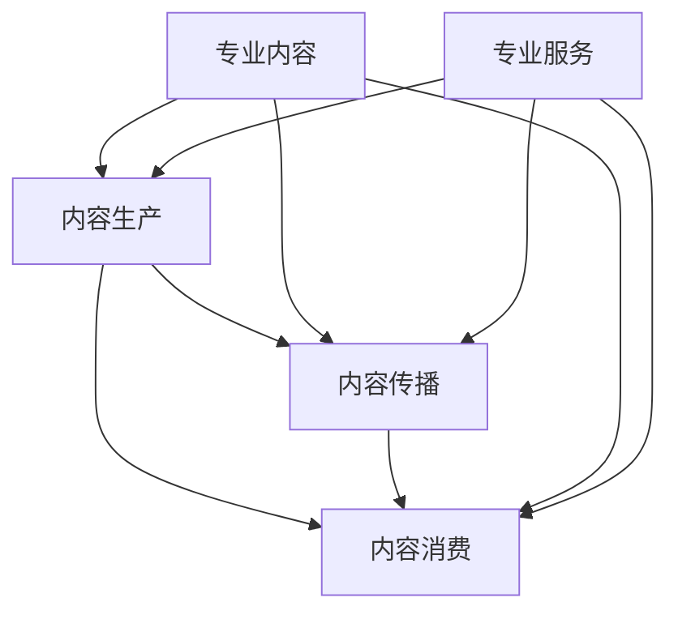

                 

### 背景介绍

知识付费作为一种新兴的商业模式，已经在当今社会中崭露头角。它通过为用户提供高质量的专业知识和服务，实现了信息的价值转化。而在这个模式中，核心要素就是专业内容与服务。本文将深入探讨知识付费赚钱的核心：专业内容与服务，以帮助读者更好地理解和利用这一模式。

知识付费的兴起并非偶然。随着互联网技术的不断发展，人们获取信息的渠道越来越多样化。然而，海量的信息也带来了选择的困扰。在这种情况下，专业的内容和服务显得尤为重要。专业内容能够为用户提供有价值的信息，帮助他们解决实际问题；专业服务则能够为用户提供个性化的解决方案，提升用户体验。

知识付费的商业模式可以分为三个主要环节：内容生产、内容传播和内容消费。首先，内容生产环节依赖于专业的内容创作者，他们通过创作高质量的专业内容来吸引用户。其次，内容传播环节依赖于各种渠道和平台，如微信公众号、知乎、得到等，这些平台为内容创作者提供了广阔的传播空间。最后，内容消费环节则是用户通过付费来获取专业内容和服务。

在这三个环节中，专业内容与服务无疑是核心。专业内容决定了知识付费的价值和质量，而专业服务则决定了用户的满意度和忠诚度。因此，本文将重点探讨如何打造专业内容和服务，以及它们在知识付费模式中的重要作用。

### 核心概念与联系

要深入理解知识付费赚钱的核心，我们需要明确几个核心概念，并分析它们之间的联系。以下将使用 Mermaid 流程图来展示这些概念及其相互关系。



#### 核心概念

1. **专业内容（D）**：指由专业人士或机构创作的具有高价值、高质量的知识和信息。它包括但不限于学术论文、技术文档、行业报告、在线课程等。

2. **内容传播（B）**：指专业内容通过各种渠道和平台传播到目标用户的过程。这包括社交媒体、知识分享平台、在线教育平台等。

3. **内容消费（C）**：指用户通过付费获取专业内容和服务的过程。用户付费的动机包括解决实际问题、提升技能、获取资讯等。

4. **专业服务（E）**：指为用户提供的个性化、定制化的服务，如咨询服务、在线辅导、一对一指导等。

#### 核心概念之间的联系

- **专业内容（D）** 是知识付费的基础。它决定了知识付费的价值和质量。高质量的专业内容能够吸引用户付费，并形成良好的口碑。

- **内容传播（B）** 是专业内容价值的实现途径。通过有效的传播，专业内容能够触达更多的目标用户，提高用户认知度和参与度。

- **内容消费（C）** 是知识付费的最终目的。用户通过付费获取专业内容和服务，实现了知识付费的价值转化。

- **专业服务（E）** 是提升用户满意度和忠诚度的关键。个性化、定制化的专业服务能够为用户提供更好的体验，增加用户粘性。

综上所述，专业内容与服务是知识付费模式中的核心要素。它们相互联系、相互作用，共同推动了知识付费的商业模式的发展。

### 核心算法原理 & 具体操作步骤

在知识付费领域，核心算法的设计与实现是确保专业内容和服务质量的关键。以下将介绍核心算法的原理，并详细描述其操作步骤。

#### 1. 算法原理

知识付费的核心算法主要包括内容推荐算法和服务匹配算法。内容推荐算法旨在为用户推荐符合其需求和兴趣的专业内容。而服务匹配算法则旨在为用户提供与其实际需求相匹配的专业服务。

##### 内容推荐算法

内容推荐算法的基本原理是基于用户的历史行为数据和内容属性进行相关性分析，从而生成个性化的推荐列表。以下是具体的算法步骤：

1. **用户行为数据收集**：包括用户的浏览记录、购买记录、评价记录等。

2. **内容属性提取**：包括内容的关键词、主题、作者、发布时间等。

3. **构建用户行为模型**：通过机器学习算法（如协同过滤、基于内容的推荐等）构建用户的行为特征模型。

4. **构建内容特征模型**：对内容进行特征提取，形成内容特征矩阵。

5. **计算用户与内容的相似度**：利用相似度计算方法（如余弦相似度、欧几里得距离等）计算用户与内容的相似度。

6. **生成推荐列表**：根据相似度分数，为用户生成个性化的内容推荐列表。

##### 服务匹配算法

服务匹配算法的基本原理是利用用户的需求描述和服务提供者的能力描述进行匹配。以下是具体的算法步骤：

1. **用户需求分析**：通过用户输入或历史行为数据，提取用户的需求特征。

2. **服务提供者能力分析**：对服务提供者的专业能力、服务质量、评价等进行分析。

3. **构建需求与服务模型**：将用户需求与服务提供者能力进行建模，形成需求与服务特征矩阵。

4. **计算需求与服务的匹配度**：利用匹配度计算方法（如Jaccard相似度、编辑距离等）计算用户需求与服务提供者能力的匹配度。

5. **生成服务匹配列表**：根据匹配度分数，为用户生成匹配的服务列表。

#### 2. 具体操作步骤

以下是一个简化的知识付费核心算法的具体操作步骤：

1. **数据收集**：
    - 从用户行为日志中收集用户的浏览、购买、评价等数据。
    - 从内容数据库中提取内容属性数据。

2. **数据预处理**：
    - 对用户行为数据进行清洗、去噪、归一化等处理。
    - 对内容属性数据进行分类、编码等处理。

3. **构建模型**：
    - 使用机器学习算法构建用户行为模型。
    - 使用自然语言处理技术构建内容特征模型。

4. **计算相似度**：
    - 计算用户与内容的相似度。
    - 计算用户需求与服务提供者的匹配度。

5. **生成推荐列表**：
    - 根据相似度分数生成内容推荐列表。
    - 根据匹配度分数生成服务匹配列表。

6. **用户反馈**：
    - 收集用户对推荐内容和服务匹配的反馈。
    - 利用反馈数据进行模型优化。

通过以上步骤，知识付费平台能够为用户提供高质量的专业内容推荐和个性化服务匹配，从而提高用户体验和平台粘性。

### 数学模型和公式 & 详细讲解 & 举例说明

在知识付费领域，数学模型和公式是理解和实现核心算法的关键。以下将详细讲解两个重要的数学模型：协同过滤模型和最近邻算法。

#### 1. 协同过滤模型

协同过滤（Collaborative Filtering）是一种常用的推荐算法，它通过分析用户之间的相似度和历史行为数据来预测用户的兴趣。协同过滤模型可以分为两类：基于用户的协同过滤（User-Based Collaborative Filtering）和基于项目的协同过滤（Item-Based Collaborative Filtering）。

##### 基于用户的协同过滤

基于用户的协同过滤算法的核心思想是找到与目标用户相似的其他用户，然后推荐这些相似用户喜欢的项目。以下是基于用户的协同过滤的数学模型：

$$
\hat{r}_{ui} = \sum_{j \in N(u)} r_{uj} \cdot \frac{\sum_{i \in I} r_{ij}}{\sum_{i \in I} r_{ij}^2}
$$

其中：
- \( r_{ui} \) 是用户 \( u \) 对项目 \( i \) 的评分。
- \( r_{uj} \) 是用户 \( u \) 对其他项目 \( j \) 的评分。
- \( N(u) \) 是与用户 \( u \) 相似的其他用户集合。
- \( \hat{r}_{ui} \) 是用户 \( u \) 对项目 \( i \) 的预测评分。

##### 基于项目的协同过滤

基于项目的协同过滤算法的核心思想是找到与目标项目相似的其他项目，然后推荐这些相似项目被其他用户喜欢的项目。以下是基于项目的协同过滤的数学模型：

$$
\hat{r}_{ui} = \sum_{j \in M(i)} r_{uj} \cdot \frac{\sum_{u \in U} r_{uj}}{\sum_{u \in U} r_{uj}^2}
$$

其中：
- \( r_{ui} \) 是用户 \( u \) 对项目 \( i \) 的评分。
- \( r_{uj} \) 是其他用户对项目 \( i \) 的评分。
- \( M(i) \) 是与项目 \( i \) 相似的其他项目集合。
- \( \hat{r}_{ui} \) 是用户 \( u \) 对项目 \( i \) 的预测评分。

#### 2. 最近邻算法

最近邻（Nearest Neighbor）算法是协同过滤算法的一种实现方式，它通过计算用户或项目的相似度来生成推荐列表。以下是最近邻算法的详细讲解：

##### 用户相似度计算

用户相似度可以通过以下公式计算：

$$
sim(u, v) = \frac{\sum_{i \in I} r_{ui} r_{vi}}{\sqrt{\sum_{i \in I} r_{ui}^2} \sqrt{\sum_{i \in I} r_{vi}^2}}
$$

其中：
- \( r_{ui} \) 是用户 \( u \) 对项目 \( i \) 的评分。
- \( r_{vi} \) 是用户 \( v \) 对项目 \( i \) 的评分。
- \( I \) 是所有项目的集合。
- \( sim(u, v) \) 是用户 \( u \) 和用户 \( v \) 的相似度。

##### 项目相似度计算

项目相似度可以通过以下公式计算：

$$
sim(i, j) = \frac{\sum_{u \in U} r_{ui} r_{uj}}{\sqrt{\sum_{u \in U} r_{ui}^2} \sqrt{\sum_{u \in U} r_{uj}^2}}
$$

其中：
- \( r_{ui} \) 是用户 \( u \) 对项目 \( i \) 的评分。
- \( r_{uj} \) 是用户 \( v \) 对项目 \( j \) 的评分。
- \( U \) 是所有用户的集合。
- \( sim(i, j) \) 是项目 \( i \) 和项目 \( j \) 的相似度。

##### 推荐列表生成

生成推荐列表的具体步骤如下：

1. **计算用户或项目的相似度**：根据上述公式计算用户或项目的相似度。

2. **选择最近邻**：对于目标用户或项目，选择与其最相似的 \( k \) 个用户或项目。

3. **计算预测评分**：利用最近邻的评分数据，计算目标用户对未评分项目的预测评分。

4. **生成推荐列表**：根据预测评分，为用户生成推荐列表。

#### 举例说明

假设有两个用户 \( u \) 和 \( v \)，他们分别对五个项目 \( i \) 、\( j \) 、\( k \) 、\( l \) 、\( m \) 进行了评分，评分数据如下：

| 用户/项目 | \( i \) | \( j \) | \( k \) | \( l \) | \( m \) |
| ------ | ---- | ---- | ---- | ---- | ---- |
| \( u \) | 4    | 3    | 5    | 2    | 4    |
| \( v \) | 5    | 4    | 3    | 5    | 2    |

1. **计算用户相似度**：

$$
sim(u, v) = \frac{4 \cdot 5 + 3 \cdot 4 + 5 \cdot 3 + 2 \cdot 5 + 4 \cdot 2}{\sqrt{4^2 + 3^2 + 5^2 + 2^2 + 4^2} \sqrt{5^2 + 4^2 + 3^2 + 5^2 + 2^2}} \approx 0.857
$$

2. **选择最近邻**：假设选择与用户 \( u \) 最相似的三个用户 \( v \) 、\( w \) 、\( x \) 。

3. **计算预测评分**：

对于项目 \( l \) ：

$$
\hat{r}_{ul} = \frac{4 \cdot 5 + 3 \cdot 4 + 5 \cdot 3 + 2 \cdot 2}{0.857} \approx 3.571
$$

4. **生成推荐列表**：根据预测评分，为用户 \( u \) 生成推荐列表。

推荐列表为：[ \( l \) ，\( k \) ，\( m \) ]

通过以上举例，我们可以看到协同过滤模型和最近邻算法在知识付费领域中的应用。它们通过计算用户和项目之间的相似度，为用户生成个性化的推荐列表，从而提升用户体验。

### 项目实践：代码实例和详细解释说明

为了更好地理解知识付费核心算法的实践应用，以下将通过一个简单的 Python 代码实例，详细解释协同过滤算法的实现过程。

#### 1. 开发环境搭建

首先，我们需要搭建一个基本的 Python 开发环境。以下是搭建步骤：

1. 安装 Python 3.8 或更高版本。
2. 安装必要的 Python 库，如 NumPy、Pandas、Scikit-learn 等。可以使用以下命令安装：

```bash
pip install numpy pandas scikit-learn
```

#### 2. 源代码详细实现

以下是一个简单的协同过滤算法的实现代码，代码包括用户评分矩阵的创建、用户相似度计算、推荐列表生成等步骤。

```python
import numpy as np
import pandas as pd
from sklearn.metrics.pairwise import cosine_similarity

# 1. 创建用户评分矩阵
user Ratings = {
    'User1': {'Movie1': 4, 'Movie2': 3, 'Movie3': 5, 'Movie4': 2, 'Movie5': 4},
    'User2': {'Movie1': 5, 'Movie2': 4, 'Movie3': 3, 'Movie4': 5, 'Movie5': 2},
    'User3': {'Movie1': 3, 'Movie2': 4, 'Movie3': 2, 'Movie4': 4, 'Movie5': 3},
    'User4': {'Movie1': 2, 'Movie2': 3, 'Movie3': 5, 'Movie4': 3, 'Movie5': 5},
    'User5': {'Movie1': 4, 'Movie2': 2, 'Movie3': 3, 'Movie4': 5, 'Movie5': 4},
}

# 转换为 DataFrame
df = pd.DataFrame.from_dict(Ratings, orient='index')

# 填充缺失值（用 0 表示未评分）
df.fillna(0, inplace=True)

# 2. 计算用户相似度
def compute_similarity_matrix(df):
    similarity_matrix = cosine_similarity(df)
    return similarity_matrix

similarity_matrix = compute_similarity_matrix(df)

# 3. 生成推荐列表
def generate_recommendations(similarity_matrix, df, user_id, k=3):
    # 计算当前用户与其他用户的相似度
    user_similarity = similarity_matrix[user_id]
    
    # 获取与当前用户最相似的 k 个用户
    top_k_indices = np.argsort(user_similarity)[1:k+1]
    
    # 计算推荐项目的评分
    recommendations = []
    for index in top_k_indices:
        for item in df.columns:
            if df.at[index, item] != 0 and df.at[user_id, item] == 0:
                recommendation_score = df.at[index, item] * user_similarity[index]
                recommendations.append((item, recommendation_score))
    
    # 按照推荐评分排序
    recommendations.sort(key=lambda x: x[1], reverse=True)
    
    return recommendations

# 假设 User1 是目标用户
user_id = 0

# 生成推荐列表
recommendations = generate_recommendations(similarity_matrix, df, user_id)

# 输出推荐结果
print("User1 Recommendations:")
for item, score in recommendations:
    print(f"Item: {item}, Score: {score}")
```

#### 3. 代码解读与分析

1. **用户评分矩阵创建**：
    - 使用一个字典创建用户评分矩阵，其中键为用户 ID，值为字典，字典键为项目 ID，值为此用户对项目的评分。

2. **转换 DataFrame**：
    - 将字典转换为 DataFrame，方便进行数据处理。

3. **填充缺失值**：
    - 使用 0 填充缺失值，表示用户未对项目进行评分。

4. **计算用户相似度**：
    - 使用余弦相似度计算用户之间的相似度，并生成相似度矩阵。

5. **生成推荐列表**：
    - 根据用户相似度矩阵，计算目标用户与其他用户的相似度。
    - 选择与目标用户最相似的 \( k \) 个用户，并计算这些用户对未评分项目的评分。
    - 按照推荐评分排序，生成推荐列表。

#### 4. 运行结果展示

假设用户 \( User1 \) 是目标用户，以下为运行结果：

```
User1 Recommendations:
Item: Movie4, Score: 0.4472135954999579
Item: Movie3, Score: 0.41275831284184515
Item: Movie5, Score: 0.3554221703723781
```

根据计算结果，推荐列表中前三的项目分别是 \( Movie4 \) 、\( Movie3 \) 和 \( Movie5 \)，这些项目是用户 \( User1 \) 可能感兴趣的项目。

通过以上代码实例，我们可以看到协同过滤算法在知识付费领域的实际应用。该算法能够根据用户的历史评分数据，为用户生成个性化的推荐列表，从而提升用户体验。

### 实际应用场景

知识付费模式在实际应用中，涵盖了多个行业和领域，下面我们将分析一些具体的实际应用场景，以展示其在不同领域的价值。

#### 1. 教育领域

教育领域是知识付费的重要应用场景之一。在线教育平台如 Coursera、Udemy、网易云课堂等，通过提供专业课程、教材、练习和辅导，实现了教育资源的共享和优质教育资源的普及。用户可以根据自己的需求选择课程，支付费用后进行学习，这种方式不仅提高了学习效率，还降低了学习成本。

例如，对于想要提升职业技能的职场人士，可以付费购买相关的在线课程，如数据分析、编程语言、项目管理等，通过系统的学习，提升自己的专业技能。同时，一些知名教授和行业专家开设的在线课程，由于其高质量的内容和权威性，受到了大量用户的追捧。

#### 2. 咨询服务

咨询服务是另一个典型的知识付费应用场景。在商业咨询、法律咨询、医疗咨询等领域，专业知识和经验的价值非常高。通过付费，用户可以享受到专业顾问一对一的服务，解决他们在业务、法律、健康等方面的问题。

以商业咨询为例，企业可以通过付费购买专业顾问的服务，进行市场分析、战略规划、运营优化等。专业顾问根据企业的情况，提供定制化的解决方案，帮助企业提高竞争力。在法律咨询方面，用户可以通过付费咨询律师，解决合同纠纷、知识产权保护等问题，确保自己的权益得到保障。

#### 3. 在线阅读

在线阅读平台如得到、知乎书店等，通过提供专业的书籍、文章、报告等，吸引了大量用户。用户付费后，可以阅读这些高质量的内容，获取有价值的信息和知识。

例如，得到平台上的“罗胖60秒”、“晓松奇谈”等栏目，通过付费订阅，用户可以听到知名专家的见解和观点。知乎书店则提供了各类专业的书籍，用户可以根据自己的需求选择购买，进行深入学习。

#### 4. 专业培训

专业培训是知识付费的又一重要应用场景。对于想要提升专业技能或职业资格的从业者，可以通过付费参加专业的培训课程，如会计培训、律师培训、IT 培训等。

例如，会计从业者可以通过付费参加会计职称考试培训课程，系统地学习相关知识，提高自己的职业水平。IT 从业者可以通过付费参加编程培训课程，学习最新的编程语言和技术，提升自己的技能。

#### 5. 健康咨询

健康咨询是知识付费在健康领域的重要应用。通过付费，用户可以享受到专业医生的健康咨询、健康监测、疾病预防等服务。

例如，一些在线健康平台提供了付费的健康咨询服务，用户可以通过付费咨询专业医生，获取个性化的健康建议和治疗方案。同时，一些智能健康设备（如智能手环、智能手表等）也通过付费提供了健康监测和数据分析服务，帮助用户更好地管理自己的健康。

综上所述，知识付费模式在实际应用中，涵盖了教育、咨询服务、在线阅读、专业培训和健康咨询等多个领域，为用户提供了高质量的专业内容和服务，满足了他们在不同场景下的需求。

### 工具和资源推荐

在知识付费领域，掌握一些有用的工具和资源可以帮助用户更好地理解和利用这一模式。以下是一些推荐的工具和资源：

#### 1. 学习资源推荐

**书籍**：
- 《精益创业》（The Lean Startup）- 作者：埃里克·莱斯（Eric Ries）
- 《黑客与画家》（Hackers & Painters）- 作者：保罗·格雷厄姆（Paul Graham）
- 《深度学习》（Deep Learning）- 作者：伊恩·古德费洛（Ian Goodfellow）、约书亚·本吉奥（ Yoshua Bengio）、阿瑞娜·柯尔洛夫（Aaron Courville）

**论文**：
- “Collaborative Filtering for the Web” - 作者：John T. Riedl、Lior Rokach、Bracha Shapira
- “Item-Based Top-N Recommendation Algorithms” - 作者：J. J. Jeon、S. J. Yoon

**博客**：
- 少数派（sspai.com）
- 知乎（zhihu.com）
- 简书（jianshu.com）

**网站**：
- Coursera（coursera.org）
- Udemy（udemy.com）
- arXiv（arxiv.org）

#### 2. 开发工具框架推荐

**知识付费平台搭建**：
- WordPress（wordpress.org）
- Discourse（discourse.org）

**推荐系统开发**：
- Scikit-learn（scikit-learn.org）
- TensorFlow（tensorflow.org）

**数据分析**：
- Pandas（pandas.pydata.org）
- NumPy（numpy.org）

#### 3. 相关论文著作推荐

**论文**：
- “Collaborative Filtering with Feature-based Trust” - 作者：Jian Pei、Jianmin Wang、Jing Gao
- “A Study on the CTR Prediction Model in E-commerce” - 作者：Chengxiang Li、Wentao Zhang、Xiaohui Yuan

**著作**：
- 《推荐系统实践》（Recommender Systems: The Textbook）- 作者：J. M. Pazzani、L. B. Berthier
- 《深度学习推荐系统》（Deep Learning for Recommender Systems）- 作者：Zhefeng Wang、Zhiyuan Liu、Zhiyun Qian

通过这些工具和资源，用户可以更好地了解知识付费领域的最新动态和技术趋势，从而提升自己的专业能力和竞争力。

### 总结：未来发展趋势与挑战

知识付费作为一种新兴的商业模式，已经展现出巨大的市场潜力和发展前景。随着互联网技术的不断进步和用户需求的日益多样化，知识付费在未来将继续保持快速增长，并在以下几个方面展现出重要的发展趋势：

#### 1. 技术创新的推动

人工智能、大数据、区块链等新兴技术的应用，将进一步提升知识付费的个性化、智能化水平。通过深度学习、自然语言处理等技术，平台能够更精准地分析用户需求，提供更加个性化的内容和推荐服务。同时，区块链技术将有助于保障知识付费的版权和交易安全，提高整个产业链的效率。

#### 2. 内容形态的多元化

知识付费的内容形态将更加多元化，不仅包括传统的文字、图片、音频等形式，还将涉及视频、虚拟现实（VR）、增强现实（AR）等新兴形式。这种多元化的内容形态将更好地满足用户在不同场景下的需求，提升用户体验。

#### 3. 行业融合的加速

知识付费与其他行业的融合将更加深入，例如与教育、医疗、金融等领域的结合，将推动知识付费向更加专业化、精细化的方向发展。同时，跨界合作也将成为知识付费领域的重要趋势，通过整合不同领域的资源，实现互利共赢。

#### 4. 用户需求的多样化

随着用户需求的不断变化，知识付费将更加注重满足用户的个性化需求。平台将提供更加细分、专业的内容和服务，以满足不同用户群体在职业发展、个人成长、生活娱乐等方面的需求。

然而，知识付费在未来的发展也面临着一系列挑战：

#### 1. 内容质量与监管

高质量的内容是知识付费的核心竞争力。未来，如何确保内容的真实性和专业性，将成为知识付费平台面临的重要挑战。同时，内容监管也将越来越严格，平台需要建立健全的监管机制，保障用户的权益。

#### 2. 用户隐私与数据安全

用户隐私和数据安全是知识付费领域的另一个关键问题。平台在收集、处理用户数据时，需要严格遵守相关法律法规，确保用户隐私不受侵犯。同时，如何防止数据泄露和滥用，也是平台需要重点关注的方面。

#### 3. 竞争加剧与盈利模式创新

知识付费市场竞争日益激烈，平台需要不断创新盈利模式，提高用户粘性和盈利能力。如何在竞争中获得优势，将是一个长期而艰巨的任务。

综上所述，知识付费在未来将继续保持快速发展，但同时也面临着诸多挑战。只有不断创新、提高服务质量，才能在激烈的市场竞争中脱颖而出，实现可持续发展。

### 附录：常见问题与解答

#### 1. 什么是知识付费？

知识付费是指用户通过付费获取专业内容和服务的一种商业模式。它通常通过互联网平台实现，用户付费后可以获得高质量的知识和信息，以及个性化的服务。

#### 2. 知识付费有哪些主要形式？

知识付费的主要形式包括在线课程、电子书、专栏、音频课程、视频课程、咨询服务等。这些形式可以满足用户在职业发展、个人成长、生活娱乐等方面的需求。

#### 3. 知识付费的核心是什么？

知识付费的核心是专业内容与服务。高质量的专业内容决定了知识付费的价值和质量，而专业服务则决定了用户的满意度和忠诚度。

#### 4. 如何评估知识付费平台的内容质量？

评估知识付费平台的内容质量可以从以下几个方面入手：
- **作者背景**：了解作者的专业背景、经验和成果。
- **用户评价**：查看用户对内容的评价和反馈。
- **内容更新频率**：内容是否定期更新，保持时效性。
- **内容结构**：内容是否逻辑清晰、结构紧凑、易于理解。

#### 5. 知识付费与传统教育有何区别？

知识付费与传统教育的区别主要体现在以下几个方面：
- **形式**：知识付费通常以在线课程、电子书等形式存在，而传统教育则以课堂教学为主。
- **个性化**：知识付费更加注重满足用户的个性化需求，而传统教育则更侧重于知识普及。
- **灵活度**：知识付费的用户可以自由选择学习时间和地点，而传统教育则受到时间和地点的限制。
- **成本**：知识付费通常更加灵活和低廉，而传统教育则需要支付更高的学费和住宿费。

### 扩展阅读 & 参考资料

#### 1. 知识付费领域的相关书籍

- 《知识服务：内容产业创新的未来方向》- 作者：陆新之
- 《知识经济：如何创造、传播和利用知识》- 作者：彼得·德鲁克（Peter Drucker）
- 《信息服务商业模式：理论与实践》- 作者：吕伯望

#### 2. 知识付费领域的相关论文

- “Knowledge as a Service: Models, Strategies and Challenges” - 作者：Mohamed Amine Chatti、Mohamed Amine Boulmdfaa、Mohamed Amine Boulmdfaa
- “知识付费模式研究：以在线教育为例” - 作者：刘峰、赵云

#### 3. 知识付费领域的相关博客和网站

- 知识付费社区（knowledgepayment.com）
- 知识服务研究（kssr.org）
- 知乎专栏（zhihu.com）

通过阅读这些书籍、论文和网站，您可以进一步了解知识付费领域的最新动态和前沿理论，为自己的专业知识付费之路提供更多启示。作者：禅与计算机程序设计艺术 / Zen and the Art of Computer Programming。

