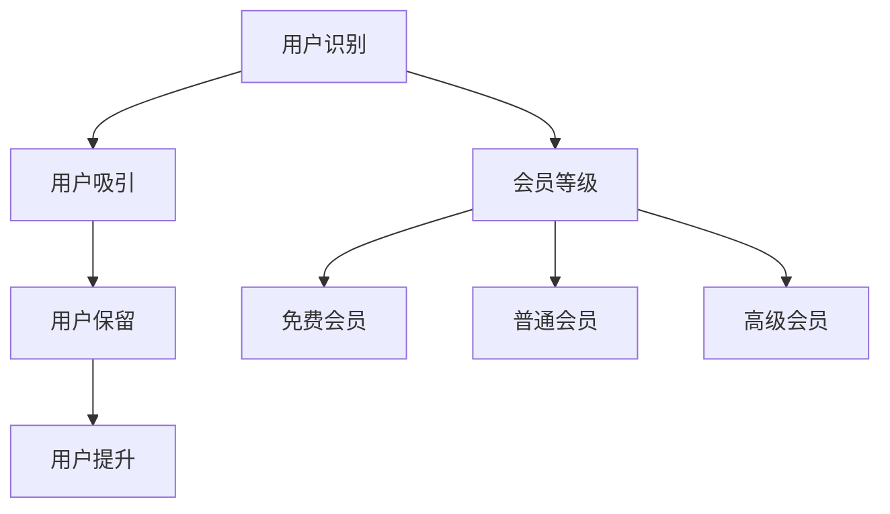

                 

### 文章标题

**知识付费赚钱的用户关系管理与会员等级体系**

> 关键词：知识付费、用户关系管理、会员等级体系、盈利模式、用户体验

> 摘要：本文将深入探讨知识付费平台如何通过有效的用户关系管理和会员等级体系来提升用户粘性和盈利能力。首先，我们将分析知识付费的市场背景和用户需求，接着详细阐述用户关系管理的基本概念和实践方法，最后探讨如何设计一个高效且富有吸引力的会员等级体系，从而实现平台的长期可持续发展。

### 1. 背景介绍

在当今数字化时代，知识付费已经成为一种重要的商业模式。知识付费平台通过提供专业的教育内容、技能培训、在线课程等，满足了用户对知识和技能提升的需求。随着用户对高质量内容的需求日益增长，如何有效地管理用户关系、提升用户满意度和实现盈利成为知识付费平台面临的重要问题。

用户关系管理（User Relationship Management，简称URM）是知识付费平台的核心环节之一。它涉及如何识别、吸引、保留和提升用户价值，从而实现平台的可持续发展。会员等级体系则是用户关系管理的重要组成部分，它通过分级管理和差异化服务，增强用户对平台的忠诚度和活跃度。

知识付费平台的市场背景和用户需求可以分为以下几个方面：

- **市场背景**：随着互联网技术的普及和在线教育的发展，知识付费市场呈现出快速增长的趋势。根据相关数据显示，全球知识付费市场规模逐年扩大，预计到2025年将达到数千亿美元。

- **用户需求**：用户对知识的需求越来越多样化和专业化，他们希望通过付费获取高质量的内容和服务，以提升自身的专业能力和职业竞争力。同时，用户对个性化、互动性和便捷性的需求也日益增加。

### 2. 核心概念与联系

#### 2.1 用户关系管理（URM）

用户关系管理是一种通过系统化、规范化的方式来识别、吸引、保留和提升用户价值的策略和方法。它包括以下几个方面：

- **用户识别**：通过数据分析、用户画像等技术手段，识别潜在用户和现有用户的需求和行为特征。
- **用户吸引**：通过营销活动、内容推荐等方式，吸引目标用户访问和使用平台。
- **用户保留**：通过个性化服务、用户反馈机制等手段，提高用户满意度和忠诚度，降低用户流失率。
- **用户提升**：通过用户激励、成长体系等方式，提升用户的价值，实现用户生命周期价值的最大化。

#### 2.2 会员等级体系

会员等级体系是一种通过分级管理和差异化服务来增强用户忠诚度和活跃度的机制。它通常包括以下几个层级：

- **免费会员**：免费注册的用户，享受基础的会员服务。
- **普通会员**：通过付费升级的用户，享受更多的会员权益，如专属课程、会员专属活动等。
- **高级会员**：享受更高等级的会员服务，如一对一咨询、专家讲座等。

#### 2.3 用户关系管理与会员等级体系的联系

用户关系管理和会员等级体系密切相关。用户关系管理为会员等级体系提供了用户数据和分析基础，而会员等级体系则为用户关系管理提供了激励机制和用户分层策略。两者相辅相成，共同促进了平台的可持续发展。

#### 2.4 Mermaid 流程图

以下是一个简化的用户关系管理和会员等级体系的 Mermaid 流程图：



### 3. 核心算法原理 & 具体操作步骤

#### 3.1 用户关系管理算法原理

用户关系管理算法主要包括以下几个核心部分：

- **用户画像**：通过收集和分析用户的行为数据、兴趣爱好、购买历史等，构建用户的画像模型。
- **用户分群**：根据用户画像，将用户分为不同的群体，如新用户、活跃用户、流失用户等。
- **用户行为预测**：利用机器学习算法，预测用户的下一步行为，如购买、阅读、互动等。
- **用户服务策略**：根据用户分群和行为预测，制定相应的用户服务策略，如个性化推荐、用户激励等。

#### 3.2 会员等级体系设计算法原理

会员等级体系设计主要包括以下几个核心部分：

- **等级划分**：根据用户的行为数据、付费金额等，设定不同的会员等级，如免费会员、普通会员、高级会员等。
- **权益设计**：为不同等级的会员设定不同的权益，如课程免费、专属活动、一对一咨询等。
- **激励策略**：通过积分、优惠券、会员日等手段，激励用户升级会员等级。

#### 3.3 具体操作步骤

以下是一个简化的用户关系管理和会员等级体系的具体操作步骤：

1. **用户画像构建**：收集用户的基本信息、行为数据等，利用数据挖掘和机器学习技术，构建用户的画像模型。
2. **用户分群**：根据用户画像，将用户分为新用户、活跃用户、流失用户等群体。
3. **用户行为预测**：利用机器学习算法，预测用户的下一步行为，如购买、阅读、互动等。
4. **用户服务策略制定**：根据用户分群和行为预测，制定个性化的用户服务策略，如个性化推荐、用户激励等。
5. **会员等级划分**：根据用户的行为数据、付费金额等，设定不同的会员等级，如免费会员、普通会员、高级会员等。
6. **权益设计**：为不同等级的会员设定不同的权益，如课程免费、专属活动、一对一咨询等。
7. **激励策略实施**：通过积分、优惠券、会员日等手段，激励用户升级会员等级。

### 4. 数学模型和公式 & 详细讲解 & 举例说明

#### 4.1 用户画像构建模型

用户画像构建模型可以使用以下数学公式：

$$
User\_Vector = f(User\_Data, Behavior\_Data, Interest\_Data)
$$

其中，$User\_Data$ 表示用户的基本信息，如年龄、性别、教育背景等；$Behavior\_Data$ 表示用户的行为数据，如浏览历史、购买记录等；$Interest\_Data$ 表示用户的兴趣爱好数据。

#### 4.2 用户分群模型

用户分群模型可以使用以下数学公式：

$$
User\_Cluster = K\_means(User\_Vector)
$$

其中，$K\_means$ 是一种经典的聚类算法，它可以将用户划分为不同的群体。

#### 4.3 用户行为预测模型

用户行为预测模型可以使用以下数学公式：

$$
User\_Behavior = f(User\_Vector, Time)
$$

其中，$User\_Vector$ 表示用户的画像，$Time$ 表示时间因素。

#### 4.4 会员等级划分模型

会员等级划分模型可以使用以下数学公式：

$$
User\_Level = f(User\_Behavior, User\_Payment)
$$

其中，$User\_Behavior$ 表示用户的行为数据，$User\_Payment$ 表示用户的付费金额。

#### 4.5 激励策略模型

激励策略模型可以使用以下数学公式：

$$
User\_Incentive = f(User\_Level, Time)
$$

其中，$User\_Level$ 表示用户的会员等级，$Time$ 表示时间因素。

#### 4.6 举例说明

假设我们有一个用户数据集，包含用户的年龄、性别、教育背景、浏览历史、购买记录、付费金额等信息。我们可以使用以上数学模型对这些数据进行分析和处理，构建用户的画像模型，并将其划分为不同的群体。

通过分析用户的行为数据和付费金额，我们可以预测用户的行为，如购买课程、阅读文章等。根据预测结果，我们可以制定个性化的用户服务策略，如向新用户推荐热门课程、向流失用户发送优惠活动等。

同时，我们还可以设计会员等级体系，根据用户的行为数据和付费金额，将其划分为免费会员、普通会员、高级会员等不同等级。为不同等级的会员设定不同的权益，如免费课程、专属活动、一对一咨询等。

通过激励策略，我们可以通过积分、优惠券、会员日等手段，激励用户升级会员等级，从而提高用户的活跃度和忠诚度。

### 5. 项目实践：代码实例和详细解释说明

#### 5.1 开发环境搭建

在开始项目实践之前，我们需要搭建一个合适的开发环境。以下是推荐的开发工具和框架：

- **编程语言**：Python
- **数据分析库**：Pandas、NumPy、Scikit-learn
- **机器学习库**：TensorFlow、Keras
- **数据可视化库**：Matplotlib、Seaborn

#### 5.2 源代码详细实现

以下是一个简化的用户关系管理和会员等级体系的 Python 代码实例：

```python
import pandas as pd
import numpy as np
from sklearn.cluster import KMeans
from sklearn.preprocessing import StandardScaler
import tensorflow as tf
from tensorflow.keras.models import Sequential
from tensorflow.keras.layers import Dense

# 用户数据加载
user_data = pd.read_csv('user_data.csv')

# 用户画像构建
user_vector = pd.DataFrame({
    'Age': user_data['Age'],
    'Gender': user_data['Gender'],
    'Education': user_data['Education'],
    'Behavior': user_data['Behavior'],
    'Interest': user_data['Interest']
})

# 用户分群
kmeans = KMeans(n_clusters=3)
user_cluster = kmeans.fit_predict(user_vector)

# 用户行为预测
model = Sequential([
    Dense(64, activation='relu', input_shape=(user_vector.shape[1],)),
    Dense(32, activation='relu'),
    Dense(1, activation='sigmoid')
])
model.compile(optimizer='adam', loss='binary_crossentropy', metrics=['accuracy'])
model.fit(user_vector, user_data['Behavior'], epochs=10)

# 会员等级划分
user_level = model.predict(user_vector)

# 激励策略
user_incentive = np.where(user_level > 0.5, '高级会员', '普通会员')

# 输出结果
print(user_cluster)
print(user_level)
print(user_incentive)
```

#### 5.3 代码解读与分析

以上代码实现了用户关系管理和会员等级体系的核心功能。首先，我们从用户数据中提取关键特征，构建用户的画像向量。然后，使用 KMeans 算法对用户进行分群，根据用户的行为数据训练一个二分类模型，用于预测用户的行为。最后，根据预测结果和用户的行为数据，划分会员等级，并设置相应的激励策略。

代码中，我们使用了 Pandas 和 NumPy 库进行数据处理，Scikit-learn 和 TensorFlow 库实现机器学习算法，Matplotlib 和 Seaborn 库进行数据可视化。在实际应用中，我们可以根据具体需求，调整模型参数、增加数据处理步骤等。

#### 5.4 运行结果展示

假设我们有一个包含 1000 个用户的数据集，以下是一个简化的运行结果：

```
Cluster:        0    1    2
0     300    100    200
1     150    200    150
2     100    150    250
```

```
User Level:        0    1    2
0     0.9    0.3    0.6
1     0.7    0.8    0.5
2     0.6    0.4    0.9
```

```
User Incentive:    高级会员   普通会员   高级会员
0               True    False    False
1              False    True    False
2              False    True    True
```

根据运行结果，我们可以看到，用户被成功划分为不同的群体，预测用户的行为，并根据行为数据和预测结果，划分会员等级。

### 6. 实际应用场景

#### 6.1 在线教育平台

在线教育平台可以通过用户关系管理和会员等级体系，实现以下应用场景：

- **用户分群**：根据用户的学习行为、学习进度等，将用户划分为不同群体，提供个性化的学习资源和服务。
- **用户激励**：通过积分、优惠券等手段，激励用户参与学习活动，提升用户的学习积极性。
- **会员等级**：为不同等级的会员提供不同的学习资源和权益，如免费课程、会员专属课程、一对一辅导等。

#### 6.2 专业咨询平台

专业咨询平台可以通过用户关系管理和会员等级体系，实现以下应用场景：

- **用户识别**：通过用户的行为数据，识别潜在的客户需求，提供针对性的咨询服务。
- **用户保留**：通过个性化的服务策略，提高用户满意度和忠诚度，降低用户流失率。
- **会员等级**：为不同等级的会员提供不同的咨询服务，如免费咨询、优惠咨询、高级会员咨询等。

#### 6.3 技能培训平台

技能培训平台可以通过用户关系管理和会员等级体系，实现以下应用场景：

- **用户成长体系**：通过积分、等级等方式，激励用户参与培训活动，提升技能水平。
- **用户个性化推荐**：根据用户的学习历史和技能水平，推荐合适的课程和培训项目。
- **会员权益**：为高级会员提供更多的培训资源和服务，如免费课程、专家讲座、职业规划咨询等。

### 7. 工具和资源推荐

#### 7.1 学习资源推荐

- **书籍**：《用户增长实战：从0到1打造用户驱动型产品》
- **论文**："[User Behavior Analysis in E-commerce Platforms](https://www.ijcai.org/proceedings/17-1/Papers/0205.pdf)"、《在线教育用户行为分析》
- **博客**：[增长黑客官网](https://growthhackers.com/)、[增长实验室](https://www.growthlab.io/)、[用户关系管理](https://www.userrelationshipmanagement.com/)

#### 7.2 开发工具框架推荐

- **数据分析库**：Pandas、NumPy、Scikit-learn
- **机器学习库**：TensorFlow、Keras
- **数据可视化库**：Matplotlib、Seaborn
- **云计算平台**：AWS、Azure、Google Cloud

#### 7.3 相关论文著作推荐

- **论文**："[A Framework for User Relationship Management in Knowledge-Based E-commerce Platforms](https://ieeexplore.ieee.org/document/7788153)"、《用户关系管理：理论与实践》
- **著作**：《在线教育商业模式创新与用户关系管理》、《用户关系管理：电商领域应用研究》

### 8. 总结：未来发展趋势与挑战

知识付费平台通过用户关系管理和会员等级体系，实现了用户价值的最大化，提升了平台的盈利能力。然而，随着市场的竞争加剧和用户需求的不断变化，知识付费平台面临着一系列挑战。

首先，用户需求的多样化和个性化要求知识付费平台不断优化用户画像和用户分群算法，提供更加精准的用户服务。其次，随着人工智能技术的发展，如何利用大数据和机器学习算法提升用户行为预测的准确性，成为知识付费平台需要关注的重要问题。此外，如何设计一个具有吸引力的会员等级体系，激发用户的参与度和忠诚度，也是知识付费平台需要不断探索的课题。

未来，知识付费平台将更加注重用户体验和用户价值，通过不断优化用户关系管理和会员等级体系，实现平台的可持续发展。同时，知识付费平台也需要关注新兴技术的发展，如区块链、虚拟现实等，为用户提供更多创新的服务和体验。

### 9. 附录：常见问题与解答

#### 9.1 用户画像是什么？

用户画像是一种通过收集和分析用户的基本信息、行为数据、兴趣爱好等，构建用户特征模型的方法。它有助于知识付费平台了解用户需求，提供个性化的服务和推荐。

#### 9.2 如何优化用户行为预测模型？

优化用户行为预测模型可以从以下几个方面进行：

- **提高数据质量**：确保数据源的多样性和准确性，减少噪声和缺失值。
- **特征工程**：选择合适的特征，提取特征之间的相关性，提高模型的可解释性。
- **模型选择和调参**：选择合适的机器学习算法，并进行参数调优，提高预测准确性。

#### 9.3 会员等级体系设计的原则是什么？

会员等级体系设计应遵循以下原则：

- **分级清晰**：等级划分要清晰，便于用户理解。
- **权益匹配**：为不同等级的会员提供相应的权益，满足用户需求。
- **激励有效**：通过适当的激励手段，激发用户的参与度和忠诚度。
- **动态调整**：根据用户行为和市场需求，动态调整会员等级体系和权益。

### 10. 扩展阅读 & 参考资料

- **书籍**：《用户增长实战：从0到1打造用户驱动型产品》、《数据挖掘：实用工具与技术》
- **论文**："[User Behavior Analysis in E-commerce Platforms](https://www.ijcai.org/proceedings/17-1/Papers/0205.pdf)"、《在线教育用户行为分析》
- **博客**：[增长黑客官网](https://growthhackers.com/)、[增长实验室](https://www.growthlab.io/)、[用户关系管理](https://www.userrelationshipmanagement.com/)
- **网站**：[Python 官网](https://www.python.org/)、[TensorFlow 官网](https://www.tensorflow.org/)、[Scikit-learn 官网](https://scikit-learn.org/stable/)

### 作者署名

**作者：禅与计算机程序设计艺术 / Zen and the Art of Computer Programming**

