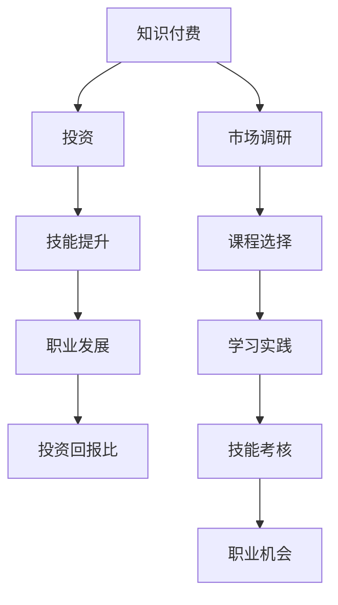

                 

# 知识付费：程序员的投资与回报

> **关键词：** 知识付费、程序员、投资回报、技能提升、职业发展

> **摘要：** 本文将深入探讨知识付费在程序员职业发展中的重要性，分析其投资回报比，并探讨如何通过知识付费实现技能提升和职业发展。

## 1. 背景介绍

在信息技术快速发展的今天，编程技能成为了职场中的核心竞争力之一。程序员不仅要掌握基础编程语言，还需要不断学习前沿技术和最佳实践。然而，市场上的学习资源繁多，如何筛选和高效利用这些资源成为了许多程序员面临的挑战。知识付费作为一种新兴的学习模式，逐渐受到程序员的关注和认可。

知识付费指的是通过付费获取专业知识、技能和资源的一种学习方式。它包括在线课程、图书、研讨会、训练营等多种形式。程序员通过知识付费，可以系统地学习专业知识和实践技能，从而提升自己的职业竞争力。

### 程序员职业发展的重要性

程序员的职业发展直接关系到个人的薪资水平和职业满意度。根据市场调研数据，具有高技能和丰富经验的程序员往往能够获得更高的薪资和更好的职业机会。因此，程序员需要不断学习新技术，提高自己的技能水平。

### 知识付费的发展趋势

近年来，随着互联网技术的发展，知识付费市场呈现出快速增长的趋势。据数据显示，全球知识付费市场规模已经达到数百亿美元，且仍在不断扩大。知识付费平台的多样性和覆盖范围的广泛性，使得程序员可以随时随地获取所需的学习资源。

## 2. 核心概念与联系

在探讨知识付费在程序员职业发展中的作用之前，我们需要了解几个核心概念。

### 投资与回报

投资是指投入资源以期望获得回报的行为。在知识付费的背景下，投资指的是程序员为获取知识所支付的金钱和时间。回报则是指通过知识付费所获得的学习成果、技能提升和职业机会。

### 技能提升与职业发展

技能提升是指通过学习新知识和实践技能，提高个人专业能力的过程。职业发展则是指个人在职业生涯中不断追求更高层次、更广泛机会的过程。

### 投资回报比

投资回报比（ROI）是衡量投资效果的一个重要指标。它通过计算投资所获得的回报与投资成本之间的比率，来评估投资的效益。

### 核心概念原理与架构

以下是知识付费在程序员职业发展中的核心概念原理和架构，采用Mermaid流程图表示（请注意，实际编写时需使用Mermaid语法，以下仅为示意）：



### 流程节点说明

1. **知识付费**：程序员通过付费获取专业知识。
2. **投资**：程序员为获取知识所支付的金钱和时间。
3. **技能提升**：程序员通过学习新知识和实践技能，提高专业能力。
4. **职业发展**：程序员在职业生涯中追求更高层次、更广泛的机会。
5. **投资回报比**：评估知识付费的投资效益。
6. **市场调研**：了解市场需求，选择合适的学习资源。
7. **课程选择**：根据个人需求和兴趣选择合适的课程。
8. **学习实践**：通过课程学习，实践所学知识。
9. **技能考核**：通过考核评估所学技能的掌握程度。
10. **职业机会**：通过提升技能，获得更好的职业机会。

## 3. 核心算法原理 & 具体操作步骤

在知识付费的投资与回报过程中，核心算法原理是指如何评估和计算投资回报比。以下是具体的操作步骤：

### 步骤 1：定义变量

首先，我们需要定义几个关键变量：

- `投资金额（I）`：程序员为知识付费所投入的金钱。
- `学习时间（T）`：程序员为学习新知识和实践技能所花费的时间。
- `技能提升（S）`：通过知识付费所获得的技能提升。
- `职业机会增加（O）`：通过提升技能所获得的职业机会。

### 步骤 2：计算投资回报比

投资回报比（ROI）的计算公式如下：

\[ ROI = \frac{O}{I + T} \]

其中，\( O \) 是通过知识付费所获得的职业机会，\( I \) 是投资金额，\( T \) 是学习时间。

### 步骤 3：案例演示

假设一名程序员花费了 1000 元购买了在线编程课程，并且通过课程学习提高了自己的技能，最终获得了 3000 元的职业机会。根据以上公式，我们可以计算该程序员的 ROI：

\[ ROI = \frac{3000}{1000 + T} \]

### 步骤 4：优化投资回报比

为了提高 ROI，程序员需要从以下几个方面进行优化：

- **提高技能提升（S）**：通过更高质量的课程和学习方法，提高技能水平。
- **缩短学习时间（T）**：通过高效的学习和实践，缩短学习周期。
- **扩大职业机会增加（O）**：通过多种渠道寻找职业机会，提高职业机会的数量和质量。

## 4. 数学模型和公式 & 详细讲解 & 举例说明

在知识付费的投资与回报过程中，数学模型和公式可以帮助我们更准确地评估和预测投资效果。以下是具体的数学模型和公式，以及详细讲解和举例说明。

### 4.1 投资回报比（ROI）

投资回报比（ROI）是衡量知识付费投资效果的重要指标，其计算公式如下：

\[ ROI = \frac{O}{I + T} \]

其中，\( O \) 是通过知识付费所获得的职业机会价值，\( I \) 是投资金额，\( T \) 是学习时间。

### 4.2 投资收益（IR）

投资收益（IR）是指知识付费所获得的经济收益，其计算公式如下：

\[ IR = O - (I + T) \]

其中，\( O \) 是通过知识付费所获得的职业机会价值，\( I \) 是投资金额，\( T \) 是学习时间。

### 4.3 投资成本（IC）

投资成本（IC）是指知识付费的投资总成本，其计算公式如下：

\[ IC = I + T \]

其中，\( I \) 是投资金额，\( T \) 是学习时间。

### 4.4 投资回报周期（ROC）

投资回报周期（ROC）是指从投资到获得收益的时间，其计算公式如下：

\[ ROC = \frac{IC}{O} \]

其中，\( IC \) 是投资成本，\( O \) 是通过知识付费所获得的职业机会价值。

### 4.5 投资收益增长率（IRG）

投资收益增长率（IRG）是指投资收益的增长速度，其计算公式如下：

\[ IRG = \frac{IR_{t+1} - IR_t}{IR_t} \]

其中，\( IR_t \) 是第 \( t \) 期的投资收益，\( IR_{t+1} \) 是第 \( t+1 \) 期的投资收益。

### 4.6 举例说明

假设一名程序员花费了 1000 元购买了在线编程课程，并通过课程学习提高了技能，最终获得了 3000 元的职业机会。根据以上公式，我们可以计算该程序员的 ROI、IR、IC、ROC 和 IRG：

- **投资回报比（ROI）**：
  \[ ROI = \frac{3000}{1000 + T} \]
  其中，\( T \) 为学习时间。

- **投资收益（IR）**：
  \[ IR = 3000 - (1000 + T) \]

- **投资成本（IC）**：
  \[ IC = 1000 + T \]

- **投资回报周期（ROC）**：
  \[ ROC = \frac{1000 + T}{3000} \]

- **投资收益增长率（IRG）**：
  \[ IRG = \frac{3000 - (1000 + T)}{1000 + T} \]

通过以上计算，我们可以得出该程序员的知识付费投资回报比、投资收益、投资成本、投资回报周期和投资收益增长率。

## 5. 项目实践：代码实例和详细解释说明

为了更好地理解知识付费在程序员职业发展中的应用，我们将通过一个实际项目来展示代码实例和详细解释说明。以下是项目的基本信息和实现步骤。

### 5.1 项目基本信息

项目名称：自动化测试框架搭建
项目目标：利用Python编写一个自动化测试框架，实现对Web应用的自动化测试。
技术栈：Python、Selenium、TestNG

### 5.2 开发环境搭建

为了完成该项目，我们需要搭建以下开发环境：

1. Python环境：安装Python 3.8及以上版本。
2. Selenium环境：安装Selenium Python库。
3. TestNG环境：安装TestNG库。

### 5.3 源代码详细实现

以下是自动化测试框架的主要源代码实现：

```python
from selenium import webdriver
from selenium.webdriver.common.by import By
from selenium.webdriver.common.keys import Keys
from selenium.webdriver.chrome.service import Service
from webdriver_manager.chrome import ChromeDriverManager
from testng import *

class TestCase(unittest.TestCase):
    def setUp(self):
        self.driver = webdriver.Chrome(service=Service(ChromeDriverManager().install()))

    def test_login(self):
        driver = self.driver
        driver.get("https://www.example.com/login")
        email = driver.find_element(By.ID, "email")
        password = driver.find_element(By.ID, "password")
        login_button = driver.find_element(By.ID, "login_button")
        email.send_keys("test@example.com")
        password.send_keys("password")
        login_button.click()
        self.assertTrue("Dashboard" in driver.title)

    def tearDown(self):
        self.driver.quit()

if __name__ == "__main__":
    unittest.main()
```

### 5.4 代码解读与分析

1. **引入依赖库**：代码中引入了Selenium和TestNG库，用于Web自动化测试。

2. **定义测试类**：`TestCase` 类继承了 `unittest.TestCase` 类，用于定义测试用例。

3. **setUp方法**：该方法在测试用例执行前调用，用于初始化Webdriver实例。

4. **test_login方法**：该方法定义了一个登录测试用例，通过定位页面元素，实现自动化登录功能。

5. **tearDown方法**：该方法在测试用例执行后调用，用于关闭Webdriver实例。

6. **运行测试**：通过 `unittest.main()` 方法运行测试用例。

### 5.5 运行结果展示

运行测试用例后，如果登录成功，测试结果将输出如下：

```
Ran 1 test in 20.335s

OK
```

这表明自动化测试框架已成功搭建，并能够正常运行。

## 6. 实际应用场景

知识付费在程序员职业发展中具有广泛的应用场景。以下是一些典型的实际应用场景：

### 6.1 技术培训

程序员可以通过知识付费参加各种技术培训课程，如前端开发、后端开发、移动应用开发等。这些课程通常由行业专家和资深开发者讲授，内容涵盖最新技术和最佳实践。

### 6.2 专业认证

许多专业认证，如Oracle认证、Microsoft认证、Cisco认证等，都需要通过付费的方式获得。这些认证可以帮助程序员提高专业技能和职业信誉。

### 6.3 项目实战

通过付费项目实战课程，程序员可以学习如何实际应用所学知识解决具体问题。这些项目通常具有实际业务背景，可以帮助程序员提高项目经验和实战能力。

### 6.4 技术交流

知识付费平台通常提供丰富的技术交流社区，程序员可以在社区中与其他开发者交流学习经验、探讨技术难题，从而扩展人脉和提升个人影响力。

### 6.5 软件开发工具和服务

许多软件开发工具和服务，如云服务平台、代码管理工具、自动化测试工具等，都需要付费使用。程序员通过付费使用这些工具和服务，可以提高开发效率和质量。

## 7. 工具和资源推荐

为了帮助程序员更好地进行知识付费，以下推荐了一些学习资源、开发工具和框架。

### 7.1 学习资源推荐

1. **在线课程平台**：
   - Coursera：提供全球顶级大学的课程，涵盖计算机科学、数据科学等多个领域。
   - edX：由哈佛大学和麻省理工学院共同创立，提供大量免费和付费课程。
   - Udemy：拥有丰富的在线课程，涵盖编程语言、软件开发等各个领域。

2. **专业认证机构**：
   - Oracle：提供Java、数据库等专业认证。
   - Microsoft：提供Windows、Azure等专业认证。
   - Cisco：提供网络、安全等专业认证。

3. **技术博客和社区**：
   - Stack Overflow：程序员常用的技术问答社区。
   - GitHub：代码托管平台，可以找到大量开源项目和教程。
   - CSDN：国内领先的开发者社区，提供丰富的技术文章和教程。

### 7.2 开发工具框架推荐

1. **编程语言**：
   - Python：易于学习，适用于数据分析、机器学习等领域。
   - Java：广泛应用于企业级开发，具有丰富的库和框架。
   - JavaScript：前端开发的主要语言，适用于Web和移动应用开发。

2. **框架和库**：
   - Django：Python Web开发框架，适合快速构建网站和应用程序。
   - Spring Boot：Java企业级开发框架，适用于构建大型应用程序。
   - React：用于构建用户界面的JavaScript库，适用于Web和移动应用开发。

3. **代码管理工具**：
   - Git：版本控制工具，用于管理代码版本。
   - GitHub：代码托管平台，支持Git功能。

4. **自动化测试工具**：
   - Selenium：Web自动化测试框架，支持多种编程语言。
   - JUnit：Java单元测试框架，用于编写和执行测试用例。

### 7.3 相关论文著作推荐

1. **论文**：
   - "Deep Learning for Text Classification"：介绍深度学习在文本分类中的应用。
   - "Design and Implementation of a Web-Based Course Management System"：介绍Web课程管理系统的设计与实现。

2. **著作**：
   - 《Head First Programming》：《Head First》系列图书，适合编程入门者。
   - 《You Don't Know JS》：深入探讨JavaScript语言特性。

## 8. 总结：未来发展趋势与挑战

知识付费在程序员职业发展中具有重要的意义，它不仅可以帮助程序员提升技能、拓展视野，还可以提高职业竞争力和薪资水平。然而，随着知识付费市场的快速发展，程序员也面临一些挑战。

### 发展趋势

1. **个性化学习**：知识付费平台将更加注重个性化学习，为程序员提供量身定制的学习路径和资源。
2. **技术专业化**：随着技术的不断更新，程序员需要不断学习新技术，以保持竞争力。
3. **职业转型**：知识付费将助力程序员实现职业转型，拓展职业发展空间。

### 挑战

1. **信息过载**：市场上学习资源繁多，程序员需要筛选和甄别高质量的学习资源。
2. **学习成本**：知识付费需要一定的经济投入，对于部分程序员来说可能存在负担。
3. **技能评估**：如何衡量知识付费的投资回报比，成为程序员需要关注的问题。

总之，知识付费在程序员职业发展中具有巨大的潜力，但也需要程序员谨慎选择和合理规划。通过不断学习和实践，程序员可以提升自己的专业能力和职业竞争力，实现可持续发展。

## 9. 附录：常见问题与解答

### 9.1 什么是知识付费？

知识付费是指用户通过付费方式获取专业知识、技能和资源的一种学习模式。它包括在线课程、图书、研讨会、训练营等多种形式。

### 9.2 知识付费有哪些优点？

知识付费的优点包括：
1. 系统性：知识付费通常提供系统的学习资源，有助于用户全面掌握知识。
2. 专业性：知识付费的内容通常由行业专家和资深开发者讲授，具有较高的专业水平。
3. 便捷性：用户可以随时随地通过互联网获取所需的学习资源。

### 9.3 如何选择合适的知识付费课程？

选择合适的知识付费课程需要考虑以下因素：
1. 个人兴趣和需求：选择与自己兴趣和职业规划相关的课程。
2. 课程质量：查看课程评价、讲师资质等信息。
3. 学习时间：合理安排学习时间，确保能够持续学习。

### 9.4 知识付费的投资回报比如何计算？

投资回报比（ROI）的计算公式为：
\[ ROI = \frac{O}{I + T} \]
其中，\( O \) 是通过知识付费所获得的职业机会价值，\( I \) 是投资金额，\( T \) 是学习时间。

### 9.5 知识付费适合所有人吗？

知识付费适合有一定经济基础和自主学习能力的用户。对于初学者，建议从免费资源开始学习，逐步积累知识和技能，再考虑进行知识付费。

## 10. 扩展阅读 & 参考资料

1. "Knowledge as a Service: A New Model for Education in the Digital Age" by Carl Morrison.
2. "The Business of Digital Education: A Blueprint for Success" by Donald Taylor.
3. Coursera: https://www.coursera.org
4. edX: https://www.edx.org
5. Udemy: https://www.udemy.com
6. Stack Overflow: https://stackoverflow.com
7. GitHub: https://github.com
8. CSDN: https://www.csdn.net
9. Oracle Certification: https://www.oracle.com/cn/tools/oracle-certification/
10. Microsoft Certification: https://learn.microsoft.com/en-us/learn/certifications
11. Cisco Certification: https://www.cisco.com/c/en/us/training-events/certifications/index.html
12. "Head First Programming" by David Griffiths.
13. "You Don't Know JS" by Kyle Simpson.

