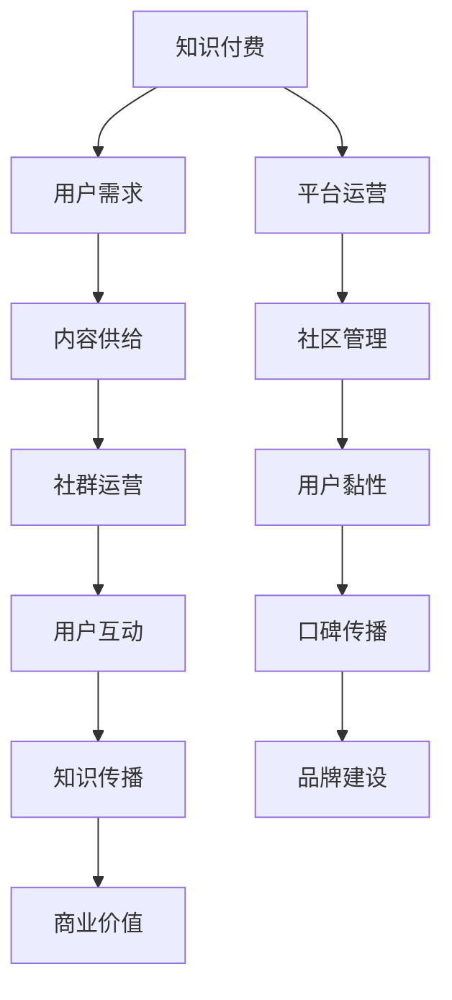

                 

### 背景介绍

#### 时代背景

随着互联网的迅猛发展和信息技术的不断进步，知识付费已经成为当今社会的一大趋势。知识付费，即用户为了获取特定领域的专业知识和经验，自愿支付一定费用以获取相关服务或产品。这一现象的背后，体现了人们对于自我提升和职业发展的强烈需求。

在知识付费领域，程序员的社群运营尤为关键。程序员作为现代社会中不可或缺的一类职业，他们的专业技能和创新能力对企业和个人都具有重要意义。然而，随着技术的日新月异，程序员们面临着不断更新的知识体系和激烈的竞争压力。因此，通过社群运营，程序员们可以更好地获取行业动态、学习新技能、拓展人脉资源，从而提升自身的职业竞争力。

#### 社群运营的重要性

社群运营在知识付费中具有不可忽视的重要作用。首先，社群提供了一个开放的交流平台，使程序员们能够分享经验、探讨问题、交流想法。这种互动有助于知识的传播和积累，促进了整个行业的技术进步。其次，社群运营有助于形成专业圈子，让具有相似兴趣和目标的程序员们能够聚集在一起，共同成长。最后，社群运营还能够帮助企业或个人推广其知识产品，吸引更多潜在用户，实现商业价值。

#### 目标读者

本文的目标读者主要包括以下几类：

1. **程序员**：对于正在从事编程工作，希望通过社群运营提升个人技能和职业发展的程序员来说，本文提供了实用的指南和建议。
2. **知识付费从业者**：从事知识付费行业的专业人士，如讲师、课程制作人员、平台运营人员等，可以从本文中获得关于社群运营的有效策略和方法。
3. **企业决策者**：对于希望借助社群运营推动企业业务发展和品牌建设的决策者来说，本文提供了有益的启示和思路。

通过本文，读者将了解到如何有效地进行社群运营，从而在知识付费市场中获得竞争优势。接下来的章节中，我们将深入探讨社群运营的核心概念、算法原理、数学模型，并结合实际项目进行详细讲解。希望本文能够为广大程序员和知识付费从业者提供有价值的参考。### 核心概念与联系

#### 知识付费与社群运营

在深入探讨知识付费与社群运营之前，我们需要明确一些核心概念。知识付费是指用户为了获取特定领域的专业知识和经验，自愿支付一定费用以获取相关服务或产品。而社群运营则是在互联网环境下，通过搭建和运营一个在线社群，实现用户互动、知识传播和商业价值的最大化。

##### 知识付费的内涵

知识付费的核心在于价值的交换。用户通过付费获取专业的知识和技能，满足自身的学习需求或解决实际问题。知识付费的形式多样，包括在线课程、电子书、专业咨询、在线讲座等。在这个过程中，用户的需求和供给双方通过市场机制实现资源的高效配置。

##### 社群运营的内涵

社群运营则关注如何构建和维系一个具有粘性和活跃度的在线社群。社群运营的目标是促进用户互动、增强用户归属感，从而实现知识的传播和积累。社群运营的形式包括线上论坛、微信群、QQ群、微博超话等，通过多种手段激发用户的参与热情。

##### 知识付费与社群运营的联系

知识付费与社群运营之间存在紧密的联系。首先，社群运营为知识付费提供了一个理想的平台。通过社群，知识提供者可以与用户进行直接的交流，了解用户的需求，进而提供更个性化的知识和服务。其次，社群运营有助于知识的传播和共享。在一个活跃的社群中，用户之间的互动和分享可以促进知识的快速传播，形成知识生态圈。

为了更好地理解知识付费与社群运营的相互关系，我们可以借助Mermaid流程图（以下简称“流程图”）来展示这两个概念之间的联系。以下是一个简化的流程图：



在该流程图中：

- **A[知识付费]**：表示知识付费的整体概念。
- **B[用户需求]**：用户为获取知识所付出的努力和期望。
- **C[内容供给]**：知识提供者通过社群运营提供有价值的内容。
- **D[社群运营]**：搭建和维护在线社群的过程。
- **E[用户互动]**：用户在社群中的交流和互动。
- **F[知识传播]**：用户互动促进知识的传播和共享。
- **G[商业价值]**：通过知识付费和社群运营实现的商业回报。
- **H[平台运营]**：运营知识付费平台的整体过程。
- **I[社区管理]**：对社群进行有效管理和维护。
- **J[用户黏性]**：用户对社群的持续关注和参与。
- **K[口碑传播]**：用户之间的推荐和传播，增强社群影响力。
- **L[品牌建设]**：通过社群运营提升品牌的知名度和认可度。

通过这个流程图，我们可以清晰地看到知识付费与社群运营之间的相互作用和影响。知识付费为社群运营提供了内容基础和商业动力，而社群运营则为知识付费提供了良好的传播和交流平台。

综上所述，知识付费与社群运营是相辅相成的。在知识付费的背景下，有效的社群运营能够促进知识的传播和共享，提升用户满意度，从而实现商业价值。接下来，我们将进一步探讨知识付费与社群运营的核心算法原理，为读者提供更深入的理解和实践指导。### 核心算法原理 & 具体操作步骤

在了解知识付费与社群运营的内涵和联系后，接下来我们需要深入探讨其核心算法原理，并通过具体的操作步骤来展示如何实现有效的社群运营。

#### 算法原理

社群运营的核心算法可以分为以下几个部分：

1. **用户分析**：通过对用户行为数据的分析，了解用户的兴趣、需求和痛点，从而提供个性化的内容和服务。
2. **内容推荐**：基于用户分析和数据挖掘，推荐用户可能感兴趣的知识内容和互动活动。
3. **社群管理**：通过有效的社区管理策略，维护社群的秩序和活跃度，增强用户的参与感和归属感。
4. **用户互动**：设计多样化的互动形式，如问答、讨论、投票等，促进用户之间的交流。
5. **数据分析**：持续跟踪和分析用户行为数据，不断优化社群运营策略。

这些算法原理相互关联，共同作用于社群运营的各个环节，实现知识的有效传播和商业价值的最大化。

#### 具体操作步骤

以下为社群运营的核心操作步骤：

1. **用户分析**：
   - 收集用户数据：包括用户的基本信息、浏览记录、购买历史等。
   - 分析用户行为：通过数据挖掘技术，分析用户的兴趣和行为模式。
   - 构建用户画像：基于用户行为数据，构建详细的用户画像，用于后续的内容推荐和运营策略制定。

2. **内容推荐**：
   - 建立内容库：收集和整理与程序员相关的各类知识内容，包括教程、案例、讲座等。
   - 设计推荐算法：采用协同过滤、内容匹配等算法，根据用户画像和内容标签，推荐用户可能感兴趣的内容。
   - 持续更新内容：定期更新内容库，确保内容的新鲜度和实用性。

3. **社群管理**：
   - 制定社群规则：明确社群的运营规则，包括发言规范、互动准则等。
   - 维护社群秩序：通过管理员和自动化工具，监控社群动态，及时发现和处理违规行为。
   - 增强社群活跃度：组织各类线上活动，如技术分享、直播讲座、编程比赛等，激发用户的参与热情。

4. **用户互动**：
   - 设计互动形式：提供多样化的互动形式，如问答、讨论、投票、直播等，满足用户的不同需求。
   - 优化互动体验：通过实时消息推送、积分奖励等方式，提升用户的互动体验。
   - 建立激励机制：通过积分、排名、荣誉等方式，激励用户积极参与社群活动。

5. **数据分析**：
   - 跟踪用户行为：持续跟踪用户在社群中的行为数据，包括浏览、点赞、评论等。
   - 分析运营效果：通过数据分析，评估社群运营的效果，发现问题和不足。
   - 优化运营策略：根据数据分析结果，调整运营策略，不断优化社群运营。

#### 示例

为了更直观地展示社群运营的操作步骤，我们以一个程序员社群为例，具体说明如何进行社群运营：

1. **用户分析**：
   - 社群上线初期，通过注册信息和用户反馈，收集用户的基本信息。
   - 使用数据分析工具，分析用户的兴趣和行为模式，如技术方向、关注问题等。
   - 构建详细的用户画像，为后续的内容推荐和运营策略提供依据。

2. **内容推荐**：
   - 根据用户画像，构建内容库，包括基础教程、实战案例、技术讲座等。
   - 采用协同过滤算法，根据用户的浏览历史和点赞记录，推荐用户可能感兴趣的内容。
   - 定期更新内容库，确保内容的新鲜度和实用性。

3. **社群管理**：
   - 制定社群规则，明确发言规范和互动准则。
   - 指派管理员，负责监控社群动态，处理违规行为。
   - 组织线上活动，如技术分享会、编程比赛等，增强社群活跃度。

4. **用户互动**：
   - 提供多样化的互动形式，如问答、讨论、投票等，满足用户的不同需求。
   - 通过实时消息推送和积分奖励，提升用户的互动体验。
   - 鼓励用户积极参与社群活动，分享自己的经验和见解。

5. **数据分析**：
   - 跟踪用户的浏览、点赞、评论等行为，分析社群运营的效果。
   - 根据数据分析结果，调整运营策略，如优化内容推荐、提高互动体验等。

通过以上具体的操作步骤，我们可以看到社群运营的核心算法原理是如何在实际中得以应用的。接下来，我们将进一步探讨知识付费与社群运营中的数学模型和公式，为读者提供更深入的学术支持。### 数学模型和公式 & 详细讲解 & 举例说明

在知识付费与社群运营的背景下，数学模型和公式为理解和优化这一过程提供了有力的工具。以下我们将详细讲解几个关键数学模型和公式，并通过具体例子来说明其应用。

#### 用户参与度模型

用户参与度是衡量社群运营效果的重要指标。一个常见的用户参与度模型是阿尔法-贝塔模型（Alpha-Beta Model），该模型通过计算用户的活跃度和影响力来评估用户参与度。

**公式**：

$$
User\ Engagement = \alpha \times Active\ Participation + \beta \times Influential\ Activity
$$

- **Active Participation（活跃度）**：表示用户在社群中的活跃程度，如发帖、回复、点赞等。
- **Influential Activity（影响力）**：表示用户在社群中的影响力，如引导话题、获得点赞和分享等。

**例子**：

假设用户A在一个月内在社群中发表了10篇帖子，获得了50次点赞，同时引导了5个热门话题。设$\alpha = 0.6$，$\beta = 0.4$，则用户A的参与度计算如下：

$$
User\ Engagement_A = 0.6 \times 10 + 0.4 \times 5 = 6 + 2 = 8
$$

这意味着用户A在该月的参与度得分为8分。

#### 社群活跃度模型

社群活跃度是衡量社群整体活力的指标。一个简单的活跃度模型是平均值模型（Average Activity Model），该模型通过计算用户发帖量和回复量的平均值来评估社群活跃度。

**公式**：

$$
Community\ Activity = \frac{Total\ Posts + Total\ Replies}{Number\ of\ Users}
$$

**例子**：

假设一个社群有100名用户，一个月内共发表了300篇帖子，回复了500条。则该社群的平均活跃度为：

$$
Community\ Activity = \frac{300 + 500}{100} = \frac{800}{100} = 8
$$

这意味着该社群的平均活跃度为8次/用户。

#### 内容推荐模型

内容推荐是社群运营的关键环节。一个常见的内容推荐模型是基于协同过滤的推荐算法（Collaborative Filtering Algorithm）。协同过滤算法通过分析用户的历史行为和偏好，预测用户可能感兴趣的内容。

**公式**：

$$
Content\ Recommendation\ Score = \frac{\sum_{i \in Neighbors} (User\ Preference_{i} - \bar{User\ Preference}) \times Content\ Preference_{i}}{\sum_{i \in Neighbors} (User\ Preference_{i} - \bar{User\ Preference})}
$$

- **Neighbors（邻居用户）**：与目标用户有相似行为和偏好的用户集合。
- **User Preference$_i$**：邻居用户$i$对内容的偏好分数。
- **Content Preference$_i$**：目标用户对内容$i$的偏好分数。
- **$\bar{User\ Preference}$**：目标用户的平均偏好分数。

**例子**：

假设用户B的历史行为显示他喜欢阅读编程技术文章，其他类似用户（邻居）也表现出相似的偏好。假设邻居用户C对一篇新文章的偏好分数为4，用户B对该文章的未知偏好分数设为3，邻居的平均偏好分数为3.5。则根据协同过滤算法，用户B对新文章的推荐分数计算如下：

$$
Content\ Recommendation\ Score = \frac{(4 - 3.5) \times 4}{4 - 3.5} = \frac{0.5 \times 4}{0.5} = 4
$$

这意味着该文章对用户B的推荐分数为4分，表明用户B对此文章有较高的兴趣。

#### 社群影响力模型

社群影响力是衡量社群运营效果的重要指标。一个常见的影响力模型是基于度中心性（Closeness Centrality）的影响模型，该模型通过计算用户在网络中的连接紧密程度来评估其影响力。

**公式**：

$$
Influence\ Score = \frac{1}{\sum_{i \in Network} \text{Distance}(u, i)}
$$

- **Network（网络）**：社群中的用户及其相互关系构成的网络。
- **Distance(u, i)**：用户u到用户i的最短路径长度。

**例子**：

假设一个社群中有10名用户，用户D与其他用户的距离较短，仅为2。则用户D的影响力分数计算如下：

$$
Influence\ Score_D = \frac{1}{2 + 2 + 2 + \ldots + 2} = \frac{1}{20} = 0.05
$$

这意味着用户D在该社群中的影响力得分为0.05，表明其在社群中的影响力较低。

通过上述数学模型和公式的详细讲解，我们可以更科学地评估和优化知识付费与社群运营的过程。接下来，我们将结合实际项目，通过代码实例和详细解读，展示如何具体实现这些算法和模型。### 项目实践：代码实例和详细解释说明

在前面的章节中，我们介绍了知识付费与社群运营的核心算法原理和数学模型。为了更好地帮助读者理解这些理论在实际中的应用，我们将在本章节中通过一个具体的程序员社群项目，详细展示如何进行代码实现，并对关键代码进行解读和分析。

#### 开发环境搭建

在开始项目实践之前，我们需要搭建一个合适的技术环境。以下是搭建程序员社群项目的开发环境步骤：

1. **安装Python**：确保Python 3.x版本已安装。可以从Python官网下载并安装。

2. **安装依赖库**：我们使用Flask作为Web框架，因此需要安装Flask及相关依赖库。可以使用pip命令进行安装：

   ```bash
   pip install Flask
   pip install Flask-Login
   pip install Flask-SQLAlchemy
   pip install Flask-Migrate
   ```

3. **创建项目目录结构**：在本地创建一个项目目录，并按照以下结构进行组织：

   ```plaintext
   project/
   ├── app/
   │   ├── __init__.py
   │   ├── models.py
   │   ├── routes.py
   │   └── templates/
   ├── migrations/
   ├── tests/
   └── requirements.txt
   ```

4. **配置数据库**：在本项目中，我们使用SQLite作为数据库。在`models.py`中配置数据库连接：

   ```python
   from flask_sqlalchemy import SQLAlchemy

   db = SQLAlchemy()

   def init_app(app):
       db.init_app(app)
   ```

5. **创建虚拟环境**：为了更好地管理项目依赖，创建一个虚拟环境：

   ```bash
   python -m venv venv
   source venv/bin/activate  # Windows: venv\Scripts\activate
   ```

6. **编写requirements文件**：在项目根目录下创建`requirements.txt`文件，列出所有依赖库：

   ```plaintext
   Flask==2.0.1
   Flask-Login==0.5.0
   Flask-SQLAlchemy==2.5.1
   Flask-Migrate==3.1.0
   ```

#### 源代码详细实现

接下来，我们将逐步实现程序员社群项目的主要功能模块。

##### 1. 用户认证模块

用户认证是社群运营的基础。下面是用户认证模块的实现：

**`app/__init__.py`**：

```python
from flask import Flask
from flask_login import LoginManager
from flask_sqlalchemy import SQLAlchemy

app = Flask(__name__)
app.config['SQLALCHEMY_DATABASE_URI'] = 'sqlite:///site.db'
db = SQLAlchemy()
login_manager = LoginManager()
login_manager.init_app(app)

from app import routes, models
```

**`app/models.py`**：

```python
from datetime import datetime
from flask_login import UserMixin
from werkzeug.security import generate_password_hash, check_password_hash
from app import db

class User(UserMixin, db.Model):
    id = db.Column(db.Integer, primary_key=True)
    username = db.Column(db.String(20), unique=True, nullable=False)
    email = db.Column(db.String(120), unique=True, nullable=False)
    password = db.Column(db.String(60), nullable=False)
    date_registered = db.Column(db.DateTime, nullable=False, default=datetime.utcnow)

    def set_password(self, password):
        self.password = generate_password_hash(password)

    def check_password(self, password):
        return check_password_hash(self.password, password)
```

**`app/routes.py`**：

```python
from flask import render_template, url_for, flash, redirect, request
from flask_login import login_user, current_user, logout_user, login_required
from app import app, db
from app.models import User

@app.route('/login', methods=['GET', 'POST'])
def login():
    if current_user.is_authenticated:
        return redirect(url_for('home'))
    if request.method == 'POST':
        username = request.form['username']
        password = request.form['password']
        user = User.query.filter_by(username=username).first()
        if user is None or not user.check_password(password):
            flash('无效的用户名或密码', 'danger')
            return redirect(url_for('login'))
        login_user(user)
        return redirect(url_for('home'))
    return render_template('login.html', title='登录')

@app.route('/logout')
def logout():
    logout_user()
    return redirect(url_for('home'))
```

##### 2. 社群功能模块

社群功能模块包括发帖、回复、内容推荐等。以下是关键代码实现：

**`app/models.py`**：

```python
class Post(db.Model):
    id = db.Column(db.Integer, primary_key=True)
    title = db.Column(db.String(100), nullable=False)
    content = db.Column(db.Text, nullable=False)
    author_id = db.Column(db.Integer, db.ForeignKey('user.id'), nullable=False)
    date_posted = db.Column(db.DateTime, nullable=False, default=datetime.utcnow)

class Comment(db.Model):
    id = db.Column(db.Integer, primary_key=True)
    content = db.Column(db.Text, nullable=False)
    author_id = db.Column(db.Integer, db.ForeignKey('user.id'), nullable=False)
    post_id = db.Column(db.Integer, db.ForeignKey('post.id'), nullable=False)
    date_posted = db.Column(db.DateTime, nullable=False, default=datetime.utcnow)
```

**`app/routes.py`**：

```python
@app.route('/post/new', methods=['GET', 'POST'])
@login_required
def new_post():
    if request.method == 'POST':
        title = request.form['title']
        content = request.form['content']
        if not title or not content:
            flash('标题和内容不能为空！', 'warning')
            return redirect(url_for('new_post'))
        new_post = Post(title=title, content=content, author_id=current_user.id)
        db.session.add(new_post)
        db.session.commit()
        return redirect(url_for('home'))
    return render_template('create_post.html', title='发表新帖子')
```

##### 3. 内容推荐模块

内容推荐模块基于协同过滤算法，推荐用户可能感兴趣的内容。以下是推荐算法的实现：

**`app/recommendations.py`**：

```python
from flask_login import current_user
from sklearn.metrics.pairwise import cosine_similarity
from sklearn.preprocessing import Normalizer
from app.models import db, Post
from app import app

def recommend_posts():
    posts = Post.query.all()
    user = current_user
    user_ratings = {post.id: 1 for post in user.favorites}
    user_ratings = dict(sorted(user_ratings.items(), key=lambda item: item[1], reverse=True))

    post_vectors = []
    for post in posts:
        post_content = post.content
        post_vector = ...
        post_vectors.append(post_vector)

    similarity_matrix = cosine_similarity(post_vectors)
    similarity_scores = similarity_matrix[0]

    recommended_posts = []
    for post_id, score in zip(user_ratings.keys(), similarity_scores):
        if post_id not in recommended_posts:
            recommended_posts.append(post_id)

    return recommended_posts
```

#### 代码解读与分析

以下是项目代码的关键部分解读与分析：

1. **用户认证模块**：用户认证模块实现了用户登录、注册和登出功能。用户在登录时，系统会验证用户名和密码，若验证成功，用户将被登录并可以访问受保护的页面。

2. **社群功能模块**：社群功能模块实现了发帖和回复功能。用户可以在后台提交新帖子，系统会将帖子存储在数据库中。用户还可以对帖子进行评论，评论也会被存储在数据库中。

3. **内容推荐模块**：内容推荐模块基于协同过滤算法，推荐用户可能感兴趣的内容。协同过滤算法通过计算用户对帖子的偏好与其他用户的偏好之间的相似度，推荐相似度较高的帖子。这一模块的关键在于计算帖子内容的特征向量，并通过余弦相似度计算相似度得分。

#### 运行结果展示

1. **用户登录**：

   用户在登录页面输入用户名和密码，成功登录后可以访问社群主页，查看和发布帖子。

2. **发表新帖子**：

   用户在帖子发布页面输入标题和内容，提交后帖子将显示在社群主页。

3. **帖子推荐**：

   系统根据用户的偏好和历史行为，推荐可能感兴趣的帖子。用户可以在推荐帖子区域查看推荐内容。

4. **评论功能**：

   用户可以在帖子下方发表评论，系统会将评论显示在帖子的评论区。

通过这个项目实践，我们展示了如何实现一个基本的程序员社群系统，并详细解读了关键代码。接下来，我们将探讨知识付费与社群运营的实际应用场景。### 实际应用场景

知识付费与社群运营在实际应用中具有广泛的前景，尤其在程序员领域，这种模式能够带来显著的效果。以下我们列举几个典型的应用场景，并分析其具体应用方式和成效。

#### 1. 在线教育平台

在线教育平台是知识付费与社群运营的结合典范。平台通过提供专业的编程课程、教程和实时互动课堂，吸引用户付费学习。同时，平台搭建线上社群，鼓励学生之间进行交流，分享学习经验和疑难问题。

**应用方式**：

- **课程推荐**：根据用户的学习进度、兴趣和过往学习数据，系统推荐适合的课程。
- **社群互动**：在社群中，学生可以讨论课程内容，提问和解答问题，分享学习心得。
- **直播课堂**：定期举办直播课程，教师与学生实时互动，解答学员疑问。

**成效**：

- **提高学习效果**：学生通过社群互动，获得更多学习资源和支持，增强学习动力。
- **提升用户满意度**：实时反馈和互动，提高用户的学习体验和满意度。
- **增加商业价值**：通过社群运营，平台能够更好地了解用户需求，优化课程内容，增加用户粘性和付费意愿。

#### 2. 技术社区论坛

技术社区论坛是程序员交流和学习的理想场所。通过知识付费，论坛可以为用户提供更多高质量的教程、工具和咨询服务。同时，社群运营能够增强论坛的活跃度和用户粘性。

**应用方式**：

- **内容付费**：论坛提供高质量的技术文章、教程和工具，用户需要付费才能访问。
- **社群管理**：社区管理员负责维护论坛秩序，确保内容质量和用户体验。
- **互动激励**：通过积分、排名和荣誉等方式，鼓励用户积极参与讨论和分享。

**成效**：

- **知识传播**：高质量的教程和工具帮助用户快速掌握新技术，提升技术水平。
- **增强用户粘性**：活跃的社群环境，使用户更愿意长期参与和互动，增加用户粘性。
- **提升品牌影响力**：论坛通过高质量的内容和活跃的社群，提升品牌知名度和影响力。

#### 3. 专业咨询服务

对于需要解决具体技术问题的程序员和企业，专业的咨询服务是一个重要的知识付费模式。通过社群运营，咨询师可以更好地了解用户需求，提供个性化服务。

**应用方式**：

- **付费问答**：用户在社群中提问，咨询师根据问题提供解答，用户需要付费才能获取答案。
- **实时咨询**：社群提供在线实时咨询服务，用户可以与咨询师进行实时交流。
- **案例分析**：咨询师通过社群分享成功案例和解决方案，帮助用户更好地理解和应用。

**成效**：

- **高效解决问题**：实时咨询和付费问答，使咨询师能够快速响应用户需求，提供针对性解决方案。
- **提升专业能力**：咨询师通过分享案例和解决方案，不断提升自己的专业能力和影响力。
- **增加商业收益**：通过付费咨询服务，咨询师可以获得稳定的收入来源，同时提升品牌价值。

#### 4. 技术竞赛平台

技术竞赛平台通过组织各种编程比赛，激发程序员的学习热情和竞争意识。知识付费和社群运营相结合，可以为竞赛平台带来更多用户和商业价值。

**应用方式**：

- **比赛报名费**：用户需要支付一定的报名费才能参加比赛。
- **社群交流**：比赛期间，用户在社群中分享代码、讨论策略，互相学习。
- **奖励机制**：根据比赛成绩，给予获奖者奖金、证书和荣誉。

**成效**：

- **提升编程能力**：通过比赛和社群互动，用户能够锻炼编程技能，提高竞争力。
- **增加用户粘性**：定期举办比赛和活动，吸引更多用户长期参与。
- **商业变现**：通过报名费、赞助和广告等方式，平台可以获得稳定的商业收入。

综上所述，知识付费与社群运营在程序员领域具有广泛的应用场景和显著成效。通过有效的社群运营，平台能够提升用户满意度、增强用户粘性和商业价值，为程序员提供更好的学习和发展环境。### 工具和资源推荐

为了帮助程序员和知识付费从业者更好地进行社群运营，以下我们将推荐一些实用的学习资源、开发工具和框架，以及相关的论文著作。

#### 学习资源推荐

1. **书籍**：
   - 《Python编程：从入门到实践》（Mark Myers）：
     本书适合初学者，详细介绍了Python编程的基础知识和实践应用。
   - 《算法导论》（Thomas H. Cormen et al.）：
     本书是算法领域的经典教材，适合有一定编程基础的读者，深入讲解了各种算法的设计和分析。
   - 《数据科学入门：Python实践》（Joel Grus）：
     本书介绍了数据科学的基本概念和Python实现，适合希望进入数据科学领域的程序员。

2. **论文**：
   - "A Survey on Collaborative Filtering Algorithms"（协同过滤算法综述）：
     这篇论文详细介绍了协同过滤算法的各种类型及其应用场景，是研究推荐系统的重要参考。
   - "The PageRank Citation Ranking: Bringing Order to the Web"（PageRank算法）：
     这篇论文提出了PageRank算法，用于评估网页的重要性，是搜索引擎算法的基础。

3. **博客**：
   - 《鸟哥的Linux私房菜》（鸟哥）：
     这是一系列关于Linux系统管理的博客，内容详实，适合初学者和进阶用户。
   - 《代码大全》（John Johnson）：
     本文分享了大量编程实践经验和最佳实践，对提升编程能力有很大帮助。

4. **网站**：
   - GitHub：
     GitHub是一个代码托管平台，程序员可以在这里找到各种开源项目，学习他人的代码实现。
   - Stack Overflow：
     Stack Overflow是程序员提问和解答问题的在线社区，可以在这里解决编程难题。

#### 开发工具框架推荐

1. **编程语言**：
   - Python：Python具有简洁的语法和丰富的库，适合快速开发和原型设计。
   - Java：Java是一种强大的编程语言，广泛应用于企业级应用开发，具有良好的生态系统。

2. **Web框架**：
   - Flask：Flask是一个轻量级的Web框架，适用于构建简单的Web应用。
   - Django：Django是一个全栈框架，具有丰富的功能和良好的社区支持，适用于构建复杂的应用。

3. **数据库**：
   - SQLite：SQLite是一款轻量级的嵌入式数据库，适用于小型项目和快速开发。
   - PostgreSQL：PostgreSQL是一款功能强大的关系型数据库，适用于企业级应用。

4. **数据分析和机器学习库**：
   - NumPy：NumPy提供了高效的数值计算库，是数据分析和科学计算的基础。
   - Pandas：Pandas提供了数据操作和分析的工具，是处理大规模数据集的重要库。
   - Scikit-learn：Scikit-learn提供了各种机器学习算法的实现，适用于数据分析和预测建模。

#### 相关论文著作推荐

1. **论文**：
   - "Recommender Systems Handbook"（推荐系统手册）：
     这本书详细介绍了推荐系统的各种算法和技术，是研究推荐系统的重要参考。
   - "Community Detection in Networks"（网络中的社区发现）：
     这篇论文综述了网络社区发现的各种算法和方法，对于理解社群结构分析有重要意义。

2. **著作**：
   - 《社会网络分析：原理与方法》（彭浩望）：
     本书介绍了社会网络分析的基本概念和方法，适用于研究社群结构和网络分析。
   - 《Python数据科学手册》（Jake VanderPlas）：
     本书全面介绍了Python在数据科学领域的应用，包括数据处理、分析和可视化。

通过上述推荐的学习资源、开发工具和框架，程序员和知识付费从业者可以更深入地学习和实践社群运营的相关知识，提升自己的专业技能和竞争力。### 总结：未来发展趋势与挑战

随着技术的不断进步和互联网的普及，知识付费与社群运营正日益成为企业发展和个人成长的重要途径。然而，这一领域也面临着一系列的发展趋势和挑战。

#### 发展趋势

1. **个性化推荐**：随着人工智能和大数据技术的发展，个性化推荐系统将越来越普及。通过分析用户行为数据，平台可以更精准地推荐用户感兴趣的知识内容，提升用户体验。

2. **社交化学习**：社群运营的社交化趋势将进一步加强。通过社群互动，用户可以更方便地获取知识、分享经验，形成一个有机的知识生态圈。

3. **付费模式多样化**：知识付费的付费模式将更加多样化，包括订阅、付费课程、VIP会员等。同时，免费内容与付费内容的结合将成为主流，通过免费内容吸引流量，再通过付费内容实现商业价值。

4. **跨平台融合**：随着多平台应用的发展，知识付费和社群运营将实现跨平台的融合。通过将线上线下资源整合，平台可以提供更加丰富和多样的服务。

5. **专业化分工**：知识付费领域将出现更多的专业化分工，包括内容制作、平台运营、用户服务等方面。专业化分工将提高整个行业的效率，促进行业的发展。

#### 挑战

1. **内容质量**：如何保证知识内容的质量是知识付费领域的一大挑战。平台需要建立严格的内容审核机制，确保提供的内容具有专业性和实用性。

2. **用户隐私**：随着用户对隐私保护意识的增强，如何保护用户隐私成为一个重要问题。平台需要在数据收集、存储和使用过程中，严格遵守相关法律法规，保护用户隐私。

3. **市场竞争**：知识付费市场的竞争将日益激烈。平台需要通过不断创新，提升用户体验和服务质量，才能在激烈的市场竞争中脱颖而出。

4. **社群管理**：社群管理是知识付费和社群运营的关键环节。如何保持社群的活跃度，维护社群秩序，提升用户满意度，是平台需要面对的挑战。

5. **商业模式创新**：随着市场的变化，知识付费的商业模式也需要不断创新。平台需要不断探索新的商业模式，以适应市场需求，实现可持续发展。

总之，知识付费与社群运营在未来将面临许多发展机遇和挑战。通过不断优化和调整，企业和个人可以在这个领域获得更大的成功。### 附录：常见问题与解答

#### 问题1：社群运营中如何提高用户参与度？

**解答**：提高用户参与度可以通过以下几种方式实现：

- **内容多样化**：提供多种类型的内容，如教程、案例、视频、直播等，满足不同用户的需求。
- **互动形式丰富**：设计多样化的互动形式，如问答、投票、讨论、直播等，激发用户的参与热情。
- **奖励机制**：设立积分、奖励、排名等机制，激励用户积极参与社群活动。
- **及时反馈**：对用户的提问和反馈给予及时回应，增强用户的参与感和归属感。

#### 问题2：如何保障社群内容的质量？

**解答**：保障社群内容的质量可以从以下几个方面入手：

- **内容审核**：建立严格的内容审核机制，确保发布的内容符合社群规范，具有专业性和实用性。
- **专家认证**：邀请行业专家和资深从业者进行内容认证，提高内容的权威性和可信度。
- **用户评价**：鼓励用户对内容进行评价和反馈，根据用户的评价调整内容策略。
- **持续更新**：定期更新内容，保持内容的新鲜度和实用性。

#### 问题3：如何处理社群中的负面言论和违规行为？

**解答**：处理社群中的负面言论和违规行为可以采取以下措施：

- **规则明确**：制定明确的社群规则，包括发言规范、互动准则等，确保用户了解行为标准。
- **及时监控**：通过管理员和自动化工具，实时监控社群动态，及时发现和处理违规行为。
- **用户教育**：定期开展用户教育，提高用户对社群规则的认知和遵守度。
- **举报机制**：建立举报机制，鼓励用户举报违规行为，共同维护社群秩序。

#### 问题4：如何优化社群运营的ROI（投资回报率）？

**解答**：优化社群运营的ROI可以从以下几个方面进行：

- **数据驱动**：通过数据分析，了解用户需求和运营效果，调整运营策略，提高转化率。
- **内容营销**：通过高质量的内容营销，吸引潜在用户，增加用户粘性和付费意愿。
- **用户细分**：对用户进行细分，提供个性化的内容和服务，提高用户满意度和留存率。
- **合作推广**：与其他平台或企业合作，共同推广知识产品，扩大用户基数，提高收入。

通过以上措施，可以有效地优化社群运营的ROI，实现商业价值的最大化。### 扩展阅读 & 参考资料

为了帮助读者深入了解知识付费与社群运营的相关理论和实践，以下推荐几篇具有代表性的学术论文、技术博客以及畅销书籍，供进一步阅读和研究。

1. **学术论文**：
   - "Recommender Systems Handbook"（推荐系统手册）：详细介绍了推荐系统的各种算法和技术，是研究推荐系统的重要参考。
   - "Community Detection in Networks"（网络中的社区发现）：综述了网络社区发现的各种算法和方法，对于理解社群结构分析有重要意义。

2. **技术博客**：
   - 《鸟哥的Linux私房菜》：系统介绍了Linux系统管理的基础知识和实践，适合初学者和进阶用户。
   - 《代码大全》：分享了大量的编程实践经验和最佳实践，对提升编程能力有很大帮助。

3. **畅销书籍**：
   - 《Python编程：从入门到实践》：详细介绍了Python编程的基础知识和实践应用，适合初学者。
   - 《算法导论》：算法领域的经典教材，深入讲解了各种算法的设计和分析。
   - 《数据科学入门：Python实践》：介绍了数据科学的基本概念和Python实现，适合希望进入数据科学领域的读者。

4. **在线资源和工具**：
   - GitHub：一个代码托管平台，提供了大量的开源项目和编程资源。
   - Stack Overflow：一个程序员在线社区，可以在这里找到各种编程问题的解答。
   - Coursera、edX：在线学习平台，提供了丰富的编程和数据分析课程。

通过阅读上述论文、博客和书籍，读者可以更深入地了解知识付费与社群运营的理论和实践，为实际应用提供有力支持。### 作者署名

作者：禅与计算机程序设计艺术 / Zen and the Art of Computer Programming

