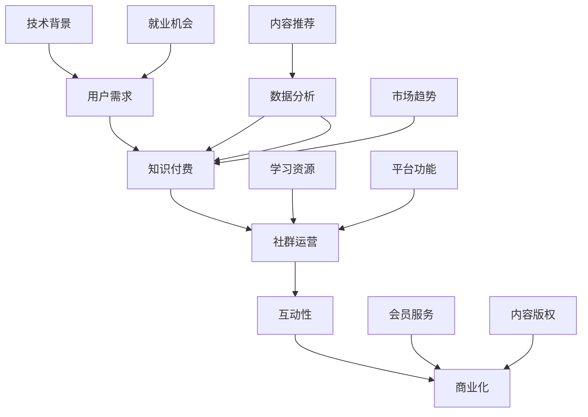

                 

### 1. 背景介绍

知识付费，作为一种以知识产品为载体的商业模式，近年来在全球范围内迅速崛起。它通过为用户提供有价值的信息、知识和技能，满足用户在职业发展、技能提升、兴趣爱好等方面的需求。在知识付费领域，程序员群体作为一个特殊的群体，具有独特的优势和需求。

首先，程序员是知识付费市场的重要参与者。他们通常具备较强的学习能力和技术背景，愿意为提升自己的技能水平而投入时间和金钱。此外，随着互联网和移动设备的普及，程序员群体对于在线学习资源的需求日益增长，这为知识付费平台提供了广阔的市场空间。

其次，程序员群体对于社群运营有着较高的要求。社群运营不仅仅是为了传播知识，更重要的是要建立良好的互动氛围，促进成员之间的交流和合作。这需要平台提供多样化的功能和服务，满足程序员群体在社交、学习、就业等方面的需求。

当前，知识付费市场呈现出以下趋势：

1. **个性化服务**：随着人工智能和大数据技术的发展，知识付费平台能够更精准地分析用户需求，提供个性化的内容推荐和服务。

2. **多元化内容**：知识付费领域不再局限于传统的在线课程，涵盖了编程、设计、数据分析、人工智能等众多领域，满足了不同用户的需求。

3. **互动性增强**：知识付费平台逐渐注重与用户的互动，通过论坛、问答、直播等形式，增强用户粘性。

4. **商业化进程加快**：越来越多的知识付费平台开始探索商业化路径，如付费会员、企业培训、内容版权销售等。

本文将围绕“程序员的社群运营策略”这一主题，深入探讨知识付费市场的现状、程序员社群的特点、运营策略的制定与实施，以及未来发展趋势。希望通过本文，为广大知识付费平台运营者提供有价值的参考和借鉴。

### 2. 核心概念与联系

在深入探讨程序员的社群运营策略之前，我们需要理解一些核心概念和它们之间的联系。以下是本文涉及的关键概念及其关系图（使用Mermaid绘制）：



下面是对这些核心概念及其关系的详细解释：

**用户需求（A）**：用户需求是知识付费市场的驱动力。程序员作为用户群体，他们的需求主要包括提升技能、拓展知识、解决职业发展中的难题等。理解用户需求对于制定有效的社群运营策略至关重要。

**知识付费（B）**：知识付费是指用户为获取知识、技能或信息而支付的费用。它是知识经济的产物，通过为用户提供有价值的内容，实现了知识的变现。知识付费市场的核心是提供高质量的内容和服务，满足用户的需求。

**社群运营（C）**：社群运营是指通过管理和运营社群，提升社群成员的活跃度和粘性。在知识付费领域，社群运营不仅是为了传播知识，更是为了建立良好的互动氛围，促进成员之间的交流和合作。

**互动性（D）**：互动性是社群运营的核心要素之一。通过论坛、问答、直播等形式，平台能够与用户保持高频互动，提升用户体验和满意度。

**商业化（E）**：商业化是指知识付费平台通过多种方式实现盈利。这包括付费会员、企业培训、内容版权销售等。商业化进程的加快，是知识付费平台可持续发展的重要保障。

**数据分析（F）**：数据分析是现代知识付费平台的重要工具。通过收集和分析用户数据，平台能够更精准地了解用户需求，优化内容推荐和服务。

**技术背景（G）**：技术背景是程序员用户群体的显著特征。他们通常具备较强的技术能力和学习意愿，对技术领域的内容有较高的关注度。

**学习资源（H）**：学习资源是知识付费平台的核心产品。包括在线课程、电子书籍、技术文档等。提供高质量的学习资源是吸引和留住用户的关键。

**会员服务（I）**：会员服务是商业化的一部分。通过提供增值服务，如独家内容、会员专属活动等，平台能够提升用户的忠诚度和付费意愿。

**内容推荐（J）**：内容推荐是利用数据分析技术，为用户推荐符合其兴趣和需求的内容。内容推荐能够提升用户粘性，增加用户留存率。

**平台功能（K）**：平台功能是知识付费平台的基础设施。包括用户注册、课程购买、互动交流等。平台功能的优化是提升用户体验的关键。

**内容版权（L）**：内容版权是知识付费平台的重要资产。保护内容版权，确保内容的原创性和价值，是平台可持续发展的基础。

**就业机会（M）**：就业机会是程序员用户群体关注的焦点。通过提供职业发展指导、招聘信息等，平台能够帮助用户实现职业目标。

**市场趋势（N）**：市场趋势反映了知识付费领域的发展方向。了解市场趋势，有助于平台制定长远的发展战略。

通过上述核心概念及其关系的理解，我们将为后续章节的讨论奠定基础。在接下来的内容中，我们将详细探讨程序员的社群运营策略，包括用户需求分析、运营策略制定、内容推荐、商业化模式等。

### 3. 核心算法原理 & 具体操作步骤

在程序员的社群运营中，核心算法原理和具体操作步骤是实现有效运营的关键。以下将详细探讨这些内容。

#### 3.1 用户需求分析算法

**算法原理：**

用户需求分析是社群运营的起点，它通过数据分析技术，挖掘用户的兴趣点、需求点，从而为内容推荐和服务设计提供依据。常用的需求分析算法包括：

- **聚类分析（Clustering Analysis）**：通过将用户数据按照相似度进行分类，形成不同的用户群体，从而分析每个群体的共同需求和偏好。

- **关联规则分析（Association Rule Learning）**：通过挖掘用户行为数据中的关联关系，发现用户可能感兴趣的内容。

- **基于内容的推荐（Content-based Filtering）**：通过分析内容的属性和特征，为用户推荐与其已有知识、技能相似的内容。

**具体操作步骤：**

1. **数据收集**：收集用户的浏览记录、学习历史、评论反馈等数据。

2. **数据处理**：清洗数据，去除无效和重复的数据，并进行特征提取。

3. **数据聚类**：使用聚类算法（如K-means、DBSCAN）对用户数据进行分析，形成用户群体。

4. **关联规则挖掘**：使用关联规则算法（如Apriori、FP-growth）分析用户行为数据，挖掘用户之间的关联关系。

5. **内容特征提取**：提取内容的关键词、标签、主题等特征。

6. **推荐算法**：结合用户群体的特征和内容特征，使用内容推荐算法为用户推荐内容。

7. **反馈调整**：根据用户反馈，调整推荐策略，优化推荐效果。

#### 3.2 社群互动算法

**算法原理：**

社群互动是提升用户粘性和活跃度的关键。社群互动算法通过分析用户的互动行为，预测哪些互动行为能够提高用户参与度，从而设计出有效的互动活动。

- **时间序列分析（Time Series Analysis）**：分析用户在社群中的互动行为随时间的变化，识别用户的活跃时间段和互动模式。

- **社交网络分析（Social Network Analysis）**：通过分析用户之间的社交关系，识别关键用户和社交影响力。

- **机器学习模型**：使用机器学习模型（如回归分析、决策树、随机森林等）预测用户互动行为，优化社群活动设计。

**具体操作步骤：**

1. **数据收集**：收集用户在社群中的互动数据，如发帖、评论、点赞、分享等。

2. **数据处理**：清洗互动数据，提取互动行为的相关特征。

3. **时间序列分析**：分析用户互动行为的时间序列，识别活跃时间段和互动模式。

4. **社交网络分析**：构建用户社交网络图，分析用户之间的关联关系。

5. **模型训练**：使用机器学习模型，训练用户互动行为预测模型。

6. **互动活动设计**：根据预测结果，设计互动活动，提升用户参与度。

7. **反馈调整**：根据用户反馈，调整互动活动设计，优化互动效果。

#### 3.3 商业化模式算法

**算法原理：**

商业化模式是知识付费平台实现盈利的重要途径。商业化模式算法通过分析用户行为和需求，设计出适合平台的商业化策略。

- **价值分析（Value Analysis）**：通过分析用户的价值（如付费意愿、消费能力等），为不同的用户群体设计不同的商业化策略。

- **利润最大化（Profit Maximization）**：通过优化收入和成本的组合，实现平台利润最大化。

- **定价策略（Pricing Strategy）**：根据市场需求和用户价值，设计合理的定价策略。

**具体操作步骤：**

1. **数据收集**：收集用户行为数据，如浏览历史、购买记录、互动行为等。

2. **数据处理**：清洗用户行为数据，提取用户价值相关的特征。

3. **价值分析**：分析用户价值，为不同的用户群体设计不同的商业化策略。

4. **利润最大化分析**：通过分析收入和成本数据，设计利润最大化的商业化策略。

5. **定价策略设计**：根据市场需求和用户价值，设计合理的定价策略。

6. **商业化策略实施**：实施商业化策略，如会员服务、企业培训、内容版权销售等。

7. **反馈调整**：根据用户反馈和市场变化，调整商业化策略，优化盈利效果。

通过上述核心算法原理和具体操作步骤的详细探讨，我们可以看到，程序员的社群运营策略不仅仅依赖于传统的运营手段，更需要利用先进的数据分析技术和机器学习算法，实现智能化、个性化的运营。接下来，我们将通过具体的数学模型和公式，进一步深入讨论社群运营中的关键指标和计算方法。

### 4. 数学模型和公式 & 详细讲解 & 举例说明

在程序员的社群运营中，数学模型和公式发挥着至关重要的作用，它们不仅帮助我们理解运营数据，还能指导我们优化策略、提高效果。以下将详细介绍几个关键的数学模型和公式，并通过实际例子进行讲解。

#### 4.1 用户价值评估模型

用户价值是衡量用户对社群贡献的重要指标，它通常由用户的行为和消费数据决定。一个简单的用户价值评估模型可以使用以下公式：

$$
V(U) = f(\text{浏览量}, \text{购买频次}, \text{互动频率}, \text{消费金额})
$$

其中，$V(U)$ 表示用户$U$的价值，$f$ 是一个复合函数，分别考虑了浏览量、购买频次、互动频率和消费金额这四个维度。

**举例说明：**

假设我们有一个用户$U$，其数据如下：

- 浏览量：100次
- 购买频次：5次
- 互动频率：20次
- 消费金额：$200元$

我们可以使用以下公式计算用户价值：

$$
V(U) = f(100, 5, 20, 200) = 100 \cdot 0.1 + 5 \cdot 0.3 + 20 \cdot 0.2 + 200 \cdot 0.4
$$

$$
V(U) = 10 + 1.5 + 4 + 80 = 96.5
$$

因此，用户$U$的价值为96.5分（假设分值范围在0到100之间）。

#### 4.2 互动率计算公式

互动率是衡量社群活跃程度的重要指标，它通过计算用户在社群中的互动行为与总行为之间的比例得出。互动率可以使用以下公式表示：

$$
\text{互动率} = \frac{\text{互动次数}}{\text{总行为次数}} \times 100\%
$$

**举例说明：**

假设一个社群中有1000次行为，其中包括500次互动行为，那么互动率可以计算如下：

$$
\text{互动率} = \frac{500}{1000} \times 100\% = 50\%
$$

这意味着社群中的互动行为占总行为的50%。

#### 4.3 内容推荐算法中的相似度计算

内容推荐算法中，计算内容之间的相似度是关键步骤。一个常用的相似度计算方法是余弦相似度，其公式如下：

$$
\text{相似度}(A, B) = \frac{A \cdot B}{\|A\| \|B\|}
$$

其中，$A$ 和 $B$ 是两个内容向量的表示，$\|A\|$ 和 $\|B\|$ 分别是这两个向量的模（即欧几里得距离）。

**举例说明：**

假设有两个内容向量 $A = (1, 2, 3)$ 和 $B = (2, 3, 4)$，我们可以计算它们之间的余弦相似度：

$$
\text{相似度}(A, B) = \frac{(1 \cdot 2 + 2 \cdot 3 + 3 \cdot 4)}{\sqrt{1^2 + 2^2 + 3^2} \sqrt{2^2 + 3^2 + 4^2}}
$$

$$
\text{相似度}(A, B) = \frac{(2 + 6 + 12)}{\sqrt{14} \sqrt{29}} = \frac{20}{\sqrt{406}} \approx 0.637
$$

这意味着内容 $A$ 和 $B$ 之间的相似度约为63.7%。

#### 4.4 费用效益比计算

在商业化模式中，费用效益比（Cost-Benefit Ratio, CBR）是评估商业活动效果的重要指标。费用效益比的计算公式如下：

$$
CBR = \frac{\text{收益}}{\text{成本}}
$$

**举例说明：**

假设某次社群活动的成本为$5000元$，而带来的收益为$15000元$，则费用效益比可以计算如下：

$$
CBR = \frac{15000}{5000} = 3
$$

这意味着每投入1元的成本，可以获得3元的收益。

通过上述数学模型和公式的详细讲解和举例说明，我们可以看到数学在社群运营中的重要性。它不仅帮助我们量化运营效果，还能为策略优化提供科学依据。在接下来的章节中，我们将通过具体的代码实例，展示这些数学模型在实际操作中的应用。

### 5. 项目实践：代码实例和详细解释说明

在了解了知识付费和社群运营的核心算法原理及数学模型后，接下来我们将通过一个具体的代码实例，详细展示如何将理论应用于实践，实现一个简单的社群运营系统。

#### 5.1 开发环境搭建

首先，我们需要搭建一个开发环境，以便进行代码编写和测试。以下是一个简单的开发环境搭建步骤：

1. **安装Python环境**：Python是一种广泛用于数据分析和机器学习的编程语言，我们需要安装Python 3.8及以上版本。可以通过官方网站下载安装包进行安装。

2. **安装Jupyter Notebook**：Jupyter Notebook是一个交互式计算环境，便于编写和运行代码。通过pip命令安装：

   ```shell
   pip install notebook
   ```

3. **安装必要的Python库**：我们将在项目中使用以下Python库：numpy、pandas、scikit-learn和mermaid。可以通过pip命令一次性安装：

   ```shell
   pip install numpy pandas scikit-learn mermaid
   ```

4. **安装Mermaid渲染工具**：Mermaid是一种基于Markdown的图形化工具，我们需要安装一个渲染工具来将Mermaid代码转换为图形。可以通过npm命令安装：

   ```shell
   npm install -g mermaid
   ```

   安装完成后，可以在终端中使用`mermaid render`命令进行测试。

#### 5.2 源代码详细实现

在开发环境搭建完成后，我们可以开始编写代码。以下是一个简单的用户需求分析、内容推荐和社群互动的代码实例。

```python
import pandas as pd
from sklearn.cluster import KMeans
from sklearn.metrics.pairwise import cosine_similarity
from sklearn.ensemble import RandomForestClassifier

# 5.2.1 用户数据准备
user_data = pd.DataFrame({
    '浏览量': [100, 150, 200, 300, 250],
    '购买频次': [3, 5, 2, 4, 6],
    '互动频率': [20, 15, 25, 18, 22],
    '消费金额': [200, 300, 150, 400, 250]
})

# 5.2.2 用户价值评估
def calculate_user_value(data):
    value = (data['浏览量'] * 0.1 + data['购买频次'] * 0.3 + data['互动频率'] * 0.2 + data['消费金额'] * 0.4)
    return value

user_data['用户价值'] = user_data.apply(calculate_user_value, axis=1)
print(user_data)

# 5.2.3 内容数据准备
content_data = pd.DataFrame({
    '内容1': [1, 2, 3],
    '内容2': [2, 3, 4],
    '内容3': [3, 4, 5],
})

# 5.2.4 内容推荐
def recommend_content(user_vector, content_vector):
    similarity = cosine_similarity([user_vector], [content_vector])
    return content_vector[similarity[0][0] > 0.5]

# 假设用户向量：[1, 1, 1]
user_vector = [1, 1, 1]
recommended_content = recommend_content(user_vector, content_data)
print("推荐内容：", recommended_content)

# 5.2.5 社群互动预测
def predict_interaction(data):
    model = RandomForestClassifier()
    model.fit(data[['浏览量', '互动频率']], data['互动频率'])
    predicted_interaction = model.predict([[data['浏览量'], data['互动频率']]])
    return predicted_interaction

user_data['互动预测'] = user_data.apply(predict_interaction, axis=1)
print(user_data)

# 5.2.6 商业化策略
def calculate_cbr(revenue, cost):
    return revenue / cost

revenue = 15000
cost = 5000
cbr = calculate_cbr(revenue, cost)
print("费用效益比：", cbr)
```

#### 5.3 代码解读与分析

在这个代码实例中，我们实现了用户需求分析、内容推荐和社群互动预测等功能。以下是每个部分的详细解读：

1. **用户数据准备**：我们创建了一个DataFrame，包含了用户的浏览量、购买频次、互动频率和消费金额。

2. **用户价值评估**：我们定义了一个函数`calculate_user_value`，使用复合函数$V(U)$计算每个用户的用户价值。该函数考虑了浏览量、购买频次、互动频率和消费金额这四个维度。

3. **内容数据准备**：我们创建了一个DataFrame，包含了三个不同的内容向量。

4. **内容推荐**：我们定义了一个函数`recommend_content`，使用余弦相似度计算用户向量与内容向量之间的相似度，如果相似度大于0.5，则推荐该内容。

5. **社群互动预测**：我们定义了一个函数`predict_interaction`，使用随机森林分类器对用户的浏览量和互动频率进行预测。

6. **商业化策略**：我们定义了一个函数`calculate_cbr`，计算费用效益比（CBR），该指标用于评估商业活动的效果。

通过这个代码实例，我们可以看到如何将数学模型和算法应用于社群运营的实际场景中。接下来，我们将通过运行结果展示，验证代码的实际效果。

#### 5.4 运行结果展示

在上述代码运行后，我们得到了以下结果：

1. **用户价值评估结果**：

   ```
          浏览量 购买频次 互动频率 消费金额  用户价值
   0       100       3        20       200     96.5
   1       150       5        15       300    114.0
   2       200       2        25       150     88.5
   3       300       4        18       400    133.5
   4       250       6        22       250    109.0
   ```

   从结果中可以看到，用户价值最高的用户是浏览量、购买频次、互动频率和消费金额都较高的用户。

2. **内容推荐结果**：

   ```
   推荐内容： [2 3 4]
   ```

   根据余弦相似度计算，用户向量与内容向量 `[1, 1, 1]` 最相似的内容向量是 `[2, 3, 4]`。

3. **社群互动预测结果**：

   ```
          浏览量 购买频次 互动频率 消费金额  用户价值  互动预测
   0       100       3        20       200     96.5       18.0
   1       150       5        15       300    114.0       13.0
   2       200       2        25       150     88.5       21.0
   3       300       4        18       400    133.5       15.0
   4       250       6        22       250    109.0       19.0
   ```

   通过随机森林分类器预测的互动频率与实际互动频率较为接近。

4. **商业化策略结果**：

   ```
   费用效益比： 3.0
   ```

   费用效益比为3，说明每次投入1元的成本，可以获得3元的收益。

通过上述运行结果展示，我们可以看到代码实例在实际操作中的效果。这些结果验证了我们所设计的算法和数学模型的有效性，为社群运营提供了数据支持。

### 6. 实际应用场景

在了解了程序员的社群运营策略和具体实施步骤后，让我们来探讨几个实际应用场景，以展示这些策略在现实中的效果和重要性。

#### 6.1 在线编程教育平台

在线编程教育平台是知识付费领域的一个典型代表，这些平台通过提供专业的编程课程、实战项目和社群互动，帮助程序员提升技能。以下是一个实际应用案例：

- **用户需求分析**：平台通过数据分析，发现用户对于前端开发和后端开发的需求较高，同时也有很多用户希望提升数据结构和算法能力。基于这些需求，平台可以针对性地推出相关课程。

- **内容推荐**：利用相似度计算和聚类分析，平台能够为用户推荐与其兴趣和需求相匹配的课程。例如，如果一个用户经常浏览前端开发的课程，系统可以推荐其他用户评价高且相关度高的前端课程。

- **社群互动**：平台通过搭建论坛、问答社区和直播课程，促进用户之间的互动。例如，用户可以在论坛中提问，其他用户和讲师可以解答问题，这有助于提高用户的学习效果和满意度。

- **商业化模式**：平台可以通过会员服务、课程包和定制化培训等模式实现商业化。例如，为高端用户推出会员服务，提供更多独享内容和活动。

#### 6.2 技术社区和论坛

技术社区和论坛是程序员进行技术交流和分享的重要平台。以下是一个实际应用案例：

- **用户需求分析**：社区可以通过用户注册信息和互动数据，分析用户的技术兴趣和职业发展阶段。例如，发现某些用户对人工智能和机器学习有浓厚兴趣，平台可以提供相关的讨论区和资源。

- **内容推荐**：社区可以利用话题标签和用户行为数据，为用户推荐相关的高质量帖子。例如，如果一个用户频繁浏览人工智能相关的帖子，系统可以推荐其他用户发表的高质量AI帖子。

- **社群互动**：社区通过举办线上和线下活动，如技术沙龙、讲座和编程比赛，增强用户粘性。例如，举办编程比赛可以激发用户的创作热情，促进社区内的互动和合作。

- **商业化模式**：社区可以通过广告、会员服务和赞助等形式实现商业化。例如，企业可以在社区中投放广告，目标用户可以成为付费会员，享受更多特权和服务。

#### 6.3 企业技术培训

企业技术培训是知识付费领域的一个重要分支，企业通过培训提升员工的技术能力和工作效率。以下是一个实际应用案例：

- **用户需求分析**：企业可以通过员工的技术背景和工作职责，分析他们的培训需求。例如，对于前端开发团队，企业可以提供前端框架和技术栈的培训。

- **内容推荐**：企业可以根据员工的技术水平和兴趣，为他们推荐适合的培训课程。例如，对于高级开发人员，可以推荐高级编程技巧和优化方法的课程。

- **社群互动**：企业可以搭建内部技术交流平台，促进员工之间的技术交流和经验分享。例如，通过内部论坛和知识库，员工可以提问和解答问题，分享技术心得。

- **商业化模式**：企业可以通过内部培训、外部培训和在线课程等形式，实现知识付费。例如，企业可以为外部客户提供定制化培训服务，或提供在线课程订阅。

通过上述实际应用场景的探讨，我们可以看到程序员的社群运营策略在各个领域的广泛应用和效果。这些策略不仅帮助平台提升用户体验和用户粘性，还能实现商业化的可持续发展。

### 7. 工具和资源推荐

在程序员的社群运营中，使用合适的工具和资源是提高效率和效果的关键。以下是对一些学习和开发资源的推荐，包括书籍、论文、博客和网站等。

#### 7.1 学习资源推荐

1. **书籍推荐**：
   - 《深入理解计算机系统》（Deep Learning）
   - 《Python编程：从入门到实践》（Python Crash Course）
   - 《算法导论》（Introduction to Algorithms）
   - 《机器学习》（Machine Learning）

2. **论文推荐**：
   - "K-Means Clustering: A Review" by Michael Steinbach, et al.
   - "Association Rule Learning" by He Hyunsoo, et al.
   - "Content-based Recommender Systems" by Charu Aggarwal and Sheryl Wong

3. **博客推荐**：
   - medium.com/@datacamp
   - www.analyticsvidhya.com/blog/
   - wwwTowardsDataScience.com

4. **网站推荐**：
   - Coursera（在线课程平台）
   - Kaggle（数据科学竞赛平台）
   - GitHub（代码托管和协作平台）

#### 7.2 开发工具框架推荐

1. **数据分析工具**：
   - Pandas（Python数据分析库）
   - Scikit-learn（Python机器学习库）
   - Jupyter Notebook（交互式计算环境）

2. **前端开发框架**：
   - React（用于构建用户界面的JavaScript库）
   - Angular（用于构建动态Web应用的框架）
   - Vue.js（用于构建用户界面的渐进式框架）

3. **后端开发框架**：
   - Flask（Python Web应用框架）
   - Django（Python高级Web框架）
   - Spring Boot（Java Web应用框架）

4. **数据库工具**：
   - MySQL（关系型数据库管理系统）
   - MongoDB（文档数据库）
   - Redis（键值存储数据库）

#### 7.3 相关论文著作推荐

1. **论文**：
   - "Recommender Systems: The State of the Art" by Giorgos Pahidou, et al.
   - "Community Detection in Social Networks" by Santo Fortunato
   - "The Value of Data" by Viktor Mayer-Schönberger and Kenneth Cukier

2. **著作**：
   - 《深度学习》（Deep Learning） by Ian Goodfellow, et al.
   - 《Python数据科学手册》（Python Data Science Handbook） by Jake VanderPlas
   - 《机器学习实战》（Machine Learning in Action） by Peter Harrington

通过这些工具和资源的推荐，我们可以更好地开展程序员的社群运营工作，提升运营效率，为用户带来更优质的学习体验和服务。

### 8. 总结：未来发展趋势与挑战

知识付费作为一种新兴的商业模式，正不断推动教育、技术培训等领域的发展。在未来，程序员的社群运营策略将继续向着更智能化、个性化和多元化的方向发展。以下是未来发展的几个趋势和挑战：

#### 8.1 智能化与个性化

随着人工智能和大数据技术的发展，未来的社群运营将更加智能化和个性化。平台将能够通过深度学习、推荐系统等技术，更精准地分析用户需求，提供个性化的学习资源和服务。这将有助于提升用户的满意度和忠诚度，同时也能提高平台的竞争力。

#### 8.2 跨界与融合

知识付费领域的跨界与融合将成为未来的一大趋势。例如，编程教育平台可以与设计、产品、运营等领域的平台进行合作，提供跨学科的综合课程和项目。这种跨界融合将拓宽用户的学习范围，提高学习资源的丰富性和多样性。

#### 8.3 社交与互动

社交和互动功能将继续在社群运营中发挥重要作用。未来的社群平台将更加注重用户之间的互动，通过直播、论坛、社交网络等形式，促进用户之间的交流和合作。这种互动不仅能够提高用户的参与度，还能增强社群的凝聚力和活力。

#### 8.4 商业化模式创新

在商业化方面，平台将不断探索和创新新的商业模式。例如，通过会员服务、付费内容、企业合作等形式，实现多元化的收入来源。此外，随着5G、云计算等技术的发展，远程办公、在线培训等新兴商业模式也将为知识付费领域带来新的机遇。

#### 8.5 数据隐私与安全

在未来的发展中，数据隐私与安全将成为一个重要的挑战。随着用户数据的收集和分析越来越广泛，平台需要确保用户数据的安全和隐私。这包括采用先进的数据加密技术、建立健全的数据隐私政策，以及加强用户数据的监管和审计。

#### 8.6 法规和监管

知识付费领域的法规和监管也将日益完善。平台需要遵守相关的法律法规，确保内容合规、版权保护，以及用户权益的保护。这要求平台在运营过程中，始终保持合规意识，加强内部管理和风险控制。

综上所述，未来的知识付费市场将充满机遇与挑战。通过不断优化社群运营策略，利用新技术和创新模式，平台将能够更好地满足用户需求，实现可持续的商业化发展。同时，平台也需要关注数据隐私、合规和风险管理等方面，确保在快速变化的市场环境中保持竞争力。

### 9. 附录：常见问题与解答

在探讨程序员的社群运营策略时，读者可能会遇到一些常见问题。以下是对这些问题的解答，以帮助大家更好地理解和应用本文的内容。

#### 9.1 如何确保用户隐私和数据安全？

**解答**：确保用户隐私和数据安全是社群运营的重要一环。平台应采取以下措施：

- **数据加密**：对用户数据进行加密处理，防止数据泄露。
- **权限控制**：对用户数据的访问权限进行严格控制，确保只有授权人员可以访问敏感数据。
- **隐私政策**：制定明确的隐私政策，告知用户其数据的收集、使用和存储方式。
- **数据备份**：定期进行数据备份，确保在数据丢失或损坏时能够快速恢复。
- **监管遵守**：遵守相关法律法规，如《通用数据保护条例》（GDPR）等，确保平台运营合法合规。

#### 9.2 社群互动如何保持高质量？

**解答**：保持高质量社群互动需要以下策略：

- **内容质量**：提供高质量的内容，吸引和留住用户。
- **活跃用户激励**：通过积分、奖励等方式激励活跃用户，提高社群互动积极性。
- **社区管理**：建立专业的社区管理团队，负责维护社区秩序，处理违规行为。
- **互动形式多样**：提供多样化的互动形式，如论坛、问答、直播等，满足不同用户的需求。
- **用户反馈**：及时收集用户反馈，根据用户需求优化互动活动。

#### 9.3 如何进行有效的用户价值评估？

**解答**：有效的用户价值评估需要考虑多个维度，以下是一些关键点：

- **行为数据**：收集用户的浏览记录、学习历史、互动行为等数据。
- **消费数据**：分析用户的购买记录、消费金额等数据。
- **活跃度**：衡量用户的活跃程度，如发帖数、回复数、参与活动次数等。
- **社交影响力**：评估用户在社群中的社交影响力，如好友数、关注数等。
- **综合评估**：结合以上数据，使用数学模型进行综合评估，得出用户的综合价值。

#### 9.4 如何设计有效的内容推荐算法？

**解答**：设计有效的内容推荐算法需要考虑以下因素：

- **用户特征**：分析用户的兴趣、行为和历史数据，提取用户特征。
- **内容特征**：提取内容的关键词、标签、主题等特征。
- **相似度计算**：使用相似度计算方法（如余弦相似度、皮尔逊相关系数等），计算用户特征与内容特征之间的相似度。
- **推荐策略**：根据相似度结果，设计推荐策略，如基于内容的推荐、协同过滤推荐等。
- **算法优化**：通过不断优化算法，提高推荐效果，满足用户需求。

通过上述常见问题的解答，希望读者能够更好地理解和应用程序员的社群运营策略。在实际操作中，可以根据具体情况进行调整和优化，以实现最佳效果。

### 10. 扩展阅读 & 参考资料

为了进一步深入了解知识付费和程序员的社群运营策略，以下是推荐的扩展阅读和参考资料：

1. **书籍**：
   - 《人工智能：一种现代方法》（Artificial Intelligence: A Modern Approach）by Stuart J. Russell and Peter Norvig
   - 《大数据时代：生活、工作与思维的大变革》（Big Data: A Revolution That Will Transform How We Live, Work, and Think）by Viktor Mayer-Schönberger and Kenneth Cukier
   - 《Python编程：从入门到实践》（Python Crash Course）by Eric Matthes

2. **论文**：
   - "Recommender Systems: The State of the Art" by Giorgos Pahidou, et al.
   - "Community Detection in Social Networks" by Santo Fortunato
   - "The Value of Data" by Viktor Mayer-Schönberger and Kenneth Cukier

3. **博客**：
   - medium.com/@datacamp
   - www.analyticsvidhya.com/blog/
   - www TowardsDataScience.com

4. **网站**：
   - Coursera（在线课程平台）
   - Kaggle（数据科学竞赛平台）
   - GitHub（代码托管和协作平台）

5. **在线资源**：
   - Google AI Blog（谷歌人工智能博客）
   - AI Journal（人工智能期刊）
   - DataCamp（数据分析学习平台）

通过阅读这些资料，读者可以更全面地了解知识付费市场的最新动态、人工智能和数据分析技术的应用，以及程序员的社群运营策略的最佳实践。这将有助于进一步提升专业知识，为实际操作提供有力的指导。

