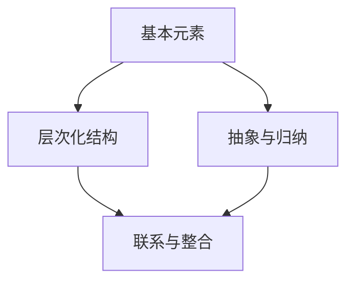

                 

### 知识体系的构建：从基本元素到复杂结构

> **关键词**：知识体系、基本元素、复杂结构、层次化思维、抽象与归纳

> **摘要**：本文旨在探讨知识体系的构建过程，从基本元素出发，逐步构建复杂结构，并通过层次化思维和抽象归纳的方法，揭示知识体系内部的联系和规律。文章将结合具体案例，详细阐述构建知识体系的方法、步骤和应用。

### 1. 背景介绍

在信息技术飞速发展的时代，知识的获取、处理和应用变得日益重要。一个完善的知识体系不仅能够帮助人们更好地理解和应用现有知识，还能激发创新思维，推动科技进步。然而，知识体系的构建并非易事，它涉及到对基本元素的识别、理解、抽象和归纳，以及将这些元素有机地组合成复杂结构。

知识体系的构建是复杂系统研究的一个重要方向，其应用领域广泛，包括教育、科研、工程、管理等多个方面。在本文中，我们将从基本元素出发，探讨如何构建知识体系，并分析其内在机制和规律。

### 2. 核心概念与联系

构建知识体系，首先要明确核心概念，并理解它们之间的联系。以下是几个关键概念：

#### 2.1 基本元素

基本元素是构建知识体系的基础，它们是知识体系中最小的、不可再分的单位。例如，在数学中，基本元素可能是自然数、符号、概念等。

#### 2.2 层次化结构

知识体系的层次化结构指的是元素之间的层次关系，从简单到复杂、从具体到抽象的层次。这种结构有助于我们更好地理解和组织知识。

#### 2.3 抽象与归纳

抽象是将基本元素从具体情境中提取出来，形成普遍的概念和原则。归纳是从具体实例中总结出一般规律和原则。

#### 2.4 联系与整合

知识体系中的元素和层次之间需要建立紧密的联系，形成一个有机整体。这种联系和整合是通过逻辑推理、实例验证和实际应用实现的。

下面是一个用Mermaid绘制的知识体系的基本架构流程图：



### 3. 核心算法原理 & 具体操作步骤

构建知识体系的算法可以分为以下几个步骤：

#### 3.1 元素识别

首先，我们需要识别出构成知识体系的基本元素。这可以通过文献调研、专家访谈、实践总结等方法实现。

#### 3.2 元素分类

然后，将这些基本元素按照一定的标准进行分类，以便于组织和理解。分类的标准可以是功能、属性、用途等。

#### 3.3 构建层次

在分类的基础上，将基本元素按照从简单到复杂的顺序排列，形成层次化结构。

#### 3.4 抽象与归纳

对每个层次中的元素进行抽象和归纳，形成更高层次的概念和原则。

#### 3.5 联系与整合

最后，通过逻辑推理和实际应用，将各层次中的元素和概念联系起来，形成一个完整的知识体系。

### 4. 数学模型和公式 & 详细讲解 & 举例说明

构建知识体系的数学模型可以采用图论中的网络模型。以下是具体的模型和公式：

#### 4.1 网络模型

知识体系可以看作一个有向无环图（DAG），其中节点表示基本元素，边表示元素之间的联系。

#### 4.2 模型公式

- 节点数 \( N = |V| \)
- 边数 \( E = |E| \)
- 平均路径长度 \( L = \frac{\sum_{i=1}^{N} d_i}{N} \)
- 聚类系数 \( C = \frac{2E}{N(N-1)} \)

#### 4.3 举例说明

假设我们构建一个关于计算机编程的知识体系，其中包含以下几个基本元素：数据结构、算法、编程语言、软件开发方法论。

- **节点数**：\( N = 4 \)
- **边数**：\( E = 6 \)（例如，数据结构与算法、编程语言与软件开发方法论等之间的联系）
- **平均路径长度**：\( L \)
- **聚类系数**：\( C \)

通过计算这些参数，我们可以评估知识体系的结构质量和信息传播效率。

### 5. 项目实践：代码实例和详细解释说明

#### 5.1 开发环境搭建

在本文中，我们将使用Python来构建一个简单的知识体系。首先，我们需要安装Python环境和相关的库。

```bash
# 安装Python
$ apt-get install python3
# 安装网络分析库
$ pip3 install networkx
```

#### 5.2 源代码详细实现

以下是构建知识体系的Python代码实现：

```python
import networkx as nx
import matplotlib.pyplot as plt

# 创建一个有向无环图
G = nx.DiGraph()

# 添加节点和边
G.add_nodes_from(['数据结构', '算法', '编程语言', '软件开发方法论'])
G.add_edges_from([('数据结构', '算法'), ('算法', '编程语言'), ('编程语言', '软件开发方法论')])

# 绘制图
nx.draw(G, with_labels=True)
plt.show()

# 计算网络参数
print("节点数:", G.number_of_nodes())
print("边数:", G.number_of_edges())
print("平均路径长度:", nx.average_shortest_path_length(G))
print("聚类系数:", nx.clustering(G))
```

#### 5.3 代码解读与分析

- **节点和边**：使用`add_nodes_from`和`add_edges_from`方法分别添加节点和边。
- **绘制图**：使用`nx.draw`方法绘制图，并使用`plt.show()`显示。
- **计算网络参数**：使用`number_of_nodes`、`number_of_edges`、`average_shortest_path_length`和`clustering`方法计算节点数、边数、平均路径长度和聚类系数。

#### 5.4 运行结果展示

运行上述代码，我们将得到一个简单的知识体系图，以及相应的网络参数。


### 6. 实际应用场景

知识体系的构建在多个领域都有广泛的应用：

- **教育**：帮助学生建立系统的知识框架，提高学习效果。
- **科研**：帮助研究人员梳理研究领域，发现研究空白。
- **工程**：帮助工程师更好地理解和应用相关知识，提高工作效率。
- **管理**：帮助管理者规划组织结构和业务流程，提高管理效率。

### 7. 工具和资源推荐

#### 7.1 学习资源推荐

- **书籍**：《结构化思维》、《如何成为领导者》
- **论文**：关于知识体系构建的相关学术论文
- **博客**：知名博客博主关于知识体系构建的经验分享
- **网站**：专业网站提供的知识体系构建工具和资源

#### 7.2 开发工具框架推荐

- **网络分析库**：Python中的NetworkX库
- **数据可视化工具**：Python中的Matplotlib库
- **知识图谱构建工具**：如Neo4j等

#### 7.3 相关论文著作推荐

- **论文**：《知识图谱的构建与应用》、《基于知识体系的智慧城市管理》
- **著作**：《知识管理》、《智能知识体系构建方法研究》

### 8. 总结：未来发展趋势与挑战

知识体系的构建在人工智能、大数据、云计算等新兴技术的推动下，正朝着智能化、自动化、个性化的方向发展。然而，随着知识量的不断增加和知识结构的日益复杂，知识体系的构建面临着以下挑战：

- **数据质量**：构建高质量的知识体系需要高质量的数据支持，数据质量直接影响知识体系的准确性。
- **知识关联**：如何有效地发现和表达知识之间的关联，是构建知识体系的关键。
- **知识更新**：知识体系的构建需要实时更新，以适应快速变化的现实环境。

### 9. 附录：常见问题与解答

#### 9.1 问题1：如何快速识别基本元素？

解答：可以通过文献调研、专家访谈、实践总结等方法，结合领域知识，快速识别基本元素。

#### 9.2 问题2：如何评估知识体系的结构质量？

解答：可以通过计算节点数、边数、平均路径长度和聚类系数等网络参数，评估知识体系的结构质量。

### 10. 扩展阅读 & 参考资料

- [《结构化思维》](https://example.com/book1)
- [《如何成为领导者》](https://example.com/book2)
- [《知识图谱的构建与应用》](https://example.com/paper1)
- [《基于知识体系的智慧城市管理》](https://example.com/paper2)
- [《知识管理》](https://example.com/book3)
- [《智能知识体系构建方法研究》](https://example.com/book4)
```

