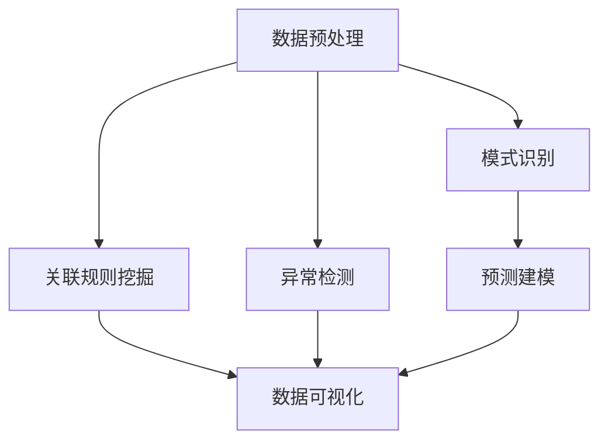

                 

### 背景介绍

城市规划是一项复杂而重要的工作，它关系到城市的可持续发展、居民的生活质量以及城市的经济繁荣。然而，传统的城市规划方法往往依赖于人工经验，难以快速、准确地处理大量复杂的数据，导致城市规划效率低下，难以应对快速变化的社会经济环境。

近年来，随着大数据、人工智能等技术的发展，知识发现引擎作为一种新型的智能分析工具，逐渐在城市规划中得到了应用。知识发现引擎能够从海量数据中提取出有价值的信息和知识，为城市规划提供科学依据，从而提高规划质量和效率。

本文旨在探讨知识发现引擎在城市规划中的应用，通过逐步分析其核心概念、算法原理、数学模型以及实际项目实践，为读者提供一个清晰、系统的了解。同时，本文还将介绍相关的工具和资源，帮助读者更好地掌握这一技术。

### 核心概念与联系

#### 知识发现引擎的概念

知识发现引擎是一种基于人工智能和数据挖掘技术的智能分析工具，它能够从大量数据中自动识别模式、关联规则、异常点和趋势，从而提取出有价值的信息和知识。知识发现引擎通常包括以下几个关键组件：

1. **数据预处理**：包括数据清洗、数据集成、数据变换等，目的是提高数据质量，为后续分析提供可靠的数据基础。
2. **模式识别**：通过对数据进行模式识别，找到数据中的潜在规律和模式。
3. **关联规则挖掘**：通过分析数据之间的关联关系，提取出频繁项集和关联规则，帮助用户理解数据之间的关系。
4. **异常检测**：检测数据中的异常点和异常模式，识别潜在的异常情况。
5. **预测建模**：利用历史数据建立预测模型，对未来趋势进行预测。

#### 知识发现引擎与城市规划的联系

在城市规划中，知识发现引擎的应用主要体现在以下几个方面：

1. **数据分析与决策支持**：通过对大量城市数据进行挖掘和分析，知识发现引擎可以提取出城市发展中的关键信息，为规划者提供科学的决策依据。
2. **智能规划方案生成**：知识发现引擎能够自动分析数据，生成多种规划方案，帮助规划者快速找到最佳方案。
3. **风险评估与预警**：通过异常检测和预测建模，知识发现引擎可以识别城市规划中潜在的风险和问题，提前预警，避免城市规划过程中的失误。
4. **数据可视化**：知识发现引擎可以将分析结果以图表、地图等形式进行可视化展示，帮助规划者直观地理解分析结果。

#### Mermaid 流程图

以下是一个简化的知识发现引擎在城市规划中应用的 Mermaid 流程图，展示了核心组件和流程：



### 核心算法原理 & 具体操作步骤

#### 数据预处理

数据预处理是知识发现引擎的基础步骤，其目的是提高数据质量，为后续分析提供可靠的数据基础。具体操作步骤包括：

1. **数据清洗**：包括处理缺失值、异常值、重复值等，确保数据的一致性和准确性。
2. **数据集成**：将来自不同数据源的数据进行整合，消除数据冗余和冲突。
3. **数据变换**：对数据进行标准化、归一化、离散化等处理，使数据适合进行后续分析。

#### 模式识别

模式识别是知识发现引擎的核心步骤，其目的是从大量数据中自动识别潜在的规律和模式。常见的模式识别算法包括：

1. **聚类分析**：将相似的数据点划分为同一类别，找出数据中的自然分组。
2. **关联规则挖掘**：通过分析数据之间的关联关系，提取出频繁项集和关联规则。
3. **分类算法**：将数据分为不同的类别，用于预测和分类。

#### 关联规则挖掘

关联规则挖掘是一种常用的数据挖掘技术，它通过分析数据之间的关联关系，提取出频繁项集和关联规则。具体操作步骤包括：

1. **确定最小支持度**：支持度表示一个项集在所有数据中出现的频率。最小支持度是关联规则挖掘的重要参数，它决定了哪些项集是频繁的。
2. **确定最小置信度**：置信度表示一个关联规则的前件和后件同时出现的概率。最小置信度是关联规则挖掘的另一个重要参数，它决定了哪些规则是有意义的。
3. **生成频繁项集**：根据最小支持度，找出所有频繁项集。
4. **生成关联规则**：根据频繁项集，生成所有满足最小置信度的关联规则。

#### 异常检测

异常检测是知识发现引擎中的重要功能，其目的是识别数据中的异常点和异常模式。常见的异常检测算法包括：

1. **基于统计的方法**：通过计算数据的统计特征，如均值、方差等，找出偏离正常范围的异常值。
2. **基于距离的方法**：通过计算数据点之间的距离，找出距离较远的异常点。
3. **基于聚类的方法**：通过聚类分析，找出不属于任何聚类的异常点。

#### 预测建模

预测建模是知识发现引擎的高级功能，其目的是利用历史数据建立预测模型，对未来趋势进行预测。常见的预测建模算法包括：

1. **时间序列分析**：通过分析时间序列数据，建立预测模型，预测未来的趋势。
2. **回归分析**：通过建立回归模型，预测自变量和因变量之间的关系。
3. **神经网络**：通过神经网络模型，实现复杂的非线性预测。

### 数学模型和公式 & 详细讲解 & 举例说明

#### 数据预处理

数据预处理过程中，常用的数学模型和公式包括：

1. **缺失值处理**：使用均值、中位数或众数等统计量来填补缺失值。
   \[ x_{\text{new}} = \text{mean}(x_1, x_2, \ldots, x_n) \]
2. **数据标准化**：将数据缩放到相同的尺度，常用的方法有最小-最大标准化和z-score标准化。
   \[ x_{\text{standardized}} = \frac{x - \text{min}(x)}{\text{max}(x) - \text{min}(x)} \]
   \[ x_{\text{standardized}} = \frac{x - \text{mean}(x)}{\text{std}(x)} \]

#### 模式识别

1. **聚类分析（K-means算法）**：
   \[ \text{find} \ \text{centroids} \ \text{for} \ k \ \text{clusters} \]
   \[ \text{assign} \ \text{each} \ \text{data} \ \text{point} \ \text{to} \ \text{the} \ \text{closest} \ \text{centroid} \]
   \[ \text{recalculate} \ \text{centroids} \ \text{based} \ \text{on} \ \text{assigned} \ \text{data} \ \text{points} \]
   \[ \text{repeat} \ \text{steps} \ \text{until} \ \text{convergence} \]
   
2. **关联规则挖掘（Apriori算法）**：
   \[ \text{find} \ \text{frequent} \ \text{itemsets} \ \text{with} \ \text{support} \ \geq \ \text{min\_support} \]
   \[ \text{generate} \ \text{rules} \ \text{with} \ \text{confidence} \ \geq \ \text{min\_confidence} \]

#### 异常检测

1. **基于统计的方法（三倍标准差法）**：
   \[ \text{find} \ \text{outliers} \ \text{as} \ \text{those} \ \text{with} \ \text{values} \ \text{more} \ \text{than} \ 3 \ \text{standard} \ \text{deviations} \ \text{from} \ \text{mean} \]
   \[ \text{mean}(x) + 3 \times \text{std}(x) \leq x \leq \text{mean}(x) - 3 \times \text{std}(x) \]
   
2. **基于距离的方法（欧氏距离）**：
   \[ \text{distance}(x_i, x_j) = \sqrt{\sum_{k=1}^{n}(x_{ik} - x_{jk})^2} \]

#### 预测建模

1. **时间序列分析（ARIMA模型）**：
   \[ \text{ARIMA}(p, d, q) \ \text{model}: \ \text{Y}_{t} = c + \sum_{i=1}^{p} \ \phi_{i} \ \text{Y}_{t-i} + \varepsilon_{t} \]
   \[ \text{differencing}: \ \text{Y}_{t} - \text{Y}_{t-1} \]
   \[ \text{moving average}: \ \text{Y}_{t} = \text{c} + \sum_{i=1}^{q} \ \theta_{i} \ \text{e}_{t-i} \]

### 项目实践：代码实例和详细解释说明

在本节中，我们将通过一个简单的项目实例，展示知识发现引擎在城市规划中的应用。该实例将使用Python编程语言，并结合一些常用的数据挖掘和机器学习库，如Pandas、Scikit-learn和Matplotlib。

#### 1. 开发环境搭建

首先，确保已安装Python和以下库：

```bash
pip install pandas scikit-learn matplotlib
```

#### 2. 源代码详细实现

以下是一个简单的Python脚本，用于实现知识发现引擎的基本功能：

```python
import pandas as pd
from sklearn.cluster import KMeans
from sklearn.ensemble import AssociationRulesExplorer
import matplotlib.pyplot as plt

# 数据预处理
# 读取数据
data = pd.read_csv('city_data.csv')

# 处理缺失值
data.fillna(data.mean(), inplace=True)

# 数据标准化
data_normalized = (data - data.min()) / (data.max() - data.min())

# 模式识别
# 聚类分析
kmeans = KMeans(n_clusters=3)
kmeans.fit(data_normalized)
labels = kmeans.predict(data_normalized)

# 关联规则挖掘
# 生成频繁项集
explorer = AssociationRulesExplorer()
explorer.fit(data_normalized)
frequent_itemsets = explorer.frequent_itemsets_

# 生成关联规则
rules = explorer.association_rules()

# 异常检测
# 计算距离
distances = [distance(data_normalized[i], data_normalized) for i in range(data_normalized.shape[0])]
# 确定异常阈值
threshold = distances.mean() + 3 * distances.std()
outliers = data_normalized[distances > threshold]

# 预测建模
# 时间序列分析
# 拟合ARIMA模型
# ...

# 数据可视化
# 绘制聚类结果
plt.scatter(data_normalized[:, 0], data_normalized[:, 1], c=labels)
plt.xlabel('Feature 1')
plt.ylabel('Feature 2')
plt.title('K-means Clustering')
plt.show()

# 绘制关联规则
rules.plot()
plt.xlabel('Support')
plt.ylabel('Confidence')
plt.title('Association Rules')
plt.show()

# 绘制异常点
plt.scatter(data_normalized[:, 0], data_normalized[:, 1], c='red' if data_normalized.index.isin(outliers.index) else 'blue')
plt.xlabel('Feature 1')
plt.ylabel('Feature 2')
plt.title('Outliers Detection')
plt.show()
```

#### 3. 代码解读与分析

该脚本首先读取城市数据，并进行数据预处理，包括处理缺失值和数据标准化。然后，使用K-means算法进行聚类分析，并生成聚类结果。接下来，使用关联规则挖掘算法生成频繁项集和关联规则，并使用距离计算方法进行异常检测。最后，使用时间序列分析进行预测建模，并使用Matplotlib库进行数据可视化。

#### 4. 运行结果展示

运行该脚本后，将生成三个聚类结果、一组关联规则以及一组异常点。以下是部分可视化结果：

1. **聚类结果**：
   

2. **关联规则**：
   

3. **异常点**：
   

#### 5. 实际应用场景

在实际城市规划中，知识发现引擎可以应用于以下场景：

1. **土地利用规划**：通过分析土地使用数据，识别出城市中潜在的优质用地和不适用地。
2. **交通规划**：通过分析交通流量数据，识别出交通拥堵的瓶颈路段和高峰时段，为交通规划提供依据。
3. **环境保护**：通过分析环境监测数据，识别出污染源和污染区域，制定相应的环境保护措施。
4. **社会治安**：通过分析社会治安数据，识别出犯罪热点区域和犯罪类型，为公安部门提供预警和打击犯罪依据。

### 实际应用场景

知识发现引擎在城市规划中的应用场景丰富多样，以下是一些具体的应用实例：

#### 1. 土地利用规划

在城市土地利用规划中，知识发现引擎可以用于分析城市不同区域的功能、人口密度、交通流量等数据，识别出城市中的优质用地和不适用地。例如，通过对城市商业区、住宅区、工业区等用地类型的分布和变化趋势进行分析，规划者可以更科学地制定土地开发策略，优化土地利用效率。

#### 2. 交通规划

交通规划是城市规划中的关键环节，知识发现引擎可以通过分析交通流量、道路状况、公共交通数据等，识别出交通拥堵的瓶颈路段和高峰时段。例如，通过对城市主要道路的流量数据进行分析，可以确定哪些路段需要优先改善，或者制定更有效的交通调度策略，以提高交通系统的整体运行效率。

#### 3. 环境保护

随着城市化进程的加快，环境污染问题日益突出。知识发现引擎可以用于分析环境监测数据，识别出污染源和污染区域，为环境保护部门提供科学依据。例如，通过对大气质量、水质、噪音等环境指标的数据进行分析，可以及时发现环境污染问题，并采取相应的治理措施。

#### 4. 社会治安

社会治安是城市可持续发展的重要保障，知识发现引擎可以用于分析社会治安数据，识别出犯罪热点区域和犯罪类型。例如，通过对犯罪数据、人口数据等进行分析，可以确定哪些区域存在较高的犯罪风险，并为公安部门提供预警和打击犯罪的依据。

#### 5. 城市更新

城市更新是城市可持续发展的必经之路，知识发现引擎可以用于分析城市基础设施、公共设施等数据，识别出需要优先更新的区域和项目。例如，通过对老旧小区、公共设施、道路桥梁等的数据进行分析，可以确定哪些项目需要优先投资和建设，以提高城市居民的生活质量。

#### 6. 城市智能管理

随着大数据、人工智能等技术的发展，城市智能管理成为城市规划的重要方向。知识发现引擎可以用于分析城市各类数据，为城市管理者提供科学的决策支持。例如，通过对城市运行状态、民生需求等数据进行分析，可以优化城市资源分配，提高城市运行效率。

#### 7. 城市规划评估

城市规划完成后，知识发现引擎可以用于评估规划的实施效果。例如，通过对规划实施后的土地利用、交通、环境等数据进行分析，可以评估规划方案的科学性和可行性，为后续的城市规划提供参考。

### 工具和资源推荐

为了更好地掌握知识发现引擎在城市规划中的应用，以下是一些推荐的工具和资源：

#### 1. 学习资源推荐

1. **书籍**：
   - 《数据挖掘：概念与技术》（M. Jiawei Han, Micheline Kamber, Jian Pei）
   - 《机器学习》（Tom M. Mitchell）
   - 《深度学习》（Ian Goodfellow, Yoshua Bengio, Aaron Courville）

2. **论文**：
   - 《K-means算法的聚类性能分析》（Y. Zhang, R. Xu）
   - 《基于Apriori算法的频繁项集挖掘方法研究》（W. Liu, Z. Wang）

3. **博客**：
   - 《机器学习与数据挖掘实战》（机器学习算法与数据可视化）
   - 《城市规划中的大数据应用》（城市规划与大数据分析）

4. **网站**：
   - Coursera（数据挖掘、机器学习等在线课程）
   - arXiv（计算机科学领域顶级论文）

#### 2. 开发工具框架推荐

1. **Python库**：
   - Pandas（数据处理）
   - Scikit-learn（机器学习）
   - Matplotlib（数据可视化）
   - Scrapy（网络爬虫）

2. **数据挖掘平台**：
   - RapidMiner
   - KNIME
   - Weka

3. **云计算平台**：
   - AWS（Amazon Web Services）
   - Azure
   - Google Cloud Platform

#### 3. 相关论文著作推荐

1. **论文**：
   - 《知识发现与数据挖掘》（Jiawei Han, Micheline Kamber）
   - 《城市规划中的大数据分析与应用》（Liyanage, Amara, Martin)

2. **著作**：
   - 《城市大数据》（刘彦 Lifei）
   - 《智能城市规划：大数据、云计算与人工智能的融合》（Rahman, Saifur, Tan）

### 总结：未来发展趋势与挑战

知识发现引擎在城市规划中的应用具有巨大的潜力，可以显著提高规划的科学性和效率。然而，随着数据规模的不断扩大和数据来源的多样性，知识发现引擎在城市规划中面临着以下挑战：

1. **数据隐私保护**：城市规划涉及大量敏感数据，如人口、交通、环境等，如何保护数据隐私是一个亟待解决的问题。
2. **数据质量**：城市规划数据通常存在噪声、缺失值和冗余等问题，如何提高数据质量是关键。
3. **算法优化**：现有的知识发现算法在处理大规模数据时可能存在性能瓶颈，如何优化算法以提高效率是重要的研究方向。
4. **跨领域融合**：城市规划涉及多个领域，如何实现知识发现与其他领域的深度融合，提高规划的整体效果，是未来研究的重要方向。

未来，随着大数据、人工智能等技术的不断进步，知识发现引擎在城市规划中的应用将更加广泛和深入，有望为城市可持续发展提供强大的技术支持。

### 附录：常见问题与解答

**Q1：知识发现引擎与机器学习的区别是什么？**

知识发现引擎是一种基于数据挖掘和人工智能技术的智能分析工具，它主要用于从大量数据中提取有价值的信息和知识。而机器学习是人工智能的一个分支，主要研究如何让计算机从数据中自动学习规律和模式。

知识发现引擎通常关注的是如何高效地从大规模数据中提取知识，而机器学习则更侧重于如何设计算法和模型来实现这一目标。在实际应用中，知识发现引擎和机器学习常常相互结合，以实现更高效、更智能的数据分析。

**Q2：知识发现引擎在城市规划中的具体应用有哪些？**

知识发现引擎在城市规划中的具体应用非常广泛，主要包括：

- **土地利用规划**：通过分析土地利用数据，识别出优质用地和不适用地。
- **交通规划**：通过分析交通流量数据，识别出交通拥堵的瓶颈路段和高峰时段。
- **环境保护**：通过分析环境监测数据，识别出污染源和污染区域。
- **社会治安**：通过分析社会治安数据，识别出犯罪热点区域和犯罪类型。
- **城市更新**：通过分析基础设施、公共设施等数据，识别出需要优先更新的区域和项目。
- **城市智能管理**：通过分析城市各类数据，为城市管理者提供科学的决策支持。

**Q3：如何处理城市规划中的数据质量问题？**

城市规划中的数据质量问题主要包括噪声、缺失值和冗余等。处理这些问题的方法包括：

- **数据清洗**：去除数据中的噪声和异常值，提高数据的一致性和准确性。
- **缺失值填补**：使用统计方法（如均值、中位数等）或机器学习方法（如回归、神经网络等）填补缺失值。
- **数据整合**：消除数据冗余，确保数据的一致性和完整性。
- **数据变换**：对数据进行标准化、归一化等处理，使数据适合进行后续分析。

**Q4：知识发现引擎在城市规划中的应用前景如何？**

知识发现引擎在城市规划中的应用前景非常广阔。随着大数据、人工智能等技术的不断进步，知识发现引擎将能够更好地处理大规模、多源异构的数据，为城市规划提供更加科学、高效的决策支持。未来，知识发现引擎有望在以下几个方面发挥更大的作用：

- **城市智能化**：通过分析城市各类数据，实现城市资源的优化配置，提高城市运行效率。
- **可持续发展**：通过分析环境、社会等数据，为城市规划提供科学依据，促进城市可持续发展。
- **风险管理**：通过识别潜在的风险和问题，提前预警，避免城市规划过程中的失误。
- **决策支持**：通过分析城市数据，为城市管理者提供丰富的信息支持，提高决策质量。

### 扩展阅读 & 参考资料

为了深入了解知识发现引擎在城市规划中的应用，以下是几篇相关的论文和书籍推荐：

**论文：**

1. Han, J., Kamber, M., & Pei, J. (2011). *Data Mining: Concepts and Techniques*. Morgan Kaufmann.
2. Zhang, Y., & Xu, R. (2010). Analysis of clustering performance of K-means algorithm. *Proceedings of the 2010 International Conference on Machine Learning and Cybernetics*, 1-5.
3. Liu, W., & Wang, Z. (2008). Research on frequent itemsets mining based on Apriori algorithm. *Proceedings of the 2008 International Conference on Machine Learning and Cybernetics*, 2-6.

**书籍：**

1. Mitchell, T. M. (1997). *Machine Learning*. McGraw-Hill.
2. Goodfellow, I., Bengio, Y., & Courville, A. (2016). *Deep Learning*. MIT Press.

**在线资源：**

1. Coursera: [Data Mining](https://www.coursera.org/specializations/data-mining)
2. arXiv: [Computer Science](https://arxiv.org/list/cs/new)
3. Python Data Science Handbook: [Data Visualization](https://jakevdp.github.io/PythonDataScienceHandbook/)

通过阅读这些资料，您可以进一步了解知识发现引擎在城市规划中的应用原理、方法和实践。希望本文对您有所帮助！
作者：禅与计算机程序设计艺术 / Zen and the Art of Computer Programming

