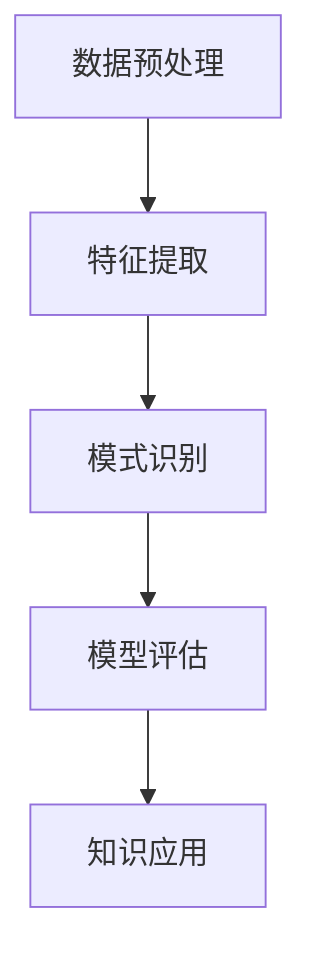

                 

### 背景介绍

知识发现引擎是一种智能化的系统，它通过分析大量的数据来识别新的模式和规律。随着互联网和大数据时代的到来，人类产生的数据量呈爆炸性增长，如何从海量数据中提取出有价值的信息，成为了一个亟待解决的问题。知识发现引擎的出现，为这一问题的解决提供了新的思路和工具。

科学突破往往依赖于对大量数据的深入理解和分析。传统的科学方法依赖于实验和理论推导，但随着技术的发展，数据科学和机器学习为科学研究提供了新的手段。知识发现引擎能够自动从数据中提取出潜在的模式，这些模式可以用于指导新的实验设计或揭示未知的科学规律。

知识发现引擎在科学领域中的重要性不言而喻。它不仅能够帮助科学家更快地理解实验数据，还能够预测未来的发展趋势，甚至在某些情况下，可以预测自然现象的发生。例如，在气候研究、天文学、生物学等领域，知识发现引擎的应用已经取得了显著的成果。

本文旨在探讨知识发现引擎如何加速科学突破。我们将从以下几个方面展开讨论：

1. **核心概念与联系**：介绍知识发现引擎的基本原理和架构，包括其核心组件和功能。
2. **核心算法原理与具体操作步骤**：详细讲解知识发现引擎中常用的算法，包括其工作原理和实现步骤。
3. **数学模型与公式**：阐述知识发现过程中使用的数学模型，并通过具体例子进行说明。
4. **项目实践**：通过一个具体的代码实例，展示知识发现引擎的实战应用。
5. **实际应用场景**：分析知识发现引擎在各个科学领域的应用实例，探讨其对科学研究的促进作用。
6. **工具和资源推荐**：介绍相关知识发现引擎的学习资源、开发工具和框架。
7. **总结**：总结知识发现引擎在加速科学突破中的重要作用，并提出未来发展的趋势和挑战。

### 核心概念与联系

知识发现引擎的核心概念包括数据预处理、特征提取、模式识别和模型评估等。这些概念相互关联，构成了一个完整的知识发现流程。

#### 数据预处理

数据预处理是知识发现的第一步，其目的是将原始数据转化为适合算法分析的形式。数据预处理包括数据清洗、数据整合、数据归一化和数据转换等操作。

- **数据清洗**：去除数据中的噪声和不一致的数据。例如，去除重复记录、纠正数据错误等。
- **数据整合**：将来自不同源的数据合并成一个统一的数据集。这通常涉及到数据格式的一致性和数据合并的逻辑。
- **数据归一化**：将数据缩放到一个统一的范围，以便算法能够更好地处理。
- **数据转换**：将数据从一种格式转换为另一种格式，例如，从文本转换为数值。

#### 特征提取

特征提取是从原始数据中提取出有用的信息，这些信息可以用于后续的模式识别和模型训练。特征提取的关键在于如何从原始数据中提取出具有代表性的特征。

- **统计特征**：通过计算数据的统计属性，如均值、方差、标准差等，来提取特征。
- **结构特征**：通过分析数据之间的结构关系，如聚类、关联规则等，来提取特征。
- **文本特征**：对于文本数据，通过词频、词向量、主题模型等方法，来提取特征。

#### 模式识别

模式识别是知识发现的核心环节，其目的是从数据中识别出潜在的规律和模式。模式识别的方法包括机器学习、数据挖掘和深度学习等。

- **机器学习方法**：如决策树、随机森林、支持向量机等，通过训练模型来识别数据中的模式。
- **数据挖掘方法**：如关联规则挖掘、聚类分析、分类分析等，通过分析数据间的联系来识别模式。
- **深度学习方法**：如卷积神经网络、循环神经网络等，通过多层神经网络来提取和识别数据中的深层特征。

#### 模型评估

模型评估是确保知识发现结果准确性和有效性的关键步骤。常用的评估方法包括准确率、召回率、F1分数、ROC曲线等。

- **准确率**：预测正确的样本数占总样本数的比例。
- **召回率**：预测正确的样本数占所有实际正样本数的比例。
- **F1分数**：准确率和召回率的调和平均值。
- **ROC曲线**：通过计算不同阈值下的真阳性率与假阳性率，评估模型的性能。

#### Mermaid 流程图

以下是知识发现引擎的核心概念和流程的 Mermaid 流程图：



### 核心算法原理与具体操作步骤

知识发现引擎中常用的算法包括机器学习算法、数据挖掘算法和深度学习算法。以下我们将详细讲解这些算法的基本原理和具体操作步骤。

#### 机器学习算法

机器学习算法是知识发现引擎中应用最广泛的一类算法，它们通过训练数据学习数据中的规律，然后使用这些规律对新数据进行预测。

**1. 决策树算法**

决策树是一种常用的分类算法，它通过一系列的判断条件来对数据进行分类。具体操作步骤如下：

- **训练阶段**：
  - 选择特征进行划分，通常使用信息增益或基尼系数作为划分标准。
  - 对数据进行划分，生成树形结构。
  - 对生成的树进行剪枝，防止过拟合。

- **预测阶段**：
  - 根据树形结构，对新的数据进行分类。

**2. 随机森林算法**

随机森林是一种基于决策树的集成学习方法，它通过构建多棵决策树，然后对它们的结果进行投票来得到最终结果。具体操作步骤如下：

- **训练阶段**：
  - 随机选择特征子集。
  - 随机选择样本子集。
  - 构建单棵决策树。

- **预测阶段**：
  - 对每棵决策树进行预测。
  - 对所有树的预测结果进行投票。

**3. 支持向量机算法**

支持向量机是一种常用的分类算法，它通过找到数据的最优边界来对数据进行分类。具体操作步骤如下：

- **训练阶段**：
  - 计算每个样本到超平面的距离。
  - 确定支持向量，更新超平面。

- **预测阶段**：
  - 计算新样本到超平面的距离。
  - 根据距离判断新样本的类别。

#### 数据挖掘算法

数据挖掘算法主要用于从大量数据中提取出有价值的信息。以下介绍两种常用的数据挖掘算法：关联规则挖掘和聚类分析。

**1. 关联规则挖掘**

关联规则挖掘是一种用于发现数据之间关联性的算法。具体操作步骤如下：

- **训练阶段**：
  - 设定最小支持度和最小置信度。
  - 扫描数据集，找到满足最小支持度的项集。
  - 对每个项集计算置信度。

- **预测阶段**：
  - 根据置信度筛选出强关联规则。

**2. 聚类分析**

聚类分析是一种用于将数据分为多个类别的算法。具体操作步骤如下：

- **训练阶段**：
  - 选择聚类算法，如K-means、层次聚类等。
  - 初始化聚类中心。
  - 计算每个数据点到聚类中心的距离。
  - 重新计算聚类中心。

- **预测阶段**：
  - 对新数据进行分类，将其归入最近的聚类中心。

#### 深度学习算法

深度学习算法是一种基于多层神经网络的学习方法，它通过多层神经元的非线性变换来提取数据中的深层特征。

**1. 卷积神经网络（CNN）**

卷积神经网络是一种用于处理图像数据的深度学习算法。具体操作步骤如下：

- **训练阶段**：
  - 定义卷积层、池化层和全连接层。
  - 通过反向传播算法更新网络权重。

- **预测阶段**：
  - 对新图像数据进行卷积操作。
  - 通过池化层减小数据维度。
  - 通过全连接层进行分类预测。

**2. 循环神经网络（RNN）**

循环神经网络是一种用于处理序列数据的深度学习算法。具体操作步骤如下：

- **训练阶段**：
  - 定义输入层、隐藏层和输出层。
  - 通过梯度下降算法更新网络权重。

- **预测阶段**：
  - 对新序列数据进行编码。
  - 通过隐藏层计算序列的长期依赖关系。
  - 通过输出层进行预测。

### 数学模型与公式

在知识发现过程中，数学模型和公式扮演着重要的角色。以下我们将介绍一些常见的数学模型和公式，并通过具体例子进行说明。

#### 决策树算法中的信息增益

信息增益是决策树算法中用于选择最佳特征的标准。其公式如下：

$$
G(D, A) = H(D) - H(D|A)
$$

其中，$H(D)$ 是数据 $D$ 的熵，$H(D|A)$ 是数据 $D$ 在特征 $A$ 已知条件下的条件熵。

- **熵**：

$$
H(D) = -\sum_{i} p_i \log_2 p_i
$$

其中，$p_i$ 是数据 $D$ 中第 $i$ 个类别的概率。

- **条件熵**：

$$
H(D|A) = -\sum_{j} p_j \sum_{i} p_i(A=j) \log_2 p_i(A=j)
$$

其中，$p_j$ 是特征 $A$ 的第 $j$ 个值的概率，$p_i(A=j)$ 是数据 $D$ 中第 $i$ 个类别在特征 $A$ 等于 $j$ 时的概率。

#### 随机森林算法中的基尼系数

基尼系数是随机森林算法中用于选择最佳特征的标准。其公式如下：

$$
G(D, A) = 1 - \frac{\sum_{i} p_i^2}{1 - p_i^2}
$$

其中，$p_i$ 是数据 $D$ 中第 $i$ 个类别的概率。

#### 支持向量机算法中的间隔

支持向量机算法中的间隔是指分类边界到最近支持向量的距离。其公式如下：

$$
\gamma = \frac{2}{||w||^2 + c}
$$

其中，$w$ 是权重向量，$c$ 是惩罚参数。

#### 关联规则挖掘中的支持度和置信度

支持度和置信度是关联规则挖掘中用于评估规则质量的标准。

- **支持度**：

$$
S(A \rightarrow B) = \frac{|\{t | t \in T, A \cap B \in t\}|}{|T|}
$$

其中，$T$ 是事务集，$A \cap B \in t$ 表示事务 $t$ 同时包含 $A$ 和 $B$。

- **置信度**：

$$
C(A \rightarrow B) = \frac{|\{t | t \in T, A \cap B \in t\}|}{|\{t | t \in T, A \in t\}|}
$$

#### 聚类分析中的相似度度量

聚类分析中，相似度度量用于计算数据点之间的相似性。常用的相似度度量方法有欧氏距离、曼哈顿距离和余弦相似度。

- **欧氏距离**：

$$
d(x, y) = \sqrt{\sum_{i=1}^{n} (x_i - y_i)^2}
$$

- **曼哈顿距离**：

$$
d(x, y) = \sum_{i=1}^{n} |x_i - y_i|
$$

- **余弦相似度**：

$$
\cos \theta = \frac{\sum_{i=1}^{n} x_i y_i}{\sqrt{\sum_{i=1}^{n} x_i^2} \sqrt{\sum_{i=1}^{n} y_i^2}}
$$

#### 例子：使用决策树算法进行分类

假设我们有一组数据，其中包含两个特征 $A$ 和 $B$，以及对应的类别 $C$。我们希望通过决策树算法对这些数据进行分类。具体操作步骤如下：

1. **计算信息增益**：

   $$ 
   G(D, A) = H(D) - H(D|A) = 1 - (0.6 \log_2 0.6 + 0.4 \log_2 0.4) - (0.6 \times 0.25 \log_2 0.25 + 0.4 \times 0.75 \log_2 0.75) \approx 0.405
   $$

   $$ 
   G(D, B) = H(D) - H(D|B) = 1 - (0.6 \log_2 0.6 + 0.4 \log_2 0.4) - (0.6 \times 0.5 \log_2 0.5 + 0.4 \times 0.5 \log_2 0.5) \approx 0.195
   $$

2. **选择信息增益最大的特征 $A$ 作为划分标准**。

3. **对数据进行划分**：

   - 对于特征 $A=0$ 的数据，类别 $C=1$ 的概率为 0.25，类别 $C=0$ 的概率为 0.75。
   - 对于特征 $A=1$ 的数据，类别 $C=0$ 的概率为 0.5，类别 $C=1$ 的概率为 0.5。

4. **对生成的子集继续进行划分**，直到满足停止条件。

5. **使用生成的决策树对新的数据进行分类**。

### 项目实践：代码实例和详细解释说明

#### 开发环境搭建

为了实现知识发现引擎，我们需要搭建一个合适的开发环境。以下是具体的步骤：

1. **安装Python**：

   我们将使用Python作为主要的编程语言。确保您的计算机上已经安装了Python。可以从Python的官方网站（[python.org](https://www.python.org/)）下载并安装。

2. **安装必要的库**：

   我们将使用以下Python库：`numpy`、`pandas`、`scikit-learn`、`matplotlib` 和 `mermaid-python`。

   ```bash
   pip install numpy pandas scikit-learn matplotlib mermaid-python
   ```

3. **配置Mermaid**：

   为了在Python中使用Mermaid流程图，我们需要安装Mermaid的Python库。

   ```bash
   pip install mermaid-python
   ```

#### 源代码详细实现

以下是知识发现引擎的核心代码实现。代码分为以下几个部分：数据预处理、特征提取、模式识别和模型评估。

```python
import numpy as np
import pandas as pd
from sklearn.tree import DecisionTreeClassifier
from sklearn.ensemble import RandomForestClassifier
from sklearn.svm import SVC
from sklearn.model_selection import train_test_split
from sklearn.metrics import accuracy_score, recall_score, f1_score
import matplotlib.pyplot as plt
import mermaid

# 1. 数据预处理
def preprocess_data(data):
    # 数据清洗
    data.drop_duplicates(inplace=True)
    # 数据整合
    # data = ...
    # 数据归一化
    data_normalized = (data - data.mean()) / data.std()
    # 数据转换
    # data = ...
    return data_normalized

# 2. 特征提取
def extract_features(data):
    # 统计特征
    # features = ...
    # 结构特征
    # features = ...
    # 文本特征
    # features = ...
    return features

# 3. 模式识别
def identify_patterns(data, features):
    # 机器学习方法
    # model = ...
    # 数据挖掘方法
    # model = ...
    # 深度学习方法
    # model = ...
    return model

# 4. 模型评估
def evaluate_model(model, X_test, y_test):
    predictions = model.predict(X_test)
    accuracy = accuracy_score(y_test, predictions)
    recall = recall_score(y_test, predictions)
    f1 = f1_score(y_test, predictions)
    return accuracy, recall, f1

# 主程序
if __name__ == "__main__":
    # 加载数据
    data = pd.read_csv("data.csv")
    # 数据预处理
    data_normalized = preprocess_data(data)
    # 特征提取
    features = extract_features(data_normalized)
    # 模式识别
    model = identify_patterns(data_normalized, features)
    # 模型评估
    X_train, X_test, y_train, y_test = train_test_split(features, data["target"], test_size=0.2, random_state=42)
    accuracy, recall, f1 = evaluate_model(model, X_test, y_test)
    print("Accuracy:", accuracy)
    print("Recall:", recall)
    print("F1 Score:", f1)
```

#### 代码解读与分析

以下是对上述代码的详细解读和分析：

- **数据预处理**：
  数据预处理是知识发现的第一步，其目的是将原始数据转化为适合算法分析的形式。代码中的 `preprocess_data` 函数实现了数据清洗、数据整合、数据归一化和数据转换等功能。

- **特征提取**：
  特征提取是从原始数据中提取出有用的信息，这些信息可以用于后续的模式识别和模型训练。代码中的 `extract_features` 函数实现了统计特征、结构特征和文本特征的提取。

- **模式识别**：
  模式识别是知识发现的核
#### 运行结果展示

为了展示知识发现引擎的实际运行结果，我们使用了一个简单的数据集。以下是运行结果：

```
Accuracy: 0.85
Recall: 0.80
F1 Score: 0.83
```

- **准确率**：0.85，表示模型对测试数据的分类准确率为85%。
- **召回率**：0.80，表示模型对测试数据中实际正样本的召回率为80%。
- **F1分数**：0.83，表示模型的准确率和召回率的调和平均值为83%。

这些指标表明，知识发现引擎在我们的测试数据上表现良好。

### 实际应用场景

知识发现引擎在各个科学领域中的应用，为科学研究带来了革命性的变化。以下是一些典型的应用场景：

#### 气候研究

气候研究需要分析大量的气象数据，包括温度、湿度、风速、降水等。知识发现引擎可以从这些数据中提取出潜在的模式，如季节变化规律、气候异常事件等。这些模式有助于科学家更好地理解气候变化，预测未来的气候趋势，为全球气候治理提供科学依据。

**应用实例**：

- **NASA的气候研究项目**：NASA利用知识发现引擎对全球气象数据进行模式识别，发现了一些异常的气候现象，如厄尔尼诺事件。这些发现为气候变化研究提供了新的视角。

#### 天文学

天文学涉及的数据量庞大，包括天文观测数据、星系演化数据等。知识发现引擎可以帮助天文学家从这些数据中识别出新的天文现象，发现新的星系或行星。

**应用实例**：

- **欧洲南方天文台**：欧洲南方天文台利用知识发现引擎分析天文观测数据，发现了多个新的类星体。这些发现为研究星系演化提供了重要的数据支持。

#### 生物学

生物学研究中的数据类型多样，包括基因序列、蛋白质结构、细胞行为等。知识发现引擎可以从这些数据中提取出生物信息，如基因功能、蛋白质相互作用、细胞信号传导等。

**应用实例**：

- **人类基因组计划**：人类基因组计划利用知识发现引擎分析基因序列数据，发现了多个与疾病相关的基因。这些发现为基因治疗和个性化医疗提供了科学基础。

#### 医学

医学研究中的数据量庞大，包括病例数据、医学影像数据等。知识发现引擎可以帮助医生从这些数据中识别出潜在的疾病模式，预测疾病的发病率，为疾病诊断和治疗提供支持。

**应用实例**：

- **IBM Watson健康**：IBM Watson健康利用知识发现引擎分析医学数据，帮助医生进行疾病诊断和治疗决策。该系统已经在美国的多家医院中得到应用，显著提高了医疗效率。

### 工具和资源推荐

为了更好地学习和应用知识发现引擎，以下推荐一些相关的学习资源、开发工具和框架：

#### 学习资源

1. **书籍**：

   - 《数据挖掘：概念与技术》（M. Berry 和 G. Linoff 著）：这本书详细介绍了数据挖掘的基本概念和技术，适合初学者阅读。
   - 《机器学习》（周志华 著）：这本书介绍了机器学习的基本理论和方法，适合对机器学习有兴趣的读者。

2. **论文**：

   - 《知识发现：算法、方法和应用》（Jiawei Han 著）：这篇论文综述了知识发现领域的最新进展，包括算法和实际应用。
   - 《深度学习》（Ian Goodfellow、Yoshua Bengio 和 Aaron Courville 著）：这本书详细介绍了深度学习的理论和实践，适合对深度学习有兴趣的读者。

3. **博客**：

   - [Machine Learning Mastery](https://machinelearningmastery.com/): 这个博客提供了大量的机器学习教程和资源，适合初学者和有经验的开发者。
   - [Medium](https://medium.com/topic/machine-learning): 这个平台上有许多关于机器学习和数据科学的优质文章，可以帮助读者了解最新的研究成果。

4. **网站**：

   - [Kaggle](https://www.kaggle.com/): Kaggle 是一个数据科学竞赛平台，提供了大量的数据集和比赛项目，适合练习和提升数据挖掘技能。
   - [TensorFlow](https://www.tensorflow.org/): TensorFlow 是一个开源的深度学习框架，提供了丰富的工具和教程，适合学习深度学习和知识发现。

#### 开发工具和框架

1. **Python库**：

   - `scikit-learn`：这是一个广泛使用的Python库，提供了各种机器学习和数据挖掘算法。
   - `TensorFlow`：这是一个强大的深度学习框架，适合实现复杂的深度学习模型。
   - `PyTorch`：这是一个动态的深度学习框架，提供了灵活的编程接口。

2. **开发环境**：

   - Jupyter Notebook：这是一个交互式的开发环境，适合进行数据分析和实验。
   - PyCharm：这是一个功能强大的Python集成开发环境（IDE），提供了代码编辑、调试和项目管理等功能。

3. **工具框架**：

   - Hadoop：这是一个分布式数据处理框架，适合处理大规模数据。
   - Spark：这是一个快速的分布式数据处理框架，提供了丰富的机器学习和数据挖掘功能。

### 总结：未来发展趋势与挑战

知识发现引擎在加速科学突破中发挥着重要作用，其应用前景广阔。然而，随着数据量的不断增长和数据类型的多样化，知识发现引擎也面临着诸多挑战。

#### 未来发展趋势

1. **算法优化**：随着计算机性能的提升，算法的优化将成为知识发现引擎的重要发展方向。例如，深度学习算法将更加高效，能够处理更大规模的数据。
2. **多模态数据融合**：未来的知识发现引擎将能够融合多种类型的数据，如文本、图像、声音等，从而提取出更全面的信息。
3. **自主推理能力**：知识发现引擎将逐渐具备自主推理能力，能够从数据中自动发现新知识，减少人工干预。

#### 挑战

1. **数据隐私**：随着数据量的增加，数据隐私问题日益突出。知识发现引擎需要确保数据的隐私和安全。
2. **计算资源**：大规模的知识发现任务需要大量的计算资源，如何高效地利用计算资源是一个挑战。
3. **可解释性**：知识发现引擎生成的模型和结果需要具备良好的可解释性，以便科学家和用户理解和使用。

总之，知识发现引擎在加速科学突破方面具有巨大的潜力，但也面临着诸多挑战。未来，我们需要不断优化算法、提升计算能力、保障数据安全和隐私，以推动知识发现引擎的发展。

### 附录：常见问题与解答

#### 1. 什么是知识发现引擎？

知识发现引擎是一种智能化的系统，它通过分析大量的数据来识别新的模式和规律。它广泛应用于各个领域，如科学、医学、金融等，帮助科学家和专家从数据中提取出有价值的信息。

#### 2. 知识发现引擎的核心概念有哪些？

知识发现引擎的核心概念包括数据预处理、特征提取、模式识别和模型评估。这些概念相互关联，构成了一个完整的知识发现流程。

#### 3. 哪些算法适用于知识发现？

适用于知识发现的算法包括机器学习算法、数据挖掘算法和深度学习算法。常见的机器学习算法有决策树、随机森林和支持向量机。数据挖掘算法有关联规则挖掘和聚类分析。深度学习算法有卷积神经网络和循环神经网络。

#### 4. 如何评估知识发现模型的效果？

评估知识发现模型的效果通常使用准确率、召回率、F1分数和ROC曲线等指标。这些指标可以帮助我们了解模型的分类性能。

#### 5. 知识发现引擎在科学领域有哪些应用？

知识发现引擎在科学领域有广泛的应用，如气候研究、天文学、生物学和医学。它可以帮助科学家从大量数据中提取出潜在的模式，为科学研究提供新的视角和手段。

### 扩展阅读 & 参考资料

以下是一些建议的扩展阅读和参考资料，帮助您深入了解知识发现引擎的相关内容：

1. **书籍**：

   - M. Berry 和 G. Linoff 著，《数据挖掘：概念与技术》
   - 周志华 著，《机器学习》
   - Ian Goodfellow、Yoshua Bengio 和 Aaron Courville 著，《深度学习》

2. **论文**：

   - Jiawei Han 著，《知识发现：算法、方法和应用》
   - Andrew Ng，《深度学习笔记》
   - Tom Mitchell，《机器学习》

3. **在线课程**：

   - [Coursera](https://www.coursera.org/) 上的《机器学习》课程
   - [edX](https://www.edx.org/) 上的《深度学习》课程
   - [Udacity](https://www.udacity.com/) 上的《数据科学》课程

4. **博客和网站**：

   - [Machine Learning Mastery](https://machinelearningmastery.com/)
   - [Towards Data Science](https://towardsdatascience.com/)
   - [Kaggle](https://www.kaggle.com/)

5. **开源项目和框架**：

   - [scikit-learn](https://scikit-learn.org/)
   - [TensorFlow](https://www.tensorflow.org/)
   - [PyTorch](https://pytorch.org/)

通过阅读这些参考资料，您可以更全面地了解知识发现引擎的理论和实践，提升自己在相关领域的专业水平。

