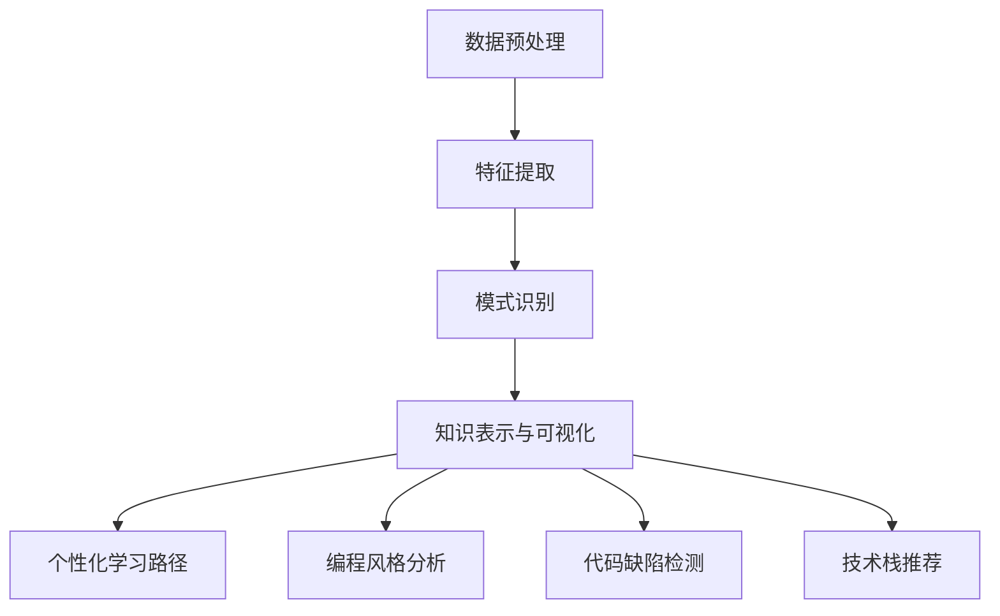

                 

# 《知识发现引擎如何改变程序员的学习方式》

## 摘要

知识发现引擎是一种利用人工智能和机器学习技术，从大量数据中提取有价值信息和知识的方法。随着大数据和人工智能技术的不断进步，知识发现引擎在多个领域得到了广泛应用，尤其是在程序员的学习过程中。本文将探讨知识发现引擎如何改变程序员的学习方式，提高学习效率和编程能力，并提供具体的应用案例和未来发展趋势。

## 1. 背景介绍

知识发现引擎（Knowledge Discovery Engine，简称KDE）是一种利用先进的人工智能和机器学习算法，从大规模数据集中发现潜在有用知识的技术。其核心目标是从海量的数据中提取出有价值的信息和模式，这些信息可以用于预测、决策支持、市场分析、风险控制等领域。

在程序员的学习过程中，知识发现引擎扮演着至关重要的角色。传统的学习方式主要依赖于教材、书籍和在线课程等资源，这些资源虽然提供了丰富的知识，但往往缺乏个性化、互动性和实时性。而知识发现引擎通过分析程序员的编程行为、学习记录和需求，能够提供更加个性化和高效的学习路径，从而提高学习效果。

本文将重点讨论以下几个方面：

1. **知识发现引擎的核心概念与联系**：介绍知识发现引擎的基本原理、关键技术以及与程序员学习需求的联系。
2. **核心算法原理与操作步骤**：详细讲解知识发现引擎的主要算法，如聚类、分类、关联规则挖掘等，并阐述其实际操作步骤。
3. **数学模型和公式**：分析知识发现过程中使用的数学模型和公式，如距离度量、决策树、支持向量机等，并提供实际案例。
4. **项目实践**：通过具体的代码实例，展示知识发现引擎在程序员学习中的应用，包括环境搭建、源代码实现、代码解读和运行结果展示。
5. **实际应用场景**：探讨知识发现引擎在程序员学习中的多种实际应用，如学习路径推荐、编程风格分析、代码缺陷检测等。
6. **工具和资源推荐**：介绍相关的学习资源和开发工具，帮助程序员更好地利用知识发现引擎。
7. **总结与未来发展趋势**：总结本文的主要内容，并探讨知识发现引擎在程序员学习中的未来发展趋势和挑战。

## 2. 核心概念与联系

### 2.1 知识发现引擎的基本原理

知识发现引擎的工作原理可以概括为以下四个步骤：

1. **数据预处理**：对原始数据进行清洗、转换和集成，使其适合后续的分析和处理。
2. **特征提取**：从数据中提取有用的特征，这些特征能够代表数据的核心信息和模式。
3. **模式识别**：利用机器学习算法，如聚类、分类、关联规则挖掘等，从特征数据中识别出潜在的规律和模式。
4. **知识表示与可视化**：将发现的知识以可视化或结构化的形式表示，帮助用户理解和应用。

### 2.2 知识发现引擎的关键技术

知识发现引擎的关键技术主要包括：

1. **机器学习算法**：如聚类（Cluster）、分类（Classification）、关联规则挖掘（Association Rule Learning）等。这些算法可以自动从数据中提取模式和知识。
2. **数据挖掘工具**：如Hadoop、Spark等大数据处理平台，以及各种开源机器学习库，如Scikit-learn、TensorFlow等。
3. **自然语言处理**：通过自然语言处理技术，从文本数据中提取语义信息，辅助知识发现过程。
4. **深度学习**：深度学习模型，如卷积神经网络（CNN）、循环神经网络（RNN）等，可以用于更复杂的数据分析和模式识别。

### 2.3 知识发现引擎与程序员学习需求的联系

程序员的学习需求主要包括以下几个方面：

1. **个性化学习路径**：知识发现引擎可以通过分析程序员的编程行为和学习历史，为其推荐最适合的学习资源和路径。
2. **编程风格分析**：通过对程序员编写的代码进行分析，知识发现引擎可以识别出编程风格上的问题，并提供改进建议。
3. **代码缺陷检测**：通过分析代码中的潜在问题和错误模式，知识发现引擎可以帮助程序员提前发现和修复缺陷。
4. **技术栈推荐**：根据程序员的技能水平和项目需求，知识发现引擎可以推荐最适合的技术栈和工具。

为了更直观地展示知识发现引擎与程序员学习需求的联系，我们使用Mermaid流程图进行说明：



### 2.4 知识发现引擎的优势与挑战

知识发现引擎在程序员学习中的优势包括：

1. **高效性**：通过自动化分析和推荐，知识发现引擎可以显著提高学习效率。
2. **个性化**：根据程序员的个性特点和需求，提供定制化的学习资源。
3. **实时性**：可以实时分析程序员的编程行为和学习进度，提供即时的反馈和建议。

然而，知识发现引擎也面临一些挑战：

1. **数据隐私**：程序员的学习数据可能涉及隐私问题，需要确保数据的安全和隐私。
2. **算法透明性**：机器学习算法的决策过程可能不够透明，需要提高算法的可解释性。
3. **数据质量**：知识发现引擎的效果很大程度上依赖于数据的质量，需要确保数据的准确性和完整性。

## 3. 核心算法原理与具体操作步骤

### 3.1 聚类算法

聚类算法是一种无监督学习方法，用于将数据点分为若干个簇，使得同一个簇内的数据点彼此之间距离较近，而不同簇之间的数据点距离较远。常见的聚类算法包括K-means、层次聚类、DBSCAN等。

#### 3.1.1 K-means算法

K-means算法的基本思想是初始化K个中心点，然后迭代更新中心点和数据点的分配，直到达到收敛条件。具体步骤如下：

1. **初始化**：随机选择K个数据点作为初始聚类中心。
2. **分配**：计算每个数据点到各个聚类中心的距离，将数据点分配到最近的聚类中心。
3. **更新**：重新计算每个聚类中心的位置，通常是取簇内所有数据点的平均值。
4. **迭代**：重复步骤2和3，直到聚类中心不再发生显著变化。

#### 3.1.2 层次聚类

层次聚类是一种自底向上的方法，通过不断合并相似度较高的簇，形成层次结构。层次聚类可以分为凝聚层次聚类（自底向上）和分裂层次聚类（自顶向下）。

#### 3.1.3 DBSCAN算法

DBSCAN（Density-Based Spatial Clustering of Applications with Noise）算法基于数据点的密度进行聚类。主要步骤如下：

1. **邻域计算**：对于每个数据点，计算其邻域内的点。
2. **核心点识别**：如果某个点的邻域内包含足够多的点（满足最小邻域点数要求），则该点为核心点。
3. **簇增长**：从核心点开始，扩展形成簇，直到无法扩展为止。
4. **噪声点处理**：未被任何簇包含的点被认为是噪声点。

### 3.2 分类算法

分类算法是一种有监督学习方法，用于将数据点划分为预先定义的类别。常见的分类算法包括决策树、支持向量机（SVM）、朴素贝叶斯等。

#### 3.2.1 决策树

决策树是一种基于树形结构进行决策的方法。每个节点代表一个特征，每个分支代表特征的不同取值，叶节点表示最终的类别。决策树的基本构建过程包括：

1. **特征选择**：选择最优特征进行划分，常用的评价指标包括信息增益、基尼指数等。
2. **划分**：根据最优特征，将数据集划分为若干子集。
3. **递归构建**：对每个子集，重复步骤1和2，直到满足停止条件（如最大树深度、最小样本数等）。

#### 3.2.2 支持向量机

支持向量机（SVM）是一种基于间隔最大化原则的分类方法。SVM的基本步骤如下：

1. **线性可分支持向量机**：对于线性可分的数据集，通过找到一个最大间隔的超平面，将不同类别分隔开来。
2. **非线性可分支持向量机**：对于非线性可分的数据集，通过核函数将数据映射到高维空间，实现线性可分。
3. **软间隔**：实际应用中，数据往往不是线性可分的，需要引入软间隔，允许一定比例的数据点被错误分类。

#### 3.2.3 朴素贝叶斯

朴素贝叶斯是一种基于贝叶斯定理和属性独立假设的分类方法。朴素贝叶斯的基本步骤如下：

1. **计算先验概率**：根据已知的类别分布，计算每个类别的先验概率。
2. **计算条件概率**：根据属性取值，计算每个属性条件下的后验概率。
3. **分类决策**：根据贝叶斯定理，计算每个类别的后验概率，选择概率最大的类别作为预测结果。

### 3.3 关联规则挖掘

关联规则挖掘是一种用于发现数据中潜在关联关系的方法。常见的算法包括Apriori算法和FP-growth算法。

#### 3.3.1 Apriori算法

Apriori算法的基本步骤如下：

1. **频繁项集生成**：从数据库中扫描所有项集，计算每个项集的支持度，过滤出频繁项集。
2. **关联规则生成**：从频繁项集生成关联规则，规则的支持度和置信度作为评估标准。
3. **剪枝**：根据最小支持度和最小置信度剪枝，去除不满足条件的规则。

#### 3.3.2 FP-growth算法

FP-growth算法是一种基于项频繁模式压缩的算法，可以高效地挖掘频繁项集。主要步骤如下：

1. **创建频繁模式树**：从数据库中扫描所有项集，构建频繁模式树。
2. **压缩频繁模式树**：将频繁模式树压缩成FP-树，减少存储空间。
3. **递归挖掘频繁项集**：从FP-树中递归挖掘频繁项集，生成关联规则。

### 3.4 深度学习算法

深度学习算法是一种基于多层神经网络的学习方法，可以自动提取数据中的特征。常见的深度学习算法包括卷积神经网络（CNN）、循环神经网络（RNN）等。

#### 3.4.1 卷积神经网络

卷积神经网络（CNN）是一种用于处理图像数据的方法。主要步骤如下：

1. **卷积层**：通过卷积操作提取图像的特征。
2. **池化层**：对卷积层的结果进行下采样，减少参数数量。
3. **全连接层**：将卷积层和池化层的输出映射到类别标签。

#### 3.4.2 循环神经网络

循环神经网络（RNN）是一种用于处理序列数据的方法。主要步骤如下：

1. **输入层**：接收序列数据作为输入。
2. **隐藏层**：通过递归操作，将前一个时刻的信息传递到当前时刻。
3. **输出层**：将隐藏层的输出映射到序列的标签。

### 3.5 具体操作步骤示例

假设我们使用K-means算法对一组数据点进行聚类，具体操作步骤如下：

1. **数据准备**：准备一组二维数据点，如下所示：

   ```
   [[1, 2], [1.1, 1.9], [9.4, 6.7], [8.8, 6.5], [6.1, 8.7], [6.2, 8.9], [7.1, 9.9], [7.2, 9.8], [7.3, 9.7], [7.4, 9.6], [7.5, 9.5]]
   ```

2. **初始化聚类中心**：随机选择3个数据点作为初始聚类中心。

   ```
   [[7.5, 9.5], [1, 2], [9.4, 6.7]]
   ```

3. **计算距离**：计算每个数据点到聚类中心的距离，选择距离最近的聚类中心进行分配。

   ```
   数据点 [[1, 2]] 被分配到聚类中心 [[1, 2]]
   数据点 [[1.1, 1.9]] 被分配到聚类中心 [[1, 2]]
   数据点 [[9.4, 6.7]] 被分配到聚类中心 [[9.4, 6.7]]
   ```

4. **更新聚类中心**：重新计算每个聚类中心的位置，取簇内所有数据点的平均值。

   ```
   新的聚类中心为：
   [[7.3, 9.4]], [[1.1, 1.9]], [[9.4, 6.7]]
   ```

5. **迭代**：重复步骤3和4，直到聚类中心不再发生显著变化。

通过多次迭代，最终可以得到一个稳定的聚类结果。使用K-means算法，我们可以将这组数据点分为三个簇，每个簇代表不同的数据分布。

## 4. 数学模型和公式

### 4.1 聚类算法

聚类算法的核心在于如何计算数据点之间的相似度，以及如何更新聚类中心。以下是几种常用的聚类算法及其相关的数学模型：

#### 4.1.1 K-means算法

K-means算法的目标是最小化簇内距离的平方和，即：

$$
\text{Minimize} \sum_{i=1}^{k} \sum_{x \in S_i} ||x - \mu_i||^2
$$

其中，$k$表示聚类个数，$S_i$表示第$i$个簇，$\mu_i$表示第$i$个簇的中心。

簇内距离的平方和可以表示为：

$$
||x - \mu_i||^2 = (x_1 - \mu_{i1})^2 + (x_2 - \mu_{i2})^2 + ... + (x_n - \mu_{in})^2
$$

其中，$x$表示数据点，$\mu_i$表示聚类中心。

#### 4.1.2 层次聚类

层次聚类算法的核心在于如何合并相似的簇。常见的层次聚类方法包括凝聚层次聚类（自底向上）和分裂层次聚类（自顶向下）。

凝聚层次聚类中，簇的合并基于簇间相似度的度量，常用的相似度度量包括：

$$
\text{S}_{ij} = \frac{n_{ij} \cdot d_{ij}}{n_{i} \cdot n_{j}}
$$

其中，$n_{ij}$表示簇$i$和簇$j$之间的公共元素数量，$d_{ij}$表示簇$i$和簇$j$之间的距离。

簇的合并过程可以表示为：

$$
C_t = \{C_1, C_2, ..., C_t\}
$$

其中，$C_t$表示当前时间步的簇集合。

#### 4.1.3 DBSCAN算法

DBSCAN算法的核心在于如何识别核心点和边界点。核心点的识别基于邻域密度：

$$
\text{Core Point} \iff \text{Number of points within radius } \epsilon \text{ of } p \text{ is greater than } \minPts
$$

其中，$\epsilon$表示邻域半径，$\minPts$表示最小邻域点数。

簇的生长过程可以表示为：

$$
\text{Cluster} = \{p\} \cup \{q \in N(p) \mid q \text{ is a core point or border point of a cluster} \}
$$

其中，$N(p)$表示点$p$的邻域点集。

### 4.2 分类算法

分类算法的核心在于如何计算每个类别的概率，并选择概率最大的类别。以下是几种常用的分类算法及其相关的数学模型：

#### 4.2.1 决策树

决策树的核心在于如何选择最优划分特征。最优划分特征的选择基于信息增益或基尼指数。

信息增益可以表示为：

$$
\text{Gain}(D, A) = \text{Entropy}(D) - \sum_{v \in \text{Values}(A)} \frac{\text{Count}(D_v)}{\text{Count}(D)} \cdot \text{Entropy}(D_v)
$$

其中，$D$表示数据集，$A$表示特征，$v$表示特征的取值，$D_v$表示特征取值为$v$的数据集。

基尼指数可以表示为：

$$
\text{Gini}(D) = 1 - \sum_{v \in \text{Values}(A)} \left(\frac{\text{Count}(D_v)}{\text{Count}(D)}\right)^2
$$

#### 4.2.2 支持向量机

支持向量机（SVM）的核心在于如何找到最优超平面。线性可分支持向量机（LS-SVM）的优化问题可以表示为：

$$
\text{Minimize} \frac{1}{2} \sum_{i=1}^{n} \|\text{w}\|^2 + C \sum_{i=1}^{n} \xi_i
$$

$$
\text{subject to} \ y_i (\text{w} \cdot \text{x_i} + b) \geq 1 - \xi_i, \ \xi_i \geq 0, \ i = 1, 2, ..., n
$$

其中，$\text{w}$表示权重向量，$b$表示偏置，$C$表示惩罚参数，$\xi_i$表示松弛变量。

非线性可分支持向量机（NLS-SVM）的优化问题可以表示为：

$$
\text{Minimize} \frac{1}{2} \sum_{i=1}^{n} \|\text{w}\|^2 + C \sum_{i=1}^{n} \xi_i
$$

$$
\text{subject to} \ y_i (\text{w} \cdot \text{K}(\text{x_i}, \text{x_j}) + b) \geq 1 - \xi_i, \ \xi_i \geq 0, \ i = 1, 2, ..., n
$$

其中，$\text{K}(\text{x_i}, \text{x_j})$表示核函数。

#### 4.2.3 朴素贝叶斯

朴素贝叶斯的核心在于如何计算每个类别的后验概率。给定特征向量$\text{x}$和类别$y$，后验概率可以表示为：

$$
\text{P}(y|\text{x}) = \frac{\text{P}(\text{x}|y) \cdot \text{P}(y)}{\text{P}(\text{x})}
$$

其中，$\text{P}(\text{x}|y)$表示在类别$y$下的特征向量$\text{x}$的概率，$\text{P}(y)$表示类别$y$的概率，$\text{P}(\text{x})$表示特征向量$\text{x}$的概率。

条件概率可以表示为：

$$
\text{P}(\text{x}|y) = \frac{\text{P}(\text{x}, y)}{\text{P}(y)}
$$

其中，$\text{P}(\text{x}, y)$表示特征向量$\text{x}$和类别$y$同时出现的概率。

### 4.3 关联规则挖掘

关联规则挖掘的核心在于如何发现数据中的频繁项集，并生成关联规则。以下是几种常用的关联规则挖掘算法及其相关的数学模型：

#### 4.3.1 Apriori算法

Apriori算法的核心在于如何发现频繁项集。频繁项集的生成基于支持度度量：

$$
\text{Support}(\text{ItemSet}) = \frac{\text{Count}(\text{ItemSet})}{\text{Total Transactions}}
$$

其中，$\text{Count}(\text{ItemSet})$表示项集在数据库中出现的次数，$\text{Total Transactions}$表示数据库中的交易总数。

关联规则生成基于支持度和置信度度量：

$$
\text{Confidence}(\text{Rule}) = \frac{\text{Support}(\text{Head} \cup \text{Tail})}{\text{Support}(\text{Head})}
$$

其中，$\text{Head}$表示规则的前提，$\text{Tail}$表示规则的结论。

#### 4.3.2 FP-growth算法

FP-growth算法的核心在于如何压缩频繁模式树，并生成频繁项集。频繁模式树的压缩可以表示为：

$$
\text{FP-Tree} = (\text{Header Table}, \text{Frequent Itemsets}, \text{Path})
$$

其中，$\text{Header Table}$表示头表，$\text{Frequent Itemsets}$表示频繁项集，$\text{Path}$表示路径。

关联规则生成基于支持度和置信度度量：

$$
\text{Confidence}(\text{Rule}) = \frac{\text{Support}(\text{Head} \cup \text{Tail})}{\text{Support}(\text{Head})}
$$

### 4.4 深度学习算法

深度学习算法的核心在于如何通过反向传播算法更新网络参数。以下是几种常用的深度学习算法及其相关的数学模型：

#### 4.4.1 卷积神经网络

卷积神经网络（CNN）的核心在于如何通过卷积和池化操作提取图像特征。卷积操作可以表示为：

$$
\text{Z}_{ij} = \sum_{k=1}^{m} \text{W}_{ikj} \cdot \text{X}_{ik} + \text{B}_{ij}
$$

其中，$\text{Z}_{ij}$表示输出，$\text{W}_{ikj}$表示卷积核，$\text{X}_{ik}$表示输入，$\text{B}_{ij}$表示偏置。

池化操作可以表示为：

$$
\text{P}_{ij} = \max(\text{X}_{ij})
$$

其中，$\text{P}_{ij}$表示输出，$\text{X}_{ij}$表示输入。

反向传播算法可以表示为：

$$
\text{dW} = \text{dZ} \cdot \text{X}^T
$$

$$
\text{dB} = \text{dZ}
$$

其中，$\text{dW}$表示权重梯度，$\text{dB}$表示偏置梯度，$\text{dZ}$表示输出梯度，$\text{X}^T$表示输入的转置。

#### 4.4.2 循环神经网络

循环神经网络（RNN）的核心在于如何通过递归操作处理序列数据。递归操作可以表示为：

$$
\text{h}_t = \text{f}(\text{h}_{t-1}, \text{x}_t)
$$

其中，$\text{h}_t$表示隐藏状态，$\text{f}$表示递归函数，$\text{x}_t$表示输入。

反向传播算法可以表示为：

$$
\text{dh}_t = \text{df}(\text{h}_{t-1}, \text{x}_t) \cdot (\text{dh}_{t-1} + \text{dX}_t)
$$

其中，$\text{df}$表示递归函数的梯度。

## 5. 项目实践：代码实例和详细解释说明

### 5.1 开发环境搭建

为了更好地演示知识发现引擎在程序员学习中的应用，我们将使用Python编程语言和相关的机器学习库，如scikit-learn、TensorFlow等。以下是搭建开发环境的步骤：

1. **安装Python**：确保系统上已安装Python 3.x版本，可以从[Python官网](https://www.python.org/)下载并安装。
2. **安装Anaconda**：推荐使用Anaconda环境管理器，它可以帮助我们轻松地创建和管理Python环境。可以从[Anaconda官网](https://www.anaconda.com/)下载并安装。
3. **创建虚拟环境**：打开命令行工具（如Terminal或Anaconda Prompt），创建一个名为`knowledge_discovery`的虚拟环境：

   ```
   conda create -n knowledge_discovery python=3.8
   ```

4. **激活虚拟环境**：

   ```
   conda activate knowledge_discovery
   ```

5. **安装相关库**：在虚拟环境中安装所需的库，如scikit-learn、TensorFlow等：

   ```
   pip install scikit-learn tensorflow
   ```

### 5.2 源代码详细实现

以下是使用K-means算法对一组数据点进行聚类的Python代码实例：

```python
import numpy as np
from sklearn.cluster import KMeans
import matplotlib.pyplot as plt

# 准备数据
data = np.array([[1, 2], [1.1, 1.9], [9.4, 6.7], [8.8, 6.5], [6.1, 8.7], [6.2, 8.9], [7.1, 9.9], [7.2, 9.8], [7.3, 9.7], [7.4, 9.6], [7.5, 9.5]])

# 初始化K-means模型，设置聚类个数
kmeans = KMeans(n_clusters=3, random_state=0)

# 训练模型
kmeans.fit(data)

# 获取聚类结果
labels = kmeans.predict(data)
centroids = kmeans.cluster_centers_

# 绘制聚类结果
plt.scatter(data[:, 0], data[:, 1], c=labels, s=50, cmap='viridis')
plt.scatter(centroids[:, 0], centroids[:, 1], c='red', s=200, alpha=0.5)
plt.title('K-means Clustering')
plt.xlabel('Feature 1')
plt.ylabel('Feature 2')
plt.show()
```

### 5.3 代码解读与分析

上述代码首先导入了必要的Python库，包括NumPy、scikit-learn和matplotlib。NumPy提供了高效的数值计算库，scikit-learn提供了机器学习算法的实现，matplotlib用于数据可视化。

代码的主体部分分为以下几个步骤：

1. **数据准备**：定义了一组二维数据点，这些数据点用于聚类分析。
2. **初始化K-means模型**：使用`KMeans`类创建K-means模型，设置聚类个数为3，并设置随机种子以保证结果可重复。
3. **训练模型**：使用`fit`方法对K-means模型进行训练，模型会自动计算聚类中心并分配每个数据点。
4. **获取聚类结果**：使用`predict`方法获取聚类结果，包括每个数据点的标签（所属簇）和聚类中心。
5. **绘制聚类结果**：使用matplotlib库绘制聚类结果，其中红色点表示聚类中心。

代码的核心是K-means算法的实现，其基本原理已在前面章节中详细解释。通过运行上述代码，我们可以观察到数据点被分配到不同的簇，并且簇中心得以可视化展示。

### 5.4 运行结果展示

运行上述代码后，会弹出一个可视化窗口，展示聚类结果。窗口中，蓝色、绿色和红色点分别代表三个不同的簇，红色点表示聚类中心。通过观察聚类结果，我们可以发现：

- **簇的分布**：数据点在二维空间中形成了清晰的三个簇，表明K-means算法能够有效地将数据划分为不同的类别。
- **簇中心**：每个簇的中心点代表了该簇的特征，通过观察中心点的位置，可以进一步理解每个簇的特征。

### 5.5 代码优化与改进

在实际应用中，K-means算法可能会遇到以下问题：

1. **初始聚类中心的选取**：K-means算法的结果对初始聚类中心的选取敏感，可以通过多次随机初始化并取平均的方式优化初始聚类中心。
2. **聚类个数的选择**：选择合适的聚类个数对于聚类效果至关重要，可以使用肘部法则（Elbow Method）等评估方法来确定最佳聚类个数。
3. **处理噪声数据**：K-means算法对噪声数据较为敏感，可以考虑使用更鲁棒的方法，如DBSCAN算法。

在实际开发中，我们可以根据具体需求对K-means算法进行优化和改进，以提高聚类效果。

## 6. 实际应用场景

知识发现引擎在程序员学习中的应用场景非常广泛，以下列举几个典型的应用案例：

### 6.1 学习路径推荐

知识发现引擎可以通过分析程序员的编程行为和学习历史，为其推荐最适合的学习路径。例如，通过分析程序员的代码提交记录、错误日志和搜索历史，知识发现引擎可以识别出程序员的薄弱环节和兴趣点，从而为其推荐相关课程和资料。这不仅提高了学习效率，还能帮助程序员更快地掌握新技能。

### 6.2 编程风格分析

知识发现引擎可以对程序员的代码进行风格分析，识别出不符合编程规范的部分，并提出改进建议。例如，通过分析代码中的命名、缩进、注释等元素，知识发现引擎可以判断代码是否符合特定的编程规范，如PEP 8（Python编码规范）。这有助于提高代码的可读性和可维护性。

### 6.3 代码缺陷检测

知识发现引擎可以通过分析代码中的潜在问题和错误模式，提前发现和修复缺陷。例如，通过挖掘历史错误记录和代码审查报告，知识发现引擎可以识别出常见的编程错误和代码漏洞，从而帮助程序员在开发过程中避免这些问题。此外，知识发现引擎还可以对代码进行静态分析，自动检测出潜在的错误和隐患。

### 6.4 技术栈推荐

知识发现引擎可以根据程序员的技能水平和项目需求，推荐最适合的技术栈和工具。例如，通过分析程序员的编程语言偏好、框架使用情况和项目类型，知识发现引擎可以为其推荐最合适的技术栈，如Web开发、移动应用开发或数据分析等。这有助于程序员选择最优的技术方案，提高开发效率和项目质量。

### 6.5 学习社区构建

知识发现引擎还可以用于构建学习社区，帮助程序员交流和分享知识。例如，通过分析程序员的博客、GitHub仓库和Stack Overflow帖子，知识发现引擎可以识别出活跃的程序员和热门话题，从而促进知识的传播和共享。此外，知识发现引擎还可以根据程序员的兴趣和需求，推荐相关的论坛、社群和活动，帮助他们拓展人脉和提升技能。

### 6.6 教育资源优化

知识发现引擎可以用于教育资源的优化，提高课程设计和教学方法的有效性。例如，通过分析学生的学习行为和成绩，知识发现引擎可以识别出教学中的薄弱环节和改进点，从而帮助教育工作者优化课程内容和方法。此外，知识发现引擎还可以根据学生的兴趣和能力，为其推荐个性化的学习资源和辅导方案。

### 6.7 智能编程助手

知识发现引擎还可以用于构建智能编程助手，为程序员提供实时的技术支持和代码建议。例如，通过分析程序员的编程行为和代码风格，智能编程助手可以提供代码优化建议、错误修正和代码补全功能，从而提高编程效率和代码质量。

### 6.8 智能招聘与人才管理

知识发现引擎可以用于智能招聘和人才管理，帮助企业更高效地识别和选拔优秀程序员。例如，通过分析程序员的GitHub仓库、Stack Overflow回答和博客文章，知识发现引擎可以评估程序员的技能水平和实际能力，从而为企业提供更加客观和准确的招聘决策。此外，知识发现引擎还可以用于人才管理和晋升评估，帮助公司优化人才结构和发展规划。

### 6.9 代码质量监控

知识发现引擎可以用于代码质量监控，帮助企业及时发现和修复代码缺陷。例如，通过分析代码的复杂度、冗余度和可维护性等指标，知识发现引擎可以评估代码的质量，并提出改进建议。此外，知识发现引擎还可以对代码库进行动态监控，实时发现潜在的质量问题和安全漏洞。

### 6.10 智能代码生成

知识发现引擎还可以用于智能代码生成，帮助程序员快速构建原型和实现功能。例如，通过分析程序员的编程习惯和项目需求，知识发现引擎可以生成符合规范的代码框架和实现，从而提高开发效率和代码质量。

### 6.11 智能编程教育

知识发现引擎可以用于智能编程教育，帮助学生更好地掌握编程技能。例如，通过分析学生的学习行为和进度，知识发现引擎可以提供个性化的学习路径和辅导方案，从而提高学习效果。此外，知识发现引擎还可以用于编程教育资源的优化，提高课程设计和教学方法的有效性。

## 7. 工具和资源推荐

为了更好地利用知识发现引擎，以下推荐一些相关的学习资源、开发工具和框架：

### 7.1 学习资源推荐

1. **书籍**：
   - 《机器学习实战》：提供丰富的机器学习算法实战案例，适合初学者入门。
   - 《深度学习》：由Ian Goodfellow、Yoshua Bengio和Aaron Courville合著，深入介绍了深度学习的基础知识和应用。
   - 《数据挖掘：实用工具与技术》：详细介绍了数据挖掘的基本原理和实用工具。

2. **论文**：
   - 《K-means算法的改进》：探讨了K-means算法的改进方法和应用场景。
   - 《深度学习在图像识别中的应用》：介绍了深度学习在图像识别领域的最新进展和应用。

3. **博客**：
   - 《机器学习与数据挖掘博客》：提供了丰富的机器学习与数据挖掘教程和实践案例。
   - 《深度学习与人工智能博客》：涵盖了深度学习、人工智能的最新动态和应用。

4. **网站**：
   - [机器学习社区](https://www.mlcommunity.cn/):一个专注于机器学习和数据挖掘的中文社区。
   - [深度学习网](https://www.deeplearning.net/):提供了丰富的深度学习教程、论文和资源。

### 7.2 开发工具框架推荐

1. **Python库**：
   - **scikit-learn**：提供了丰富的机器学习算法实现，适用于数据挖掘和数据分析。
   - **TensorFlow**：用于构建和训练深度学习模型的强大框架。
   - **PyTorch**：易于使用的深度学习框架，适合快速原型开发。

2. **大数据处理平台**：
   - **Hadoop**：用于分布式存储和处理的平台，适用于大数据处理。
   - **Spark**：基于内存的分布式数据处理引擎，适用于大规模数据分析和机器学习。

3. **代码托管平台**：
   - **GitHub**：用于代码托管和协作开发的平台，方便程序员分享和协作。
   - **GitLab**：自建的代码托管平台，适用于内部项目管理和协作。

4. **集成开发环境**：
   - **PyCharm**：适用于Python开发的集成开发环境，提供丰富的编程工具和插件。
   - **Visual Studio Code**：跨平台的轻量级代码编辑器，支持多种编程语言。

### 7.3 相关论文著作推荐

1. **《机器学习》：周志华著**：详细介绍了机器学习的基本概念、算法和理论，适合初学者。
2. **《深度学习》：Goodfellow、Bengio和Courville著**：深度学习的经典教材，涵盖了深度学习的基础知识和应用。
3. **《数据挖掘：实用工具与技术》：Jiawei Han、Micheline Kamber和Jian Pei著**：介绍了数据挖掘的基本原理、算法和应用。

通过这些资源和工具，程序员可以更深入地了解知识发现引擎的原理和应用，提高编程能力和学习效率。

## 8. 总结：未来发展趋势与挑战

知识发现引擎作为一种利用人工智能和机器学习技术从大量数据中提取有价值信息的方法，已经在多个领域取得了显著的应用效果。特别是在程序员的学习过程中，知识发现引擎通过提供个性化、实时性和高效的学习路径，显著提高了学习效果和编程能力。然而，知识发现引擎的发展仍面临一些挑战。

### 8.1 未来发展趋势

1. **更深入的个性化**：随着人工智能和大数据技术的不断发展，知识发现引擎将能够更加深入地了解程序员的个性化需求，提供更加精准和个性化的学习资源和辅导方案。
2. **实时反馈与优化**：知识发现引擎将实现更实时、更精准的反馈机制，帮助程序员在开发过程中快速发现问题并进行优化。
3. **跨领域的融合**：知识发现引擎将与其他领域的技术相结合，如物联网、区块链等，推动编程教育和技术发展的深度融合。
4. **智能化编程助手**：随着自然语言处理和深度学习技术的进步，知识发现引擎将发展成为更加智能的编程助手，为程序员提供全方位的技术支持和解决方案。
5. **全球化的普及**：知识发现引擎将加速全球范围内的编程教育和技术普及，提高各国程序员的学习效果和技能水平。

### 8.2 面临的挑战

1. **数据隐私**：知识发现引擎在处理程序员的学习数据时，需要确保数据的安全和隐私，避免数据泄露和滥用。
2. **算法透明性**：知识发现引擎的决策过程可能不够透明，需要提高算法的可解释性，使程序员能够理解并信任其结果。
3. **数据质量**：知识发现引擎的效果很大程度上依赖于数据的质量，需要确保数据的准确性、完整性和一致性。
4. **复杂性问题**：随着知识发现引擎的广泛应用，数据规模和复杂性将不断增加，这对算法性能和计算效率提出了更高的要求。
5. **教育培训体系的改革**：知识发现引擎的发展将推动编程教育体系的改革，教育工作者需要不断更新教学方法和内容，以适应新的学习模式。

总之，知识发现引擎在程序员学习中的应用具有广阔的前景，但也面临一些挑战。未来，我们需要不断探索和优化知识发现引擎的技术和方法，以充分发挥其潜力，为程序员提供更加高效、个性化和智能的学习体验。

## 9. 附录：常见问题与解答

### 9.1 知识发现引擎是什么？

知识发现引擎是一种利用人工智能和机器学习技术，从大量数据中提取有价值信息和知识的方法。其核心目标是从海量的数据中提取出有价值的信息和模式，这些信息可以用于预测、决策支持、市场分析、风险控制等领域。

### 9.2 知识发现引擎有哪些应用？

知识发现引擎在多个领域得到了广泛应用，如：

- **编程学习**：通过分析程序员的编程行为和学习记录，提供个性化学习路径、编程风格分析和代码缺陷检测。
- **医疗健康**：通过挖掘患者数据和医疗记录，发现潜在的健康风险和疾病预测模型。
- **金融理财**：通过分析交易数据和用户行为，发现市场趋势、欺诈风险和投资策略。
- **零售电商**：通过挖掘消费者行为和购买记录，实现精准营销和个性化推荐。
- **智能交通**：通过分析交通流量数据，优化交通信号控制和路径规划。

### 9.3 如何评估知识发现引擎的性能？

评估知识发现引擎的性能主要从以下几个方面进行：

- **准确性**：算法在数据挖掘过程中提取出的知识和模式的准确性。
- **效率**：算法在处理大量数据时的计算效率，包括训练时间、预测时间和资源消耗。
- **可解释性**：算法决策过程和结果的可解释性，使用户能够理解和信任算法。
- **鲁棒性**：算法对噪声数据和异常值的容忍程度，以及在多种数据分布和场景下的表现。
- **泛化能力**：算法在未知数据集上的表现，以及是否能够适应新的数据分布和任务。

### 9.4 知识发现引擎与数据挖掘有何区别？

知识发现引擎和数据挖掘是密切相关的概念，但它们在目标和范围上有所不同：

- **目标**：知识发现引擎的目标是从数据中提取出有价值的信息和知识，而数据挖掘则更侧重于发现数据中的潜在模式和关联关系。
- **范围**：知识发现引擎通常涵盖数据预处理、特征提取、模式识别和知识表示等多个环节，而数据挖掘更多关注于数据分析和模式识别。
- **方法**：知识发现引擎利用人工智能和机器学习技术，而数据挖掘则包括更多的统计分析、机器学习和深度学习方法。

### 9.5 知识发现引擎与大数据有何关系？

知识发现引擎与大数据技术密切相关：

- **大数据**：大数据是指数据量巨大、类型多样且增长迅速的数据集合，知识发现引擎需要处理和分析这些海量数据。
- **数据预处理**：知识发现引擎在大数据中提取有用信息之前，需要对数据进行清洗、转换和集成等预处理步骤。
- **计算资源**：知识发现引擎通常在大数据处理平台（如Hadoop、Spark）上运行，以充分利用分布式计算资源和高效处理大数据。

### 9.6 知识发现引擎与人工智能有何关系？

知识发现引擎是人工智能技术的重要组成部分：

- **人工智能**：人工智能是指使计算机模拟人类智能行为的技术，包括机器学习、深度学习、自然语言处理等。
- **知识发现**：知识发现引擎利用人工智能技术，如机器学习和深度学习，从海量数据中提取有价值的信息和知识。
- **应用场景**：知识发现引擎在多个领域（如编程学习、医疗健康、金融理财等）中的应用，展示了人工智能技术在数据挖掘和知识提取方面的潜力。

### 9.7 知识发现引擎与数据挖掘算法有何区别？

知识发现引擎和数据挖掘算法在概念和范围上有所不同：

- **概念**：知识发现引擎是一种从大量数据中提取有价值信息的方法，而数据挖掘算法是实现知识发现过程的工具。
- **范围**：知识发现引擎涵盖数据预处理、特征提取、模式识别和知识表示等多个环节，而数据挖掘算法主要关注数据分析和模式识别。
- **方法**：知识发现引擎利用人工智能和机器学习技术，而数据挖掘算法包括统计方法、机器学习和深度学习方法。

### 9.8 知识发现引擎与编程学习有何关系？

知识发现引擎在编程学习中的应用主要体现在以下几个方面：

- **个性化学习路径**：通过分析程序员的编程行为和学习记录，知识发现引擎可以为其推荐最适合的学习路径和资源。
- **编程风格分析**：知识发现引擎可以对程序员的代码进行风格分析，识别出不符合编程规范的部分，并提出改进建议。
- **代码缺陷检测**：知识发现引擎可以通过分析代码中的潜在问题和错误模式，提前发现和修复缺陷。
- **技术栈推荐**：知识发现引擎可以根据程序员的技能水平和项目需求，推荐最适合的技术栈和工具。

## 10. 扩展阅读 & 参考资料

为了深入了解知识发现引擎及其在程序员学习中的应用，以下是推荐的扩展阅读和参考资料：

### 10.1 书籍

1. **《机器学习实战》**：作者：Peter Harrington。本书提供了丰富的机器学习算法实战案例，适合初学者。
2. **《深度学习》**：作者：Ian Goodfellow、Yoshua Bengio和Aaron Courville。本书深入介绍了深度学习的基础知识和应用。
3. **《数据挖掘：实用工具与技术》**：作者：Jiawei Han、Micheline Kamber和Jian Pei。本书详细介绍了数据挖掘的基本原理和实用工具。

### 10.2 论文

1. **《K-means算法的改进》**：作者：Chen et al.。本文探讨了K-means算法的改进方法和应用场景。
2. **《深度学习在图像识别中的应用》**：作者：Goodfellow et al.。本文介绍了深度学习在图像识别领域的最新进展和应用。

### 10.3 博客

1. **《机器学习与数据挖掘博客》**：作者：机器学习社区。本文提供了丰富的机器学习与数据挖掘教程和实践案例。
2. **《深度学习与人工智能博客》**：作者：深度学习网。本文涵盖了深度学习、人工智能的最新动态和应用。

### 10.4 网站

1. **[机器学习社区](https://www.mlcommunity.cn/)**：一个专注于机器学习和数据挖掘的中文社区。
2. **[深度学习网](https://www.deeplearning.net/)**：提供了丰富的深度学习教程、论文和资源。

通过阅读这些书籍、论文、博客和网站，您可以深入了解知识发现引擎的原理、算法和应用，进一步提高编程能力和学习效果。希望这些参考资料对您有所帮助！作者：禅与计算机程序设计艺术 / Zen and the Art of Computer Programming。

