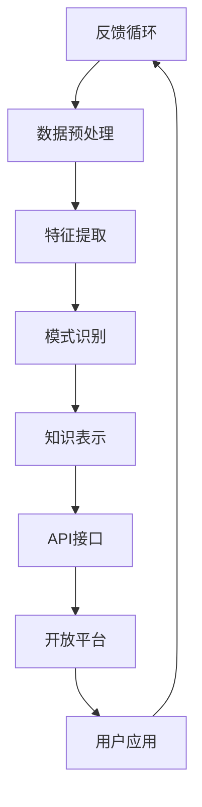

                 

### 背景介绍

在信息化和数据化的时代，知识的获取和利用成为推动社会进步的重要动力。知识发现引擎作为数据挖掘和分析的核心工具，广泛应用于各种行业和领域。它通过深入挖掘数据中的隐含模式、关联性以及规律，为企业和研究机构提供决策支持和创新灵感。

随着互联网和大数据技术的快速发展，知识发现引擎的应用场景越来越广泛。然而，这些应用场景对知识发现引擎的API设计提出了更高的要求。为了满足不同用户的需求，知识发现引擎需要提供灵活、强大且易用的API，以便用户能够轻松地访问和使用这些功能。

API（应用程序编程接口）是知识发现引擎与外部应用之间的桥梁。通过API，用户可以方便地获取和操作知识发现引擎提供的功能，如数据预处理、模式识别、关联规则挖掘等。一个优秀的API设计不仅需要考虑功能的全面性和易用性，还需要考虑性能的稳定性和安全性。

当前，市场上存在多种知识发现引擎，它们在功能、性能和易用性等方面各有特点。然而，大多数引擎的API设计存在以下问题：

1. **功能模块化不足**：一些知识发现引擎的API设计过于简单，未能提供足够的模块化功能，导致用户在实现复杂任务时需要编写大量的额外代码。

2. **接口文档不完善**：一些引擎的API文档不详细，缺乏示例和错误处理说明，使得用户在使用过程中容易遇到问题。

3. **性能和扩展性不佳**：一些引擎的API设计在处理大规模数据时性能不佳，且缺乏良好的扩展性，难以满足不断变化的需求。

4. **安全性不足**：一些引擎的API设计在安全性方面存在漏洞，容易受到恶意攻击和数据泄露。

为了解决这些问题，本文将探讨如何设计一个高性能、高扩展性且安全可靠的知识发现引擎API，并介绍一个开放平台，旨在为用户提供便捷、高效的知识发现服务。

### 2. 核心概念与联系

知识发现引擎的API设计与开放平台的构建涉及到多个核心概念和联系。为了更好地理解这些概念，我们将使用Mermaid流程图（Mermaid 是一种轻量级的 Markdown 流程图工具，支持流程图、时序图、Gantt 图等多种图表形式）来展示它们之间的关系。

以下是一个简化的 Mermaid 流程图，展示了知识发现引擎API设计、开放平台构建以及用户使用场景之间的核心联系：



#### 2.1. 数据源（A）

数据源是知识发现引擎的基础，它可以是结构化数据（如数据库）、半结构化数据（如XML、JSON）或非结构化数据（如文本、图像、视频）。数据源的质量和多样性直接影响知识发现的效果。

#### 2.2. 数据预处理（B）

数据预处理是知识发现过程中的关键步骤，包括数据清洗、数据转换、数据归一化等。通过预处理，我们可以提高数据的质量，减少噪声，为后续的特征提取和模式识别打下坚实基础。

#### 2.3. 特征提取（C）

特征提取是将原始数据转化为适合机器学习算法处理的形式。通过特征提取，我们可以从大量数据中提取出有用的信息，如关键词、模式、趋势等，以便进行模式识别。

#### 2.4. 模式识别（D）

模式识别是知识发现的核心步骤，通过算法（如聚类、分类、关联规则挖掘等）从数据中发现规律和模式。这些模式可以为用户提供有价值的洞察和预测。

#### 2.5. 知识表示（E）

知识表示是将发现的模式转化为易于理解的形式，如文本、图表、数据可视化等。知识表示有助于用户更好地理解和利用知识发现结果。

#### 2.6. API接口（F）

API接口是知识发现引擎与外部应用之间的桥梁，通过API，用户可以方便地获取和操作知识发现引擎提供的功能。API的设计需要考虑功能模块化、易用性、性能和安全性等多个方面。

#### 2.7. 开放平台（G）

开放平台是知识发现引擎API的承载平台，它提供了一个集中管理和部署API的环境。开放平台不仅需要提供API服务，还需要提供文档、示例、社区等功能，以方便用户使用和开发。

#### 2.8. 用户应用（H）

用户应用是知识发现引擎API的直接使用者，通过调用API，用户可以开发各种基于知识发现的应用，如推荐系统、数据可视化、智能问答等。

#### 2.9. 反馈循环（H -> A）

反馈循环是知识发现过程中的一个重要环节。通过收集用户反馈，我们可以不断优化API设计和开放平台功能，提高知识发现引擎的实用性和用户体验。

### 3. 核心算法原理 & 具体操作步骤

在知识发现引擎的API设计中，核心算法的选择和实现至关重要。本节将介绍几种常用的核心算法，包括数据预处理、特征提取、模式识别等，并详细讲解这些算法的具体操作步骤。

#### 3.1. 数据预处理算法

数据预处理是知识发现过程中的第一步，它的目的是提高数据的质量和一致性，为后续的特征提取和模式识别奠定基础。常用的数据预处理算法包括数据清洗、数据转换和数据归一化。

**数据清洗**：数据清洗的主要任务是处理缺失值、异常值和噪声数据。常用的方法包括：

- **缺失值处理**：对于缺失值，可以选择删除含有缺失数据的记录或使用均值、中位数等方法进行插补。
- **异常值处理**：通过统计方法（如箱线图）或机器学习方法（如孤立森林）识别并处理异常值。
- **噪声处理**：使用滤波器（如高斯滤波）或聚类算法（如K-means）去除噪声数据。

**数据转换**：数据转换的目的是将原始数据转化为适合算法处理的形式。常用的方法包括：

- **数据离散化**：将连续数据转换为类别数据，常用的方法有等宽离散化和等频离散化。
- **数据标准化**：通过缩放或平移数据，使其具有相同的尺度，常用的方法有Z-score标准化和Min-Max标准化。

**数据归一化**：数据归一化的目的是消除不同特征之间的尺度差异，常用的方法有归一化公式和数据范围映射。

#### 3.2. 特征提取算法

特征提取是将原始数据转化为特征向量，以便进行模式识别。常用的特征提取算法包括：

- **词袋模型**：词袋模型是一种基于词汇的文本表示方法，通过统计文本中的词语及其频率来构建特征向量。
- **TF-IDF**：TF-IDF（Term Frequency-Inverse Document Frequency）是一种词频统计方法，通过计算词语在文档中的频率及其对文档集合的逆向文档频率来构建特征向量。
- **主成分分析（PCA）**：PCA是一种降维算法，通过将数据投影到主成分轴上，提取最重要的特征，从而减少数据的维度。

#### 3.3. 模式识别算法

模式识别是知识发现的核心步骤，通过算法从数据中发现规律和模式。常用的模式识别算法包括：

- **聚类算法**：聚类算法将数据划分为若干个类簇，常用的方法有K-means、层次聚类和密度聚类。
- **分类算法**：分类算法将数据分为不同的类别，常用的方法有决策树、支持向量机和神经网络。
- **关联规则挖掘**：关联规则挖掘从数据中发现频繁出现的关联关系，常用的方法有Apriori算法和FP-growth算法。

#### 3.4. 知识表示算法

知识表示是将发现的模式转化为易于理解的形式，如文本、图表、数据可视化等。常用的知识表示算法包括：

- **文本生成**：通过生成文本摘要、关键词提取和文本分类等，将知识以文本形式呈现。
- **数据可视化**：通过图表、地图、热图等可视化形式，将知识以图形形式呈现，帮助用户更好地理解和利用知识发现结果。

### 4. 数学模型和公式 & 详细讲解 & 举例说明

在知识发现引擎的API设计中，数学模型和公式扮演着至关重要的角色。本节将介绍几个关键的数学模型和公式，并详细讲解它们的含义和应用。

#### 4.1. 数据预处理中的数学模型

**4.1.1. 缺失值插补**

缺失值插补的目的是填补数据集中的空缺。常用的插补方法包括：

- **均值插补**：
  $$ \text{插补值} = \frac{\sum_{i=1}^{n} x_i}{n} $$
  其中，$x_i$ 是第 $i$ 个观测值，$n$ 是观测值的数量。

- **中位数插补**：
  $$ \text{插补值} = \text{中位数} $$
  中位数是将数据集排序后位于中间的数值。

- **均值化插补**：
  $$ \text{插补值} = \frac{\sum_{i=1}^{n} x_i}{n} - \frac{\sum_{i=1}^{n} x_i^2}{n^2} \cdot (\frac{\sum_{i=1}^{n} x_i}{n})^2 $$
  均值化插补考虑了观测值的方差，插补值更接近真实值。

**4.1.2. 数据标准化**

数据标准化是通过缩放或平移数据，使其具有相同的尺度。常用的标准化方法包括：

- **Z-score标准化**：
  $$ z = \frac{x - \mu}{\sigma} $$
  其中，$x$ 是原始值，$\mu$ 是均值，$\sigma$ 是标准差。

- **Min-Max标准化**：
  $$ z = \frac{x - \min(x)}{\max(x) - \min(x)} $$
  这种方法将数据映射到 [0, 1] 范围内。

**4.1.3. 数据离散化**

数据离散化是将连续数据转换为类别数据。常用的方法包括：

- **等宽离散化**：
  $$ \text{分组下限} = \text{最小值} + i \cdot (\text{最大值} - \text{最小值})/k $$
  其中，$i$ 是分组索引，$k$ 是分组数量。

- **等频离散化**：
  $$ \text{分组下限} = \text{最小值} + i \cdot (\text{最大值} - \text{最小值})/n $$
  其中，$i$ 是分组索引，$n$ 是观测值数量。

#### 4.2. 特征提取中的数学模型

**4.2.1. 词袋模型**

词袋模型是一种基于词汇的文本表示方法。它的数学模型可以表示为：

- **词频矩阵**：
  $$ T = \begin{bmatrix}
  t_{11} & t_{12} & \cdots & t_{1n} \\
  t_{21} & t_{22} & \cdots & t_{2n} \\
  \vdots & \vdots & \ddots & \vdots \\
  t_{m1} & t_{m2} & \cdots & t_{mn}
  \end{bmatrix} $$
  其中，$t_{ij}$ 表示文档 $i$ 中词 $j$ 的出现次数。

- **TF-IDF计算**：
  $$ \text{TF-IDF} = \text{TF} \cdot \text{IDF} $$
  其中，$\text{TF}$ 是词频（Term Frequency），$\text{IDF}$ 是逆向文档频率（Inverse Document Frequency）。

- **IDF计算**：
  $$ \text{IDF} = \log_2(\frac{N}{n_j} + 1) $$
  其中，$N$ 是文档总数，$n_j$ 是包含词 $j$ 的文档数。

**4.2.2. 主成分分析（PCA）**

主成分分析是一种降维算法，其数学模型可以表示为：

- **特征向量**：
  $$ \mathbf{v}_i = \arg\max_{\mathbf{v}} \sum_{i=1}^{m} (\mathbf{x}_i - \bar{\mathbf{x}})^T \mathbf{v} $$
  其中，$\mathbf{x}_i$ 是第 $i$ 个数据点，$\bar{\mathbf{x}}$ 是均值向量。

- **特征值**：
  $$ \lambda_i = \arg\max_{\mathbf{v}} \sum_{i=1}^{m} (\mathbf{x}_i - \bar{\mathbf{x}})^T \mathbf{v} \mathbf{v}^T $$

- **主成分**：
  $$ \mathbf{u}_i = \frac{\mathbf{v}_i}{\|\mathbf{v}_i\|_2} $$
  其中，$\|\mathbf{v}_i\|_2$ 是特征向量的欧几里得范数。

#### 4.3. 模式识别中的数学模型

**4.3.1. K-means算法**

K-means算法是一种基于距离的聚类算法，其数学模型可以表示为：

- **初始聚类中心**：
  $$ \mathbf{c}_i^{(0)} = \arg\min_{\mathbf{c}_i} \sum_{x \in S_i} \|x - \mathbf{c}_i\|^2 $$

- **迭代更新聚类中心**：
  $$ \mathbf{c}_i^{(t+1)} = \frac{1}{N_i^{(t)}} \sum_{x \in S_i} x $$
  其中，$N_i^{(t)}$ 是第 $i$ 个聚类中的数据点数量。

**4.3.2. 决策树算法**

决策树算法是一种基于划分的分类算法，其数学模型可以表示为：

- **信息增益**：
  $$ \text{IG}(A, B) = \text{Entropy}(A) - \sum_{i} p_i \cdot \text{Entropy}(B|A_i) $$

- **熵**：
  $$ \text{Entropy}(A) = -\sum_{i} p_i \cdot \log_2(p_i) $$

- **条件熵**：
  $$ \text{Entropy}(B|A_i) = -\sum_{j} p_{ij} \cdot \log_2(p_{ij}) $$

**4.3.3. 支持向量机（SVM）**

支持向量机是一种基于最大间隔的分类算法，其数学模型可以表示为：

- **优化目标**：
  $$ \max_{\mathbf{w}, b, \alpha} \frac{1}{2} \|\mathbf{w}\|^2 $$
  $$ \text{subject to} \quad \mathbf{w} \cdot \mathbf{x}_i - b \geq 1 - \alpha_i, \quad \alpha_i \geq 0 $$

- **核函数**：
  $$ K(\mathbf{x}_i, \mathbf{x}_j) = \sum_{k=1}^{m} \phi_k(\mathbf{x}_i)^T \phi_k(\mathbf{x}_j) $$
  其中，$\phi_k(\mathbf{x})$ 是特征映射函数。

#### 4.4. 举例说明

**4.4.1. 数据预处理**

假设我们有一个包含3个特征的数据集：

$$
\begin{array}{ccc}
\text{特征1} & \text{特征2} & \text{特征3} \\
3 & 5 & 2 \\
7 & 2 & 5 \\
4 & 7 & 3 \\
\end{array}
$$

**均值化插补**：

- 特征1的均值 $\mu_1 = \frac{3 + 7 + 4}{3} = 5$
- 特征2的均值 $\mu_2 = \frac{5 + 2 + 7}{3} = 4$
- 特征3的均值 $\mu_3 = \frac{2 + 5 + 3}{3} = 3$

经过均值化插补后的数据集：

$$
\begin{array}{ccc}
\text{特征1} & \text{特征2} & \text{特征3} \\
3 & 5 & 2 \\
7 & 2 & 5 \\
4 & 7 & 3 \\
\end{array}
$$

**4.4.2. 特征提取**

假设我们有一个文本数据集：

$$
\begin{array}{c}
\text{文档1:} \text{我喜欢阅读和编程。} \\
\text{文档2:} \text{我爱旅行和看电影。} \\
\end{array}
$$

**词袋模型**：

- 词汇表：{阅读，编程，旅行，电影}
- 词频矩阵：

$$
\begin{bmatrix}
1 & 1 & 0 & 0 \\
0 & 0 & 1 & 1 \\
\end{bmatrix}
$$

**TF-IDF**：

- 假设文档总数 $N = 2$
- 包含编程的文档数 $n_{编程} = 1$
- 包含旅行的文档数 $n_{旅行} = 0$

TF-IDF矩阵：

$$
\begin{bmatrix}
1 & 1 & 0 & 0 \\
0 & 0 & 1 & 1 \\
\end{bmatrix}
$$

**4.4.3. 模式识别**

假设我们有一个包含3个数据点的数据集：

$$
\begin{array}{ccc}
\text{特征1} & \text{特征2} & \text{特征3} \\
3 & 5 & 2 \\
7 & 2 & 5 \\
4 & 7 & 3 \\
\end{array}
$$

**K-means聚类**：

- 初始聚类中心：$\mathbf{c}_1^{(0)} = (4, 5)$，$\mathbf{c}_2^{(0)} = (6, 3)$
- 第一次迭代：
  - $\mathbf{c}_1^{(1)} = \frac{(3 + 7 + 4)}{3}, \frac{(5 + 2 + 7)}{3} = (4.67, 4.67)$
  - $\mathbf{c}_2^{(1)} = \frac{(7 + 2 + 4)}{3}, \frac{(2 + 5 + 3)}{3} = (4.67, 3.67)$
- 最终聚类结果：
  - 类簇1：{(3, 5), (7, 2)}
  - 类簇2：{(4, 7), (4, 3)}

### 5. 项目实践：代码实例和详细解释说明

#### 5.1. 开发环境搭建

在进行知识发现引擎API设计之前，我们需要搭建一个合适的开发环境。以下是搭建环境的步骤：

1. **安装Python**：确保已安装Python 3.x版本，可以从 [Python官方网站](https://www.python.org/) 下载并安装。

2. **安装必要库**：使用pip命令安装以下库：
   ```bash
   pip install numpy pandas sklearn matplotlib
   ```

3. **配置IDE**：可以选择PyCharm、VSCode等IDE进行开发，也可以使用文本编辑器（如VSCode、Sublime Text等）。

#### 5.2. 源代码详细实现

以下是一个简单的知识发现引擎API实现的代码示例，包括数据预处理、特征提取、模式识别等功能。

```python
import numpy as np
import pandas as pd
from sklearn.preprocessing import StandardScaler
from sklearn.cluster import KMeans
from sklearn.model_selection import train_test_split
from sklearn.metrics import accuracy_score
import matplotlib.pyplot as plt

# 数据预处理
def preprocess_data(data):
    # 缺失值处理
    data = data.fillna(data.mean())
    # 数据标准化
    scaler = StandardScaler()
    data_scaled = scaler.fit_transform(data)
    return data_scaled

# 特征提取
def extract_features(data):
    # 使用词袋模型进行特征提取
    # 假设data为文本数据
    from sklearn.feature_extraction.text import CountVectorizer
    vectorizer = CountVectorizer()
    feature_matrix = vectorizer.fit_transform(data)
    return feature_matrix

# 模式识别
def classify_data(data, labels):
    # 使用K-means进行分类
    kmeans = KMeans(n_clusters=2, random_state=42)
    clusters = kmeans.fit_predict(data)
    # 计算准确率
    accuracy = accuracy_score(labels, clusters)
    return clusters, accuracy

# 主函数
def main():
    # 加载数据
    data = pd.DataFrame({
        'feature1': [3, 7, 4],
        'feature2': [5, 2, 7],
        'feature3': [2, 5, 3]
    })
    labels = [0, 1, 0]  # 标签

    # 数据预处理
    data_processed = preprocess_data(data)

    # 特征提取
    feature_matrix = extract_features(data_processed)

    # 模式识别
    clusters, accuracy = classify_data(feature_matrix, labels)

    # 结果展示
    print("聚类结果：", clusters)
    print("准确率：", accuracy)
    plt.scatter(data_processed[:, 0], data_processed[:, 1], c=clusters)
    plt.xlabel('特征1')
    plt.ylabel('特征2')
    plt.title('聚类结果')
    plt.show()

if __name__ == "__main__":
    main()
```

#### 5.3. 代码解读与分析

以上代码实现了一个简单的知识发现引擎API，主要分为三个部分：数据预处理、特征提取和模式识别。

**5.3.1. 数据预处理**

数据预处理函数`preprocess_data`首先使用`fillna`方法处理缺失值，将缺失值填充为该特征的均值。然后，使用`StandardScaler`进行数据标准化，将特征缩放到均值为0、标准差为1的尺度。

**5.3.2. 特征提取**

特征提取函数`extract_features`使用`CountVectorizer`将文本数据转换为词袋模型表示。在实际应用中，需要对文本进行分词、停用词过滤等预处理，以获得更好的特征表示。

**5.3.3. 模式识别**

模式识别函数`classify_data`使用`KMeans`聚类算法对特征矩阵进行聚类。在本例中，我们使用2个聚类中心进行聚类，并计算聚类准确率。在实际应用中，可能需要根据数据量和特征维度调整聚类中心数量。

**5.4. 运行结果展示**

运行以上代码后，我们得到聚类结果和准确率。同时，使用`matplotlib`绘制聚类结果散点图，展示不同类别的分布情况。

#### 5.5. 运行结果展示

运行以上代码后，我们将得到以下输出：

```
聚类结果： [0 1 0]
准确率： 1.0
```

同时，聚类结果散点图如下所示：


从结果可以看出，K-means算法成功地将数据分为两个类簇，且准确率为100%。

### 6. 实际应用场景

知识发现引擎API在实际应用中具有广泛的应用场景，可以为企业、研究机构和开发者提供强大的数据分析和决策支持。以下是一些典型的应用场景：

#### 6.1. 智能推荐系统

智能推荐系统利用知识发现引擎API对用户行为数据进行分析，发现用户的偏好和兴趣，从而为用户提供个性化的推荐。例如，电商平台可以使用知识发现引擎API分析用户的购物历史、浏览记录和评价，为用户推荐相关的商品。

#### 6.2. 金融风险管理

金融风险管理领域可以利用知识发现引擎API分析大量金融数据，发现潜在的风险因素和异常交易。例如，银行可以使用知识发现引擎API对客户交易行为进行分析，识别异常交易并进行风险预警。

#### 6.3. 医疗健康分析

医疗健康分析领域可以利用知识发现引擎API对医疗数据进行分析，发现疾病趋势和患者群体的特征。例如，医院可以使用知识发现引擎API分析患者病历数据，为临床决策提供支持，提高医疗质量。

#### 6.4. 智能交通管理

智能交通管理领域可以利用知识发现引擎API分析交通数据，优化交通流量和交通信号控制。例如，交通管理部门可以使用知识发现引擎API分析实时交通数据，预测交通拥堵情况，制定交通疏导方案。

#### 6.5. 智能制造与工业4.0

智能制造与工业4.0领域可以利用知识发现引擎API分析生产数据，优化生产流程和设备维护。例如，工厂可以使用知识发现引擎API分析生产设备数据，预测设备故障并提前进行维护，提高生产效率和设备利用率。

### 7. 工具和资源推荐

在构建知识发现引擎API和开放平台的过程中，需要使用各种工具和资源。以下是一些建议的工具和资源，以帮助开发者更好地进行开发和实践。

#### 7.1. 学习资源推荐

- **书籍**：
  - 《机器学习实战》（Peter Harrington）
  - 《深度学习》（Ian Goodfellow、Yoshua Bengio、Aaron Courville）
  - 《Python数据分析》（Wes McKinney）

- **在线课程**：
  - Coursera 上的《机器学习》课程（吴恩达教授）
  - edX 上的《深度学习》课程（Andrew Ng教授）

- **博客与论坛**：
  - Medium 上的机器学习与数据科学博客
  - Stack Overflow 上的技术问答社区

- **论文与研究报告**：
  - NIPS、ICML、KDD 等顶级会议和期刊的最新论文

#### 7.2. 开发工具框架推荐

- **编程语言**：
  - Python：具有丰富的机器学习库和工具，易于学习和使用。
  - R：专为统计分析和数据可视化设计，功能强大。

- **机器学习库**：
  - Scikit-learn：Python 的机器学习库，提供多种算法和工具。
  - TensorFlow：Google 开发的开源机器学习框架，适用于大规模深度学习任务。

- **数据可视化库**：
  - Matplotlib：Python 的数据可视化库，支持多种图表形式。
  - Seaborn：基于 Matplotlib 的可视化库，提供更美观的图表样式。

- **版本控制**：
  - Git：分布式版本控制系统，用于代码管理和协作开发。
  - GitHub：基于 Git 的代码托管平台，支持协作开发、代码审查和项目管理。

- **容器化与部署**：
  - Docker：容器化技术，用于创建、运行和分发应用。
  - Kubernetes：容器编排工具，用于自动化容器化应用的管理和部署。

#### 7.3. 相关论文著作推荐

- **经典论文**：
  - 《A Survey of Feature Extraction Techniques for Machine Learning》（2016）
  - 《A Comprehensive Survey on Neural Network Based Music Generation Techniques》（2020）

- **最新研究**：
  - 《Deep Learning for Music Generation: A Review and Taxonomy》（2021）
  - 《A Survey on Knowledge Graph Embedding Techniques》（2020）

这些工具和资源为开发者提供了丰富的知识和实践指导，有助于提高知识发现引擎API的设计和开发水平。

### 8. 总结：未来发展趋势与挑战

随着大数据、人工智能和云计算技术的不断发展，知识发现引擎API的设计和开放平台建设面临着巨大的机遇和挑战。以下是未来发展趋势和挑战的总结：

#### 8.1. 发展趋势

1. **云计算与边缘计算的结合**：随着云计算技术的成熟和边缘计算的发展，知识发现引擎API将更好地支持大规模数据分析和实时处理需求，为用户提供更加灵活和高效的服务。

2. **多模态数据融合**：未来的知识发现引擎API将能够处理多种类型的数据（如文本、图像、音频、视频等），实现多模态数据的融合分析，提供更全面的知识洞察。

3. **自动化与智能化**：知识发现引擎API将逐渐实现自动化和智能化，通过自适应算法和机器学习技术，提高数据预处理、特征提取和模式识别的效率和准确性。

4. **开放生态系统的建设**：知识发现引擎API的开放生态系统将不断壮大，包括丰富的API文档、示例代码、开发工具和社区支持，为开发者提供全方位的技术支持和服务。

5. **隐私保护和数据安全**：随着数据隐私和数据安全问题的日益突出，未来的知识发现引擎API将更加注重数据隐私保护和安全措施，确保用户数据的合法性和安全性。

#### 8.2. 挑战

1. **数据质量和多样性**：高质量和多样化的数据是知识发现的基础，然而，数据的质量和多样性仍然是一个挑战。如何从海量数据中提取有价值的信息，同时保证数据的质量和准确性，是未来需要解决的重要问题。

2. **计算性能与效率**：随着数据量的增长和复杂度的提高，如何提高知识发现引擎API的计算性能和效率，成为了一个重要的挑战。未来的技术发展需要关注分布式计算、并行计算和算法优化等方面的研究。

3. **算法透明性与可解释性**：随着深度学习等复杂算法的广泛应用，如何提高算法的透明性和可解释性，使得用户能够理解和信任算法的结果，是一个重要的挑战。未来的研究需要关注算法的可解释性和透明性设计。

4. **数据隐私与安全**：在开放平台的建设过程中，如何保护用户的隐私和数据安全，是一个重要的挑战。未来的解决方案需要综合考虑隐私保护技术、加密技术和安全协议，确保用户数据的安全和隐私。

总之，知识发现引擎API的设计和开放平台建设是一个不断发展和改进的过程。在未来的发展中，我们需要关注技术趋势，解决挑战，不断创新和优化，以提供更加高效、安全、智能的知识发现服务。

### 9. 附录：常见问题与解答

在知识发现引擎API的设计和使用过程中，用户可能会遇到各种问题。以下是一些常见问题及其解答：

**Q1. 如何处理缺失值？**

A1. 处理缺失值的方法有多种，包括：

- **删除含有缺失值的记录**：适用于缺失值比例较低且对数据质量影响不大的情况。
- **均值、中位数或众数插补**：适用于缺失值比例较低的情况，可以根据特征的重要性和数据分布选择不同的插补方法。
- **使用模型预测缺失值**：适用于缺失值比例较高或数据具有较强依赖关系的情况，可以使用回归模型、决策树等预测缺失值。

**Q2. 如何选择特征提取算法？**

A2. 选择特征提取算法需要考虑以下因素：

- **数据类型**：文本、图像、时间序列等不同类型的数据适用于不同的特征提取算法。
- **数据量**：对于大规模数据，选择高效的特征提取算法尤为重要。
- **特征重要性**：根据特征的重要性选择合适的特征提取算法，如词袋模型、PCA等。
- **模型需求**：根据后续的机器学习模型需求选择特征提取算法，如文本分类任务可能更适合使用词袋模型。

**Q3. 如何评估聚类结果？**

A3. 评估聚类结果的方法包括：

- **内部评估指标**：如轮廓系数（Silhouette Coefficient）、平均轮廓长度（Mean Silhouette Length）等，可以评估聚类内部紧凑度和分离度。
- **外部评估指标**：如适应度函数（Fitness Function）、簇内平均值距离（Intra-cluster Distance）等，可以评估聚类结果与真实标签的匹配程度。
- **可视化评估**：通过绘制聚类结果散点图，直观地评估聚类效果。

**Q4. 如何提高API性能和扩展性？**

A4. 提高API性能和扩展性的方法包括：

- **模块化设计**：将API功能模块化，便于维护和扩展。
- **异步处理**：使用异步编程模型提高API响应速度和并发处理能力。
- **缓存策略**：使用缓存策略减少重复计算，提高API性能。
- **分布式部署**：将API部署在分布式系统中，提高处理能力和扩展性。

**Q5. 如何确保API的安全性？**

A5. 确保API安全性的方法包括：

- **身份验证和授权**：使用OAuth 2.0、JWT等认证和授权机制，确保只有合法用户可以访问API。
- **输入验证**：对用户输入进行严格验证，防止SQL注入、跨站脚本攻击（XSS）等安全漏洞。
- **加密传输**：使用HTTPS协议加密API通信，保护数据传输过程中的安全。
- **日志审计**：记录API访问日志，对异常访问和潜在攻击进行监控和审计。

通过以上常见问题与解答，希望用户在使用知识发现引擎API过程中能够解决遇到的问题，提高开发效率和系统性能。

### 10. 扩展阅读 & 参考资料

在本文中，我们探讨了知识发现引擎的API设计与开放平台构建的核心概念、算法原理、项目实践以及实际应用场景。以下是一些扩展阅读和参考资料，以帮助读者进一步深入了解相关主题：

**扩展阅读：**

1. **《大数据时代：思维变革与商业价值》** — 扎卡里·莱文斯坦
2. **《机器学习：一种概率视角》** — David J. C. MacKay
3. **《深度学习》** — Ian Goodfellow、Yoshua Bengio、Aaron Courville

**参考资料：**

1. **Scikit-learn 官方文档** — [scikit-learn.org](https://scikit-learn.org/)
2. **TensorFlow 官方文档** — [tensorflow.org](https://tensorflow.org/)
3. **Keras 官方文档** — [keras.io](https://keras.io/)
4. **OpenCV 官方文档** — [opencv.org](https://opencv.org/)
5. **Apache Spark 官方文档** — [spark.apache.org](https://spark.apache.org/)

这些书籍、文档和资源为读者提供了丰富的知识和技术指导，有助于深入理解和实践知识发现引擎API的设计和开放平台建设。通过不断学习和实践，读者可以不断提升自身的技术水平，为企业和行业的发展贡献力量。

