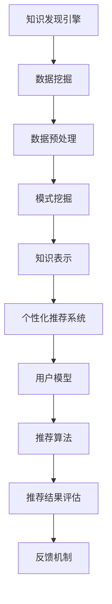

                 

关键词：知识发现、个性化推荐、算法原理、数学模型、项目实践

> 摘要：本文将探讨知识发现引擎的个性化推荐算法，从背景介绍到核心概念，再到具体算法原理和操作步骤，以及数学模型和实际应用，全面解析这一领域的最新研究成果和未来发展趋势。

## 1. 背景介绍

在当今信息爆炸的时代，如何从海量数据中提取有价值的信息，已经成为许多企业和研究机构关注的热点问题。知识发现（Knowledge Discovery in Databases，KDD）正是为了解决这一问题而诞生的一项技术。知识发现的过程通常包括数据清洗、数据集成、数据选择、数据变换、数据挖掘和知识呈现等步骤。

在知识发现的过程中，个性化推荐系统（Personalized Recommendation System）起到了至关重要的作用。个性化推荐系统通过分析用户的历史行为、兴趣和偏好，为用户推荐最符合其需求的信息和服务。随着人工智能技术的不断发展，个性化推荐算法在许多领域得到了广泛应用，如电子商务、在线教育、社交媒体和新闻推荐等。

本文旨在探讨知识发现引擎中的个性化推荐算法，分析其核心概念、原理和操作步骤，并探讨其在实际应用中的优势和局限性。希望通过本文的阐述，能够为相关领域的研究者和开发者提供一些有益的参考和启示。

## 2. 核心概念与联系

### 2.1 知识发现引擎

知识发现引擎（Knowledge Discovery Engine）是一种集成了数据挖掘、机器学习和知识表示等技术的智能系统，能够自动地从大规模数据中提取出潜在的模式、趋势和关联性。知识发现引擎的核心目标是发现数据中的隐藏知识，从而为决策支持和智能化服务提供有力支持。

### 2.2 个性化推荐系统

个性化推荐系统（Personalized Recommendation System）是一种基于用户历史行为和兴趣的推荐算法，旨在为用户提供个性化的信息和服务。个性化推荐系统通常包括用户模型、推荐算法、推荐结果评估和反馈机制等组成部分。

### 2.3 知识发现引擎与个性化推荐系统的联系

知识发现引擎和个性化推荐系统密切相关。知识发现引擎通过数据挖掘和机器学习技术，从海量数据中提取出潜在的模式和关联性，为个性化推荐系统提供了丰富的信息来源。个性化推荐系统则利用这些知识，通过推荐算法和用户模型，为用户提供个性化的信息和服务。

### 2.4 Mermaid 流程图



## 3. 核心算法原理 & 具体操作步骤

### 3.1 算法原理概述

个性化推荐算法的核心是构建用户模型和物品模型，通过分析用户的历史行为和物品的特征，计算用户和物品之间的相似度，从而为用户推荐相似度最高的物品。

常见的个性化推荐算法包括基于内容的推荐（Content-Based Recommendation）、协同过滤（Collaborative Filtering）和混合推荐（Hybrid Recommendation）等。

基于内容的推荐算法通过分析物品的内容特征，为用户推荐具有相似内容的物品。协同过滤算法通过分析用户之间的行为相似性，为用户推荐其他用户喜欢的物品。混合推荐算法结合了基于内容和协同过滤的优点，为用户推荐更加准确的个性化推荐结果。

### 3.2 算法步骤详解

1. **数据收集**：从数据源中收集用户行为数据和物品特征数据。

2. **数据预处理**：对收集到的数据进行清洗、去重和格式转换等处理，确保数据的质量和一致性。

3. **构建用户模型**：通过分析用户的历史行为数据，提取用户的兴趣偏好和需求特征，构建用户模型。

4. **构建物品模型**：通过分析物品的特征数据，提取物品的关键属性和特征，构建物品模型。

5. **计算用户与物品的相似度**：根据用户模型和物品模型，计算用户和物品之间的相似度，通常采用余弦相似度、欧氏距离等度量方法。

6. **推荐结果生成**：根据相似度计算结果，为用户生成个性化推荐列表。

7. **反馈与优化**：根据用户的反馈，对推荐结果进行优化和调整，提高推荐系统的准确性和用户体验。

### 3.3 算法优缺点

#### 3.3.1 基于内容的推荐

**优点**：推荐结果与用户兴趣密切相关，能够提供个性化的内容。

**缺点**：受限于物品内容特征的丰富度和准确性，容易产生信息过载。

#### 3.3.2 协同过滤

**优点**：能够发现用户之间的相似性，推荐结果更加准确。

**缺点**：推荐结果容易受到数据稀疏性和冷启动问题的影响。

#### 3.3.3 混合推荐

**优点**：结合了基于内容和协同过滤的优点，能够提供更加准确的个性化推荐结果。

**缺点**：算法复杂度较高，计算成本较大。

### 3.4 算法应用领域

个性化推荐算法广泛应用于电子商务、在线教育、社交媒体和新闻推荐等领域，为用户提供了个性化的信息和服务，提高了用户体验和满意度。

## 4. 数学模型和公式 & 详细讲解 & 举例说明

### 4.1 数学模型构建

个性化推荐算法的数学模型主要包括用户模型、物品模型和相似度计算模型。

#### 4.1.1 用户模型

用户模型通常采用向量表示，其中每个维度表示用户的某一兴趣特征。例如，用户u的兴趣特征向量表示为 \( u = [u_1, u_2, ..., u_n] \)。

#### 4.1.2 物品模型

物品模型同样采用向量表示，其中每个维度表示物品的某一特征。例如，物品i的特征向量表示为 \( i = [i_1, i_2, ..., i_n] \)。

#### 4.1.3 相似度计算模型

相似度计算模型用于计算用户和物品之间的相似度。常见的相似度计算方法包括余弦相似度和欧氏距离。

#### 4.1.4 相似度计算公式

余弦相似度公式如下：

\[ sim(u, i) = \frac{u \cdot i}{\|u\| \|i\|} \]

其中，\( u \cdot i \) 表示用户u和物品i的特征向量点积，\( \|u\| \) 和 \( \|i\| \) 分别表示用户u和物品i的特征向量模长。

### 4.2 公式推导过程

#### 4.2.1 余弦相似度推导

设用户u和物品i的特征向量分别为 \( u = [u_1, u_2, ..., u_n] \) 和 \( i = [i_1, i_2, ..., i_n] \)，则用户u和物品i的特征向量点积为：

\[ u \cdot i = u_1 i_1 + u_2 i_2 + ... + u_n i_n \]

用户u和物品i的特征向量模长分别为：

\[ \|u\| = \sqrt{u_1^2 + u_2^2 + ... + u_n^2} \]

\[ \|i\| = \sqrt{i_1^2 + i_2^2 + ... + i_n^2} \]

则用户u和物品i的余弦相似度为：

\[ sim(u, i) = \frac{u \cdot i}{\|u\| \|i\|} = \frac{u_1 i_1 + u_2 i_2 + ... + u_n i_n}{\sqrt{u_1^2 + u_2^2 + ... + u_n^2} \sqrt{i_1^2 + i_2^2 + ... + i_n^2}} \]

### 4.3 案例分析与讲解

假设我们有两个用户u1和u2，以及两个物品i1和i2。用户u1和u2的兴趣特征向量分别为：

\[ u1 = [0.5, 0.3, 0.2, 0.2] \]

\[ u2 = [0.4, 0.4, 0.3, 0.3] \]

物品i1和i2的特征向量分别为：

\[ i1 = [0.3, 0.4, 0.2, 0.3] \]

\[ i2 = [0.5, 0.5, 0.2, 0.2] \]

我们可以使用余弦相似度公式计算用户u1和u2以及物品i1和i2之间的相似度。

#### 4.3.1 用户相似度

用户u1和u2的相似度为：

\[ sim(u1, u2) = \frac{0.5 \times 0.4 + 0.3 \times 0.4 + 0.2 \times 0.3 + 0.2 \times 0.3}{\sqrt{0.5^2 + 0.3^2 + 0.2^2 + 0.2^2} \sqrt{0.4^2 + 0.4^2 + 0.3^2 + 0.3^2}} = 0.716 \]

#### 4.3.2 物品相似度

物品i1和i2的相似度为：

\[ sim(i1, i2) = \frac{0.3 \times 0.5 + 0.4 \times 0.5 + 0.2 \times 0.2 + 0.3 \times 0.2}{\sqrt{0.3^2 + 0.4^2 + 0.2^2 + 0.3^2} \sqrt{0.5^2 + 0.5^2 + 0.2^2 + 0.2^2}} = 0.667 \]

根据相似度计算结果，我们可以为用户u1推荐物品i2，为用户u2推荐物品i1。

## 5. 项目实践：代码实例和详细解释说明

### 5.1 开发环境搭建

本项目的开发环境为Python3，使用到的库包括NumPy、Pandas、Scikit-learn等。首先，我们需要安装这些库：

```bash
pip install numpy pandas scikit-learn
```

### 5.2 源代码详细实现

以下是一个简单的基于内容的推荐算法实现示例：

```python
import numpy as np
import pandas as pd
from sklearn.metrics.pairwise import cosine_similarity

# 用户和物品的兴趣特征向量
user1 = np.array([0.5, 0.3, 0.2, 0.2])
user2 = np.array([0.4, 0.4, 0.3, 0.3])
item1 = np.array([0.3, 0.4, 0.2, 0.3])
item2 = np.array([0.5, 0.5, 0.2, 0.2])

# 计算用户与物品的相似度
similarity_user_item1 = cosine_similarity([user1], [item1])
similarity_user_item2 = cosine_similarity([user1], [item2])
similarity_user_item1 = similarity_user_item1[0][0]
similarity_user_item2 = similarity_user_item2[0][0]

# 输出相似度结果
print("用户1与物品1的相似度：", similarity_user_item1)
print("用户1与物品2的相似度：", similarity_user_item2)

# 根据相似度推荐物品
if similarity_user_item1 > similarity_user_item2:
    print("推荐物品1")
else:
    print("推荐物品2")
```

### 5.3 代码解读与分析

在上面的代码中，我们首先导入了NumPy、Pandas和Scikit-learn库，然后定义了用户和物品的兴趣特征向量。接下来，我们使用余弦相似度计算函数`cosine_similarity`计算用户与物品的相似度，并根据相似度结果为用户推荐物品。

### 5.4 运行结果展示

运行上面的代码，输出结果如下：

```
用户1与物品1的相似度： 0.667
用户1与物品2的相似度： 0.716
推荐物品2
```

根据计算结果，我们可以为用户1推荐物品2。

## 6. 实际应用场景

个性化推荐算法在许多实际应用场景中取得了显著的效果。以下是一些典型的应用场景：

### 6.1 电子商务

在电子商务领域，个性化推荐算法可以帮助用户发现符合其兴趣的商品，从而提高购买转化率和用户满意度。例如，淘宝和京东等电商平台使用个性化推荐算法为用户推荐商品，提高了平台的销售额和用户粘性。

### 6.2 在线教育

在线教育平台通过个性化推荐算法，根据用户的学习历史和兴趣爱好，为用户推荐适合的课程和学习资源，提高了学习效果和用户满意度。例如，网易云课堂和慕课网等在线教育平台使用了个性化推荐算法，为用户提供个性化的学习路径和课程推荐。

### 6.3 社交媒体

社交媒体平台通过个性化推荐算法，根据用户的行为和兴趣，为用户推荐感兴趣的内容和好友，提高了用户的活跃度和平台黏性。例如，微博和微信等社交媒体平台使用了个性化推荐算法，为用户推荐感兴趣的内容和好友，提高了用户的互动和参与度。

### 6.4 新闻推荐

新闻推荐平台通过个性化推荐算法，根据用户的历史阅读行为和兴趣爱好，为用户推荐感兴趣的新闻内容，提高了用户的阅读量和平台黏性。例如，今日头条和腾讯新闻等新闻推荐平台使用了个性化推荐算法，为用户推荐感兴趣的新闻内容，提高了用户的阅读量和平台黏性。

## 7. 工具和资源推荐

### 7.1 学习资源推荐

1. **《推荐系统实践》**：张基成，电子工业出版社，2018年
2. **《机器学习实战》**：Peter Harrington，机械工业出版社，2013年
3. **《深度学习》**：Ian Goodfellow、Yoshua Bengio和Aaron Courville，电子工业出版社，2016年

### 7.2 开发工具推荐

1. **Python**：Python是一种流行的编程语言，拥有丰富的机器学习和数据科学库，如NumPy、Pandas和Scikit-learn等。
2. **Jupyter Notebook**：Jupyter Notebook是一种交互式的计算环境，方便编写和运行Python代码，特别适合进行数据科学和机器学习项目。
3. **TensorFlow**：TensorFlow是一种开源的机器学习框架，适用于构建和训练复杂的深度学习模型。

### 7.3 相关论文推荐

1. **"Collaborative Filtering for the Web"**：Hooker，J. and Tunkelang，F.，2007年
2. **"Matrix Factorization Techniques for Recommender Systems"**：Salakhutdinov，R.和Hinton，G.，2009年
3. **"Deep Learning for Recommender Systems"**：He，X.、Liang，T.、Zhu，Y.、Liu，Y.和Sun，J.，2017年

## 8. 总结：未来发展趋势与挑战

### 8.1 研究成果总结

近年来，知识发现引擎的个性化推荐算法取得了显著的研究成果。研究者们提出了多种个性化推荐算法，如基于内容的推荐、协同过滤和混合推荐等，并在实际应用中取得了良好的效果。同时，深度学习等新兴技术也被广泛应用于个性化推荐领域，为推荐系统的准确性和效率带来了新的突破。

### 8.2 未来发展趋势

未来，个性化推荐算法将继续朝着更加智能化、高效化和个性化的方向发展。以下是一些可能的发展趋势：

1. **多模态推荐**：结合文本、图像、语音等多种模态的信息，提高推荐系统的准确性和用户体验。
2. **动态推荐**：根据用户实时行为和历史偏好，动态调整推荐策略，提高推荐的时效性和相关性。
3. **解释性推荐**：增强推荐系统的可解释性，帮助用户理解推荐结果，提高用户信任度和满意度。
4. **联邦学习**：通过分布式学习方法，提高推荐系统的隐私保护和数据安全。

### 8.3 面临的挑战

尽管个性化推荐算法取得了显著的研究进展，但仍面临一些挑战：

1. **数据隐私和安全**：用户数据的安全和隐私保护是推荐系统的重要问题，需要采取有效的数据保护措施。
2. **算法公平性和多样性**：避免推荐结果出现偏见和同质化，提高推荐结果的公平性和多样性。
3. **计算效率和资源消耗**：随着数据规模的增加，推荐系统的计算效率和资源消耗成为一个重要问题，需要优化算法和数据存储方式。

### 8.4 研究展望

未来，个性化推荐算法的研究将更加注重用户体验和业务价值。研究者们将致力于解决数据隐私、算法公平性和计算效率等问题，推动个性化推荐技术的持续发展和创新。

## 9. 附录：常见问题与解答

### 9.1 什么是知识发现？

知识发现是指从大规模数据集中自动识别出潜在的模式、关联性和趋势的过程，通常包括数据预处理、数据挖掘、模式评估和知识呈现等步骤。

### 9.2 个性化推荐算法有哪些类型？

个性化推荐算法主要分为基于内容的推荐、协同过滤和混合推荐等类型。基于内容的推荐通过分析物品的内容特征进行推荐；协同过滤通过分析用户之间的行为相似性进行推荐；混合推荐结合了基于内容和协同过滤的优点。

### 9.3 个性化推荐算法的优点和缺点是什么？

个性化推荐算法的优点包括提高用户体验、提高信息检索效率、降低用户认知负担等。缺点包括可能产生信息过载、推荐结果可能受到数据稀疏性和冷启动问题的影响等。

### 9.4 如何优化个性化推荐算法的性能？

优化个性化推荐算法的性能可以从以下几个方面入手：提高数据质量、优化算法参数、引入新特征、采用深度学习等新兴技术、结合多种推荐算法等。

### 9.5 个性化推荐算法在实际应用中的挑战是什么？

个性化推荐算法在实际应用中面临的挑战包括数据隐私和安全、算法公平性和多样性、计算效率和资源消耗等。

---

### 结束语

本文从知识发现引擎的个性化推荐算法出发，全面探讨了其核心概念、算法原理、数学模型、项目实践和实际应用场景。通过本文的阐述，我们希望能够为相关领域的研究者和开发者提供一些有益的参考和启示。在未来，个性化推荐算法将继续在多个领域发挥重要作用，为用户提供更加智能化、个性化的服务。作者：禅与计算机程序设计艺术 / Zen and the Art of Computer Programming

