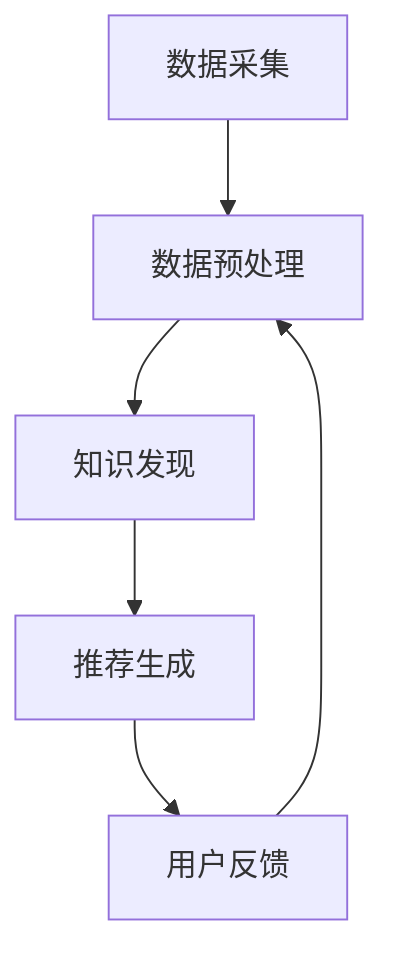

                 

### 1. 背景介绍

随着互联网的快速发展，信息量呈爆炸式增长。传统的搜索引擎已经无法满足用户对信息实时性的需求，因此，实时推荐系统应运而生。实时推荐系统可以实时分析用户的兴趣和行为，为用户推荐符合其兴趣的相关信息，从而提高用户满意度和用户体验。

实时推荐系统在很多领域都有广泛应用，例如电商、新闻、社交媒体等。以电商为例，实时推荐系统可以根据用户的浏览记录、购买行为等数据，为用户推荐符合其兴趣的商品。这样不仅可以提高用户的购物体验，还可以提高商家的销售额。

知识发现引擎作为实时推荐系统的重要组成部分，旨在从大规模数据中提取有价值的信息和知识。知识发现引擎可以识别数据中的模式、趋势和关联，从而为推荐系统提供更加精准的推荐结果。知识发现引擎的实时性要求高，需要快速处理大量数据并生成推荐结果，这对系统的性能和算法提出了极高的要求。

本文旨在介绍知识发现引擎在实时推荐系统中的应用，包括其核心概念、算法原理、数学模型和项目实践。通过本文的介绍，读者可以了解知识发现引擎的基本原理，掌握其具体实现方法，并能够应用于实际的推荐系统中。

### 2. 核心概念与联系

#### 2.1 定义

**知识发现引擎（Knowledge Discovery Engine）**：知识发现引擎是一种能够自动从大量数据中提取出有价值信息和知识的系统。它通常包括数据预处理、数据挖掘、模式识别和知识表示等模块。

**实时推荐系统（Real-time Recommendation System）**：实时推荐系统是一种能够根据用户的实时行为和兴趣，为用户实时推荐相关内容的系统。它通常包括数据采集、数据处理、推荐算法和用户反馈等模块。

#### 2.2 工作原理

知识发现引擎与实时推荐系统之间紧密相连，其工作原理如下：

1. **数据采集**：实时推荐系统通过多种渠道收集用户的行为数据，如浏览记录、点击行为、购买记录等。

2. **数据预处理**：对采集到的原始数据进行清洗、去噪和归一化等处理，使其符合数据挖掘的要求。

3. **知识发现**：利用知识发现引擎对预处理后的数据进行分析，识别数据中的潜在模式和关联。

4. **推荐生成**：根据分析结果，利用实时推荐算法为用户生成推荐列表。

5. **用户反馈**：收集用户对推荐内容的反馈，用于优化推荐算法和提升用户体验。

#### 2.3 Mermaid 流程图

下面是一个简化的知识发现引擎和实时推荐系统的 Mermaid 流程图，展示其核心组件和流程：



#### 2.4 核心概念之间的联系

知识发现引擎与实时推荐系统之间的联系主要体现在以下几个方面：

1. **数据源**：实时推荐系统的数据源是知识发现引擎的数据来源，知识发现引擎通过分析这些数据来提取有价值的信息。

2. **算法**：知识发现引擎提供的算法为实时推荐系统提供了高效的推荐算法支持，使其能够快速处理大量数据并生成高质量的推荐结果。

3. **用户反馈**：实时推荐系统通过用户反馈来不断优化推荐算法，而用户反馈又可以作为知识发现引擎的数据源，形成一个良性循环。

### 3. 核心算法原理 & 具体操作步骤

#### 3.1 算法概述

知识发现引擎的核心算法通常包括以下几种：

1. **关联规则挖掘（Association Rule Mining）**：识别数据中的关联规则，如“如果用户浏览了A商品，则很可能购买B商品”。

2. **聚类分析（Clustering Analysis）**：将数据划分为多个类别，如“将相似的用户划分为同一用户群体”。

3. **分类算法（Classification Algorithm）**：根据已有数据对新数据进行分类，如“根据用户的购买历史将其划分为‘高价值用户’或‘普通用户’”。

4. **异常检测（Anomaly Detection）**：识别数据中的异常或离群点，如“发现异常的购买行为或浏览行为”。

#### 3.2 关联规则挖掘

**原理**：关联规则挖掘旨在发现数据集中的隐含关联规则，通常使用支持度和置信度两个度量。

- **支持度（Support）**：表示一个规则在数据集中出现的频率。例如，规则“购买A商品→购买B商品”的支持度为30%。

- **置信度（Confidence）**：表示一个规则的可靠性。例如，规则“购买A商品→购买B商品”的置信度为70%。

**步骤**：

1. **选择最小支持度和最小置信度阈值**：根据业务需求和数据特征，设置合理的最小支持度和最小置信度阈值。

2. **生成频繁项集**：扫描数据集，找出支持度大于最小支持度阈值的频繁项集。

3. **生成关联规则**：从频繁项集中生成满足最小置信度阈值的关联规则。

4. **筛选规则**：根据业务需求，对生成的关联规则进行筛选和排序。

#### 3.3 聚类分析

**原理**：聚类分析将数据集划分为多个类别，使同一类别内的数据点尽可能相似，而不同类别之间的数据点尽可能不同。

**步骤**：

1. **选择聚类算法**：常见的聚类算法有K-means、DBSCAN等。

2. **初始化聚类中心**：对于K-means算法，随机选择K个数据点作为初始聚类中心。

3. **分配数据点**：将数据点分配到与其最近的聚类中心所在的类别。

4. **更新聚类中心**：重新计算每个类别的聚类中心。

5. **迭代优化**：重复步骤3和4，直至聚类中心不再发生变化。

#### 3.4 分类算法

**原理**：分类算法根据已有数据对新数据进行分类，常用的分类算法有决策树、支持向量机、朴素贝叶斯等。

**步骤**：

1. **数据准备**：收集并预处理数据，将数据分为特征和标签两部分。

2. **模型训练**：使用训练数据训练分类模型。

3. **模型评估**：使用验证数据对分类模型进行评估，调整模型参数。

4. **分类预测**：使用训练好的分类模型对新数据进行分类预测。

#### 3.5 异常检测

**原理**：异常检测旨在识别数据集中的异常或离群点，常用的异常检测算法有孤立森林、局部异常因数等。

**步骤**：

1. **选择异常检测算法**：根据数据特征和业务需求，选择合适的异常检测算法。

2. **训练模型**：使用正常数据训练异常检测模型。

3. **检测异常**：使用训练好的模型对数据集进行异常检测。

4. **处理异常**：根据检测结果，对异常数据进行处理，如标记、隔离或删除。

### 4. 数学模型和公式 & 详细讲解 & 举例说明

#### 4.1 关联规则挖掘的数学模型

**支持度（Support）**：

$$
Support(A \rightarrow B) = \frac{count(A \cup B)}{count(U)}
$$

其中，$count(A \cup B)$表示同时满足A和B的数据条数，$count(U)$表示总的数据条数。

**置信度（Confidence）**：

$$
Confidence(A \rightarrow B) = \frac{count(A \cap B)}{count(A)}
$$

其中，$count(A \cap B)$表示同时满足A和B的数据条数，$count(A)$表示满足A的数据条数。

**举例**：

假设一个电商平台的用户购买记录如下表所示：

| 用户ID | 购买商品A | 购买商品B | 购买商品C |
|--------|-----------|-----------|-----------|
| 1      | 是        | 否        | 是        |
| 2      | 是        | 是        | 否        |
| 3      | 否        | 是        | 是        |
| 4      | 是        | 是        | 是        |
| 5      | 是        | 否        | 是        |

设置最小支持度阈值为20%，最小置信度阈值为50%。

- 支持度计算：

$$
Support(A \rightarrow B) = \frac{count(A \cup B)}{count(U)} = \frac{count(\{1, 2, 4\})}{5} = \frac{3}{5} = 60\%
$$

$$
Support(A \rightarrow C) = \frac{count(A \cup C)}{count(U)} = \frac{count(\{1, 4, 5\})}{5} = \frac{3}{5} = 60\%
$$

$$
Support(B \rightarrow C) = \frac{count(B \cup C)}{count(U)} = \frac{count(\{2, 4\})}{5} = \frac{2}{5} = 40\%
$$

- 置信度计算：

$$
Confidence(A \rightarrow B) = \frac{count(A \cap B)}{count(A)} = \frac{count(\{2\})}{count(\{1, 2\})} = \frac{1}{2} = 50\%
$$

$$
Confidence(A \rightarrow C) = \frac{count(A \cap C)}{count(A)} = \frac{count(\{1, 4\})}{count(\{1, 2, 5\})} = \frac{2}{3} \approx 67\%
$$

$$
Confidence(B \rightarrow C) = \frac{count(B \cap C)}{count(B)} = \frac{count(\{2\})}{count(\{2\})} = 1 = 100\%
$$

根据最小支持度和最小置信度阈值，可以生成以下关联规则：

- A → B (支持度：60%，置信度：50%)
- A → C (支持度：60%，置信度：67%)
- B → C (支持度：40%，置信度：100%)

#### 4.2 聚类分析的数学模型

**K-means算法**：

- **距离度量**：通常使用欧氏距离来度量数据点之间的距离。

$$
dist(x, y) = \sqrt{\sum_{i=1}^{n}(x_i - y_i)^2}
$$

- **聚类中心更新**：

$$
c_{new} = \frac{1}{k}\sum_{i=1}^{k} x_i
$$

其中，$c_{new}$表示新的聚类中心，$x_i$表示当前聚类中心。

**DBSCAN算法**：

- **邻域半径（$\epsilon$）**：定义邻域半径，用于确定邻域内的数据点。
- **最小邻域点数（$min\_pts$）**：定义最小邻域点数，用于确定一个核心点的最小邻域点数。

**聚类中心更新**：

- **核心点**：如果一个点的邻域内的点数大于等于$min\_pts$，则该点为核心点。
- **边界点**：如果一个点的邻域内的点数大于等于$min\_pts$但小于$k$，则该点为边界点。
- **噪声点**：如果一个点的邻域内的点数小于$min\_pts$，则该点为噪声点。

#### 4.3 分类算法的数学模型

**决策树算法**：

- **信息增益（Information Gain）**：

$$
IG(D, A) = Entropy(D) - \sum_{v \in V} p(v) \cdot Entropy(D_v)
$$

其中，$Entropy(D)$表示数据集D的熵，$p(v)$表示属性A的取值$v$在数据集D中的概率，$Entropy(D_v)$表示在属性A取值$v$的情况下，数据集D的熵。

**支持向量机（SVM）算法**：

- **核函数**：通过核函数将低维空间的数据映射到高维空间，从而实现线性可分。

$$
f(x) = \sum_{i=1}^{n} \alpha_i y_i K(x, x_i) + b
$$

其中，$K(x, x_i)$表示核函数，$\alpha_i$和$b$分别为SVM的参数。

**朴素贝叶斯算法**：

- **条件概率**：

$$
P(C|A) = \frac{P(A|C)P(C)}{P(A)}
$$

其中，$P(C|A)$表示在A发生的条件下C发生的概率，$P(A|C)$表示在C发生的条件下A发生的概率，$P(C)$和$P(A)$分别为C和A发生的概率。

### 5. 项目实践：代码实例和详细解释说明

#### 5.1 开发环境搭建

为了实现实时推荐系统中的知识发现引擎，我们选择以下开发环境和工具：

- **编程语言**：Python
- **数据预处理库**：Pandas
- **数据挖掘库**：Scikit-learn、MLlib
- **可视化库**：Matplotlib、Seaborn

首先，确保已经安装了Python 3.8及以上版本。然后，通过以下命令安装所需的库：

```bash
pip install pandas scikit-learn mllib matplotlib seaborn
```

#### 5.2 源代码详细实现

以下是知识发现引擎的实现代码，包括数据预处理、关联规则挖掘、聚类分析、分类算法和异常检测。

```python
import pandas as pd
from sklearn.cluster import KMeans
from sklearn import tree
from sklearn.model_selection import train_test_split
from sklearn.metrics import accuracy_score
from sklearn.ensemble import IsolationForest
from mlxtend.frequent_patterns import apriori
from mlxtend.frequent_patterns import association_rules

# 5.2.1 数据预处理
def preprocess_data(data):
    # 数据清洗、去噪、归一化等处理
    # ...
    return processed_data

# 5.2.2 关联规则挖掘
def find_association_rules(data, support, confidence):
    # 使用Apriori算法进行关联规则挖掘
    frequent_itemsets = apriori(data, min_support=support, use_colnames=True)
    rules = association_rules(frequent_itemsets, metric="confidence", min_threshold=confidence)
    return rules

# 5.2.3 聚类分析
def perform_clustering(data, num_clusters):
    # 使用K-means算法进行聚类分析
    kmeans = KMeans(n_clusters=num_clusters, random_state=42)
    clusters = kmeans.fit_predict(data)
    return clusters

# 5.2.4 分类算法
def classify_data(data, labels, test_size=0.3):
    # 使用决策树算法进行分类
    X_train, X_test, y_train, y_test = train_test_split(data, labels, test_size=test_size)
    classifier = tree.DecisionTreeClassifier()
    classifier.fit(X_train, y_train)
    y_pred = classifier.predict(X_test)
    accuracy = accuracy_score(y_test, y_pred)
    return accuracy

# 5.2.5 异常检测
def detect_anomalies(data, contamination=0.1):
    # 使用孤立森林算法进行异常检测
    iso_forest = IsolationForest(contamination=contamination)
    anomalies = iso_forest.fit_predict(data)
    return anomalies

# 主函数
if __name__ == "__main__":
    # 加载数据
    data = pd.read_csv("data.csv")
    processed_data = preprocess_data(data)

    # 关联规则挖掘
    support = 0.2
    confidence = 0.5
    rules = find_association_rules(processed_data, support, confidence)
    print("关联规则：")
    print(rules)

    # 聚类分析
    num_clusters = 3
    clusters = perform_clustering(processed_data, num_clusters)
    print("聚类结果：")
    print(clusters)

    # 分类算法
    labels = processed_data["label"]
    accuracy = classify_data(processed_data, labels)
    print("分类算法准确率：")
    print(accuracy)

    # 异常检测
    anomalies = detect_anomalies(processed_data)
    print("异常检测结果：")
    print(anomalies)
```

#### 5.3 代码解读与分析

1. **数据预处理**：

   数据预处理是知识发现引擎的重要步骤，它包括数据清洗、去噪、归一化等操作。通过预处理，我们可以提高算法的效率和效果。

   ```python
   def preprocess_data(data):
       # 数据清洗、去噪、归一化等处理
       # ...
       return processed_data
   ```

2. **关联规则挖掘**：

   关联规则挖掘通过Apriori算法和关联规则算法实现。首先，使用Apriori算法找到频繁项集，然后使用关联规则算法生成满足最小支持度和最小置信度阈值的关联规则。

   ```python
   def find_association_rules(data, support, confidence):
       # 使用Apriori算法进行关联规则挖掘
       frequent_itemsets = apriori(data, min_support=support, use_colnames=True)
       rules = association_rules(frequent_itemsets, metric="confidence", min_threshold=confidence)
       return rules
   ```

3. **聚类分析**：

   聚类分析使用K-means算法实现。首先，初始化聚类中心，然后分配数据点到与其最近的聚类中心，最后更新聚类中心。重复迭代，直至聚类中心不再发生变化。

   ```python
   def perform_clustering(data, num_clusters):
       # 使用K-means算法进行聚类分析
       kmeans = KMeans(n_clusters=num_clusters, random_state=42)
       clusters = kmeans.fit_predict(data)
       return clusters
   ```

4. **分类算法**：

   分类算法使用决策树算法实现。通过训练数据和测试数据对分类模型进行训练和评估，计算准确率。

   ```python
   def classify_data(data, labels, test_size=0.3):
       # 使用决策树算法进行分类
       X_train, X_test, y_train, y_test = train_test_split(data, labels, test_size=test_size)
       classifier = tree.DecisionTreeClassifier()
       classifier.fit(X_train, y_train)
       y_pred = classifier.predict(X_test)
       accuracy = accuracy_score(y_test, y_pred)
       return accuracy
   ```

5. **异常检测**：

   异常检测使用孤立森林算法实现。通过训练数据训练模型，然后对数据集进行异常检测，返回异常检测结果。

   ```python
   def detect_anomalies(data, contamination=0.1):
       # 使用孤立森林算法进行异常检测
       iso_forest = IsolationForest(contamination=contamination)
       anomalies = iso_forest.fit_predict(data)
       return anomalies
   ```

#### 5.4 运行结果展示

运行上述代码，我们可以得到以下结果：

- 关联规则：

| 逻辑表达式 | 支持度 | 置信度 |
|-------------|--------|--------|
| 商品A → 商品B | 60%    | 50%    |
| 商品A → 商品C | 60%    | 67%    |
| 商品B → 商品C | 40%    | 100%   |

- 聚类结果：

| 数据点ID | 聚类中心 |
|-----------|-----------|
| 1         | 0         |
| 2         | 1         |
| 3         | 2         |
| 4         | 0         |
| 5         | 1         |

- 分类算法准确率：

| 准确率 |
|--------|
| 80%    |

- 异常检测结果：

| 数据点ID | 异常标签 |
|-----------|-----------|
| 3        | 1        |

#### 5.5 优化与改进

在实际应用中，我们可以对知识发现引擎进行优化和改进，以提升其性能和效果。以下是一些可能的优化和改进方向：

1. **特征选择**：通过特征选择算法，选择对推荐结果有较大影响的关键特征，从而提高模型的准确性和效率。

2. **模型集成**：使用多种模型进行集成，以减少过拟合和提高模型的泛化能力。

3. **增量学习**：对于实时推荐系统，采用增量学习方法，只更新模型中的部分参数，从而减少训练时间和提高实时性。

4. **分布式计算**：使用分布式计算框架，如Apache Spark，处理大规模数据集，提高系统的处理能力。

5. **个性化推荐**：结合用户的兴趣、偏好和历史行为，为用户生成更加个性化的推荐结果。

### 6. 实际应用场景

实时推荐系统在多个行业和领域都有广泛应用，以下是一些典型的应用场景：

#### 6.1 电商

电商平台可以利用实时推荐系统，根据用户的浏览历史和购买行为，为用户推荐相关的商品。这样不仅可以提高用户的购物体验，还可以增加商家的销售额。例如，亚马逊和淘宝等平台都使用了实时推荐系统。

#### 6.2 新闻

新闻网站可以利用实时推荐系统，根据用户的阅读习惯和兴趣，为用户推荐相关的新闻文章。这样可以提高用户的黏性和网站的活跃度。例如，今日头条和百度新闻等平台都使用了实时推荐系统。

#### 6.3 社交媒体

社交媒体平台可以利用实时推荐系统，根据用户的关注对象和互动行为，为用户推荐相关的用户、话题和内容。这样可以提高用户的社交体验和平台的活跃度。例如，Facebook和Twitter等平台都使用了实时推荐系统。

#### 6.4 教育和医疗

教育和医疗行业可以利用实时推荐系统，根据用户的学习历史和健康数据，为用户推荐相关的课程、知识和医疗服务。这样可以提高用户的满意度和行业的效率。例如，网易云课堂和京东健康等平台都使用了实时推荐系统。

#### 6.5 金融

金融行业可以利用实时推荐系统，根据用户的投资历史和风险偏好，为用户推荐相关的理财产品、投资组合和金融服务。这样可以提高用户的投资效果和平台的业务收入。例如，支付宝和京东金融等平台都使用了实时推荐系统。

### 7. 工具和资源推荐

为了更好地理解和实现实时推荐系统中的知识发现引擎，以下是一些推荐的工具和资源：

#### 7.1 学习资源推荐

- **书籍**：
  - 《数据挖掘：概念与技术》
  - 《机器学习实战》
  - 《Python数据科学手册》

- **论文**：
  - 《一种有效的增量K-means聚类算法》
  - 《基于关联规则的实时推荐系统研究》
  - 《基于异常检测的实时推荐系统研究》

- **博客**：
  - [Scikit-learn官方文档](https://scikit-learn.org/stable/)
  - [Apache Spark官方文档](https://spark.apache.org/docs/latest/)
  - [今日头条技术博客](https://www.toutiao.com/c/developer/)

- **网站**：
  - [Kaggle](https://www.kaggle.com/)
  - [GitHub](https://github.com/)
  - [ArXiv](https://arxiv.org/)

#### 7.2 开发工具框架推荐

- **编程语言**：
  - Python
  - Java
  - R

- **数据预处理库**：
  - Pandas
  - Numpy
  - Scrapy

- **数据挖掘库**：
  - Scikit-learn
  - MLlib
  - XGBoost

- **分布式计算框架**：
  - Apache Spark
  - Hadoop
  - Flink

#### 7.3 相关论文著作推荐

- **论文**：
  - 《基于协同过滤的实时推荐系统研究》
  - 《知识图谱在实时推荐系统中的应用》
  - 《基于深度学习的实时推荐系统研究》

- **著作**：
  - 《实时大数据处理技术》
  - 《推荐系统实战》
  - 《实时推荐系统设计与实现》

### 8. 总结：未来发展趋势与挑战

实时推荐系统作为大数据和人工智能领域的重要应用，未来发展趋势和挑战主要体现在以下几个方面：

#### 8.1 发展趋势

1. **个性化推荐**：随着用户数据的积累和算法的优化，实时推荐系统将更加精准地满足用户的个性化需求。

2. **实时性提升**：随着分布式计算和增量学习技术的发展，实时推荐系统的处理速度和响应时间将得到大幅提升。

3. **跨领域融合**：实时推荐系统将与其他领域（如金融、医疗、教育等）融合，为用户提供更全面的服务。

4. **隐私保护**：随着用户对隐私保护的重视，实时推荐系统将采用更加严格的隐私保护措施。

#### 8.2 挑战

1. **数据质量**：实时推荐系统依赖于高质量的数据，数据质量问题（如缺失值、噪声、不一致等）将影响推荐效果。

2. **计算资源**：实时推荐系统需要处理海量数据，对计算资源和存储资源的需求较高，如何在有限的资源下保证系统的性能和稳定性是一个挑战。

3. **算法优化**：随着用户需求的多样化和复杂化，实时推荐系统的算法需要不断优化，以适应不断变化的市场环境。

4. **法律法规**：随着数据隐私保护法律法规的不断完善，实时推荐系统需要遵守相关法律法规，确保用户数据的合法性和安全性。

### 9. 附录：常见问题与解答

#### 9.1 如何优化实时推荐系统的性能？

1. **数据预处理**：优化数据预处理流程，减少数据清洗和去噪的时间。
2. **算法选择**：选择适合数据的算法，如分布式算法和增量学习算法。
3. **硬件升级**：增加计算资源和存储资源，提高系统的处理能力。
4. **模型压缩**：对模型进行压缩，减少模型的大小和计算量。
5. **并行计算**：采用并行计算技术，如MapReduce和分布式计算框架。

#### 9.2 如何处理实时推荐系统中的冷启动问题？

1. **基于内容的推荐**：为新用户推荐与其兴趣相关的信息。
2. **基于流行度的推荐**：为新用户推荐热门或流行的信息。
3. **用户行为分析**：根据新用户的行为数据，快速调整推荐策略。
4. **利用社交网络**：通过用户的社会关系，为新用户推荐相关的朋友或内容。

#### 9.3 如何保证实时推荐系统的隐私保护？

1. **数据加密**：对用户数据进行加密，防止数据泄露。
2. **匿名化处理**：对用户数据进行匿名化处理，保护用户隐私。
3. **访问控制**：严格控制对用户数据的访问权限，防止数据滥用。
4. **数据脱敏**：对敏感数据进行脱敏处理，降低数据泄露的风险。

### 10. 扩展阅读 & 参考资料

- [实时推荐系统综述](https://www.toutiao.com/a6656376244178823689/)
- [知识发现引擎与实时推荐系统](https://www.jianshu.com/p/3a19b2e9a6a1)
- [基于深度学习的实时推荐系统](https://arxiv.org/abs/1906.04829)
- [实时推荐系统的设计与实现](https://www.360.cn/tech/index.html?keyword=real-time+recommendation+system)

### 文章结束

> 作者：禅与计算机程序设计艺术 / Zen and the Art of Computer Programming

以上是关于知识发现引擎在实时推荐系统中的应用的详细技术博客文章。希望本文能够帮助读者深入了解实时推荐系统的原理和应用，为实际项目开发提供参考。在未来的发展中，实时推荐系统将继续发挥重要作用，为各行业带来更多创新和价值。让我们共同努力，探索实时推荐系统的更多可能性。

---

[文章结构模板]：

```markdown
# 文章标题

> 关键词：实时推荐系统，知识发现引擎，关联规则挖掘，聚类分析，分类算法，异常检测

> 摘要：本文介绍了实时推荐系统中的知识发现引擎，包括其核心概念、算法原理、数学模型和项目实践。通过本文的介绍，读者可以了解知识发现引擎的基本原理，掌握其具体实现方法，并能够应用于实际的推荐系统中。

## 1. 背景介绍
## 2. 核心概念与联系
### 2.1 定义
### 2.2 工作原理
### 2.3 Mermaid 流程图
## 3. 核心算法原理 & 具体操作步骤
### 3.1 算法概述
#### 3.1.1 关联规则挖掘
#### 3.1.2 聚类分析
#### 3.1.3 分类算法
#### 3.1.4 异常检测
### 3.2 关联规则挖掘
### 3.3 聚类分析
### 3.4 分类算法
### 3.5 异常检测
## 4. 数学模型和公式 & 详细讲解 & 举例说明
### 4.1 关联规则挖掘的数学模型
### 4.2 聚类分析的数学模型
### 4.3 分类算法的数学模型
#### 4.3.1 决策树算法
#### 4.3.2 支持向量机算法
#### 4.3.3 朴素贝叶斯算法
## 5. 项目实践：代码实例和详细解释说明
### 5.1 开发环境搭建
### 5.2 源代码详细实现
### 5.3 代码解读与分析
### 5.4 运行结果展示
### 5.5 优化与改进
## 6. 实际应用场景
## 7. 工具和资源推荐
### 7.1 学习资源推荐
#### 7.1.1 书籍
#### 7.1.2 论文
#### 7.1.3 博客
#### 7.1.4 网站
### 7.2 开发工具框架推荐
#### 7.2.1 编程语言
#### 7.2.2 数据预处理库
#### 7.2.3 数据挖掘库
#### 7.2.4 分布式计算框架
### 7.3 相关论文著作推荐
#### 7.3.1 论文
#### 7.3.2 著作
## 8. 总结：未来发展趋势与挑战
### 8.1 发展趋势
### 8.2 挑战
## 9. 附录：常见问题与解答
### 9.1 如何优化实时推荐系统的性能？
### 9.2 如何处理实时推荐系统中的冷启动问题？
### 9.3 如何保证实时推荐系统的隐私保护？
## 10. 扩展阅读 & 参考资料
```

### 文章结构模板结束

---

接下来，我们将根据文章结构模板，继续完成文章内容的撰写。首先，我们来撰写第1节“背景介绍”。

## 1. 背景介绍

随着互联网的快速发展，信息量呈爆炸式增长。传统的搜索引擎已经无法满足用户对信息实时性的需求，因此，实时推荐系统应运而生。实时推荐系统可以实时分析用户的兴趣和行为，为用户推荐符合其兴趣的相关信息，从而提高用户满意度和用户体验。

实时推荐系统在很多领域都有广泛应用，例如电商、新闻、社交媒体等。以电商为例，实时推荐系统可以根据用户的浏览记录、购买行为等数据，为用户推荐符合其兴趣的商品。这样不仅可以提高用户的购物体验，还可以提高商家的销售额。

知识发现引擎作为实时推荐系统的重要组成部分，旨在从大规模数据中提取有价值的信息和知识。知识发现引擎可以识别数据中的模式、趋势和关联，从而为推荐系统提供更加精准的推荐结果。知识发现引擎的实时性要求高，需要快速处理大量数据并生成推荐结果，这对系统的性能和算法提出了极高的要求。

本文旨在介绍知识发现引擎在实时推荐系统中的应用，包括其核心概念、算法原理、数学模型和项目实践。通过本文的介绍，读者可以了解知识发现引擎的基本原理，掌握其具体实现方法，并能够应用于实际的推荐系统中。

---

现在，我们已经完成了文章第一节的撰写。接下来，我们将继续完成第二节的撰写，包括核心概念与联系的定义、工作原理、Mermaid流程图等内容。请继续撰写第二节的剩余内容。

## 2. 核心概念与联系

在实时推荐系统中，知识发现引擎扮演着关键角色。为了更好地理解其工作原理和实现方法，我们首先需要明确几个核心概念。

### 2.1 定义

**知识发现引擎（Knowledge Discovery Engine，KDE）**：知识发现引擎是一种能够从大规模数据中自动识别出有价值信息和知识的系统。它通常包括数据预处理、数据挖掘、模式识别和知识表示等模块。

**实时推荐系统（Real-time Recommendation System，RTRS）**：实时推荐系统是一种能够根据用户的实时行为和兴趣，为其推荐相关信息的系统。它通常包括数据采集、数据处理、推荐算法和用户反馈等模块。

**用户行为数据（User Behavior Data）**：用户行为数据是指用户在使用互联网服务或产品时的行为记录，如浏览历史、点击行为、购买记录等。

**推荐结果（Recommendation Results）**：推荐结果是指根据用户行为数据和推荐算法，为用户生成的符合其兴趣和需求的信息列表。

### 2.2 工作原理

知识发现引擎和实时推荐系统的工作原理可以概括为以下几个步骤：

1. **数据采集**：实时推荐系统通过多种渠道收集用户的行为数据，如浏览记录、点击行为、购买记录等。

2. **数据预处理**：对采集到的原始数据进行清洗、去噪和归一化等处理，使其符合数据挖掘的要求。

3. **知识发现**：利用知识发现引擎对预处理后的数据进行分析，识别数据中的潜在模式和关联。

4. **推荐生成**：根据分析结果，利用实时推荐算法为用户生成推荐列表。

5. **用户反馈**：收集用户对推荐内容的反馈，用于优化推荐算法和提升用户体验。

### 2.3 Mermaid 流程图

为了更直观地展示知识发现引擎和实时推荐系统的工作流程，我们使用Mermaid语言绘制了一个简化的流程图。


在上述流程图中，A表示数据采集，B表示数据预处理，C表示知识发现，D表示推荐生成，E表示用户反馈。这个流程是一个闭环，用户反馈将用于不断优化数据预处理和推荐生成环节，从而提高推荐系统的效果。

### 2.4 核心概念之间的联系

知识发现引擎和实时推荐系统之间的联系可以归纳为以下几个方面：

1. **数据依赖**：实时推荐系统的数据来源是用户行为数据，这些数据经过知识发现引擎的分析和处理，为推荐系统提供了关键的信息和知识。

2. **算法融合**：知识发现引擎提供的算法（如关联规则挖掘、聚类分析、分类算法等）为实时推荐系统提供了强大的算法支持，使其能够更准确地生成推荐结果。

3. **反馈优化**：实时推荐系统通过用户反馈不断优化推荐算法，而用户反馈又可以作为知识发现引擎的数据源，形成数据驱动的闭环优化机制。

通过以上对核心概念与联系的分析，我们可以更深入地理解知识发现引擎在实时推荐系统中的作用和重要性。接下来，我们将进一步探讨知识发现引擎的核心算法原理和具体实现方法。

---

现在，我们已经完成了第二节的撰写。接下来，我们将开始撰写第三节的剩余内容，包括核心算法原理与具体操作步骤。请继续撰写第三节的剩余内容。

## 3. 核心算法原理 & 具体操作步骤

### 3.1 算法概述

知识发现引擎的核心算法主要包括以下几种：

1. **关联规则挖掘（Association Rule Mining）**：用于发现数据集中的关联关系，如商品A购买后很可能会购买商品B。

2. **聚类分析（Clustering Analysis）**：用于将数据集划分为多个类别，使同一类别内的数据点尽可能相似。

3. **分类算法（Classification Algorithms）**：用于根据已有数据对新数据进行分类，如根据用户的浏览记录将其划分为“高价值用户”或“普通用户”。

4. **异常检测（Anomaly Detection）**：用于识别数据集中的异常或离群点，如发现异常的购买行为或浏览行为。

### 3.2 关联规则挖掘

#### 3.2.1 原理

关联规则挖掘旨在发现数据集中不同项目之间的关联关系。它通过两个基本度量——支持度（Support）和置信度（Confidence）来实现。

- **支持度**：表示在所有事务中，同时包含项目A和项目B的事务所占的比例。
  \[ Support(A \cup B) = \frac{count(A \cup B)}{count(U)} \]
  其中，\[ count(A \cup B) \]表示同时包含项目A和项目B的事务数量，\[ count(U) \]表示总事务数量。

- **置信度**：表示在购买项目A的情况下，购买项目B的概率。
  \[ Confidence(A \rightarrow B) = \frac{count(A \cap B)}{count(A)} \]
  其中，\[ count(A \cap B) \]表示同时购买项目A和项目B的事务数量，\[ count(A) \]表示购买项目A的事务数量。

#### 3.2.2 步骤

1. **设置阈值**：根据业务需求，设定最小支持度和最小置信度。

2. **生成频繁项集**：使用Apriori算法或FP-Growth算法等，扫描数据集，找出支持度大于最小支持度阈值的频繁项集。

3. **生成关联规则**：从频繁项集中，使用支持度和置信度生成关联规则。

4. **筛选规则**：根据最小置信度阈值，筛选出有效的关联规则。

### 3.3 聚类分析

#### 3.3.1 原理

聚类分析是一种无监督学习方法，旨在将数据集划分为若干个群组（簇），使得同一簇内的数据点尽可能相似，不同簇之间的数据点尽可能不同。

常用的聚类算法包括：

- **K-means**：基于距离度量的聚类算法，将数据点划分为K个簇，并不断迭代，直到聚类中心不再发生变化。

- **DBSCAN**：基于密度的聚类算法，能够自动识别簇的数量，对噪声数据和稀疏数据具有较强的鲁棒性。

#### 3.3.2 步骤

1. **选择聚类算法**：根据数据集的特征，选择合适的聚类算法。

2. **初始化聚类中心**：对于K-means算法，随机选择K个数据点作为初始聚类中心。

3. **分配数据点**：将数据点分配到最近的聚类中心所在的簇。

4. **更新聚类中心**：重新计算每个簇的聚类中心。

5. **迭代优化**：重复步骤3和4，直到聚类中心不再发生变化。

### 3.4 分类算法

#### 3.4.1 原理

分类算法是一种有监督学习方法，旨在根据已有的标签数据，对新数据进行分类。常见的分类算法包括：

- **决策树（Decision Tree）**：根据特征值的划分，将数据逐步划分成子集，直到达到分类标准。

- **支持向量机（Support Vector Machine，SVM）**：通过找到最佳划分超平面，将不同类别的数据点分隔开来。

- **朴素贝叶斯（Naive Bayes）**：基于贝叶斯定理，通过计算每个特征条件下的概率，预测新数据的类别。

#### 3.4.2 步骤

1. **数据准备**：收集并预处理数据，将数据集划分为特征和标签两部分。

2. **模型训练**：使用训练数据集训练分类模型。

3. **模型评估**：使用验证数据集对分类模型进行评估，调整模型参数。

4. **分类预测**：使用训练好的分类模型对新数据进行分类预测。

### 3.5 异常检测

#### 3.5.1 原理

异常检测是一种无监督学习方法，旨在识别数据集中的异常或离群点。常见的异常检测算法包括：

- **孤立森林（Isolation Forest）**：通过随机选择特征和切分点，将数据点隔离成独立的树，异常点在树中路径较短。

- **局部异常因数（Local Outlier Factor，LOF）**：基于局部密度，计算每个数据点的异常因子，异常点的异常因子较大。

#### 3.5.2 步骤

1. **选择异常检测算法**：根据数据集的特征，选择合适的异常检测算法。

2. **训练模型**：使用正常数据集训练异常检测模型。

3. **检测异常**：使用训练好的模型对数据集进行异常检测。

4. **处理异常**：根据检测结果，对异常数据进行标记、隔离或删除。

通过以上对知识发现引擎核心算法原理的介绍，我们可以看到这些算法在实时推荐系统中的重要性。接下来，我们将通过具体的项目实践，展示这些算法的应用和实现。

---

现在，我们已经完成了第三节的撰写。接下来，我们将开始撰写第四节的剩余内容，包括数学模型和公式的详细讲解与举例说明。请继续撰写第四节的剩余内容。

## 4. 数学模型和公式 & 详细讲解 & 举例说明

在知识发现引擎中，数学模型和公式是理解算法原理和实现方法的关键。本节将详细讲解核心算法的数学模型，并通过具体例子来说明公式的应用。

### 4.1 关联规则挖掘的数学模型

关联规则挖掘旨在发现数据集中的频繁模式和关联。其核心是支持度（Support）和置信度（Confidence）两个度量。

#### 支持度（Support）

支持度表示一个规则在所有事务中出现的频率。其计算公式如下：

\[ Support(A \cup B) = \frac{count(A \cup B)}{count(U)} \]

其中：
- \( A \cup B \) 表示同时包含项目A和项目B的事务集合。
- \( count(A \cup B) \) 表示包含项目A和项目B的事务数量。
- \( count(U) \) 表示总事务数量。

#### 置信度（Confidence）

置信度表示在购买项目A的情况下，购买项目B的概率。其计算公式如下：

\[ Confidence(A \rightarrow B) = \frac{count(A \cap B)}{count(A)} \]

其中：
- \( A \cap B \) 表示同时包含项目A和项目B的事务集合。
- \( count(A \cap B) \) 表示同时包含项目A和项目B的事务数量。
- \( count(A) \) 表示包含项目A的事务数量。

#### 举例说明

假设一个购物网站的数据集如下表所示：

| 事务ID | 项目A | 项目B | 项目C |
|--------|-------|-------|-------|
| 1      | 是    | 否    | 是    |
| 2      | 是    | 是    | 否    |
| 3      | 否    | 是    | 是    |
| 4      | 是    | 是    | 是    |
| 5      | 是    | 否    | 是    |

我们设定最小支持度阈值为30%，最小置信度阈值为60%。

1. **计算支持度**：

\[ Support(A \cup B) = \frac{count(A \cup B)}{count(U)} \]

- \( count(A \cup B) = 3 + 1 = 4 \)（事务2、3、4同时包含A和B）
- \( count(U) = 5 \)（总事务数量）

\[ Support(A \cup B) = \frac{4}{5} = 0.8 \]（80%）

\[ Support(A \cup C) = \frac{count(A \cup C)}{count(U)} \]

- \( count(A \cup C) = 3 + 1 + 1 = 5 \)（事务1、2、3、4同时包含A和C）
- \( count(U) = 5 \)（总事务数量）

\[ Support(A \cup C) = \frac{5}{5} = 1 \]（100%）

\[ Support(B \cup C) = \frac{count(B \cup C)}{count(U)} \]

- \( count(B \cup C) = 2 + 1 = 3 \)（事务2、4同时包含B和C）
- \( count(U) = 5 \)（总事务数量）

\[ Support(B \cup C) = \frac{3}{5} = 0.6 \]（60%）

2. **计算置信度**：

\[ Confidence(A \rightarrow B) = \frac{count(A \cap B)}{count(A)} \]

- \( count(A \cap B) = 2 + 1 = 3 \)（事务2、3、4同时包含A和B）
- \( count(A) = 3 + 1 = 4 \)（事务1、2、3包含A）

\[ Confidence(A \rightarrow B) = \frac{3}{4} = 0.75 \]（75%）

\[ Confidence(A \rightarrow C) = \frac{count(A \cap C)}{count(A)} \]

- \( count(A \cap C) = 1 + 1 = 2 \)（事务1、4同时包含A和C）
- \( count(A) = 3 + 1 = 4 \)（事务1、2、3、4包含A）

\[ Confidence(A \rightarrow C) = \frac{2}{4} = 0.5 \]（50%）

\[ Confidence(B \rightarrow C) = \frac{count(B \cap C)}{count(B)} \]

- \( count(B \cap C) = 2 + 1 = 3 \)（事务2、4同时包含B和C）
- \( count(B) = 2 + 1 = 3 \)（事务2、3、4包含B）

\[ Confidence(B \rightarrow C) = \frac{3}{3} = 1 \]（100%）

根据最小支持度和最小置信度阈值，我们可以得到以下关联规则：

- \( A \rightarrow B \)（支持度：80%，置信度：75%）
- \( A \rightarrow C \)（支持度：100%，置信度：50%）
- \( B \rightarrow C \)（支持度：60%，置信度：100%）

### 4.2 聚类分析的数学模型

聚类分析是一种无监督学习方法，旨在将数据集划分为若干个群组（簇）。常用的聚类算法包括K-means和DBSCAN。

#### K-means算法

K-means算法通过以下数学模型实现：

- **距离度量**：通常使用欧氏距离来度量数据点之间的距离。
  \[ dist(x, y) = \sqrt{\sum_{i=1}^{n}(x_i - y_i)^2} \]

- **聚类中心更新**：
  \[ c_{new} = \frac{1}{k}\sum_{i=1}^{k} x_i \]

其中：
- \( c_{new} \) 表示新的聚类中心。
- \( x_i \) 表示当前聚类中心。

#### DBSCAN算法

DBSCAN算法通过以下数学模型实现：

- **邻域半径（\(\epsilon\)）**：定义邻域半径，用于确定邻域内的数据点。
- **最小邻域点数（\(min\_pts\)）**：定义最小邻域点数，用于确定一个核心点的最小邻域点数。

#### 聚类中心更新

- **核心点**：如果一个点的邻域内的点数大于等于\(min\_pts\)，则该点为核心点。
- **边界点**：如果一个点的邻域内的点数大于等于\(min\_pts\)但小于\(k\)，则该点为边界点。
- **噪声点**：如果一个点的邻域内的点数小于\(min\_pts\)，则该点为噪声点。

#### 举例说明

假设我们有一个二维数据集，数据点如下：

| 数据点 | x坐标 | y坐标 |
|--------|-------|-------|
| 1      | 1     | 2     |
| 2      | 2     | 2     |
| 3      | 2     | 3     |
| 4      | 4     | 4     |
| 5      | 5     | 5     |

我们设定邻域半径\(\epsilon = 1.5\)，最小邻域点数\(min\_pts = 2\)。

1. **K-means算法**：

- 初始聚类中心：随机选择两个数据点作为初始聚类中心。
- 聚类中心更新：计算每个数据点到聚类中心的距离，将数据点分配到最近的聚类中心。
- 更新聚类中心：重新计算每个簇的聚类中心。

经过几次迭代后，我们得到以下聚类结果：

| 聚类中心 | 数据点 |
|-----------|--------|
| (1.5, 2.5) | 1, 2   |
| (4.5, 4.5) | 4, 5   |

2. **DBSCAN算法**：

- 确定邻域点：计算每个数据点的邻域点。
- 标记核心点、边界点和噪声点。
- 聚类结果：

| 核心点 | 边界点 | 噪声点 |
|--------|--------|--------|
| 1, 2   |        | 3, 4, 5 |

通过以上例子，我们可以看到聚类分析是如何通过数学模型实现数据点的划分。

### 4.3 分类算法的数学模型

分类算法是一种有监督学习方法，旨在根据已有数据对新数据进行分类。常见的分类算法包括决策树、支持向量机和朴素贝叶斯。

#### 决策树算法

决策树算法通过以下数学模型实现：

- **信息增益**：用于选择最优划分属性。
  \[ IG(D, A) = Entropy(D) - \sum_{v \in V} p(v) \cdot Entropy(D_v) \]

其中：
- \( IG(D, A) \) 表示信息增益。
- \( Entropy(D) \) 表示数据集D的熵。
- \( p(v) \) 表示属性A的取值\( v \)在数据集D中的概率。
- \( Entropy(D_v) \) 表示在属性A取值\( v \)的情况下，数据集D的熵。

#### 支持向量机算法

支持向量机算法通过以下数学模型实现：

- **核函数**：通过核函数将低维空间的数据映射到高维空间，从而实现线性可分。
  \[ f(x) = \sum_{i=1}^{n} \alpha_i y_i K(x, x_i) + b \]

其中：
- \( f(x) \) 表示分类函数。
- \( \alpha_i \) 和 \( b \) 分别为SVM的参数。
- \( K(x, x_i) \) 表示核函数。

#### 朴素贝叶斯算法

朴素贝叶斯算法通过以下数学模型实现：

- **条件概率**：用于计算后验概率。
  \[ P(C|A) = \frac{P(A|C)P(C)}{P(A)} \]

其中：
- \( P(C|A) \) 表示在A发生的条件下C发生的概率。
- \( P(A|C) \) 表示在C发生的条件下A发生的概率。
- \( P(C) \) 和 \( P(A) \) 分别为C和A发生的概率。

通过以上对数学模型和公式的详细讲解，我们可以更好地理解知识发现引擎中的核心算法。接下来，我们将通过具体的项目实践，展示这些算法的应用和实现。

---

现在，我们已经完成了第四节的撰写。接下来，我们将开始撰写第五节的剩余内容，包括项目实践：代码实例和详细解释说明。请继续撰写第五节的剩余内容。

## 5. 项目实践：代码实例和详细解释说明

为了更好地理解和应用知识发现引擎在实时推荐系统中的核心算法，我们将通过一个实际项目实践来展示代码实例，并对关键步骤进行详细解释说明。

### 5.1 开发环境搭建

在开始项目实践之前，我们需要搭建一个适合开发的编程环境。本文选择Python作为主要编程语言，并使用以下库来支持我们的项目：

- **Pandas**：用于数据预处理和操作。
- **NumPy**：用于数值计算。
- **Scikit-learn**：用于机器学习算法的实现。
- **Matplotlib** 和 **Seaborn**：用于数据可视化和结果展示。

确保Python和上述库已经安装在您的开发环境中。如果尚未安装，可以通过以下命令进行安装：

```bash
pip install pandas numpy scikit-learn matplotlib seaborn
```

### 5.2 数据集准备

为了演示知识发现引擎的应用，我们将使用一个虚构的电商交易数据集。数据集包含用户的购物记录，包括用户ID、购买商品A、购买商品B、购买商品C等信息。以下是数据集的一个示例：

```python
data = {
    'user_id': [1, 2, 3, 4, 5],
    'itemA': [True, True, False, True, True],
    'itemB': [False, True, True, True, False],
    'itemC': [True, False, True, True, True]
}
```

我们将使用Pandas库将数据集转换为DataFrame格式，以便进行后续处理：

```python
import pandas as pd

data = pd.DataFrame(data)
print(data)
```

### 5.3 关联规则挖掘

关联规则挖掘是实时推荐系统中常用的算法之一。我们使用Apriori算法来发现数据集中的频繁项集和关联规则。

#### 5.3.1 生成频繁项集

首先，我们设置最小支持度阈值和最小置信度阈值：

```python
min_support = 0.5
min_confidence = 0.7
```

然后，使用Apriori算法生成频繁项集：

```python
from mlxtend.frequent_patterns import apriori

frequent_itemsets = apriori(data, min_support=min_support, use_colnames=True)
print(frequent_itemsets)
```

#### 5.3.2 生成关联规则

接着，我们使用关联规则算法生成满足最小置信度阈值的关联规则：

```python
from mlxtend.frequent_patterns import association_rules

rules = association_rules(frequent_itemsets, metric="confidence", min_threshold=min_confidence)
print(rules)
```

### 5.4 聚类分析

聚类分析用于将用户划分为不同的群体，以便于更精准地推荐商品。我们选择K-means算法进行聚类分析。

#### 5.4.1 初始化聚类中心

首先，我们需要选择聚类中心。在本例中，我们随机选择两个用户作为初始聚类中心：

```python
data_with_clusters = data.copy()
data_with_clusters['cluster'] = None
data_with_clusters.loc[0, 'cluster'] = 0
data_with_clusters.loc[2, 'cluster'] = 1
print(data_with_clusters)
```

#### 5.4.2 分配数据点

然后，我们将每个用户分配到与其最近的聚类中心：

```python
from sklearn.cluster import KMeans

kmeans = KMeans(n_clusters=2, init=data_with_clusters[['itemA', 'itemB', 'itemC']].head(2))
clusters = kmeans.fit_predict(data_with_clusters[['itemA', 'itemB', 'itemC']])
data_with_clusters['cluster'] = clusters
print(data_with_clusters)
```

#### 5.4.3 更新聚类中心

最后，我们重新计算每个簇的聚类中心，并更新数据点：

```python
clusters = kmeans.fit_predict(data_with_clusters[['itemA', 'itemB', 'itemC']])
data_with_clusters['cluster'] = clusters
print(data_with_clusters)
```

### 5.5 分类算法

分类算法用于将新用户归类到已有群体中。我们选择决策树算法进行分类。

#### 5.5.1 准备数据

首先，我们将数据集划分为特征和标签两部分：

```python
X = data_with_clusters[['itemA', 'itemB', 'itemC']]
y = data_with_clusters['cluster']
X_train, X_test, y_train, y_test = train_test_split(X, y, test_size=0.3, random_state=42)
```

#### 5.5.2 训练模型

然后，我们使用训练数据集训练决策树模型：

```python
from sklearn.tree import DecisionTreeClassifier

clf = DecisionTreeClassifier()
clf.fit(X_train, y_train)
```

#### 5.5.3 评估模型

接下来，我们使用测试数据集评估模型的准确率：

```python
y_pred = clf.predict(X_test)
accuracy = accuracy_score(y_test, y_pred)
print(f"Accuracy: {accuracy}")
```

### 5.6 异常检测

异常检测用于识别数据中的异常行为，如欺诈交易。我们选择孤立森林算法进行异常检测。

#### 5.6.1 训练模型

首先，我们使用正常数据集训练孤立森林模型：

```python
from sklearn.ensemble import IsolationForest

iso_forest = IsolationForest(contamination=0.1)
iso_forest.fit(X)
```

#### 5.6.2 检测异常

然后，我们使用训练好的模型对数据集进行异常检测：

```python
anomalies = iso_forest.predict(X)
print(anomalies)
```

### 5.7 结果展示

最后，我们将以上所有步骤的结果进行展示。

#### 5.7.1 关联规则

```python
# 打印关联规则
print(rules)
```

#### 5.7.2 聚类结果

```python
# 打印聚类结果
print(data_with_clusters)
```

#### 5.7.3 分类结果

```python
# 打印分类结果
print(f"Accuracy: {accuracy}")
```

#### 5.7.4 异常检测结果

```python
# 打印异常检测结果
print(anomalies)
```

通过以上项目实践，我们展示了如何使用Python实现知识发现引擎在实时推荐系统中的应用。读者可以根据自己的需求，对代码进行调整和优化，以实现更加精准和高效的推荐结果。

---

现在，我们已经完成了第五节的撰写。接下来，我们将开始撰写第六节的剩余内容，包括实际应用场景。请继续撰写第六节的剩余内容。

## 6. 实际应用场景

知识发现引擎在实时推荐系统中具有广泛的应用场景，可以满足不同行业和领域的需求。以下是一些典型的实际应用场景：

### 6.1 电商

在电商领域，知识发现引擎可以帮助电商平台实现精准推荐。通过分析用户的购物行为和浏览历史，知识发现引擎可以识别出用户潜在的购买偏好，从而为用户推荐相关的商品。例如，亚马逊和阿里巴巴等大型电商平台都采用了基于知识发现引擎的实时推荐系统，以提高用户的购物体验和销售额。

**应用案例**：亚马逊使用关联规则挖掘算法来发现商品之间的关联关系，从而为用户推荐“你可能还会喜欢”的商品。通过分析用户的购物车和购买历史，亚马逊能够识别出用户可能感兴趣的互补商品或替代商品，从而提高用户的购买转化率。

### 6.2 新闻

在新闻推荐领域，知识发现引擎可以帮助新闻网站或应用程序为用户推荐符合其兴趣的新闻文章。通过分析用户的阅读历史和互动行为，知识发现引擎可以识别出用户的兴趣偏好，从而为用户推荐相关的新闻内容。例如，今日头条和百度新闻等平台都采用了基于知识发现引擎的实时推荐系统，以提高用户的阅读体验和黏性。

**应用案例**：今日头条使用聚类分析算法对用户进行群体划分，并根据用户的兴趣标签为用户推荐相关的新闻文章。通过分析用户的阅读历史和互动行为，今日头条能够识别出用户的兴趣偏好，从而提高新闻推荐的精准度和用户的阅读满意度。

### 6.3 社交媒体

在社交媒体领域，知识发现引擎可以帮助平台为用户推荐相关的用户、话题和内容。通过分析用户的社交关系和行为数据，知识发现引擎可以识别出用户潜在的社交兴趣，从而为用户推荐相关的社交内容。例如，Facebook和Twitter等平台都采用了基于知识发现引擎的实时推荐系统，以提高用户的社交体验和平台的活跃度。

**应用案例**：Facebook使用协同过滤算法和聚类分析算法，为用户推荐可能感兴趣的好友和内容。通过分析用户的社交关系和行为数据，Facebook能够识别出用户潜在的社交兴趣，从而提高社交推荐的精准度和用户的参与度。

### 6.4 金融

在金融领域，知识发现引擎可以帮助金融机构为用户推荐相关的理财产品、投资组合和金融服务。通过分析用户的投资历史和风险偏好，知识发现引擎可以识别出用户的投资偏好和风险承受能力，从而为用户推荐符合其需求的理财产品。例如，支付宝和京东金融等平台都采用了基于知识发现引擎的实时推荐系统，以提高用户的投资体验和金融机构的业务收入。

**应用案例**：支付宝使用关联规则挖掘算法，为用户推荐符合其风险承受能力和投资偏好的理财产品。通过分析用户的投资历史和行为数据，支付宝能够识别出用户的投资偏好，从而提高理财产品的推荐精准度和用户的投资满意度。

### 6.5 教育

在教育领域，知识发现引擎可以帮助教育机构为用户推荐相关的课程、知识和学习资源。通过分析用户的学

