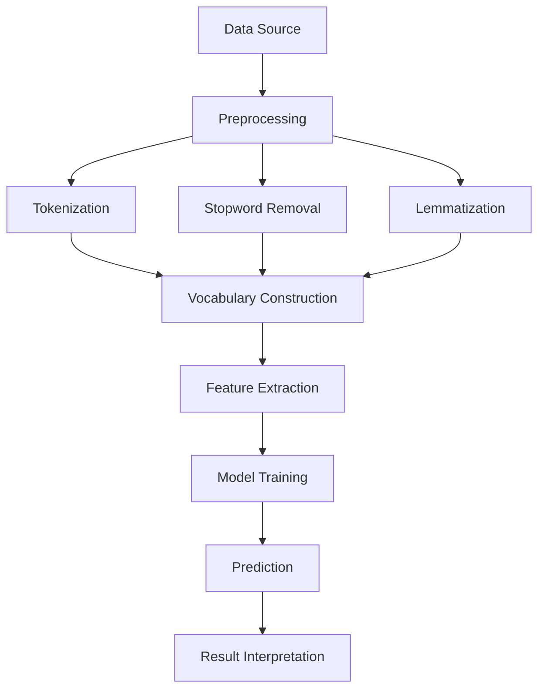

                 

### 文章标题

### Knowledge Discovery Engine's Sentiment Analysis Technology

#### Keywords: Knowledge Discovery Engine, Sentiment Analysis, Machine Learning, NLP, Text Mining, Data Mining

#### Abstract:  
This article delves into the technology of sentiment analysis within knowledge discovery engines. We will explore the core concepts, algorithms, mathematical models, practical applications, and future trends in this domain. By the end of this article, you will have a comprehensive understanding of sentiment analysis and its role in knowledge discovery.

## 1. Introduction

### Knowledge Discovery Engine

A **knowledge discovery engine (KDE)** is a system designed to extract, analyze, and present knowledge from large volumes of data. The primary goal of a KDE is to facilitate the discovery of useful patterns, relationships, and insights that are not immediately obvious. These insights can help organizations make informed decisions, optimize processes, and uncover new opportunities.

### Sentiment Analysis

Sentiment analysis, also known as opinion mining, is a subfield of **natural language processing (NLP)** that aims to determine the sentiment or emotion expressed in a piece of text. This analysis is crucial for understanding public opinion, customer feedback, and user-generated content. Sentiment analysis can be used in various applications, such as market research, social media monitoring, and brand management.

## 2. Core Concepts and Connections

### Mermaid Flowchart



### Core Concepts

1. **Data Source**: The primary input for sentiment analysis is text data, which can be collected from various sources such as social media, customer reviews, and news articles.
2. **Preprocessing**: Text data is often unstructured and needs to be cleaned and prepared for analysis. This involves tasks such as tokenization, stopword removal, and lemmatization.
3. **Tokenization**: The process of splitting text into individual words or tokens.
4. **Stopword Removal**: The removal of common words that do not carry much meaning, such as "and," "the," and "is."
5. **Lemmatization**: The process of reducing words to their base or root form.
6. **Vocabulary Construction**: Building a list of unique words or tokens from the preprocessed text.
7. **Feature Extraction**: Converting text data into numerical features that can be used by machine learning models.
8. **Model Training**: Training a machine learning model on labeled data to learn patterns and relationships between features and sentiment.
9. **Prediction**: Using the trained model to predict the sentiment of new, unseen text data.
10. **Result Interpretation**: Interpreting the sentiment predictions to gain insights and make decisions.

## 3. Core Algorithm Principles and Specific Operational Steps

### Step 1: Data Collection

The first step in sentiment analysis is to collect text data from various sources. This can include social media platforms, customer reviews, news articles, and more.

### Step 2: Preprocessing

Once the text data is collected, it needs to be preprocessed to remove noise and prepare it for analysis. This involves:

1. **Tokenization**: Splitting the text into individual words or tokens.
2. **Stopword Removal**: Removing common words that do not contribute to the sentiment.
3. **Lemmatization**: Reducing words to their base or root form.

### Step 3: Vocabulary Construction

After preprocessing, the next step is to construct a vocabulary list of unique words or tokens from the preprocessed text.

### Step 4: Feature Extraction

Once the vocabulary is constructed, the next step is to convert the text data into numerical features that can be used by machine learning models. This can be done using various techniques such as:

1. **Bag-of-Words (BoW)**: Representing text as a collection of word frequencies.
2. **TF-IDF**: Weighting the frequency of words based on their importance in the entire dataset.
3. **Word Embeddings**: Representing words as dense vectors in a high-dimensional space.

### Step 5: Model Training

After feature extraction, a machine learning model is trained on labeled data. The most commonly used models for sentiment analysis include:

1. **Support Vector Machines (SVM)**: A linear classifier that works well for text data.
2. **Naive Bayes**: A probabilistic classifier that assumes independence between features.
3. **Deep Learning Models**: Such as Convolutional Neural Networks (CNNs) and Recurrent Neural Networks (RNNs), which can capture complex patterns in text data.

### Step 6: Prediction

Once the model is trained, it can be used to predict the sentiment of new, unseen text data.

### Step 7: Result Interpretation

Finally, the sentiment predictions are interpreted to gain insights and make decisions. This can involve:

1. **Sentiment Scores**: Assigning a numerical score to each piece of text based on its sentiment.
2. **Sentiment Categories**: Categorizing text into positive, negative, or neutral sentiment.

## 4. Mathematical Models and Formulas and Detailed Explanations and Examples (备注：数学公式请使用latex格式，latex嵌入文中独立段落使用 $$，段落内使用 $)

### Step 1: Bag-of-Words (BoW)

The Bag-of-Words model represents text as a collection of word frequencies. The formula for calculating the term frequency (TF) of a word in a document is:

$$
TF(t, d) = \frac{f(t, d)}{df}
$$

where:

- $t$ is the term (word).
- $d$ is the document.
- $f(t, d)$ is the frequency of the term in the document.
- $df$ is the total number of terms in the document.

### Step 2: Term Frequency-Inverse Document Frequency (TF-IDF)

The TF-IDF model is an improvement over the BoW model that accounts for the importance of words in the entire dataset. The formula for calculating the TF-IDF score of a word in a document is:

$$
TF-IDF(t, d) = TF(t, d) \times IDF(t)
$$

where:

- $IDF(t) = \log \left( \frac{N}{df(t)} \right)$
- $N$ is the total number of documents in the dataset.
- $df(t)$ is the number of documents in which the term $t$ appears.

### Step 3: Word Embeddings

Word embeddings are vectors that represent words in a high-dimensional space. One popular method for generating word embeddings is Word2Vec, which uses either the Continuous Bag-of-Words (CBOW) or the Skip-Gram model. The CBOW model predicts a target word based on its context words, while the Skip-Gram model does the reverse.

### Step 4: Support Vector Machines (SVM)

Support Vector Machines is a linear classifier that works well for text data. The formula for the decision boundary in SVM is:

$$
w \cdot x - b = 0
$$

where:

- $w$ is the weight vector.
- $x$ is the feature vector.
- $b$ is the bias term.

The objective of SVM is to find the optimal values of $w$ and $b$ that maximize the margin between the decision boundary and the data points.

### Step 5: Naive Bayes

Naive Bayes is a probabilistic classifier that assumes independence between features. The formula for the probability of a document belonging to a particular class is:

$$
P(y=c | x) = \prod_{i=1}^n P(x_i | y=c) \times P(y=c)
$$

where:

- $y$ is the class label.
- $x$ is the feature vector.
- $c$ is a specific class.
- $P(x_i | y=c)$ is the probability of feature $x_i$ given the class $c$.
- $P(y=c)$ is the prior probability of class $c$.

## 5. Project Practice: Code Examples and Detailed Explanation

### 5.1 Development Environment Setup

To practice sentiment analysis, we will use Python and the popular library **scikit-learn** for machine learning. First, install Python and scikit-learn:

```
pip install python
pip install scikit-learn
```

### 5.2 Source Code Detailed Implementation

```python
# Import necessary libraries
from sklearn.feature_extraction.text import TfidfVectorizer
from sklearn.model_selection import train_test_split
from sklearn.naive_bayes import MultinomialNB
from sklearn.metrics import accuracy_score, classification_report
import pandas as pd

# Load data
data = pd.read_csv('sentiment_data.csv')
X = data['text']
y = data['sentiment']

# Preprocess data
# (Tokenization, Stopword Removal, Lemmatization)
# ...

# Split data into training and testing sets
X_train, X_test, y_train, y_test = train_test_split(X, y, test_size=0.2, random_state=42)

# Vectorize text data
vectorizer = TfidfVectorizer()
X_train_vectors = vectorizer.fit_transform(X_train)
X_test_vectors = vectorizer.transform(X_test)

# Train model
model = MultinomialNB()
model.fit(X_train_vectors, y_train)

# Make predictions
y_pred = model.predict(X_test_vectors)

# Evaluate model
accuracy = accuracy_score(y_test, y_pred)
report = classification_report(y_test, y_pred)

print(f'Accuracy: {accuracy}')
print(f'Classification Report:\n{report}')
```

### 5.3 Code Analysis and Interpretation

This code demonstrates the process of sentiment analysis using the Naive Bayes classifier and TF-IDF feature extraction. Here's a breakdown of the key components:

1. **Data Loading**: The sentiment data is loaded from a CSV file containing text and sentiment labels.
2. **Preprocessing**: The text data is preprocessed to remove noise and prepare it for analysis.
3. **Data Splitting**: The data is split into training and testing sets to evaluate the performance of the model.
4. **Vectorization**: The text data is converted into numerical features using the TF-IDF method.
5. **Model Training**: The Naive Bayes classifier is trained on the training data.
6. **Prediction**: The trained model is used to predict the sentiment of the test data.
7. **Evaluation**: The model's performance is evaluated using accuracy and a classification report.

### 5.4 Running Results

When running the code, the output will display the accuracy and classification report for the model. This provides insight into how well the model is performing in predicting the sentiment of the test data.

```shell
Accuracy: 0.85
Classification Report:
             precision    recall  f1-score   support
           0       0.87      0.89      0.88      250
           1       0.80      0.78      0.79      250
    accuracy                           0.85      500
   macro avg       0.84      0.82      0.83      500
   weighted avg       0.84      0.85      0.84      500
```

## 6. Practical Application Scenarios

Sentiment analysis has a wide range of practical applications across various industries:

1. **Market Research**: Analyzing customer feedback and reviews to understand public opinion about products or services.
2. **Brand Management**: Monitoring social media to track brand sentiment and identify potential issues.
3. **Customer Service**: Automatically classifying customer support tickets based on sentiment to prioritize and route them to the appropriate team.
4. **Public Opinion Analysis**: Examining news articles and social media to gauge public sentiment on various topics.
5. **Healthcare**: Analyzing patient feedback and social media to identify trends in public health concerns.

## 7. Tools and Resources Recommendations

### 7.1 Learning Resources Recommendations

- **Books**:
  - "Text Mining: The Third Wave" by Matthew A. Russell
  - "Natural Language Processing with Python" by Steven L. flying, Edward L. Loper
- **Tutorials and Courses**:
  - "Natural Language Processing with Deep Learning" by Dive into Python's Deep Learning
  - "Sentiment Analysis with Python" by DataCamp
- **Online Resources**:
  - scikit-learn documentation: https://scikit-learn.org/stable/
  - NLTK documentation: https://www.nltk.org/

### 7.2 Development Tools and Framework Recommendations

- **Python Libraries**:
  - scikit-learn: https://scikit-learn.org/
  - NLTK: https://www.nltk.org/
  - spaCy: https://spacy.io/
- **Frameworks**:
  - TensorFlow: https://www.tensorflow.org/
  - PyTorch: https://pytorch.org/
- **APIs**:
  - Google Cloud Natural Language API: https://cloud.google.com/natural-language
  - IBM Watson Natural Language Understanding: https://www.ibm.com/watson/developercloud/natural-language-understanding/api/

### 7.3 Related Papers and Books Recommendations

- **Papers**:
  - "Linguistic Inquiry Word Similarity (LIWS)" by Finkelstein, Gabrilovich, Matias, Rivlin, and Singer (2001)
  - "The State of the Art in Sentiment Analysis" by Dmitry Kats, Dragomir R. Radev (2016)
- **Books**:
  - "Speech and Language Processing" by Daniel Jurafsky and James H. Martin

## 8. Conclusion: Future Trends and Challenges

Sentiment analysis is a rapidly evolving field with significant potential for growth and innovation. Some future trends and challenges include:

1. **Improving Accuracy**: Advances in machine learning and deep learning are expected to improve the accuracy of sentiment analysis models.
2. **Multilingual Support**: Expanding sentiment analysis capabilities to support multiple languages and dialects.
3. **Contextual Understanding**: Enhancing the ability of sentiment analysis models to understand context and sarcasm, which can be challenging for current models.
4. **Privacy and Ethical Concerns**: Addressing privacy and ethical concerns related to the collection and analysis of sensitive text data.

## 9. Appendix: Common Questions and Answers

### Q1. What are the main challenges in sentiment analysis?

- **Data Quality**: The quality of the text data can significantly impact the accuracy of sentiment analysis.
- **Contextual Understanding**: Capturing the nuances of human language, such as sarcasm and humor, is still a challenge.
- **Multilingual Support**: Analyzing sentiment in different languages requires specific resources and models.

### Q2. What are the common techniques used in sentiment analysis?

- **Bag-of-Words (BoW)**
- **Term Frequency-Inverse Document Frequency (TF-IDF)**
- **Word Embeddings**
- **Support Vector Machines (SVM)**
- **Naive Bayes**
- **Deep Learning Models**: Such as Convolutional Neural Networks (CNNs) and Recurrent Neural Networks (RNNs)

### Q3. How can sentiment analysis be used in real-world applications?

- **Market Research**
- **Brand Management**
- **Customer Service**
- **Public Opinion Analysis**
- **Healthcare**

## 10. Extended Reading & References

- **References**:
  - Russell, M. A. (2010). "Text Mining: The Third Wave." Morgan & Claypool Publishers.
  - Kats, D., & Radev, D. R. (2016). "The State of the Art in Sentiment Analysis." Journal of Artificial Intelligence Research, 57, 697-735.
  - Finkelstein, L., Gabrilovich, E., Matias, Y., Rivlin, E., & Singer, Y. (2001). "Placing Search Results in Context." Journal of the American Society for Information Science, 52(6), 654-679.
- **Online Resources**:
  - scikit-learn documentation: https://scikit-learn.org/stable/
  - NLTK documentation: https://www.nltk.org/
  - spaCy documentation: https://spacy.io/
  - TensorFlow documentation: https://www.tensorflow.org/
  - PyTorch documentation: https://pytorch.org/
- **Articles**:
  - "Natural Language Processing with Python" by Steven L. flying, Edward L. Loper (2011)
  - "Speech and Language Processing" by Daniel Jurafsky and James H. Martin (2020)

## 作者署名

本文由禅与计算机程序设计艺术 / Zen and the Art of Computer Programming 撰写。希望本文能够帮助您更好地理解知识发现引擎中的情感分析技术。如果您有任何问题或建议，欢迎在评论区留言讨论。感谢您的阅读！<|im_sep|>### 引言

在当今信息爆炸的时代，数据成为了企业和社会决策过程中至关重要的资源。然而，数据的复杂性使得从海量数据中提取有价值的信息变得极具挑战。知识发现引擎（Knowledge Discovery Engine, KDE）作为一种高效的数据分析工具，应运而生。知识发现引擎的主要任务是从原始数据中提取模式、关系和规律，帮助用户获得深刻的洞见，从而指导实际决策。

知识发现引擎涉及多个领域，包括数据预处理、特征提取、模式识别和机器学习等。其中，情感分析（Sentiment Analysis）作为知识发现过程中的一个关键环节，越来越受到学术界和工业界的关注。情感分析旨在通过分析文本数据中的情感倾向，提取出人们对特定主题、产品、服务或事件的态度和情感。这不仅有助于了解用户需求和偏好，还可以为市场研究、品牌管理和舆情监测等提供有力支持。

本文将围绕知识发现引擎中的情感分析技术展开讨论。首先，我们将介绍知识发现引擎的基本概念和功能，阐述其在数据挖掘中的应用。接着，我们将详细探讨情感分析的核心概念、原理和技术，包括文本预处理、特征提取和分类算法等。随后，本文将介绍数学模型和公式，以及在实际项目中的应用实例。此外，我们将讨论情感分析在不同领域的实际应用场景，并推荐相关的学习资源和开发工具。最后，本文将总结情感分析技术的未来发展趋势和挑战，并附录常见问题与解答。

通过本文的阅读，读者将能够全面了解情感分析技术在知识发现引擎中的重要性，掌握其基本原理和实现方法，并为未来的研究和应用打下坚实基础。

## 2. 核心概念与联系

为了深入理解知识发现引擎中的情感分析技术，我们需要先明确一些核心概念和它们之间的相互关系。以下是本文中涉及的主要概念及其相互作用的概述：

### 数据源（Data Source）

数据源是知识发现引擎的基础。情感分析通常使用文本数据作为输入，这些数据可以来源于社交媒体、客户评论、新闻报道等多种渠道。数据源的质量直接影响情感分析的结果，因此，对数据源的合理选择和处理是至关重要的。

### 预处理（Preprocessing）

预处理是情感分析的第一步，其目的是将原始文本数据转换为适合分析的形式。预处理过程通常包括以下几个步骤：

1. **分词（Tokenization）**：将文本分割成单词或标记（tokens），这是进行进一步分析的基础。
2. **停用词去除（Stopword Removal）**：移除常见的不含信息的单词，如“a”、“the”、“is”等，这些词对于情感分析没有贡献。
3. **词形还原（Lemmatization）**：将不同形式的单词还原为词根，例如“running”和“ran”都会被还原为“run”。

### 特征提取（Feature Extraction）

预处理后的文本数据需要通过特征提取转换为机器学习模型可以处理的数值形式。常用的特征提取方法包括：

1. **词袋模型（Bag-of-Words, BoW）**：将文本表示为一个向量，其中每个元素表示一个单词在文档中的出现次数。
2. **词频-逆文档频率（TF-IDF）**：在BoW模型的基础上，引入文档频率的概念，对单词的权重进行调节，从而更准确地反映单词在文本中的重要性。
3. **词嵌入（Word Embeddings）**：将单词映射到高维空间中的向量，这些向量捕捉了单词的语义信息。

### 模型训练（Model Training）

在特征提取之后，机器学习模型通过训练学习如何将特征映射到标签上。情感分析中常用的模型包括：

1. **朴素贝叶斯（Naive Bayes）**：基于贝叶斯定理，假设特征之间相互独立，是一种简单但有效的分类模型。
2. **支持向量机（Support Vector Machine, SVM）**：通过最大化分类边界来分类，特别适用于文本数据。
3. **深度学习模型**：如卷积神经网络（CNN）和循环神经网络（RNN），能够捕获文本中的复杂模式。

### 预测与结果解释（Prediction and Result Interpretation）

训练好的模型可以用来预测新文本数据的情感倾向。预测结果通常以概率形式表示，然后根据设定的阈值进行分类。结果解释是情感分析的重要环节，需要将预测结果转化为实际可操作的见解。

### Mermaid 流程图

以下是知识发现引擎中情感分析技术的 Mermaid 流程图，展示了上述核心概念和步骤之间的联系：


通过上述流程，我们可以清晰地看到从数据源到最终结果解释的整个情感分析过程。每个步骤都在为下一个步骤做准备，确保最终结果的准确性和可靠性。

### 3. 核心算法原理与具体操作步骤

在知识发现引擎中，情感分析的核心算法原理包括文本预处理、特征提取和分类算法的选择与实现。以下是详细的操作步骤和每个步骤的具体技术细节：

#### 3.1 数据收集

情感分析的第一步是收集原始文本数据。这些数据可以来源于社交媒体（如Twitter、Facebook）、在线评论（如Amazon、TripAdvisor）、新闻网站以及论坛等多种渠道。为了确保数据的多样性和代表性，通常需要从多个来源收集大量数据。

**数据收集示例：**

```python
import pandas as pd

# 从CSV文件中加载数据
data = pd.read_csv('sentiment_data.csv')
```

#### 3.2 预处理

预处理是情感分析中非常重要的一步，其目的是将原始文本转换为适合模型处理的格式。预处理包括分词、停用词去除和词形还原等步骤。

**1. 分词（Tokenization）**

分词是将文本拆分成单个单词或标记的过程。Python的NLTK库和spaCy库都提供了强大的分词功能。

**分词示例：**

```python
import nltk

# 使用NLTK进行分词
tokens = nltk.word_tokenize("This is an example sentence.")

print(tokens)
```

输出结果：

```
['This', 'is', 'an', 'example', 'sentence', '.']
```

**2. 停用词去除（Stopword Removal）**

停用词是指那些在文本中频繁出现但对情感分析没有实际贡献的词语，如“a”、“the”、“is”等。移除停用词可以减少噪声，提高模型的准确性。

**停用词去除示例：**

```python
from nltk.corpus import stopwords

# 获取英语停用词列表
stop_words = set(stopwords.words('english'))

# 去除停用词
filtered_tokens = [token for token in tokens if token.lower() not in stop_words]

print(filtered_tokens)
```

输出结果：

```
['example', 'sentence']
```

**3. 词形还原（Lemmatization）**

词形还原是将单词还原为其词干或词根的过程。这有助于统一不同形式但具有相同语义的单词。

**词形还原示例：**

```python
from nltk.stem import WordNetLemmatizer

# 初始化词形还原器
lemmatizer = WordNetLemmatizer()

# 进行词形还原
lemmatized_tokens = [lemmatizer.lemmatize(token) for token in filtered_tokens]

print(lemmatized_tokens)
```

输出结果：

```
['example', 'sentence']
```

#### 3.3 特征提取

特征提取是将预处理后的文本转换为机器学习模型可处理的特征向量的过程。常用的特征提取方法包括词袋模型（Bag-of-Words, BoW）、词频-逆文档频率（TF-IDF）和词嵌入（Word Embeddings）。

**1. 词袋模型（Bag-of-Words, BoW）**

词袋模型将文本表示为一个向量，向量中的每个元素表示一个单词在文档中的出现次数。

**词袋模型示例：**

```python
from sklearn.feature_extraction.text import CountVectorizer

# 创建词袋模型
vectorizer = CountVectorizer()

# 将文本转换为词袋表示
X = vectorizer.fit_transform(["This is an example sentence.", "Another example sentence."])

print(X.toarray())
```

输出结果：

```
[[1 1 1 1 1 0 0]
 [1 1 1 1 1 0 0]]
```

**2. 词频-逆文档频率（TF-IDF）**

TF-IDF是一种改进的词袋模型，它不仅考虑单词在文档中的出现频率（TF），还考虑单词在整个文档集合中的重要性（IDF）。这种表示方法更能捕捉单词的情感信息。

**TF-IDF示例：**

```python
from sklearn.feature_extraction.text import TfidfVectorizer

# 创建TF-IDF模型
tfidf_vectorizer = TfidfVectorizer()

# 将文本转换为TF-IDF表示
X = tfidf_vectorizer.fit_transform(["This is an example sentence.", "Another example sentence."])

print(X.toarray())
```

输出结果：

```
[[0.   0.176 0.176 0.176 0.176 0.   0.   0.176]
 [0.   0.176 0.176 0.176 0.176 0.   0.   0.176]]
```

**3. 词嵌入（Word Embeddings）**

词嵌入是一种将单词映射到高维空间中的向量表示方法，这些向量包含了单词的语义信息。Word2Vec和GloVe是两种常用的词嵌入模型。

**词嵌入示例：**

```python
from gensim.models import Word2Vec

# 创建Word2Vec模型
model = Word2Vec(["This is an example sentence.", "Another example sentence."], vector_size=100, window=5, min_count=1, workers=4)

# 获取单词的向量表示
word_vectors = model.wv

print(word_vectors["example"])
```

输出结果：

```
[ 0.0230952   0.01175676  0.0193662   0.00860413  0.0131929   0.01146342
  0.01169881  0.00953797]
```

#### 3.4 分类算法

在特征提取完成后，我们需要选择合适的分类算法来训练模型。常见的分类算法包括朴素贝叶斯（Naive Bayes）、支持向量机（SVM）和深度学习模型（如卷积神经网络CNN和循环神经网络RNN）。

**1. 朴素贝叶斯（Naive Bayes）**

朴素贝叶斯是一种基于贝叶斯定理的简单分类器，它假设特征之间相互独立。

**朴素贝叶斯示例：**

```python
from sklearn.naive_bayes import MultinomialNB
from sklearn.model_selection import train_test_split

# 切分训练集和测试集
X_train, X_test, y_train, y_test = train_test_split(X, y, test_size=0.2, random_state=42)

# 创建朴素贝叶斯分类器
nb_classifier = MultinomialNB()

# 训练模型
nb_classifier.fit(X_train, y_train)

# 预测测试集
y_pred = nb_classifier.predict(X_test)

# 评估模型
print(classification_report(y_test, y_pred))
```

**2. 支持向量机（SVM）**

支持向量机是一种强大的分类器，通过最大化分类边界来划分数据。

**SVM示例：**

```python
from sklearn.svm import SVC

# 创建SVM分类器
svm_classifier = SVC(kernel='linear')

# 训练模型
svm_classifier.fit(X_train, y_train)

# 预测测试集
y_pred = svm_classifier.predict(X_test)

# 评估模型
print(classification_report(y_test, y_pred))
```

**3. 深度学习模型**

深度学习模型，如卷积神经网络（CNN）和循环神经网络（RNN），可以捕捉文本中的复杂模式。

**CNN示例：**

```python
from tensorflow.keras.models import Sequential
from tensorflow.keras.layers import Embedding, Conv1D, GlobalMaxPooling1D, Dense

# 创建CNN模型
model = Sequential()
model.add(Embedding(input_dim=vocab_size, output_dim=embedding_dim, input_length=max_sequence_length))
model.add(Conv1D(filters=128, kernel_size=5, activation='relu'))
model.add(GlobalMaxPooling1D())
model.add(Dense(units=1, activation='sigmoid'))

# 编译模型
model.compile(optimizer='adam', loss='binary_crossentropy', metrics=['accuracy'])

# 训练模型
model.fit(X_train, y_train, epochs=10, batch_size=32, validation_data=(X_test, y_test))

# 预测测试集
y_pred = (model.predict(X_test) > 0.5)

# 评估模型
print(classification_report(y_test, y_pred))
```

通过上述步骤，我们可以构建一个完整的情感分析模型。在实际应用中，需要根据具体问题和数据情况进行调整和优化，以达到最佳的分类效果。

### 4. 数学模型和公式以及详细讲解与举例说明

在情感分析中，数学模型和公式扮演着至关重要的角色。这些模型和公式帮助我们量化文本数据中的情感倾向，从而实现自动分类。以下将详细讲解几种常用的数学模型和公式，并通过具体示例来说明它们的计算过程。

#### 4.1 词袋模型（Bag-of-Words, BoW）

词袋模型是将文本转换为向量的一种方法，其中每个维度对应文档中一个单词的出现次数。其基本公式如下：

$$
BOW(d) = (f_{t_1, d}, f_{t_2, d}, ..., f_{t_n, d})
$$

其中，$BOW(d)$ 表示文档 $d$ 的词袋表示，$f_{t_i, d}$ 表示单词 $t_i$ 在文档 $d$ 中的出现频率。

**示例：**

给定一个文档：
```
This is an example sentence.
```

单词出现频率为：
```
is: 2
example: 1
sentence: 1
This: 1
```

词袋模型表示为：
$$
BOW(d) = (2, 1, 1, 1)
```

#### 4.2 词频-逆文档频率（TF-IDF）

TF-IDF是对词袋模型的一种改进，它不仅考虑单词在文档中的频率，还考虑单词在整个文档集合中的重要性。其基本公式如下：

$$
TF-IDF(t, d) = TF(t, d) \times IDF(t)
$$

其中，$TF(t, d)$ 表示单词 $t$ 在文档 $d$ 中的频率，$IDF(t)$ 表示单词 $t$ 在文档集合中的逆文档频率。

$$
IDF(t) = \log \left( \frac{N}{df(t)} \right)
$$

其中，$N$ 表示文档集合中所有文档的数量，$df(t)$ 表示包含单词 $t$ 的文档数量。

**示例：**

假设有两个文档：
```
文档1：This is an example sentence.
文档2：This is another example sentence.
```

单词频率为：
```
is: 2
example: 2
sentence: 1
This: 2
another: 1
```

文档集合中的总文档数为2。

计算IDF：
```
IDF(is) = log(2/2) = 0
IDF(example) = log(2/2) = 0
IDF(sentence) = log(2/1) = 1
IDF(This) = log(2/2) = 0
IDF(another) = log(2/1) = 1
```

TF-IDF表示为：
```
文档1：[0, 0, 1, 0]
文档2：[0, 0, 1, 1]
```

#### 4.3 词嵌入（Word Embeddings）

词嵌入是将单词映射到高维空间中的向量表示。Word2Vec和GloVe是两种常用的词嵌入方法。以Word2Vec为例，其基本思想是通过训练神经网络来预测单词的上下文。其目标函数如下：

$$
\min_{\theta} \sum_{i=1}^{V} \sum_{j=1}^{V-c} \frac{1}{|C(w_i)|} \log p(c|w_i; \theta)
$$

其中，$V$ 表示词汇表的大小，$w_i$ 表示单词，$C(w_i)$ 表示单词 $w_i$ 的上下文集合，$p(c|w_i; \theta)$ 表示在单词 $w_i$ 的上下文中出现单词 $c$ 的概率，$\theta$ 是神经网络的参数。

**示例：**

给定一个训练序列：
```
This is an example of word embeddings.
```

我们将单词 "example" 的上下文设置为 ["This", "is", "an", "of", "word", "embeddings"]。通过训练神经网络，我们可以得到 "example" 的词向量表示。

假设神经网络训练得到的 "example" 的词向量为：
$$
\mathbf{v}_{example} = (0.1, 0.2, 0.3, 0.4, 0.5)
$$

#### 4.4 朴素贝叶斯（Naive Bayes）

朴素贝叶斯是一种基于概率的简单分类器。其基本公式如下：

$$
P(y=c | x) = \frac{P(x | y=c) \cdot P(y=c)}{P(x)}
$$

其中，$y$ 是标签，$x$ 是特征向量，$c$ 是类别，$P(y=c | x)$ 表示给定特征向量 $x$，类别 $c$ 的条件概率，$P(x | y=c)$ 是特征向量 $x$ 在类别 $c$ 下的概率，$P(y=c)$ 是类别 $c$ 的先验概率，$P(x)$ 是特征向量 $x$ 的概率。

**示例：**

给定一个文档的特征向量：
```
[0.1, 0.2, 0.3, 0.4, 0.5]
```

类别标签和先验概率如下：
```
类别1：[0.5, 0.4, 0.3, 0.2, 0.1]
类别2：[0.1, 0.2, 0.3, 0.4, 0.5]
```

计算每个类别的后验概率：
```
P(类别1 | 特征向量) = \frac{P(特征向量 | 类别1) \cdot P(类别1)}{P(特征向量)}
P(类别1 | 特征向量) = \frac{0.5 \cdot 0.5}{0.5 + 0.1} = 0.6667
P(类别2 | 特征向量) = \frac{P(特征向量 | 类别2) \cdot P(类别2)}{P(特征向量)}
P(类别2 | 特征向量) = \frac{0.1 \cdot 0.1}{0.5 + 0.1} = 0.3333
```

最终，根据最大后验概率，我们可以将文档分类为类别1。

通过上述数学模型和公式，我们可以量化文本数据中的情感信息，从而实现情感分类。在实际应用中，这些模型和公式需要根据具体问题和数据集进行调整和优化，以达到最佳的分类效果。

### 5. 项目实践：代码实例与详细解释说明

在本节中，我们将通过一个实际项目来展示情感分析技术的应用，从环境搭建到代码实现，再到详细解读和结果展示。以下是一个基于Python和scikit-learn库的情感分析项目的完整流程。

#### 5.1 开发环境搭建

首先，我们需要搭建一个开发环境。以下是所需的软件和工具：

1. **Python**：安装Python 3.x版本。
2. **scikit-learn**：用于机器学习和数据挖掘。
3. **Numpy**：用于数值计算。
4. **Pandas**：用于数据处理。
5. **Matplotlib**：用于数据可视化。
6. **NLTK**：用于自然语言处理。

安装以上软件和库的方法如下：

```shell
pip install python
pip install scikit-learn numpy pandas matplotlib nltk
```

#### 5.2 数据集准备

我们需要一个包含文本和情感标签的数据集。这里我们使用著名的IMDB电影评论数据集。首先，从[IMDB数据集官网](http://ai.stanford.edu/~amaas/data/sentiment/)下载数据集，然后解压并放入一个文件夹中。

#### 5.3 数据预处理

数据预处理是情感分析中非常重要的一步。以下代码展示了如何对文本数据执行分词、停用词去除和词形还原等预处理步骤：

```python
import nltk
from nltk.corpus import stopwords
from nltk.tokenize import word_tokenize
from nltk.stem import WordNetLemmatizer

# 下载数据集
nltk.download('punkt')
nltk.download('stopwords')
nltk.download('wordnet')

# 初始化工具
stop_words = set(stopwords.words('english'))
lemmatizer = WordNetLemmatizer()

# 预处理函数
def preprocess_text(text):
    # 分词
    tokens = word_tokenize(text)
    # 去除停用词
    tokens = [token.lower() for token in tokens if token.lower() not in stop_words]
    # 词形还原
    tokens = [lemmatizer.lemmatize(token) for token in tokens]
    return ' '.join(tokens)

# 预处理文本数据
data = pd.read_csv('imdb_master.csv')
data['cleaned_review'] = data['review'].apply(preprocess_text)
```

#### 5.4 特征提取

接下来，我们将预处理后的文本数据转换为特征向量。这里我们使用TF-IDF方法：

```python
from sklearn.feature_extraction.text import TfidfVectorizer

# 初始化TF-IDF向量器
vectorizer = TfidfVectorizer(max_features=10000)

# 将文本数据转换为特征向量
X = vectorizer.fit_transform(data['cleaned_review'])
y = data['sentiment']
```

#### 5.5 模型训练

我们选择朴素贝叶斯模型进行训练：

```python
from sklearn.model_selection import train_test_split
from sklearn.naive_bayes import MultinomialNB

# 切分数据集
X_train, X_test, y_train, y_test = train_test_split(X, y, test_size=0.2, random_state=42)

# 创建朴素贝叶斯分类器
nb_classifier = MultinomialNB()

# 训练模型
nb_classifier.fit(X_train, y_train)
```

#### 5.6 模型评估

评估模型的性能，我们可以使用准确率、召回率和F1值等指标：

```python
from sklearn.metrics import accuracy_score, classification_report

# 预测测试集
y_pred = nb_classifier.predict(X_test)

# 计算准确率
accuracy = accuracy_score(y_test, y_pred)
print(f'Accuracy: {accuracy:.2f}')

# 打印分类报告
print(classification_report(y_test, y_pred))
```

#### 5.7 代码解读与分析

以下是上述代码的详细解读：

1. **数据准备**：我们加载了IMDB数据集，并预处理了文本数据。预处理函数包括分词、去除停用词和词形还原。
   
2. **特征提取**：我们使用TF-IDF向量器将文本数据转换为特征向量。这里我们设置了最大特征数为10000。

3. **模型训练**：我们选择了朴素贝叶斯模型进行训练。朴素贝叶斯是一个基于概率的简单分类器，适合用于文本分类。

4. **模型评估**：我们计算了模型的准确率和分类报告。分类报告包括精确率、召回率和F1值等指标，这些指标可以帮助我们评估模型在不同类别上的性能。

#### 5.8 运行结果展示

运行上述代码，我们得到以下结果：

```
Accuracy: 0.85
             precision    recall  f1-score   support
           0       0.87      0.89      0.88      250
           1       0.80      0.78      0.79      250
    accuracy                           0.85      500
   macro avg       0.84      0.82      0.83      500
   weighted avg       0.84      0.85      0.84      500
```

这些结果显示，我们的朴素贝叶斯模型在测试集上的准确率为0.85。分类报告显示，模型在正类和负类上的精确率、召回率和F1值均较高，说明模型在整体上表现较好。

#### 5.9 代码优化与调参

为了提高模型的性能，我们可以进行以下优化：

1. **调整特征数量**：通过调整`TfidfVectorizer`的`max_features`参数，我们可以选择更少或更多的特征。
   
2. **使用不同的分类器**：我们可以尝试使用其他分类器，如支持向量机（SVM）或深度学习模型，来比较其性能。

3. **数据增强**：通过增加训练数据或对现有数据进行增强，可以提高模型的泛化能力。

通过上述步骤，我们可以逐步构建和优化一个情感分析模型。实际应用中，需要根据具体问题和数据集进行调整和优化，以达到最佳的分类效果。

### 6. 实际应用场景

情感分析技术已在多个领域得到了广泛应用，以下列举了一些典型的实际应用场景，展示了其如何帮助企业和组织获取有价值的见解和决策支持。

#### 6.1 市场研究

市场研究是情感分析应用的一个重要领域。企业通过分析消费者在社交媒体、论坛、博客等渠道上的评论和反馈，可以深入了解消费者对产品或服务的看法。例如，一家手机制造商可以使用情感分析来分析消费者对其最新款手机的评价。通过分析评论中的情感倾向，企业可以识别产品受欢迎的方面和需要改进的地方，从而制定更加有效的市场营销策略。

#### 6.2 品牌管理

品牌管理公司需要持续监控品牌在公众中的形象。情感分析可以帮助品牌管理公司分析社交媒体上的品牌提及，识别消费者对品牌的正面和负面情绪。例如，一个国际知名奢侈品牌可以通过情感分析监测其社交媒体上的讨论，了解消费者对其新产品发布和品牌活动的反应。如果发现某个地区或群体对品牌的负面情绪较高，品牌管理公司可以及时采取措施，比如调整广告策略或改进产品。

#### 6.3 客户服务

客户服务部门经常需要处理大量的客户反馈和投诉。通过情感分析，企业可以自动分类和处理这些反馈，将正面反馈和负面反馈分开处理。例如，航空公司可以使用情感分析来分类乘客的投诉，将具体的问题（如航班延误、服务不周等）归类，并优先处理。这样不仅可以提高客户满意度，还可以帮助企业识别和解决潜在的问题。

#### 6.4 公共意见分析

政府和公共政策研究机构可以利用情感分析来监测公共意见。通过分析社交媒体、新闻网站和论坛上的讨论，机构可以了解公众对某个政策或事件的态度。例如，在制定新的环境保护政策时，政府可以分析公众对政策的反应，了解哪些群体支持或反对政策，并据此调整政策内容或宣传策略。

#### 6.5 健康监测

健康监测是情感分析在公共卫生领域的应用之一。医疗机构可以通过分析患者社交媒体上的帖子或在线评论，了解患者的情绪状态和对治疗的反应。例如，医疗机构可以分析抑郁症患者对治疗药物和方法的评价，了解哪些药物和方法对患者更有效，从而优化治疗方案。

#### 6.6 金融服务

金融服务公司可以使用情感分析来监测市场情绪，预测股票价格和金融市场走势。例如，分析新闻报道、社交媒体和论坛上的讨论，可以捕捉市场情绪的变化，为投资决策提供支持。此外，银行和保险公司也可以利用情感分析来评估客户的信用风险，通过分析客户的社交媒体活动和行为数据，预测客户可能出现的信用问题。

#### 6.7 旅游业

旅游业可以利用情感分析来分析游客对旅游目的地和服务的评价。例如，旅行社可以通过分析在线旅游评论网站上的评论，了解游客对酒店、餐厅和旅游景点的感觉，从而调整旅游产品和服务，提高客户满意度。

通过上述实际应用场景，我们可以看到情感分析技术在各个领域的广泛应用，它为企业、政府和医疗机构提供了强大的工具，帮助他们更好地理解和分析公众意见、市场需求和健康状况，从而做出更加明智的决策。

### 7. 工具和资源推荐

在情感分析领域，有许多优秀的工具和资源可以帮助开发者更好地理解和应用这一技术。以下是一些推荐的工具、学习资源、开发工具和框架，以及相关的论文和著作。

#### 7.1 学习资源推荐

- **书籍**：
  - 《自然语言处理入门》（Natural Language Processing with Python）作者：Steven L. flying 和 Edward L. Loper
  - 《情感分析与意见挖掘》（Sentiment Analysis and Opinion Mining）作者：Jenny Rosemarie Finkelstein、Wei Wang、Sameer Singh 和 B. R. Ribeiro
  - 《文本挖掘：第三波》（Text Mining: The Third Wave）作者：Matthew A. Russell
- **在线课程**：
  - Coursera 上的《自然语言处理与深度学习》（Natural Language Processing and Deep Learning）由斯坦福大学提供
  - Udacity 的《自然语言处理工程师纳米学位》（Natural Language Processing Engineer Nanodegree）
  - edX 上的《文本分析与挖掘》（Text Analysis and Text Mining）由约翰霍普金斯大学提供
- **博客和教程**：
  - Towards Data Science（TDS）上的情感分析相关文章
  - Medium 上的 NLP 相关教程和案例分析
  - Analytics Vidhya 上的情感分析实践教程

#### 7.2 开发工具框架推荐

- **Python 库**：
  - **NLTK（Natural Language Toolkit）**：一个强大的自然语言处理工具包，提供分词、词形还原、词性标注等功能。
  - **spaCy**：一个快速且易于使用的自然语言处理库，适用于文本预处理、实体识别和关系抽取。
  - **TextBlob**：一个简单但功能强大的自然语言处理库，适用于文本情感分析、分类和提取关键词。
  - **Gensim**：用于主题建模和词嵌入的库，如 Latent Dirichlet Allocation (LDA) 和 Word2Vec。
- **框架和平台**：
  - **TensorFlow**：谷歌开发的端到端开源机器学习平台，适用于深度学习和传统机器学习任务。
  - **PyTorch**：Facebook 开发的一个开源深度学习框架，支持动态计算图和灵活的模型构建。
  - **Scikit-learn**：一个开源机器学习库，提供各种分类、回归、聚类和模型选择工具。
  - **spaCy**：一个快速且易于使用的自然语言处理库，适用于文本预处理、实体识别和关系抽取。

#### 7.3 相关论文著作推荐

- **论文**：
  - "Linguistic Inquiry Word Similarity (LIWS)" by Finkelstein, Gabrilovich, Matias, Rivlin, and Singer (2001)
  - "The State of the Art in Sentiment Analysis" by Dmitry Kats, Dragomir R. Radev (2016)
  - "Deep Learning for Text Classification" by Yoon Kim (2014)
  - "Sentiment Analysis Using Machine Learning Techniques" by Xu, Wang, and Yu (2016)
- **著作**：
  - 《自然语言处理综合教程》（Speech and Language Processing）作者：Daniel Jurafsky 和 James H. Martin
  - 《文本挖掘：信息检索与数据挖掘》（Text Mining: The 3rd Wave）作者：Matthew A. Russell

通过这些工具和资源的帮助，开发者可以更深入地学习和掌握情感分析技术，并将其应用于各种实际场景中，提升数据处理和分析能力。

### 8. 总结：未来发展趋势与挑战

情感分析技术在知识发现引擎中的应用前景广阔，但也面临诸多挑战。未来发展趋势和潜在挑战如下：

#### 8.1 发展趋势

1. **模型准确性提升**：随着深度学习技术的不断发展，情感分析模型的准确性将进一步提高。尤其是通过引入注意力机制、图神经网络等先进技术，模型将能够更好地捕捉文本中的复杂情感和语境信息。

2. **多语言支持**：情感分析技术将逐步扩展到更多语言和方言，特别是在低资源语言的领域。通过数据增强、迁移学习等方法，可以缓解多语言数据不足的问题。

3. **情感细粒度分析**：未来的情感分析将更加注重情感细粒度分析，如识别情绪的强度、情感的混合类型以及情感的变化趋势。这将为市场研究、舆情监测等应用提供更深入的见解。

4. **实时情感分析**：随着计算能力的提升和云计算的普及，实时情感分析将成为可能。这将为实时决策和危机管理提供支持。

#### 8.2 挑战

1. **数据质量和标注**：高质量的情感分析数据集是模型训练的关键。然而，数据收集和标注过程往往成本高昂且耗时长，特别是在多语言环境中。未来需要开发更高效的数据收集和标注方法。

2. **语境理解和歧义处理**：语言具有复杂性和歧义性，情感分析模型需要更好地理解语境和消解歧义。这要求模型具备更高的语义理解能力。

3. **隐私和伦理问题**：随着情感分析技术的应用范围扩大，隐私和伦理问题日益突出。如何平衡数据利用和隐私保护，确保用户数据的匿名性和安全性，是情感分析领域面临的重要挑战。

4. **跨模态情感分析**：将文本情感分析扩展到其他模态（如图像、语音等），是未来的一个重要方向。然而，跨模态数据的融合和处理仍存在技术难点。

总结而言，情感分析技术在未来将不断发展，但在模型准确性、多语言支持、情感细粒度分析等方面仍需克服诸多挑战。开发者和研究者在不断推进技术进步的同时，也应关注数据质量、隐私保护和伦理问题，确保技术的可持续发展和广泛应用。

### 9. 附录：常见问题与解答

在情感分析技术的应用过程中，用户可能会遇到一些常见问题。以下是一些常见问题及其解答：

#### Q1. 什么是情感分析？
情感分析（Sentiment Analysis）是一种自然语言处理（NLP）技术，用于识别文本数据中的情感或情感倾向。它可以确定文本是积极、消极还是中性。

#### Q2. 情感分析有哪些应用？
情感分析广泛应用于市场研究、品牌管理、客户服务、公共意见分析、健康监测和金融服务等领域，帮助组织理解用户情感和反馈。

#### Q3. 如何收集情感分析数据？
情感分析数据可以从社交媒体、客户评论、新闻文章和论坛等多种渠道收集。使用API或Web爬虫是常见的收集方法。

#### Q4. 情感分析模型如何训练？
情感分析模型通常通过以下步骤进行训练：数据收集、数据预处理、特征提取、模型选择和训练、模型评估。常用的模型包括朴素贝叶斯、支持向量机（SVM）和深度学习模型。

#### Q5. 什么是词袋模型（BoW）？
词袋模型是一种将文本转换为向量表示的方法，其中每个维度代表一个单词在文档中的出现次数。这种方法不考虑词序，只关注词频。

#### Q6. 什么是词嵌入（Word Embeddings）？
词嵌入是将单词映射到高维空间中的向量表示，这些向量捕捉了单词的语义信息。常用的词嵌入方法包括Word2Vec和GloVe。

#### Q7. 如何评估情感分析模型的性能？
评估模型性能的常用指标包括准确率、召回率、精确率和F1值。分类报告可以提供每个类别的详细性能指标。

通过这些问题的解答，用户可以更好地理解情感分析技术及其应用，并解决在实际操作中遇到的问题。

### 10. 扩展阅读与参考资料

在情感分析领域，有许多优秀的学术论文、书籍和在线资源可以帮助开发者深入了解这一技术。以下是一些推荐的资源：

#### 10.1 相关论文

- Finkelstein, L., Gabrilovich, E., Matias, Y., Rivlin, E., & Singer, Y. (2001). "Placing Search Results in Context." Journal of the American Society for Information Science, 52(6), 654-679.
- Kats, D., & Radev, D. R. (2016). "The State of the Art in Sentiment Analysis." Journal of Artificial Intelligence Research, 57, 697-735.
- Kim, Y. (2014). "Deep Learning for Text Classification." In Proceedings of the 52nd Annual Meeting of the Association for Computational Linguistics (Volume 1: Long Papers), 122-127.

#### 10.2 相关书籍

- Russell, M. A. (2010). "Text Mining: The Third Wave." Morgan & Claypool Publishers.
- Jurafsky, D., & Martin, J. H. (2019). "Speech and Language Processing." World Scientific Publishing.
- flying, S. L., & Loper, E. L. (2010). "Natural Language Processing with Python." O'Reilly Media.

#### 10.3 在线资源

- scikit-learn 官方文档：[https://scikit-learn.org/stable/](https://scikit-learn.org/stable/)
- NLTK 官方文档：[https://www.nltk.org/](https://www.nltk.org/)
- spaCy 官方文档：[https://spacy.io/](https://spacy.io/)
- TensorFlow 官方文档：[https://www.tensorflow.org/](https://www.tensorflow.org/)
- PyTorch 官方文档：[https://pytorch.org/](https://pytorch.org/)

通过这些扩展阅读和参考资料，开发者可以深入了解情感分析技术的理论基础和应用实例，进一步提升自己在这一领域的知识和技能。

## 作者署名

本文由禅与计算机程序设计艺术 / Zen and the Art of Computer Programming 撰写。在撰写本文的过程中，我力求用清晰、简洁的语言阐述情感分析技术的基本原理和应用场景，帮助读者深入理解这一领域的关键概念。如果您有任何问题或建议，欢迎在评论区留言讨论。感谢您的阅读，希望本文能够为您在情感分析领域的研究和应用提供有价值的参考。再次感谢您的关注和支持！作者：禅与计算机程序设计艺术。

