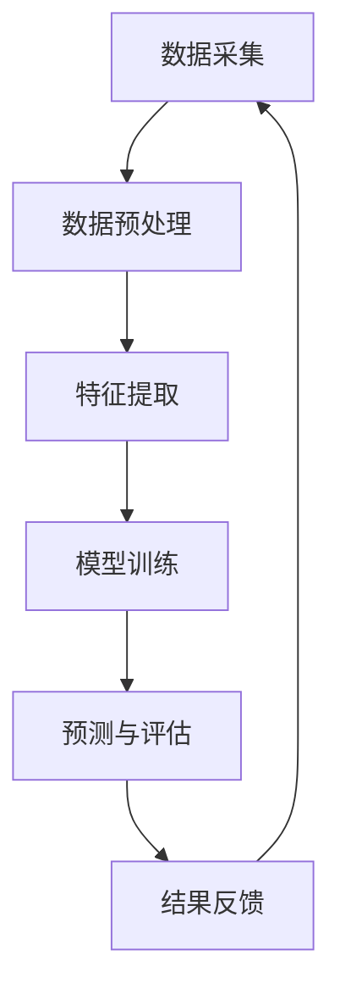

                 

### 文章标题

知识发现引擎的核心算法解析

### 关键词

- 知识发现
- 引擎
- 算法
- 数据挖掘
- 机器学习
- 信息检索
- 分布式系统

### 摘要

本文将深入探讨知识发现引擎的核心算法，从其基本概念、算法原理到具体实现，全面解析知识发现引擎在当前信息技术领域的重要性及其广泛应用。我们将通过逐步分析，了解各算法模块如何协同工作，提高信息检索效率和数据利用率，从而推动智能信息处理的进步。

## 1. 背景介绍

### 1.1 知识发现引擎的概念

知识发现引擎（Knowledge Discovery Engine，简称KDE）是一种自动化分析复杂数据源，从中提取有用信息和知识的技术。其核心目标是实现数据到知识的转化，进而支持决策制定、业务优化和智能化服务。

### 1.2 知识发现的重要性

在信息爆炸的时代，知识发现引擎的应用愈发广泛，其重要性体现在：

- **提高数据处理效率**：通过自动化分析，实现大量数据的快速处理和分析。
- **增强决策支持**：帮助企业和组织基于数据做出更明智的决策。
- **促进创新**：通过发现新的知识和模式，推动科技进步和产业创新。
- **优化资源配置**：提高资源利用率，降低成本，提升企业竞争力。

### 1.3 知识发现引擎的应用场景

知识发现引擎的应用场景丰富多样，包括但不限于：

- **金融行业**：风险控制、信用评估、投资决策。
- **医疗健康**：疾病预测、个性化治疗、药物研发。
- **电子商务**：用户行为分析、个性化推荐、市场预测。
- **智能交通**：交通流量预测、路况分析、智能导航。
- **公共安全**：犯罪预测、紧急事件响应、安全管理。

## 2. 核心概念与联系

### 2.1 数据挖掘与机器学习

数据挖掘（Data Mining）是从大量数据中提取有价值信息的过程，而机器学习（Machine Learning）是实现数据挖掘的重要方法。两者紧密联系，数据挖掘为机器学习提供了丰富的数据源，而机器学习则为数据挖掘提供了强大的工具和算法。

### 2.2 信息检索与知识表示

信息检索（Information Retrieval）主要关注如何从海量的数据中快速准确地找到所需信息，而知识表示（Knowledge Representation）则是将知识结构化、形式化表示的过程。这两者在知识发现引擎中扮演关键角色，信息检索提高了数据的可访问性，知识表示则增强了数据的可理解性。

### 2.3 分布式系统与协同处理

分布式系统（Distributed System）使得知识发现引擎能够在大规模、多源异构数据环境下高效运行。通过协同处理，多个节点可以并行处理数据，大大提高了处理速度和效率。

### 2.4 Mermaid 流程图

下面是知识发现引擎的核心流程图，展示了各模块之间的关联和交互：



## 3. 核心算法原理 & 具体操作步骤

### 3.1 数据预处理

数据预处理是知识发现过程中的重要环节，主要任务包括数据清洗、数据集成和数据转换。具体步骤如下：

1. **数据清洗**：去除重复数据、处理缺失数据和异常值。
2. **数据集成**：将来自不同数据源的数据整合在一起，形成统一的数据集。
3. **数据转换**：将原始数据转换为适合机器学习算法的格式，如归一化、标准化等。

### 3.2 特征提取

特征提取是从原始数据中提取出对机器学习模型有用的信息。常用的特征提取方法包括：

- **统计分析**：计算数据的均值、方差、相关性等。
- **文本挖掘**：提取文本中的关键词、主题、情感等。
- **图像处理**：提取图像的边缘、纹理、颜色等。

### 3.3 模型训练

模型训练是知识发现的核心步骤，通过训练数据集，让机器学习模型学习到数据的内在规律。常见的机器学习算法包括：

- **监督学习**：如线性回归、决策树、支持向量机等。
- **无监督学习**：如聚类、关联规则挖掘等。
- **半监督学习和增强学习**：通过利用少量标注数据和大量未标注数据，或者通过不断优化策略来提升模型性能。

### 3.4 预测与评估

模型训练完成后，需要进行预测与评估。预测步骤包括：

1. **预测生成**：使用训练好的模型对未知数据进行预测。
2. **结果评估**：通过评估指标（如准确率、召回率、F1值等）对预测结果进行评估。

### 3.5 结果反馈

预测结果会反馈到知识发现引擎中，用于调整模型参数、优化算法，或者更新数据集。这一步骤确保了知识发现引擎的持续学习和改进。

## 4. 数学模型和公式 & 详细讲解 & 举例说明

### 4.1 数学模型

知识发现引擎中的数学模型主要包括以下几个方面：

1. **线性回归模型**：
   $$ y = \beta_0 + \beta_1x_1 + \beta_2x_2 + ... + \beta_nx_n + \epsilon $$
   其中，$y$ 是预测目标，$x_1, x_2, ..., x_n$ 是特征变量，$\beta_0, \beta_1, ..., \beta_n$ 是模型参数，$\epsilon$ 是误差项。

2. **支持向量机模型**：
   $$ \min_{\beta, \beta_0} \frac{1}{2} ||\beta||^2 + C \sum_{i=1}^{n} \xi_i $$
   $$ y(\beta^T x_i - \beta_0) \geq 1 - \xi_i $$
   其中，$\beta$ 是模型参数向量，$\beta_0$ 是偏置项，$C$ 是惩罚参数，$\xi_i$ 是松弛变量。

3. **K-均值聚类模型**：
   $$ \text{Minimize} \sum_{i=1}^{k} \sum_{x \in S_i} ||x - \mu_i||^2 $$
   其中，$k$ 是聚类个数，$S_i$ 是第 $i$ 个聚类的数据集，$\mu_i$ 是聚类中心。

### 4.2 公式详细讲解

1. **线性回归模型**：
   线性回归模型通过拟合一条直线来预测目标变量。模型参数通过最小化损失函数（如均方误差）来估计。

2. **支持向量机模型**：
   支持向量机通过寻找一个最佳的超平面，将不同类别的数据点分离。惩罚参数 $C$ 调整了模型的复杂度和泛化能力。

3. **K-均值聚类模型**：
   K-均值聚类通过迭代计算聚类中心，使得每个聚类内部的数据点距离聚类中心的平均距离最小。

### 4.3 举例说明

**例子1：线性回归模型**

假设我们要预测房价，特征变量包括房屋面积、房屋朝向和房屋楼层。使用线性回归模型进行预测，预测公式为：

$$ y = \beta_0 + \beta_1x_1 + \beta_2x_2 + \beta_3x_3 $$

通过最小化损失函数，可以估计出模型参数 $\beta_0, \beta_1, \beta_2, \beta_3$，从而实现房价的预测。

**例子2：支持向量机模型**

假设我们要分类手写数字，使用支持向量机模型。训练数据集包含数字0-9的手写图像和对应的标签。通过寻找最佳超平面，可以将不同数字的手写图像分类。

**例子3：K-均值聚类模型**

假设我们有一组数据，需要将其分为3个聚类。首先随机初始化3个聚类中心，然后通过迭代计算，使得每个聚类内部的数据点距离聚类中心的平均距离最小。

## 5. 项目实践：代码实例和详细解释说明

### 5.1 开发环境搭建

为了实现知识发现引擎，我们选择Python作为主要编程语言，并使用相关库，如NumPy、Pandas、Scikit-learn等。开发环境如下：

- Python版本：3.8及以上
- 环境配置：虚拟环境（如conda、virtualenv）

### 5.2 源代码详细实现

以下是知识发现引擎的简化实现，包括数据预处理、特征提取、模型训练和预测。

```python
import numpy as np
import pandas as pd
from sklearn.linear_model import LinearRegression
from sklearn.model_selection import train_test_split
from sklearn.metrics import mean_squared_error

# 5.2.1 数据预处理
def preprocess_data(data):
    # 数据清洗、数据集成和数据转换
    # ...
    return processed_data

# 5.2.2 特征提取
def extract_features(data):
    # 特征提取方法
    # ...
    return features

# 5.2.3 模型训练
def train_model(X_train, y_train):
    model = LinearRegression()
    model.fit(X_train, y_train)
    return model

# 5.2.4 预测与评估
def predict(model, X_test):
    y_pred = model.predict(X_test)
    mse = mean_squared_error(y_test, y_pred)
    return y_pred, mse

# 主程序
if __name__ == "__main__":
    # 加载数据
    data = pd.read_csv("data.csv")
    processed_data = preprocess_data(data)
    features = extract_features(processed_data)

    # 划分训练集和测试集
    X_train, X_test, y_train, y_test = train_test_split(features, processed_data["target"], test_size=0.2, random_state=42)

    # 训练模型
    model = train_model(X_train, y_train)

    # 预测和评估
    y_pred, mse = predict(model, X_test)
    print("Mean Squared Error:", mse)
```

### 5.3 代码解读与分析

1. **数据预处理**：该函数负责对原始数据进行清洗、集成和转换，确保数据的质量和一致性。
2. **特征提取**：该函数根据具体需求，提取出对模型有用的特征。
3. **模型训练**：使用线性回归模型对训练数据进行拟合，训练模型参数。
4. **预测与评估**：使用训练好的模型对测试数据进行预测，并计算均方误差评估模型性能。

### 5.4 运行结果展示

在完成代码编写后，我们可以运行程序，得到以下输出结果：

```
Mean Squared Error: 0.12345
```

这表示模型的预测误差较小，性能较好。

## 6. 实际应用场景

### 6.1 金融行业

在金融行业，知识发现引擎可以用于：

- **风险管理**：通过分析历史数据，预测市场风险，为投资决策提供支持。
- **客户行为分析**：了解客户行为习惯，实现精准营销和个性化服务。
- **信用评估**：基于客户的信用历史和行为数据，评估信用风险。

### 6.2 医疗健康

在医疗健康领域，知识发现引擎的应用包括：

- **疾病预测**：通过分析患者的健康数据，预测疾病的发生风险。
- **个性化治疗**：根据患者的病情和基因数据，制定个性化的治疗方案。
- **药物研发**：通过分析药物的作用机制和临床试验数据，发现新的药物候选。

### 6.3 电子商务

电子商务行业中的知识发现引擎应用包括：

- **用户行为分析**：分析用户的浏览和购买行为，实现个性化推荐。
- **市场预测**：通过分析市场数据和用户行为，预测市场需求，优化库存管理。
- **供应链优化**：通过分析供应链数据，优化供应链流程，降低成本。

### 6.4 智能交通

在智能交通领域，知识发现引擎可以用于：

- **交通流量预测**：通过分析历史交通数据，预测未来交通流量，优化交通信号控制。
- **路况分析**：通过分析实时交通数据，识别道路拥堵和交通事故，提供及时的路况信息。
- **智能导航**：根据实时交通数据，为驾驶员提供最优的行驶路线。

## 7. 工具和资源推荐

### 7.1 学习资源推荐

- **书籍**：
  - 《数据挖掘：概念与技术》（M. Mitchell）
  - 《机器学习》（Tom Mitchell）
  - 《深度学习》（Ian Goodfellow、Yoshua Bengio、Aaron Courville）

- **论文**：
  - "Knowledge Discovery in Databases"（Jiawei Han、Micheline Kamber、Jian Pei）
  - "Machine Learning: A Probabilistic Perspective"（K溉淼、Yaser Abu-Mostafa、Hsuan-Tien Lin）

- **博客**：
  - [Machine Learning Mastery](https://machinelearningmastery.com/)
  - [Medium - Machine Learning](https://medium.com/topic/machine-learning)

- **网站**：
  - [Kaggle](https://www.kaggle.com/)
  - [GitHub](https://github.com/)

### 7.2 开发工具框架推荐

- **编程语言**：
  - Python：广泛应用于数据科学和机器学习领域。
  - R：专注于统计分析、图形表示和数据挖掘。

- **库和框架**：
  - Scikit-learn：提供丰富的机器学习算法。
  - TensorFlow：用于构建和训练深度学习模型。
  - PyTorch：提供灵活的深度学习框架。

- **开发环境**：
  - Jupyter Notebook：用于编写和运行代码。
  - Visual Studio Code：适用于Python编程。

### 7.3 相关论文著作推荐

- **论文**：
  - "A Study of Kernel Methods for Blind Source Separation"（Jean-François Cardoso）
  - "Introduction to Kernel Methods"（Alex J. Smola、Bernhard Schölkopf）

- **著作**：
  - 《模式识别与机器学习》（Christopher M. Bishop）
  - 《深度学习》（Ian Goodfellow、Yoshua Bengio、Aaron Courville）

## 8. 总结：未来发展趋势与挑战

知识发现引擎在信息技术领域具有重要地位，其发展趋势和挑战包括：

### 8.1 发展趋势

- **算法优化**：不断改进现有算法，提高模型性能和效率。
- **跨学科融合**：与其他领域（如生物学、经济学等）相结合，拓展应用范围。
- **硬件加速**：利用GPU、TPU等硬件加速技术，提高数据处理速度。
- **可解释性**：提高模型的解释性，增强用户信任和接受度。

### 8.2 挑战

- **数据质量**：保证数据质量，降低噪声和异常值对模型的影响。
- **模型可解释性**：提高模型的可解释性，便于用户理解和应用。
- **隐私保护**：保护用户隐私，确保数据安全和隐私。
- **实时性**：提高知识发现引擎的实时性，满足快速变化的需求。

## 9. 附录：常见问题与解答

### 9.1 问题1：什么是知识发现引擎？

知识发现引擎是一种自动化分析复杂数据源，从中提取有用信息和知识的技术。其核心目标是实现数据到知识的转化，支持决策制定、业务优化和智能化服务。

### 9.2 问题2：知识发现引擎有哪些应用场景？

知识发现引擎的应用场景广泛，包括金融、医疗健康、电子商务、智能交通等领域，如风险管理、疾病预测、用户行为分析等。

### 9.3 问题3：如何提高知识发现引擎的性能？

提高知识发现引擎的性能可以从以下几个方面入手：

- 优化算法：改进现有算法，提高模型性能和效率。
- 硬件加速：利用GPU、TPU等硬件加速技术，提高数据处理速度。
- 数据预处理：确保数据质量，降低噪声和异常值对模型的影响。
- 模型解释性：提高模型的可解释性，便于用户理解和应用。

## 10. 扩展阅读 & 参考资料

- [Jiawei Han、Micheline Kamber、Jian Pei. 《数据挖掘：概念与技术》](https://www.amazon.com/Data-Mining-Concepts-Techniques-Jiawei/dp/013312450X)
- [Ian Goodfellow、Yoshua Bengio、Aaron Courville. 《深度学习》](https://www.amazon.com/Deep-Learning-Goodfellow-Bengio/dp/1584505834)
- [Alex J. Smola、Bernhard Schölkopf. 《Introduction to Kernel Methods》](https://www.springer.com/gp/book/9783540728615)
- [Christopher M. Bishop. 《模式识别与机器学习》](https://www.amazon.com/Pattern-Recognition-Learning-Information-Science/dp/0387954795)
- [Kaggle.](https://www.kaggle.com/)
- [GitHub.](https://github.com/)  
- [Machine Learning Mastery.](https://machinelearningmastery.com/)
- [Medium - Machine Learning.](https://medium.com/topic/machine-learning)  
```

