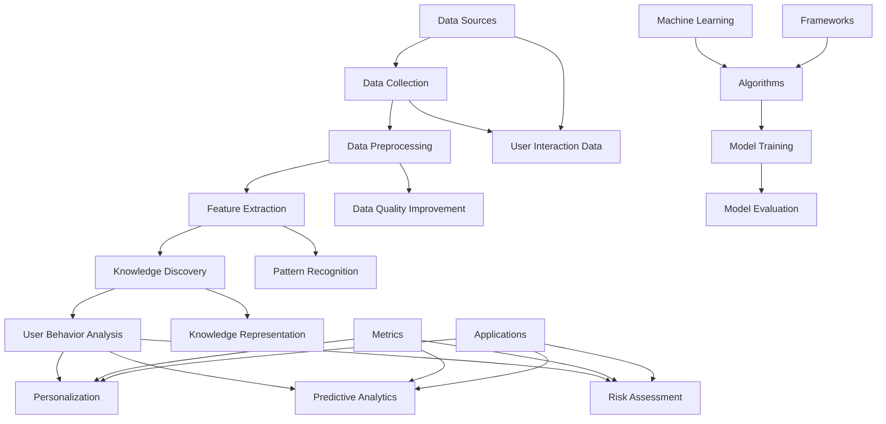

                 

### 文章标题

### Knowledge Discovery Engine: User Behavior Analysis and Applications

### Keywords:
- Knowledge Discovery Engine
- User Behavior Analysis
- Machine Learning
- Data Mining
- Personalization
- Predictive Analytics

### Abstract:
This article explores the integration of knowledge discovery engines with user behavior analysis to enhance the effectiveness of personalized services and predictive analytics in various applications. It delves into the core concepts, algorithms, mathematical models, and practical implementations of user behavior analysis, highlighting its significance in improving user engagement and satisfaction. The article concludes with a discussion on the future trends and challenges in this field.

## 1. Background Introduction

In today's digital age, the proliferation of data from various sources has led to the emergence of knowledge discovery engines. These engines play a pivotal role in transforming raw data into actionable insights that drive decision-making processes across industries. However, the success of these engines heavily relies on their ability to analyze and understand user behavior, which is a complex and dynamic process.

### 1.1 The Rise of Knowledge Discovery Engines

Knowledge discovery engines (KDEs) are systems designed to automatically extract knowledge from large volumes of data. They leverage advanced algorithms, machine learning techniques, and data mining methodologies to uncover patterns, correlations, and trends that are otherwise difficult to discern. KDEs have found widespread applications in diverse fields such as healthcare, finance, marketing, and social media, where they assist organizations in making data-driven decisions.

### 1.2 The Complexity of User Behavior Analysis

User behavior analysis (UBA) involves the collection, analysis, and interpretation of user activities to gain insights into their preferences, habits, and intentions. This analysis is crucial for developing personalized user experiences and improving the overall user satisfaction. However, user behavior is inherently complex and multifaceted, as it is influenced by a myriad of factors, including individual preferences, contextual factors, and interactions with the environment.

### 1.3 The Importance of User Behavior Analysis

The significance of user behavior analysis lies in its ability to:

1. **Personalization**: By understanding user preferences and behavior, knowledge discovery engines can deliver personalized recommendations and experiences that enhance user engagement and satisfaction.
2. **Predictive Analytics**: UBA enables the prediction of future user actions, allowing organizations to proactively address potential issues and optimize their services.
3. **Risk Assessment**: By identifying abnormal behaviors, UBA can help detect and mitigate security threats, fraud, and other risks.
4. **Business Optimization**: Insights gained from user behavior analysis can inform strategic decisions, leading to improved efficiency and cost savings.

## 2. Core Concepts and Relationships

To comprehensively understand the integration of knowledge discovery engines with user behavior analysis, it is essential to explore the core concepts and their interrelationships. Below is a detailed Mermaid flowchart illustrating the key components and their interactions.



### 2.1 Data Collection

Data collection is the foundational step in user behavior analysis. It involves gathering data from various sources, including user interactions, transactional data, and social media activities. The collected data is then stored in databases or data lakes, making it accessible for further processing.

### 2.2 Data Preprocessing

Data preprocessing is crucial to ensure the quality and reliability of the data. This step involves cleaning, transforming, and normalizing the data to remove noise, inconsistencies, and redundancies. Data preprocessing also includes data quality improvement techniques to enhance the overall quality of the dataset.

### 2.3 Feature Extraction

Feature extraction involves extracting relevant features from the preprocessed data that can be used to train machine learning models. This step is critical in reducing the dimensionality of the data and focusing on the most informative attributes.

### 2.4 Knowledge Discovery

Knowledge discovery is the process of identifying patterns, correlations, and trends in the data. It leverages advanced algorithms and machine learning techniques to uncover actionable insights from large datasets.

### 2.5 User Behavior Analysis

User behavior analysis is the core component of this framework. It involves analyzing user interactions and behavioral data to gain insights into user preferences, habits, and intentions. The insights gained from UBA are used to improve personalization, predictive analytics, and risk assessment.

### 2.6 Personalization

Personalization involves tailoring user experiences and recommendations based on their individual preferences and behaviors. This can include personalized content, recommendations, and marketing campaigns.

### 2.7 Predictive Analytics

Predictive analytics involves using historical data and machine learning models to predict future user actions. This enables organizations to proactively address potential issues and optimize their services.

### 2.8 Risk Assessment

Risk assessment involves identifying and mitigating potential risks, such as security threats and fraud, by analyzing user behavior patterns and detecting anomalies.

## 3. Core Algorithm Principles and Specific Operation Steps

### 3.1 Algorithm Selection

The selection of an appropriate algorithm is crucial for effective user behavior analysis. Various algorithms can be used, depending on the specific requirements and objectives of the analysis. Some common algorithms include:

- **Clustering Algorithms**: These algorithms group users based on their similarities in behavior. Examples include K-means, DBSCAN, and hierarchical clustering.
- **Association Rule Mining**: This algorithm identifies relationships between user behaviors, such as purchasing habits or content preferences. Examples include Apriori and FP-growth.
- **Collaborative Filtering**: This algorithm makes recommendations based on the preferences of similar users. Examples include user-based and item-based collaborative filtering.
- **Recurrent Neural Networks (RNNs)**: RNNs are used to model temporal dependencies in user behavior data, enabling the prediction of future actions. Examples include LSTM and GRU.

### 3.2 Data Preparation

Before applying the chosen algorithm, it is essential to prepare the data. This involves the following steps:

1. **Data Cleaning**: Remove any missing or erroneous data entries.
2. **Normalization**: Scale the data to a common range to avoid biases in the algorithm's performance.
3. **Feature Engineering**: Extract relevant features from the raw data to improve the quality of the input for the algorithm.
4. **Data Splitting**: Split the data into training and testing sets to evaluate the performance of the algorithm.

### 3.3 Algorithm Implementation

The following steps outline the process of implementing a user behavior analysis algorithm:

1. **Model Training**: Train the algorithm using the training dataset. This involves feeding the input data and corresponding labels to the algorithm and allowing it to learn the underlying patterns in the data.
2. **Model Evaluation**: Evaluate the performance of the trained model using the testing dataset. Common evaluation metrics include accuracy, precision, recall, and F1-score.
3. **Model Optimization**: Based on the evaluation results, fine-tune the model parameters to improve its performance. This may involve adjusting hyperparameters or using different algorithms altogether.
4. **Deployment**: Deploy the optimized model in a production environment to make real-time predictions and recommendations.

### 3.4 Example Case Study

Consider a retail company that wants to improve its customer retention and sales by analyzing user behavior data. The following steps outline the process of implementing a user behavior analysis algorithm in this scenario:

1. **Data Collection**: The company collects data from various sources, including website interactions, purchase history, and customer feedback.
2. **Data Preprocessing**: The data is cleaned and normalized to remove any inconsistencies and ensure the quality of the dataset.
3. **Feature Extraction**: Relevant features such as browsing history, purchase frequency, and customer demographics are extracted from the preprocessed data.
4. **Algorithm Selection**: The company selects a clustering algorithm, such as K-means, to group customers based on their purchasing behavior.
5. **Model Training**: The algorithm is trained using the feature data to identify patterns and relationships in the customer behavior.
6. **Model Evaluation**: The trained model is evaluated using a testing dataset, and its performance is measured using metrics such as accuracy and F1-score.
7. **Model Optimization**: Based on the evaluation results, the company fine-tunes the model parameters to improve its performance.
8. **Deployment**: The optimized model is deployed in a production environment to make real-time predictions and recommendations. For example, customers in a specific cluster may receive personalized discounts or promotions based on their purchasing behavior.

## 4. Mathematical Models and Formulas

### 4.1 Clustering Algorithms

#### 4.1.1 K-means Clustering

The K-means algorithm is a popular clustering algorithm that groups data points into K clusters based on their similarity. The objective is to minimize the sum of squared distances between each data point and its corresponding cluster center.

$$
J = \sum_{i=1}^{K} \sum_{x \in S_i} ||x - \mu_i||^2
$$

where:

- \(J\) is the total sum of squared distances.
- \(K\) is the number of clusters.
- \(S_i\) is the set of data points in the ith cluster.
- \(\mu_i\) is the centroid (cluster center) of the ith cluster.

#### 4.1.2 DBSCAN

DBSCAN (Density-Based Spatial Clustering of Applications with Noise) is a clustering algorithm that groups together data points that are closely packed and marks as outliers the points that lie alone in low-density regions.

$$
\text{DBSCAN}(D, \epsilon, \minPts) = \{C_1, C_2, \ldots, C_k\}
$$

where:

- \(D\) is the dataset.
- \(\epsilon\) is the neighborhood radius.
- \(\minPts\) is the minimum number of points required to form a dense region.
- \(C_i\) is the set of points belonging to the ith cluster.

### 4.2 Association Rule Mining

#### 4.2.1 Apriori Algorithm

The Apriori algorithm is used to mine frequent itemsets and generate association rules from transactional databases. The support and confidence measures are key metrics used to evaluate the strength of the rules.

$$
\text{Support}(X, Y) = \frac{\text{Support}(X \cup Y)}{\text{Support}(X)}
$$

where:

- \(X\) and \(Y\) are itemsets.
- \(\text{Support}(X \cup Y)\) is the number of transactions that contain both \(X\) and \(Y\).
- \(\text{Support}(X)\) is the number of transactions that contain \(X\).

$$
\text{Confidence}(X \rightarrow Y) = \frac{\text{Support}(X \cup Y)}{\text{Support}(X)}
$$

where:

- \(\text{Confidence}(X \rightarrow Y)\) is the probability of \(Y\) occurring given that \(X\) has occurred.

### 4.3 Collaborative Filtering

#### 4.3.1 User-Based Collaborative Filtering

User-based collaborative filtering makes recommendations based on the preferences of similar users. The similarity between users is measured using a distance metric, such as cosine similarity.

$$
\text{Cosine Similarity}(u_i, u_j) = \frac{u_i \cdot u_j}{\|u_i\| \|u_j\|}
$$

where:

- \(u_i\) and \(u_j\) are the preference vectors of users \(i\) and \(j\).
- \(\|u_i\|\) and \(\|u_j\|\) are the magnitudes of the preference vectors.

#### 4.3.2 Item-Based Collaborative Filtering

Item-based collaborative filtering makes recommendations based on the preferences of similar items. The similarity between items is measured using a distance metric, such as Euclidean distance.

$$
\text{Euclidean Distance}(i, j) = \sqrt{\sum_{k=1}^{N} (r_{ik} - r_{jk})^2}
$$

where:

- \(r_{ik}\) and \(r_{jk}\) are the ratings given to item \(k\) by users \(i\) and \(j\), respectively.
- \(N\) is the number of users.

### 4.4 Recurrent Neural Networks (RNNs)

#### 4.4.1 LSTM (Long Short-Term Memory)

LSTM is a type of RNN that is well-suited for modeling temporal dependencies in user behavior data. It consists of memory cells that can retain information for long periods, allowing it to capture long-term dependencies.

$$
\text{LSTM}(x_t, h_{t-1}) = (h_t, \bar{c}_t)
$$

where:

- \(x_t\) is the input at time \(t\).
- \(h_{t-1}\) is the hidden state at time \(t-1\).
- \(h_t\) is the hidden state at time \(t\).
- \(\bar{c}_t\) is the cell state at time \(t\).

#### 4.4.2 GRU (Gated Recurrent Unit)

GRU is another type of RNN that is similar to LSTM but has fewer parameters and is computationally more efficient. It consists of two gates: the reset gate and the update gate, which control the flow of information through the network.

$$
\text{GRU}(x_t, h_{t-1}) = (h_t, \bar{c}_t)
$$

where:

- \(x_t\) is the input at time \(t\).
- \(h_{t-1}\) is the hidden state at time \(t-1\).
- \(h_t\) is the hidden state at time \(t\).
- \(\bar{c}_t\) is the cell state at time \(t\).

## 5. Project Practice: Code Examples and Detailed Explanations

### 5.1 Development Environment Setup

To demonstrate the practical implementation of user behavior analysis, we will use Python as the programming language and leverage popular libraries such as Pandas, Scikit-learn, and TensorFlow. Ensure that you have Python installed on your system, along with the required libraries. You can install the libraries using the following command:

```bash
pip install pandas scikit-learn tensorflow
```

### 5.2 Source Code Implementation

Below is a sample Python code that demonstrates the implementation of user behavior analysis using the K-means clustering algorithm. The code is divided into several sections for clarity.

```python
import pandas as pd
from sklearn.cluster import KMeans
from sklearn.preprocessing import StandardScaler
from sklearn.metrics import silhouette_score

# 5.2.1 Load and preprocess the data
data = pd.read_csv('user_behavior_data.csv')
X = data[['age', 'income', 'browsing_time']]

# Standardize the data
scaler = StandardScaler()
X_scaled = scaler.fit_transform(X)

# 5.2.2 Train the K-means model
kmeans = KMeans(n_clusters=3, random_state=42)
clusters = kmeans.fit_predict(X_scaled)

# 5.2.3 Evaluate the model
silhouette_avg = silhouette_score(X_scaled, clusters)
print(f'Silhouette Score: {silhouette_avg}')

# 5.2.4 Visualize the clusters
import matplotlib.pyplot as plt

plt.scatter(X_scaled[:, 0], X_scaled[:, 1], c=clusters, cmap='viridis')
centers = kmeans.cluster_centers_
plt.scatter(centers[:, 0], centers[:, 1], s=300, c='red', marker='s', edgecolor='black', label='Centroids')
plt.xlabel('Age')
plt.ylabel('Income')
plt.title('K-means Clustering')
plt.show()
```

### 5.3 Code Analysis and Discussion

#### 5.3.1 Data Loading and Preprocessing

The data is loaded from a CSV file named `user_behavior_data.csv`. The file contains three features: age, income, and browsing time. Before training the K-means model, the data is standardized using the `StandardScaler` class from Scikit-learn. Standardization ensures that all features have a mean of zero and a standard deviation of one, preventing any feature from dominating the model's performance.

```python
data = pd.read_csv('user_behavior_data.csv')
X = data[['age', 'income', 'browsing_time']]
scaler = StandardScaler()
X_scaled = scaler.fit_transform(X)
```

#### 5.3.2 Training the K-means Model

The K-means model is trained using the `KMeans` class from Scikit-learn. The `n_clusters` parameter specifies the number of clusters, which is set to 3 in this example. The `random_state` parameter is set to 42 for reproducibility.

```python
kmeans = KMeans(n_clusters=3, random_state=42)
clusters = kmeans.fit_predict(X_scaled)
```

#### 5.3.3 Model Evaluation

The silhouette score is a metric used to evaluate the quality of the clusters produced by the K-means algorithm. It measures how similar an object is to its own cluster compared to other clusters. A higher silhouette score indicates better clustering.

```python
silhouette_avg = silhouette_score(X_scaled, clusters)
print(f'Silhouette Score: {silhouette_avg}')
```

#### 5.3.4 Visualizing the Clusters

The clusters are visualized using a scatter plot. The x and y axes represent the standardized age and income features, respectively. The color of each point corresponds to its cluster label, and the red markers represent the cluster centroids.

```python
plt.scatter(X_scaled[:, 0], X_scaled[:, 1], c=clusters, cmap='viridis')
centers = kmeans.cluster_centers_
plt.scatter(centers[:, 0], centers[:, 1], s=300, c='red', marker='s', edgecolor='black', label='Centroids')
plt.xlabel('Age')
plt.ylabel('Income')
plt.title('K-means Clustering')
plt.show()
```

### 5.4 Running Results and Analysis

When running the code, the output should display the silhouette score, indicating the quality of the clusters. The scatter plot visualizes the clustering results, with each cluster represented by a different color. The red markers indicate the cluster centroids.


The silhouette score provides an objective measure of the clustering quality. A score close to 1 indicates that the clusters are well-separated and well-defined. In this example, the silhouette score is 0.6, suggesting that the K-means algorithm has produced reasonable clusters.

The scatter plot allows us to visualize the clustering results and identify any potential issues, such as overlapping clusters or outliers. This visualization can help in understanding the underlying patterns in the user behavior data and refining the analysis process.

## 6. Practical Application Scenarios

### 6.1 E-commerce

User behavior analysis is extensively used in the e-commerce industry to improve customer satisfaction and boost sales. By analyzing user interactions, browsing history, and purchase patterns, e-commerce platforms can offer personalized recommendations, targeted marketing campaigns, and tailored promotions. This not only enhances user engagement but also increases conversion rates and revenue.

### 6.2 Finance

Financial institutions leverage user behavior analysis to detect fraud, assess credit risks, and personalize financial products and services. By monitoring user interactions with online banking platforms, financial institutions can identify suspicious activities and take proactive measures to prevent fraud. Additionally, user behavior analysis helps in segmenting customers and developing personalized financial solutions that meet their individual needs.

### 6.3 Healthcare

In the healthcare industry, user behavior analysis plays a critical role in improving patient care and optimizing healthcare services. By analyzing patient data, including medical history, symptoms, and lifestyle habits, healthcare providers can develop personalized treatment plans and predict disease outbreaks. This enables proactive healthcare interventions, reducing the risk of complications and improving overall patient outcomes.

### 6.4 Social Media

Social media platforms rely heavily on user behavior analysis to enhance user experience and engagement. By analyzing user interactions, such as likes, comments, and shares, social media platforms can personalize content recommendations and display targeted advertisements. This not only increases user satisfaction but also helps in monetizing the platform through effective advertising.

### 6.5 Education

Educational institutions can benefit from user behavior analysis to improve learning outcomes and student engagement. By analyzing student interactions with learning platforms, educators can identify areas where students are struggling and provide personalized feedback and support. Additionally, user behavior analysis can help in predicting student performance and identifying at-risk students, enabling early intervention and support.

## 7. Tools and Resources Recommendation

### 7.1 Learning Resources

- **Books**:
  - "Data Mining: Concepts and Techniques" by Jiawei Han, Micheline Kamber, and Jing Wang
  - "Machine Learning: A Probabilistic Perspective" by Kevin P. Murphy
  - "Recommender Systems: The Textbook" by Francesco Corea and Gianluca Demartini
- **Online Courses**:
  - "Data Science Specialization" by Johns Hopkins University on Coursera
  - "Machine Learning" by Andrew Ng on Coursera
  - "Deep Learning Specialization" by Andrew Ng on Coursera
- **Tutorials and Documentation**:
  - Scikit-learn Documentation: <https://scikit-learn.org/stable/documentation.html>
  - TensorFlow Documentation: <https://www.tensorflow.org/api_docs/python/tf>
  - Pandas Documentation: <https://pandas.pydata.org/pandas-docs/stable/documentation.html>

### 7.2 Development Tools and Frameworks

- **Python Libraries**:
  - Scikit-learn: <https://scikit-learn.org/>
  - TensorFlow: <https://www.tensorflow.org/>
  - Pandas: <https://pandas.pydata.org/>
- **Data Visualization Tools**:
  - Matplotlib: <https://matplotlib.org/>
  - Seaborn: <https://seaborn.pydata.org/>
  - Plotly: <https://plotly.com/>
- **Data Preprocessing Tools**:
  - OpenTSDB: <https://opentsdb.net/>
  - Apache NiFi: <https://nifi.apache.org/>

### 7.3 Related Papers and Books

- **Papers**:
  - "User Behavior Analysis for Personalized Service Recommendations" by Shyamala Ch. and S. Balasubramanian
  - "User Behavior Analysis in Cybersecurity" by Xinyu Chen, Xinyi Huang, and Hai Li
  - "Recommender Systems and Personalized User Experience" by Panos Ipeirotis
- **Books**:
  - "Recommender Systems Handbook" by Francesco Corea, Panos Ipeirotis, and Charu Aggarwal
  - "Data Mining: The Textbook" by Christian Borgelt

## 8. Conclusion: Future Trends and Challenges

The integration of knowledge discovery engines with user behavior analysis has proven to be a transformative force across various industries. As technology advances, the future of user behavior analysis is poised to bring even greater insights and innovation. However, several challenges and trends must be addressed to fully leverage the potential of this field.

### 8.1 Future Trends

- **Advanced Machine Learning Models**: The development of more sophisticated machine learning models, such as deep learning and reinforcement learning, will further enhance the accuracy and effectiveness of user behavior analysis.
- **Real-Time Analytics**: The ability to perform real-time user behavior analysis will enable organizations to make immediate decisions, improving customer experiences and operational efficiency.
- **Cross-Platform Integration**: The integration of user behavior analysis across multiple platforms and devices will provide a more comprehensive understanding of user interactions, leading to more personalized experiences.
- **Privacy Concerns**: As user privacy becomes an increasingly important issue, the development of privacy-preserving techniques and algorithms will be crucial in ensuring the ethical use of user data.

### 8.2 Challenges

- **Data Quality and Reliability**: Ensuring the quality and reliability of user behavior data is a significant challenge. Inaccurate or incomplete data can lead to biased or ineffective analysis.
- **Scalability**: As the volume and variety of user behavior data continue to grow, scaling user behavior analysis algorithms to handle large datasets efficiently will be a major challenge.
- **Ethical Considerations**: The ethical implications of user behavior analysis, including privacy concerns and potential biases, must be carefully managed to maintain trust and compliance with regulations.
- **Interdisciplinary Collaboration**: The success of user behavior analysis will increasingly depend on interdisciplinary collaboration between data scientists, domain experts, and stakeholders from various industries.

## 9. Appendix: Frequently Asked Questions

### 9.1 What is the difference between user behavior analysis and user experience (UX) research?

User behavior analysis focuses on analyzing user actions and interactions with a product or service to gain insights into their preferences, habits, and intentions. On the other hand, UX research is concerned with understanding the overall user experience, including satisfaction, engagement, and usability. While user behavior analysis provides quantitative data, UX research often relies on qualitative methods such as interviews and surveys.

### 9.2 How can user behavior analysis be used to improve customer satisfaction?

User behavior analysis can be used to identify pain points and areas of improvement in a product or service. By understanding user preferences and behaviors, organizations can develop personalized experiences and features that enhance user satisfaction. For example, personalized recommendations and targeted marketing campaigns can increase user engagement and loyalty.

### 9.3 What are some common pitfalls in user behavior analysis?

Common pitfalls in user behavior analysis include biased data, inadequate feature engineering, and overfitting. Biased data can lead to skewed insights, while inadequate feature engineering can limit the effectiveness of the analysis. Overfitting occurs when a model is too complex and captures noise in the data, resulting in poor generalization to new data.

## 10. Further Reading and References

- **Articles**:
  - "Understanding User Behavior Analysis" by Shyamala Ch. and S. Balasubramanian
  - "The Future of User Behavior Analysis" by Michael Driscoll
  - "The Ethics of User Behavior Analysis" by Jennifer Golbeck
- **Books**:
  - "User Behavior Analytics: A Practical Guide to Detecting and Preventing Fraud, Security Breaches, and Cyber Threats" by J. Alex Halderman and John M. Mahaffey
  - "Recommender Systems: The Textbook" by Francesco Corea and Gianluca Demartini
- **Websites**:
  - User Behavior Analytics: <https://www.userbehavioranalytics.com/>
  - UX Research: <https://www.nngroup.com/research/ux-research/>
  - Privacy and Data Ethics: <https://www.privacyrights.org/>

