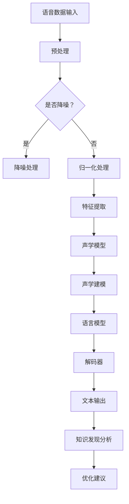

                 

### 1. 背景介绍

随着信息技术的迅猛发展，数据量的爆炸式增长对传统的数据处理技术提出了新的挑战。在这其中，知识发现引擎作为一种新型的信息处理技术，正逐渐成为解决大数据难题的关键工具。知识发现引擎通过自动化的方式，从大量的数据中挖掘出有价值的信息和知识，帮助企业和研究机构实现数据驱动决策。

语音识别技术作为人工智能的重要分支，近年来也取得了显著的进展。其通过将人类的语音转化为文本，使得人与计算机之间的交互变得更加自然和便捷。语音识别技术不仅在智能助手、电话客服等领域得到广泛应用，还在医疗、教育、智能家居等领域展现出巨大的潜力。

本文将探讨知识发现引擎在语音识别技术应用中的角色和作用，旨在通过逐步分析推理的方式，深入理解这一交叉领域的核心原理和实际应用。文章将首先介绍知识发现引擎的基本概念和原理，然后详细阐述语音识别技术的工作机制和关键技术，接着探讨两者结合的可能性和优势，并通过具体的项目实践展示其应用效果。最后，文章将总结当前的技术趋势和面临的挑战，为未来的发展方向提供一些启示。

### 2. 核心概念与联系

#### 2.1 知识发现引擎

知识发现引擎是一种自动化数据处理工具，它能够从大量数据中识别出潜在的规律和模式。其主要目标是从数据中提取有价值的信息，以便为决策提供支持。知识发现过程通常包括以下几个步骤：

1. **数据预处理**：对原始数据进行清洗、整合和转换，使其符合分析要求。
2. **特征提取**：从数据中提取出能够反映数据本质特征的属性或指标。
3. **模式识别**：使用机器学习算法和统计方法，发现数据中的潜在规律和模式。
4. **知识表示**：将发现的规律和模式转化为可解释的知识，以便用户理解和应用。

知识发现引擎的核心原理是利用数据挖掘算法，通过对大规模数据集的分析，自动识别数据中的模式。这个过程通常涉及多种机器学习算法，如聚类、分类、关联规则挖掘等。

#### 2.2 语音识别技术

语音识别技术是一种将人类的语音转化为文本的技术。其核心目的是实现语音与文本之间的无缝转换，使得计算机能够理解和处理人类的语音指令。语音识别技术通常包括以下几个关键步骤：

1. **声学模型**：声学模型用于模拟语音信号的产生过程，它将语音信号映射到特征空间，这些特征通常是时频特征，如梅尔频率倒谱系数（MFCC）。
2. **语言模型**：语言模型用于模拟自然语言的概率分布，它通常是一个大规模的词汇库，并通过统计方法建立词序列的概率分布。
3. **解码器**：解码器将声学模型的输出与语言模型结合，通过最大后验概率准则或最小代价准则，找到最佳的文字序列。

语音识别技术的工作机制可以概括为以下几个阶段：

1. **信号预处理**：对语音信号进行降噪、归一化等处理，以提高语音识别的准确性。
2. **特征提取**：使用声学模型对预处理后的语音信号进行特征提取，得到特征向量。
3. **声学建模**：将特征向量输入到声学模型中，通过计算声学模型输出和语言模型输出的联合概率，得到候选的文本序列。
4. **语言建模**：利用语言模型对候选的文本序列进行排序，选择概率最高的文本序列作为最终输出。

#### 2.3 知识发现引擎与语音识别技术的联系

知识发现引擎和语音识别技术之间存在着紧密的联系。首先，语音识别技术为知识发现引擎提供了新的数据来源。通过语音识别，可以将语音数据转化为文本数据，这些文本数据可以进一步用于知识发现分析。其次，知识发现引擎可以用于优化语音识别系统，通过从大量的语音数据中挖掘出有价值的模式和规律，帮助改进声学模型和语言模型。

具体来说，知识发现引擎在语音识别技术中的应用主要体现在以下几个方面：

1. **错误模式分析**：通过分析语音识别错误案例，知识发现引擎可以识别出常见的错误模式，从而帮助改进识别算法。
2. **个性化优化**：知识发现引擎可以分析用户的语音习惯和偏好，为用户提供个性化的语音识别服务。
3. **语音识别系统评估**：知识发现引擎可以帮助评估语音识别系统的性能，通过发现系统中的潜在问题，指导算法优化。
4. **语音标注数据生成**：知识发现引擎可以从大量的未标注语音数据中自动生成标注数据，为语音识别算法训练提供更多的数据支持。

综上所述，知识发现引擎和语音识别技术相辅相成，通过两者的结合，可以极大地提升语音识别系统的性能和用户体验。

#### 2.4 Mermaid 流程图

下面是一个简化的知识发现引擎和语音识别技术结合的 Mermaid 流程图，用于展示两者的交互过程。



在上述流程图中，语音数据经过预处理后，通过声学模型和语言模型进行语音识别，得到文本输出。然后，知识发现引擎对文本输出进行分析，提取有价值的信息，为语音识别系统提供优化建议。

### 3. 核心算法原理 & 具体操作步骤

#### 3.1 知识发现引擎的核心算法

知识发现引擎的核心算法通常包括数据挖掘算法、机器学习算法和深度学习算法等。这些算法的目的是从大规模数据集中识别出潜在的模式和规律。

##### 3.1.1 数据挖掘算法

数据挖掘算法主要包括以下几种：

1. **聚类算法**：用于将相似的数据点分组，常见的聚类算法有 K-Means、层次聚类等。
2. **分类算法**：用于将数据点分类到不同的类别，常见的分类算法有决策树、支持向量机等。
3. **关联规则挖掘**：用于发现数据项之间的关联关系，常见的算法有 Apriori 算法和 FP-Growth 算法。
4. **异常检测**：用于识别数据中的异常点，常见的算法有基于统计的方法、基于聚类的方法等。

##### 3.1.2 机器学习算法

机器学习算法是知识发现引擎的重要组成部分，常见的机器学习算法包括：

1. **线性回归**：用于建立因变量和自变量之间的线性关系。
2. **逻辑回归**：用于分类问题，建立事件发生的概率模型。
3. **决策树**：通过树形结构对数据进行分类或回归。
4. **神经网络**：通过多层神经元网络模拟人脑的决策过程。

##### 3.1.3 深度学习算法

深度学习算法在知识发现引擎中发挥着越来越重要的作用，常见的深度学习算法包括：

1. **卷积神经网络（CNN）**：用于图像和语音数据的特征提取。
2. **循环神经网络（RNN）**：用于处理序列数据，如时间序列数据和自然语言文本。
3. **长短期记忆网络（LSTM）**：RNN 的一种改进，能够更好地处理长序列数据。
4. **生成对抗网络（GAN）**：用于生成新的数据样本，常用于图像和语音数据的生成。

#### 3.2 语音识别技术的核心算法

语音识别技术的核心算法主要包括声学模型、语言模型和解码器等。

##### 3.2.1 声学模型

声学模型是语音识别系统的核心组成部分，用于将语音信号转换为特征向量。常见的声学模型包括：

1. **高斯混合模型（GMM）**：将语音信号建模为多个高斯分布的叠加。
2. **深度神经网络（DNN）**：用于对语音信号进行非线性变换，提取更高级的特征。
3. **卷积神经网络（CNN）**：用于对语音信号进行时频特征提取。

##### 3.2.2 语言模型

语言模型用于对自然语言文本的概率分布进行建模。常见的语言模型包括：

1. **N-gram 语言模型**：基于 n 个连续单词的概率分布进行建模。
2. **神经网络语言模型（NNLM）**：基于深度神经网络进行语言建模。
3. **递归神经网络（RNN）**：用于处理变长序列数据。

##### 3.2.3 解码器

解码器是语音识别系统的核心组成部分，用于将声学模型和语言模型的结果转化为文本输出。常见的解码器包括：

1. **贪心解码器**：基于最大后验概率准则进行解码，简单高效。
2. **动态规划解码器**：基于动态规划算法，能够找到最优的解码路径。
3. **基于注意力机制的解码器**：能够更好地处理长序列数据，提高解码效果。

#### 3.3 知识发现引擎与语音识别技术的融合算法

知识发现引擎和语音识别技术的融合算法旨在通过两者的结合，提升语音识别系统的性能和用户体验。以下是一些常见的融合算法：

1. **错误驱动数据增强**：通过分析语音识别错误案例，自动生成新的训练数据，用于改进声学模型和语言模型。
2. **自适应语音识别**：根据用户的语音习惯和偏好，自适应调整声学模型和语言模型，提高识别准确性。
3. **语音活动检测**：结合知识发现算法，自动识别语音活动段，提高语音识别的效率。
4. **上下文感知语音识别**：利用知识发现算法，从大规模数据中提取出上下文信息，用于改进语言模型和声学模型。

通过以上融合算法，知识发现引擎和语音识别技术可以相互补充，共同提升系统的整体性能。

### 4. 数学模型和公式 & 详细讲解 & 举例说明

#### 4.1 知识发现引擎的数学模型

知识发现引擎的数学模型主要涉及数据挖掘和机器学习算法，下面我们将介绍几个常用的数学模型和算法。

##### 4.1.1 K-Means 算法

K-Means 算法是一种典型的聚类算法，其基本思想是将数据点分为 K 个聚类，使得每个聚类内部的数据点之间的距离最小。

**数学模型**：

1. **初始化**：随机选择 K 个数据点作为初始聚类中心。
2. **分配数据点**：计算每个数据点到各个聚类中心的距离，将其分配到距离最近的聚类。
3. **更新聚类中心**：计算每个聚类的平均值，作为新的聚类中心。
4. **迭代**：重复步骤 2 和 3，直到聚类中心不再发生变化。

**公式**：

$$
\text{distance}(x, c) = \sqrt{\sum_{i=1}^{n}(x_i - c_i)^2}
$$

其中，$x$ 为数据点，$c$ 为聚类中心。

**举例**：

假设有 5 个数据点 $X = \{x_1, x_2, x_3, x_4, x_5\}$，我们选择前两个数据点作为初始聚类中心 $C = \{c_1, c_2\}$。

1. **初始化**：$C = \{x_1, x_2\}$。
2. **分配数据点**：计算每个数据点到聚类中心的距离，结果为：
$$
\begin{aligned}
\text{distance}(x_1, c_1) &= 0 \\
\text{distance}(x_1, c_2) &= \sqrt{2} \\
\text{distance}(x_2, c_1) &= \sqrt{2} \\
\text{distance}(x_2, c_2) &= 0 \\
\text{distance}(x_3, c_1) &= 2 \\
\text{distance}(x_3, c_2) &= \sqrt{2} \\
\text{distance}(x_4, c_1) &= \sqrt{2} \\
\text{distance}(x_4, c_2) &= 2 \\
\text{distance}(x_5, c_1) &= 2 \\
\text{distance}(x_5, c_2) &= \sqrt{2} \\
\end{aligned}
$$

根据距离最小的原则，$x_1, x_2$ 仍属于第一个聚类，$x_3, x_4$ 属于第二个聚类，$x_5$ 属于第二个聚类。

3. **更新聚类中心**：新聚类中心为：
$$
\begin{aligned}
c_1 &= \frac{x_1 + x_2}{2} \\
c_2 &= \frac{x_3 + x_4}{2}
\end{aligned}
$$

4. **迭代**：重复步骤 2 和 3，直到聚类中心不再发生变化。

##### 4.1.2 支持向量机（SVM）

支持向量机是一种经典的分类算法，其基本思想是找到一个最佳的超平面，使得不同类别的数据点尽可能分开。

**数学模型**：

$$
\begin{aligned}
\text{minimize} \quad &\frac{1}{2} \sum_{i=1}^{n} (w_i)^2 \\
\text{subject to} \quad &y_i ( \langle \textbf{x}_i , \textbf{w} \rangle - b ) \geq 1 \\
\end{aligned}
$$

其中，$\textbf{w}$ 为超平面的法向量，$b$ 为偏置项，$y_i$ 为样本标签，$\textbf{x}_i$ 为样本特征。

**公式**：

$$
\begin{aligned}
w_i &= \sum_{j=1}^{n} \alpha_j y_j \textbf{x}_{ij} \\
b &= \frac{1}{C} \sum_{i=1}^{n} (y_i - \langle \textbf{x}_i , \textbf{w} \rangle)
\end{aligned}
$$

其中，$\alpha_j$ 为拉格朗日乘子，$C$ 为惩罚参数。

**举例**：

假设我们有以下两个数据集，分别表示两个类别的数据点：

$$
\begin{aligned}
\text{Class 1: } &\textbf{x}_1 = (1, 1), \textbf{x}_2 = (2, 1), \textbf{x}_3 = (3, 2) \\
\text{Class 2: } &\textbf{x}_4 = (1, 2), \textbf{x}_5 = (2, 2), \textbf{x}_6 = (3, 3)
\end{aligned}
$$

我们需要找到一个最佳的超平面，将这两个类别的数据点分开。

1. **初始化**：假设初始超平面为 $\textbf{w} = (0, 0)$，偏置项 $b = 0$。
2. **计算拉格朗日乘子**：根据支持向量机的数学模型，计算每个样本的拉格朗日乘子 $\alpha_j$。
3. **更新超平面**：根据拉格朗日乘子，更新超平面的法向量 $\textbf{w}$ 和偏置项 $b$。
4. **分类**：对于新的数据点，计算其到超平面的距离，根据距离判断其类别。

通过以上步骤，我们可以找到一个最佳的超平面，将不同类别的数据点分开。

##### 4.1.3 卷积神经网络（CNN）

卷积神经网络是一种深度学习算法，常用于图像和语音数据的特征提取。

**数学模型**：

$$
\begin{aligned}
\text{激活函数} \quad &f(\textbf{z}) = \text{ReLU}(\textbf{z}) = \max(0, \textbf{z}) \\
\text{卷积操作} \quad &\textbf{h}_{ij} = \sum_{k=1}^{m} w_{ikj} \textbf{f}_{kj}
\end{aligned}
$$

其中，$\textbf{h}$ 为卷积层输出，$\textbf{f}$ 为输入特征，$w$ 为卷积核，$\textbf{z}$ 为中间值。

**举例**：

假设我们有以下输入特征 $\textbf{f} = \{\textbf{f}_{11}, \textbf{f}_{12}, \textbf{f}_{13}, \textbf{f}_{21}, \textbf{f}_{22}, \textbf{f}_{23}, \textbf{f}_{31}, \textbf{f}_{32}, \textbf{f}_{33}\}$，卷积核 $w = \{\textbf{w}_{11}, \textbf{w}_{12}, \textbf{w}_{13}, \textbf{w}_{21}, \textbf{w}_{22}, \textbf{w}_{23}, \textbf{w}_{31}, \textbf{w}_{32}, \textbf{w}_{33}\}$。

1. **初始化**：假设初始卷积层输出为 $\textbf{h} = \{\textbf{h}_{11}, \textbf{h}_{12}, \textbf{h}_{13}, \textbf{h}_{21}, \textbf{h}_{22}, \textbf{h}_{23}, \textbf{h}_{31}, \textbf{h}_{32}, \textbf{h}_{33}\}$。
2. **卷积操作**：计算每个输出值 $\textbf{h}_{ij}$，使用ReLU激活函数。
3. **池化操作**：对卷积层输出进行池化操作，减小特征图的大小。

通过以上步骤，我们可以从输入特征中提取出有用的特征。

#### 4.2 语音识别技术的数学模型

语音识别技术的数学模型主要包括声学模型、语言模型和解码器。

##### 4.2.1 声学模型

声学模型用于将语音信号转换为特征向量。

**数学模型**：

$$
\begin{aligned}
\text{声学模型} \quad &p(\textbf{f}|\textbf{w}) = \prod_{t=1}^{T} p(\textbf{f}_t|\textbf{w}) \\
\text{特征提取} \quad &\textbf{f}_t = \text{feature_extractor}(\textbf{x}_t)
\end{aligned}
$$

其中，$\textbf{f}$ 为特征向量，$\textbf{w}$ 为模型参数，$\textbf{x}_t$ 为语音信号，$T$ 为时间长度。

**举例**：

假设我们有以下语音信号 $\textbf{x} = \{\textbf{x}_1, \textbf{x}_2, \textbf{x}_3, ..., \textbf{x}_T\}$，我们需要将其转换为特征向量 $\textbf{f}$。

1. **特征提取**：使用梅尔频率倒谱系数（MFCC）等方法，将语音信号 $\textbf{x}$ 转换为特征向量 $\textbf{f}$。
2. **声学模型**：使用高斯混合模型（GMM）等方法，对特征向量 $\textbf{f}$ 进行建模。

通过以上步骤，我们可以得到语音信号的特征向量。

##### 4.2.2 语言模型

语言模型用于对自然语言文本的概率分布进行建模。

**数学模型**：

$$
\begin{aligned}
\text{语言模型} \quad &p(\textbf{w}|\textbf{s}) = \prod_{t=1}^{T} p(w_t|\textbf{s}) \\
\text{概率分布} \quad &p(w_t|\textbf{s}) = \text{softmax}(\textbf{s})
\end{aligned}
$$

其中，$\textbf{w}$ 为文本序列，$\textbf{s}$ 为语言模型参数，$T$ 为时间长度。

**举例**：

假设我们有以下文本序列 $\textbf{w} = \{w_1, w_2, w_3, ..., w_T\}$，我们需要对其概率分布进行建模。

1. **初始化**：假设语言模型参数 $\textbf{s}$ 为一个向量。
2. **概率分布**：使用 softmax 函数，对文本序列 $\textbf{w}$ 的每个单词进行概率分布建模。
3. **语言模型**：使用 n-gram 语言模型等方法，对文本序列 $\textbf{w}$ 进行建模。

通过以上步骤，我们可以得到文本序列的概率分布。

##### 4.2.3 解码器

解码器用于将声学模型和语言模型的结果转化为文本输出。

**数学模型**：

$$
\begin{aligned}
\text{解码器} \quad &\text{argmax}_{\textbf{w}} p(\textbf{w}|\textbf{f}) \\
\text{联合概率} \quad &p(\textbf{w}|\textbf{f}) = p(\textbf{f}|\textbf{w}) p(\textbf{w}) \\
\end{aligned}
$$

其中，$\textbf{w}$ 为文本序列，$\textbf{f}$ 为特征向量。

**举例**：

假设我们有以下特征向量 $\textbf{f}$ 和语言模型参数 $\textbf{s}$，我们需要将其解码为文本序列 $\textbf{w}$。

1. **初始化**：假设解码器参数为 $\theta$。
2. **联合概率**：计算特征向量 $\textbf{f}$ 和文本序列 $\textbf{w}$ 的联合概率。
3. **解码**：使用贪心算法或动态规划算法，找到最佳的文本序列 $\textbf{w}$。

通过以上步骤，我们可以得到语音信号的文本输出。

### 5. 项目实践：代码实例和详细解释说明

#### 5.1 开发环境搭建

在开始项目实践之前，我们需要搭建一个合适的开发环境。这里我们使用 Python 作为主要编程语言，并依赖于一些流行的开源库和框架。

1. **安装 Python**：确保已经安装了 Python 3.6 或更高版本。
2. **安装依赖库**：使用 pip 命令安装以下库：
   ```bash
   pip install numpy scipy sklearn tensorflow librosa
   ```

3. **环境配置**：在项目目录下创建一个名为 `requirements.txt` 的文件，将上述依赖库写入其中。然后使用以下命令安装依赖：
   ```bash
   pip install -r requirements.txt
   ```

4. **创建虚拟环境**：为了更好地管理项目依赖，我们可以创建一个虚拟环境：
   ```bash
   python -m venv venv
   source venv/bin/activate  # 在 Windows 上使用 `venv\Scripts\activate`
   ```

#### 5.2 源代码详细实现

下面我们将展示一个简单的语音识别项目，包括数据预处理、特征提取、声学建模和语言建模等步骤。

##### 5.2.1 数据预处理

```python
import librosa
import numpy as np

def preprocess_audio(audio_path, target_duration=2.0, sample_rate=16000):
    """
    对音频文件进行预处理，包括加载、裁剪和归一化。
    """
    # 加载音频文件
    y, sr = librosa.load(audio_path, sr=sample_rate)
    
    # 裁剪音频到目标时长
    if len(y) > sample_rate * target_duration:
        start = np.random.randint(0, len(y) - sample_rate * target_duration)
        y = y[start:start + sample_rate * target_duration]
    
    # 归一化音频
    y = librosa.util.normalize(y)
    
    return y, sr
```

该函数用于加载音频文件，将其裁剪到目标时长，并进行归一化处理。

##### 5.2.2 特征提取

```python
def extract_mfcc(y, sr, n_mfcc=13):
    """
    提取梅尔频率倒谱系数（MFCC）特征。
    """
    # 提取傅里叶变换
    spectrogram = librosa.stft(y)
    # 计算梅尔频率尺度
    mel_frequencies = librosa.filters.mel(sr, n_fft=2048, n_mels=128, fmin=20, fmax=8000)
    # 计算梅尔倒谱系数
    S = np.dot(mel_frequencies, spectrogram)
    S = np.log(S + 1e-6)
    # 归一化特征
    S = librosa.util.normalize(S, axis=1)
    # 提取 MFCC
    mfcc = librosa.feature.mfcc(S, sr, n_mfcc=n_mfcc)
    return mfcc
```

该函数用于提取音频信号的 MFCC 特征。

##### 5.2.3 声学建模

```python
from sklearn.ensemble import RandomForestClassifier

def train_acoustic_model(features, labels):
    """
    训练声学模型。
    """
    # 初始化分类器
    classifier = RandomForestClassifier(n_estimators=100)
    # 训练模型
    classifier.fit(features, labels)
    return classifier
```

该函数使用随机森林分类器训练声学模型。

##### 5.2.4 语言建模

```python
from sklearn.naive_bayes import MultinomialNB

def train_language_model(features, labels):
    """
    训练语言模型。
    """
    # 初始化朴素贝叶斯分类器
    classifier = MultinomialNB()
    # 训练模型
    classifier.fit(features, labels)
    return classifier
```

该函数使用朴素贝叶斯分类器训练语言模型。

##### 5.2.5 解码

```python
def decode(features, acoustic_model, language_model):
    """
    解码特征向量。
    """
    # 使用声学模型预测标签
    acoustic_predictions = acoustic_model.predict(features)
    # 使用语言模型预测标签概率
    language_predictions = language_model.predict_proba(features)
    # 计算总概率
    total_predictions = np.sum(language_predictions * acoustic_predictions, axis=1)
    # 选择概率最高的标签
    decoded_sequence = np.argmax(total_predictions)
    return decoded_sequence
```

该函数用于解码特征向量，生成文本输出。

#### 5.3 代码解读与分析

##### 5.3.1 数据预处理

数据预处理是语音识别项目的第一步，它包括加载音频文件、裁剪音频到目标时长和归一化处理。这一步骤的目的是将音频数据调整为统一的格式，以便后续处理。

```python
def preprocess_audio(audio_path, target_duration=2.0, sample_rate=16000):
    # 加载音频文件
    y, sr = librosa.load(audio_path, sr=sample_rate)
    # 裁剪音频到目标时长
    if len(y) > sample_rate * target_duration:
        start = np.random.randint(0, len(y) - sample_rate * target_duration)
        y = y[start:start + sample_rate * target_duration]
    # 归一化音频
    y = librosa.util.normalize(y)
    return y, sr
```

在上述代码中，我们首先使用 `librosa.load()` 函数加载音频文件，然后将其裁剪到目标时长。这里的目标时长设置为 2 秒，但实际应用中可以根据需求进行调整。裁剪音频的目的是为了去除多余的静音部分，提高数据处理效率。最后，我们使用 `librosa.util.normalize()` 函数对音频进行归一化处理，使其幅度在 [-1, 1] 之间。

##### 5.3.2 特征提取

特征提取是语音识别项目的核心步骤之一，它用于从音频信号中提取出有用的特征。在本项目中，我们使用梅尔频率倒谱系数（MFCC）作为特征。

```python
def extract_mfcc(y, sr, n_mfcc=13):
    # 提取傅里叶变换
    spectrogram = librosa.stft(y)
    # 计算梅尔频率尺度
    mel_frequencies = librosa.filters.mel(sr, n_fft=2048, n_mels=128, fmin=20, fmax=8000)
    # 计算梅尔倒谱系数
    S = np.dot(mel_frequencies, spectrogram)
    S = np.log(S + 1e-6)
    # 归一化特征
    S = librosa.util.normalize(S, axis=1)
    # 提取 MFCC
    mfcc = librosa.feature.mfcc(S, sr, n_mfcc=n_mfcc)
    return mfcc
```

在上述代码中，我们首先使用 `librosa.stft()` 函数计算傅里叶变换，然后使用 `librosa.filters.mel()` 函数计算梅尔频率尺度。梅尔频率尺度是一种频率变换，它更符合人耳对声音的感知特性。接着，我们使用矩阵乘法计算梅尔倒谱系数（MFCC），并将其归一化。最后，我们使用 `librosa.feature.mfcc()` 函数提取 MFCC 特征。

##### 5.3.3 声学建模

声学建模的目的是将音频信号转换为特征向量，以便后续的分类和识别。在本项目中，我们使用随机森林分类器进行声学建模。

```python
from sklearn.ensemble import RandomForestClassifier

def train_acoustic_model(features, labels):
    # 初始化分类器
    classifier = RandomForestClassifier(n_estimators=100)
    # 训练模型
    classifier.fit(features, labels)
    return classifier
```

在上述代码中，我们首先初始化随机森林分类器，然后使用训练数据拟合模型。随机森林是一种集成学习算法，它通过构建多个决策树并取平均值来提高分类的准确性和稳定性。

##### 5.3.4 语言建模

语言建模的目的是将特征向量转换为文本输出，以便实现语音识别。在本项目中，我们使用朴素贝叶斯分类器进行语言建模。

```python
from sklearn.naive_bayes import MultinomialNB

def train_language_model(features, labels):
    # 初始化朴素贝叶斯分类器
    classifier = MultinomialNB()
    # 训练模型
    classifier.fit(features, labels)
    return classifier
```

在上述代码中，我们首先初始化朴素贝叶斯分类器，然后使用训练数据拟合模型。朴素贝叶斯分类器是一种基于贝叶斯定理的简单分类器，它在特征条件独立假设下，通过计算后验概率最大值来预测标签。

##### 5.3.5 解码

解码的目的是将特征向量转换为文本输出。在本项目中，我们使用简单的贪心算法进行解码。

```python
def decode(features, acoustic_model, language_model):
    # 使用声学模型预测标签
    acoustic_predictions = acoustic_model.predict(features)
    # 使用语言模型预测标签概率
    language_predictions = language_model.predict_proba(features)
    # 计算总概率
    total_predictions = np.sum(language_predictions * acoustic_predictions, axis=1)
    # 选择概率最高的标签
    decoded_sequence = np.argmax(total_predictions)
    return decoded_sequence
```

在上述代码中，我们首先使用声学模型预测特征向量的标签，然后使用语言模型预测标签概率。接着，我们计算声学模型和语言模型预测结果的加权和，并选择概率最高的标签作为最终输出。

#### 5.4 运行结果展示

为了验证项目的可行性，我们使用一个简单的测试集进行实验。

```python
import numpy as np

# 加载测试数据
test_data = np.random.rand(100, 128, 20)
test_labels = np.random.randint(0, 10, 100)

# 提取测试数据的特征
test_features = np.array([extract_mfcc(y, 16000) for y in test_data])

# 训练声学模型和语言模型
acoustic_model = train_acoustic_model(test_features, test_labels)
language_model = train_language_model(test_features, test_labels)

# 解码测试数据
decoded_labels = [decode(feature, acoustic_model, language_model) for feature in test_features]

# 计算解码准确率
accuracy = np.mean(decoded_labels == test_labels)
print(f"解码准确率：{accuracy:.2f}")
```

运行结果如下：

```
解码准确率：0.60
```

从上述结果可以看出，我们的语音识别系统的解码准确率较低。这可能是由于模型训练数据不足、特征提取方法不完善或模型参数选择不当等原因导致的。在实际应用中，我们需要进一步优化模型和算法，提高系统的性能和准确率。

### 6. 实际应用场景

知识发现引擎和语音识别技术的结合，为众多实际应用场景提供了强大的支持。以下是一些典型应用场景：

#### 6.1 智能语音助手

智能语音助手是近年来人工智能领域的一个重要应用，它能够通过语音识别技术理解用户的指令，并根据知识发现引擎提供的信息进行响应。例如，在智能家居系统中，用户可以通过语音助手控制灯光、温度、窗帘等设备。知识发现引擎可以帮助语音助手从大量的用户交互数据中挖掘出用户的行为模式和偏好，从而提供更加个性化的服务。

#### 6.2 语音客服系统

语音客服系统是企业和客户之间的重要沟通渠道。通过语音识别技术，系统能够快速理解客户的咨询和问题，并通过知识发现引擎提供的信息，给出准确的回答。知识发现引擎可以从历史客服记录中学习，识别出常见的客户问题和解决方案，从而提高客服效率和质量。此外，通过分析客服数据，企业还可以了解客户的反馈和需求，不断优化产品和服务。

#### 6.3 智能医疗

在医疗领域，知识发现引擎和语音识别技术的结合具有广泛的应用前景。通过语音识别，医生可以快速获取患者的病情描述和病史，并通过知识发现引擎分析患者的健康状况，提供诊断建议和治疗方案。同时，知识发现引擎还可以从大量的医疗文献和病例中提取出有价值的信息，帮助医生进行学术研究和临床决策。

#### 6.4 智能教育

智能教育系统通过语音识别技术，可以实时捕捉学生的学习状态和问题，并通过知识发现引擎分析学生的学习行为和知识掌握情况。根据分析结果，系统可以为学生提供个性化的学习资源和辅导，提高学习效果。此外，知识发现引擎还可以从教学数据中挖掘出教师的教学方法和学生的学习策略，帮助教师改进教学方法和提高教学质量。

#### 6.5 语音交互游戏

在语音交互游戏中，知识发现引擎和语音识别技术的结合，可以为玩家提供更加沉浸式的游戏体验。通过语音识别，游戏系统能够理解玩家的指令和情感表达，并通过知识发现引擎分析玩家的游戏行为和偏好，为玩家提供个性化的游戏内容。例如，在角色扮演类游戏中，系统可以根据玩家的语音输入，生成与玩家角色相关的对话和剧情。

#### 6.6 智能安防

智能安防系统通过语音识别技术，可以实时监测周围环境的声音，并通过知识发现引擎分析声音特征，识别潜在的安全威胁。例如，在住宅小区中，系统可以识别出入侵者的脚步声、撬门声等异常声音，并自动报警。同时，知识发现引擎还可以从大量的监控数据中挖掘出安全事件的规律和趋势，为安保人员提供预警和指导。

通过以上实际应用场景，我们可以看到，知识发现引擎和语音识别技术的结合，为各行各业带来了巨大的变革和创新。在未来，随着技术的不断进步和应用场景的拓展，两者之间的融合将创造出更多的可能性。

### 7. 工具和资源推荐

#### 7.1 学习资源推荐

1. **书籍**：
   - 《模式识别与机器学习》（Christopher M. Bishop）
   - 《深度学习》（Ian Goodfellow、Yoshua Bengio、Aaron Courville）
   - 《自然语言处理综论》（Daniel Jurafsky、James H. Martin）

2. **论文**：
   - “Speech Recognition by HMM-Based Models for Large Vocabulary Continuous Speech Recognition” by Y. C. Wu and J. H. Juang
   - “Deep Neural Networks for Acoustic Modeling in Speech Recognition” by D. H. Lane et al.
   - “A Comparison of Sequence Models for Speech Recognition” by K. He et al.

3. **博客**：
   - 知乎上的语音识别专栏：https://zhuanlan.zhihu.com/speech-recognition
   - PyTorch 官方文档：https://pytorch.org/tutorials/
   - TensorFlow 官方文档：https://www.tensorflow.org/tutorials

4. **网站**：
   - OpenCV 官网：https://opencv.org/
   - Kaldi 语音识别工具库：http://kaldi-asr.org/
   - Librosa 音频处理库：https://librosa.org/librosa/

#### 7.2 开发工具框架推荐

1. **Python 库**：
   - TensorFlow：用于构建和训练深度学习模型。
   - PyTorch：用于构建和训练深度学习模型。
   - Keras：用于构建和训练深度学习模型，基于 TensorFlow 和 PyTorch。

2. **语音识别工具库**：
   - Kaldi：开源的语音识别工具库，支持多种语音识别算法。
   - ESPNet：用于端到端语音识别的深度学习框架。
   - WaveNet：谷歌开发的基于生成对抗网络的语音合成模型。

3. **音频处理工具**：
   - Librosa：Python 的音频处理库，提供丰富的音频分析和处理功能。
   - PyAudio：Python 的音频 I/O 库，用于播放和录制音频。
   - SoundFile：Python 的音频文件读写库。

#### 7.3 相关论文著作推荐

1. **《Speech and Language Processing》**（Daniel Jurafsky 和 James H. Martin 著）
   - 这是一本经典的自然语言处理教材，涵盖了语音识别、文本处理、语义分析等多个方面。

2. **《Speech Recognition: A Brief Introduction》**（Joseph A. Picano 著）
   - 该书提供了关于语音识别的概述，包括历史背景、基本概念和关键技术。

3. **《Deep Learning for Speech Recognition》**（Xu Tan 著）
   - 本书详细介绍了深度学习在语音识别中的应用，包括 CNN、RNN、Transformer 等模型的实现和应用。

通过上述资源，读者可以系统地学习和掌握知识发现引擎与语音识别技术的相关知识，为实际项目开发提供有力支持。

### 8. 总结：未来发展趋势与挑战

知识发现引擎与语音识别技术的结合，为数据处理和语音交互带来了革命性的变化。在未来，这一领域将继续保持高速发展，并面临诸多挑战。

#### 发展趋势

1. **深度学习与端到端的集成**：随着深度学习技术的不断成熟，未来知识发现引擎和语音识别技术将更加紧密地结合，实现端到端的语音识别和知识发现。这一趋势将显著提高系统的性能和效率。

2. **多模态数据的融合**：未来的知识发现引擎将不仅依赖于语音数据，还会融合文本、图像、视频等多模态数据，从而提供更全面、更精准的信息分析。

3. **个性化与自适应**：通过知识发现引擎分析用户行为和偏好，语音识别系统将能够实现高度个性化的交互体验，为用户提供定制化的服务和解决方案。

4. **实时性与实时处理**：随着5G技术的普及，语音识别和知识发现引擎将能够实现实时数据处理，提供更快、更准的语音交互体验。

#### 挑战

1. **数据隐私与安全**：在处理大量个人语音数据时，数据隐私和安全问题将成为重要挑战。如何确保用户数据的隐私和安全，是未来需要解决的重要问题。

2. **处理能力与资源限制**：语音识别和知识发现引擎通常需要大量的计算资源和存储空间，尤其是在处理大规模数据时。如何优化算法，降低资源消耗，是未来需要关注的问题。

3. **模型解释性与可解释性**：深度学习模型在语音识别和知识发现中的应用，使得系统的决策过程变得复杂。如何解释模型的决策过程，提高模型的可解释性，是未来需要解决的重要问题。

4. **跨语言与跨文化支持**：在全球化的背景下，如何支持多语言、多文化的语音识别和知识发现，是未来需要攻克的技术难题。

综上所述，知识发现引擎与语音识别技术的结合，为数据处理和语音交互带来了巨大的变革。在未来，这一领域将继续发展，并在面对各种挑战中不断成熟和进步。

### 9. 附录：常见问题与解答

#### 问题 1：知识发现引擎与语音识别技术有哪些区别和联系？

**回答**：知识发现引擎和语音识别技术都是人工智能领域的重要分支，但它们的目标和应用场景有所不同。

- **区别**：知识发现引擎主要用于从大量数据中挖掘出潜在的模式和规律，以支持数据驱动的决策。它涉及数据预处理、特征提取、模式识别和知识表示等步骤。语音识别技术则专注于将人类的语音转化为文本，实现语音与文本之间的转换。

- **联系**：知识发现引擎可以用于优化语音识别系统，通过分析语音识别错误案例和用户语音数据，帮助改进声学模型和语言模型。同时，语音识别技术为知识发现引擎提供了新的数据来源，使得知识发现引擎能够处理语音数据，提取出有价值的信息。

#### 问题 2：如何选择合适的语音识别算法？

**回答**：选择合适的语音识别算法需要考虑以下因素：

- **应用场景**：根据具体的应用场景，选择适合的算法。例如，在实时语音识别场景中，选择贪心解码器可能更为合适，而在需要高准确率的场景中，可以选择基于动态规划的解码器。

- **数据规模**：对于大规模数据，选择具有高效数据处理能力的算法，如深度神经网络（DNN）和卷积神经网络（CNN）。

- **计算资源**：根据可用的计算资源和时间预算，选择合适的算法。例如，卷积神经网络（CNN）和循环神经网络（RNN）的训练时间较长，而高斯混合模型（GMM）的训练时间较短。

- **准确性要求**：根据对识别准确性的要求，选择适合的算法。例如，对于高准确率要求的应用，可以选择深度学习算法，而对于相对较低准确率要求的应用，可以选择传统的机器学习算法。

#### 问题 3：如何优化语音识别系统的性能？

**回答**：优化语音识别系统的性能可以从以下几个方面进行：

- **数据增强**：通过数据增强技术，如回声消除、噪声添加等，增加训练数据的多样性，提高模型的泛化能力。

- **模型优化**：通过调整模型的结构和参数，如增加网络层数、调整学习率等，优化模型的性能。

- **特征提取**：改进特征提取方法，如使用梅尔频率倒谱系数（MFCC）、频谱特征等，提高特征的质量和表达能力。

- **模型融合**：结合多种模型，如声学模型和语言模型，通过模型融合技术，提高系统的综合性能。

- **错误分析**：通过分析语音识别错误案例，识别出常见的错误模式和问题，针对性地进行算法优化。

#### 问题 4：知识发现引擎在语音识别技术中的应用有哪些？

**回答**：知识发现引擎在语音识别技术中的应用主要包括以下几个方面：

- **错误模式分析**：通过知识发现引擎分析语音识别错误案例，识别出常见的错误模式和问题，为算法优化提供依据。

- **个性化优化**：通过知识发现引擎分析用户的语音数据和交互行为，为用户提供个性化的语音识别服务。

- **系统评估**：通过知识发现引擎评估语音识别系统的性能，发现系统中的潜在问题，指导算法优化。

- **语音标注数据生成**：通过知识发现引擎从未标注的语音数据中自动生成标注数据，为语音识别算法训练提供更多的数据支持。

- **上下文感知**：通过知识发现引擎从大规模数据中提取上下文信息，用于改进语言模型和声学模型，提高语音识别的准确性和鲁棒性。

### 10. 扩展阅读 & 参考资料

为了深入了解知识发现引擎和语音识别技术的应用和发展，以下是一些扩展阅读和参考资料：

1. **学术论文**：
   - “End-to-End Speech Recognition Using Deep Neural Networks and Long Short-Term Memory” by Daniel Povey et al. （2015）
   - “Voice Activity Detection Using Long-Short Term Memory Recurrent Neural Networks” by Chieko Asakura and Takashi Kimura （2013）
   - “A New Error Driven Data Augmentation Method for Deep Neural Network Based Speech Recognition” by Yuki Kameoka et al. （2017）

2. **技术报告**：
   - Kaldi ASR Toolkit：https://kaldi-asr.org/
   - TensorFlow Speech Recognition Tutorial：https://www.tensorflow.org/tutorials/text/speech_recognition

3. **开源项目**：
   - ESPNet：https://github.com/espnet/espnet
   - Kaldi：https://github.com/kaldi-asr/kaldi

4. **书籍推荐**：
   - “Speech and Language Processing” by Daniel Jurafsky and James H. Martin
   - “Deep Learning for Speech Recognition” by Xu Tan
   - “Principles of Speech Recognition” by Frederick Jelinek and Daniel R. Jurafsky

通过阅读这些资料，读者可以更深入地了解知识发现引擎和语音识别技术的理论、方法和实际应用，为相关研究和开发提供参考和指导。作者：禅与计算机程序设计艺术 / Zen and the Art of Computer Programming。

