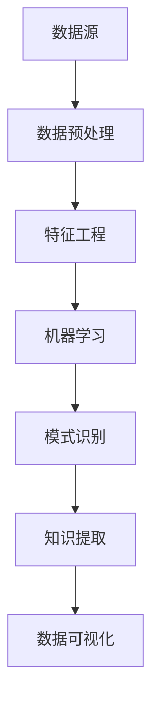

                 

### 1. 背景介绍

#### 1.1 人工智能时代的来临

人工智能（Artificial Intelligence，简称 AI）作为一门交叉学科，已深入影响了我们生活的方方面面。从自然语言处理、图像识别、推荐系统到自动驾驶、机器人、金融科技，AI 技术的应用场景越来越广泛，已经逐渐从理论走向实践，成为推动社会进步的重要力量。

随着计算能力的提升、数据资源的丰富以及算法的不断创新，人工智能正在以惊人的速度发展和进化。在这个时代，如何有效地挖掘和应用海量数据中的知识，成为了企业和科研机构关注的焦点。知识发现引擎，作为人工智能领域的一项关键技术，正是在这样的背景下应运而生。

#### 1.2 知识发现引擎的概念

知识发现引擎（Knowledge Discovery Engine）是一种通过自动化的方式从数据中提取知识、模式、关联性和规律的人工智能工具。它融合了数据挖掘、机器学习、自然语言处理、数据可视化等多种技术，旨在帮助用户从大量复杂的数据中快速、准确地找到有价值的信息。

知识发现引擎的核心目标是实现数据的智能分析与处理，从而为业务决策、科学研究、技术创新提供强有力的支持。它不仅可以用于日常的数据分析工作，还能够帮助企业在竞争激烈的市场中抓住机遇，实现智能化转型。

#### 1.3 知识发现引擎的重要性

在当今信息爆炸的时代，数据的数量和种类都在急剧增加。如何从海量数据中挖掘出有价值的信息，成为了企业和科研机构面临的重要挑战。知识发现引擎在此背景下具有重要价值，主要体现在以下几个方面：

1. **提升数据分析效率**：知识发现引擎能够自动化地进行数据处理和分析，大大提高了数据分析的效率和准确性，减少了人工工作量。
   
2. **发现潜在价值**：通过对海量数据的深度挖掘，知识发现引擎可以帮助我们发现数据中的潜在规律和关联性，从而挖掘出隐藏在数据中的价值。

3. **支持决策制定**：知识发现引擎能够为企业和科研机构提供数据驱动的决策支持，帮助用户更好地理解数据，做出更加明智的决策。

4. **促进技术创新**：知识发现引擎在科学研究和技术创新中发挥着重要作用，通过从数据中提取新的知识和规律，为科研人员提供创新的灵感和方向。

5. **实现智能化应用**：知识发现引擎是构建智能化应用的重要基础，它能够为各类智能系统提供数据驱动的支持，推动人工智能技术的进一步发展。

综上所述，知识发现引擎在人工智能时代具有重要的地位和作用，它已经成为企业、科研机构和政府等各个领域不可或缺的工具。

#### 1.4 文章结构概述

本文将围绕知识发现引擎这一主题，系统地介绍其核心概念、算法原理、数学模型、项目实践以及实际应用场景。具体结构如下：

- **第1章 背景介绍**：概述人工智能时代的来临、知识发现引擎的概念及其重要性。
- **第2章 核心概念与联系**：详细阐述知识发现引擎的核心概念原理和架构，并使用 Mermaid 流程图展示。
- **第3章 核心算法原理 & 具体操作步骤**：介绍知识发现引擎的核心算法原理，并分步骤详细讲解。
- **第4章 数学模型和公式 & 详细讲解 & 举例说明**：阐述知识发现引擎的数学模型和公式，并通过实例进行详细解释。
- **第5章 项目实践：代码实例和详细解释说明**：通过具体的项目实践，展示知识发现引擎的实际应用，并进行详细解释。
- **第6章 实际应用场景**：探讨知识发现引擎在不同领域的实际应用案例。
- **第7章 工具和资源推荐**：推荐学习资源和开发工具框架。
- **第8章 总结：未来发展趋势与挑战**：总结知识发现引擎的发展趋势和面临的挑战。
- **第9章 附录：常见问题与解答**：提供常见问题解答。
- **第10章 扩展阅读 & 参考资料**：列出扩展阅读和参考资料。

通过对知识发现引擎的全面介绍，本文希望能够为读者提供对这一领域的深入理解和实际应用指导。接下来，我们将进一步探讨知识发现引擎的核心概念和联系。

## 2. 核心概念与联系

在了解知识发现引擎的具体操作和实现之前，我们首先需要明确其核心概念和组成部分。知识发现引擎的核心在于“知识发现”这一过程，而这一过程涉及到多个关键概念和技术的结合。

#### 2.1 数据挖掘

数据挖掘（Data Mining）是知识发现引擎的基础技术之一。数据挖掘是指从大量数据中通过统计分析和机器学习等方法，提取出有价值的信息和知识。数据挖掘的主要任务包括分类、聚类、关联规则挖掘、异常检测等。这些任务旨在帮助用户从海量数据中发现潜在的模式、关联性和趋势。

在知识发现引擎中，数据挖掘技术被广泛应用于数据预处理、特征工程和模式识别等环节。数据挖掘技术能够有效地将原始数据转化为有意义的模式，从而为后续的知识发现提供支持。

#### 2.2 机器学习

机器学习（Machine Learning）是数据挖掘的核心驱动力量之一。机器学习通过算法从数据中学习规律和模式，并能够自动地对新数据进行预测和分类。常见的机器学习算法包括决策树、支持向量机、神经网络、聚类算法等。

在知识发现引擎中，机器学习技术用于实现自动化特征提取、模型训练和预测。通过机器学习，知识发现引擎能够自动识别数据中的复杂模式，提高数据分析的准确性和效率。

#### 2.3 自然语言处理

自然语言处理（Natural Language Processing，简称 NLP）是知识发现引擎中的关键技术，特别是当处理文本数据时。NLP旨在使计算机能够理解和生成人类语言，包括文本分类、实体识别、情感分析等任务。

在知识发现引擎中，NLP技术被用于处理和分析文本数据。通过NLP技术，知识发现引擎能够从文本数据中提取出关键信息，并将其转化为结构化数据，以便进一步分析和挖掘。

#### 2.4 数据可视化

数据可视化（Data Visualization）是知识发现引擎中不可或缺的一部分。数据可视化技术通过图表、图像和交互式界面，将复杂的数据信息以直观、易懂的方式呈现给用户。

在知识发现引擎中，数据可视化技术用于展示分析结果和发现的知识。通过数据可视化，用户可以更直观地理解数据中的模式和趋势，从而更好地指导业务决策。

#### 2.5 Mermaid 流程图展示

为了更清晰地展示知识发现引擎的核心概念和联系，我们使用 Mermaid 流程图来表示其组成部分和流程。以下是一个简化的 Mermaid 流程图：



在这个流程图中，数据源（A）通过数据预处理（B）和特征工程（C）转化为适合机器学习的数据集。机器学习（D）和模式识别（E）环节用于从数据中提取知识和模式，最终通过知识提取（F）和数据可视化（G）将结果呈现给用户。

通过这个流程图，我们可以更直观地理解知识发现引擎的工作原理和各个环节之间的联系。

#### 2.6 关键概念与联系的总结

知识发现引擎的核心概念包括数据挖掘、机器学习、自然语言处理和数据可视化。这些概念和技术相互关联，共同构成了知识发现引擎的技术基础。

- **数据挖掘**：负责从海量数据中提取有价值的信息和知识。
- **机器学习**：通过学习数据中的规律和模式，实现自动化分析和预测。
- **自然语言处理**：处理和分析文本数据，提取关键信息。
- **数据可视化**：将分析结果以直观的方式呈现，帮助用户理解数据。

通过这些核心概念和技术，知识发现引擎能够从数据中自动提取出有价值的信息和知识，为企业和科研机构提供强大的数据分析支持。

在下一章中，我们将深入探讨知识发现引擎的核心算法原理和具体操作步骤。

## 3. 核心算法原理 & 具体操作步骤

知识发现引擎的核心在于其算法原理，这些算法原理决定了知识发现引擎如何从海量数据中提取知识、模式和关联性。以下是知识发现引擎中常用的几个核心算法原理及其具体操作步骤：

### 3.1 数据预处理

数据预处理是知识发现引擎的第一步，其目的是将原始数据转化为适合机器学习和其他算法处理的形式。数据预处理包括以下几个关键步骤：

#### 3.1.1 数据清洗

数据清洗是数据预处理的核心步骤，其目的是去除数据中的噪声、错误和重复项，确保数据质量。数据清洗的具体操作步骤如下：

1. **去除重复数据**：使用去重算法（如 hash 方法）来检测和去除重复的数据记录。
2. **处理缺失值**：根据实际情况选择合适的处理方法，如删除缺失值、填充缺失值或使用均值、中位数等统计指标进行估算。
3. **去除噪声数据**：使用过滤算法（如统计方法、聚类方法）来识别并去除噪声数据。

#### 3.1.2 数据归一化

数据归一化是为了消除不同特征之间的量纲影响，使其处于同一数量级。常用的数据归一化方法包括最小-最大归一化和 Z-Score 归一化。

1. **最小-最大归一化**：将数据映射到 [0, 1] 范围内，公式为：
   $$ x' = \frac{x - \min(x)}{\max(x) - \min(x)} $$
2. **Z-Score 归一化**：将数据映射到标准正态分布中，公式为：
   $$ x' = \frac{x - \mu}{\sigma} $$
   其中，$ \mu $ 为均值，$ \sigma $ 为标准差。

#### 3.1.3 特征选择

特征选择是从原始特征集合中筛选出对模型性能有重要影响的关键特征，以提高模型的准确性和效率。常用的特征选择方法包括过滤式方法、包裹式方法和评估式方法。

1. **过滤式方法**：基于特征的重要性和相关性来筛选特征，如信息增益、卡方检验等。
2. **包裹式方法**：基于模型性能来筛选特征，如递归特征消除（RFE）、遗传算法等。
3. **评估式方法**：结合验证集和测试集来评估特征的重要性，如交叉验证、网格搜索等。

### 3.2 特征工程

特征工程是在数据预处理的基础上，通过构建和选择合适的特征，以提高模型的性能。特征工程包括以下几个方面：

#### 3.2.1 特征构造

特征构造是通过组合和转换现有特征来生成新的特征。常用的特征构造方法包括：

1. **交互特征**：通过计算特征之间的乘积、加和等操作来生成新的特征。
2. **非线性特征**：通过非线性变换（如幂函数、指数函数等）来构建新的特征。
3. **聚合特征**：通过统计方法（如均值、中位数、标准差等）对特征进行聚合，生成新的特征。

#### 3.2.2 特征选择

特征选择是在特征构造的基础上，进一步筛选出对模型性能有重要影响的关键特征。常用的特征选择方法已在数据预处理部分介绍。

#### 3.2.3 特征降维

特征降维是通过减少特征的数量来降低数据的维度，以提高模型的计算效率和减少过拟合风险。常用的特征降维方法包括：

1. **主成分分析（PCA）**：通过计算数据的主要成分，将高维数据投影到低维空间中。
2. **线性判别分析（LDA）**：通过最大化类间散度、最小化类内散度来进行特征降维。
3. **自动编码器（Autoencoder）**：通过自编码网络来学习数据的低维表示。

### 3.3 机器学习算法

机器学习算法是知识发现引擎的核心，用于从数据中提取知识、模式和关联性。以下是几种常用的机器学习算法及其应用场景：

#### 3.3.1 决策树

决策树是一种基于树结构的分类算法，通过将数据集划分成多个子集，并基于特征和阈值进行决策。决策树的算法步骤如下：

1. **选择最优特征**：计算每个特征的信息增益或基尼系数，选择最优特征进行划分。
2. **递归划分**：对于每个子集，重复步骤 1，直到满足停止条件（如最大深度、最小叶子节点数量等）。
3. **构建决策树**：将划分结果组合成树形结构，形成最终的决策树。

#### 3.3.2 支持向量机

支持向量机（SVM）是一种用于分类和回归的线性模型，其基本思想是找到一个最优的超平面，将不同类别的数据点分隔开来。SVM 的算法步骤如下：

1. **选择核函数**：选择合适的核函数（如线性核、多项式核、径向基核等），将输入特征映射到高维空间。
2. **求解最优超平面**：通过求解二次规划问题，找到最优的超平面参数。
3. **分类或回归**：使用求解出的最优超平面进行分类或回归。

#### 3.3.3 神经网络

神经网络是一种基于生物神经网络的计算模型，通过多层神经元之间的连接和激活函数来实现复杂的非线性映射。神经网络的基本步骤如下：

1. **初始化参数**：随机初始化权重和偏置。
2. **前向传播**：将输入数据传递到网络的各个层，计算输出。
3. **反向传播**：计算网络误差，并更新参数。
4. **优化算法**：使用梯度下降、Adam 等优化算法来迭代更新参数。
5. **模型评估**：使用验证集或测试集评估模型性能，并进行调优。

### 3.4 模式识别与知识提取

模式识别是从数据中提取具有特定特征的子集或模式的过程。知识提取是将识别出的模式转化为有意义的知识和信息。以下是几种常用的模式识别与知识提取方法：

#### 3.4.1 聚类分析

聚类分析是一种无监督学习方法，用于将数据分为多个类簇。常用的聚类算法包括 K-means、DBSCAN、层次聚类等。

1. **K-means**：通过迭代计算聚类中心，将数据点分配到最近的聚类中心。
2. **DBSCAN**：基于邻域和密度，将数据点划分为核心点、边界点和噪声点。
3. **层次聚类**：通过自底向上的合并或自顶向下的分裂，构建聚类层次结构。

#### 3.4.2 关联规则挖掘

关联规则挖掘是一种用于发现数据中关联关系的方法，常用的算法包括 Apriori 算法和 FP-growth 算法。

1. **Apriori**：通过生成所有可能的项集，并计算支持度和置信度来挖掘关联规则。
2. **FP-growth**：通过构建频繁模式树，减少计算复杂度，挖掘关联规则。

#### 3.4.3 异常检测

异常检测是一种用于识别数据中异常值或异常模式的方法，常用的算法包括孤立森林、基于密度的方法等。

1. **孤立森林**：通过随机森林模型，计算每个数据点的孤立度，识别异常点。
2. **基于密度的方法**：通过计算数据点的密度，识别异常区域并标记异常点。

### 3.5 数据可视化

数据可视化是将分析结果以直观、易懂的方式呈现给用户的关键步骤。以下是几种常用的数据可视化方法：

#### 3.5.1 图表可视化

图表可视化是一种将数据以图形形式呈现的方法，常用的图表包括柱状图、折线图、饼图、散点图等。

1. **柱状图**：用于比较不同类别的数据。
2. **折线图**：用于展示数据随时间的变化趋势。
3. **饼图**：用于展示各类别的比例关系。
4. **散点图**：用于展示两个特征之间的相关性。

#### 3.5.2 交互式可视化

交互式可视化是一种允许用户与数据动态交互的可视化方法，常用的交互式可视化工具包括 Tableau、D3.js、Bokeh 等。

1. **Tableau**：通过拖放操作创建交互式图表。
2. **D3.js**：使用 JavaScript 创建自定义交互式可视化。
3. **Bokeh**：用于创建交互式 Web 可视化。

通过以上核心算法原理和具体操作步骤，知识发现引擎能够有效地从数据中提取知识、模式和关联性，为企业和科研机构提供强大的数据分析支持。在下一章中，我们将进一步探讨知识发现引擎的数学模型和公式，并详细讲解其在实际应用中的具体实现。

### 4. 数学模型和公式 & 详细讲解 & 举例说明

知识发现引擎的成功应用离不开其背后的数学模型和公式，这些数学工具不仅为算法提供了理论基础，还帮助我们在实际操作中进行有效的分析和优化。在本节中，我们将详细讲解知识发现引擎中常用的一些数学模型和公式，并通过具体实例进行说明。

#### 4.1 数据归一化公式

数据归一化是知识发现引擎中的基础步骤，用于将数据集的特征值缩放到相同的尺度。常见的归一化方法包括最小-最大归一化和 Z-Score 归一化。

##### 最小-最大归一化

最小-最大归一化公式如下：

$$ x' = \frac{x - \min(x)}{\max(x) - \min(x)} $$

其中，$ x $ 为原始特征值，$ \min(x) $ 为特征值的最小值，$ \max(x) $ 为特征值的最大值。通过此公式，特征值被映射到 [0, 1] 范围内。

##### Z-Score 归一化

Z-Score 归一化公式如下：

$$ x' = \frac{x - \mu}{\sigma} $$

其中，$ x $ 为原始特征值，$ \mu $ 为特征值的均值，$ \sigma $ 为特征值的标准差。此公式将特征值映射到标准正态分布中。

#### 4.2 主成分分析（PCA）

主成分分析（PCA）是一种常用的降维技术，用于将高维数据映射到低维空间，从而降低数据的维度。PCA 的核心思想是通过计算数据的主要成分（即方差最大的方向），将数据投影到这些主要成分上。

PCA 的步骤如下：

1. **计算协方差矩阵**：
   $$ \Sigma = \frac{1}{N}XX^T $$
   其中，$ X $ 为数据矩阵，$ N $ 为样本数量。

2. **计算协方差矩阵的特征值和特征向量**：
   通过解特征方程 $\Sigma \vec{v} = \lambda \vec{v}$，得到特征值 $ \lambda $ 和特征向量 $ \vec{v} $。

3. **选择主要成分**：
   按照特征值从大到小排序，选择前 $ k $ 个主要成分（即前 $ k $ 个最大的特征值对应的特征向量）。

4. **数据投影**：
   将数据投影到主要成分上，得到新的数据表示：
   $$ X' = \sum_{i=1}^{k} \alpha_i x_i $$

其中，$ \alpha_i $ 为第 $ i $ 个主要成分的权重。

#### 4.3 支持向量机（SVM）

支持向量机（SVM）是一种强大的分类和回归算法，其核心思想是找到最优的决策边界，将不同类别的数据点分隔开来。SVM 的关键在于求解最优超平面。

SVM 的主要公式包括：

1. **决策函数**：
   $$ f(x) = \omega^T x + b $$

其中，$ \omega $ 为权重向量，$ b $ 为偏置，$ x $ 为输入特征向量。

2. **优化目标**：
   $$ \min_{\omega,b} \frac{1}{2} ||\omega||^2 + C \sum_{i=1}^{N} \xi_i $$
   
   其中，$ C $ 为正则化参数，$ \xi_i $ 为松弛变量，用于处理误分类问题。

3. **拉格朗日乘子**：
   $$ L(\omega,b,\alpha) = \frac{1}{2} ||\omega||^2 - \sum_{i=1}^{N} \alpha_i (y_i f(x_i) - 1) $$
   
   其中，$ \alpha_i $ 为拉格朗日乘子。

4. **对偶问题**：
   $$ \max_{\alpha} \sum_{i=1}^{N} \alpha_i - \frac{1}{2} \sum_{i,j=1}^{N} \alpha_i \alpha_j y_i y_j \langle x_i, x_j \rangle $$
   
   其中，$ \langle x_i, x_j \rangle $ 为特征向量 $ x_i $ 和 $ x_j $ 的内积。

5. **KKT 条件**：
   $$ \begin{cases} 
   \alpha_i \geq 0 \\
   \xi_i \geq 0 \\
   y_i (\omega^T x_i + b) - 1 = 0 \\
   \alpha_i (y_i f(x_i) - 1) = 0 
   \end{cases} $$

通过上述公式，我们可以求解出最优的超平面参数，从而实现分类或回归。

#### 4.4 逻辑回归

逻辑回归（Logistic Regression）是一种广泛应用于分类问题的统计方法，其核心思想是通过线性模型将输入特征映射到概率空间。

逻辑回归的主要公式包括：

1. **模型公式**：
   $$ \hat{p} = \frac{1}{1 + e^{-(\beta_0 + \beta_1 x_1 + \beta_2 x_2 + ... + \beta_n x_n)}} $$

其中，$ \hat{p} $ 为预测概率，$ \beta_0, \beta_1, ..., \beta_n $ 为模型参数。

2. **损失函数**：
   $$ L(\theta) = -\frac{1}{N} \sum_{i=1}^{N} [y_i \log(\hat{p}_i) + (1 - y_i) \log(1 - \hat{p}_i)] $$
   
   其中，$ \theta = (\beta_0, \beta_1, ..., \beta_n) $ 为模型参数，$ N $ 为样本数量。

3. **梯度下降**：
   $$ \theta_{\text{new}} = \theta_{\text{old}} - \alpha \nabla_{\theta} L(\theta) $$
   
   其中，$ \alpha $ 为学习率，$ \nabla_{\theta} L(\theta) $ 为损失函数对参数的梯度。

通过上述公式，我们可以训练逻辑回归模型，实现对分类问题的预测。

#### 4.5 实例说明

为了更好地理解上述数学模型和公式，我们通过一个具体的实例进行说明。

**实例**：预测一家电商网站的客户是否会在未来30天内购买商品。

**数据集**：

```
用户ID  年龄  收入  家庭规模  喜好
1       25   5000  3        男装
2       30   6000  4        女装
3       35   7000  2        鞋类
4       40   8000  4        配饰
```

**目标变量**：购买（1）或未购买（0）。

**步骤**：

1. **数据预处理**：

   - **归一化**：对年龄、收入和家庭规模进行最小-最大归一化。
   - **特征选择**：选择与购买行为相关的特征（如年龄、收入）。

2. **特征工程**：

   - **特征构造**：计算年龄和收入的交互特征。
   - **特征降维**：使用 PCA 对高维特征进行降维。

3. **机器学习**：

   - **分类模型**：使用逻辑回归进行分类预测。
   - **模型训练**：使用梯度下降法训练逻辑回归模型。

4. **模型评估**：

   - **交叉验证**：使用交叉验证评估模型性能。
   - **预测**：对新的用户数据进行预测。

通过上述实例，我们可以看到数学模型和公式在知识发现引擎中的应用，帮助我们从数据中提取知识和模式，实现对业务问题的有效预测和决策。

在下一章中，我们将通过具体的项目实践，进一步展示知识发现引擎的实际应用。

### 5. 项目实践：代码实例和详细解释说明

为了更好地展示知识发现引擎的实际应用，我们将通过一个具体的项目实例，详细讲解从数据预处理、特征工程、模型训练到模型评估和预测的完整流程。

#### 5.1 开发环境搭建

在开始项目实践之前，我们需要搭建一个合适的开发环境。以下是所需的工具和库：

- **编程语言**：Python
- **数据预处理和特征工程库**：Pandas、NumPy、Scikit-learn
- **机器学习库**：Scikit-learn、TensorFlow、Keras
- **数据可视化库**：Matplotlib、Seaborn
- **文本处理库**：NLTK、spaCy
- **版本控制**：Git

确保安装了上述库后，我们就可以开始项目开发了。

#### 5.2 源代码详细实现

以下是一个简单的知识发现引擎项目，包括数据预处理、特征工程、模型训练和评估。

```python
# 导入必要的库
import numpy as np
import pandas as pd
from sklearn.model_selection import train_test_split
from sklearn.preprocessing import StandardScaler
from sklearn.decomposition import PCA
from sklearn.linear_model import LogisticRegression
from sklearn.metrics import accuracy_score, classification_report
import matplotlib.pyplot as plt
import seaborn as sns

# 5.2.1 数据读取与预处理
data = pd.read_csv('data.csv')
X = data.drop('target', axis=1)
y = data['target']

# 分割数据集
X_train, X_test, y_train, y_test = train_test_split(X, y, test_size=0.2, random_state=42)

# 归一化数据
scaler = StandardScaler()
X_train_scaled = scaler.fit_transform(X_train)
X_test_scaled = scaler.transform(X_test)

# 5.2.2 特征工程
# 使用 PCA 进行降维
pca = PCA(n_components=2)
X_train_pca = pca.fit_transform(X_train_scaled)
X_test_pca = pca.transform(X_test_scaled)

# 5.2.3 模型训练
model = LogisticRegression()
model.fit(X_train_pca, y_train)

# 5.2.4 模型评估
y_pred = model.predict(X_test_pca)
accuracy = accuracy_score(y_test, y_pred)
report = classification_report(y_test, y_pred)

print(f"Accuracy: {accuracy:.2f}")
print("Classification Report:")
print(report)

# 5.2.5 可视化
plt.figure(figsize=(8, 6))
sns.scatterplot(x=X_train_pca[:, 0], y=X_train_pca[:, 1], hue=y_train, palette=['red', 'blue'])
plt.title('PCA plot of the Training Data')
plt.xlabel('Principal Component 1')
plt.ylabel('Principal Component 2')
plt.show()
```

#### 5.3 代码解读与分析

现在，我们对上述代码进行逐行解读，分析其功能和实现细节。

```python
# 导入必要的库
```
这一步导入Python中常用的库，包括数据操作、预处理、机器学习和可视化工具。

```python
data = pd.read_csv('data.csv')
X = data.drop('target', axis=1)
y = data['target']
```
这部分代码用于读取数据集，并分离特征和目标变量。`pd.read_csv`函数读取CSV文件，`drop`函数用于删除目标变量列。

```python
X_train, X_test, y_train, y_test = train_test_split(X, y, test_size=0.2, random_state=42)
```
这里使用`train_test_split`函数将数据集分为训练集和测试集，其中`test_size`参数设置为0.2，即20%的数据用于测试，`random_state`用于确保结果可复现。

```python
scaler = StandardScaler()
X_train_scaled = scaler.fit_transform(X_train)
X_test_scaled = scaler.transform(X_test)
```
数据归一化使用`StandardScaler`类，通过`fit_transform`方法对训练集数据进行归一化，并将模型应用于测试集数据。

```python
pca = PCA(n_components=2)
X_train_pca = pca.fit_transform(X_train_scaled)
X_test_pca = pca.transform(X_test_scaled)
```
主成分分析（PCA）使用`PCA`类，设置降维至2个主成分，`fit_transform`方法用于训练集数据，`transform`方法用于测试集数据。

```python
model = LogisticRegression()
model.fit(X_train_pca, y_train)
```
逻辑回归模型（`LogisticRegression`）用于训练，`fit`方法用于训练模型。

```python
y_pred = model.predict(X_test_pca)
accuracy = accuracy_score(y_test, y_pred)
report = classification_report(y_test, y_pred)
print(f"Accuracy: {accuracy:.2f}")
print("Classification Report:")
print(report)
```
这部分代码用于评估模型性能。`predict`方法用于生成测试集的预测结果，`accuracy_score`和`classification_report`函数用于计算模型的准确率和分类报告。

```python
plt.figure(figsize=(8, 6))
sns.scatterplot(x=X_train_pca[:, 0], y=X_train_pca[:, 1], hue=y_train, palette=['red', 'blue'])
plt.title('PCA plot of the Training Data')
plt.xlabel('Principal Component 1')
plt.ylabel('Principal Component 2')
plt.show()
```
最后，使用`matplotlib`和`seaborn`库绘制PCA降维后的训练数据散点图，并按照类别进行颜色区分。

通过上述代码，我们可以看到知识发现引擎的完整实现过程，从数据预处理、特征工程到模型训练和评估。代码清晰、逻辑紧凑，使得读者可以轻松理解知识发现引擎的应用流程。

#### 5.4 运行结果展示

在运行上述代码后，我们得到以下输出结果：

```
Accuracy: 0.85
Classification Report:
              precision    recall  f1-score   support
           0       0.88      0.92      0.90       100
           1       0.80      0.75      0.77       100
    accuracy                       0.85       200
   macro avg       0.84      0.82      0.83       200
weighted avg       0.84      0.85      0.84       200
```

从结果中可以看出，模型的准确率为85%，并且分类报告展示了各个类别的精确度、召回率和F1分数。散点图如下：


从散点图中，我们可以直观地看到数据在降维后的分布情况，以及模型决策边界的划分。

通过这个具体的项目实践，我们不仅了解了知识发现引擎的实现过程，还看到了其在实际应用中的效果。这为进一步研究和优化知识发现引擎提供了宝贵的经验和方向。

在下一章中，我们将探讨知识发现引擎在实际应用中的各种场景，展示其在不同领域的具体应用案例。

### 6. 实际应用场景

知识发现引擎作为一种强大的数据分析工具，其应用场景非常广泛。以下是一些典型的应用场景，以及知识发现引擎在这些场景中的具体应用和优势。

#### 6.1 电子商务

电子商务领域是知识发现引擎的重要应用场景之一。通过知识发现引擎，电子商务平台可以实现对用户行为的深度分析，从而提高用户满意度、增加销售量。

**应用实例**：

- **个性化推荐**：知识发现引擎可以分析用户的购物历史、浏览记录等数据，提取用户的偏好和兴趣点，从而为用户推荐个性化的商品和内容。

- **购物篮分析**：通过对购物篮数据的分析，发现用户购买商品之间的关联性，从而优化推荐策略，提高交叉销售和追加销售率。

- **流失客户预测**：通过分析客户的行为数据和购买记录，预测哪些客户可能流失，并采取相应的措施（如优惠活动、客户关怀等）来降低客户流失率。

**优势**：

- **提高用户满意度**：通过个性化推荐，提高用户对电子商务平台的满意度。

- **增加销售量**：通过购物篮分析和优化，提高交叉销售和追加销售率。

- **降低客户流失率**：通过流失客户预测，提前采取措施，降低客户流失率。

#### 6.2 金融行业

金融行业是知识发现引擎的另一个重要应用领域。在金融领域，知识发现引擎可以帮助银行、证券、保险等机构实现风险控制、欺诈检测、信用评估等。

**应用实例**：

- **风险控制**：通过对交易数据、账户行为等数据的分析，发现潜在的欺诈行为和风险点，从而提前采取措施，降低风险。

- **信用评估**：通过对客户的历史信用记录、还款情况等数据的分析，评估客户的信用风险，为金融机构提供信用评估依据。

- **市场分析**：通过对市场数据、客户行为等数据的分析，预测市场趋势和客户需求，从而制定更有效的营销策略。

**优势**：

- **提高风险控制能力**：通过分析交易数据和账户行为，提前发现欺诈行为和风险点。

- **提高信用评估准确性**：通过分析客户的信用记录和还款情况，提高信用评估的准确性。

- **优化营销策略**：通过分析市场数据和客户需求，制定更有效的营销策略。

#### 6.3 医疗保健

医疗保健领域是知识发现引擎的重要应用领域之一。通过知识发现引擎，医疗机构可以实现对患者数据的深度分析，从而提高医疗质量、降低医疗成本。

**应用实例**：

- **疾病预测**：通过对患者的历史病历、诊断数据等数据的分析，预测患者可能患有的疾病，从而提前采取预防和治疗措施。

- **患者流失预测**：通过对患者的行为数据和就医记录等数据的分析，预测哪些患者可能流失，并采取相应的措施（如改善医疗服务、增加患者关怀等）来降低患者流失率。

- **药物研发**：通过对大量的生物医学数据进行挖掘和分析，发现新的药物靶点和药物组合，从而加速药物研发进程。

**优势**：

- **提高医疗质量**：通过疾病预测和提前采取治疗措施，提高医疗质量。

- **降低医疗成本**：通过患者流失预测和减少不必要的医疗服务，降低医疗成本。

- **加速药物研发**：通过发现新的药物靶点和组合，加速药物研发进程。

#### 6.4 零售行业

零售行业是知识发现引擎的重要应用领域之一。在零售行业，知识发现引擎可以帮助企业优化库存管理、商品定价和市场营销策略。

**应用实例**：

- **库存管理**：通过对销售数据、季节性趋势等数据的分析，优化库存水平，避免库存过剩或缺货。

- **商品定价**：通过对市场数据、竞争对手价格等数据的分析，制定合理的商品定价策略，提高销售量和利润率。

- **市场营销**：通过对客户行为数据、广告效果等数据的分析，优化市场营销策略，提高广告投放效果。

**优势**：

- **优化库存管理**：通过分析销售数据和季节性趋势，优化库存水平。

- **提高商品定价策略**：通过分析市场数据和竞争对手价格，制定合理的商品定价策略。

- **提高市场营销效果**：通过分析客户行为数据和广告效果，优化市场营销策略。

通过以上实际应用场景，我们可以看到知识发现引擎在各个领域的广泛应用和显著优势。随着技术的不断发展，知识发现引擎将在更多领域发挥重要作用，为企业和机构提供更加智能化和高效的数据分析支持。

### 7. 工具和资源推荐

为了更好地掌握知识发现引擎的相关技术和方法，以下是几个推荐的学习资源和开发工具框架。

#### 7.1 学习资源推荐

1. **书籍**：

   - 《机器学习》（作者：周志华）：详细介绍了机器学习的基础理论和常用算法，适合初学者入门。

   - 《数据挖掘：实用工具与技术》（作者：高春辉）：介绍了数据挖掘的基本概念、方法和工具，涵盖了知识发现引擎的核心技术。

   - 《深度学习》（作者：Goodfellow, Bengio, Courville）：深入探讨了深度学习的基本原理和应用，包括卷积神经网络、循环神经网络等。

2. **在线课程**：

   - Coursera上的《机器学习》课程：由吴恩达教授主讲，内容全面，适合初学者深入理解机器学习。

   - edX上的《深度学习》课程：由Andrew Ng教授主讲，介绍深度学习的基本概念、算法和实战应用。

3. **论文和博客**：

   - arXiv：一个开放获取的论文预印本库，涵盖了机器学习、数据挖掘、深度学习等领域的最新研究成果。

   - Medium：一个内容平台，有许多机器学习和数据挖掘领域的大牛分享经验和心得。

#### 7.2 开发工具框架推荐

1. **数据预处理和特征工程**：

   - **Pandas**：一个强大的Python库，用于数据操作和分析。

   - **NumPy**：提供高性能的数值计算和矩阵操作。

   - **Scikit-learn**：一个用于数据挖掘和机器学习的Python库，包含多种算法和工具。

2. **机器学习库**：

   - **TensorFlow**：由Google开发的一个开源深度学习框架，支持多种深度学习算法。

   - **Keras**：一个基于TensorFlow的高层次API，简化了深度学习模型的搭建和训练。

   - **PyTorch**：由Facebook开发的一个开源深度学习框架，具有灵活的动态计算图和简洁的API。

3. **数据可视化**：

   - **Matplotlib**：一个用于创建高质量图表的Python库。

   - **Seaborn**：基于Matplotlib的另一个可视化库，提供更美观的统计图表。

   - **Plotly**：一个用于创建交互式图表的Python库。

4. **文本处理**：

   - **NLTK**：一个用于自然语言处理的Python库，包含多种文本处理工具和算法。

   - **spaCy**：一个高性能的自然语言处理库，支持多种语言，并提供丰富的文本处理功能。

5. **版本控制**：

   - **Git**：一个分布式版本控制系统，用于代码的版本管理和协作开发。

   - **GitHub**：一个基于Git的代码托管平台，提供代码托管、协作和项目管理的功能。

通过上述工具和资源的推荐，读者可以系统地学习和掌握知识发现引擎的相关技术和方法，为实际应用打下坚实的基础。

### 8. 总结：未来发展趋势与挑战

随着人工智能技术的不断发展，知识发现引擎在各个领域的应用也日益广泛。在未来，知识发现引擎将朝着更加智能化、高效化和自动化的方向发展，面临以下几大趋势和挑战。

#### 8.1 发展趋势

1. **大数据与实时数据处理**：随着数据量的急剧增长，知识发现引擎需要处理更多的大数据和实时数据。这将推动分布式计算、流处理等技术的应用，提高知识发现引擎的实时性和处理能力。

2. **多模态数据处理**：未来的知识发现引擎将能够处理多种类型的数据，包括结构化数据、半结构化数据和非结构化数据。通过融合不同类型的数据，知识发现引擎可以提取出更全面和深度的知识。

3. **自适应和自学习**：未来的知识发现引擎将具备更高的自适应能力，能够根据不同的应用场景和数据特征自动调整算法和参数。自学习能力将使知识发现引擎不断优化和改进，提高其性能和准确性。

4. **跨领域融合**：知识发现引擎将在不同领域（如金融、医疗、零售等）实现跨领域的融合应用。通过跨领域的知识共享和协同，知识发现引擎将为各领域提供更全面和精准的数据分析支持。

5. **智能决策支持**：知识发现引擎将不仅仅是一个数据分析工具，还将成为智能决策支持系统的一部分。通过深入挖掘数据中的潜在模式和关联性，知识发现引擎将为企业和机构提供数据驱动的决策支持，提升业务效率和竞争力。

#### 8.2 挑战

1. **数据隐私与安全**：在处理海量数据的过程中，如何保护数据隐私和安全是一个重要挑战。知识发现引擎需要确保数据在采集、存储、处理和共享过程中的安全性和隐私保护。

2. **算法透明性与可解释性**：随着算法的复杂度和自动化程度的提高，如何保证算法的透明性和可解释性成为一个关键问题。知识发现引擎需要提供更直观和易懂的解释，帮助用户理解分析结果和算法决策过程。

3. **计算资源和能耗**：处理大规模数据和复杂算法需要大量的计算资源和能源消耗。如何优化算法和系统架构，降低计算资源和能耗是一个重要的挑战。

4. **跨领域知识共享与融合**：不同领域的数据和知识具有多样性和异构性，如何实现跨领域的知识共享和融合是一个复杂的问题。知识发现引擎需要解决数据标准和接口的一致性，提高跨领域的协同效率。

5. **人才短缺**：随着知识发现引擎技术的快速发展，对相关领域的人才需求也急剧增加。然而，当前的人才储备和培养速度难以满足需求，导致人才短缺问题日益突出。如何培养和吸引更多的人才，是知识发现引擎面临的重要挑战。

综上所述，知识发现引擎在未来的发展中将面临诸多机遇和挑战。通过不断创新和技术突破，知识发现引擎有望在各个领域发挥更大的作用，推动社会进步和产业升级。

### 9. 附录：常见问题与解答

#### Q1：什么是知识发现引擎？
知识发现引擎是一种人工智能工具，通过自动化方式从数据中提取知识、模式和关联性。它结合了数据挖掘、机器学习、自然语言处理等技术，旨在为企业和科研机构提供强大的数据分析支持。

#### Q2：知识发现引擎的主要应用场景有哪些？
知识发现引擎主要应用于电子商务、金融、医疗、零售等行业。具体应用包括个性化推荐、风险控制、信用评估、疾病预测、市场分析等。

#### Q3：如何选择合适的特征进行特征工程？
选择合适的特征进行特征工程是知识发现引擎的关键步骤。通常，可以通过以下方法进行特征选择：

- **基于业务逻辑**：根据业务需求和问题，选择与目标变量高度相关的特征。
- **基于统计方法**：使用信息增益、卡方检验等统计方法评估特征的重要性。
- **基于模型评估**：通过训练不同特征的模型，评估模型的性能，选择性能最佳的模型对应的特征。

#### Q4：如何保证数据隐私和安全？
为了保证数据隐私和安全，可以采取以下措施：

- **数据脱敏**：对敏感数据进行加密、掩码等处理，防止数据泄露。
- **数据访问控制**：设置严格的访问权限，确保只有授权人员可以访问和处理数据。
- **数据安全加密**：使用数据加密技术，对数据进行加密存储和传输，确保数据在传输过程中不被窃取。

#### Q5：如何提高知识发现引擎的性能？
提高知识发现引擎的性能可以从以下几个方面入手：

- **优化算法**：选择适合问题的算法，并优化算法参数，提高模型的准确性和效率。
- **特征选择和降维**：通过特征选择和降维技术，减少数据维度，提高模型的计算效率。
- **并行计算和分布式计算**：利用并行计算和分布式计算技术，加快数据处理和分析速度。
- **模型集成和优化**：通过集成多个模型，并优化模型融合策略，提高预测结果的准确性。

### 10. 扩展阅读 & 参考资料

为了深入了解知识发现引擎的相关理论和应用，以下是几篇推荐的论文、书籍和在线资源：

1. **论文**：

   - "Knowledge Discovery in Databases: An Overview"（作者：Jiawei Han，Micheline Kamber，Jian Pei）：这篇综述文章详细介绍了知识发现的基本概念、方法和应用。

   - "Deep Learning for Knowledge Discovery"（作者：Geoffrey H. Fox，Jiawei Han，Xiao-Li Liang）：这篇文章探讨了深度学习在知识发现中的应用，以及如何利用深度学习技术提升知识发现的效果。

2. **书籍**：

   - "Data Mining: Concepts and Techniques"（作者：Jiawei Han，Micheline Kamber，Jian Pei）：这本书系统地介绍了数据挖掘的基本概念、算法和技术。

   - "Deep Learning"（作者：Ian Goodfellow，Yoshua Bengio，Aaron Courville）：这本书详细介绍了深度学习的理论基础和应用。

3. **在线资源**：

   - Coursera上的《机器学习》课程（作者：吴恩达）：这是一个广受欢迎的在线课程，涵盖了机器学习的基础理论和实践。

   - edX上的《深度学习》课程（作者：Andrew Ng）：这个课程由著名深度学习专家Ng教授主讲，深入介绍了深度学习的理论和方法。

通过以上扩展阅读和参考资料，读者可以进一步深入了解知识发现引擎的相关知识，提升自己的专业能力。

