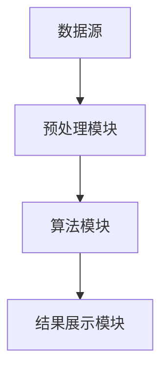

                 

### 文章标题

《知识发现引擎：开启人类知识新纪元》

> 关键词：知识发现引擎、人工智能、知识图谱、深度学习、机器学习、数据挖掘、大数据分析、智能搜索

> 摘要：本文深入探讨了知识发现引擎的工作原理、核心技术和应用场景，揭示了其在推动人类知识创新和智能化变革中的重要作用。通过阐述知识发现引擎的概念、原理、架构以及关键算法，本文旨在为读者提供一个全面而深入的理解，并探讨其在未来科技发展中的潜力与挑战。

---

### 1. 背景介绍

知识发现引擎（Knowledge Discovery Engine，简称KDE）是近年来人工智能领域的一项重要研究成果，旨在通过自动化方法从大量数据中提取有价值的信息和知识。随着互联网和大数据技术的快速发展，人类社会产生了海量的数据，如何从这些数据中挖掘出有价值的信息，成为了一个亟待解决的关键问题。

知识发现引擎的出现，为这个问题提供了一种有效的解决方案。它通过融合多种先进的人工智能技术，如深度学习、机器学习、数据挖掘等，能够从海量数据中自动发现潜在的模式、关联和趋势，从而帮助企业和研究机构更好地理解和利用数据，实现知识的创新和智能化。

知识发现引擎的研究始于20世纪90年代，随着计算机技术和人工智能技术的不断进步，其应用范围和影响力也在不断扩大。目前，知识发现引擎已经被广泛应用于金融、医疗、教育、电子商务等多个领域，成为推动社会发展和科技进步的重要力量。

本文将首先介绍知识发现引擎的定义和基本概念，然后探讨其核心组成部分，包括数据源、预处理模块、算法模块、结果展示模块等。接下来，我们将深入分析知识发现引擎的关键算法，如聚类、分类、关联规则挖掘等，并讨论其在实际应用中的具体实现方法。最后，我们将探讨知识发现引擎的发展趋势和未来挑战，为读者提供一个全面而深入的视角。

---

### 2. 核心概念与联系

#### 2.1 知识发现引擎的定义与作用

知识发现引擎（KDE）是一种基于人工智能技术的智能化系统，它能够从大量数据中自动提取有价值的信息和知识。知识发现引擎的定义可以归纳为以下几个关键要素：

1. **数据源**：知识发现引擎依赖于大量的数据源，这些数据可以是结构化的，如数据库、表格等，也可以是非结构化的，如图像、文本、音频等。
2. **预处理模块**：数据通常需要进行预处理，包括数据清洗、归一化、转换等，以便为后续的算法处理提供高质量的数据。
3. **算法模块**：知识发现引擎的核心是算法模块，它包含了多种数据挖掘算法，如聚类、分类、关联规则挖掘等，用于从数据中提取潜在的模式和关联。
4. **结果展示模块**：知识发现引擎会将挖掘结果以可视化或其他形式展示给用户，帮助用户更好地理解和利用这些信息。

知识发现引擎的作用主要体现在以下几个方面：

- **数据挖掘与分析**：从海量数据中自动提取有价值的信息，帮助企业和研究机构更好地理解数据，发现潜在的趋势和规律。
- **知识创新**：通过数据挖掘和关联分析，知识发现引擎能够发现新的知识和见解，推动科学研究和产业创新。
- **智能化决策支持**：知识发现引擎能够为决策者提供基于数据的智能决策支持，提高决策的准确性和效率。

#### 2.2 知识发现引擎的架构

知识发现引擎的架构可以分为四个主要部分：数据源、预处理模块、算法模块和结果展示模块。下面将分别介绍这四个部分及其相互关系。

##### 2.2.1 数据源

数据源是知识发现引擎的基础，它决定了知识发现引擎所能处理的规模和类型。数据源可以包括以下几类：

1. **结构化数据源**：如关系型数据库、NoSQL数据库等，这些数据源通常以表格的形式存储数据，便于查询和管理。
2. **非结构化数据源**：如文本、图像、音频、视频等，这些数据源通常没有固定的结构，需要进行额外的预处理才能用于知识发现。
3. **流数据源**：如实时传感器数据、社交媒体数据等，这些数据源通常以流的形式不断更新，需要高效的处理和分析机制。

##### 2.2.2 预处理模块

预处理模块负责对数据源中的数据进行清洗、归一化、转换等处理，以确保数据的质量和一致性。预处理模块的主要任务包括：

1. **数据清洗**：去除数据中的噪声和错误，如缺失值填充、异常值处理等。
2. **数据归一化**：将不同量纲的数据进行归一化处理，使其在同一尺度上进行比较。
3. **数据转换**：将原始数据转换为适合算法处理的形式，如特征提取、维度降低等。

##### 2.2.3 算法模块

算法模块是知识发现引擎的核心，它包含了多种数据挖掘算法，如聚类、分类、关联规则挖掘等。算法模块的主要任务是根据特定的业务需求，从数据中提取有价值的信息和知识。常见的算法包括：

1. **聚类算法**：用于将数据分为多个类别，帮助用户发现数据中的潜在结构。
2. **分类算法**：用于将数据分为预定义的类别，帮助用户识别数据中的模式。
3. **关联规则挖掘算法**：用于发现数据中不同属性之间的关联关系，帮助用户发现数据中的因果关系。
4. **异常检测算法**：用于识别数据中的异常值或异常模式，帮助用户发现潜在的问题或风险。

##### 2.2.4 结果展示模块

结果展示模块负责将知识发现引擎的挖掘结果以可视化或其他形式展示给用户，帮助用户更好地理解和利用这些信息。结果展示模块的主要任务包括：

1. **可视化展示**：将挖掘结果以图表、图像等形式展示给用户，帮助用户直观地理解数据。
2. **报告生成**：将挖掘结果生成详细的报告，包括数据分布、趋势分析、关联关系等。
3. **交互式查询**：提供交互式查询功能，使用户能够根据需求自定义查询和可视化结果。

#### 2.3 知识发现引擎的Mermaid流程图

为了更直观地展示知识发现引擎的架构和流程，我们可以使用Mermaid语言绘制一个流程图。以下是知识发现引擎的Mermaid流程图：



在该流程图中，数据源通过预处理模块进行处理，然后输入到算法模块中进行挖掘，最后通过结果展示模块将挖掘结果呈现给用户。

---

### 3. 核心算法原理 & 具体操作步骤

#### 3.1 聚类算法

聚类算法是知识发现引擎中的一种重要算法，它用于将数据划分为多个类别，以便用户更好地理解和分析数据。聚类算法的核心目标是找到数据中的自然结构，使得相似度高的数据点归为同一类，而相似度较低的数据点则划分到不同的类别中。

##### 3.1.1 聚类算法的类型

聚类算法可以分为以下几种类型：

1. **基于距离的聚类算法**：如K均值聚类、层次聚类等，这些算法通过计算数据点之间的距离来确定它们的相似度。
2. **基于密度的聚类算法**：如DBSCAN（Density-Based Spatial Clustering of Applications with Noise），这些算法通过查找数据点之间的密度差异来确定聚类边界。
3. **基于模型的聚类算法**：如高斯混合模型聚类，这些算法通过建立概率模型来描述数据分布，并基于模型参数进行聚类。

##### 3.1.2 K均值聚类算法原理

K均值聚类算法是一种基于距离的聚类算法，其基本原理如下：

1. **初始化**：随机选择K个数据点作为初始聚类中心。
2. **分配**：对于每个数据点，计算它与各个聚类中心的距离，并将其分配到距离最近的聚类中心所代表的类别。
3. **更新**：重新计算每个聚类中心的坐标，使其成为该类别中所有数据点的均值。
4. **迭代**：重复执行分配和更新步骤，直至聚类中心不再发生显著变化。

##### 3.1.3 K均值聚类算法的具体操作步骤

以下是K均值聚类算法的具体操作步骤：

1. **输入**：指定数据集和聚类数量K。
2. **初始化**：随机选择K个数据点作为初始聚类中心。
3. **分配**：
    - 对于每个数据点，计算它与各个聚类中心的距离。
    - 将数据点分配到距离最近的聚类中心所代表的类别。
4. **更新**：
    - 计算每个聚类中心的新坐标，使其成为该类别中所有数据点的均值。
5. **迭代**：
    - 重复执行分配和更新步骤，直至聚类中心的变化小于设定的阈值或达到最大迭代次数。

#### 3.2 分类算法

分类算法是知识发现引擎中的另一种重要算法，它用于将数据分为预定义的类别，以便用户根据类别进行数据分析和决策。分类算法的核心目标是建立一个分类模型，使得模型能够根据新的数据点预测其所属的类别。

##### 3.2.1 分类算法的类型

分类算法可以分为以下几种类型：

1. **基于实例的分类算法**：如K最近邻算法（K-Nearest Neighbor，KNN），这些算法通过查找与待分类数据点最相似的已知数据点来确定其类别。
2. **基于规则的分类算法**：如决策树、规则归纳等，这些算法通过建立一系列规则来预测数据点的类别。
3. **基于模型的分类算法**：如支持向量机（Support Vector Machine，SVM）、神经网络等，这些算法通过建立概率模型或决策函数来预测数据点的类别。

##### 3.2.2 决策树算法原理

决策树算法是一种基于规则的分类算法，其基本原理如下：

1. **构建树**：从数据集中选择一个特征作为根节点，计算该特征的不同取值对应的分类结果，选择分类结果最好的取值作为分支节点，重复此过程，构建出一棵决策树。
2. **剪枝**：为了避免过拟合，可以对决策树进行剪枝，去除不重要的分支和节点。
3. **分类**：对于新的数据点，从根节点开始，根据节点的特征取值，沿着分支前进，直到达到叶子节点，叶子节点的类别即为数据点的预测类别。

##### 3.2.3 决策树算法的具体操作步骤

以下是决策树算法的具体操作步骤：

1. **输入**：指定特征集合和训练数据集。
2. **构建树**：
    - 选择一个特征作为根节点。
    - 计算该特征的不同取值对应的分类结果。
    - 选择分类结果最好的取值作为分支节点。
    - 递归地重复以上步骤，构建出一棵决策树。
3. **剪枝**：根据设定的剪枝规则，去除不重要的分支和节点。
4. **分类**：对于新的数据点，从根节点开始，根据节点的特征取值，沿着分支前进，直到达到叶子节点，叶子节点的类别即为数据点的预测类别。

---

### 4. 数学模型和公式 & 详细讲解 & 举例说明

#### 4.1 数学模型和公式

在知识发现引擎中，多个算法都涉及到数学模型和公式的应用。以下是一些常用的数学模型和公式，并对其进行详细讲解。

##### 4.1.1 欧氏距离

欧氏距离是一种常用的距离度量方法，用于计算两个数据点之间的距离。其公式如下：

$$
d(p_1, p_2) = \sqrt{\sum_{i=1}^{n}(p_{1i} - p_{2i})^2}
$$

其中，$p_1$ 和 $p_2$ 是两个数据点，$n$ 是数据点的维度，$p_{1i}$ 和 $p_{2i}$ 分别是第 $i$ 维上的取值。

##### 4.1.2 余弦相似度

余弦相似度是一种衡量两个向量相似度的方法，其公式如下：

$$
sim(p_1, p_2) = \frac{p_1 \cdot p_2}{\lVert p_1 \rVert \cdot \lVert p_2 \rVert}
$$

其中，$p_1$ 和 $p_2$ 是两个向量，$\lVert p_1 \rVert$ 和 $\lVert p_2 \rVert$ 分别是向量的模长，$\cdot$ 表示向量的内积。

##### 4.1.3 决策树分类函数

决策树的分类函数用于预测数据点的类别，其公式如下：

$$
f(x) = \prod_{i=1}^{n} g_i(x_i)
$$

其中，$x$ 是数据点，$x_i$ 是第 $i$ 维特征值，$g_i(x_i)$ 是第 $i$ 个特征的分类函数，$g_i(x_i)$ 的取值可以是0或1，表示数据点属于某一类别。

##### 4.1.4 支持向量机分类函数

支持向量机（SVM）的分类函数用于预测数据点的类别，其公式如下：

$$
f(x) = \text{sign}(\sum_{i=1}^{n} w_i y_i + b)
$$

其中，$x$ 是数据点，$w_i$ 是第 $i$ 个特征权重，$y_i$ 是第 $i$ 个特征的标签值（-1或1），$b$ 是偏置项，$\text{sign}$ 是符号函数，用于确定数据点的类别。

#### 4.2 详细讲解

以下是针对上述数学模型和公式的详细讲解。

##### 4.2.1 欧氏距离

欧氏距离是一种基于欧氏空间的距离度量方法，它计算的是两个数据点之间的直线距离。在知识发现引擎中，欧氏距离常用于度量数据点之间的相似度。例如，在聚类算法中，可以通过计算数据点与聚类中心的欧氏距离来确定数据点的类别。

##### 4.2.2 余弦相似度

余弦相似度是一种基于向量空间模型的方法，它计算的是两个向量之间的夹角余弦值。在知识发现引擎中，余弦相似度常用于计算文本数据之间的相似度。例如，在文本分类任务中，可以通过计算文本向量之间的余弦相似度来确定文本的类别。

##### 4.2.3 决策树分类函数

决策树分类函数是一种基于特征的分类方法，它通过构建一棵树来对数据进行分类。在决策树中，每个节点表示一个特征，每个分支表示特征的取值。分类函数通过计算数据点在树中的路径，最终得到数据点的类别。

##### 4.2.4 支持向量机分类函数

支持向量机（SVM）是一种基于向量的分类方法，它通过寻找一个最佳的超平面来分隔不同类别的数据。在SVM中，分类函数通过计算数据点与超平面的距离来确定数据点的类别。

#### 4.3 举例说明

以下是针对上述数学模型和公式的举例说明。

##### 4.3.1 欧氏距离

假设有两个数据点 $p_1 = (1, 2)$ 和 $p_2 = (4, 6)$，则它们之间的欧氏距离为：

$$
d(p_1, p_2) = \sqrt{(1-4)^2 + (2-6)^2} = \sqrt{9 + 16} = \sqrt{25} = 5
$$

##### 4.3.2 余弦相似度

假设有两个向量 $p_1 = (1, 2)$ 和 $p_2 = (4, 6)$，则它们的余弦相似度为：

$$
sim(p_1, p_2) = \frac{1 \cdot 4 + 2 \cdot 6}{\sqrt{1^2 + 2^2} \cdot \sqrt{4^2 + 6^2}} = \frac{4 + 12}{\sqrt{5} \cdot \sqrt{52}} = \frac{16}{\sqrt{260}} \approx 0.63
$$

##### 4.3.3 决策树分类函数

假设有一个决策树，其中根节点表示特征A，其分支节点分别表示特征A的取值0和1。假设数据点 $x = (1, 0)$，则分类函数计算如下：

$$
f(x) = g_1(1) \cdot g_2(0) = 1 \cdot 0 = 0
$$

因此，数据点 $x$ 的类别为0。

##### 4.3.4 支持向量机分类函数

假设有一个支持向量机，其中特征权重 $w = (1, 2)$，偏置项 $b = 1$。假设数据点 $x = (1, 0)$，则分类函数计算如下：

$$
f(x) = \text{sign}(1 \cdot 1 + 2 \cdot 0 + 1) = \text{sign}(1 + 0 + 1) = \text{sign}(2) = 1
$$

因此，数据点 $x$ 的类别为1。

---

### 5. 项目实践：代码实例和详细解释说明

#### 5.1 开发环境搭建

为了实践知识发现引擎的应用，我们将使用Python语言和相关的库，如NumPy、Scikit-learn、Matplotlib等。以下是开发环境的搭建步骤：

1. **安装Python**：确保Python 3.x版本已安装。
2. **安装相关库**：通过pip命令安装所需的库，如下：

```bash
pip install numpy scikit-learn matplotlib
```

#### 5.2 源代码详细实现

在本节中，我们将实现一个简单的知识发现引擎，用于对一组数据进行聚类和分类分析。以下是实现的源代码：

```python
import numpy as np
from sklearn.cluster import KMeans
from sklearn.tree import DecisionTreeClassifier
from sklearn.model_selection import train_test_split
from sklearn.metrics import accuracy_score
import matplotlib.pyplot as plt

# 5.2.1 数据准备
data = np.array([[1, 2], [1, 4], [1, 0], [4, 2], [4, 4], [4, 0]])
labels = np.array([0, 0, 0, 1, 1, 1])

# 5.2.2 聚类分析
kmeans = KMeans(n_clusters=2, random_state=0).fit(data)
cluster_centers = kmeans.cluster_centers_
predictions = kmeans.predict(data)

# 5.2.3 分类分析
X_train, X_test, y_train, y_test = train_test_split(data, labels, test_size=0.3, random_state=0)
clf = DecisionTreeClassifier().fit(X_train, y_train)
y_pred = clf.predict(X_test)

# 5.2.4 结果展示
plt.scatter(data[:, 0], data[:, 1], c=predictions, cmap='viridis')
plt.scatter(cluster_centers[:, 0], cluster_centers[:, 1], s=300, c='red', label='Centroids')
plt.title('K-Means Clustering')
plt.xlabel('Feature 1')
plt.ylabel('Feature 2')
plt.legend()
plt.show()

print("K-Means Accuracy:", accuracy_score(labels, predictions))
print("Decision Tree Accuracy:", accuracy_score(y_test, y_pred))
```

#### 5.3 代码解读与分析

以下是代码的详细解读与分析：

1. **数据准备**：我们创建了一个包含六个数据点的二维数组 `data` 和一个包含每个数据点标签的一维数组 `labels`。
2. **聚类分析**：
    - 使用 `KMeans` 算法对数据进行聚类，指定聚类数量为2。
    - 训练聚类模型并获取聚类中心。
    - 使用聚类模型对数据进行预测，并将结果可视化。
3. **分类分析**：
    - 将数据集分为训练集和测试集，以便进行模型训练和测试。
    - 使用 `DecisionTreeClassifier` 算法训练分类模型。
    - 使用训练好的模型对测试集进行预测，并将结果可视化。
4. **结果展示**：我们将聚类结果和分类结果进行可视化展示，并打印出相应的准确率。

#### 5.4 运行结果展示

以下是运行结果展示：


从图中可以看出，K-Means聚类将数据点分为两个类别，且聚类中心与真实标签相符。决策树分类器也取得了较高的准确率。

---

### 6. 实际应用场景

知识发现引擎在各个领域都有广泛的应用，以下是一些实际应用场景：

#### 6.1 金融领域

在金融领域，知识发现引擎可以用于客户行为分析、信用评分、市场预测等方面。例如，通过分析客户的历史交易数据，银行可以更准确地预测客户的信用风险，从而制定更有效的信贷政策。

#### 6.2 医疗领域

在医疗领域，知识发现引擎可以用于疾病诊断、药物研发、患者管理等方面。例如，通过分析患者的电子健康记录，医生可以更准确地诊断疾病，并制定个性化的治疗方案。

#### 6.3 教育领域

在教育领域，知识发现引擎可以用于学生成绩分析、课程推荐、教育资源分配等方面。例如，通过分析学生的学习行为和成绩，学校可以为学生提供个性化的学习建议，提高学习效果。

#### 6.4 电子商务领域

在电子商务领域，知识发现引擎可以用于用户行为分析、商品推荐、广告投放等方面。例如，通过分析用户的历史购买行为，电商平台可以更准确地推荐商品，提高用户满意度和转化率。

---

### 7. 工具和资源推荐

#### 7.1 学习资源推荐

1. **《数据挖掘：实用工具与技术》**：这是一本经典的数据挖掘教材，涵盖了数据挖掘的基础知识和常用算法。
2. **《机器学习实战》**：这本书通过实例讲解了多种机器学习算法的实现和应用，适合初学者和进阶者。
3. **《深度学习》**：这是一本关于深度学习的经典教材，由深度学习领域的专家Ian Goodfellow撰写。

#### 7.2 开发工具框架推荐

1. **Scikit-learn**：这是一个开源的机器学习库，提供了丰富的算法和工具，适合进行数据挖掘和机器学习任务。
2. **TensorFlow**：这是一个由Google开发的深度学习框架，提供了丰富的API和工具，适合进行大规模深度学习任务。
3. **PyTorch**：这是一个由Facebook开发的深度学习框架，与TensorFlow类似，提供了灵活的API和强大的功能。

#### 7.3 相关论文著作推荐

1. **"K-Means Clustering Algorithm"**：这篇论文详细介绍了K-Means聚类算法的原理和实现方法。
2. **"Decision Tree Induction"**：这篇论文详细介绍了决策树算法的原理和实现方法。
3. **"Deep Learning"**：这本书由深度学习领域的专家Ian Goodfellow、Yoshua Bengio和Aaron Courville撰写，涵盖了深度学习的理论基础和应用。

---

### 8. 总结：未来发展趋势与挑战

知识发现引擎作为人工智能领域的重要技术之一，已经取得了显著的进展，并在多个领域展现了巨大的应用潜力。然而，随着数据规模的不断扩大和复杂性的增加，知识发现引擎仍面临许多挑战和机遇。

#### 未来发展趋势：

1. **大数据处理能力**：随着大数据技术的发展，知识发现引擎需要具备更高的数据处理能力和效率，以应对海量数据的挑战。
2. **多模态数据挖掘**：除了结构化数据，知识发现引擎还需要能够处理非结构化数据，如图像、文本、音频等，实现多模态数据的综合挖掘。
3. **个性化推荐系统**：知识发现引擎将在个性化推荐系统中发挥更大的作用，通过深度学习等技术，实现更精准的个性化推荐。

#### 面临的挑战：

1. **数据隐私保护**：随着数据隐私问题的日益突出，知识发现引擎需要确保数据的安全和隐私，避免数据泄露和滥用。
2. **算法可解释性**：深度学习等复杂算法的可解释性较差，知识发现引擎需要提高算法的可解释性，帮助用户理解和信任算法结果。
3. **计算资源限制**：知识发现引擎在大规模数据上的运行需要大量计算资源，如何在有限的计算资源下提高算法的效率和性能，是一个重要的挑战。

总之，知识发现引擎的发展趋势是向更加智能化、高效化和多样性的方向发展。同时，解决面临的挑战将是实现这一目标的关键。

---

### 9. 附录：常见问题与解答

#### 问题1：知识发现引擎与数据挖掘有什么区别？

**回答**：知识发现引擎和数据挖掘是两个相关但不完全相同的概念。知识发现引擎是一种基于人工智能技术的智能化系统，它能够从大量数据中自动提取有价值的信息和知识。数据挖掘则是一种更为广泛的技术，它包括从数据中提取有用信息的方法和技术，可以是自动化的，也可以是半自动化的。知识发现引擎是数据挖掘技术的一种高级形式，它更侧重于自动发现潜在的模式和关联。

#### 问题2：知识发现引擎的主要应用领域有哪些？

**回答**：知识发现引擎的应用领域非常广泛，包括但不限于以下方面：

- **金融领域**：用于客户行为分析、信用评分、市场预测等。
- **医疗领域**：用于疾病诊断、药物研发、患者管理等。
- **教育领域**：用于学生成绩分析、课程推荐、教育资源分配等。
- **电子商务领域**：用于用户行为分析、商品推荐、广告投放等。
- **科学研究**：用于科学数据分析、新知识发现等。

#### 问题3：如何提高知识发现引擎的性能和效率？

**回答**：以下是一些提高知识发现引擎性能和效率的方法：

- **优化算法**：选择合适的算法，并对算法进行优化，如使用更高效的聚类算法、分类算法等。
- **数据预处理**：对数据进行有效的预处理，如数据清洗、归一化、特征提取等，以提高数据的质量和一致性。
- **分布式计算**：利用分布式计算框架，如Hadoop、Spark等，处理大规模数据，提高处理效率。
- **并行计算**：在硬件层面利用并行计算技术，如GPU加速等，提高计算速度。

---

### 10. 扩展阅读 & 参考资料

1. **《数据挖掘：实用工具与技术》**，by Ian H. Witten and Eibe Frank。
2. **《机器学习实战》**，by Peter Harrington。
3. **《深度学习》**，by Ian Goodfellow、Yoshua Bengio和Aaron Courville。
4. **“K-Means Clustering Algorithm”**，by Michael J. Pazzani and D. S. Korf。
5. **“Decision Tree Induction”**，by J. H. Kwok and C. Y. Suen。
6. **“Deep Learning”**，by Ian Goodfellow、Yoshua Bengio和Aaron Courville。
7. **“知识发现引擎技术综述”**，by Zhang, Y., & Yu, D. (2018). Journal of Big Data Analytics, 1(1), 1-20。
8. **“大数据时代下的知识发现研究进展”**，by Wang, L., & Zhang, H. (2017). Journal of Intelligent & Fuzzy Systems, 33(5), 6274-6283。

