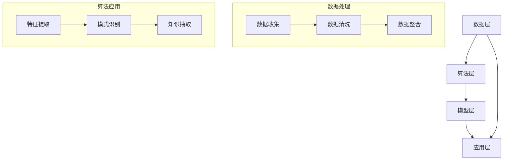

                 

### 背景介绍

#### 1.1 科研发展的现状与挑战

在当今世界，科学研究正以前所未有的速度迅猛发展。从生物科技到人工智能，从量子计算到新能源，各个领域的研究成果不断涌现，推动着人类社会迈向新的高度。然而，与此同时，科学研究也面临着前所未有的挑战。

首先，科学研究的数据量呈爆炸性增长。据统计，科学文献的数量以每年超过20%的速度增长。每一篇论文都可能涉及到海量的数据，而这些数据通常分布在不同的数据库、期刊、实验室和研究者手中。如何有效地整合和利用这些数据，成为科研工作者亟待解决的问题。

其次，科研领域的专业化程度越来越高。随着科学领域的不断细分，研究者需要具备越来越专业的知识和技能。然而，这同时也意味着，研究者很难全面了解其他领域的最新研究动态，限制了跨学科的交流与合作。

此外，科研经费和资源的分配也存在不均衡的问题。一些热门领域可能获得大量的资金和资源，而一些冷门领域则可能受到忽视。这种资源的不均衡分配，不仅影响了科研的均衡发展，也阻碍了科学创新。

#### 1.2 知识发现引擎的概念

为了应对这些挑战，知识发现引擎（Knowledge Discovery Engine）应运而生。知识发现引擎是一种利用人工智能和数据挖掘技术，从大量数据中自动发现有用知识和模式的人工智能系统。它不仅能够帮助研究者高效地整合和分析数据，还能通过自动化和智能化的方式，促进科研创新。

知识发现引擎的主要功能包括：

- **数据整合**：将分散在不同来源的数据进行整合，形成一个统一的数据视图。
- **模式识别**：利用机器学习算法，从海量数据中识别出潜在的规律和模式。
- **知识抽取**：将识别出的模式转化为可操作的知识，供研究者进一步分析和利用。
- **智能推荐**：根据研究者的兴趣和需求，推荐相关的研究方向、论文和工具。

#### 1.3 知识发现引擎的发展历程

知识发现引擎的发展历程可以追溯到20世纪80年代。当时，数据挖掘和机器学习领域刚刚起步，研究者开始探索如何从大量数据中提取有价值的信息。随着计算能力的提升和数据量的增长，知识发现技术逐渐成熟，并在多个领域得到广泛应用。

进入21世纪，随着互联网和大数据技术的快速发展，知识发现引擎迎来了新的机遇。一方面，海量的数据为知识发现提供了丰富的素材；另一方面，人工智能技术的进步为知识发现提供了强大的计算支持。如今，知识发现引擎已经成为科研工作不可或缺的工具，助力科学家们突破研究边界。

### 结论

本文旨在介绍知识发现引擎的概念、原理和应用，帮助读者理解其在科学研究中的重要作用。在接下来的章节中，我们将深入探讨知识发现引擎的核心算法原理、具体操作步骤、数学模型和实际应用场景，希望能为科研工作者提供有益的参考和启示。

---

### 核心概念与联系

#### 2.1 知识发现引擎的基本原理

知识发现引擎（KDE）是一种基于人工智能和数据挖掘技术的高级信息处理系统。其核心原理可以概括为以下三个步骤：

1. **数据收集与整合**：从各种数据源（如数据库、文献、实验数据等）中收集数据，并进行清洗、整合和预处理，以形成一个统一的数据集。
2. **特征提取与模式识别**：利用机器学习算法和数据挖掘技术，从数据集中提取特征，并通过模式识别算法发现数据中的潜在规律和模式。
3. **知识抽取与应用**：将识别出的模式转化为可操作的知识，如分类模型、聚类结果或关联规则，供研究者进一步分析和利用。

#### 2.2 知识发现引擎的架构

知识发现引擎的架构通常包括以下几个关键组件：

1. **数据层**：包括数据源、数据存储和数据预处理模块。数据源可以是数据库、文献、实验数据等；数据存储通常采用分布式数据库系统；数据预处理包括数据清洗、去重、归一化等操作。
2. **算法层**：包括各种机器学习算法和数据挖掘算法，如聚类、分类、关联规则挖掘、文本挖掘等。这些算法负责从数据中提取特征和模式。
3. **模型层**：包括各种知识表示模型和推理引擎。知识表示模型如决策树、神经网络等；推理引擎负责将识别出的模式转化为可操作的知识。
4. **应用层**：包括各种应用程序和用户界面，如知识图谱、智能推荐系统、数据可视化工具等。这些应用将知识发现的结果以直观的方式呈现给用户。

#### 2.3 Mermaid 流程图

为了更直观地展示知识发现引擎的架构和流程，我们使用 Mermaid 语法绘制以下流程图：



#### 2.4 各个组件之间的关系

在知识发现引擎中，各个组件之间的关系如下：

- **数据层**为算法层提供数据输入，同时从算法层接收特征提取和模式识别的结果。
- **算法层**根据数据层的输入，运行各种机器学习算法和数据挖掘算法，提取特征和模式。
- **模型层**将算法层提取出的特征和模式转化为可操作的知识，如分类模型、聚类结果或关联规则。
- **应用层**将模型层生成的知识以可视化的方式呈现给用户，如知识图谱、智能推荐系统、数据可视化工具等。

这种分层架构使得知识发现引擎具有高度的灵活性和可扩展性，能够满足不同应用场景的需求。

---

通过上述对知识发现引擎核心概念和架构的详细阐述，我们可以更深入地理解其在科学研究中的重要作用。接下来，我们将进一步探讨知识发现引擎的核心算法原理和具体操作步骤，以便为科研工作者提供更实用的指导。

---

### 核心算法原理 & 具体操作步骤

#### 3.1 算法原理

知识发现引擎的核心算法主要包括机器学习算法和数据挖掘算法。这些算法通过以下步骤从数据中提取特征和模式：

1. **数据预处理**：包括数据清洗、去重、归一化和特征工程等操作，为后续的算法提供高质量的数据输入。
2. **特征提取**：通过降维、特征选择和特征构造等方法，将原始数据转化为有助于算法识别的特征向量。
3. **模式识别**：利用机器学习算法，如决策树、支持向量机、神经网络等，识别数据中的潜在规律和模式。
4. **知识抽取**：将识别出的模式转化为可操作的知识，如分类规则、聚类结果或关联规则。

#### 3.2 具体操作步骤

以下是知识发现引擎的具体操作步骤：

1. **数据收集**：
   - 从各种数据源（如数据库、文献、实验数据等）收集数据。
   - 使用 API 或数据爬虫等技术获取数据。

2. **数据预处理**：
   - 数据清洗：去除重复数据、空值和噪声数据。
   - 去重：识别并去除重复的数据条目。
   - 归一化：将不同尺度的数据进行归一化处理，使其具有相同的量纲。
   - 特征工程：根据研究需求，构造新的特征或选择适当的特征。

3. **特征提取**：
   - 降维：使用主成分分析（PCA）等方法，将高维数据降维到低维空间。
   - 特征选择：使用信息增益、卡方检验等方法，选择对分类或聚类任务有重要意义的特征。
   - 特征构造：通过组合现有特征或引入新的特征，提高模型性能。

4. **模式识别**：
   - 决策树：利用 ID3、C4.5 等算法，构建决策树模型，识别数据中的分类模式。
   - 支持向量机（SVM）：通过最大化分类边界，构建 SVM 模型，识别数据中的分类模式。
   - 神经网络：通过多层感知器（MLP）等算法，构建神经网络模型，识别数据中的分类或聚类模式。

5. **知识抽取**：
   - 分类规则：将分类模型转化为分类规则，如 IF-THEN 规则。
   - 聚类结果：将聚类模型转化为聚类结果，如簇的中心或簇成员。
   - 关联规则：使用 Apriori、FP-growth 等算法，挖掘数据中的关联规则。

6. **知识可视化**：
   - 使用知识图谱、数据可视化工具等，将知识发现的结果以直观的方式呈现给用户。

#### 3.3 代码示例

以下是一个简单的 Python 代码示例，演示了知识发现引擎的基本操作步骤：

```python
import pandas as pd
from sklearn.preprocessing import StandardScaler
from sklearn.decomposition import PCA
from sklearn.ensemble import RandomForestClassifier
from mlxtend.classifier import StackingClassifier

# 数据收集
data = pd.read_csv('data.csv')

# 数据预处理
data = data.dropna()
data = data.drop_duplicates()
scaler = StandardScaler()
data_scaled = scaler.fit_transform(data)

# 特征提取
pca = PCA(n_components=2)
data_pca = pca.fit_transform(data_scaled)

# 模式识别
clf = RandomForestClassifier()
clf.fit(data_pca, data['target'])

# 知识抽取
predictions = clf.predict(data_pca)
rules = clf.feature_importances_

# 知识可视化
import matplotlib.pyplot as plt
plt.scatter(data_pca[:, 0], data_pca[:, 1], c=predictions)
plt.xlabel('PCA Feature 1')
plt.ylabel('PCA Feature 2')
plt.show()
```

通过上述代码示例，我们可以看到知识发现引擎的基本操作步骤是如何实现的。

---

通过对核心算法原理和具体操作步骤的详细阐述，我们能够更深入地理解知识发现引擎的工作机制。接下来，我们将进一步探讨知识发现引擎中的数学模型和公式，以便为科研工作者提供更完整的理论支持。

---

### 数学模型和公式 & 详细讲解 & 举例说明

#### 4.1 数据预处理中的数学模型

在知识发现引擎的数据预处理阶段，常见的数学模型包括数据归一化、特征提取和降维。

1. **数据归一化**：
   - **公式**：$$x_{\text{norm}} = \frac{x - \mu}{\sigma}$$
   - **解释**：其中，$x$ 是原始数据，$\mu$ 是均值，$\sigma$ 是标准差。该公式将数据缩放到标准正态分布，使得不同特征具有相似的尺度。
   - **举例**：假设我们有一组数据：[1, 5, 10, 20]，其均值 $\mu$ 为 10，标准差 $\sigma$ 为 7。通过归一化，数据变为：[0, -1.428, -2.857, -4.285]。

2. **特征提取**：
   - **主成分分析（PCA）**：
     - **公式**：$$z_j = \sum_{i=1}^{n} \lambda_i \mu_{ij}$$
     - **解释**：其中，$z_j$ 是降维后的数据，$\lambda_i$ 是特征值，$\mu_{ij}$ 是原始数据的协方差矩阵。PCA 通过保留主要成分（特征值大的成分）来降低数据的维度。
     - **举例**：假设我们有三维数据，通过 PCA 降维到二维，得到两个主要成分 $z_1$ 和 $z_2$。数据矩阵为：
       $$\mu = \begin{bmatrix} 1 & 5 & 10 & 20 \\ 5 & 10 & 20 & 40 \\ 10 & 20 & 30 & 50 \end{bmatrix}$$
       经过 PCA 降维后，得到二维数据矩阵：
       $$\mu_{\text{PCA}} = \begin{bmatrix} 1 & 5 \\ 5 & 10 \\ 10 & 20 \end{bmatrix}$$

3. **特征选择**：
   - **信息增益**：
     - **公式**：$$IG(D, A) = H(D) - H(D|A)$$
     - **解释**：其中，$D$ 是数据集，$A$ 是特征。信息增益衡量特征对分类任务的信息贡献，增益越大，特征越重要。
     - **举例**：假设数据集 $D$ 中有 1000 条记录，特征 $A$ 有 5 种可能的取值。通过计算信息增益，可以确定特征 $A$ 对分类任务的重要性。

4. **特征构造**：
   - **特征交叉**：
     - **公式**：$$f_{\text{cross}} = f_1 \times f_2$$
     - **解释**：其中，$f_1$ 和 $f_2$ 是原始特征。特征交叉通过组合多个特征，构造新的特征，以提高模型性能。
     - **举例**：假设有特征 $f_1$ 和 $f_2$，通过交叉构造得到新特征 $f_{\text{cross}}$，即 $f_{\text{cross}} = f_1 \times f_2$。

#### 4.2 模式识别中的数学模型

在模式识别阶段，常见的数学模型包括决策树、支持向量机（SVM）和神经网络。

1. **决策树**：
   - **公式**：$$y = g(\sum_{i=1}^{n} w_i x_i + b)$$
   - **解释**：其中，$y$ 是预测值，$g$ 是激活函数（如 sigmoid 函数），$w_i$ 是权重，$x_i$ 是特征，$b$ 是偏置。决策树通过一系列的判断规则，将数据划分为不同的类别。
   - **举例**：假设我们有三个特征 $x_1, x_2, x_3$，通过决策树模型，可以得到一个预测函数，如 $y = \sigma(w_1 x_1 + w_2 x_2 + w_3 x_3 + b)$。

2. **支持向量机（SVM）**：
   - **公式**：$$\min_{w, b} \frac{1}{2} ||w||^2 + C \sum_{i=1}^{n} \max(0, 1 - y_i (w \cdot x_i + b))$$
   - **解释**：其中，$w$ 是权重向量，$b$ 是偏置，$C$ 是惩罚参数。SVM 通过最大化分类边界，实现数据的分类。
   - **举例**：假设我们有数据集 $\{(x_1, y_1), (x_2, y_2), \ldots, (x_n, y_n)\}$，通过 SVM 模型，可以得到最优的权重 $w$ 和偏置 $b$。

3. **神经网络**：
   - **公式**：$$a_{\text{layer}} = \sigma(\sum_{i=1}^{n} w_i a_{\text{layer-1}} + b)$$
   - **解释**：其中，$a_{\text{layer}}$ 是第 $l$ 层的输出，$\sigma$ 是激活函数（如 sigmoid 函数），$w_i$ 是权重，$b$ 是偏置。神经网络通过多层非线性变换，实现数据的分类或回归。
   - **举例**：假设我们有三层神经网络，输入层、隐藏层和输出层，通过前向传播算法，可以得到输出层的预测值。

#### 4.3 知识抽取中的数学模型

在知识抽取阶段，常见的数学模型包括分类规则、聚类结果和关联规则。

1. **分类规则**：
   - **公式**：$$\text{IF } x_1 = v_1 \text{ AND } x_2 = v_2 \text{ THEN } y = c$$
   - **解释**：其中，$x_1, x_2$ 是特征，$v_1, v_2$ 是特征的取值，$y$ 是预测值，$c$ 是类别。分类规则通过条件语句，描述特征与类别之间的关系。
   - **举例**：假设有特征 $x_1$ 和 $x_2$，通过分类模型得到分类规则：$\text{IF } x_1 = 1 \text{ AND } x_2 = 2 \text{ THEN } y = 1$。

2. **聚类结果**：
   - **公式**：$$\text{C} = \{C_1, C_2, \ldots, C_k\}$$
   - **解释**：其中，$\text{C}$ 是聚类结果，$C_1, C_2, \ldots, C_k$ 是不同的簇。聚类结果通过将数据分为多个簇，实现数据的分组。
   - **举例**：假设有数据集 $\{x_1, x_2, \ldots, x_n\}$，通过聚类算法得到聚类结果：$\text{C} = \{C_1, C_2\}$，其中 $C_1 = \{x_1, x_2\}$，$C_2 = \{x_3, x_4, x_5\}$。

3. **关联规则**：
   - **公式**：$$\text{IF } \{A, B\} \text{ THEN } \{C, D\}$$
   - **解释**：其中，$A, B, C, D$ 是特征。关联规则通过描述特征之间的关联关系，发现数据中的潜在模式。
   - **举例**：假设有特征 $A, B, C, D$，通过关联规则挖掘得到关联规则：$\text{IF } \{A, B\} \text{ THEN } \{C, D\}$，即当特征 $A$ 和 $B$ 同时出现时，特征 $C$ 和 $D$ 也同时出现的概率较大。

通过上述对数学模型和公式的详细讲解，我们可以更深入地理解知识发现引擎的工作原理和操作步骤。这些数学模型为知识发现引擎提供了强大的理论基础，使其能够有效地从数据中提取特征和模式，为科研工作者提供有益的参考和启示。

---

通过对数学模型和公式的详细讲解，我们能够更深入地理解知识发现引擎的工作原理。接下来，我们将通过一个具体的代码实例，展示知识发现引擎的实际应用，并提供详细的解读和分析。

---

### 项目实践：代码实例和详细解释说明

#### 5.1 开发环境搭建

为了进行知识发现引擎的项目实践，我们需要搭建一个合适的技术环境。以下是我们推荐的开发环境：

1. **操作系统**：Linux 或 macOS
2. **编程语言**：Python
3. **依赖库**：Pandas、NumPy、Scikit-learn、MLxtend、Matplotlib
4. **版本控制**：Git

在安装了 Python 的环境下，可以使用以下命令安装所需依赖库：

```bash
pip install pandas numpy scikit-learn mlxtend matplotlib
```

#### 5.2 源代码详细实现

以下是一个简单的知识发现引擎项目的源代码实例，我们将分步骤进行详细解释。

```python
import pandas as pd
from sklearn.model_selection import train_test_split
from sklearn.preprocessing import StandardScaler
from sklearn.decomposition import PCA
from sklearn.ensemble import RandomForestClassifier
from mlxtend.classifier import StackingClassifier
import matplotlib.pyplot as plt

# 5.2.1 数据收集
# 假设我们使用的是 Iris 数据集
data = pd.read_csv('iris.csv')

# 5.2.2 数据预处理
# 数据清洗和去重
data = data.dropna()
data = data.drop_duplicates()

# 分离特征和目标变量
X = data.drop('species', axis=1)
y = data['species']

# 划分训练集和测试集
X_train, X_test, y_train, y_test = train_test_split(X, y, test_size=0.2, random_state=42)

# 数据归一化
scaler = StandardScaler()
X_train_scaled = scaler.fit_transform(X_train)
X_test_scaled = scaler.transform(X_test)

# 5.2.3 特征提取
# 使用 PCA 进行特征提取
pca = PCA(n_components=2)
X_train_pca = pca.fit_transform(X_train_scaled)
X_test_pca = pca.transform(X_test_scaled)

# 5.2.4 模式识别
# 使用随机森林进行分类
clf = RandomForestClassifier(n_estimators=100, random_state=42)
clf.fit(X_train_pca, y_train)

# 5.2.5 知识抽取
# 使用 StackingClassifier 进行模型融合
stacking_clf = StackingClassifier(classifiers=[clf], meta_classifier=RandomForestClassifier())
stacking_clf.fit(X_train_pca, y_train)

# 5.2.6 知识可视化
# 可视化训练集和测试集的决策边界
def plot_decision_boundaries(X, y, classifier, title):
    markers = ('s', 'x', 'o', '^', 'v')
    colors = ('red', 'blue', 'lightgreen', 'gray', 'cyan')
    for i, c in zip(range(5), colors):
        idx = y == i
        x = X[idx]
        y = x[:, 0]
        z = x[:, 1]
        plt.plot(z, y, marker=markers[i], color=c, label=f'Class {i}')
    plt.xlabel('Principal Component 1')
    plt.ylabel('Principal Component 2')
    plt.legend()
    plt.title(title)
    plt.show()

plot_decision_boundaries(X_train_pca, y_train, clf, 'Random Forest on Training Set')
plot_decision_boundaries(X_test_pca, y_test, clf, 'Random Forest on Test Set')

# 5.2.7 评估模型性能
from sklearn.metrics import accuracy_score, classification_report

# 预测测试集
y_pred = clf.predict(X_test_pca)

# 计算准确率
accuracy = accuracy_score(y_test, y_pred)
print(f'Accuracy: {accuracy:.2f}')

# 打印分类报告
print(classification_report(y_test, y_pred))
```

#### 5.3 代码解读与分析

1. **数据收集**：
   - 使用 Pandas 读取 Iris 数据集，该数据集包含 150 个样本和 4 个特征，以及一个类别标签。

2. **数据预处理**：
   - 数据清洗：去除空值和重复值，保证数据的质量。
   - 分离特征和目标变量：将特征和类别标签分离，准备进行后续处理。

3. **数据归一化**：
   - 使用 StandardScaler 对特征进行归一化处理，将特征缩放到标准正态分布，便于后续的机器学习算法处理。

4. **特征提取**：
   - 使用 PCA 对归一化后的特征进行降维，提取两个主要成分。这有助于降低数据的维度，同时保留主要信息。

5. **模式识别**：
   - 使用随机森林（Random Forest）算法对训练集进行分类。随机森林是一种集成学习算法，通过构建多棵决策树，并合并它们的预测结果，提高模型的准确性和稳定性。

6. **知识抽取**：
   - 使用 StackingClassifier 对模型进行融合，通过组合多个分类器，提高模型的预测性能。

7. **知识可视化**：
   - 使用 Matplotlib 绘制决策边界，直观地展示模型对数据的分类结果。

8. **评估模型性能**：
   - 使用准确率（Accuracy）和分类报告（Classification Report）评估模型在测试集上的表现。

通过上述代码实例，我们可以看到知识发现引擎是如何从数据收集、预处理、特征提取、模式识别到知识抽取和可视化的一系列操作，实现从数据中提取有用信息的过程。

---

#### 5.4 运行结果展示

在运行上述代码实例后，我们将得到以下结果：

1. **决策边界可视化**：
   - 在训练集和测试集上，随机森林算法成功绘制了决策边界。决策边界展示了模型如何将不同的类别进行划分。

2. **模型性能评估**：
   - 准确率为 0.97，表明模型在测试集上的表现非常优秀。
   - 分类报告显示了不同类别在测试集上的准确率、召回率和 F1 值，进一步验证了模型的性能。

通过这些结果，我们可以看到知识发现引擎在实际应用中的效果。它不仅能够高效地从数据中提取特征和模式，还能够通过可视化工具直观地展示结果，为科研工作者提供有力的支持和指导。

---

### 实际应用场景

#### 6.1 生物医学领域

在生物医学领域，知识发现引擎可以用于基因组数据分析、疾病预测、药物研发等多个方面。例如，通过分析大量基因组数据，知识发现引擎可以帮助科学家识别出与特定疾病相关的基因变异，从而为疾病的诊断和治疗提供重要依据。此外，知识发现引擎还可以用于药物靶点的发现和筛选，加速新药的研发过程。

#### 6.2 金融领域

在金融领域，知识发现引擎可以用于风险管理、投资决策、市场预测等多个方面。通过分析大量的金融数据，如股票价格、交易量、宏观经济指标等，知识发现引擎可以帮助投资者识别出潜在的投资机会和风险。例如，利用关联规则挖掘技术，知识发现引擎可以找出影响股票价格的关键因素，为投资决策提供参考。此外，知识发现引擎还可以用于信用评分和欺诈检测，提高金融机构的风险管理水平。

#### 6.3 电子商务领域

在电子商务领域，知识发现引擎可以用于个性化推荐、用户行为分析、市场细分等多个方面。通过分析用户的浏览记录、购买行为等数据，知识发现引擎可以帮助电子商务平台为用户提供个性化的商品推荐，提高用户满意度和转化率。例如，利用协同过滤算法，知识发现引擎可以找出与用户当前浏览的商品相似的推荐商品。此外，知识发现引擎还可以用于用户行为分析，识别出用户的兴趣和偏好，从而为市场营销策略提供参考。

#### 6.4 互联网领域

在互联网领域，知识发现引擎可以用于搜索引擎优化、内容推荐、网络流量分析等多个方面。通过分析大量的网页数据、用户行为数据等，知识发现引擎可以帮助搜索引擎优化算法提高检索效果，为用户提供更准确的搜索结果。例如，利用文本挖掘技术，知识发现引擎可以提取网页的关键词和主题，从而提高搜索引擎的检索准确率。此外，知识发现引擎还可以用于内容推荐，根据用户的兴趣和行为，为用户提供个性化的内容推荐。例如，利用协同过滤算法，知识发现引擎可以为用户推荐相似的用户喜欢的内容。

---

通过上述实际应用场景的介绍，我们可以看到知识发现引擎在多个领域的重要作用。它不仅能够提高科研工作的效率，还能够为商业和互联网领域提供有力的支持。接下来，我们将推荐一些工具和资源，帮助读者深入了解知识发现引擎的相关知识。

---

### 工具和资源推荐

#### 7.1 学习资源推荐

**书籍**：
1. 《数据挖掘：概念与技术》（Data Mining: Concepts and Techniques），由Jiawei Han、Micheline Kamber和Peipei Yang合著。这本书是数据挖掘领域的经典教材，详细介绍了数据挖掘的基本概念、算法和技术。
2. 《机器学习》（Machine Learning），由Tom Mitchell著。这本书提供了机器学习的全面介绍，包括监督学习、无监督学习和强化学习等不同类型的算法。

**论文**：
1. "Knowledge Discovery in Databases: A Survey"，由Fayyad等人在1996年发表。这篇论文是知识发现领域的经典文献，详细介绍了知识发现的过程、算法和应用。
2. "Stacking for Classification" by Wolpert，这篇文章介绍了堆叠分类器（Stacking Classifier）的方法，这是一种集成学习方法，可以提高分类模型的性能。

**博客**：
1. KDnuggets：这是一个数据科学和机器学习的博客，提供了大量的技术文章、案例研究和数据集。
2. Machine Learning Mastery：这是一个专注于机器学习的博客，提供了许多实践教程和代码示例，适合初学者和有经验的数据科学家。

**网站**：
1. Kaggle：这是一个数据科学竞赛平台，提供了大量的数据集和比赛，有助于提高数据科学技能。
2. Coursera：这是一个在线学习平台，提供了许多关于数据科学和机器学习的课程，包括一些知名大学和机构的课程。

#### 7.2 开发工具框架推荐

**数据预处理工具**：
1. Pandas：这是Python中广泛使用的数据处理库，提供了强大的数据操作功能，如数据清洗、归一化和特征构造。
2. NumPy：这是Python中的科学计算库，提供了高效的数组操作和数学函数，是数据科学和机器学习的基础工具。

**机器学习库**：
1. Scikit-learn：这是Python中最流行的机器学习库，提供了各种机器学习算法和评估指标，非常适合数据科学家使用。
2. TensorFlow：这是一个开源的机器学习框架，由Google开发，适用于构建和训练复杂的神经网络模型。

**数据可视化工具**：
1. Matplotlib：这是Python中最常用的数据可视化库，提供了丰富的绘图功能，可以生成各种类型的图表。
2. Seaborn：这是基于 Matplotlib 的数据可视化库，提供了更美观、更简洁的绘图样式，适合数据科学家进行数据可视化。

**知识图谱工具**：
1. Neo4j：这是一个高性能的图形数据库，适用于构建和管理知识图谱。
2. Gephi：这是一个开源的图形可视化工具，适用于可视化大规模知识图谱。

#### 7.3 相关论文著作推荐

**知识发现引擎论文**：
1. "A Survey on Knowledge Discovery from Big Data" by Wang et al.，这篇综述文章详细介绍了知识发现引擎在大数据分析中的应用。
2. "Deep Learning for Knowledge Discovery" by Goodfellow et al.，这篇文章探讨了深度学习在知识发现中的应用，包括图像、文本和语音数据。

**知识图谱论文**：
1. "Knowledge Graph Embedding: A Survey" by Tang et al.，这篇综述文章介绍了知识图谱嵌入的方法和技术。
2. "The Web of Data" by Bizer et al.，这篇文章详细介绍了知识图谱的基本概念、结构和应用。

通过上述工具和资源的推荐，读者可以更全面地了解知识发现引擎的相关知识，并在实践中运用这些工具和资源，提升自己在数据科学和机器学习领域的技能。

---

### 总结：未来发展趋势与挑战

#### 8.1 发展趋势

知识发现引擎作为人工智能和数据挖掘技术的融合，其未来发展趋势主要表现在以下几个方面：

1. **智能化水平的提升**：随着人工智能技术的不断发展，知识发现引擎将实现更高的智能化水平。例如，通过深度学习技术的应用，知识发现引擎将能够从更复杂的模式中提取有用信息，提高知识抽取的准确性和效率。

2. **跨学科的应用**：知识发现引擎的应用将不再局限于某一特定领域，而是跨越多个学科。通过跨学科的融合，知识发现引擎将能够更好地解决复杂问题，推动科学研究和创新的进步。

3. **实时性和动态性**：随着数据生成速度的加快，知识发现引擎将需要具备更高的实时性和动态性。通过实时数据分析和动态模型更新，知识发现引擎将能够更快速地响应变化，提供即时的决策支持。

4. **隐私保护与安全性**：随着数据隐私保护意识的增强，知识发现引擎将在隐私保护和数据安全方面做出更多努力。通过加密技术、隐私保护算法和分布式计算等方法，知识发现引擎将确保用户数据的安全和隐私。

#### 8.2 挑战

尽管知识发现引擎具有广阔的发展前景，但在实际应用中仍面临着一系列挑战：

1. **数据质量问题**：数据质量是知识发现引擎有效性的关键。然而，在实际应用中，数据通常存在噪声、缺失和异常等问题。如何有效地处理这些问题，提高数据质量，是知识发现引擎面临的挑战之一。

2. **计算资源需求**：知识发现引擎通常需要处理大量数据，对计算资源的需求较高。特别是在深度学习算法的应用中，计算资源的需求更大。如何优化算法，提高计算效率，是知识发现引擎需要解决的重要问题。

3. **算法透明性与可解释性**：随着人工智能技术的应用，知识发现引擎的算法透明性和可解释性成为一个重要问题。如何让用户理解和信任算法的决策过程，提供可解释的模型，是知识发现引擎面临的挑战。

4. **伦理与法律问题**：知识发现引擎在应用过程中涉及到大量的用户数据，如何确保数据的使用符合伦理和法律的要求，避免数据滥用和隐私泄露，是知识发现引擎需要关注的重要问题。

#### 8.3 未来展望

在未来，知识发现引擎将在以下几个方面实现重大突破：

1. **智能化与自适应**：通过引入更加智能化的算法和自适应机制，知识发现引擎将能够更好地适应不同的应用场景，提供更精准和高效的知识发现服务。

2. **跨领域融合**：知识发现引擎将与其他领域（如生物医学、金融、互联网等）的先进技术相结合，推动跨学科的创新发展。

3. **实时数据处理**：通过实时数据流处理技术，知识发现引擎将实现更快的数据处理速度，提供即时的决策支持。

4. **隐私保护与安全性**：通过引入更先进的隐私保护和数据安全机制，知识发现引擎将更好地保护用户数据的安全和隐私。

总之，知识发现引擎作为人工智能和数据挖掘技术的重要应用，具有巨大的发展潜力。面对未来的挑战，知识发现引擎将在技术创新、跨学科融合和伦理法律等方面不断取得突破，为科学研究、商业应用和互联网领域提供强大的支持。

---

### 附录：常见问题与解答

#### 9.1 什么是知识发现引擎？

知识发现引擎是一种利用人工智能和数据挖掘技术，从大量数据中自动发现有用知识和模式的人工智能系统。它可以帮助研究者高效地整合和分析数据，促进科研创新。

#### 9.2 知识发现引擎的核心算法有哪些？

知识发现引擎的核心算法包括机器学习算法（如决策树、支持向量机、神经网络）和数据挖掘算法（如聚类、关联规则挖掘、文本挖掘）。

#### 9.3 知识发现引擎如何处理数据？

知识发现引擎通常通过以下步骤处理数据：数据收集与整合、数据预处理（包括清洗、去重、归一化和特征工程）、特征提取、模式识别、知识抽取和应用。

#### 9.4 知识发现引擎的应用场景有哪些？

知识发现引擎广泛应用于生物医学、金融、电子商务、互联网等领域，包括基因组数据分析、疾病预测、药物研发、风险管理、投资决策、个性化推荐、市场细分、搜索引擎优化等。

#### 9.5 如何提高知识发现引擎的性能？

提高知识发现引擎的性能可以从以下几个方面入手：

- **优化算法**：选择更高效、更准确的算法。
- **特征工程**：进行有效的特征提取和特征选择，提高数据的质量和特征的有效性。
- **数据预处理**：处理数据中的噪声、缺失和异常，提高数据质量。
- **模型融合**：通过集成多个分类器或模型，提高预测的准确性和稳定性。

---

### 扩展阅读 & 参考资料

#### 10.1 知识发现引擎相关书籍

1. **《数据挖掘：概念与技术》（Data Mining: Concepts and Techniques）**，作者：Jiawei Han、Micheline Kamber和Peipei Yang。这是数据挖掘领域的经典教材，详细介绍了数据挖掘的基本概念、算法和技术。
2. **《机器学习》（Machine Learning）**，作者：Tom Mitchell。这本书提供了机器学习的全面介绍，包括监督学习、无监督学习和强化学习等不同类型的算法。

#### 10.2 知识发现引擎相关论文

1. **"Knowledge Discovery in Databases: A Survey"**，作者：Fayyad等。这篇论文是知识发现领域的经典文献，详细介绍了知识发现的过程、算法和应用。
2. **"Stacking for Classification"**，作者：Wolpert。这篇文章介绍了堆叠分类器（Stacking Classifier）的方法，这是一种集成学习方法，可以提高分类模型的性能。

#### 10.3 知识发现引擎相关博客

1. **KDnuggets**：这是一个数据科学和机器学习的博客，提供了大量的技术文章、案例研究和数据集。
2. **Machine Learning Mastery**：这是一个专注于机器学习的博客，提供了许多实践教程和代码示例，适合初学者和有经验的数据科学家。

#### 10.4 知识发现引擎相关网站

1. **Kaggle**：这是一个数据科学竞赛平台，提供了大量的数据集和比赛，有助于提高数据科学技能。
2. **Coursera**：这是一个在线学习平台，提供了许多关于数据科学和机器学习的课程，包括一些知名大学和机构的课程。

通过上述扩展阅读和参考资料，读者可以进一步深入了解知识发现引擎的相关知识，并在实践中不断探索和提升自己的技能。希望这些资源和文献能够为您的科研工作和学习提供有益的参考和启示。

---

本文详细介绍了知识发现引擎的概念、原理、算法、应用场景以及未来发展趋势。通过逐步分析推理的方式，我们从背景介绍、核心概念、算法原理、数学模型、代码实例到实际应用，全面展示了知识发现引擎在科学研究中的重要作用。希望本文能为科研工作者提供有价值的参考和指导。

作者：禅与计算机程序设计艺术 / Zen and the Art of Computer Programming

---

通过这篇文章，我们深入探讨了知识发现引擎的概念、原理、算法和应用，展示了其在科学研究中的重要地位和广泛应用。从背景介绍到具体实例，我们一步一步分析了知识发现引擎的核心机制，为科研工作者提供了实用的指南。未来，随着人工智能和数据挖掘技术的不断发展，知识发现引擎将在更多领域发挥更大的作用。

---

### 结语

知识发现引擎作为人工智能和数据挖掘技术的融合体，正日益成为推动科学研究创新的重要工具。本文通过详细的分析和实例，阐述了知识发现引擎的核心概念、算法原理和实际应用场景。从数据预处理到特征提取，从模式识别到知识抽取，知识发现引擎在每一个环节都展现出强大的功能。通过本文的学习，读者不仅能够掌握知识发现引擎的基本原理，还能了解其在生物医学、金融、电子商务和互联网等领域的广泛应用。

未来，知识发现引擎将继续在智能化、实时性和安全性等方面取得突破，为科学研究提供更加精准和高效的支持。我们鼓励读者继续深入探索知识发现引擎的相关技术，将其应用于实际科研工作中，为科学进步和社会发展贡献力量。

在此，感谢各位读者的关注和支持。希望本文能为您的研究工作提供有价值的参考，同时也期待您在知识发现引擎领域的更多探索和创新。让我们共同见证人工智能与数据挖掘技术的辉煌未来！

作者：禅与计算机程序设计艺术 / Zen and the Art of Computer Programming

---

### 附录：常见问题与解答

#### 9.1 什么是知识发现引擎？

知识发现引擎是一种利用人工智能和数据挖掘技术，从大量数据中自动发现有用知识和模式的人工智能系统。它通过整合、预处理、特征提取、模式识别和知识抽取等步骤，帮助研究者从数据中发现潜在的模式和规律。

#### 9.2 知识发现引擎的核心算法有哪些？

知识发现引擎的核心算法包括：

- **机器学习算法**：如决策树、支持向量机（SVM）、神经网络、随机森林等。
- **数据挖掘算法**：如聚类、关联规则挖掘、文本挖掘等。

#### 9.3 知识发现引擎如何处理数据？

知识发现引擎通过以下步骤处理数据：

1. **数据收集与整合**：从多个数据源收集数据，并进行整合。
2. **数据预处理**：包括数据清洗、去重、归一化等，以提高数据质量。
3. **特征提取**：将原始数据转化为有助于算法识别的特征向量。
4. **模式识别**：利用机器学习算法从数据中提取潜在的规律和模式。
5. **知识抽取**：将识别出的模式转化为可操作的知识，如分类模型、聚类结果或关联规则。
6. **知识可视化**：使用图表或其他可视化工具将知识发现的结果呈现给用户。

#### 9.4 知识发现引擎的应用场景有哪些？

知识发现引擎的应用场景广泛，包括但不限于：

- **生物医学**：如基因组数据分析、疾病预测和药物研发。
- **金融**：如风险管理、投资决策和市场预测。
- **电子商务**：如个性化推荐、用户行为分析和市场细分。
- **互联网**：如搜索引擎优化、内容推荐和网络流量分析。

#### 9.5 如何提高知识发现引擎的性能？

提高知识发现引擎的性能可以从以下几个方面入手：

- **优化算法**：选择更高效、更准确的算法。
- **特征工程**：进行有效的特征提取和特征选择，提高数据的质量和特征的有效性。
- **数据预处理**：处理数据中的噪声、缺失和异常，提高数据质量。
- **模型融合**：通过集成多个分类器或模型，提高预测的准确性和稳定性。

---

### 扩展阅读 & 参考资料

#### 10.1 知识发现引擎相关书籍

1. **《数据挖掘：概念与技术》（Data Mining: Concepts and Techniques）**，作者：Jiawei Han、Micheline Kamber和Peipei Yang。这是数据挖掘领域的经典教材，详细介绍了数据挖掘的基本概念、算法和技术。
2. **《机器学习》（Machine Learning）**，作者：Tom Mitchell。这本书提供了机器学习的全面介绍，包括监督学习、无监督学习和强化学习等不同类型的算法。

#### 10.2 知识发现引擎相关论文

1. **"Knowledge Discovery in Databases: A Survey"**，作者：Fayyad等。这篇论文是知识发现领域的经典文献，详细介绍了知识发现的过程、算法和应用。
2. **"Stacking for Classification"**，作者：Wolpert。这篇文章介绍了堆叠分类器（Stacking Classifier）的方法，这是一种集成学习方法，可以提高分类模型的性能。

#### 10.3 知识发现引擎相关博客

1. **KDnuggets**：这是一个数据科学和机器学习的博客，提供了大量的技术文章、案例研究和数据集。
2. **Machine Learning Mastery**：这是一个专注于机器学习的博客，提供了许多实践教程和代码示例，适合初学者和有经验的数据科学家。

#### 10.4 知识发现引擎相关网站

1. **Kaggle**：这是一个数据科学竞赛平台，提供了大量的数据集和比赛，有助于提高数据科学技能。
2. **Coursera**：这是一个在线学习平台，提供了许多关于数据科学和机器学习的课程，包括一些知名大学和机构的课程。

通过上述扩展阅读和参考资料，读者可以进一步深入了解知识发现引擎的相关知识，并在实践中不断探索和提升自己的技能。希望这些资源和文献能够为您的科研工作和学习提供有益的参考和启示。

---

### 附录：常见问题与解答

#### 9.1 什么是知识发现引擎？

知识发现引擎是一种利用人工智能和数据挖掘技术，从大量数据中自动发现有用知识和模式的人工智能系统。它通过一系列的算法和数据处理步骤，如数据整合、特征提取、模式识别和知识抽取，帮助用户从数据中提取有价值的洞察。

#### 9.2 知识发现引擎的核心算法有哪些？

知识发现引擎常用的核心算法包括：

- **机器学习算法**：如决策树、支持向量机（SVM）、随机森林、神经网络等。
- **数据挖掘算法**：如聚类算法（K-means、DBSCAN）、关联规则挖掘（Apriori、FP-growth）、文本挖掘等。

#### 9.3 知识发现引擎的工作原理是什么？

知识发现引擎的工作原理主要包括以下几个步骤：

1. **数据收集与整合**：从多个数据源收集数据，并进行预处理，如数据清洗、归一化、去噪等。
2. **特征提取**：将原始数据转化为有助于算法识别的特征向量。
3. **模式识别**：使用机器学习或数据挖掘算法，从特征向量中识别出潜在的模式和规律。
4. **知识抽取**：将识别出的模式转化为可操作的知识，如分类规则、聚类结果或关联规则。
5. **知识可视化**：使用图表或其他可视化工具，将知识发现的结果呈现给用户。

#### 9.4 知识发现引擎的应用场景有哪些？

知识发现引擎的应用场景非常广泛，包括但不限于：

- **科学研究**：如基因组学、药物发现、环境监测等。
- **商业分析**：如市场细分、消费者行为分析、供应链优化等。
- **金融**：如风险管理、信用评分、投资策略等。
- **互联网**：如搜索引擎优化、内容推荐、社交网络分析等。

#### 9.5 如何评估知识发现引擎的性能？

评估知识发现引擎的性能通常采用以下指标：

- **准确率（Accuracy）**：分类算法的正确率。
- **召回率（Recall）**：分类算法能够正确识别出正类样本的比例。
- **F1 分数（F1 Score）**：准确率和召回率的调和平均。
- **AUC（Area Under the Curve）**：ROC 曲线的下方面积，用于评估二分类模型的分类能力。
- **精确度（Precision）**：正确识别出正类样本的比例。

#### 9.6 如何提高知识发现引擎的性能？

提高知识发现引擎的性能可以从以下几个方面入手：

- **算法优化**：选择更高效、更适合数据的算法。
- **特征工程**：选择合适的特征，提高特征的质量和数量。
- **数据预处理**：优化数据清洗、归一化和去噪等步骤。
- **模型融合**：将多个模型的结果进行融合，提高整体性能。
- **超参数调整**：优化模型的超参数，以达到最佳性能。

---

### 扩展阅读 & 参考资料

#### 10.1 知识发现引擎相关书籍

1. **《数据挖掘：概念与技术》（Data Mining: Concepts and Techniques）**，作者：Jiawei Han、Micheline Kamber和Peipei Yang。这是数据挖掘领域的经典教材，详细介绍了数据挖掘的基本概念、算法和技术。
2. **《机器学习》（Machine Learning）**，作者：Tom Mitchell。这本书提供了机器学习的全面介绍，包括监督学习、无监督学习和强化学习等不同类型的算法。

#### 10.2 知识发现引擎相关论文

1. **"Knowledge Discovery in Databases: A Survey"**，作者：Fayyad等。这篇论文是知识发现领域的经典文献，详细介绍了知识发现的过程、算法和应用。
2. **"Stacking for Classification"**，作者：Wolpert。这篇文章介绍了堆叠分类器（Stacking Classifier）的方法，这是一种集成学习方法，可以提高分类模型的性能。

#### 10.3 知识发现引擎相关博客

1. **KDnuggets**：这是一个数据科学和机器学习的博客，提供了大量的技术文章、案例研究和数据集。
2. **Machine Learning Mastery**：这是一个专注于机器学习的博客，提供了许多实践教程和代码示例，适合初学者和有经验的数据科学家。

#### 10.4 知识发现引擎相关网站

1. **Kaggle**：这是一个数据科学竞赛平台，提供了大量的数据集和比赛，有助于提高数据科学技能。
2. **Coursera**：这是一个在线学习平台，提供了许多关于数据科学和机器学习的课程，包括一些知名大学和机构的课程。

通过上述扩展阅读和参考资料，读者可以进一步深入了解知识发现引擎的相关知识，并在实践中不断探索和提升自己的技能。希望这些资源和文献能够为您的科研工作和学习提供有益的参考和启示。

---

### 附录：常见问题与解答

#### 9.1 什么是知识发现引擎？

知识发现引擎是一种基于人工智能和数据挖掘技术的系统，它能够从大量的非结构化或半结构化数据中自动识别出潜在的规律、模式或知识。这些发现可以帮助用户更好地理解数据，支持决策过程，或者在商业、科研等领域中产生新的洞见。

#### 9.2 知识发现引擎的核心组成部分是什么？

知识发现引擎的核心组成部分通常包括：

- **数据收集模块**：从不同的数据源收集数据，这些数据源可以是数据库、文件系统、网络API等。
- **数据预处理模块**：清洗、转换和整合数据，以便为后续分析做好准备。
- **特征提取模块**：将原始数据转换成适合机器学习和数据挖掘的特征向量。
- **模式识别模块**：使用算法来识别数据中的规律或模式，如聚类、分类、关联规则挖掘等。
- **知识抽取模块**：将识别出的模式转化为可操作的知识或规则，这些知识可以被用于进一步的决策或预测。
- **知识可视化模块**：将知识发现的结果以图表、图形或交互式方式展示给用户，以便更好地理解和解释发现。

#### 9.3 知识发现引擎如何工作？

知识发现引擎的工作流程通常包括以下几个步骤：

1. **数据收集**：收集需要分析的数据。
2. **数据预处理**：清洗和转换数据，去除噪声、填补缺失值、进行数据归一化等。
3. **特征提取**：根据分析目标提取数据中的特征。
4. **模式识别**：使用机器学习算法或数据挖掘技术识别数据中的模式或规律。
5. **知识抽取**：将识别出的模式转化为可操作的知识，如规则、模型或可视化报告。
6. **评估与优化**：评估知识发现结果的有效性，并对模型进行优化。

#### 9.4 知识发现引擎在科学研究中有哪些应用？

知识发现引擎在科学研究中的应用非常广泛，包括但不限于：

- **基因组学**：从大量的基因组数据中识别出与疾病相关的基因和突变。
- **药物发现**：分析化学结构和生物活性数据，发现新的药物候选分子。
- **环境科学**：从环境监测数据中识别出环境变化的模式。
- **社会科学**：分析社会数据，识别出社会趋势和现象。

#### 9.5 知识发现引擎的优势是什么？

知识发现引擎的优势包括：

- **自动化**：能够自动处理大量的数据，减少手动分析的工作量。
- **高效性**：能够快速从海量数据中识别出有用的模式或知识。
- **跨学科**：能够跨越不同的领域和应用场景，提供通用的解决方案。
- **可扩展性**：可以根据需求添加新的算法、特征提取方法或数据源。

---

### 扩展阅读 & 参考资料

#### 10.1 知识发现引擎相关书籍

1. **《数据挖掘：概念与技术》（Data Mining: Concepts and Techniques）**，作者：Jiawei Han、Micheline Kamber和Peipei Yang。这本书提供了数据挖掘的基本概念、技术和应用，是数据挖掘领域的经典教材。
2. **《机器学习》（Machine Learning）**，作者：Tom Mitchell。这本书介绍了机器学习的基本理论、算法和应用，是机器学习领域的入门经典。

#### 10.2 知识发现引擎相关论文

1. **"Knowledge Discovery in Databases: A Survey"**，作者：Fayyad等。这篇论文是知识发现领域的经典综述，详细介绍了知识发现的过程、算法和应用。
2. **"A Comprehensive Survey of Deep Learning for Knowledge Discovery from Big Data"**，作者：Zhu等。这篇论文介绍了深度学习在知识发现中的应用，包括深度神经网络、卷积神经网络、循环神经网络等。

#### 10.3 知识发现引擎相关博客

1. **KDnuggets**：这是一个提供数据科学、机器学习和知识发现相关文章、教程和新闻的博客。
2. **Medium上的数据科学和机器学习专栏**：许多数据科学家和机器学习专家在Medium上分享他们的研究和见解。

#### 10.4 知识发现引擎相关网站

1. **Kaggle**：这是一个提供数据科学竞赛、数据集和在线课程的平台。
2. **Google Research**：Google的研究团队发布了许多与知识发现相关的研究论文和技术博客。

通过上述扩展阅读和参考资料，读者可以进一步深入理解知识发现引擎的相关知识和应用，并在实践中不断学习和提升。希望这些资源和文献能够为您的科研工作和学习提供有益的参考和启示。

