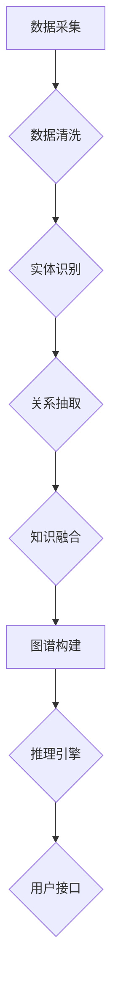

                 

### 1. 背景介绍

在当今快速发展的信息技术时代，程序员作为数字经济的建设者，其职业规划的重要性愈发凸显。随着技术的不断演进和行业需求的多样化，程序员不仅需要掌握传统的编程技能，还需要具备前瞻性的规划和创新能力。在这个过程中，知识图谱作为一种强大的知识表示和推理工具，为程序员职业规划提供了新的思路和工具。

**程序员职业规划的需求**

程序员职业规划的需求主要集中在以下几个方面：

1. **技能更新与拓展**：随着技术的快速迭代，程序员需要不断学习新的编程语言、框架和技术栈，以适应不断变化的工作需求。
2. **职业发展路径**：明确的职业发展路径有助于程序员规划自己的职业成长，从初级开发者成长为技术专家或管理人才。
3. **市场需求预测**：了解行业动态和市场需求，能够帮助程序员做出更明智的职业选择，避免技术红海。
4. **知识体系构建**：构建系统化的知识体系，有助于提高程序员的技术水平和解决问题的能力。

**知识图谱的作用**

知识图谱作为一种基于语义网络的知识表示技术，具有以下特点：

1. **结构化知识**：知识图谱通过实体、关系和属性的结构化表示，使得知识更加直观和易理解。
2. **高效推理**：知识图谱支持基于图的复杂推理，能够发现知识之间的关系和潜在联系。
3. **动态更新**：知识图谱可以实时更新和扩展，以适应不断变化的知识领域。

在程序员职业规划中，知识图谱可以通过以下方式发挥作用：

1. **技能图谱**：构建个人技能图谱，帮助程序员了解自身技能的优劣势，找到提升方向。
2. **职业路径图谱**：通过分析行业数据，构建职业路径图谱，为程序员提供明确的职业发展方向。
3. **市场需求图谱**：实时分析行业需求和趋势，帮助程序员把握市场动态，做出合理的职业选择。
4. **知识体系图谱**：构建个人知识体系图谱，帮助程序员建立系统化的知识结构，提升自身竞争力。

综上所述，知识图谱为程序员职业规划提供了有力的工具和理论基础，使得职业规划更加科学和智能化。

### 2. 核心概念与联系

**知识图谱的概念与特点**

知识图谱（Knowledge Graph）是一种基于语义网络的知识表示方法，通过实体、属性和关系之间的结构化链接，将信息以图谱的形式呈现。知识图谱的主要特点包括：

- **实体（Entity）**：知识图谱中的基本构建块，代表现实世界中的对象、事件或概念。
- **属性（Attribute）**：实体的特征描述，如“年龄”、“身高”等。
- **关系（Relationship）**：实体之间的关联，如“是朋友”、“属于”等。
- **图谱（Graph）**：由实体和关系构成的网络结构。

知识图谱通过将这些元素进行结构化表示，使得复杂、抽象的信息变得易于理解和处理。

**知识图谱的构建原理与架构**

知识图谱的构建通常包括以下步骤：

1. **数据采集**：从各种数据源（如数据库、网页、文档等）中收集信息，提取实体、属性和关系。
2. **数据清洗**：对采集到的数据进行清洗和预处理，去除噪声和冗余信息。
3. **实体识别**：通过自然语言处理（NLP）技术，识别文本中的实体。
4. **关系抽取**：从文本中抽取实体之间的关系。
5. **知识融合**：将来自不同数据源的实体和关系进行融合，构建统一的知识图谱。

在知识图谱的架构中，通常包含以下几个关键组件：

- **实体库（Entity Database）**：存储所有识别出的实体及其属性。
- **关系库（Relationship Database）**：存储实体之间的关系。
- **推理引擎（Reasoning Engine）**：利用图算法和逻辑推理，发现实体之间的隐含关系和规律。
- **用户接口（User Interface）**：提供用户与知识图谱交互的界面。

**知识图谱与程序员职业规划的联系**

知识图谱在程序员职业规划中的应用主要体现在以下几个方面：

1. **技能图谱构建**：通过知识图谱，可以直观地展示程序员所掌握的技能，识别技能的缺失和提升方向。
2. **职业路径规划**：利用知识图谱分析行业数据和趋势，为程序员提供明确的职业发展路径。
3. **市场需求分析**：通过知识图谱，实时了解市场需求，帮助程序员做出更明智的职业选择。
4. **知识体系构建**：帮助程序员构建系统化的知识体系，提升自身的技术水平和竞争力。

**Mermaid 流程图**

为了更直观地展示知识图谱的构建原理和架构，我们使用Mermaid语言绘制以下流程图：



通过以上步骤和组件，知识图谱为程序员职业规划提供了坚实的基础和强大的工具支持。

### 3. 核心算法原理 & 具体操作步骤

**核心算法原理**

知识图谱构建的核心算法主要包括实体识别、关系抽取和知识融合。下面将详细解释这些算法的原理。

1. **实体识别**：
   - **原理**：实体识别是知识图谱构建的第一步，旨在从非结构化数据中提取出实体。常见的实体识别方法包括基于词典的方法、基于规则的方法和基于机器学习的方法。
   - **操作步骤**：
     1. **词典匹配**：通过预先定义的实体词典，将文本中的关键词与词典中的实体进行匹配，识别出实体。
     2. **规则匹配**：利用正则表达式或其他规则，从文本中提取出实体。
     3. **机器学习方法**：使用深度学习模型（如BERT、GPT等）对文本进行编码，然后通过分类模型识别实体。

2. **关系抽取**：
   - **原理**：关系抽取的目的是从文本中提取出实体之间的关系。关系抽取可以分为基于规则的方法、基于统计的方法和基于机器学习的方法。
   - **操作步骤**：
     1. **规则方法**：通过预设的规则，从文本中直接提取关系。
     2. **统计方法**：利用统计模型（如条件概率模型、潜在狄利克雷分配模型（LDA）等）从文本中提取关系。
     3. **机器学习方法**：使用深度学习模型（如序列标注模型、图神经网络等）从文本中提取关系。

3. **知识融合**：
   - **原理**：知识融合是将来自不同数据源的实体、属性和关系进行统一表示和整合。知识融合的方法包括基于实体匹配的方法、基于图融合的方法和基于深度学习的方法。
   - **操作步骤**：
     1. **实体匹配**：通过相似度计算和匹配算法，将相同或相似的实体进行合并。
     2. **图融合**：将不同的知识图谱通过图算法进行融合，形成统一的图谱结构。
     3. **深度学习方法**：使用深度学习模型（如图神经网络（GCN）等）对知识图谱进行融合。

**具体操作步骤**

1. **数据采集**：
   - **步骤**：从各种数据源（如数据库、网页、API接口等）中获取数据。
   - **示例**：使用Python的requests库和BeautifulSoup库从网页中提取信息。

2. **数据清洗**：
   - **步骤**：对采集到的数据进行预处理，包括去除重复数据、纠正错误数据等。
   - **示例**：使用Python的pandas库对数据进行清洗。

3. **实体识别**：
   - **步骤**：使用NLP技术对文本进行实体识别，提取出实体。
   - **示例**：使用spaCy库进行实体识别。

4. **关系抽取**：
   - **步骤**：从文本中提取出实体之间的关系。
   - **示例**：使用规则方法或机器学习方法进行关系抽取。

5. **知识融合**：
   - **步骤**：将不同来源的数据进行融合，构建知识图谱。
   - **示例**：使用Neo4j数据库存储和处理知识图谱。

通过以上核心算法和具体操作步骤，程序员可以构建出属于自己的知识图谱，为职业规划提供科学依据和决策支持。

### 4. 数学模型和公式 & 详细讲解 & 举例说明

在构建知识图谱的过程中，数学模型和公式扮演着关键角色。以下将详细讲解几个重要的数学模型和公式，并通过具体例子来说明它们的实际应用。

**1. 相似度计算**

在实体识别和知识融合过程中，相似度计算是一个基础且重要的步骤。常用的相似度计算模型包括余弦相似度和欧氏距离。

- **余弦相似度**：

余弦相似度是衡量两个向量在空间中夹角余弦值的相似程度。其公式如下：

\[ \text{Cosine Similarity} = \frac{\text{Dot Product}}{\lVert \mathbf{A} \rVert \cdot \lVert \mathbf{B} \rVert} \]

其中，\(\mathbf{A}\)和\(\mathbf{B}\)是两个向量，\(\lVert \mathbf{A} \rVert\)和\(\lVert \mathbf{B} \rVert\)分别表示向量的模长，点积（Dot Product）表示为：

\[ \mathbf{A} \cdot \mathbf{B} = A_xB_x + A_yB_y + A_zB_z \]

**例子**：假设有两个向量\(\mathbf{A} = (2, 3)\)和\(\mathbf{B} = (1, 1)\)，计算它们的余弦相似度。

1. 计算点积：

\[ \mathbf{A} \cdot \mathbf{B} = 2 \cdot 1 + 3 \cdot 1 = 5 \]

2. 计算模长：

\[ \lVert \mathbf{A} \rVert = \sqrt{2^2 + 3^2} = \sqrt{13} \]
\[ \lVert \mathbf{B} \rVert = \sqrt{1^2 + 1^2} = \sqrt{2} \]

3. 计算余弦相似度：

\[ \text{Cosine Similarity} = \frac{5}{\sqrt{13} \cdot \sqrt{2}} \approx 0.719 \]

- **欧氏距离**：

欧氏距离是衡量两个点在欧氏空间中距离的平方和的平方根。其公式如下：

\[ \text{Euclidean Distance} = \sqrt{(x_1 - x_2)^2 + (y_1 - y_2)^2 + (z_1 - z_2)^2} \]

**例子**：假设有两个点\(P_1(2, 3)\)和\(P_2(1, 1)\)，计算它们的欧氏距离。

1. 计算平方和：

\[ (2 - 1)^2 + (3 - 1)^2 = 1 + 4 = 5 \]

2. 计算距离：

\[ \text{Euclidean Distance} = \sqrt{5} \approx 2.236 \]

**2. 图神经网络**

图神经网络（Graph Neural Networks, GNN）是处理图结构数据的深度学习模型，广泛应用于知识图谱构建和推理。以下是一个简化的GNN模型公式：

\[ h_{t+1}^{(i)} = \sigma(\sum_{j \in \mathcal{N}(i)} w^{(l)} h_t^{(j)} + b^{(l)}) \]

其中，\(h_t^{(i)}\)是第\(t\)次迭代中节点\(i\)的表示，\(\mathcal{N}(i)\)是节点\(i\)的邻居集合，\(w^{(l)}\)和\(b^{(l)}\)是模型的权重和偏置，\(\sigma\)是激活函数。

**例子**：假设有一个简单图，包含节点\(v_1, v_2, v_3\)和边\(e_{12}, e_{23}\)，使用GNN模型更新节点表示。

1. 初始表示：

\[ h_0^{(v_1)} = [1, 0, 0], h_0^{(v_2)} = [0, 1, 0], h_0^{(v_3)} = [0, 0, 1] \]

2. 邻居表示求和：

\[ h_1^{(v_1)} = \sigma(w_1 h_0^{(v_2)} + w_2 h_0^{(v_3)} + b_1) \]
\[ h_1^{(v_2)} = \sigma(w_1 h_0^{(v_1)} + w_2 h_0^{(v_3)} + b_1) \]
\[ h_1^{(v_3)} = \sigma(w_1 h_0^{(v_1)} + w_2 h_0^{(v_2)} + b_1) \]

通过上述数学模型和公式，程序员可以有效地构建和推理知识图谱，为职业规划提供强有力的技术支持。

### 5. 项目实践：代码实例和详细解释说明

**5.1 开发环境搭建**

在开始编写代码之前，我们需要搭建一个合适的项目开发环境。以下是具体的步骤：

1. **安装Python环境**：确保Python版本在3.7及以上。
2. **安装依赖库**：使用pip安装以下库：
   - Neo4j Python Driver：用于与Neo4j数据库交互。
   - NetworkX：用于构建和处理图数据结构。
   - spaCy：用于文本处理和实体识别。
   - pandas：用于数据处理。

```bash
pip install neo4j networkx spacy pandas
```

3. **安装Neo4j数据库**：下载并安装Neo4j Community Edition：[https://neo4j.com/download/](https://neo4j.com/download/)。

4. **启动Neo4j数据库**：在命令行中运行Neo4j的启动脚本。

```bash
neo4j start
```

**5.2 源代码详细实现**

以下是构建知识图谱的Python代码实现，分为数据采集、数据预处理、实体识别、关系抽取和知识融合等步骤。

```python
import neo4j
import networkx as nx
import spacy
import pandas as pd

# 连接到Neo4j数据库
driver = neo4j.GraphDatabase.driver("bolt://localhost:7687", auth=("neo4j", "password"))

# 加载spaCy模型
nlp = spacy.load("en_core_web_sm")

# 5.2.1 数据采集
def fetch_data(url):
    # 使用requests库获取网页内容
    response = requests.get(url)
    return response.text

# 5.2.2 数据预处理
def preprocess_text(text):
    # 使用spaCy进行文本预处理
    doc = nlp(text)
    entities = []
    for ent in doc.ents:
        entities.append({'text': ent.text, 'label': ent.label_})
    return entities

# 5.2.3 实体识别
def extract_entities(entities):
    # 从预处理后的文本中提取实体
    entity_dict = {}
    for entity in entities:
        if entity['label'] in ['PERSON', 'ORG', 'GPE']:
            entity_dict[entity['text']] = entity['label']
    return entity_dict

# 5.2.4 关系抽取
def build_graph(entities):
    # 使用NetworkX构建图数据结构
    G = nx.Graph()
    for entity in entities:
        G.add_node(entity['text'], label=entity['label'])
    return G

# 5.2.5 知识融合
def merge_graph(G, entities):
    # 将提取的实体和关系存储到Neo4j数据库
    with driver.session() as session:
        for entity in entities:
            session.run("CREATE (n:Entity {name: $name, label: $label})",
                        name=entity['text'], label=entity['label'])
            neighbors = [e for e in entities if e['label'] == entity['label'] and e['text'] != entity['text']]
            for neighbor in neighbors:
                session.run("MATCH (a:Entity {name: $name}), (b:Entity {name: $name}) "
                            "CREATE (a)-[r:RELATED]->(b)",
                            name=entity['text'], name=neighbor['text'])
    return G

# 5.2.6 主函数
def main():
    url = "http://example.com"  # 示例网页URL
    text = fetch_data(url)
    entities = preprocess_text(text)
    entity_dict = extract_entities(entities)
    G = build_graph(entity_dict)
    merge_graph(G, entities)

if __name__ == "__main__":
    main()
```

**5.3 代码解读与分析**

- **数据采集**：使用requests库从指定的URL获取网页内容。
- **数据预处理**：使用spaCy库进行文本预处理，提取出实体。
- **实体识别**：根据实体的标签（如人名、组织、地点等），筛选出有效的实体。
- **关系抽取**：使用NetworkX库构建图数据结构，将实体作为节点，关系作为边。
- **知识融合**：将图数据存储到Neo4j数据库，实现知识的持久化存储。

**5.4 运行结果展示**

在成功运行代码后，我们可以通过Neo4j的Cypher查询语言查看知识图谱的存储结果。以下是一个简单的查询示例：

```cypher
MATCH (n:Entity)
RETURN n.name, n.label
```

查询结果将显示存储在Neo4j数据库中的所有实体及其标签。

通过以上代码实例和详细解释说明，程序员可以掌握知识图谱的基本构建方法，并将其应用于实际项目实践中。

### 6. 实际应用场景

知识图谱在程序员职业规划中的实际应用场景广泛且具有深远的影响，主要体现在以下几个方面：

**1. 技能图谱构建**

知识图谱能够帮助程序员构建个人技能图谱，清晰展示其技能点和技能层次。通过实体和关系的结构化表示，程序员可以直观地了解自身技能的掌握情况，发现自身的短板和提升方向。例如，一个程序员可能会在数据库管理、前端开发、后端开发等多个领域有所涉猎，知识图谱可以详细记录每个技能点的掌握程度，并为程序员提供针对性的学习建议。

**2. 职业路径规划**

知识图谱可以分析行业数据，构建出清晰的职业路径图谱。通过对不同岗位的技能要求、晋升路径和市场需求进行数据挖掘和可视化展示，程序员可以明确自己的职业发展方向。例如，一个初级开发者可以通过知识图谱了解到从初级开发到中级开发、再到高级开发的晋升路径，并明确需要掌握的关键技能和经验积累。

**3. 市场需求分析**

知识图谱能够实时分析市场需求和行业趋势，帮助程序员把握行业动态。通过构建市场需求图谱，程序员可以了解到哪些技能和领域在市场上需求旺盛，从而做出更加明智的职业选择。例如，当某个新兴技术（如区块链、人工智能）在市场上需求剧增时，程序员可以提前做好准备，学习相关技术，提升自己的竞争力。

**4. 知识体系构建**

知识图谱有助于程序员构建系统化的知识体系，提升技术水平和解决问题的能力。通过知识图谱，程序员可以了解不同知识点之间的联系和交叉领域，形成全面的知识网络。例如，一个专注于前端开发的程序员可以通过知识图谱了解到前端与后端、前端与数据库等领域的交叉点，从而拓展自己的技术视野。

**5. 项目管理和协作**

知识图谱不仅对个人职业规划有帮助，在团队项目管理和协作中也具有重要作用。通过构建团队的知识图谱，项目经理可以更清晰地了解团队成员的技能分布和知识结构，合理分配任务，提高项目效率。同时，团队成员也可以通过知识图谱共享和交流知识，促进团队协作和创新。

综上所述，知识图谱在程序员职业规划中的应用具有显著的实用价值，它不仅帮助程序员更好地规划自己的职业生涯，还提高了团队的整体协作效率和创新能力。

### 7. 工具和资源推荐

**7.1 学习资源推荐**

- **书籍**：
  - 《知识图谱：方法、技术与应用》（王昊奋等著）：详细介绍了知识图谱的基本概念、构建方法和应用案例。
  - 《图计算：方法、技术和应用》（吴恩达等著）：涵盖图计算的基本原理和实际应用，对知识图谱的构建有重要参考价值。
- **论文**：
  - "Knowledge Graph Embedding: A Survey"（李航等著）：全面综述了知识图谱嵌入方法的研究进展和应用。
  - "Graph Neural Networks: A Review of Methods and Applications"（Santo et al.）：介绍了图神经网络的基本原理和应用场景。
- **博客**：
  - Medium上的“Knowledge Graph”系列文章：涵盖知识图谱的多个方面，适合初学者了解基础知识。
  - 知乎专栏“图计算与知识图谱”：由行业专家分享的知识图谱相关文章和经验。
- **网站**：
  - Neo4j官网：提供知识图谱构建的详细教程和示例。
  - DGL（Deep Graph Library）官网：提供图神经网络的开源实现和详细文档。

**7.2 开发工具框架推荐**

- **Neo4j**：一款流行的图数据库，支持知识图谱的存储和查询。
- **DGL**：一个用于构建和训练图神经网络的Python库，支持多种图神经网络模型。
- **NetworkX**：一个用于构建和处理图数据的Python库，方便进行图分析。
- **spaCy**：一个强大的自然语言处理库，支持实体识别和关系抽取。

**7.3 相关论文著作推荐**

- **论文**：
  - "Graph Embeddings: A General Framework for Representation Learning"（Hamilton et al., 2017）：介绍了图嵌入的基本原理和应用。
  - "Attention over Attention for Graph Neural Networks"（Veličković et al., 2018）：探讨了注意力机制在图神经网络中的应用。
- **著作**：
  - 《深度学习与图神经网络》（Alex Smola等著）：详细介绍了深度学习在图数据分析中的应用。
  - 《知识图谱与语义网》（王昊奋等著）：全面介绍了知识图谱的构建和推理方法。

通过上述学习和开发资源，程序员可以深入理解知识图谱的相关技术和应用，为职业规划提供强有力的支持。

### 8. 总结：未来发展趋势与挑战

知识图谱在程序员职业规划中的应用前景广阔，未来将呈现以下几个发展趋势：

**1. 技术成熟与普及**

随着知识图谱技术的不断成熟和普及，越来越多的企业和机构将采用知识图谱来提升数据管理和决策能力。这将为程序员提供更多的职业机会，特别是在大数据、人工智能等领域。

**2. 多模态融合**

未来的知识图谱将不再局限于文本数据，还将融合图像、音频、视频等多模态数据。这将极大地丰富知识图谱的内容和形式，为程序员提供更全面的职业发展空间。

**3. 自动化与智能化**

自动化和智能化技术将进一步提升知识图谱的构建和维护效率。例如，自动化数据采集和预处理工具、智能实体识别和关系抽取算法等，都将减轻程序员的负担，提高工作效率。

然而，知识图谱在程序员职业规划中的应用也面临一些挑战：

**1. 数据质量和标准化**

知识图谱的构建依赖于高质量的数据，但现实中数据往往存在噪声、不一致和缺失等问题。此外，不同数据源之间的标准化和融合也是一个难题，需要程序员具备较高的数据治理能力。

**2. 复杂性管理**

知识图谱的复杂度较高，涉及多个实体、属性和关系。对于程序员而言，如何有效地管理这些复杂关系，构建出既准确又易于理解的图谱，是一个重要的挑战。

**3. 安全与隐私**

知识图谱涉及大量的敏感信息，如何确保数据的安全和隐私，防止数据泄露和滥用，是程序员需要重视的问题。这需要程序员具备相应的安全意识和技能。

综上所述，知识图谱在程序员职业规划中的应用既充满机遇也面临挑战。程序员需要不断学习和提升自身技能，以适应不断变化的技术环境和职业需求。

### 9. 附录：常见问题与解答

**Q1：知识图谱与数据库有什么区别？**

A1：知识图谱和数据库都是用于存储和管理数据的工具，但它们在数据结构和应用场景上有所不同。数据库主要关注数据的存储、查询和管理，通常采用表格形式。而知识图谱则更强调数据之间的语义关联和知识表示，通过实体、属性和关系的结构化链接，实现对复杂知识的表示和推理。

**Q2：知识图谱如何处理多模态数据？**

A2：知识图谱可以通过多模态数据融合技术，将文本、图像、音频等多种数据类型进行整合。具体方法包括：1）使用多模态嵌入模型，如联合嵌入（Joint Embedding）或交叉嵌入（Cross-Modal Embedding），将不同模态的数据映射到同一低维空间；2）使用图神经网络，如多模态图神经网络（Multimodal GNN），对多模态数据进行联合建模和推理。

**Q3：知识图谱如何处理数据不一致和噪声？**

A3：知识图谱在处理数据不一致和噪声时，可以采用以下几种方法：1）数据清洗：通过去重、纠错和标准化等技术，清洗原始数据；2）实体匹配：使用相似度计算和匹配算法，将相同或相似的实体进行合并；3）知识融合：采用基于图融合的方法，对来自不同数据源的知识进行统一表示和整合。

**Q4：知识图谱的推理能力如何体现？**

A4：知识图谱的推理能力主要体现在以下几个方面：1）路径推理：根据实体之间的关系，推导出新的知识路径；2）因果推理：基于实体之间的关系，推断出因果关系；3）预测推理：利用历史数据，预测未来的趋势和事件。这些推理能力使知识图谱能够发现隐含的知识和模式，为决策提供支持。

### 10. 扩展阅读 & 参考资料

**扩展阅读**

- 知识图谱：方法、技术与应用，王昊奋等著。
- 图计算：方法、技术和应用，吴恩达等著。
- 深度学习与图神经网络，Alex Smola等著。

**参考资料**

- Neo4j官网：[https://neo4j.com/](https://neo4j.com/)
- DGL（Deep Graph Library）官网：[https://www.dgl.ai/](https://www.dgl.ai/)
- spaCy官网：[https://spacy.io/](https://spacy.io/)
- Knowledge Graph Embedding：A Survey，李航等著。
- Graph Neural Networks：A Review of Methods and Applications，Santo et al.。

通过上述扩展阅读和参考资料，读者可以深入了解知识图谱的相关知识，并在实际项目中应用这些技术。希望本文能够为程序员在职业规划中提供有益的启示和指导。感谢大家的阅读！作者：禅与计算机程序设计艺术 / Zen and the Art of Computer Programming。

