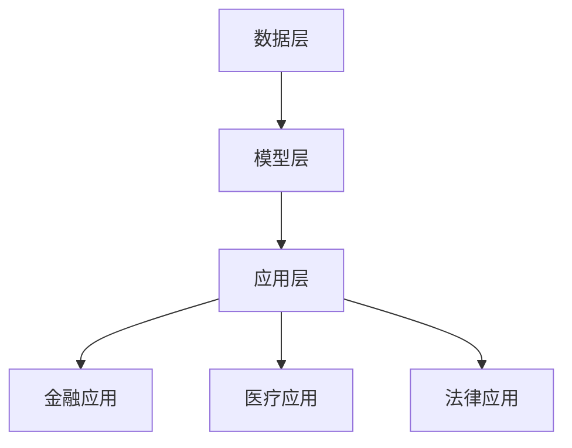

                 

# 知识图谱的行业应用：金融、医疗和法律领域的实践

## 关键词
- 知识图谱
- 行业应用
- 金融
- 医疗
- 法律
- 实践

## 摘要
本文将深入探讨知识图谱在金融、医疗和法律领域的应用实践。通过分析这些领域的特定需求和挑战，本文将展示知识图谱如何通过其独特的结构和算法，提供有效的解决方案，提升行业效率和准确性。文章将从核心概念、算法原理、应用案例和未来发展等方面进行详细阐述，为读者提供一个全面的知识图谱行业应用全景。

## 1. 背景介绍
知识图谱作为一种知识表示和组织的技术，通过对实体、属性和关系的结构化表示，使得数据之间的关联关系更加直观和易于理解。知识图谱起源于语义网的概念，它通过图结构来表示实体之间的关系，从而实现数据间的自动推理和知识发现。

### 1.1 金融领域的需求与挑战
在金融领域，知识图谱的应用需求主要集中在风险管理、客户关系管理和市场分析等方面。然而，金融行业的数据复杂度高，数据源多样，数据质量参差不齐，这对知识图谱的建设和维护提出了挑战。

### 1.2 医疗领域的需求与挑战
医疗领域的知识图谱应用主要包括疾病诊断、药物研发和患者管理。然而，医疗数据的多维度和异构性使得知识图谱的构建面临巨大的挑战，同时，隐私保护也是不可忽视的问题。

### 1.3 法律领域的需求与挑战
在法律领域，知识图谱的应用包括法律文件解析、案件分析和司法判决辅助等。法律文本具有复杂的语义和结构，构建一个高效的知识图谱对于法律信息的自动化处理至关重要。

## 2. 核心概念与联系
### 2.1 知识图谱的概念
知识图谱是一种基于图结构的知识表示方法，它将现实世界中的实体和概念表示为节点，将实体之间的关系表示为边。知识图谱的核心是实体、属性和关系的结构化表示。

### 2.2 知识图谱的架构
知识图谱通常包括三层架构：底层是数据层，负责存储原始数据；中层是模型层，负责定义实体和关系的类型；顶层是应用层，负责将知识图谱应用于具体业务场景。

### 2.3 Mermaid 流程图


## 3. 核心算法原理 & 具体操作步骤
### 3.1 知识图谱的构建
构建知识图谱通常包括数据抽取、实体识别、关系抽取和知识融合等步骤。

#### 3.1.1 数据抽取
数据抽取是知识图谱构建的第一步，它从各种数据源中提取结构化数据。

#### 3.1.2 实体识别
实体识别是识别文本中的实体，并将其映射到知识图谱中的节点。

#### 3.1.3 关系抽取
关系抽取是识别实体之间的关系，并将其表示为知识图谱中的边。

#### 3.1.4 知识融合
知识融合是将来自不同数据源的知识进行整合，以形成一个统一的视图。

### 3.2 知识图谱的算法
知识图谱的算法主要包括图嵌入、实体链接、关系分类等。

#### 3.2.1 图嵌入
图嵌入是将图中的节点映射到低维空间，以便进行相似性计算和聚类分析。

#### 3.2.2 实体链接
实体链接是将文本中的实体与知识图谱中的实体进行映射，以解决数据源中的异构性问题。

#### 3.2.3 关系分类
关系分类是识别图中边的类型，以提供更准确的知识表示。

## 4. 数学模型和公式 & 详细讲解 & 举例说明
### 4.1 图嵌入算法
图嵌入常用的算法包括 DeepWalk、Node2Vec 和 GraphSAGE 等。

#### 4.1.1 DeepWalk
DeepWalk 通过随机游走生成图中的序列，然后使用词嵌入模型（如 Word2Vec）进行节点嵌入。

#### 4.1.2 Node2Vec
Node2Vec 在 DeepWalk 的基础上，通过调整游走的深度和广度，来生成更高质量的图序列。

#### 4.1.3 GraphSAGE
GraphSAGE 通过聚合邻居节点的特征，来生成当前节点的嵌入向量。

### 4.2 实体链接算法
实体链接常用的算法包括 TransE、TransH 和 TransR 等。

#### 4.2.1 TransE
TransE 通过优化实体与关系的组合，使得相似实体在嵌入空间中更接近。

#### 4.2.2 TransH
TransH 通过引入超平面，使得实体与关系的组合可以更灵活地调整。

#### 4.2.3 TransR
TransR 通过引入额外的实体嵌入空间，来提高实体链接的准确性。

### 4.3 关系分类算法
关系分类常用的算法包括 Logistic Regression、SVM 和神经网络等。

#### 4.3.1 Logistic Regression
Logistic Regression 是一种经典的线性分类器，适用于关系分类问题。

#### 4.3.2 SVM
SVM 是一种基于间隔的线性分类器，适用于高维数据。

#### 4.3.3 神经网络
神经网络是一种非线性分类器，通过多层神经网络可以捕捉复杂的特征。

## 5. 项目实践：代码实例和详细解释说明
### 5.1 开发环境搭建
搭建知识图谱项目通常需要以下环境：
- Python 3.x
- Numpy、Pandas、Scikit-learn 等常用库
- GraphFrames、Neo4j 等知识图谱相关库

### 5.2 源代码详细实现
以下是一个简单的知识图谱构建的代码示例：

```python
from graphframes import GraphFrame
import pandas as pd

# 数据预处理
data = pd.read_csv('data.csv')
entities = data[['entity_id', 'entity_name']]
relations = data[['entity_id', 'relationship', 'related_entity_id']]

# 创建 GraphFrame
g = GraphFrame(entities, relations)

# 构建知识图谱
g = g.joinVertices(entities, lambda v, e: e)

# 保存知识图谱
g.save('knowledge_graph', format='graphml')
```

### 5.3 代码解读与分析
上述代码展示了如何从 CSV 数据中构建一个简单的知识图谱。首先，读取数据并创建 entities 和 relations 两个 DataFrame。然后，使用 GraphFrame 创建图，并将实体和关系映射到图中。最后，保存知识图谱到文件中。

### 5.4 运行结果展示
运行上述代码后，将生成一个 GraphML 格式的知识图谱文件，可以使用知识图谱可视化工具进行查看。

## 6. 实际应用场景
### 6.1 金融领域
知识图谱在金融领域的应用包括客户画像、风险管理和市场预测等。通过构建客户关系图谱，银行可以更精准地进行风险控制和客户管理。

### 6.2 医疗领域
知识图谱在医疗领域的应用包括疾病诊断、药物研发和患者管理。例如，通过构建疾病关系图谱，医生可以更快速地诊断患者疾病。

### 6.3 法律领域
知识图谱在法律领域的应用包括法律文件解析、案件分析和司法判决辅助等。通过构建法律关系图谱，法律工作者可以更高效地处理法律事务。

## 7. 工具和资源推荐
### 7.1 学习资源推荐
- 《知识图谱：概念、技术与应用》
- 《大规模分布式知识图谱构建技术研究》
- 《深度学习与知识图谱》

### 7.2 开发工具框架推荐
- Neo4j：一个高性能的图形数据库，支持知识图谱的存储和查询。
- OpenKG：一个开源的知识图谱平台，提供知识抽取、融合和推理等功能。

### 7.3 相关论文著作推荐
- "知识图谱综述：概念、方法与应用"
- "基于知识图谱的问答系统研究"
- "知识图谱在金融领域的应用与实践"

## 8. 总结：未来发展趋势与挑战
知识图谱在金融、医疗和法律等领域具有广泛的应用前景。然而，面对数据复杂性、隐私保护和算法优化等挑战，知识图谱的发展仍需不断探索。未来，随着人工智能技术的进步，知识图谱将更加智能化和自动化，为行业带来更多的创新和变革。

## 9. 附录：常见问题与解答
### 9.1 什么是知识图谱？
知识图谱是一种通过图结构表示实体和关系的技术，它使得数据之间的关联关系更加直观和易于理解。

### 9.2 知识图谱有哪些应用领域？
知识图谱在金融、医疗、法律、电商等多个领域都有广泛应用。

### 9.3 如何构建知识图谱？
构建知识图谱通常包括数据抽取、实体识别、关系抽取和知识融合等步骤。

## 10. 扩展阅读 & 参考资料
- 《知识图谱：概念、技术与应用》
- 《大规模分布式知识图谱构建技术研究》
- 《深度学习与知识图谱》
- "知识图谱综述：概念、方法与应用"
- "基于知识图谱的问答系统研究"
- "知识图谱在金融领域的应用与实践"

[END]

