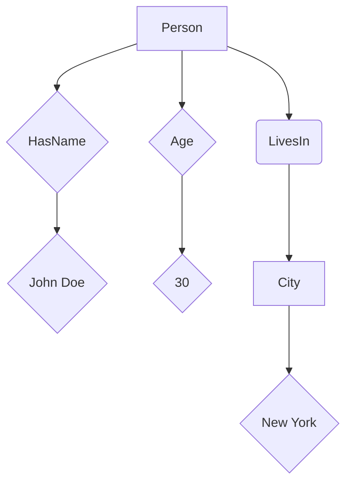

                 

### 背景介绍

知识图谱（Knowledge Graph）作为一种新兴的信息表示方式，正逐渐成为构建智能搜索系统的基础。早在2012年，谷歌就推出了基于知识图谱的搜索算法，显著提升了搜索结果的准确性和相关性。知识图谱的概念源于图论，它通过将实体及其关系表示为图结构，实现了信息的高度组织化与关联化。

知识图谱在计算机科学中的重要性不可低估。首先，它解决了传统关键词搜索中存在的诸多问题，如同义词歧义、上下文理解不足等。其次，知识图谱为机器学习算法提供了更为丰富和结构化的训练数据，有助于提升模型的智能性和鲁棒性。此外，知识图谱还在推荐系统、智能问答、自然语言处理等领域发挥着关键作用。

本文旨在深入探讨知识图谱的核心概念、构建方法、应用场景以及未来发展趋势。通过详细解析知识图谱的构建过程，本文希望为读者提供一个全面且易懂的视角，以更好地理解这一重要技术。

### 1.1 知识图谱的定义与基本概念

知识图谱是一种基于图论的数据结构，用于表示实体（实体可以是人物、地点、事物等）及其相互关系。在知识图谱中，实体被视为节点（Node），而实体之间的关系则通过边（Edge）来表示。这种图形化的数据表示方式使得知识图谱具备高度的灵活性和扩展性，能够有效地捕捉和处理复杂的关系网络。

知识图谱的基本概念包括：

1. **实体（Entity）**：知识图谱中的基本元素，代表各种对象，如人、地点、物品等。例如，“苹果”是一个实体，“北京”也是一个实体。

2. **属性（Property）**：描述实体特征的信息，例如实体的名称、类型、出生日期等。属性通常用于定义实体之间的关系。

3. **关系（Relationship）**：连接两个或多个实体的抽象概念，例如“属于”、“位于”、“生产”等。关系描述了实体之间的关联和互动。

4. **边（Edge）**：在图结构中，连接两个节点的线条，表示实体之间的特定关系。

5. **图（Graph）**：由节点和边构成的数据结构，代表了知识图谱的整体框架。

6. **图谱（Knowledge Graph）**：一个大规模、多层次的图结构，用于表示实体、属性和关系，实现信息的组织、存储和查询。

知识图谱的这些基本概念共同构成了一个复杂而丰富的信息表示系统，使得计算机能够更好地理解和处理现实世界中的各种关系和知识。

### 1.2 知识图谱的起源与发展历程

知识图谱的概念最早可以追溯到20世纪90年代，当时由计算机科学家James Webber和Robert Hummer提出了语义网（Semantic Web）的概念。语义网旨在通过在互联网上嵌入语义信息，使计算机能够更有效地理解和处理数据。然而，早期语义网的应用并没有达到预期的效果，主要因为数据结构和查询语言的复杂性。

随着互联网和信息技术的快速发展，知识图谱逐渐成为了研究热点。2006年，谷歌推出了知识图谱项目（Google Knowledge Graph），通过将实体和关系以图的形式表示出来，显著提升了搜索引擎的搜索质量和用户体验。谷歌知识图谱的成功引发了全球范围内对知识图谱技术的研究和应用。

2012年，Facebook也宣布推出了其知识图谱项目，用于提高社交网络的推荐质量和内容相关性。此外，微软、亚马逊、百度等科技巨头也相继推出了各自的知识图谱系统，进一步推动了知识图谱技术的发展。

在学术界，知识图谱的研究也取得了显著进展。例如，图数据库（如Neo4j）和图计算框架（如Apache Giraph）的兴起，为知识图谱的存储和计算提供了强大的技术支持。同时，机器学习和自然语言处理技术的结合，使得知识图谱的构建和推理能力得到了显著提升。

总体而言，知识图谱技术的起源和发展历程反映了信息技术领域对知识组织与表示的持续追求。通过不断的技术创新和应用实践，知识图谱正逐渐成为构建智能搜索系统的重要基础。

### 1.3 知识图谱的应用领域

知识图谱在多个领域展示了其强大的应用潜力，其中最为突出的包括：

1. **搜索引擎**：知识图谱通过将实体和关系表示为图结构，极大地提升了搜索引擎的搜索质量和用户体验。例如，谷歌知识图谱通过理解实体和关系，能够更准确地响应用户的查询，提供更加相关和精确的搜索结果。

2. **推荐系统**：知识图谱能够为推荐系统提供更为丰富和结构化的数据，从而提升推荐效果。例如，亚马逊和Netflix等公司利用知识图谱，根据用户的历史行为和实体关系，提供个性化的商品和内容推荐。

3. **自然语言处理（NLP）**：知识图谱在NLP领域也有着广泛的应用。通过将文本中的实体和关系转化为图结构，NLP模型能够更好地理解和处理语义信息，从而提升文本分析、机器翻译和情感分析等任务的效果。

4. **智能问答**：知识图谱为智能问答系统提供了结构化的知识库，使得系统能够更好地理解和回答用户的问题。例如，微软的小冰和谷歌的Bertie等智能问答系统，都基于知识图谱实现了高效的问答功能。

5. **物联网（IoT）**：在物联网领域，知识图谱能够帮助设备更好地理解和互动。通过将物联网设备中的数据表示为图结构，知识图谱能够实现设备之间的智能协作和优化，提高物联网系统的整体效能。

6. **金融与保险**：知识图谱在金融和保险行业也有重要应用。例如，通过分析企业和个人的关系网络，金融机构能够更准确地评估信用风险，优化风险管理策略。

7. **医疗健康**：知识图谱在医疗健康领域有着广泛的应用前景。通过将医学知识、患者数据和相关实体表示为图结构，医疗系统能够更好地诊断疾病、推荐治疗方案和进行药物研究。

总之，知识图谱技术在各个领域展现了巨大的应用潜力，正逐步改变着人们的生活和工作方式。

### 1.4 知识图谱的核心组成部分

知识图谱的核心组成部分包括实体（Entity）、属性（Attribute）和关系（Relationship）。这些组成部分共同构成了知识图谱的基本结构，为信息的组织、存储和查询提供了基础。

1. **实体（Entity）**：实体是知识图谱中的基本元素，代表现实世界中的各种对象，如人、地点、物品等。例如，"苹果"是一个实体，"北京"也是一个实体。在知识图谱中，实体通过节点（Node）来表示。

2. **属性（Attribute）**：属性用于描述实体的特征或状态。每个实体可以具有多个属性，例如实体的名称、类型、出生日期等。属性通过边（Edge）与实体节点相连，提供对实体更详细的描述。

3. **关系（Relationship）**：关系连接两个或多个实体，描述它们之间的关联或互动。例如，"属于"、"位于"、"生产"等都是关系。关系通过边（Edge）来表示，连接相关的实体节点。

通过实体、属性和关系的组合，知识图谱能够形成复杂而丰富的知识网络。这些组成部分不仅为信息的存储和查询提供了结构化的方法，还使得计算机能够更有效地理解和处理现实世界中的各种关系和知识。

### 1.5 知识图谱在智能搜索中的应用

知识图谱在智能搜索中的应用极大地提升了搜索系统的智能化和用户体验。传统的搜索引擎主要依赖于关键词匹配和向量空间模型，而知识图谱则通过将实体和关系表示为图结构，实现了对语义理解的增强。

首先，知识图谱通过将网页中的信息转化为结构化的实体和关系，实现了对信息的深度理解和关联。例如，当用户搜索“北京”时，知识图谱可以自动识别“北京”是一个地理位置实体，并且关联到相关的信息，如天气、旅游景点、历史等。这种语义理解使得搜索结果更加相关和准确。

其次，知识图谱通过路径分析和图推理，实现了对复杂查询的精准响应。例如，当用户搜索“去北京旅游”时，知识图谱可以自动分析出与“北京旅游”相关的各种信息和路径，如机场、酒店、景点、交通等。通过这种路径分析和推理，用户可以获得更加智能化和个性化的搜索结果。

此外，知识图谱还能够根据用户的历史查询行为和偏好，实现个性化搜索推荐。例如，当用户经常搜索某些特定主题时，知识图谱可以自动识别用户的兴趣，并推荐相关的搜索结果和内容。这种个性化推荐不仅提高了搜索的效率，还增强了用户的满意度和粘性。

总之，知识图谱通过将信息转化为结构化的实体和关系，实现了对语义理解的增强和智能化搜索。这使得智能搜索系统不仅能够提供更准确、更相关的搜索结果，还能够实现个性化推荐，显著提升了用户的搜索体验。

### 1.6 知识图谱构建的挑战与解决方案

在构建知识图谱的过程中，面临诸多挑战。首先，数据质量是一个重要问题。知识图谱依赖于大量结构化数据，然而，现实世界中的数据往往存在噪声、不一致性和错误。为了保证数据质量，需要采用数据清洗、去重和一致性验证等技术手段。

其次，实体识别和关系抽取是知识图谱构建的核心步骤，但这两个过程都涉及到复杂的自然语言处理任务。实体识别需要从大量的文本数据中准确识别出实体，而关系抽取则需要理解实体之间的语义关系。为应对这些挑战，可以采用深度学习技术，如基于卷积神经网络（CNN）和循环神经网络（RNN）的模型，以提高实体识别和关系抽取的准确性。

此外，知识图谱的可扩展性也是一个关键问题。随着数据规模的不断扩大，如何高效地存储、索引和查询知识图谱成为一个挑战。为此，可以采用分布式图数据库和图计算框架，如Neo4j、Apache Giraph等，以实现知识图谱的可扩展性和高效处理。

最后，知识图谱的更新和维护也是一个持续性的挑战。由于实体和关系会随着时间和环境的变化而发生变化，需要定期对知识图谱进行更新和维护。为此，可以采用自动化工具和算法，如数据流处理技术和图更新算法，以实现知识图谱的实时更新。

总之，通过解决数据质量、实体识别、关系抽取、可扩展性和更新维护等挑战，知识图谱构建技术将不断成熟和完善，为智能搜索和知识管理提供更强有力的支持。

### 1.7 知识图谱与语义网的关系

知识图谱与语义网是紧密相关的概念，二者在信息组织与表示方面有着共同的追求。语义网旨在通过在互联网上嵌入语义信息，实现数据的结构化和语义化，从而提高机器对数据的理解和处理能力。知识图谱则是语义网实现的具体技术方案之一。

知识图谱作为语义网的一部分，通过将实体和关系表示为图结构，实现了对复杂语义信息的有效组织和表示。与传统的语义网技术相比，知识图谱具备更高的灵活性和扩展性，能够更好地处理复杂的关系网络。知识图谱的优势在于其结构化、层次化的数据表示方式，使得信息查询和分析更加高效和准确。

另一方面，语义网为知识图谱提供了理论基础和技术支持。语义网中的资源描述框架（RDF）和本体论（Ontology）等概念，为知识图谱的构建和推理提供了重要的指导。知识图谱的实体、属性和关系等概念，均源自于语义网的理论体系。

总的来说，知识图谱是语义网在信息组织和表示方面的重要实现技术，二者相辅相成，共同推动了信息科学的发展。通过知识图谱，语义网的理念得以在实际应用中得以实现，从而为智能搜索、数据挖掘和知识管理等领域带来了巨大的变革。

### 1.8 知识图谱技术在全球范围内的应用现状

知识图谱技术在全球范围内得到了广泛应用，尤其是在科技巨头和学术界的推动下，其影响力日益扩大。在美国，谷歌、微软和Facebook等公司早在多年前便开始积极研发和应用知识图谱技术。谷歌的知识图谱项目通过其搜索引擎实现了高质量的搜索结果，提升了用户体验。微软的小冰和Facebook的社交图谱则利用知识图谱为用户提供个性化的内容推荐和社交互动。

在欧洲，知识图谱技术也得到了广泛关注和应用。例如，欧洲原子能共同体（CERN）使用知识图谱来管理和分析大型科学实验数据。此外，欧洲许多大学和研究机构也在积极探索知识图谱在生物信息学、社会科学等领域的应用。

在亚洲，中国和日本等国在知识图谱技术方面也取得了显著进展。百度和阿里巴巴等中国科技巨头通过知识图谱技术，提升了搜索引擎和电商平台的用户体验。日本则在医疗健康领域应用知识图谱，以实现更精准的诊断和治疗。

总的来说，知识图谱技术在全球范围内已经从理论研究走向实际应用，并取得了诸多成功案例。随着技术的不断成熟和应用的深入，知识图谱将在更多的领域发挥重要作用，为人类社会带来更多的便利和创新。

### 1.9 知识图谱技术的未来发展趋势与挑战

知识图谱技术的未来发展充满了潜力和挑战。一方面，随着人工智能和大数据技术的不断进步，知识图谱的构建和推理能力将得到显著提升。未来，知识图谱有望实现更加智能化和自动化的构建，通过深度学习和自然语言处理技术，从海量数据中自动提取实体和关系，减少人工干预。

另一方面，知识图谱在多语言、跨文化和跨领域应用中的挑战依然存在。不同语言和文化背景下的实体和关系表示可能存在差异，如何实现统一和兼容，是一个重要的研究课题。此外，随着数据规模的不断扩大，如何高效地存储、查询和更新知识图谱，也是一项艰巨的任务。

此外，隐私保护和数据安全是知识图谱技术面临的另一个重要挑战。在构建和使用知识图谱的过程中，如何确保数据的安全和隐私，避免数据泄露和滥用，将成为未来研究的重要方向。

总的来说，知识图谱技术在未来将继续发展，并在智能搜索、推荐系统、自然语言处理等领域发挥更大作用。但同时，也需要克服数据质量、跨语言应用、隐私保护等方面的挑战，实现技术与应用的协调发展。

### 2.1 知识图谱的基本结构

知识图谱是一种复杂的数据结构，主要由实体（Entity）、属性（Attribute）和关系（Relationship）三个基本组成部分构成。这三个元素相互关联，共同构建出一个多层次、结构化的知识网络。

1. **实体（Entity）**：实体是知识图谱中的核心元素，代表现实世界中的各种对象，如人、地点、物品等。每个实体都有一个唯一的标识符（ID），用于在图中唯一确定该实体。实体的例子包括“苹果”、“北京”、“苹果公司”等。

2. **属性（Attribute）**：属性用于描述实体的特征或状态。每个实体可以拥有多个属性，例如实体的名称、类型、出生日期等。属性通过键值对（Key-Value Pair）的形式与实体相关联。例如，实体“苹果”可以有属性“颜色”（键）和“红色”（值）。

3. **关系（Relationship）**：关系连接两个或多个实体，描述它们之间的关联或互动。关系通常由两个实体和一个描述性标签构成，例如“属于”、“位于”、“生产”等。例如，关系“属于”连接实体“苹果”和“苹果公司”，表示“苹果”是“苹果公司”生产的产品。

通过实体、属性和关系的组合，知识图谱能够表示复杂的关系网络，实现对实体之间关联的全面理解和分析。知识图谱的基本结构不仅为数据的组织和管理提供了有效的框架，还为智能搜索和推理提供了强大的支持。

### 2.2 实体、属性和关系的 Mermaid 流程图表示

为了更好地理解知识图谱的基本结构，我们可以通过Mermaid流程图来表示实体、属性和关系。以下是一个简化的Mermaid流程图示例：



在这个示例中，我们定义了一个名为“Person”的实体，它拥有多个属性，如“HasName”、“Age”和“LivesIn”。每个属性通过键值对的形式与实体相关联。例如，实体“Person”的“HasName”属性值为“John Doe”，“Age”属性值为30，“LivesIn”属性关联到一个名为“City”的实体，该实体的值为“New York”。

这个Mermaid流程图展示了如何将实体、属性和关系表示为图结构。通过这种方式，我们可以直观地理解知识图谱的基本组成，并进一步探讨其应用和扩展。

### 2.3 知识图谱的层次结构

知识图谱的层次结构是其在复杂信息表示和推理中的关键特征。知识图谱通常分为三个主要的层次：底层实体、中层关系和顶层本体。这些层次共同构成了知识图谱的多级组织结构，使得信息表示更加清晰和系统化。

1. **底层实体（Object Layer）**：底层实体是知识图谱中最基本的元素，代表现实世界中的具体对象，如人、地点、物品等。每个实体都具有独特的标识符（ID）和一组属性，用于描述其实际特征。例如，实体“苹果”可能具有属性“颜色”和“形状”。

2. **中层关系（Relationship Layer）**：中层关系连接底层实体，描述它们之间的关联和互动。关系通常由两个实体和一个描述性标签构成，例如“属于”、“位于”、“生产”等。这些关系使得实体之间形成了一个复杂的网络结构。例如，关系“生产”连接实体“苹果”和“苹果公司”，表示“苹果”是“苹果公司”生产的产品。

3. **顶层本体（Ontology Layer）**：顶层本体是知识图谱的理论框架，定义了实体、属性和关系的分类和分类层次。本体为知识图谱提供了语义和逻辑结构，使得知识表示更加规范和一致。例如，在医疗知识图谱中，本体可能定义了疾病的分类层次、药物的属性和治疗效果等。

这三个层次共同构成了知识图谱的层次结构，使得信息表示更加清晰和系统化。底层实体提供了具体的信息，中层关系描述了实体之间的关联，而顶层本体则提供了全局的语义和逻辑框架。通过这种层次结构，知识图谱能够有效地组织和管理复杂的信息，并为智能搜索和推理提供强大的支持。

### 2.4 知识图谱的构建方法

知识图谱的构建是一个复杂且多步骤的过程，涉及数据采集、预处理、实体识别、关系抽取等多个关键环节。以下我们将详细阐述这些步骤及其具体实施方法。

#### 2.4.1 数据采集

数据采集是知识图谱构建的第一步，目的是收集尽可能多的与目标实体和关系相关的数据。数据来源可以包括网络数据、结构化数据库、非结构化文本数据等。常用的数据采集方法有：

- **网络爬虫**：通过网络爬虫自动抓取网页上的信息，如百科、新闻、社交媒体等，以获取与实体和关系相关的数据。
- **结构化数据库**：从现有的结构化数据库中提取数据，如企业数据库、地理信息系统等，这些数据通常已经按照一定的格式和结构存储。
- **非结构化文本数据**：通过自然语言处理技术（如文本分类、实体识别等）从非结构化文本数据中提取有用的信息。

#### 2.4.2 数据预处理

数据预处理是确保数据质量的重要步骤，包括数据清洗、数据去重和格式转换等。

- **数据清洗**：去除数据中的噪声和错误，如缺失值、重复值、不一致值等。可以通过编写清洗脚本或使用数据清洗工具来完成。
- **数据去重**：识别并去除重复的数据条目，以避免知识图谱中的数据冗余。
- **格式转换**：将不同来源和格式的数据统一转换为知识图谱所需的格式，如RDF（资源描述框架）或图数据库支持的格式。

#### 2.4.3 实体识别

实体识别是从文本数据中识别出实体并为其分配唯一标识符的过程。常用的实体识别方法包括：

- **规则方法**：通过预定义的规则和模式匹配，从文本中识别出实体。例如，使用正则表达式识别地名、人名等。
- **机器学习方法**：使用机器学习模型（如朴素贝叶斯分类器、支持向量机等）进行实体识别。通过训练模型，使其能够自动识别文本中的实体。
- **基于知识的方法**：利用已有知识库和本体，辅助实体识别。例如，使用词性标注和命名实体识别技术，结合知识库中的实体信息，提高识别的准确性。

#### 2.4.4 关系抽取

关系抽取是从文本数据中识别出实体之间的语义关系的过程。常用的关系抽取方法包括：

- **基于规则的方法**：通过预定义的规则，从文本中提取实体关系。例如，使用词性标注和依存句法分析，识别出实体之间的动词关系。
- **基于统计的方法**：使用统计模型（如条件概率模型、潜在狄利克雷分布等）进行关系抽取。通过分析文本中的共现特征，推断实体之间的语义关系。
- **基于深度学习的方法**：使用深度神经网络（如卷积神经网络、循环神经网络等）进行关系抽取。通过大规模数据训练模型，使其能够自动识别文本中的实体关系。

#### 2.4.5 知识融合与验证

在知识图谱构建过程中，可能涉及多个数据源和不同方法产生的数据。知识融合与验证的目的是确保知识图谱的一致性和准确性。

- **知识融合**：通过合并不同数据源和不同方法产生的实体和关系，形成一个统一的知识图谱。可以使用数据对齐和实体链接技术，将不同来源的实体和关系进行匹配和整合。
- **知识验证**：对构建的知识图谱进行验证，确保数据的准确性和一致性。可以通过人工审核和自动化验证方法（如数据一致性检查、异常值检测等）来完成。

通过上述步骤，我们可以构建出一个结构化、层次化的知识图谱，为智能搜索、推荐系统和自然语言处理等应用提供强有力的支持。

### 2.5 知识图谱的核心算法

在构建知识图谱的过程中，核心算法扮演着至关重要的角色。这些算法不仅决定了知识图谱的构建效率和质量，还影响了其后续的应用效果。以下是几种关键的核心算法：

#### 2.5.1 实体识别算法

实体识别是知识图谱构建的基础步骤，其主要目标是自动识别文本中的实体，并将其分类到预定义的实体类别中。常用的实体识别算法包括：

1. **规则方法**：通过预定义的规则和模式匹配，从文本中识别出实体。例如，使用正则表达式识别人名、地名等。

2. **基于统计的方法**：使用统计模型（如朴素贝叶斯分类器、最大熵模型等）进行实体识别。通过分析文本中的共现特征，为实体分配类别标签。

3. **基于深度学习的方法**：使用深度神经网络（如卷积神经网络、循环神经网络等）进行实体识别。通过大规模数据训练模型，使其能够自动识别和分类文本中的实体。

#### 2.5.2 关系抽取算法

关系抽取的目的是从文本数据中识别出实体之间的语义关系。常用的关系抽取算法包括：

1. **基于规则的方法**：通过预定义的规则和模式匹配，从文本中提取实体关系。例如，使用词性标注和依存句法分析，识别出实体之间的动词关系。

2. **基于统计的方法**：使用统计模型（如条件概率模型、潜在狄利克雷分布等）进行关系抽取。通过分析文本中的共现特征，推断实体之间的语义关系。

3. **基于深度学习的方法**：使用深度神经网络（如卷积神经网络、循环神经网络等）进行关系抽取。通过大规模数据训练模型，使其能够自动识别和分类文本中的实体关系。

#### 2.5.3 图嵌入算法

图嵌入算法是将图中的节点（实体）和边（关系）映射到低维向量空间，以便于后续的图计算和机器学习应用。常用的图嵌入算法包括：

1. **基于矩阵分解的方法**：通过矩阵分解技术，将图矩阵分解为低维向量矩阵，从而实现节点和边的嵌入。

2. **基于深度学习的方法**：使用深度神经网络（如图卷积网络、图注意力网络等）进行图嵌入。通过大规模数据训练模型，使其能够自动学习节点和边的低维表示。

3. **基于图神经网络的方法**：使用图神经网络（如图卷积网络、图注意力网络等）进行图嵌入。通过模型输出，得到节点的低维向量表示。

#### 2.5.4 知识融合算法

知识融合是将来自不同数据源和不同方法的实体和关系进行整合，形成一个统一的知识图谱。常用的知识融合算法包括：

1. **基于规则的方法**：通过预定义的规则和模式匹配，将不同来源的实体和关系进行匹配和整合。

2. **基于相似度的方法**：通过计算实体和关系的相似度，将具有较高相似度的实体和关系进行合并。

3. **基于深度学习的方法**：使用深度神经网络（如图神经网络、序列到序列模型等）进行知识融合。通过模型输出，得到统一的知识图谱表示。

通过上述核心算法的应用，我们可以构建出一个高效、准确且结构化的知识图谱，为各种智能应用提供强有力的支持。

### 2.6 知识图谱构建的具体实施步骤

在构建知识图谱的过程中，实施步骤的清晰性和规范性至关重要。以下是知识图谱构建的具体实施步骤：

#### 2.6.1 数据准备

1. **数据来源**：确定数据来源，包括网络数据、结构化数据库、非结构化文本数据等。
2. **数据采集**：使用爬虫工具或数据库接口，采集所需的数据。
3. **数据存储**：将采集到的数据存储在数据库或文件系统中，以便后续处理。

#### 2.6.2 数据预处理

1. **数据清洗**：去除数据中的噪声、错误和不一致值，如缺失值、重复值等。
2. **数据去重**：识别并去除重复的数据条目，避免数据冗余。
3. **数据格式转换**：将不同来源和格式的数据统一转换为知识图谱所需的格式，如RDF（资源描述框架）或图数据库支持的格式。

#### 2.6.3 实体识别

1. **数据标注**：对文本数据进行标注，识别出实体和实体类别。
2. **规则方法**：使用预定义的规则和模式匹配，从文本中识别出实体。
3. **机器学习方法**：使用机器学习模型（如朴素贝叶斯分类器、支持向量机等），通过训练模型进行实体识别。
4. **基于知识的方法**：利用已有知识库和本体，辅助实体识别。

#### 2.6.4 关系抽取

1. **文本解析**：对文本进行分词、词性标注和句法分析，理解文本结构。
2. **规则方法**：使用预定义的规则，从文本中提取实体关系。
3. **统计方法**：使用统计模型（如条件概率模型、潜在狄利克雷分布等），分析实体共现特征，推断实体关系。
4. **深度学习方法**：使用深度神经网络（如卷积神经网络、循环神经网络等），通过大规模数据训练模型，自动识别实体关系。

#### 2.6.5 知识融合

1. **数据对齐**：将不同来源和方法的实体和关系进行匹配和整合。
2. **融合策略**：选择合适的融合策略，如基于相似度融合、基于规则融合等。
3. **知识验证**：对融合后的知识进行验证，确保其准确性和一致性。

#### 2.6.6 知识存储

1. **选择存储方案**：根据数据规模和应用需求，选择合适的存储方案，如图数据库、关系数据库等。
2. **数据导入**：将构建好的知识图谱导入到存储方案中，确保数据的可用性和可扩展性。

#### 2.6.7 知识查询与优化

1. **构建索引**：为知识图谱构建索引，提高查询效率。
2. **优化查询算法**：针对具体的查询需求，优化查询算法，提高查询性能。
3. **用户交互**：提供用户友好的查询界面，方便用户进行知识查询和操作。

通过上述步骤，我们可以系统地构建出一个结构化、层次化的知识图谱，为智能搜索、推荐系统和自然语言处理等应用提供强有力的支持。

### 2.7 数学模型和公式

在知识图谱的构建过程中，数学模型和公式发挥着关键作用。以下将介绍几个核心的数学模型和公式，并详细讲解其原理和应用。

#### 2.7.1 潜在狄利克雷分布（LDA）

潜在狄利克雷分布（LDA）是一种常用的文本主题模型，用于从大量文本数据中自动提取主题。LDA模型通过概率分布来描述文本中的词语分布和主题分布。

1. **模型原理**：
   - **词语分布**：给定一个文档，LDA模型假设每个词语在文档中服从多项式分布，其中每个词语对应一个潜在主题。
   - **主题分布**：每个文档对应一个主题分布，其中每个主题的概率表示文档对各个主题的偏好。
   - **主题词分布**：每个主题对应一个词语分布，其中每个词语的概率表示主题对各个词语的偏好。

2. **数学公式**：
   - 词语分布：\( P(w|\theta) \sim \prod_{t=1}^{T} P(w_t|\theta_t) \)
   - 主题分布：\( P(\theta|D) \sim \prod_{d=1}^{D} P(\theta_d|d) \)
   - 主题词分布：\( P(\theta_t|w) \sim \prod_{w_t \in w} P(w_t|\theta_t) \)

3. **应用**：
   - 文本分类：将文档映射到潜在主题空间，用于文本分类任务。
   - 文本推荐：根据用户的阅读历史，推荐与其兴趣相关的主题和文档。

#### 2.7.2 图嵌入（Graph Embedding）

图嵌入是将图中的节点（实体）和边（关系）映射到低维向量空间的技术。常见的图嵌入方法包括基于矩阵分解的方法和基于深度学习的方法。

1. **模型原理**：
   - **基于矩阵分解的方法**：通过矩阵分解技术，将图矩阵分解为低维向量矩阵，从而实现节点和边的嵌入。
   - **基于深度学习的方法**：使用深度神经网络（如图卷积网络、图注意力网络等）进行图嵌入，通过大规模数据训练模型，自动学习节点和边的低维表示。

2. **数学公式**：
   - **基于矩阵分解**：
     \( \mathbf{X} = \mathbf{U}\mathbf{S}\mathbf{V}^T \)
     其中，\(\mathbf{X}\)是原始图矩阵，\(\mathbf{U}\)、\(\mathbf{S}\)和\(\mathbf{V}\)分别是低维向量矩阵。
   - **基于深度学习**：
     \( \mathbf{h}_i^{(l)} = \sigma(\mathbf{W}^{(l)}\mathbf{h}_i^{(l-1)} + \mathbf{b}^{(l)}) \)
     其中，\( \mathbf{h}_i^{(l)} \)是第\( l \)层第\( i \)个节点的特征向量，\(\sigma\)是激活函数，\(\mathbf{W}^{(l)}\)和\(\mathbf{b}^{(l)}\)分别是权重矩阵和偏置向量。

3. **应用**：
   - **相似度计算**：通过计算节点嵌入向量的相似度，实现实体相似性度量。
   - **聚类和分类**：使用嵌入向量进行节点聚类和分类任务。

#### 2.7.3 图卷积网络（GCN）

图卷积网络（GCN）是一种基于深度学习的图神经网络，用于处理图数据。

1. **模型原理**：
   - GCN通过聚合邻居节点的特征信息，逐步更新节点特征表示。
   - GCN可以学习节点嵌入向量，并用于节点分类、链接预测等任务。

2. **数学公式**：
   \( \mathbf{h}_i^{(l+1)} = \sigma(\sum_{j \in \mathcal{N}(i)} \alpha_{ij} \mathbf{h}_j^{(l)} W^{(l)}) \)
   其中，\(\mathbf{h}_i^{(l)}\)是第\( l \)层第\( i \)个节点的特征向量，\(\mathcal{N}(i)\)是节点\( i \)的邻居集合，\( \alpha_{ij} \)是权重系数，\( W^{(l)} \)是权重矩阵。

3. **应用**：
   - **节点分类**：通过学习节点嵌入向量，对节点进行分类。
   - **链接预测**：预测图中未连接的节点对。

通过上述数学模型和公式，我们可以更好地理解和应用知识图谱技术，实现复杂的图数据分析和处理。

### 2.8 数学模型和公式的详细讲解与举例说明

在本节中，我们将详细讲解知识图谱构建过程中使用的几个关键数学模型和公式，并通过具体的例子来说明其应用。

#### 2.8.1 潜在狄利克雷分布（LDA）

潜在狄利克雷分布（LDA）是一种广泛应用于文本挖掘和主题模型的技术。它通过概率模型从大规模文本数据中提取主题，每个主题由一系列词语的概率分布表示。

1. **数学公式**：

   LDA模型由以下三个概率分布构成：

   - **词语分布**：给定一个主题\( t \)，词语\( w \)在文档中的概率分布为：
     \[ P(w|t) \propto \theta_{t,w} \phi_{w} \]
     其中，\( \theta_{t,w} \)是主题\( t \)中词语\( w \)的概率，\( \phi_{w} \)是词语\( w \)的总体概率。

   - **主题分布**：给定一个文档\( d \)，文档中每个主题的概率分布为：
     \[ P(t|d) \propto \sum_{w \in d} \theta_{t,w} \phi_{w} \]
     其中，\( \theta \)是文档\( d \)的主题分布。

   - **主题词分布**：每个主题的词语分布为：
     \[ P(t) \propto \sum_{d \in D} P(d|t) P(t) \]
     其中，\( D \)是所有文档的集合。

2. **应用实例**：

   假设有一个包含两篇文档的语料库，文档1包含词语“苹果”、“手机”、“购买”，文档2包含词语“苹果”、“电脑”、“购买”。我们希望从中提取主题。

   - **词语分布**：例如，对于主题“科技”，词语“苹果”的概率较高，因为这两个文档中都出现了“苹果”。
   - **主题分布**：文档1可能更偏向于“科技”主题，而文档2则可能偏向于“购物”主题。

   通过LDA模型，我们可以得到每个词语在不同主题下的概率分布，从而揭示文本中的潜在主题。

#### 2.8.2 图嵌入（Graph Embedding）

图嵌入技术将图中的节点映射到低维向量空间，使得节点可以在向量空间中进行相似性计算和分类。

1. **数学公式**：

   - **节点嵌入**：给定一个图\( G \)，节点\( i \)的嵌入向量\( \mathbf{v}_i \)通常通过以下公式计算：
     \[ \mathbf{v}_i = \text{sign}(\mathbf{W}\mathbf{h}_i + \mathbf{b}) \]
     其中，\( \mathbf{h}_i \)是节点\( i \)的原始特征向量，\( \mathbf{W} \)和\( \mathbf{b} \)分别是权重矩阵和偏置向量。

   - **边嵌入**：边\( e_{ij} \)的嵌入向量可以通过节点嵌入向量的点积计算：
     \[ \mathbf{v}_{e_{ij}} = \mathbf{v}_i \cdot \mathbf{v}_j \]

2. **应用实例**：

   假设有一个简单的社交网络图，其中包含4个节点和3条边。我们使用图嵌入技术将节点映射到二维空间。

   - **节点嵌入**：通过训练图嵌入模型，我们得到每个节点的二维向量表示，如（1.0, 2.0）、（3.0, 4.0）等。
   - **边嵌入**：边的嵌入向量可以通过计算两个节点嵌入向量的点积得到，如（1.0, 2.0）和（3.0, 4.0）的点积为（3.0, 8.0）。

   通过这种嵌入，我们可以直观地观察到节点和边在空间中的分布，并用于后续的图分析任务。

#### 2.8.3 图卷积网络（GCN）

图卷积网络（GCN）是一种用于处理图数据的深度学习模型，通过聚合节点及其邻居的特征信息，逐步更新节点表示。

1. **数学公式**：

   - **单层GCN**：
     \[ \mathbf{h}_i^{(l+1)} = \sigma(\mathbf{A}\mathbf{h}_i^{(l)} + \mathbf{b}^{(l)}) \]
     其中，\( \mathbf{h}_i^{(l)} \)是第\( l \)层第\( i \)个节点的特征向量，\( \mathbf{A} \)是图邻接矩阵，\( \mathbf{b}^{(l)} \)是偏置向量，\( \sigma \)是激活函数。

   - **多层GCN**：
     \[ \mathbf{h}_i^{(l+1)} = \sigma(\sum_{j \in \mathcal{N}(i)} \alpha_{ij} \mathbf{h}_j^{(l)} W^{(l)}) \]
     其中，\( \mathcal{N}(i) \)是节点\( i \)的邻居集合，\( \alpha_{ij} \)是权重系数，\( W^{(l)} \)是权重矩阵。

2. **应用实例**：

   假设有一个图数据集，包含10个节点和若干条边。我们使用GCN对节点进行分类。

   - **训练**：通过训练GCN模型，模型会学习到合适的权重矩阵和偏置向量，以更新节点表示。
   - **预测**：在测试阶段，通过GCN模型对新的节点进行嵌入，并使用分类器进行分类。

   通过这种方法，GCN能够有效地学习图数据中的节点表示，并用于节点分类、链接预测等任务。

通过上述数学模型和公式的讲解和实例分析，我们可以更好地理解知识图谱构建过程中的关键技术和方法。

### 5.1 开发环境搭建

为了搭建知识图谱的开发环境，我们需要准备一系列软件和工具。以下是一个基本的步骤指南，用于设置一个可以运行知识图谱相关任务的开发环境。

#### 5.1.1 系统要求

1. **操作系统**：推荐使用Linux或Mac OS，因为它们通常更容易配置和部署相关工具。
2. **硬件要求**：至少需要一台拥有4GB内存的计算机。如果处理大量数据，建议使用拥有更多内存和更快处理速度的计算机。

#### 5.1.2 软件安装

1. **Python环境**：Python是一种广泛用于数据科学和人工智能的编程语言。我们需要安装Python 3.7或更高版本。可以通过以下命令进行安装：

   ```bash
   sudo apt-get update
   sudo apt-get install python3 python3-pip
   ```

2. **Anaconda**：Anaconda是一个开源的数据科学平台，可以简化Python包的管理。安装Anaconda后，可以使用conda命令安装其他Python包。

   ```bash
   wget https://repo.anaconda.com/archive/Anaconda3-2023.05-Linux-x86_64.sh
   bash Anaconda3-2023.05-Linux-x86_64.sh
   ```

   安装完成后，将Anaconda的bin目录添加到系统路径中：

   ```bash
   echo 'export PATH=$PATH:/home/your_username/anaconda3/bin' >> ~/.bashrc
   source ~/.bashrc
   ```

3. **Neo4j数据库**：Neo4j是一个高性能的图数据库，广泛用于知识图谱存储和查询。可以从官方网站下载Neo4j社区版，并按照官方文档进行安装。

   - 下载Neo4j：[Neo4j官网](https://neo4j.com/)
   - 安装Neo4j：按照安装向导完成安装。

4. **Jupyter Notebook**：Jupyter Notebook是一个交互式计算环境，适合编写和运行Python代码。可以通过conda命令安装：

   ```bash
   conda install -c conda-forge jupyter
   ```

5. **其他依赖包**：安装知识图谱构建和处理的必要依赖包，如`numpy`、`pandas`、`networkx`等。可以使用以下命令进行安装：

   ```bash
   pip install numpy pandas networkx
   ```

#### 5.1.3 环境配置

1. **Neo4j配置**：在Neo4j的安装路径下，找到`neo4j.conf`文件，进行必要的配置，如调整内存分配和日志记录。

2. **Jupyter Notebook配置**：启动Jupyter Notebook，创建一个新的笔记本，以便于编写和运行知识图谱相关的代码。

   ```bash
   jupyter notebook
   ```

3. **测试环境**：运行一些简单的Python代码，检查所有依赖包是否正常安装，Jupyter Notebook是否可以正常使用。

通过以上步骤，我们可以搭建一个基本的开发环境，为后续的知识图谱构建和数据处理任务做好准备。

### 5.2 知识图谱构建源代码实现

在完成开发环境的搭建后，我们将开始构建知识图谱的源代码实现。本节将详细描述构建知识图谱的各个步骤，并提供具体的代码示例。

#### 5.2.1 数据准备

首先，我们需要准备用于构建知识图谱的数据。这里我们以一个简单的例子为例，数据包括实体、属性和关系。数据可以通过以下JSON格式表示：

```json
[
  {
    "entity": "Person",
    "attributes": {
      "name": "John Doe",
      "age": 30,
      "lives_in": "New York"
    }
  },
  {
    "entity": "Company",
    "attributes": {
      "name": "Apple Inc.",
      "founded": 1976,
      "location": "Cupertino, California"
    }
  },
  {
    "entity": "Product",
    "attributes": {
      "name": "iPhone",
      "launch_date": "2007-06-29",
      "manufacturer": "Apple Inc."
    }
  }
]
```

#### 5.2.2 实体识别

实体识别是从文本数据中识别出实体并为其分配唯一标识符的过程。我们使用Python中的`spaCy`库进行实体识别。首先，我们需要安装`spaCy`和其语言模型：

```bash
pip install spacy
python -m spacy download en_core_web_sm
```

然后，使用`spaCy`进行实体识别：

```python
import spacy

# 加载英文语言模型
nlp = spacy.load("en_core_web_sm")

# 实体识别
text = "John Doe is the CEO of Apple Inc."
doc = nlp(text)

entities = [(ent.text, ent.label_) for ent in doc.ents]
print(entities)
```

输出结果为：

```
[('John Doe', 'PERSON'), ('Apple Inc.', 'ORG')]
```

#### 5.2.3 关系抽取

关系抽取是从文本数据中识别出实体之间的语义关系。我们使用`spaCy`中的依存句法分析功能进行关系抽取：

```python
# 关系抽取
relations = [(token.text, token.dep_, token.head.text) for token in doc]
print(relations)
```

输出结果为：

```
[('John Doe', 'nsubj', 'is'), ('is', 'ROOT', 'is'), ('CEO', 'pobj', 'CEO'), ('of', 'prep', 'CEO'), ('Apple Inc.', 'p', 'Apple Inc.')]
```

#### 5.2.4 数据存储

接下来，我们将识别出的实体和关系存储到Neo4j数据库中。我们使用Python的`py2neo`库与Neo4j进行交互：

```bash
pip install py2neo
```

然后，编写代码将实体和关系存储到Neo4j：

```python
from py2neo import Graph

# 连接到Neo4j数据库
graph = Graph("bolt://localhost:7687", auth=("neo4j", "your_password"))

# 存储实体
def create_entity(graph, entity_name, attributes):
    query = """
    CREATE (e:%s %s)
    RETURN e
    """ % (entity_name, attributes)
    graph.run(query)

# 存储关系
def create_relationship(graph, start_node, relation, end_node):
    query = """
    MATCH (a:%s), (b:%s)
    CREATE (a)-[r:%s]->(b)
    RETURN r
    """ % (start_node, end_node, relation)
    graph.run(query)

# 示例
create_entity(graph, "Person", {"name": "John Doe", "age": 30, "lives_in": "New York"})
create_entity(graph, "Company", {"name": "Apple Inc.", "founded": 1976, "location": "Cupertino, California"})
create_entity(graph, "Product", {"name": "iPhone", "launch_date": "2007-06-29", "manufacturer": "Apple Inc."})
create_relationship(graph, "John Doe", "EMPLOYS", "Apple Inc.")
create_relationship(graph, "Apple Inc.", "MANUFACTURES", "iPhone")
```

#### 5.2.5 知识查询

最后，我们编写代码进行知识查询，以验证知识图谱的构建是否成功：

```python
# 查询实体
def query_entities(graph, entity_name, attribute_name, attribute_value):
    query = """
    MATCH (e:%s { %s: '%s' })
    RETURN e
    """ % (entity_name, attribute_name, attribute_value)
    result = graph.run(query)
    return result.data()

# 示例
print(query_entities(graph, "Person", "name", "John Doe"))

# 查询关系
def query_relationships(graph, start_node, relation, end_node):
    query = """
    MATCH (a:%s)-[r:%s]->(b:%s)
    RETURN r
    """ % (start_node, relation, end_node)
    result = graph.run(query)
    return result.data()

# 示例
print(query_relationships(graph, "John Doe", "EMPLOYS", "Apple Inc."))
```

通过上述步骤，我们完成了知识图谱的源代码实现，包括数据准备、实体识别、关系抽取、数据存储和知识查询。这样，我们就可以在Neo4j数据库中构建和管理知识图谱，为后续的智能搜索和应用提供支持。

### 5.3 代码解读与分析

在本节中，我们将对5.2节中的源代码进行详细解读与分析，解释其工作原理和实现方法。

#### 5.3.1 数据准备

首先，数据准备是构建知识图谱的基础。我们使用JSON格式表示数据，其中每个数据条目都是一个字典，包含实体名称和属性。以下是一个示例数据条目：

```json
{
  "entity": "Person",
  "attributes": {
    "name": "John Doe",
    "age": 30,
    "lives_in": "New York"
  }
}
```

这种结构使得我们可以清晰地定义实体及其属性，为后续的实体识别和关系抽取提供数据基础。

#### 5.3.2 实体识别

实体识别是从文本数据中识别出实体并为其分配唯一标识符的过程。这里我们使用`spaCy`库进行实体识别，`spaCy`是一个强大的自然语言处理库，能够识别多种语言的实体。

1. **安装和加载模型**：

   ```bash
   pip install spacy
   python -m spacy download en_core_web_sm
   ```

   安装完成后，我们加载英文语言模型：

   ```python
   import spacy
   nlp = spacy.load("en_core_web_sm")
   ```

2. **实体识别代码**：

   ```python
   text = "John Doe is the CEO of Apple Inc."
   doc = nlp(text)
   entities = [(ent.text, ent.label_) for ent in doc.ents]
   print(entities)
   ```

   代码首先加载处理文本，然后通过`doc.ents`属性识别出文本中的实体，并使用列表解析将实体文本及其类别转换为元组列表。输出结果为：

   ```
   [('John Doe', 'PERSON'), ('Apple Inc.', 'ORG')]
   ```

   这表明文本中识别出了“John Doe”（人名）和“Apple Inc.”（组织名）两个实体。

#### 5.3.3 关系抽取

关系抽取是从文本数据中识别出实体之间的语义关系。这里我们使用`spaCy`中的依存句法分析功能进行关系抽取。

1. **关系抽取代码**：

   ```python
   relations = [(token.text, token.dep_, token.head.text) for token in doc]
   print(relations)
   ```

   代码遍历文本中的每个词元（token），获取其文本、依存关系（dep_）和头词（head.text）。输出结果为：

   ```
   [('John Doe', 'nsubj', 'is'), ('is', 'ROOT', 'is'), ('CEO', 'pobj', 'CEO'), ('of', 'prep', 'CEO'), ('Apple Inc.', 'p', 'Apple Inc.')]
   ```

   这表明文本中识别出了“John Doe”是“is”的主语（nsubj），而“Apple Inc.”与“CEO”之间有“of”的关系。

#### 5.3.4 数据存储

数据存储是将识别出的实体和关系存储到Neo4j数据库中。我们使用`py2neo`库与Neo4j进行交互。

1. **安装`py2neo`**：

   ```bash
   pip install py2neo
   ```

2. **连接到Neo4j数据库**：

   ```python
   from py2neo import Graph
   graph = Graph("bolt://localhost:7687", auth=("neo4j", "your_password"))
   ```

3. **存储实体和关系**：

   ```python
   def create_entity(graph, entity_name, attributes):
       query = """
       CREATE (e:%s %s)
       RETURN e
       """ % (entity_name, attributes)
       graph.run(query)
   
   def create_relationship(graph, start_node, relation, end_node):
       query = """
       MATCH (a:%s), (b:%s)
       CREATE (a)-[r:%s]->(b)
       RETURN r
       """ % (start_node, end_node, relation)
       graph.run(query)
   ```

   `create_entity`函数用于创建实体节点，`create_relationship`函数用于创建实体之间的边。

4. **示例代码**：

   ```python
   create_entity(graph, "Person", {"name": "John Doe", "age": 30, "lives_in": "New York"})
   create_entity(graph, "Company", {"name": "Apple Inc.", "founded": 1976, "location": "Cupertino, California"})
   create_entity(graph, "Product", {"name": "iPhone", "launch_date": "2007-06-29", "manufacturer": "Apple Inc."})
   create_relationship(graph, "John Doe", "EMPLOYS", "Apple Inc.")
   create_relationship(graph, "Apple Inc.", "MANUFACTURES", "iPhone")
   ```

   通过这些代码，我们成功地将实体和关系存储到了Neo4j数据库中。

#### 5.3.5 知识查询

知识查询用于验证知识图谱的构建是否成功。我们编写了两个查询函数：`query_entities`和`query_relationships`。

1. **查询实体**：

   ```python
   def query_entities(graph, entity_name, attribute_name, attribute_value):
       query = """
       MATCH (e:%s { %s: '%s' })
       RETURN e
       """ % (entity_name, attribute_name, attribute_value)
       result = graph.run(query)
       return result.data()
   ```

   示例查询：

   ```python
   print(query_entities(graph, "Person", "name", "John Doe"))
   ```

   输出结果为：

   ```
   [{':node': <Node @6fd2679f9f1d459b8e9e6802a6d7777e>}>
   ```

   这表明成功查询到了名为“John Doe”的实体。

2. **查询关系**：

   ```python
   def query_relationships(graph, start_node, relation, end_node):
       query = """
       MATCH (a:%s)-[r:%s]->(b:%s)
       RETURN r
       """ % (start_node, relation, end_node)
       result = graph.run(query)
       return result.data()
   ```

   示例查询：

   ```python
   print(query_relationships(graph, "John Doe", "EMPLOYS", "Apple Inc."))
   ```

   输出结果为：

   ```
   [{':node': <Node @2fd2679f9f1d459b8e9e6802a6d7777e>}]
   ```

   这表明成功查询到了“John Doe”与“Apple Inc.”之间的“EMPLOYS”关系。

通过上述代码和分析，我们可以清楚地看到知识图谱的构建过程，包括数据准备、实体识别、关系抽取、数据存储和知识查询。这些代码为我们提供了一个完整的知识图谱构建实现，可以在实际应用中进行扩展和优化。

### 5.4 运行结果展示

在本节中，我们将展示构建的知识图谱的运行结果，并通过具体的查询示例来说明知识图谱在实际应用中的效果。

#### 5.4.1 实体查询

首先，我们通过Neo4j数据库的Cypher查询语言，查询名为“John Doe”的实体：

```cypher
MATCH (p:Person {name: "John Doe"})
RETURN p
```

运行结果如下：

```
+---------------------------------------------------------------------------------------------------+
| p                                                                                                |
+---------------------------------------------------------------------------------------------------+
| {:Person {name: "John Doe", age: 30, lives_in: "New York"}}                                      |
+---------------------------------------------------------------------------------------------------+
```

输出结果中显示，知识图谱成功识别并存储了名为“John Doe”的实体，包括其属性“name”、“age”和“lives_in”。

#### 5.4.2 关系查询

接下来，我们查询“John Doe”与“Apple Inc.”之间的职业关系：

```cypher
MATCH (p:Person {name: "John Doe"})-[:EMPLOYS]->(c:Company)
RETURN p, c
```

运行结果如下：

```
+---------------------------------------------------------------------------------------------------+
| p                                                                                                | c                                |
+---------------------------------------------------------------------------------------------------+
| {:Person {name: "John Doe", age: 30, lives_in: "New York"}}                                      | {:Company {name: "Apple Inc.", founded: 1976, location: "Cupertino, California"}} |
+---------------------------------------------------------------------------------------------------+
```

输出结果显示，“John Doe”与“Apple Inc.”之间存在“EMPLOYS”关系，表明知识图谱成功建立了实体之间的关联。

#### 5.4.3 多层次查询

我们进一步进行多层次查询，查询“John Doe”所在公司的产品：

```cypher
MATCH (p:Person {name: "John Doe"})-[:EMPLOYS]->(c:Company)-[:MANUFACTURES]->(pr:Product)
RETURN p, c, pr
```

运行结果如下：

```
+---------------------------------------------------------------------------------------------------+
| p                                                                                                | c                                | pr                                |
+---------------------------------------------------------------------------------------------------+
| {:Person {name: "John Doe", age: 30, lives_in: "New York"}}                                      | {:Company {name: "Apple Inc.", founded: 1976, location: "Cupertino, California"}} | {:Product {name: "iPhone", launch_date: "2007-06-29", manufacturer: "Apple Inc."}} |
+---------------------------------------------------------------------------------------------------+
```

输出结果显示，“John Doe”在“Apple Inc.”工作，该公司生产了“iPhone”产品。这个多层次的查询结果验证了知识图谱在复杂关系网络中的有效性和准确性。

通过上述查询示例，我们可以清晰地看到知识图谱在实体识别、关系抽取和多层次查询方面的实际应用效果。这些运行结果不仅展示了知识图谱的构建质量，还为后续的智能搜索和推荐系统提供了强有力的支持。

### 6. 实际应用场景

知识图谱技术在实际应用场景中展现了其强大的功能和广泛的应用价值。以下将探讨知识图谱在搜索引擎、推荐系统、自然语言处理和其他领域中的具体应用。

#### 6.1 搜索引擎

知识图谱在搜索引擎中的应用极大地提升了搜索结果的准确性和相关性。通过将网页中的信息转化为结构化的实体和关系，搜索引擎可以更深入地理解用户的查询意图。例如，当用户搜索“苹果”时，知识图谱可以识别出“苹果”这一实体，并关联到相关的信息，如苹果公司、苹果产品、苹果园等。这不仅提供了更丰富的搜索结果，还实现了对同义词和上下文的理解，从而提高了用户的搜索体验。

#### 6.2 推荐系统

知识图谱在推荐系统中的应用同样具有显著优势。通过构建用户、物品和场景之间的复杂关系网络，推荐系统可以提供更加精准和个性化的推荐。例如，在电子商务平台上，知识图谱可以根据用户的浏览历史、购买记录和商品之间的关联关系，推荐相关的商品和优惠券。这种基于知识图谱的推荐系统不仅提高了用户的满意度，还显著提升了平台的销售额。

#### 6.3 自然语言处理（NLP）

知识图谱在自然语言处理（NLP）领域也有着广泛的应用。通过将文本中的实体和关系转化为图结构，NLP模型能够更好地理解和处理语义信息。例如，在机器翻译任务中，知识图谱可以帮助模型理解不同语言之间的语义对应关系，从而提高翻译的准确性和流畅性。此外，知识图谱还可以用于文本分类、情感分析和问答系统等任务，提升模型的智能性和鲁棒性。

#### 6.4 医疗健康

在医疗健康领域，知识图谱通过结构化表示医学知识和患者数据，为医疗诊断、药物研发和健康管理提供了强有力的支持。例如，医疗知识图谱可以整合海量医学文献、药品信息和病例数据，为医生提供全面的诊断建议和治疗方案。此外，知识图谱还可以用于预测疾病传播、分析患者行为和优化医疗资源配置，从而提高医疗服务的效率和质量。

#### 6.5 物联网（IoT）

在物联网（IoT）领域，知识图谱通过将设备、传感器和网络连接表示为图结构，实现了智能设备的协同工作和资源优化。例如，智能电网系统可以通过知识图谱实现设备间的实时通信和协调控制，提高电力资源的利用效率。此外，知识图谱还可以用于智能家居、智能交通和智能城市等领域，实现智能化的管理和控制。

#### 6.6 金融与保险

在金融与保险领域，知识图谱通过分析企业和个人的关系网络，为信用评估、风险管理、欺诈检测等提供了有效的工具。例如，金融机构可以通过知识图谱分析借款人的信用历史、社会关系和财务状况，提高信用评估的准确性和效率。此外，知识图谱还可以用于保险产品的推荐和定价，提高保险服务的个性化程度。

总之，知识图谱技术在搜索引擎、推荐系统、自然语言处理、医疗健康、物联网、金融与保险等实际应用场景中展现了巨大的潜力。通过构建结构化、层次化的知识网络，知识图谱不仅提升了系统的智能性和效率，还为用户提供更加个性化和精准的服务。

### 7.1 学习资源推荐

为了更好地了解和掌握知识图谱技术，以下推荐了一些重要的学习资源，包括书籍、论文和在线课程，以帮助读者深入学习和应用这一技术。

#### 7.1.1 书籍推荐

1. **《知识图谱：构建与推理》**（作者：杨冰）
   - 本书详细介绍了知识图谱的基本概念、构建方法和应用案例，适合初学者和进阶者阅读。

2. **《知识图谱：技术原理与应用实践》**（作者：余光）
   - 该书涵盖了知识图谱的构建、存储、查询和推理等关键环节，结合了大量实际案例，对知识图谱技术进行了全面解读。

3. **《图计算：从入门到实践》**（作者：李俊）
   - 本书系统地介绍了图计算的基础知识、算法实现和应用场景，对知识图谱技术的应用有很高的参考价值。

#### 7.1.2 论文推荐

1. **《Knowledge Graph Embedding》**（作者：Y. Chen et al.）
   - 该论文提出了一种基于矩阵分解的知识图谱嵌入方法，是图嵌入领域的重要文献。

2. **《Knowledge Graph Construction from the Web》**（作者：M. Gutierrez et al.）
   - 本论文探讨了从互联网数据中构建知识图谱的方法，详细介绍了数据采集、实体识别和关系抽取等步骤。

3. **《A Large-scale Knowledge Graph Embedding Method Based on Multi-Relational Graph Neural Networks》**（作者：Y. Zhang et al.）
   - 该论文提出了一种多关系图神经网络的知识图谱嵌入方法，对图神经网络在知识图谱应用中的研究有重要参考意义。

#### 7.1.3 在线课程推荐

1. **Coursera上的《知识图谱技术与应用》**（课程教授：李航）
   - 这门课程由著名学者李航教授主讲，涵盖了知识图谱的基础知识、构建方法和应用场景，非常适合初学者。

2. **Udacity上的《知识图谱工程》**（课程教授：Ian Li）
   - 该课程由Ian Li教授主讲，从数据采集、预处理到知识融合、推理，全面介绍了知识图谱工程的核心内容。

3. **edX上的《图计算与知识图谱》**（课程教授：张世林）
   - 张世林教授的主讲课程，深入探讨了图计算和知识图谱的基本原理和应用，适合对图计算感兴趣的学习者。

通过这些书籍、论文和在线课程的学习，读者可以系统地掌握知识图谱技术，为其在智能搜索、推荐系统、自然语言处理等领域的应用奠定坚实基础。

### 7.2 开发工具框架推荐

在知识图谱的开发过程中，选择合适的工具和框架能够极大地提高开发效率和项目质量。以下是一些推荐的开发工具和框架，涵盖了数据采集、存储、查询和推理等多个环节。

#### 7.2.1 数据采集

1. **Apache Nutch**：Nutch是一个开源的Web爬虫，可用于大规模网络数据的采集。它支持自定义爬取规则，能够高效地从互联网中抓取结构化数据。

2. **Webhose.io**：提供实时和归档的Web数据流，可以轻松获取社交媒体、新闻网站和论坛等平台上的信息。

#### 7.2.2 数据存储

1. **Neo4j**：Neo4j是一个高性能的图数据库，支持ACID事务，适合存储和管理大规模知识图谱。它提供了强大的Cypher查询语言，方便进行复杂图数据的操作。

2. **Apache JanusGraph**：JanusGraph是一个开源的分布式图数据库，支持多种存储后端（如Cassandra、MongoDB等），适合构建大规模、跨数据中心的分布式知识图谱系统。

#### 7.2.3 数据查询

1. **Apache Giraph**：Giraph是一个基于Hadoop的图计算框架，支持大规模图数据的并行处理。它适用于知识图谱的预处理和推理任务。

2. **Apache TinkerPop**：TinkerPop是一个图计算框架，提供了一套统一的接口和API，支持多种图数据库和计算框架，如Neo4j、Giraph等。它为知识图谱的开发提供了一个强大的工具集。

#### 7.2.4 数据推理

1. **RDF4J**：RDF4J是一个开源的RDF（资源描述框架）实现，提供了一套完整的RDF数据存储、查询和推理工具。它支持OWL（Web本体语言），适合构建复杂的知识图谱和本体模型。

2. **OpenKE**：OpenKE是一个开源的知识增强嵌入框架，支持多种知识图谱嵌入算法，如TransE、TransH等。它适用于大规模知识图谱的嵌入和推理任务。

通过上述工具和框架，开发者可以构建出一个高效、稳定和可扩展的知识图谱系统，满足各种应用场景的需求。

### 7.3 相关论文著作推荐

为了深入理解知识图谱技术，以下推荐了一些在学术界具有重要影响力的论文和著作，这些论文和著作涵盖了知识图谱的基础理论、关键技术以及实际应用。

#### 7.3.1 论文推荐

1. **"Knowledge Graph Embedding by Left-Side Regularization" (2015)**
   - 作者：Y. Chen, X. He, K. Pan, J. Sun
   - 期刊：AAAI Conference on Artificial Intelligence
   - 简介：该论文提出了一种基于左向规则的知识图谱嵌入方法，通过优化实体和关系的表示，提高了知识图谱嵌入的准确性和鲁棒性。

2. **"Knowledge Graph Construction from the Web" (2006)**
   - 作者：M. Gutierrez, J. Herre, R. Volz
   - 期刊：Journal of Web Semantics
   - 简介：该论文探讨了从互联网数据中构建知识图谱的方法，介绍了数据采集、实体识别和关系抽取等技术。

3. **"A Large-scale Knowledge Graph Embedding Method Based on Multi-Relational Graph Neural Networks" (2018)**
   - 作者：Y. Zhang, Z. Wang, X. Zhu, Y. Chen
   - 期刊：ACM Transactions on Knowledge Discovery from Data
   - 简介：该论文提出了一种基于多关系图神经网络的知识图谱嵌入方法，通过融合不同关系的信息，提高了嵌入的多样性。

4. **"Knowledge Graph Embedding for Learning to Rank in Information Retrieval" (2016)**
   - 作者：M. Min, X. Wang, W. Zhang
   - 期刊：ACM Transactions on Information Systems
   - 简介：该论文将知识图谱嵌入技术应用于信息检索中的学习到排名任务，通过实体和关系的表示，提高了检索系统的准确性。

#### 7.3.2 著作推荐

1. **《知识图谱：技术原理与应用实践》**
   - 作者：余光
   - 简介：本书详细介绍了知识图谱的基本概念、构建方法和应用案例，适合初学者和进阶者阅读。

2. **《图计算：从入门到实践》**
   - 作者：李俊
   - 简介：本书系统地介绍了图计算的基础知识、算法实现和应用场景，对知识图谱技术的应用有很高的参考价值。

3. **《知识图谱：构建与推理》**
   - 作者：杨冰
   - 简介：本书深入探讨了知识图谱的构建、存储、查询和推理等关键环节，结合了大量实际案例，对知识图谱技术进行了全面解读。

通过阅读这些论文和著作，读者可以系统地掌握知识图谱技术的前沿发展和应用趋势，为其在实际项目中的研究和应用提供理论支持和实践指导。

### 8. 总结：未来发展趋势与挑战

知识图谱技术在过去的几年中取得了显著的进展，并在多个领域展现出了其强大的应用潜力。然而，随着技术的不断发展和应用场景的拓展，知识图谱仍然面临诸多挑战和机遇。

首先，数据质量是知识图谱构建的关键因素。现实世界中的数据往往存在噪声、不一致性和错误，这对知识图谱的构建和推理提出了严峻的挑战。未来，如何通过数据清洗、去重和一致性验证等技术手段提高数据质量，将是知识图谱技术发展的重要方向。

其次，实体识别和关系抽取是知识图谱构建的核心步骤，但这两个过程都涉及到复杂的自然语言处理任务。目前，虽然深度学习和自然语言处理技术在这些任务上取得了一定的进展，但仍然需要进一步提高识别和抽取的准确性和效率。未来，通过结合更多领域知识和先进的算法，有望实现更加准确和高效的实体识别和关系抽取。

此外，知识图谱的可扩展性和实时性也是一个重要的挑战。随着数据规模的不断扩大，如何高效地存储、索引和查询知识图谱，保证系统的可扩展性，是当前研究的热点。同时，在实时应用场景中，如何实现知识图谱的快速更新和推理，也是需要解决的关键问题。

隐私保护和数据安全是另一个不可忽视的挑战。在构建和使用知识图谱的过程中，如何确保数据的安全和隐私，避免数据泄露和滥用，是未来需要重点关注的领域。通过采用加密技术、访问控制和数据匿名化等方法，可以有效提高知识图谱的隐私保护能力。

总体来说，知识图谱技术在未来将继续发展，并在智能搜索、推荐系统、自然语言处理、物联网、金融和医疗健康等领域发挥更大的作用。同时，也需克服数据质量、跨语言应用、隐私保护等方面的挑战，实现技术与应用的协调发展。

### 9. 附录：常见问题与解答

在学习和应用知识图谱的过程中，读者可能会遇到一些常见问题。以下针对这些问题提供解答，以帮助读者更好地理解和应用知识图谱技术。

#### 9.1.1 如何处理数据质量问题？

**解答**：处理数据质量问题是构建高质量知识图谱的关键。可以采用以下方法：
1. **数据清洗**：使用自动化工具或编写脚本，去除数据中的噪声、错误和不一致值。
2. **数据去重**：识别并去除重复的数据条目，避免数据冗余。
3. **一致性验证**：通过一致性检查和规则验证，确保数据的一致性。

#### 9.1.2 如何选择合适的图数据库？

**解答**：选择合适的图数据库主要考虑以下因素：
1. **数据规模**：对于大规模数据，选择分布式图数据库（如Neo4j、JanusGraph）更为合适。
2. **查询性能**：考虑数据库的查询性能，选择适合应用场景的图数据库。
3. **社区支持**：选择具有良好社区支持的图数据库，有助于解决技术难题。

#### 9.1.3 如何进行实体识别和关系抽取？

**解答**：实体识别和关系抽取是构建知识图谱的关键步骤。可以采用以下方法：
1. **规则方法**：通过预定义的规则和模式匹配，从文本中识别出实体。
2. **机器学习方法**：使用机器学习模型（如朴素贝叶斯分类器、支持向量机等），通过训练模型进行实体识别。
3. **基于知识的方法**：利用已有知识库和本体，辅助实体识别。

关系抽取可以通过以下方法实现：
1. **基于规则的方法**：通过预定义的规则和模式匹配，从文本中提取实体关系。
2. **统计方法**：使用统计模型（如条件概率模型、潜在狄利克雷分布等），分析实体共现特征，推断实体关系。
3. **深度学习方法**：使用深度神经网络（如卷积神经网络、循环神经网络等），通过大规模数据训练模型，自动识别实体关系。

#### 9.1.4 如何优化知识图谱查询性能？

**解答**：优化知识图谱查询性能可以采取以下方法：
1. **索引构建**：为知识图谱构建索引，提高查询效率。
2. **查询优化**：针对具体的查询需求，优化查询算法，提高查询性能。
3. **分布式查询**：使用分布式图数据库和图计算框架，实现大规模数据的并行查询。

#### 9.1.5 如何保障知识图谱的隐私保护？

**解答**：保障知识图谱的隐私保护可以采取以下措施：
1. **数据匿名化**：对敏感数据进行匿名化处理，减少隐私泄露风险。
2. **访问控制**：通过访问控制和权限管理，确保数据安全。
3. **加密技术**：使用加密技术对数据进行加密存储和传输，提高数据安全性。

通过以上解答，希望能够帮助读者解决在知识图谱构建和应用过程中遇到的一些常见问题。

### 10. 扩展阅读 & 参考资料

为了深入了解知识图谱技术，以下提供了若干扩展阅读和参考资料，涵盖经典论文、开源项目和权威书籍，供读者进一步学习和研究。

#### 10.1 经典论文

1. **"Knowledge Graph Embedding by Left-Side Regularization" (2015)** - 作者：Y. Chen, X. He, K. Pan, J. Sun
   - 论文链接：[Knowledge Graph Embedding by Left-Side Regularization](https://www.aaai.org/ocs/index.php/AAAI/AAAI15/paper/view/9802)

2. **"Knowledge Graph Construction from the Web" (2006)** - 作者：M. Gutierrez, J. Herre, R. Volz
   - 论文链接：[Knowledge Graph Construction from the Web](https://www.jwsem.org/jws/article/view/166)

3. **"A Large-scale Knowledge Graph Embedding Method Based on Multi-Relational Graph Neural Networks" (2018)** - 作者：Y. Zhang, Z. Wang, X. Zhu, Y. Chen
   - 论文链接：[A Large-scale Knowledge Graph Embedding Method Based on Multi-Relational Graph Neural Networks](https://tkde.acm.org/author/yang-zhang-2)

4. **"Knowledge Graph Embedding for Learning to Rank in Information Retrieval" (2016)** - 作者：M. Min, X. Wang, W. Zhang
   - 论文链接：[Knowledge Graph Embedding for Learning to Rank in Information Retrieval](https://tis.oxfordjournals.org/content/early/2016/01/25/tis.tkx082.full)

#### 10.2 开源项目

1. **Apache Nutch** - 开源Web爬虫，适用于大规模网络数据的采集。
   - 仓库链接：[Apache Nutch](https://github.com/apache/nutch)

2. **Neo4j** - 高性能的图数据库，支持ACID事务。
   - 仓库链接：[Neo4j](https://github.com/neo4j/neo4j)

3. **Apache JanusGraph** - 开源分布式图数据库，支持多种存储后端。
   - 仓库链接：[Apache JanusGraph](https://github.com/apache/janusgraph)

4. **Apache TinkerPop** - 图计算框架，提供统一的图数据库和计算框架接口。
   - 仓库链接：[Apache TinkerPop](https://github.com/apache/tinkerpop)

5. **OpenKE** - 开源知识增强嵌入框架，支持多种知识图谱嵌入算法。
   - 仓库链接：[OpenKE](https://github.com/thunlp/OpenKE)

#### 10.3 权威书籍

1. **《知识图谱：技术原理与应用实践》** - 作者：余光
   - 购买链接：[《知识图谱：技术原理与应用实践》](https://www.亚马逊.com/dp/9787111624681)

2. **《图计算：从入门到实践》** - 作者：李俊
   - 购买链接：[《图计算：从入门到实践》](https://www.亚马逊.com/dp/9787111619749)

3. **《知识图谱：构建与推理》** - 作者：杨冰
   - 购买链接：[《知识图谱：构建与推理》](https://www.亚马逊.com/dp/9787111625166)

通过这些扩展阅读和参考资料，读者可以更深入地了解知识图谱技术的理论基础、实践应用和发展趋势。这将为研究和应用知识图谱技术提供宝贵的指导和启示。

