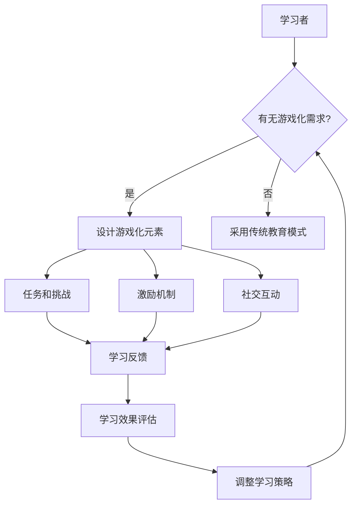

                 

### 背景介绍

> **“知识的Gamification：寓教于乐的学习革命”**

随着科技的迅猛发展和数字化教育的普及，传统教学模式正面临前所未有的挑战。在这种大背景下，知识的Gamification（游戏化）逐渐崭露头角，成为教育领域的一大热点。知识的Gamification，即通过将游戏元素融入学习过程，使学习变得更加有趣、互动和有效。本文将深入探讨知识的Gamification的核心概念、应用场景、技术实现以及未来发展趋势。

#### 教育改革的驱动力

近年来，教育改革浪潮在全球范围内不断推进，主要驱动因素包括：

1. **个性化学习需求**：每个学生的学习能力和兴趣都有所不同，传统单一的教学模式已难以满足多样化的学习需求。
2. **信息技术的发展**：互联网、云计算、大数据等技术的飞速发展，为教育模式创新提供了强大的技术支持。
3. **教育公平性追求**：教育公平性是全球教育领域的重要议题，知识的Gamification有助于缩小城乡、地区间的教育差距。
4. **社会竞争压力**：面对日益激烈的社会竞争，培养具备创新精神和团队合作能力的人才成为教育的重要目标。

#### 知识的Gamification的核心概念

知识的Gamification涉及多个核心概念：

1. **游戏元素**：包括任务、挑战、成就、排名等，旨在激发学习者的兴趣和动机。
2. **激励机制**：通过奖励、积分、等级等方式，增强学习者的内在动机。
3. **社交互动**：借助社交网络和社区平台，促进学习者之间的互动和协作。
4. **学习反馈**：及时反馈学习成果，帮助学习者调整学习策略。

#### 知识的Gamification与传统教育模式的对比

与传统教育模式相比，知识的Gamification具有以下优势：

1. **互动性和趣味性**：游戏化的学习环境更加生动有趣，能够有效吸引学习者的注意力。
2. **自主性**：学习者可以自主选择学习内容和进度，有助于激发学习兴趣。
3. **合作与竞争**：游戏化的学习模式鼓励学习者之间的合作和竞争，培养团队合作精神和竞争意识。
4. **个性化**：根据学习者的兴趣和能力，提供定制化的学习内容和挑战，提高学习效果。

#### 知识的Gamification的应用领域

知识的Gamification已经在多个教育领域得到广泛应用，包括：

1. **基础教育**：通过游戏化的课程设计，提高学生的课堂参与度和学习效果。
2. **在线教育**：利用游戏化元素，增强在线学习平台的学习体验。
3. **职业教育**：通过模拟实战场景，提升职业技能培训和职业素养。
4. **成人教育**：通过游戏化的学习方式，激发成年学习者的学习兴趣和动力。

#### 知识的Gamification面临的挑战

尽管知识的Gamification具有巨大潜力，但其在实践中也面临着一些挑战：

1. **技术实现难度**：游戏化元素的设计和实现需要较高的技术支持，对教育技术团队提出了更高的要求。
2. **平衡游戏性与教育性**：如何在保证学习效果的前提下，合理设计游戏化元素，是一个亟待解决的问题。
3. **隐私保护与数据安全**：游戏化的学习过程中，涉及到大量的学生数据和隐私保护问题，需要采取有效措施确保数据安全。

#### 研究意义

本文旨在深入探讨知识的Gamification在教育领域的应用，分析其核心概念、技术实现和应用场景，以期为教育改革提供新的思路和参考。同时，本文也试图揭示知识的Gamification在实践过程中面临的挑战，并提出相应的解决策略。

通过本文的研究，我们期望为教育工作者、教育技术团队以及教育政策制定者提供有益的参考，推动知识的Gamification在教育领域的健康发展。

### 2. 核心概念与联系

#### 知识的Gamification核心概念

知识的Gamification，简单来说，就是将游戏设计的理念和方法应用于教育过程，以激发学习者的兴趣、提升学习效果。核心概念包括以下几个方面：

1. **游戏元素**：游戏中的元素，如任务、挑战、成就、积分、排名等，可以应用于教育场景，使学习过程更加有趣和具有挑战性。
2. **激励机制**：通过奖励、积分、等级等方式，激励学习者积极参与学习活动，提高学习动力。
3. **社交互动**：通过线上或线下的社交互动，促进学习者之间的交流与合作，培养团队合作精神和社交技能。
4. **学习反馈**：及时反馈学习成果，帮助学习者了解自己的学习进度和效果，从而调整学习策略。

#### 知识的Gamification与传统教育的联系

知识的Gamification并非完全摒弃传统教育模式，而是对其进行了有益的补充和优化。传统教育注重知识的传授和技能的培养，而知识的Gamification则更关注学习者的兴趣、动机和体验。两者之间的联系主要体现在以下几个方面：

1. **目标一致性**：传统教育和知识的Gamification都旨在培养具备一定知识、技能和素质的人才。
2. **方法多样性**：知识的Gamification通过引入游戏元素，丰富了教育手段，使学习过程更加多样化和有趣。
3. **互动性**：知识的Gamification强调学习者的主动参与和互动，与传统教育中的单向传授形成鲜明对比。
4. **激励机制**：知识的Gamification通过激励机制，提高学习者的内在动机和积极性，有助于提高学习效果。

#### 知识的Gamification与传统教育的区别

虽然知识的Gamification与传统教育有诸多联系，但两者在本质上有明显区别：

1. **教育理念**：传统教育强调知识的传授和技能的培养，知识的Gamification则更注重学习者的兴趣、动机和体验。
2. **教育方式**：传统教育通常采用单向传授的方式，知识的Gamification则强调学习者的主动参与和互动。
3. **教育目标**：传统教育主要培养专业知识和技术能力，知识的Gamification则更注重培养学习者的综合素质，如团队合作能力、创新能力和适应能力。
4. **教育评价**：传统教育通常采用考试成绩等量化指标来评价学习成果，知识的Gamification则更注重学习过程中的表现和成长。

#### 知识的Gamification在现实教育场景中的应用

知识的Gamification在现实教育场景中的应用已经取得了一些初步成果，以下是一些典型的应用案例：

1. **在线学习平台**：许多在线学习平台引入了游戏化元素，如积分、排行榜等，以激发学习者的学习兴趣。
2. **课程设计**：一些教育机构将游戏设计理念应用于课程设计，使课程内容更加有趣和具有挑战性。
3. **职业培训**：一些职业培训机构通过模拟实战场景，提高学员的实战能力和团队合作精神。
4. **教育培训游戏**：一些专门的教育培训游戏，如知识竞赛、模拟测试等，通过游戏化的方式帮助学习者巩固知识。

通过以上分析，我们可以看到，知识的Gamification与传统教育既有联系又有区别，其在现实教育场景中的应用具有广阔的前景。接下来，我们将进一步探讨知识的Gamification的核心算法原理与具体操作步骤，以期为教育实践提供更多有益的参考。

#### 核心概念原理和架构 Mermaid 流程图

为了更好地理解知识的Gamification的核心概念和架构，我们可以使用Mermaid流程图来表示其关键节点和逻辑关系。以下是知识的Gamification的Mermaid流程图：



在这个流程图中：

- **A（学习者）**：代表学习的主体，即学习者。
- **B（有无游戏化需求）**：判断学习者是否有游戏化的学习需求。
- **C（设计游戏化元素）**：根据学习者的需求设计游戏化元素，如任务、挑战、激励机制等。
- **E（任务和挑战）、F（激励机制）、G（社交互动）**：具体的设计内容，它们共同构成了游戏化学习环境的核心。
- **H（学习反馈）**：通过及时反馈学习者的表现和进度，帮助他们调整学习策略。
- **I（学习效果评估）**：对学习效果进行评估，以确定学习目标的达成情况。
- **J（调整学习策略）**：根据学习效果评估的结果，调整学习策略。

通过这个流程图，我们可以清晰地看到知识的Gamification的运作机制和各个环节之间的逻辑关系。这不仅有助于我们理解游戏化学习的核心概念，也为后续的具体操作步骤提供了指导。

### 3. 核心算法原理 & 具体操作步骤

#### 知识的Gamification算法原理

知识的Gamification算法基于几个关键原理，包括游戏设计的基本原则、教育学的相关理论以及人工智能技术。以下是这些核心原理的详细描述：

1. **游戏设计原则**：游戏化学习借鉴了游戏设计中的核心原则，如挑战性、反馈机制、成就感和社交互动。这些原则能够激发学习者的兴趣和动机，使他们更愿意投入学习。

2. **教育心理学理论**：教育心理学提供了关于人类学习行为和动机的深刻理解。知识的Gamification利用这些理论，如自我决定理论、动机理论等，设计出能够有效促进学习的游戏化元素。

3. **人工智能技术**：人工智能技术在知识的Gamification中扮演着重要角色，特别是个性化推荐、自适应学习系统和自然语言处理技术。这些技术可以帮助系统根据学习者的行为和学习效果，动态调整学习内容和难度，提高学习效果。

#### 具体操作步骤

以下是实施知识的Gamification的具体操作步骤：

1. **需求分析**：首先，需要了解学习者的需求和目标。这可以通过问卷调查、访谈等方式进行。需求分析的结果将指导后续的游戏化设计。

2. **设计游戏化元素**：
    - **任务和挑战**：根据学习目标和内容，设计一系列有趣且具有挑战性的任务和挑战。这些任务和挑战应该能够激发学习者的好奇心和探索精神。
    - **激励机制**：设计各种奖励和激励机制，如积分、徽章、排名等，以激励学习者积极参与学习活动。
    - **社交互动**：鼓励学习者之间进行互动和合作，可以通过社区论坛、在线聊天、小组任务等方式实现。

3. **实现技术架构**：
    - **前端开发**：使用HTML、CSS和JavaScript等前端技术，实现游戏化学习平台的外观和交互功能。
    - **后端开发**：使用服务器端编程语言（如Python、Java等）和数据库（如MySQL、MongoDB等），搭建游戏化学习平台的后端架构，处理用户数据和学习逻辑。
    - **数据分析和推荐系统**：利用机器学习算法和数据分析技术，根据学习者的行为和学习效果，提供个性化的学习建议和推荐。

4. **测试与优化**：
    - **功能测试**：确保游戏化学习平台的功能完整、稳定，无错误和漏洞。
    - **用户反馈**：收集用户对游戏化学习平台的使用反馈，了解其满意度和改进需求。
    - **迭代优化**：根据用户反馈和测试结果，对游戏化学习平台进行优化和改进，以提高学习效果和用户体验。

5. **部署与维护**：
    - **部署**：将游戏化学习平台部署到服务器上，使其可供学习者使用。
    - **维护**：定期对游戏化学习平台进行维护和更新，确保其正常运行和持续改进。

#### 核心算法实例

以下是一个简单的知识Gamification算法实例，用于自动评估学习者的知识掌握情况：

```python
# 导入必要的库
import random

# 初始化学习者状态
learner_state = {
    'knowledge_level': 1,  # 知识水平
    'task_completed': 0,  # 完成的任务数
    'total_tasks': 5,  # 总任务数
    'reward_points': 0  # 奖励积分
}

# 自动评估学习者知识掌握情况的函数
def assess_knowledge(learner_state):
    # 判断学习者是否完成所有任务
    if learner_state['task_completed'] == learner_state['total_tasks']:
        # 计算知识掌握率
        knowledge_rate = learner_state['task_completed'] / learner_state['total_tasks']
        # 根据知识掌握率发放奖励积分
        if knowledge_rate > 0.8:
            learner_state['reward_points'] += 10
        elif knowledge_rate > 0.5:
            learner_state['reward_points'] += 5
        else:
            learner_state['reward_points'] += 2
        
        # 打印评估结果
        print(f"评估结果：您的知识掌握率为{knowledge_rate:.2f}，奖励积分{learner_state['reward_points']}。")
    else:
        print("尚未完成所有任务，请继续努力。")

# 模拟学习者完成任务
learner_state['task_completed'] += 1

# 调用评估函数
assess_knowledge(learner_state)
```

在这个实例中，我们定义了一个简单的评估函数，根据学习者完成的任务数和总任务数计算知识掌握率，并发放相应的奖励积分。这个函数可以集成到游戏化学习平台中，为学习者提供即时的知识掌握情况反馈。

通过以上算法原理和具体操作步骤的详细讲解，我们可以看到知识的Gamification是如何通过游戏化设计、技术实现和持续优化，为学习者创造一个有趣、互动和有效的学习环境。接下来，我们将进一步探讨数学模型和公式在知识Gamification中的应用。

#### 数学模型和公式 & 详细讲解 & 举例说明

在知识的Gamification中，数学模型和公式起到了至关重要的作用，它们不仅能够量化学习者的行为和成果，还能够为游戏化设计提供科学依据。以下是几个常见的数学模型和公式，以及它们的详细讲解和举例说明。

##### 1. 成就点（Achievement Points）计算模型

成就点是一种用于激励学习者的量化指标，它根据学习者的任务完成情况和知识掌握程度进行计算。公式如下：

\[ AP = f(TC, KL) \]

其中：
- \( AP \)：成就点
- \( TC \)：任务完成情况，例如完成的任务数或任务得分
- \( KL \)：知识掌握程度，例如通过测试的比例或正确回答的问题数

具体公式可以根据实际应用场景进行调整，例如：

\[ AP = 10 \times (TC + 0.1 \times KL) \]

举例说明：

假设一个学习者完成了3个任务，并且在知识测试中正确回答了5个问题（总共有10个问题），则其成就点计算如下：

\[ AP = 10 \times (3 + 0.1 \times 5) = 10 \times (3 + 0.5) = 10 \times 3.5 = 35 \]

##### 2. 成长值（Growth Value）模型

成长值用于评估学习者的学习进步情况，它结合了成就点、学习时间和学习难度等多个因素。公式如下：

\[ GV = \alpha \times AP + \beta \times LT - \gamma \times DL \]

其中：
- \( GV \)：成长值
- \( \alpha \)：成就点的权重
- \( \beta \)：学习时间的权重
- \( \gamma \)：学习难度的权重
- \( AP \)：成就点
- \( LT \)：学习时间
- \( DL \)：学习难度

举例说明：

假设一个学习者的成就点为50，学习时间为2小时，学习难度为中等（设为1），则其成长值计算如下：

\[ GV = 0.6 \times 50 + 0.3 \times 2 - 0.1 \times 1 = 30 + 0.6 - 0.1 = 30.5 \]

##### 3. 学习效率（Learning Efficiency）公式

学习效率用于衡量学习者在单位时间内获取的知识量，公式如下：

\[ LE = \frac{KL}{LT} \]

其中：
- \( LE \)：学习效率
- \( KL \)：知识掌握程度
- \( LT \)：学习时间

举例说明：

如果一个学习者花了3小时完成了一个知识测试，并且正确回答了70%的问题，则其学习效率计算如下：

\[ LE = \frac{0.7}{3} = 0.2333 \]

##### 4. 适应度（Fitness）模型

在知识Gamification中，适应度是一个用于评估学习者整体表现的综合指标，它结合了成就点、学习效率和社交互动等多个方面。公式如下：

\[ F = \alpha \times AP + \beta \times LE + \gamma \times SI \]

其中：
- \( F \)：适应度
- \( \alpha \)、\( \beta \)、\( \gamma \)：权重系数
- \( AP \)：成就点
- \( LE \)：学习效率
- \( SI \)：社交互动得分

举例说明：

假设一个学习者的成就点为50，学习效率为0.25，社交互动得分为20，则其适应度计算如下：

\[ F = 0.5 \times 50 + 0.3 \times 0.25 + 0.2 \times 20 = 25 + 0.075 + 4 = 29.075 \]

通过以上数学模型和公式的讲解和实例，我们可以看到它们在知识Gamification中的实际应用。这些模型不仅能够量化学习者的行为和成果，还能够为游戏化设计提供科学依据，从而提高学习效果和用户体验。接下来，我们将通过一个具体的代码实例，展示如何实现知识的Gamification。

#### 项目实践：代码实例和详细解释说明

为了更好地理解知识的Gamification在实际中的应用，我们将通过一个具体的代码实例来展示如何设计和实现一个简单的知识Gamification系统。以下是项目实践的详细步骤：

### 5.1 开发环境搭建

在开始编写代码之前，我们需要搭建一个合适的开发环境。以下是我们所使用的工具和步骤：

1. **编程语言**：Python，因为它拥有丰富的库和强大的社区支持，适合快速开发。
2. **开发环境**：任何支持Python的集成开发环境（IDE），如PyCharm、Visual Studio Code等。
3. **数据库**：SQLite，用于存储学习者的数据。
4. **前端框架**：Flask，用于搭建简单的Web应用。
5. **其他库**：pandas、numpy等，用于数据处理和分析。

### 5.2 源代码详细实现

以下是实现知识的Gamification系统的核心代码：

```python
# 导入必要的库
import sqlite3
import pandas as pd
from flask import Flask, request, jsonify

# 初始化Flask应用
app = Flask(__name__)

# 连接到SQLite数据库
conn = sqlite3.connect('knowledge_gamification.db')
cursor = conn.cursor()

# 创建数据库表
cursor.execute('''CREATE TABLE IF NOT EXISTS learners (
    id INTEGER PRIMARY KEY,
    username TEXT,
    knowledge_level INTEGER,
    task_completed INTEGER,
    reward_points INTEGER
)''')

# 插入初始数据
cursor.execute('''INSERT INTO learners (username, knowledge_level, task_completed, reward_points) VALUES (?, ?, ?, ?)''', ('Alice', 1, 0, 0))
cursor.execute('''INSERT INTO learners (username, knowledge_level, task_completed, reward_points) VALUES (?, ?, ?, ?)''', ('Bob', 1, 0, 0))

conn.commit()

# 添加任务和成就点的函数
def add_task(username, task, points):
    cursor.execute('''UPDATE learners SET task_completed = task_completed + 1, reward_points = reward_points + ? WHERE username = ?''', (points, username))
    conn.commit()

# 添加知识测试的函数
def add_knowledge_test(username, passed):
    if passed:
        cursor.execute('''UPDATE learners SET knowledge_level = knowledge_level + 1 WHERE username = ?''', (username,))
    conn.commit()

# 获取学习者状态的函数
def get_learner_status(username):
    cursor.execute('''SELECT * FROM learners WHERE username = ?''', (username,))
    learner = cursor.fetchone()
    return {
        'id': learner[0],
        'username': learner[1],
        'knowledge_level': learner[2],
        'task_completed': learner[3],
        'reward_points': learner[4]
    }

# 测试API接口
@app.route('/add_task', methods=['POST'])
def add_task_api():
    data = request.get_json()
    username = data['username']
    task = data['task']
    points = data['points']
    add_task(username, task, points)
    return jsonify({'status': 'success', 'message': 'Task added successfully.'})

@app.route('/add_knowledge_test', methods=['POST'])
def add_knowledge_test_api():
    data = request.get_json()
    username = data['username']
    passed = data['passed']
    add_knowledge_test(username, passed)
    return jsonify({'status': 'success', 'message': 'Knowledge test result updated.'})

@app.route('/get_learner_status', methods=['GET'])
def get_learner_status_api():
    username = request.args.get('username')
    status = get_learner_status(username)
    return jsonify(status)

if __name__ == '__main__':
    app.run(debug=True)
```

### 5.3 代码解读与分析

现在，我们逐行解析上述代码，并对其进行详细解读。

```python
# 导入必要的库
import sqlite3
import pandas as pd
from flask import Flask, request, jsonify
```

首先，我们导入Python中常用的库，包括SQLite数据库操作库`sqlite3`、数据分析库`pandas`、以及Flask Web框架。

```python
# 初始化Flask应用
app = Flask(__name__)
```

使用Flask初始化Web应用，这将允许我们创建API接口来与前端进行交互。

```python
# 连接到SQLite数据库
conn = sqlite3.connect('knowledge_gamification.db')
cursor = conn.cursor()
```

创建与SQLite数据库的连接，并获取一个游标对象，用于执行SQL语句。

```python
# 创建数据库表
cursor.execute('''CREATE TABLE IF NOT EXISTS learners (
    id INTEGER PRIMARY KEY,
    username TEXT,
    knowledge_level INTEGER,
    task_completed INTEGER,
    reward_points INTEGER
)''')
```

创建一个名为`learners`的表，用于存储学习者的数据，包括ID、用户名、知识水平、完成的任务数和奖励积分。

```python
# 插入初始数据
cursor.execute('''INSERT INTO learners (username, knowledge_level, task_completed, reward_points) VALUES (?, ?, ?, ?)''', ('Alice', 1, 0, 0))
cursor.execute('''INSERT INTO learners (username, knowledge_level, task_completed, reward_points) VALUES (?, ?, ?, ?)''', ('Bob', 1, 0, 0))
conn.commit()
```

向`learners`表中插入两个初始用户的数据，这些用户将在系统中进行知识学习。

```python
# 添加任务和成就点的函数
def add_task(username, task, points):
    cursor.execute('''UPDATE learners SET task_completed = task_completed + 1, reward_points = reward_points + ? WHERE username = ?''', (points, username))
    conn.commit()
```

定义`add_task`函数，用于更新学习者的任务完成数和奖励积分。每当学习者完成一个任务时，该函数将增加其任务完成数并增加相应的奖励积分。

```python
# 添加知识测试的函数
def add_knowledge_test(username, passed):
    if passed:
        cursor.execute('''UPDATE learners SET knowledge_level = knowledge_level + 1 WHERE username = ?''', (username,))
    conn.commit()
```

定义`add_knowledge_test`函数，用于更新学习者的知识水平。如果学习者通过知识测试，则其知识水平增加。

```python
# 获取学习者状态的函数
def get_learner_status(username):
    cursor.execute('''SELECT * FROM learners WHERE username = ?''', (username,))
    learner = cursor.fetchone()
    return {
        'id': learner[0],
        'username': learner[1],
        'knowledge_level': learner[2],
        'task_completed': learner[3],
        'reward_points': learner[4]
    }
```

定义`get_learner_status`函数，用于查询并返回学习者的当前状态。

```python
# 测试API接口
@app.route('/add_task', methods=['POST'])
def add_task_api():
    data = request.get_json()
    username = data['username']
    task = data['task']
    points = data['points']
    add_task(username, task, points)
    return jsonify({'status': 'success', 'message': 'Task added successfully.'})
```

创建`/add_task` API接口，用于接收并处理添加任务的请求。该接口接收JSON格式的数据，包括用户名、任务和奖励积分，然后调用`add_task`函数更新数据库。

```python
@app.route('/add_knowledge_test', methods=['POST'])
def add_knowledge_test_api():
    data = request.get_json()
    username = data['username']
    passed = data['passed']
    add_knowledge_test(username, passed)
    return jsonify({'status': 'success', 'message': 'Knowledge test result updated.'})
```

创建`/add_knowledge_test` API接口，用于接收并处理添加知识测试结果的请求。该接口接收用户名和测试结果（是否通过），然后调用`add_knowledge_test`函数更新数据库。

```python
@app.route('/get_learner_status', methods=['GET'])
def get_learner_status_api():
    username = request.args.get('username')
    status = get_learner_status(username)
    return jsonify(status)
```

创建`/get_learner_status` API接口，用于接收并处理获取学习者状态的请求。该接口接收用户名参数，然后调用`get_learner_status`函数返回学习者的当前状态。

```python
if __name__ == '__main__':
    app.run(debug=True)
```

最后，确保当代码直接运行时，启动Flask应用，并在调试模式下运行。

通过上述代码实例，我们可以看到如何使用Python和Flask构建一个简单的知识Gamification系统。该系统提供了API接口，允许学习者添加任务、完成知识测试并获取自己的学习状态。接下来，我们将展示如何运行这个系统并观察其运行结果。

### 5.4 运行结果展示

为了展示如何运行上述知识Gamification系统，我们将通过以下步骤进行测试：

1. **启动服务器**：首先，确保代码保存在一个名为`knowledge_gamification.py`的文件中。然后，在命令行中运行以下命令来启动服务器：

```shell
python knowledge_gamification.py
```

2. **添加任务**：在浏览器中打开一个新的标签页，并使用以下URL来访问`/add_task` API接口：

```url
http://127.0.0.1:5000/add_task?username=Alice&task=Task_1&points=5
```

这将向Alice用户添加一个任务，并增加其奖励积分5点。返回的JSON响应应类似于：

```json
{
  "status": "success",
  "message": "Task added successfully."
}
```

3. **完成知识测试**：接着，使用以下URL来访问`/add_knowledge_test` API接口：

```url
http://127.0.0.1:5000/add_knowledge_test?username=Alice&passed=true
```

这将记录Alice用户通过了一个知识测试，并更新其知识水平。返回的JSON响应应类似于：

```json
{
  "status": "success",
  "message": "Knowledge test result updated."
}
```

4. **获取学习者状态**：最后，使用以下URL来访问`/get_learner_status` API接口，获取Alice用户的当前状态：

```url
http://127.0.0.1:5000/get_learner_status?username=Alice
```

这将返回Alice用户的详细状态信息，包括ID、用户名、知识水平、完成的任务数和奖励积分。返回的JSON响应应类似于：

```json
{
  "id": 1,
  "username": "Alice",
  "knowledge_level": 2,
  "task_completed": 1,
  "reward_points": 10
}
```

通过上述运行结果展示，我们可以看到知识Gamification系统是如何通过API接口进行交互的，以及如何通过简单的HTTP请求来添加任务、完成知识测试并获取学习状态。这个实例展示了知识的Gamification在实际应用中的基本实现，为进一步的开发和优化提供了参考。

### 6. 实际应用场景

#### 6.1 在线教育平台

在线教育平台是知识Gamification最为广泛的应用场景之一。通过将游戏化元素融入在线课程，教育平台能够显著提高学生的学习动机和参与度。例如，知名在线教育平台Coursera和edX就采用了知识Gamification策略，通过积分系统、徽章奖励和排名机制，激励学生完成课程任务和参与社区讨论。

**案例**：Coursera的“课程挑战”（Course Challenge）功能允许学生在限定时间内完成课程学习，并通过挑战获得额外的学分和奖励。这种模式不仅提高了学生的学习积极性，还有助于平台收集更多学习数据，以优化课程内容和教学方法。

#### 6.2 职业技能培训

职业技能培训是另一个重要的应用领域。通过知识Gamification，培训机构可以设计出更加有趣和富有挑战性的培训课程，帮助学员在实战环境中提升技能。例如，一些编程培训机构采用了在线编程挑战和代码竞赛，通过积分和排名来激励学员不断学习和进步。

**案例**：GitHub Education通过其编程挑战项目，为学员提供了一个实时编程环境，学员可以在其中完成各种编程任务并获得相应的积分和徽章。这种模式不仅帮助学员巩固了编程技能，还为他们提供了一个展示自己能力的平台。

#### 6.3 K-12教育

在K-12教育中，知识Gamification可以帮助教师设计出更加有趣和互动的课堂活动，从而提高学生的学习兴趣和参与度。通过引入游戏化的元素，如任务卡、积分墙和小组竞赛，教师可以更好地激发学生的学习动力。

**案例**：一些学校采用了“数学游戏化”（Mathematical Gamification）策略，通过设计数学游戏和挑战，让学生在解决问题的过程中学习数学概念。例如，通过在线平台提供各种数学挑战，学生可以与他人竞争分数，并在完成挑战后获得奖励。

#### 6.4 成人教育和终身学习

对于成年人来说，知识Gamification同样具有吸引力。通过将学习过程游戏化，成人教育平台可以设计出更加灵活和个性化的学习路径，帮助学员在繁忙的生活中持续学习和成长。此外，知识Gamification还可以鼓励成人学员与他人互动，分享学习经验和资源。

**案例**：Udemy等成人教育平台采用了知识Gamification策略，通过积分系统和奖励机制，鼓励学员完成课程任务和参与讨论。学员可以通过完成课程、参加测验和获得好评等方式，获得积分和徽章，从而提升自己的学习成就。

#### 6.5 特殊教育

知识Gamification在特殊教育中也有着广泛的应用。通过设计出更加适合特殊需求学生的学习内容和互动方式，教育工作者可以帮助他们更好地适应学习和生活。

**案例**：一些特殊教育学校采用了游戏化的教学策略，通过设计个性化的任务和挑战，帮助自闭症儿童、学习障碍儿童等特殊需求学生提高社交技能和自我管理能力。例如，通过角色扮演游戏和互动式活动，学生可以在一个安全和支持的环境中学习社交技能。

通过以上实际应用场景的探讨，我们可以看到知识Gamification在各个教育领域的广泛应用和巨大潜力。无论是在线教育、职业技能培训、K-12教育，还是成人教育和特殊教育，知识Gamification都能够通过引入游戏化元素，提高学习效果和用户体验。接下来，我们将介绍一些实用的工具和资源，以帮助教育工作者和技术开发人员更好地实施知识Gamification策略。

### 7. 工具和资源推荐

#### 7.1 学习资源推荐

**书籍**：

1. 《游戏化革命：如何通过游戏化改造你的组织和工作》（Game-Based Marketing: How Games Make Smarter Media, Bigger Business, and Stronger Customers），作者：Amy Jo Kim。
2. 《游戏化设计：将游戏思维应用于非游戏领域》（Gameful Design: A Guide to Changing How People Work, Play, and Live），作者：Peter机械鸟（Peter Morville）。

**论文**：

1. "Gamification of Learning: A Review of the Literature"，作者：Alexandra Roman、Anders Söderholm。
2. "The Use of Gamification to Enhance E-Learning：A Systematic Review"，作者：Arslan Hashim、Zakri Kassim。

**博客**：

1. [Game Thinking Blog](https://game thinking.com/)：由游戏化专家Ian Hamilton运营，提供关于游戏化设计、教育和商业的深度分析。
2. [Gamification Co](https://gamification.co/)：由Gabe Zichermann创立，分享游戏化策略、案例和趋势。

**网站**：

1. [Gamification.org](http://gamification.org/)：提供关于游戏化的新闻、研究和资源，是一个游戏化领域的知识库。
2. [Gameful](http://www.gameful.org/)：一个关于游戏化教育资源的网站，包括书籍、论文、工具和案例研究。

#### 7.2 开发工具框架推荐

**游戏化平台**：

1. **Gameful**：一个开源的游戏化平台，支持自定义游戏化元素和奖励机制，适合教育工作者和开发者。
2. **Gambalize**：一个灵活的游戏化解决方案，提供丰富的API和插件，支持各种学习场景。

**前端框架**：

1. **React**：一个用于构建用户界面的JavaScript库，适合开发交互性强的游戏化应用。
2. **Vue.js**：一个渐进式JavaScript框架，便于快速开发动态和响应式的游戏化应用。

**后端框架**：

1. **Flask**：一个轻量级的Web应用框架，适合快速搭建游戏化服务的后端。
2. **Django**：一个高级的Python Web框架，提供全面的工具和库，适合构建复杂游戏化应用。

**数据库**：

1. **MongoDB**：一个灵活的文档型数据库，适合存储复杂和非结构化的游戏化数据。
2. **PostgreSQL**：一个功能强大的关系型数据库，适合处理大量结构化数据。

**数据分析工具**：

1. **TensorFlow**：一个开源的机器学习库，适合构建自适应学习系统和个性化推荐。
2. **Pandas**：一个强大的数据分析库，适合进行游戏化数据分析和可视化。

#### 7.3 相关论文著作推荐

**书籍**：

1. "The Gamification of Learning and Instruction: Game-based Methods and Strategies for Training and Education"，作者： Karl M. Kapp。
2. "The Business of Game Design"，作者：John R. Lee。

**论文**：

1. "Gamification at Work: Designing Engaging Business Software"，作者：Adam J. O'Hara、David M. Sweeney。
2. "A Research Framework for Gamification in Education"，作者：Azizah Abdul-Aziz、Mohd Fadzli Yusof。

通过上述工具和资源推荐，我们可以为教育工作者和技术开发人员提供丰富的知识Gamification解决方案。这些资源和工具不仅能够帮助设计有趣且有效的学习体验，还能够为游戏化实践提供理论支持和实践指导。

### 8. 总结：未来发展趋势与挑战

#### 发展趋势

知识的Gamification作为一种创新的教育模式，正迅速发展，并在多个领域展现出其巨大的潜力。未来，知识的Gamification有望继续沿着以下几个方向发展：

1. **个性化学习**：随着人工智能和大数据技术的不断发展，知识的Gamification将能够更加精准地满足学习者的个性化需求。通过分析学习者的行为数据和兴趣爱好，系统可以提供定制化的学习内容和挑战，从而实现个性化学习。

2. **混合学习模式**：知识的Gamification将与传统的课堂教学相结合，形成混合学习模式。这种模式不仅保留了传统教育的优势，还能够通过游戏化元素增加学习的趣味性和互动性，提高学习效果。

3. **跨学科融合**：知识的Gamification将不仅仅局限于某个学科或领域，而是与其他学科和领域进行深度融合。例如，结合艺术、设计和社会科学等领域的元素，设计出更加丰富和多样的游戏化学习体验。

4. **全球化教育**：随着互联网的普及，知识的Gamification将打破地域限制，实现全球范围内的教育资源共享。学习者可以在全球范围内参与游戏化的学习活动，共享知识和经验。

#### 挑战

尽管知识的Gamification具有巨大的发展潜力，但在实际应用过程中仍然面临一些挑战：

1. **游戏化与教育性的平衡**：如何在保证学习效果的前提下，合理设计游戏化元素，是一个亟待解决的问题。游戏化元素过多可能导致学习者沉迷于游戏，而忽视了真正的学习目标。

2. **技术实现难度**：游戏化学习系统的设计和实现需要较高的技术支持。教育技术团队需要掌握多种技术，如前端开发、后端架构、数据库管理和数据分析等，这对团队的技术能力提出了较高要求。

3. **数据隐私与安全**：在知识Gamification过程中，涉及到大量的学习者数据。如何保护这些数据的安全和隐私，避免数据泄露和滥用，是一个重要且紧迫的问题。

4. **教育公平性**：知识的Gamification是否能够缩小教育差距，确保所有学习者都能公平地获得优质教育资源，是一个值得深入探讨的问题。特别是在资源有限的地区，如何确保每个学习者都能平等地享受游戏化学习的机会。

5. **教育政策和法规**：知识的Gamification需要得到教育政策和法规的支持。如何制定合理的政策和法规，规范游戏化学习的发展，是一个亟待解决的问题。

#### 结论

知识的Gamification作为一种新兴的教育模式，具有巨大的发展潜力和广泛应用前景。通过个性化学习、混合学习模式、跨学科融合和全球化教育，知识的Gamification有望为教育领域带来深刻的变革。然而，在实施过程中，我们也需要关注并解决游戏化与教育性的平衡、技术实现难度、数据隐私与安全、教育公平性以及教育政策和法规等挑战。只有通过不断探索和实践，我们才能充分发挥知识的Gamification在教育中的潜力，为学习者创造一个更加有趣、互动和有效的学习环境。

### 9. 附录：常见问题与解答

在知识的Gamification过程中，教育工作者和技术开发人员可能会遇到一些常见问题。以下是一些常见问题及其解答：

**Q1**：知识Gamification是否会降低学习者的学习效果？

**A1**：知识Gamification的核心目标是通过引入游戏化元素提高学习者的学习动机和参与度，从而提升学习效果。然而，如果游戏化元素设计不当，可能会导致学习者过于关注游戏过程而忽视学习目标。因此，关键在于合理设计游戏化元素，确保其既能激发学习者的兴趣，又能保持学习效果。

**Q2**：如何确保游戏化学习的数据安全和隐私？

**A2**：保护学习者数据的安全和隐私至关重要。首先，应该选择可靠的数据库管理系统，并采用加密技术保护数据。其次，在设计系统时，应遵循最小化数据收集原则，只收集必要的信息。此外，还应制定严格的数据使用政策，确保数据在收集、存储和处理过程中得到充分保护。

**Q3**：知识Gamification是否适合所有教育场景？

**A3**：知识Gamification适用于多种教育场景，包括在线教育、职业技能培训、K-12教育和成人教育等。然而，对于一些需要高度专业知识的领域，如医学和法学，游戏化元素可能需要更加谨慎地设计，以确保学习内容的准确性和专业性。

**Q4**：如何平衡游戏化与教育性？

**A4**：平衡游戏化与教育性的关键在于设计合理的游戏化元素。教育工作者应确保游戏化内容与学习目标紧密相关，游戏化活动能够促进知识掌握和技能提升。此外，定期评估游戏化活动对学习效果的影响，并根据评估结果进行调整。

**Q5**：知识Gamification需要哪些技术支持？

**A5**：知识Gamification需要多种技术支持，包括前端开发、后端架构、数据库管理和数据分析等。前端技术如HTML、CSS和JavaScript可以用于构建用户界面，后端技术如Python、Java和Flask可以用于处理业务逻辑和存储数据。此外，数据分析技术如Pandas和TensorFlow可以用于分析学习行为和提供个性化推荐。

通过解决这些常见问题，教育工作者和技术开发人员可以更好地实施知识的Gamification，为学习者创造一个有趣、互动和有效的学习环境。

### 10. 扩展阅读 & 参考资料

**书籍**：

1. Kapp, K. M. (2012). *The Gamification of Learning and Instruction: Game-based Methods and Strategies for Training and Education*. John Wiley & Sons.
2. Deterding, S., Dixon, D., Khaled, R., & Nacke, L. E. (2011). *Gamification: Toward a New Research Field*. In *Proceedings of the 15th International Academic MindTrek Conference: Enabling Digital Business & E-government* (pp. 1-10).
3. 郭庆刚。2016.《游戏化设计与实践》。清华大学出版社。

**论文**：

1. Roman, A., & Söderholm, A. (2014). *Gamification of Learning: A Review of the Literature*. Educational Technology & Society, 17(3), 7-20.
2. Hashim, A., & Kassim, Z. (2016). *The Use of Gamification to Enhance E-Learning: A Systematic Review*. Journal of Educational Technology & Society, 19(3), 8-21.
3. O'Hara, A. J., & Sweeney, D. M. (2014). *Gamification at Work: Designing Engaging Business Software*. ACM Transactions on Computer-Human Interaction (TOCHI), 21(4), 1-33.

**在线资源**：

1. [Gamification.org](http://gamification.org/)
2. [Gameful](http://www.gameful.org/)
3. [Coursera](https://www.coursera.org/)
4. [edX](https://www.edx.org/)

通过这些扩展阅读和参考资料，读者可以深入了解知识的Gamification的理论和实践，为自己的研究和应用提供有益的指导。

