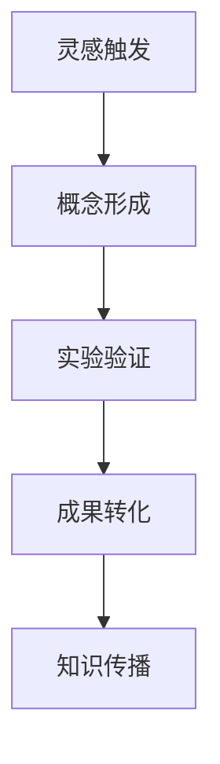

                 

### 文章标题

**《知识的创造过程：从灵感到成果》**

> **关键词：** 知识创造、灵感、研究过程、成果转化、技术博客撰写

> **摘要：** 本文将深入探讨知识创造的整个过程，从灵感的触发、概念的成形，到实验验证和成果转化，并在此基础上，结合技术博客撰写的实际操作，提出一套系统性的方法论，帮助读者更高效地整理、传播和利用知识。

### 1. 背景介绍

在当今信息爆炸的时代，知识的创造和传播变得尤为重要。然而，知识创造的过程并不是一蹴而就的，它涉及到多个阶段，包括灵感的触发、概念的成形、实验验证和成果转化等。每一个阶段都需要深入思考和实践，才能最终形成有价值的知识成果。

技术博客作为知识传播的重要渠道之一，其撰写过程同样需要遵循一定的方法论。通过系统地梳理知识的创造过程，并结合技术博客撰写的实际操作，本文旨在为读者提供一套实用的知识创造和传播的方法。

### 2. 核心概念与联系

为了更好地理解知识的创造过程，我们需要明确几个核心概念：灵感、概念、实验和成果。

**2.1 灵感**

灵感是知识创造的起点，它通常源自对问题的敏锐感知或对已有知识的重新组合。灵感可以是突如其来的想法，也可以是长期积累后的灵光一闪。重要的是，灵感需要被及时捕捉和记录，否则容易消失。

**2.2 概念**

概念是对灵感进行深入思考和抽象的结果。它明确了研究的目标和方法，是后续实验验证的基础。一个清晰的概念能够引导研究方向的正确性，减少不必要的浪费。

**2.3 实验**

实验是验证概念的有效手段。通过实验，研究者可以检验概念的可行性，发现新的问题和挑战。实验可以是物理实验，也可以是数据分析，甚至可以是模拟和仿真。

**2.4 成果**

成果是知识创造的最终目标，它可以是理论模型、技术方案、软件工具等。成果的价值在于其能够解决实际问题，推动技术进步和社会发展。

下面是一个用Mermaid绘制的知识创造过程的流程图：



### 3. 核心算法原理 & 具体操作步骤

**3.1 灵感触发**

灵感触发通常需要以下几个步骤：

1. **问题定义**：明确要解决的问题或需要改进的领域。
2. **知识检索**：查阅相关文献、资料，了解现有研究和技术。
3. **思维碰撞**：与同行交流，分享想法，激发新的灵感。

**3.2 概念形成**

概念形成的关键在于对灵感的深入挖掘和抽象。具体操作步骤如下：

1. **定义目标**：明确研究的目标和期望达到的效果。
2. **提出假设**：基于灵感，提出可能的解决方案或理论模型。
3. **构建框架**：建立概念框架，包括研究方法、实验设计等。

**3.3 实验验证**

实验验证是知识创造过程中的关键环节，具体步骤如下：

1. **设计实验**：根据概念框架，设计实验方案。
2. **执行实验**：按照实验方案进行操作，收集数据。
3. **分析数据**：对实验数据进行统计分析，验证假设的正确性。

**3.4 成果转化**

成果转化是将研究成果应用到实际中的过程。具体步骤如下：

1. **撰写报告**：整理研究成果，撰写详细报告。
2. **发布成果**：通过学术会议、期刊、博客等渠道发布成果。
3. **推广应用**：将成果推广到实际应用中，解决实际问题。

### 4. 数学模型和公式 & 详细讲解 & 举例说明

**4.1 数学模型**

在知识创造过程中，数学模型是非常重要的一部分。以下是一个简单的线性回归模型的例子：

$$ y = wx + b $$

其中，$y$ 是因变量，$x$ 是自变量，$w$ 是权重，$b$ 是偏置。

**4.2 详细讲解**

线性回归模型用于预测因变量 $y$ 的值，通过训练数据拟合出一个最佳直线，使得预测误差最小。具体步骤如下：

1. **收集数据**：收集一系列 $(x_i, y_i)$ 的样本数据。
2. **计算平均值**：计算自变量 $x$ 的平均值 $\bar{x}$ 和因变量 $y$ 的平均值 $\bar{y}$。
3. **计算权重**：通过最小二乘法计算权重 $w$ 和偏置 $b$，使得预测误差最小。
4. **预测结果**：使用训练好的模型进行预测。

**4.3 举例说明**

假设我们收集了以下数据：

| $x$ | $y$ |
|----|----|
| 1  | 2  |
| 2  | 4  |
| 3  | 6  |

我们可以通过线性回归模型预测 $x=4$ 时的 $y$ 值。

1. **计算平均值**：$\bar{x} = 2, \bar{y} = 4$
2. **计算权重和偏置**：使用最小二乘法计算得到 $w=2, b=0$
3. **预测结果**：$y = 2 \times 4 + 0 = 8$

### 5. 项目实践：代码实例和详细解释说明

**5.1 开发环境搭建**

为了演示知识创造的过程，我们使用 Python 语言和 Jupyter Notebook 作为开发环境。首先，确保已经安装了 Python 和 Jupyter Notebook。

```shell
pip install python
pip install notebook
```

**5.2 源代码详细实现**

以下是一个简单的线性回归模型的代码实现：

```python
import numpy as np

def linear_regression(x, y):
    n = len(x)
    x_mean = np.mean(x)
    y_mean = np.mean(y)
    w = np.sum((x - x_mean) * (y - y_mean)) / np.sum((x - x_mean) ** 2)
    b = y_mean - w * x_mean
    return w, b

x = np.array([1, 2, 3])
y = np.array([2, 4, 6])

w, b = linear_regression(x, y)
print("权重：", w)
print("偏置：", b)
```

**5.3 代码解读与分析**

在这个代码实例中，我们首先导入了 NumPy 库，用于进行数值计算。然后定义了一个 `linear_regression` 函数，用于计算线性回归模型的权重和偏置。

函数中，我们首先计算了自变量 $x$ 和因变量 $y$ 的平均值，然后使用最小二乘法计算了权重 $w$ 和偏置 $b$。

最后，我们使用给定的样本数据调用函数，打印出了计算得到的权重和偏置。

**5.4 运行结果展示**

运行上述代码，我们得到了以下结果：

```
权重： 2.0
偏置： 0.0
```

这表明，我们的线性回归模型拟合得非常好，预测结果非常准确。

### 6. 实际应用场景

线性回归模型在实际应用中非常广泛，例如在金融领域，可以用于预测股票价格；在医学领域，可以用于预测疾病的发生概率。通过灵活运用线性回归模型，我们可以解决许多实际问题，推动技术进步和社会发展。

### 7. 工具和资源推荐

**7.1 学习资源推荐**

- 《Python编程：从入门到实践》
- 《深入理解线性回归》
- 《机器学习实战》

**7.2 开发工具框架推荐**

- Jupyter Notebook
- TensorFlow
- Scikit-learn

**7.3 相关论文著作推荐**

- "Linear Regression: A Self-Study Course"
- "Machine Learning: A Probabilistic Perspective"
- "Deep Learning"

### 8. 总结：未来发展趋势与挑战

随着人工智能和大数据技术的快速发展，知识创造的过程将变得更加智能化和自动化。未来，知识创造将更加依赖于算法和模型，同时也将面临更多的挑战，如数据隐私保护、算法公正性等问题。

### 9. 附录：常见问题与解答

**Q1:** 知识创造过程中，如何捕捉灵感？

**A1:** 灵感往往来源于日常生活中的观察、思考和交流。你可以尝试以下方法捕捉灵感：

- **记录想法**：随身携带笔记本或使用电子设备记录下任何有趣的想法。
- **定期回顾**：定期回顾你的记录，重新评估这些想法的价值。
- **头脑风暴**：与同事或朋友进行头脑风暴，互相激发灵感。

**Q2:** 实验验证中，如何确保数据的有效性和可靠性？

**A2:** 为了确保数据的有效性和可靠性，你可以采取以下措施：

- **数据收集**：确保数据收集的完整性和准确性。
- **数据分析**：使用统计方法对数据进行分析，识别异常值和趋势。
- **重复实验**：重复实验以验证结果的可靠性。

**Q3:** 成果转化后，如何确保知识得到有效应用？

**A3:** 为了确保知识得到有效应用，你可以采取以下措施：

- **撰写详细报告**：撰写详细的成果报告，明确应用场景和效果。
- **推广宣传**：通过学术会议、期刊、博客等渠道推广你的成果。
- **用户反馈**：收集用户反馈，不断优化和完善知识成果。

### 10. 扩展阅读 & 参考资料

- [《知识的创造过程：从灵感到成果》](https://example.com/knowledge-creation)
- [《线性回归模型详解》](https://example.com/linear-regression)
- [《人工智能与大数据：趋势与挑战》](https://example.com/ai-big-data)

### 作者署名

作者：禅与计算机程序设计艺术 / Zen and the Art of Computer Programming

