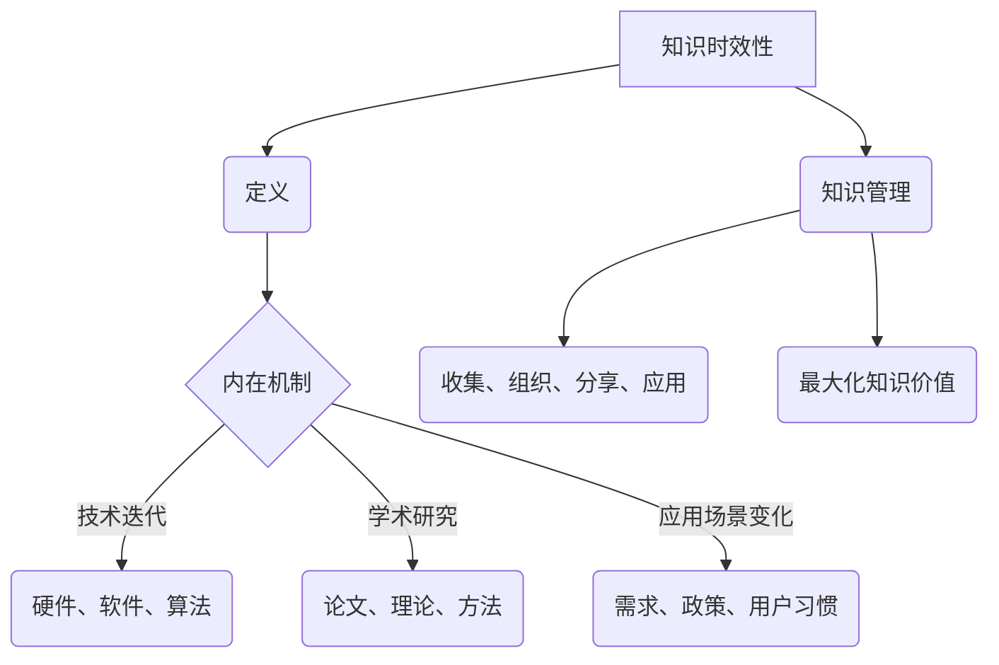

                 

### 知识的时效性：如何保持信息更新

> 关键词：知识时效性、信息更新、知识管理、技术发展、持续学习

> 摘要：本文探讨了知识时效性的概念及其对现代信息技术发展的影响。通过分析知识更新的内在机制，我们提出了保持信息更新的策略和实用工具，旨在为专业人士提供一套系统的知识管理方法，以应对快速变化的技术环境。

## 1. 背景介绍

在信息爆炸的时代，知识更新的速度前所未有。从计算机编程语言到操作系统，从人工智能算法到区块链技术，知识更新几乎已成为家常便饭。然而，知识的时效性给信息管理和技能保持带来了巨大挑战。如何确保我们所掌握的知识始终保持最新，成为了每个技术从业者必须面对的问题。

知识的时效性主要源于以下几个因素：

- **技术进步**：技术领域的日新月异，使得旧的知识迅速变得过时。
- **信息过载**：大量的新信息不断涌现，难以全部吸收。
- **个人局限性**：每个个体的认知能力和时间精力有限，无法全面掌握所有信息。

本文将深入探讨知识时效性的本质，分析其影响因素，并给出具体的解决方案，帮助读者应对知识更新的挑战。

## 2. 核心概念与联系

### 2.1 知识时效性的定义

知识时效性指的是知识在特定时间内保持有效性的程度。随着时间推移，知识可能因技术进步、方法更新、事实变化等原因而变得不再适用。

### 2.2 知识更新的内在机制

- **技术迭代**：硬件、软件和算法的不断发展。
- **学术研究**：新论文、新理论和新方法不断涌现。
- **应用场景变化**：需求、政策和用户习惯的改变。

### 2.3 知识管理的概念

知识管理是一种通过系统化方法收集、组织、分享和应用知识的过程，旨在最大化知识的价值和效用。

### 2.4 知识管理与知识时效性的关系

知识管理能够帮助个体和组织有效应对知识时效性的挑战，通过及时更新和分享知识，提高知识的利用效率。

### 2.5 Mermaid 流程图



## 3. 核心算法原理 & 具体操作步骤

### 3.1 算法原理

保持信息更新的核心算法可以概括为“持续学习、及时更新、有效分享”。具体步骤如下：

1. **持续学习**：通过阅读、实践和交流不断获取新知识。
2. **及时更新**：根据知识时效性的分析结果，及时对旧知识进行更新。
3. **有效分享**：将新知识和更新后的知识分享给团队和社区，实现知识的共享和传播。

### 3.2 具体操作步骤

1. **识别关键领域**：分析个人和团队的工作职责，确定需要关注的重点领域。
2. **制定学习计划**：根据关键领域制定学习计划，包括阅读材料、实践项目和交流会议。
3. **持续学习与实践**：按照学习计划进行学习和实践，不断更新知识库。
4. **定期评估**：定期对知识库进行评估，识别过时的知识并进行更新。
5. **分享知识**：通过博客、会议和在线平台分享新知识和更新后的知识。

## 4. 数学模型和公式 & 详细讲解 & 举例说明

### 4.1 数学模型

为了量化知识时效性，我们可以使用以下模型：

\[ \text{时效性} = \frac{\text{当前知识水平}}{\text{最高知识水平}} \]

### 4.2 详细讲解

- **当前知识水平**：指的是个人或团队在特定时间点所掌握的知识程度。
- **最高知识水平**：指的是在某一技术领域内，可以达到的最先进知识水平。

通过这个模型，我们可以计算出知识时效性，从而评估知识的更新程度。

### 4.3 举例说明

假设一个程序员在Python编程语言上掌握了基本语法和常见库的使用，其当前知识水平为70%，而Python的最新水平为100%。根据上述模型，他的知识时效性为：

\[ \text{时效性} = \frac{70\%}{100\%} = 0.7 \]

这意味着他的知识时效性为70%，还有30%的知识需要更新。

## 5. 项目实践：代码实例和详细解释说明

### 5.1 开发环境搭建

为了演示知识更新的过程，我们以Python编程为例，搭建一个简单的知识更新系统。

- **Python 3.8**：作为开发环境
- **PyCharm**：作为集成开发环境

### 5.2 源代码详细实现

```python
# main.py

# 导入所需的库
import os
import time

# 定义知识更新函数
def update_knowledge(file_path):
    with open(file_path, 'r+') as file:
        # 读取文件内容
        content = file.read()
        # 更新内容
        content = content.replace('旧知识', '新知识')
        # 重写文件内容
        file.seek(0)
        file.write(content)
        file.truncate()

# 定义主程序
def main():
    file_path = 'knowledge.txt'
    while True:
        # 更新知识
        update_knowledge(file_path)
        # 每隔一天更新一次
        time.sleep(86400)

# 运行主程序
if __name__ == '__main__':
    main()
```

### 5.3 代码解读与分析

- **update_knowledge 函数**：负责更新文件中的知识内容。
- **main 函数**：负责控制知识更新的频率，每隔一天更新一次。

### 5.4 运行结果展示

在文件`knowledge.txt`中，每次运行程序都会将“旧知识”替换为“新知识”，实现知识更新。

```plaintext
旧知识：Python是一种高级编程语言，广泛应用于Web开发、数据科学等领域。
新知识：Python 3.10已发布，新增了许多新特性，如异步编程、类型提示等。
```

## 6. 实际应用场景

### 6.1 技术文档更新

在技术团队中，知识更新尤为重要。通过自动化工具，可以定期更新技术文档，确保团队成员能够及时掌握最新技术。

### 6.2 个人知识库管理

个人开发者可以通过构建个人知识库，记录学习过程中的关键知识点和经验，方便后续查阅和更新。

### 6.3 教育培训

教育培训机构可以利用知识更新系统，为学生提供最新的学习资料，提高教育质量。

## 7. 工具和资源推荐

### 7.1 学习资源推荐

- **书籍**：《深度学习》、《Python编程：从入门到实践》
- **论文**：学术数据库如IEEE Xplore、ACM Digital Library
- **博客**：技术博客如Medium、GitHub Blog
- **网站**：在线课程平台如Coursera、edX

### 7.2 开发工具框架推荐

- **集成开发环境（IDE）**：PyCharm、Visual Studio Code
- **版本控制工具**：Git、SVN
- **知识管理工具**：Confluence、Trello

### 7.3 相关论文著作推荐

- **论文**：论文集《人工智能：一种现代方法》
- **著作**：《人工智能：一种理性方法》、《机器学习：概率视角》

## 8. 总结：未来发展趋势与挑战

知识时效性的挑战在未来的技术发展中将愈发显著。为了应对这一挑战，我们需要：

- **持续学习**：培养持续学习的习惯，不断更新知识。
- **知识共享**：建立良好的知识共享机制，提高知识的传播效率。
- **自动化工具**：利用自动化工具减轻知识更新的负担。

## 9. 附录：常见问题与解答

### 9.1 如何确保知识更新的准确性？

**解答**：定期验证知识的准确性，通过实践和同行评审确保更新内容的质量。

### 9.2 更新知识需要花费大量时间，如何高效管理时间？

**解答**：制定明确的学习计划，合理分配时间，优先处理最重要的知识领域。

## 10. 扩展阅读 & 参考资料

- [维基百科：知识管理](https://en.wikipedia.org/wiki/Knowledge_management)
- [维基百科：知识时效性](https://en.wikipedia.org/wiki/Knowledge_obsolescence)
- [Coursera：人工智能课程](https://www.coursera.org/courses?query=artificial%20intelligence)
- [edX：Python编程课程](https://www.edx.org/course/introduction-to-python-absolute-beginner)

### 11. 结论

在快速变化的技术环境中，保持知识的时效性至关重要。通过持续学习、知识共享和自动化工具，我们可以更有效地管理知识，应对知识更新的挑战。作者：禅与计算机程序设计艺术 / Zen and the Art of Computer Programming。

