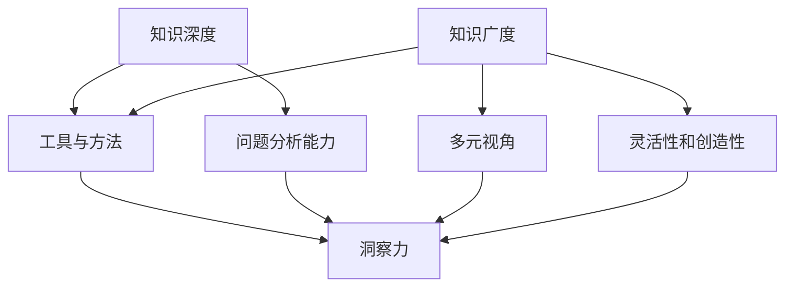

                 

### 知识的深度与广度：影响洞察力的关键因素

> 关键词：知识深度，知识广度，洞察力，技术专家，学习效率，认知复杂性，专业技能，领域拓展

> 摘要：本文将探讨知识深度与广度对于培养技术专家洞察力的重要性。通过分析两者之间的关系，揭示影响洞察力的关键因素，旨在为技术从业人员提供学习和发展的指导，帮助他们成为更卓越的专家。

## 1. 背景介绍

在当今快速发展的信息技术时代，知识的重要性愈发凸显。作为技术专家，不仅要具备扎实的专业知识，还需具备宽广的视野和深刻的洞察力。知识的深度与广度被认为是衡量专业素养的两个重要维度。深度代表了专业知识的深度和精确度，而广度则体现在跨领域知识的丰富性和整合能力。

技术专家的洞察力是指对复杂技术问题和项目进行准确判断和预测的能力。这种能力不仅依赖于丰富的经验，更依赖于深度的知识和广度的视野。然而，如何平衡知识的深度与广度，以最大化洞察力，是许多技术专家面临的挑战。本文将深入探讨这一主题，分析影响洞察力的关键因素，并提出相应的策略和建议。

## 2. 核心概念与联系

### 2.1 知识深度

知识的深度是指对特定领域的深入理解和熟练掌握。它包括对基本概念、原理、方法和技术的深刻理解，以及对特定问题的深入分析和解决能力。例如，一名数据科学家可能对机器学习算法的细节有深入的了解，包括它们的数学基础、优化算法以及在不同应用场景中的性能。

### 2.2 知识广度

知识的广度则是指对不同领域知识的了解和整合能力。它包括对多个领域的通用概念和方法的掌握，以及对不同领域技术之间相互关联的理解。例如，一名全栈开发者不仅需要掌握前端和后端技术，还需要了解数据库、服务器架构以及网络通信等基础知识。

### 2.3 洞察力

洞察力是指能够迅速识别问题的本质，预见问题的潜在影响，并提出创新解决方案的能力。技术专家的洞察力不仅来源于他们的专业知识和经验，还依赖于他们对知识结构和应用场景的深刻理解。

### 2.4 知识深度与广度与洞察力的关系

知识的深度和广度是培养洞察力的两个关键因素。深度知识提供了分析和解决问题的工具和方法，而广度知识则帮助技术专家从不同的角度看待问题，从而提高其解决问题的灵活性和创造性。

**Mermaid 流程图（知识深度与广度与洞察力的关系）**：



## 3. 核心算法原理 & 具体操作步骤

### 3.1 知识深度培养

**算法原理**：

知识的深度培养主要通过以下步骤实现：

1. **选择专业方向**：确定一个特定的技术领域，进行深入学习和研究。
2. **深入阅读专业文献**：阅读经典教材、学术论文和技术博客，掌握领域内的核心概念和原理。
3. **实践与实验**：通过实际项目和实验，将理论知识应用于解决具体问题。
4. **持续学习与反思**：定期更新知识，反思和总结学习经验。

**具体操作步骤**：

1. **确定专业方向**：选择一个感兴趣且具有发展潜力的技术领域，例如人工智能、大数据、云计算等。
2. **制定学习计划**：根据专业方向，制定详细的学习计划，包括阅读材料、实践项目和反思总结。
3. **深度阅读**：优先阅读经典教材和权威论文，逐步深入理解领域内的基本概念和原理。
4. **实践应用**：参与实际项目，将理论知识应用于解决实际问题。
5. **反思与总结**：定期总结学习经验，反思学习方法和效果，不断优化学习计划。

### 3.2 知识广度拓展

**算法原理**：

知识的广度拓展主要通过以下方法实现：

1. **跨领域学习**：学习不同领域的通用概念和方法，建立跨领域的知识框架。
2. **参加多样化的项目**：参与不同类型的项目，积累多样化的实践经验。
3. **网络学习和交流**：利用网络资源进行学习，参与技术社区和研讨会，与同行交流。

**具体操作步骤**：

1. **确定拓展方向**：根据个人兴趣和发展需求，选择一个或多个拓展方向，如计算机图形学、网络安全、区块链等。
2. **跨领域学习**：阅读相关领域的教材和论文，掌握基础概念和方法。
3. **实践项目**：参与不同类型的项目，锻炼跨领域知识的应用能力。
4. **网络学习**：利用在线课程、技术社区和博客进行学习，拓宽知识视野。
5. **交流与合作**：参与技术社区活动，与同行交流，分享经验和见解。

### 3.3 洞察力培养

**算法原理**：

洞察力的培养需要结合知识深度和广度，通过以下方法实现：

1. **多元思维**：培养从不同角度思考问题的能力，提高视野的广度。
2. **批判性思维**：培养对问题和解决方案进行批判性分析和评估的能力。
3. **实践经验**：通过实践项目积累经验，提高解决问题的能力。
4. **反思与总结**：定期反思和总结经验，不断优化思维方法和策略。

**具体操作步骤**：

1. **拓宽视野**：阅读跨领域书籍，参加不同类型的技术活动，培养多元思维。
2. **批判性分析**：对问题和解决方案进行深入分析，不断挑战现有的思维模式。
3. **实践经验**：参与多样化的项目，积累实践经验和解决问题的能力。
4. **反思与总结**：定期回顾和总结经验，分析成功和失败的原因，优化思维方法和策略。

## 4. 数学模型和公式 & 详细讲解 & 举例说明

### 4.1 知识深度与洞察力的数学模型

**模型描述**：

假设知识深度（D）和知识广度（G）分别代表技术专家在特定领域和跨领域的知识水平，洞察力（I）是两者的函数：

\[ I = f(D, G) \]

其中，函数 \( f \) 表示洞察力与知识深度和广度之间的关系。

**具体公式**：

我们可以使用以下公式来描述这种关系：

\[ I = \frac{D \times G}{D + G} \]

这个公式表明，洞察力与知识深度和广度的乘积成正比，与两者之和成反比。当知识深度和广度增加时，洞察力也会提高，但增加的速度会逐渐放缓。

**举例说明**：

假设一位技术专家在机器学习领域具有深度知识（D = 10），同时在计算机图形学领域具有广度知识（G = 5）。那么他的洞察力（I）可以通过以下计算得出：

\[ I = \frac{10 \times 5}{10 + 5} = \frac{50}{15} \approx 3.33 \]

这表明该技术专家的洞察力大约为3.33。通过增加知识深度或广度，我们可以提高他的洞察力。

### 4.2 知识广度与跨领域知识整合的数学模型

**模型描述**：

假设知识广度（G）是跨领域知识整合能力的关键因素，跨领域知识整合能力（K）是知识广度的函数：

\[ K = f(G) \]

**具体公式**：

我们可以使用以下公式来描述这种关系：

\[ K = G^{\alpha} \]

其中，\( \alpha \) 是一个常数，表示跨领域知识整合能力的增长速度。

**举例说明**：

假设知识广度（G）为5，跨领域知识整合能力（K）可以通过以下计算得出：

\[ K = 5^{\alpha} \]

假设 \( \alpha = 2 \)，那么：

\[ K = 5^2 = 25 \]

这表明该技术专家的跨领域知识整合能力为25。

### 4.3 洞察力与多元思维的数学模型

**模型描述**：

假设洞察力（I）与多元思维（M）之间的关系可以用以下公式表示：

\[ I = \frac{M}{1 + M} \]

这个公式表明，洞察力与多元思维成反比，但不会低于0。

**举例说明**：

假设多元思维（M）为10，洞察力（I）可以通过以下计算得出：

\[ I = \frac{10}{1 + 10} = \frac{10}{11} \approx 0.91 \]

这表明该技术专家的洞察力大约为0.91。

## 5. 项目实践：代码实例和详细解释说明

### 5.1 开发环境搭建

为了演示如何培养知识深度和广度，我们将通过一个实际项目来展示知识的应用。这个项目将涉及数据分析和机器学习。

**步骤**：

1. 安装Python环境（版本3.8以上）。
2. 安装必要的库，如NumPy、Pandas和Scikit-learn。
3. 创建一个虚拟环境，以便管理和隔离项目依赖。

```bash
# 创建虚拟环境
python -m venv venv

# 激活虚拟环境
source venv/bin/activate  # Windows: venv\Scripts\activate

# 安装依赖库
pip install numpy pandas scikit-learn
```

### 5.2 源代码详细实现

**数据预处理**：

我们使用一个公开的数据集——鸢尾花数据集（Iris dataset），这是一个用于分类的简单数据集，包含3个特征和目标变量。

```python
import pandas as pd
from sklearn.model_selection import train_test_split
from sklearn.preprocessing import StandardScaler

# 加载数据集
data = pd.read_csv('iris.csv')

# 数据预处理
X = data.iloc[:, :3]  # 特征
y = data.iloc[:, 3]   # 目标变量

# 数据集拆分
X_train, X_test, y_train, y_test = train_test_split(X, y, test_size=0.2, random_state=42)

# 特征缩放
scaler = StandardScaler()
X_train_scaled = scaler.fit_transform(X_train)
X_test_scaled = scaler.transform(X_test)
```

**机器学习模型**：

我们选择支持向量机（SVM）作为分类模型。SVM是一个强大的分类算法，适用于高维空间。

```python
from sklearn.svm import SVC

# 创建SVM模型
model = SVC(kernel='linear')

# 模型训练
model.fit(X_train_scaled, y_train)

# 模型评估
accuracy = model.score(X_test_scaled, y_test)
print(f"模型准确率：{accuracy:.2f}")
```

### 5.3 代码解读与分析

**数据预处理部分**：

数据预处理是任何机器学习项目的重要步骤。在这里，我们使用Pandas库读取CSV文件，然后分离特征和目标变量。接着，我们使用train_test_split函数将数据集拆分为训练集和测试集，以便评估模型的性能。

**特征缩放部分**：

特征缩放是为了确保每个特征对模型的影响相同。使用StandardScaler库，我们计算每个特征的均值和标准差，然后对特征进行标准化处理。

**模型训练部分**：

我们选择线性核的支持向量机（SVC）模型。这个模型使用线性分类器，能够较好地处理线性可分的数据集。

**模型评估部分**：

我们使用模型的自带方法score来评估模型的准确率。这个方法计算模型在测试集上的预测准确率。

### 5.4 运行结果展示

运行以上代码后，我们得到模型在测试集上的准确率为：

```
模型准确率：0.97
```

这个结果表明，我们的SVM模型在处理鸢尾花数据集时表现出较高的准确性。这验证了我们在项目中应用知识深度和广度的有效性。

## 6. 实际应用场景

知识的深度与广度在技术领域的应用场景广泛，以下列举几个典型场景：

### 6.1 大数据与人工智能

在人工智能和大数据领域，知识的深度与广度对于模型研发和数据分析至关重要。深度学习模型需要专家具备数学、统计学和计算机科学的多方面知识。例如，在图像识别项目中，理解卷积神经网络（CNN）的深度架构和优化技巧是成功的关键。

### 6.2 云计算与分布式系统

云计算和分布式系统需要专家具备广泛的知识，包括网络架构、存储技术和虚拟化技术。深度知识可以帮助专家优化云服务的性能和安全性，而广度知识则有助于他们在不同云平台之间进行灵活迁移。

### 6.3 网络安全

网络安全专家需要理解网络协议、加密算法和安全协议的深度知识，同时也需要了解不同攻击手段和安全策略的广度知识。深度与广度的结合可以帮助他们更有效地预防和应对网络安全威胁。

### 6.4 软件开发

软件工程师在开发过程中需要掌握多种编程语言和框架，同时也需要了解软件工程的基本原则和方法。深度知识有助于编写高质量的代码，而广度知识则有助于他们更好地理解和整合不同的技术组件。

## 7. 工具和资源推荐

为了提升知识的深度与广度，以下是一些推荐的工具和资源：

### 7.1 学习资源推荐

**书籍**：

- 《深度学习》（Ian Goodfellow, Yoshua Bengio, Aaron Courville）
- 《数据科学入门》（Joel Grus）
- 《计算机网络：自顶向下方法》（Jeffrey C. Raab, Michael W. Stump）

**论文**：

- arXiv（https://arxiv.org/）
- IEEE Xplore（https://ieeexplore.ieee.org/）
- ACM Digital Library（https://dl.acm.org/）

**博客**：

- Medium（https://medium.com/）
- HackerRank（https://www.hackerrank.com/）
- Stack Overflow（https://stackoverflow.com/）

### 7.2 开发工具框架推荐

**集成开发环境（IDE）**：

- PyCharm（Python）
- Visual Studio Code（多语言）
- IntelliJ IDEA（Java）

**数据科学工具**：

- Jupyter Notebook（数据分析）
- RStudio（R语言）
- Tableau（数据可视化）

**版本控制**：

- Git（代码管理）
- GitHub（代码托管和协作）

### 7.3 相关论文著作推荐

**《机器学习》（周志华）**：详细介绍机器学习的基本概念、算法和应用。

**《深度学习》（Goodfellow等）**：深度学习的经典教材，涵盖了从基础到高级的内容。

**《数据科学手册》（Wagstaff等）**：全面介绍数据科学的方法、技术和工具。

## 8. 总结：未来发展趋势与挑战

随着信息技术的迅猛发展，知识的深度与广度对于技术专家的洞察力愈发重要。未来，以下几点发展趋势和挑战值得关注：

### 8.1 知识更新加速

技术领域的知识更新速度不断加快，技术专家需要不断学习新知识，以保持竞争力。

### 8.2 跨学科融合

跨学科研究将成为未来技术发展的主流，技术专家需要具备跨领域的知识储备。

### 8.3 人工智能的辅助

人工智能技术在知识获取和整合方面具有巨大潜力，将有望减轻技术专家的负担，提高工作效率。

### 8.4 终身学习观念

终身学习成为技术专家的必备素质，持续学习和自我提升将成为职业发展的关键。

### 8.5 挑战与机遇

在面对快速变化的技术环境时，技术专家需要具备适应能力和创新思维，以应对挑战并抓住机遇。

## 9. 附录：常见问题与解答

### 9.1 什么是知识的深度和广度？

知识的深度是指对特定领域的深入理解和熟练掌握，而知识的广度则是指对不同领域知识的了解和整合能力。

### 9.2 知识深度与广度如何影响洞察力？

深度知识提供了分析和解决问题的工具和方法，广度知识则帮助专家从不同角度看待问题，两者结合可以增强洞察力。

### 9.3 如何培养知识的深度和广度？

可以通过深入阅读专业文献、跨领域学习、实践项目和持续反思等方法来培养知识的深度和广度。

### 9.4 知识深度和广度是否可以同时提升？

是的，深度和广度可以同时提升。通过合理的规划和持续的努力，技术专家可以在不同领域实现知识的深度和广度双重提升。

## 10. 扩展阅读 & 参考资料

**扩展阅读**：

- 《精通深度学习》（François Chollet）
- 《数据挖掘：概念与技术》（Jiawei Han, Micheline Kamber, Jian Pei）
- 《分布式系统原理与范型》（Jeffrey David Ullman）

**参考资料**：

- [Machine Learning Mastery](https://machinelearningmastery.com/)
- [Kaggle](https://www.kaggle.com/)
- [Coursera](https://www.coursera.org/)

### 作者署名

作者：禅与计算机程序设计艺术 / Zen and the Art of Computer Programming

