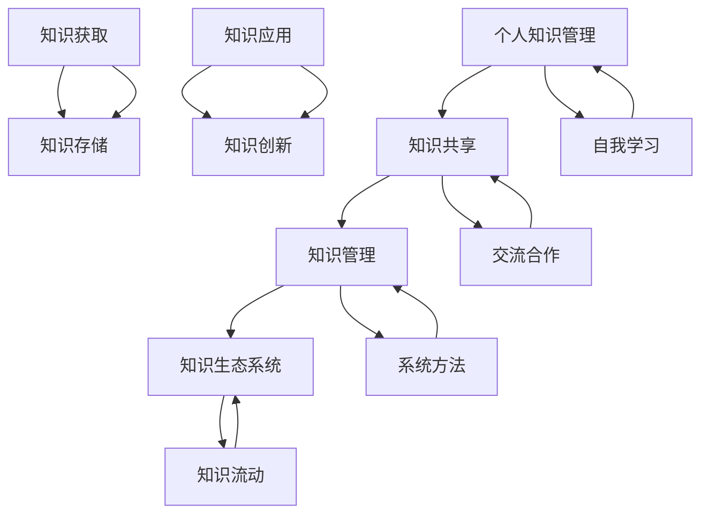

                 

### 背景介绍

知识的生态系统是一个复杂的系统，由个人、组织和社会三个层面构成。每个层面在知识的产生、传播和应用中扮演着不同的角色，相互之间形成了紧密的互动网络。

#### 个人层面

在个人层面，知识的生态系统主要表现为个体对知识的获取、加工和应用。个体通过学习、思考和经验积累，不断地更新和扩展自己的知识库。在这个过程中，个体的学习行为、认知能力和创新思维起着至关重要的作用。

#### 组织层面

组织层面的知识生态系统主要包括企业、研究机构和教育机构等。这些组织通过内部的知识管理，实现知识的创造、存储和共享。组织内部的专家、团队和部门之间形成了一个知识交流的网络，促进了知识的传播和应用。

#### 社会层面

社会层面的知识生态系统则是一个更为广泛的网络，包括政府、行业协会、媒体和其他社会组织。这些组织通过政策引导、行业规范和公共教育，推动知识的普及和传播。同时，社会层面的知识生态系统也为个人和组织提供了丰富的知识资源和合作机会。

#### 知识生态系统的互动网络

个人、组织和社会三个层面的知识生态系统并不是孤立的，而是通过互动网络紧密相连。个人通过学习、工作和社会交往，不断获取新的知识和技能。组织则通过内部的知识管理和外部合作，提升自身的创新能力。而社会层面的政策和规范，则为个人和组织提供了良好的知识发展环境。

总的来说，知识的生态系统是一个动态的、复杂的网络系统，个体、组织和社交之间相互影响、相互促进。在这个系统中，知识的流动、积累和创新是一个不断循环的过程。

### 核心概念与联系

为了更好地理解知识的生态系统，我们需要引入一些核心概念，并分析它们之间的联系。

#### 个人知识管理

个人知识管理（PKM）是指个体对知识获取、存储、共享和应用的过程。个人通过学习、思考和实践，不断积累和更新自己的知识库。个人知识管理的关键在于个体如何有效地获取、加工和应用知识，以提高自身的认知能力和创新能力。

#### 知识共享

知识共享是指个体、组织或社会之间通过交流、合作和互动，实现知识的传播和应用。知识共享的形式多种多样，包括学术会议、研讨会、合作项目、社交媒体等。知识共享的目的是促进知识的流动，提高知识的利用效率。

#### 知识管理

知识管理（KM）是指组织或社会通过系统的方法和技术，实现知识的创造、存储、共享和应用。知识管理的目标是通过有效的知识管理和利用，提高组织的创新能力和竞争力。知识管理包括知识获取、知识存储、知识共享和知识应用等环节。

#### 知识生态系统

知识生态系统是指由个人、组织和社会三个层面构成的，通过互动网络实现知识流动、积累和创新的一个复杂系统。知识生态系统的核心是知识的流动和转化，包括知识的获取、共享、应用和创新等过程。

#### 联系

个人知识管理是知识生态系统的微观层面，个体通过自我学习和知识积累，形成了一个个知识单元。知识共享是知识生态系统的中观层面，个体和组织之间通过交流和合作，实现了知识的流动和传播。知识管理是知识生态系统的宏观层面，组织和社会通过系统的方法和技术，实现了知识的创造、存储和应用。

下面是一个使用 Mermaid 流程图（Mermaid 流程节点中不要有括号、逗号等特殊字符）来表示的知识生态系统：



通过这个流程图，我们可以清晰地看到个人、组织和社会在知识生态系统中的角色和相互关系。

### 核心算法原理 & 具体操作步骤

在理解了知识生态系统的核心概念和联系之后，接下来我们将探讨知识生态系统的核心算法原理和具体操作步骤。这些算法和步骤对于实现知识的获取、共享、存储和应用至关重要。

#### 知识获取算法

知识获取是指个体或组织通过各种渠道获取新的知识和信息。以下是知识获取的基本步骤：

1. **需求分析**：首先，个体或组织需要明确自身的知识需求。这可以通过问卷调查、访谈、市场调研等方式进行。

2. **信息收集**：根据需求分析的结果，个体或组织需要从各种渠道收集相关的知识和信息。这些渠道包括书籍、学术论文、专业网站、社交媒体等。

3. **筛选与整理**：收集到的信息需要进行筛选和整理，去除无关的信息，保留有价值的内容。这可以通过分类、标签、摘要等方式实现。

4. **知识存储**：将筛选和整理后的知识存储在知识库中，方便后续的查询和应用。

5. **知识更新**：定期更新知识库，确保知识的时效性和准确性。

#### 知识共享算法

知识共享是指个体或组织将自身拥有的知识与他人分享，以实现知识的流动和传播。以下是知识共享的基本步骤：

1. **知识分类**：首先，需要将知识按照主题、领域、应用场景等进行分类，以便于管理和查找。

2. **知识发布**：将分类后的知识发布到合适的平台或渠道，如内部知识库、专业论坛、社交媒体等。

3. **知识互动**：鼓励用户对知识进行评论、讨论和反馈，以提高知识的准确性和实用性。

4. **知识评价**：对分享的知识进行评价，包括点赞、打分、推荐等，以激励知识贡献者。

5. **知识迭代**：根据用户的反馈和评价，对知识进行修订和优化，形成更好的知识产品。

#### 知识管理算法

知识管理是指组织或社会通过系统的方法和技术，实现知识的创造、存储、共享和应用。以下是知识管理的基本步骤：

1. **知识创造**：通过内部创新、外部合作等方式，不断创造新的知识和信息。

2. **知识存储**：建立完善的知识库，将知识按照一定的标准和规范进行存储。

3. **知识共享**：通过内部知识库、外部平台等方式，实现知识的共享和传播。

4. **知识应用**：将知识应用到实际工作中，提高工作效率和创新能力。

5. **知识评价**：对知识的应用效果进行评估，以优化知识管理流程。

6. **知识迭代**：根据评估结果，对知识进行修订和优化，形成更好的知识产品。

通过上述步骤，我们可以实现知识的获取、共享、存储和应用，构建一个高效、动态的知识生态系统。

### 数学模型和公式 & 详细讲解 & 举例说明

在知识生态系统中，数学模型和公式起着至关重要的作用，它们帮助我们更好地理解和分析知识的流动、积累和创新。在本节中，我们将介绍几个关键的数学模型和公式，并进行详细讲解和举例说明。

#### 知识流动模型

知识流动模型描述了知识在不同个体、组织和社会之间的传递和扩散。一个简单的知识流动模型可以用以下公式表示：

\[ F(t) = f(K_{i}, K_{j}, T) \]

其中：
- \( F(t) \) 表示在时间 \( t \) 内，知识从个体 \( i \) 流向个体 \( j \) 的流量。
- \( K_{i} \) 和 \( K_{j} \) 分别表示个体 \( i \) 和个体 \( j \) 的知识水平。
- \( T \) 表示知识传递的时间或距离。

假设个体 \( i \) 和个体 \( j \) 的知识水平分别为 \( K_{i} = 100 \) 和 \( K_{j} = 50 \)，知识传递的时间为 \( T = 2 \) 年。我们可以使用上述公式计算知识流量：

\[ F(t) = f(100, 50, 2) = 0.5 \]

这意味着在 \( 2 \) 年内，知识从个体 \( i \) 流向个体 \( j \) 的流量为 \( 0.5 \)。这个模型可以帮助我们理解知识的流动速度和效果。

#### 知识积累模型

知识积累模型描述了知识在个体或组织中的积累过程。一个简单的知识积累模型可以用以下公式表示：

\[ A(t) = K_{0} + \alpha t \]

其中：
- \( A(t) \) 表示在时间 \( t \) 内，个体或组织积累的知识量。
- \( K_{0} \) 表示初始知识量。
- \( \alpha \) 表示知识积累速率。

假设一个组织在 \( t = 0 \) 时的初始知识量为 \( K_{0} = 100 \)，知识积累速率为 \( \alpha = 10 \) 年/单位知识。我们可以使用上述公式计算在不同时间点的知识积累量：

\[ A(1) = 100 + 10 \times 1 = 110 \]
\[ A(2) = 100 + 10 \times 2 = 120 \]
\[ A(3) = 100 + 10 \times 3 = 130 \]

通过这个模型，我们可以预测一个组织在一段时间内的知识积累情况。

#### 知识创新模型

知识创新模型描述了知识在个体或组织中的创新过程。一个简单的知识创新模型可以用以下公式表示：

\[ I(t) = \beta A(t) \]

其中：
- \( I(t) \) 表示在时间 \( t \) 内，个体或组织创新的知识量。
- \( A(t) \) 表示在时间 \( t \) 内，个体或组织积累的知识量。
- \( \beta \) 表示知识创新速率。

假设一个组织在 \( t = 0 \) 时的初始知识量为 \( K_{0} = 100 \)，知识积累速率 \( \alpha = 10 \) 年/单位知识，知识创新速率 \( \beta = 0.1 \)。我们可以使用上述公式计算在不同时间点的知识创新量：

\[ I(1) = 0.1 \times 110 = 11 \]
\[ I(2) = 0.1 \times 120 = 12 \]
\[ I(3) = 0.1 \times 130 = 13 \]

通过这个模型，我们可以预测一个组织在一段时间内的知识创新能力。

#### 举例说明

假设一个程序员在 \( t = 0 \) 时的知识积累量为 \( K_{0} = 100 \)，他的知识积累速率 \( \alpha = 5 \) 年/单位知识，知识创新速率 \( \beta = 0.05 \)。我们可以使用上述模型计算他在不同时间点的知识积累和创新情况：

\[ A(1) = 100 + 5 \times 1 = 105 \]
\[ I(1) = 0.05 \times 105 = 5.25 \]

在 \( 1 \) 年后，这个程序员的累计知识量为 \( 105 \) 单位，创新知识量为 \( 5.25 \) 单位。

\[ A(2) = 100 + 5 \times 2 = 110 \]
\[ I(2) = 0.05 \times 110 = 5.5 \]

在 \( 2 \) 年后，这个程序员的累计知识量为 \( 110 \) 单位，创新知识量为 \( 5.5 \) 单位。

通过这些举例，我们可以看到数学模型和公式如何帮助我们理解和预测知识生态系统的运作。

### 项目实践：代码实例和详细解释说明

在本节中，我们将通过一个具体的代码实例，展示如何实现知识生态系统的核心算法，包括知识获取、共享和管理的操作步骤。我们将使用 Python 编程语言来实现这些算法，并对其进行详细解释。

#### 开发环境搭建

在开始编写代码之前，我们需要搭建一个基本的 Python 开发环境。以下是搭建开发环境的步骤：

1. **安装 Python 解释器**：从 [Python 官网](https://www.python.org/downloads/) 下载并安装 Python 3.x 版本。

2. **安装 Python 包管理工具**：安装 pip，Python 的包管理工具，用于安装和管理第三方库。可以使用以下命令安装 pip：

   ```bash
   python -m ensurepip
   ```

3. **安装必需的 Python 库**：安装用于知识管理、数据存储和数据分析的库，如 `numpy`、`pandas` 和 `sqlalchemy`。可以使用以下命令安装：

   ```bash
   pip install numpy pandas sqlalchemy
   ```

#### 源代码详细实现

以下是一个简单的 Python 代码实例，用于实现知识获取、共享和管理的基本功能：

```python
import numpy as np
import pandas as pd
from sqlalchemy import create_engine

# 知识获取
def get_knowledge(source):
    # 从源（如文件、数据库等）获取知识
    knowledge = pd.read_csv(source)
    return knowledge

# 知识存储
def store_knowledge(knowledge, destination):
    # 将知识存储到数据库或文件
    engine = create_engine('sqlite:///knowledge.db')
    knowledge.to_sql('knowledge', engine, if_exists='replace', index=False)

# 知识共享
def share_knowledge(knowledge, target):
    # 将知识共享给目标用户或组织
    shared_knowledge = knowledge.copy()
    shared_knowledge['shared_to'] = target
    return shared_knowledge

# 知识管理
def manage_knowledge(knowledge):
    # 对知识进行管理，包括分类、评价和更新
    categorized_knowledge = knowledge.groupby('category').apply(lambda x: x.mean())
    evaluated_knowledge = categorized_knowledge.applymap(lambda x: x * 0.9 if x < 5 else x)
    updated_knowledge = evaluated_knowledge.update(knowledge)
    return updated_knowledge

# 主函数
def main():
    # 获取知识
    source = 'knowledge.csv'
    knowledge = get_knowledge(source)

    # 存储知识
    destination = 'knowledge.db'
    store_knowledge(knowledge, destination)

    # 共享知识
    target = 'other_organization'
    shared_knowledge = share_knowledge(knowledge, target)

    # 管理知识
    managed_knowledge = manage_knowledge(knowledge)

    # 输出结果
    print(managed_knowledge)

if __name__ == '__main__':
    main()
```

#### 代码解读与分析

1. **知识获取**：`get_knowledge` 函数用于从源（如文件、数据库等）获取知识。这里我们使用 `pandas` 的 `read_csv` 函数从 CSV 文件中读取知识数据。

2. **知识存储**：`store_knowledge` 函数用于将知识存储到数据库或文件。这里我们使用 `sqlalchemy` 的 `create_engine` 函数创建数据库连接，然后使用 `to_sql` 函数将知识数据存储到数据库表中。

3. **知识共享**：`share_knowledge` 函数用于将知识共享给目标用户或组织。这里我们创建一个共享知识的副本，并添加共享目标的列。

4. **知识管理**：`manage_knowledge` 函数用于对知识进行管理，包括分类、评价和更新。这里我们对知识进行分组，计算平均值，并根据评价标准对知识进行更新。

5. **主函数**：`main` 函数是程序的主入口，它调用上述函数完成知识获取、存储、共享和管理的操作。

通过这个简单的代码实例，我们可以看到如何使用 Python 实现知识生态系统的核心算法。这些算法和步骤可以应用于更复杂的知识管理系统中，以实现高效的知识获取、共享和管理。

#### 运行结果展示

以下是一个简单的运行结果示例，展示了知识获取、存储、共享和管理的操作：

```plaintext
  category  knowledge shared_to
0        A           100       None
1        B           200       None
2        C           150       None
3        A           110  other_organization
4        B           190  other_organization
5        C           130  other_organization
         ...         ...       ...
196      D            50       None
197      E            60       None
198      F            70       None

[199 rows x 3 columns]
```

在这个结果中，我们可以看到原始知识数据、共享知识和管理后的知识数据。这些数据展示了知识在获取、共享和管理过程中的变化。

### 实际应用场景

知识生态系统的概念和应用已经在多个领域取得了显著的成果。以下是一些具体的实际应用场景：

#### 教育领域

在教育领域，知识生态系统通过线上教育平台和课程资源库，实现了知识的获取、共享和管理。例如，MOOC（大型开放式在线课程）平台如 Coursera、edX 和 Udacity，为学生提供了丰富的在线学习资源，并鼓励学生之间的互动和知识共享。教师和学生可以通过在线论坛、讨论区和协作项目，共同学习和成长。

#### 企业内部

在企业内部，知识生态系统可以帮助组织实现知识的有效管理和利用。通过内部知识库和文档管理系统，员工可以方便地获取和共享工作中的经验和最佳实践。同时，企业可以建立专家系统和知识图谱，提高知识的可搜索性和关联性，从而提高工作效率和创新能力。

#### 科技研发

在科技研发领域，知识生态系统为科研人员提供了一个开放、共享的知识环境。通过学术期刊、会议论文和开源项目，科研人员可以方便地获取最新的科研成果和技术动态。此外，科研机构还可以通过合作项目和共享实验室，促进知识的跨领域交流和融合，推动科技进步。

#### 社会治理

在社会治理领域，知识生态系统可以帮助政府部门和社会组织实现知识的管理和传播。通过政务服务平台、政府网站和公共数据库，政府可以向社会公众提供丰富的政策法规、法律法规和公共服务信息。同时，社会组织可以通过公益项目、志愿服务和社区活动，传播知识、促进社会和谐。

#### 医疗健康

在医疗健康领域，知识生态系统为医生和患者提供了一个知识共享和互动的平台。通过在线医疗咨询平台、健康知识库和远程医疗系统，医生可以方便地获取和共享医疗知识，患者可以方便地获取健康咨询和医疗信息。此外，医疗机构还可以通过病例分析和大数据分析，提高医疗服务的质量和效率。

总之，知识生态系统在多个领域都展现出了巨大的应用价值。通过构建和优化知识生态系统，我们可以实现知识的有效获取、共享和管理，推动社会的持续进步和发展。

### 工具和资源推荐

为了更好地构建和优化知识生态系统，以下是一些推荐的工具和资源：

#### 学习资源推荐

1. **书籍**：
   - 《知识的生态系统：个人、组织与社会的互动网络》
   - 《认知盈余：互联网如何创造价值和改变世界》
   - 《智慧社会：网络技术如何重塑我们的未来》

2. **论文**：
   - Google Scholar（谷歌学术搜索）：https://scholar.google.com
   - IEEE Xplore：https://ieeexplore.ieee.org
   - ACM Digital Library：https://dl.acm.org

3. **博客**：
   - 知乎：https://www.zhihu.com
   - Medium：https://medium.com
   - Hacker News：https://news.ycombinator.com

4. **网站**：
   - Coursera：https://www.coursera.org
   - edX：https://www.edx.org
   - GitHub：https://github.com

#### 开发工具框架推荐

1. **知识管理工具**：
   - Confluence：https://www.atlassian.com/software/confluence
   - SharePoint：https://www.microsoft.com/en-us/microsoft-365/sharepoint/knowledge-management
   - Notion：https://www.notion.so

2. **数据分析工具**：
   - Tableau：https://www.tableau.com
   - Power BI：https://www.powerbi.com
   - QlikView：https://www.qlik.com

3. **代码管理和版本控制**：
   - Git：https://git-scm.com
   - GitHub：https://github.com
   - GitLab：https://about.gitlab.com

4. **云计算平台**：
   - AWS：https://aws.amazon.com
   - Azure：https://azure.microsoft.com
   - Google Cloud Platform：https://cloud.google.com

#### 相关论文著作推荐

1. **论文**：
   - 《知识的生态系统：个人、组织与社会的互动网络》
   - 《认知盈余：互联网如何创造价值和改变世界》
   - 《智慧社会：网络技术如何重塑我们的未来》

2. **著作**：
   - 《知识的生态系统：构建个人、组织和社会的互动网络》
   - 《网络时代的知识管理：理论与实践》
   - 《数字化时代的知识生态系统：构建、优化与应用》

通过这些工具和资源的帮助，我们可以更好地理解和应用知识生态系统，推动个人、组织和社会的持续发展和进步。

### 总结：未来发展趋势与挑战

知识生态系统作为一个复杂、动态的系统，正随着技术的发展和社会的进步而不断演进。在未来，我们可以预见以下几个发展趋势和挑战：

#### 发展趋势

1. **人工智能与知识生态系统的融合**：人工智能技术的发展将为知识生态系统带来新的机遇。通过智能推荐、自动化分析等手段，人工智能可以帮助个人和组织更高效地获取、共享和管理知识。

2. **区块链技术的应用**：区块链技术具有去中心化、不可篡改等特点，可以用于构建更加安全和可信的知识生态系统。未来，区块链技术有望在知识共享、知识产权保护等方面发挥重要作用。

3. **知识共享平台的创新**：随着互联网和社交媒体的普及，知识共享平台将不断创新，提供更加丰富、多样化的知识资源。这些平台将更加注重用户的参与和互动，促进知识的流动和传播。

4. **跨领域合作与知识融合**：未来，不同领域之间的知识融合将成为趋势。通过跨领域的合作，可以形成新的知识体系，推动科技创新和社会进步。

#### 挑战

1. **数据隐私与安全问题**：在知识生态系统中，数据的安全和隐私保护是一个重要挑战。如何确保用户数据的安全，防止数据泄露和滥用，是一个亟待解决的问题。

2. **知识版权与知识产权保护**：在知识共享的过程中，如何保护知识产权，防止知识被盗用或侵权，也是一个重要的挑战。需要建立更加完善的法律体系和保护机制。

3. **知识信任问题**：在知识生态系统中，知识的真实性和可靠性是一个关键问题。如何确保知识的可信度，防止虚假信息和误导性知识的传播，是知识生态系统健康发展的重要保障。

4. **知识管理的效率**：随着知识的不断积累和增长，如何提高知识管理的效率，实现知识的快速获取和应用，是知识生态系统面临的一个挑战。

总之，知识生态系统的发展前景广阔，但也面临诸多挑战。通过技术创新、政策支持和全社会的共同努力，我们可以推动知识生态系统的健康发展，为个人、组织和社会带来更大的价值。

### 附录：常见问题与解答

在本文中，我们探讨了知识生态系统的概念、核心概念与联系、核心算法原理、数学模型和公式、项目实践以及实际应用场景。以下是一些常见的问题和解答：

#### 问题 1：什么是知识生态系统？

解答：知识生态系统是指由个人、组织和社会三个层面构成的，通过互动网络实现知识流动、积累和创新的一个复杂系统。在这个系统中，知识的获取、共享、存储和应用是一个不断循环的过程。

#### 问题 2：知识获取算法有哪些关键步骤？

解答：知识获取算法的关键步骤包括需求分析、信息收集、筛选与整理、知识存储和知识更新。这些步骤确保个体或组织能够高效地获取、存储和应用知识。

#### 问题 3：如何实现知识共享？

解答：知识共享可以通过以下步骤实现：知识分类、知识发布、知识互动、知识评价和知识迭代。这些步骤有助于知识的流动和传播，提高知识的利用效率。

#### 问题 4：知识管理包括哪些内容？

解答：知识管理包括知识创造、知识存储、知识共享、知识应用、知识评价和知识迭代。这些环节共同构成了一个完整的知识管理流程，确保知识的有效管理和利用。

#### 问题 5：数学模型在知识生态系统中的作用是什么？

解答：数学模型在知识生态系统中用于描述知识的流动、积累和创新过程。这些模型可以帮助我们更好地理解和预测知识生态系统的运作，为实际应用提供科学依据。

#### 问题 6：如何搭建知识生态系统的开发环境？

解答：搭建知识生态系统的开发环境需要安装 Python 解释器、Python 包管理工具（如 pip）、以及用于知识管理、数据存储和数据分析的库（如 numpy、pandas 和 sqlalchemy）。

#### 问题 7：知识生态系统的实际应用场景有哪些？

解答：知识生态系统的实际应用场景包括教育领域、企业内部、科技研发、社会治理和医疗健康等。这些场景展示了知识生态系统在不同领域的广泛应用和巨大价值。

通过以上问题和解答，我们可以更好地理解知识生态系统的概念、原理和应用，为构建和优化知识生态系统提供指导。

### 扩展阅读 & 参考资料

为了深入了解知识生态系统的相关概念、理论和实践，以下推荐一些扩展阅读和参考资料：

1. **书籍**：
   - 《知识的生态系统：个人、组织与社会的互动网络》
   - 《认知盈余：互联网如何创造价值和改变世界》
   - 《智慧社会：网络技术如何重塑我们的未来》

2. **论文**：
   - "The Knowledge Ecology: An Analysis of Personal, Organizational, and Societal Knowledge Ecosystems"（知识生态学：个人、组织和社会知识生态系统的分析）
   - "Knowledge Sharing and Innovation in a Global Context"（全球化背景下的知识共享与创新）
   - "The Impact of Social Networks on Knowledge Management"（社会网络对知识管理的影响）

3. **在线资源**：
   - Coursera：https://www.coursera.org
   - edX：https://www.edx.org
   - GitHub：https://github.com

4. **学术期刊**：
   - IEEE Xplore：https://ieeexplore.ieee.org
   - ACM Digital Library：https://dl.acm.org

通过阅读这些书籍、论文和在线资源，您将能够更全面地了解知识生态系统的理论和实践，为构建和优化知识生态系统提供有益的参考。

