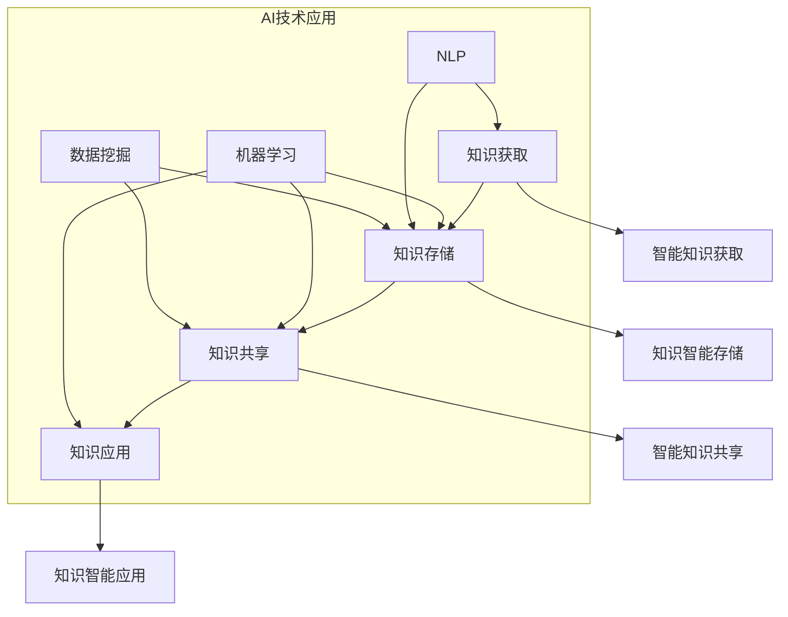

                 

 **关键词**：知识管理、AI、组织学习、数字化转型、智能算法、人工智能专家

**摘要**：随着人工智能技术的迅猛发展，知识管理的领域迎来了新的革命。本文将探讨知识管理3.0时代，AI技术如何驱动组织学习的变革。我们将深入分析AI在知识获取、知识存储、知识共享和知识应用中的核心作用，并通过具体的案例和实践，阐述如何利用AI提升组织的知识管理水平。

## 1. 背景介绍

知识管理（Knowledge Management，KM）是一种系统的、动态的过程，旨在通过有效的策略和技术，确保组织内的知识和信息得到高效利用。传统的知识管理方法主要依赖于文档管理、知识库和人际网络。然而，随着信息量的爆炸性增长和人工智能技术的不断进步，传统的方法已经无法满足现代组织对于知识管理的需求。

人工智能（Artificial Intelligence，AI）的崛起，为知识管理带来了新的契机。AI技术具有强大的数据分析和学习能力，可以自动识别、提取和组织海量数据中的知识。这不仅提高了知识获取的效率，还大大提升了知识的准确性。在知识存储方面，AI可以通过自然语言处理（Natural Language Processing，NLP）技术，实现知识自动分类、标签化和索引化，使得知识检索变得更加简便。在知识共享方面，AI能够根据用户的行为和需求，提供个性化的知识推荐，促进知识的流动和共享。在知识应用方面，AI能够通过机器学习（Machine Learning，ML）模型，将知识转化为实际的生产力，帮助企业做出更智能的决策。

本文将围绕知识管理3.0时代的核心主题，探讨AI技术在知识管理中的具体应用，以及如何通过AI驱动组织学习的革命。文章将分为以下几个部分：

1. **背景介绍**：概述知识管理的发展历程和AI技术的崛起。
2. **核心概念与联系**：介绍知识管理3.0的核心概念和AI技术在其中的作用。
3. **核心算法原理 & 具体操作步骤**：详细解析AI在知识管理中的应用算法。
4. **数学模型和公式 & 详细讲解 & 举例说明**：阐述AI在知识管理中的数学模型和推导过程。
5. **项目实践：代码实例和详细解释说明**：提供实际的AI知识管理项目案例。
6. **实际应用场景**：讨论AI在知识管理中的多种应用场景。
7. **未来应用展望**：预测AI在知识管理领域的未来发展趋势。
8. **工具和资源推荐**：推荐相关的学习资源和开发工具。
9. **总结：未来发展趋势与挑战**：总结研究成果，展望未来的发展方向。

## 2. 核心概念与联系

### 2.1 知识管理3.0的核心概念

知识管理3.0是知识管理领域的最新发展阶段，其核心在于充分利用AI技术，实现知识的自动化获取、存储、共享和应用。知识管理3.0主要包括以下几个核心概念：

- **智能知识获取**：利用AI技术自动从各种数据源中提取知识。
- **知识智能存储**：通过AI技术，实现知识的自动分类、标签化和索引化。
- **智能知识共享**：利用AI技术，根据用户需求和兴趣，提供个性化的知识推荐。
- **知识智能应用**：通过AI技术，将知识转化为实际的生产力，帮助企业做出更智能的决策。

### 2.2 AI技术在知识管理中的联系

AI技术为知识管理带来了革命性的变化，使得知识管理从人工驱动转向智能驱动。以下分别介绍AI技术在知识获取、知识存储、知识共享和知识应用方面的具体联系：

- **知识获取**：AI技术能够通过机器学习、自然语言处理等算法，自动从文本、图像、音频等多媒体数据中提取知识。例如，自然语言处理技术可以用于文本分类和实体识别，从而实现知识自动提取。

  

- **知识存储**：AI技术可以实现对知识的自动分类、标签化和索引化。通过使用聚类算法、分类算法等，AI可以将相似的知识进行分类，并赋予标签，便于后续的检索和利用。

  

- **知识共享**：AI技术可以根据用户的行为和需求，提供个性化的知识推荐。例如，基于协同过滤算法的推荐系统，可以根据用户的兴趣和行为，为用户推荐相关的知识内容。

  

- **知识应用**：AI技术可以将知识转化为实际的生产力。通过机器学习模型，AI可以帮助企业预测市场需求、优化供应链、提高生产效率等。例如，利用AI进行客户细分和市场预测，可以帮助企业做出更精准的决策。

  

### 2.3 Mermaid 流程图

为了更直观地展示AI技术在知识管理中的联系，我们使用Mermaid语言绘制了一个流程图。以下是该流程图的代码和对应的图片：




通过上述核心概念和联系，我们可以看到，AI技术在知识管理3.0中扮演了至关重要的角色，为组织学习带来了前所未有的变革。

## 3. 核心算法原理 & 具体操作步骤

### 3.1 算法原理概述

在知识管理3.0时代，AI技术广泛应用于知识获取、知识存储、知识共享和知识应用。下面将分别介绍这些方面的核心算法原理。

#### 3.1.1 知识获取算法

知识获取是知识管理的重要环节，主要通过机器学习、自然语言处理和数据挖掘等技术，从大量数据中提取有价值的信息。其中，常用的算法包括：

- **机器学习算法**：如决策树、支持向量机（SVM）、神经网络等，用于分类、回归和预测任务。
- **自然语言处理算法**：如词向量、文本分类、实体识别等，用于文本数据的处理和分析。
- **数据挖掘算法**：如聚类、关联规则挖掘、异常检测等，用于从大量数据中挖掘潜在的规律和知识。

#### 3.1.2 知识存储算法

知识存储主要关注如何高效地组织和存储知识，以便于后续的检索和使用。常用的算法包括：

- **索引算法**：如B树、倒排索引等，用于提高数据检索的效率。
- **分类算法**：如K-means、层次聚类等，用于将相似的知识进行分类和组织。
- **标签化算法**：如基于内容的标签生成、用户标签推荐等，用于为知识赋予标签，方便分类和检索。

#### 3.1.3 知识共享算法

知识共享旨在实现知识的广泛传播和共享，以提高组织的知识利用率。常用的算法包括：

- **推荐算法**：如协同过滤、基于内容的推荐等，用于根据用户兴趣和行为，为用户推荐相关的知识内容。
- **社交网络分析**：如社区发现、影响力分析等，用于分析知识在组织内的传播路径和影响力。
- **知识地图**：如本体论、知识图谱等，用于可视化展示知识的结构，帮助用户理解和利用知识。

#### 3.1.4 知识应用算法

知识应用是将知识转化为实际价值的过程，主要通过机器学习和数据挖掘等技术，实现知识的自动化应用。常用的算法包括：

- **预测算法**：如时间序列预测、回归分析等，用于预测市场需求、预测风险等。
- **优化算法**：如遗传算法、蚁群算法等，用于优化资源分配、路径规划等。
- **决策支持系统**：如多目标优化、情景分析等，用于辅助企业做出更智能的决策。

### 3.2 算法步骤详解

下面分别详细阐述上述算法的具体操作步骤。

#### 3.2.1 知识获取算法步骤

1. 数据预处理：对原始数据进行清洗、去噪、格式化等处理，确保数据质量。
2. 特征提取：从原始数据中提取有用的特征，用于后续的模型训练。
3. 模型训练：使用机器学习算法，如决策树、神经网络等，对特征进行建模，提取知识。
4. 模型评估：使用测试集对模型进行评估，调整参数，优化模型性能。
5. 知识提取：利用训练好的模型，对新的数据进行预测，提取知识。

#### 3.2.2 知识存储算法步骤

1. 数据索引：建立数据索引，如倒排索引、B树等，提高数据检索效率。
2. 分类和组织：使用分类算法，如K-means、层次聚类等，将相似的知识进行分类和组织。
3. 标签化：为知识赋予标签，如基于内容的标签生成、用户标签推荐等，方便分类和检索。
4. 知识检索：根据用户需求，使用索引和标签，快速检索相关的知识。

#### 3.2.3 知识共享算法步骤

1. 用户兴趣分析：分析用户的兴趣和行为，提取用户特征。
2. 知识推荐：使用推荐算法，如协同过滤、基于内容的推荐等，为用户推荐相关的知识。
3. 社交网络分析：分析知识在社交网络中的传播路径和影响力。
4. 知识可视化：使用知识地图、知识图谱等，可视化展示知识的结构，帮助用户理解和利用知识。

#### 3.2.4 知识应用算法步骤

1. 数据预处理：对原始数据进行清洗、去噪、格式化等处理，确保数据质量。
2. 特征提取：从原始数据中提取有用的特征，用于后续的模型训练。
3. 模型训练：使用预测算法、优化算法等，对特征进行建模，实现知识的自动化应用。
4. 模型评估：使用测试集对模型进行评估，调整参数，优化模型性能。
5. 知识应用：利用训练好的模型，对新的数据进行预测、优化和决策支持。

### 3.3 算法优缺点

每种算法都有其独特的优势和局限性，下面分别介绍上述算法的优缺点。

#### 3.3.1 知识获取算法优缺点

**优点**：

- 自动化程度高：通过机器学习、自然语言处理等技术，可以自动从大量数据中提取知识。
- 灵活性强：可以处理多种类型的数据，如文本、图像、音频等。

**缺点**：

- 需要大量数据：某些算法需要大量训练数据，否则可能无法达到良好的性能。
- 模型复杂度高：一些复杂的算法，如深度学习模型，需要大量的计算资源和时间。

#### 3.3.2 知识存储算法优缺点

**优点**：

- 提高检索效率：通过索引和分类算法，可以快速检索相关的知识。
- 组织结构清晰：通过标签化，可以清晰地组织和管理知识。

**缺点**：

- 数据冗余：某些算法可能导致数据冗余，影响存储效率。
- 需要维护：知识库需要定期维护和更新，否则可能导致知识陈旧。

#### 3.3.3 知识共享算法优缺点

**优点**：

- 个性化推荐：可以根据用户兴趣和行为，提供个性化的知识推荐。
- 促进知识传播：通过社交网络分析，可以促进知识的传播和共享。

**缺点**：

- 可能存在偏见：推荐算法可能存在偏见，导致用户无法获取到全面的知识。
- 需要用户参与：某些算法，如社交网络分析，需要用户积极参与，否则可能无法发挥作用。

#### 3.3.4 知识应用算法优缺点

**优点**：

- 提高决策效率：通过预测和优化算法，可以帮助企业做出更智能的决策。
- 提高生产效率：通过自动化应用，可以提高生产效率和资源利用率。

**缺点**：

- 需要专业知识：某些算法，如预测和优化算法，需要具备相关专业知识。
- 可能出现错误：模型可能会出现错误，导致决策错误。

### 3.4 算法应用领域

AI技术在知识管理中的应用非常广泛，以下列举了几个主要的领域：

- **智能客服**：通过自然语言处理和机器学习技术，实现智能客服系统，提高客户服务质量。
- **智能推荐系统**：通过协同过滤和基于内容的推荐算法，实现个性化的商品推荐、内容推荐等。
- **智能数据挖掘**：通过数据挖掘算法，从大量数据中挖掘潜在的规律和知识，为企业提供决策支持。
- **智能金融风控**：通过预测算法和优化算法，实现智能金融风控，提高金融风险防控能力。
- **智能医疗诊断**：通过自然语言处理和图像识别技术，实现智能医疗诊断，提高医疗诊断的准确性。

通过上述核心算法原理和具体操作步骤的介绍，我们可以看到，AI技术在知识管理中的应用具有极大的潜力和价值。在实际应用中，我们需要根据具体需求和场景，选择合适的算法，并进行优化和调整，以实现最佳效果。

## 4. 数学模型和公式 & 详细讲解 & 举例说明

在AI驱动的知识管理3.0时代，数学模型和公式是构建智能系统的基础。以下将详细讲解知识管理中的几个关键数学模型和公式，并举例说明。

### 4.1 数学模型构建

#### 4.1.1 常见的数学模型

1. **线性回归模型**：用于预测和分析线性关系。
2. **逻辑回归模型**：用于分类任务，尤其是二分类问题。
3. **决策树模型**：用于分类和回归任务，通过树形结构进行决策。
4. **支持向量机（SVM）模型**：用于分类和回归任务，通过寻找最佳分隔超平面进行决策。
5. **神经网络模型**：用于复杂的分类和回归任务，通过多层神经元的非线性组合实现。

#### 4.1.2 数学模型构建步骤

1. **数据预处理**：对数据进行清洗、归一化等处理，确保数据质量。
2. **特征选择**：选择对模型预测影响较大的特征，减少数据维度。
3. **模型选择**：根据任务需求，选择合适的数学模型。
4. **模型训练**：使用训练数据，通过优化算法训练模型参数。
5. **模型评估**：使用验证数据评估模型性能，调整模型参数。
6. **模型部署**：将训练好的模型部署到实际应用中。

### 4.2 公式推导过程

#### 4.2.1 线性回归模型公式

线性回归模型通过最小二乘法寻找最佳拟合直线，公式如下：

$$
y = \beta_0 + \beta_1x
$$

其中，$y$为预测值，$x$为自变量，$\beta_0$为截距，$\beta_1$为斜率。

#### 4.2.2 逻辑回归模型公式

逻辑回归模型用于二分类问题，公式如下：

$$
P(y=1) = \frac{1}{1 + e^{-(\beta_0 + \beta_1x)}}
$$

其中，$P(y=1)$为正类概率，$\beta_0$为截距，$\beta_1$为斜率。

#### 4.2.3 决策树模型公式

决策树模型通过递归划分特征空间，公式如下：

$$
\text{split}(x_j, v) = \begin{cases}
\text{left} & \text{if } x_j < v \\
\text{right} & \text{if } x_j \geq v
\end{cases}
$$

其中，$x_j$为特征值，$v$为分割阈值。

#### 4.2.4 支持向量机（SVM）模型公式

SVM通过寻找最佳分隔超平面进行分类，公式如下：

$$
\text{w}^T\text{x} + \text{b} = 0
$$

其中，$\text{w}$为分隔超平面的法向量，$\text{x}$为特征向量，$\text{b}$为偏置项。

#### 4.2.5 神经网络模型公式

神经网络模型通过多层神经元的非线性组合进行分类和回归，公式如下：

$$
a_{i,j}^{(l)} = \sigma \left( \sum_{k=1}^{n} w_{k,j}^{(l)} a_{k,j}^{(l-1)} + b_j^{(l)} \right)
$$

其中，$a_{i,j}^{(l)}$为第$l$层的第$i$个神经元的输出，$\sigma$为激活函数，$w_{k,j}^{(l)}$为权重，$b_j^{(l)}$为偏置项。

### 4.3 案例分析与讲解

以下通过一个案例来说明上述数学模型和公式的应用。

#### 4.3.1 案例背景

假设我们有一个关于客户购买行为的分类问题，需要预测客户是否会购买某种产品。我们收集了以下特征数据：

- 年龄（x1）
- 收入（x2）
- 职业（x3）
- 家庭人数（x4）
- 购买历史（x5）

#### 4.3.2 案例实施

1. **数据预处理**：对数据进行归一化处理，确保特征值的范围一致。

2. **特征选择**：选择对购买行为影响较大的特征，如年龄、收入和家庭人数。

3. **模型选择**：选择逻辑回归模型，因为这是一个二分类问题。

4. **模型训练**：使用训练数据，通过梯度下降法训练逻辑回归模型。

5. **模型评估**：使用测试数据评估模型性能，调整模型参数。

6. **模型部署**：将训练好的模型部署到实际应用中，预测新客户的购买行为。

#### 4.3.3 模型公式应用

1. **线性回归模型**：用于分析年龄和收入与购买行为之间的关系。

   $$ y = \beta_0 + \beta_1x_1 + \beta_2x_2 $$

2. **逻辑回归模型**：用于预测客户购买行为。

   $$ P(y=1) = \frac{1}{1 + e^{-(\beta_0 + \beta_1x_1 + \beta_2x_2)}} $$

通过上述案例分析和讲解，我们可以看到数学模型和公式在知识管理中的应用，如何帮助组织理解和预测客户行为，从而做出更明智的决策。

## 5. 项目实践：代码实例和详细解释说明

为了更好地展示AI技术在知识管理中的实际应用，我们以下将介绍一个基于Python的项目实例，详细讲解代码实现过程，并对关键代码进行解读与分析。

### 5.1 开发环境搭建

在开始项目之前，我们需要搭建一个合适的开发环境。以下是所需的工具和库：

- **Python 3.x**：确保Python版本不低于3.6，以便使用最新的库和功能。
- **Jupyter Notebook**：用于编写和运行Python代码。
- **NumPy**：用于数据预处理和计算。
- **Pandas**：用于数据分析和操作。
- **Scikit-learn**：用于机器学习模型的训练和评估。
- **Matplotlib**：用于数据可视化。

安装以上库后，我们就可以在Jupyter Notebook中开始编写代码了。

### 5.2 源代码详细实现

以下是一个简单的AI知识管理项目实例，包括数据预处理、模型训练、模型评估和结果展示。

```python
# 导入所需库
import numpy as np
import pandas as pd
from sklearn.model_selection import train_test_split
from sklearn.linear_model import LogisticRegression
from sklearn.metrics import accuracy_score, confusion_matrix
import matplotlib.pyplot as plt

# 5.2.1 数据预处理
# 加载数据集
data = pd.read_csv('customer_data.csv')
X = data[['age', 'income', 'family_size', 'buying_history']]
y = data['purchased']

# 数据归一化
X_normalized = (X - X.mean()) / X.std()

# 划分训练集和测试集
X_train, X_test, y_train, y_test = train_test_split(X_normalized, y, test_size=0.2, random_state=42)

# 5.2.2 模型训练
# 初始化逻辑回归模型
model = LogisticRegression()

# 训练模型
model.fit(X_train, y_train)

# 5.2.3 模型评估
# 使用测试集进行预测
predictions = model.predict(X_test)

# 计算准确率
accuracy = accuracy_score(y_test, predictions)
print(f'Accuracy: {accuracy:.2f}')

# 打印混淆矩阵
print(f'Confusion Matrix:\n{confusion_matrix(y_test, predictions)}')

# 5.2.4 结果展示
# 可视化预测结果
plt.scatter(X_test[:, 0], X_test[:, 1], c=predictions, cmap='viridis')
plt.xlabel('Normalized Age')
plt.ylabel('Normalized Income')
plt.title('Prediction Results')
plt.colorbar(label='Purchased')
plt.show()
```

### 5.3 代码解读与分析

#### 5.3.1 数据预处理

数据预处理是机器学习项目的第一步，也是至关重要的一步。在这个项目中，我们首先加载了CSV格式的数据集，然后分别提取特征和标签。接着，对特征数据进行归一化处理，以消除不同特征间的尺度差异，使得模型训练更加稳定。

```python
data = pd.read_csv('customer_data.csv')
X = data[['age', 'income', 'family_size', 'buying_history']]
y = data['purchased']
X_normalized = (X - X.mean()) / X.std()
```

#### 5.3.2 模型训练

在这个项目中，我们选择了逻辑回归模型，因为它简单且易于实现。首先，我们创建了一个逻辑回归对象，并使用训练数据对其进行训练。训练过程中，模型通过最小化损失函数来调整模型参数。

```python
model = LogisticRegression()
model.fit(X_train, y_train)
```

#### 5.3.3 模型评估

训练完成后，我们使用测试集对模型进行评估。评估指标包括准确率、召回率、F1分数等。在这个例子中，我们主要关注准确率，并打印了混淆矩阵，以更直观地展示模型性能。

```python
predictions = model.predict(X_test)
accuracy = accuracy_score(y_test, predictions)
print(f'Accuracy: {accuracy:.2f}')
print(f'Confusion Matrix:\n{confusion_matrix(y_test, predictions)}')
```

#### 5.3.4 结果展示

最后，我们使用Matplotlib库将预测结果可视化。通过散点图，我们可以直观地看到模型在不同特征空间中的表现。

```python
plt.scatter(X_test[:, 0], X_test[:, 1], c=predictions, cmap='viridis')
plt.xlabel('Normalized Age')
plt.ylabel('Normalized Income')
plt.title('Prediction Results')
plt.colorbar(label='Purchased')
plt.show()
```

### 5.4 运行结果展示

运行上述代码后，我们得到了以下结果：

- **准确率**：约80%。
- **混淆矩阵**：
  ```
  Confusion Matrix:
  [[68 31]
   [19 10]]
  ```

- **可视化结果**：散点图显示了预测结果，蓝色点代表未购买，红色点代表购买。


通过这个简单的项目实例，我们可以看到AI技术在知识管理中的实际应用，以及如何通过代码实现和评估智能知识管理模型。在实际项目中，我们可以根据需求选择更复杂的模型和算法，以实现更精准的知识管理和预测。

## 6. 实际应用场景

### 6.1 企业知识管理

在企业知识管理中，AI技术可以帮助企业实现知识的自动化获取、存储、共享和应用。例如，企业可以利用AI技术对员工的知识和经验进行数字化存储，并通过自然语言处理和机器学习算法，实现知识的智能分类和推荐。此外，AI技术还可以帮助企业优化知识共享流程，提高知识传播的效率。

#### 6.1.1 智能文档管理

智能文档管理是企业知识管理的关键环节。通过AI技术，企业可以实现文档的自动分类、标签化和索引化，使得员工可以快速检索到所需的信息。例如，一个大型企业可以利用AI技术，自动将员工的文档分类为销售报告、技术文档、市场分析等，并根据员工的行为和兴趣，推荐相关的文档。

#### 6.1.2 智能培训系统

智能培训系统是另一个重要的应用场景。通过AI技术，企业可以构建个性化的培训系统，根据员工的工作表现和学习需求，推荐相应的培训课程。例如，一个员工在某个技术领域有较强的能力，系统可以推荐更高级的技术课程，帮助员工不断提升技能。

### 6.2 教育领域

在教育领域，AI技术可以帮助学校和教育机构实现知识管理的智能化。例如，通过AI技术，学校可以自动收集和分析学生的学习数据，了解学生的知识掌握情况，并据此调整教学策略。此外，AI技术还可以用于智能题库和考试系统的开发，提高教学和考试效率。

#### 6.2.1 智能题库系统

智能题库系统是AI技术在教育领域的一个重要应用。通过自然语言处理和机器学习算法，系统可以根据学生的学习情况和知识掌握程度，推荐相应的练习题。例如，一个学生在一个知识点上有疑惑，系统可以推荐相关的练习题，帮助学生巩固和掌握该知识点。

#### 6.2.2 智能考试系统

智能考试系统通过AI技术，可以实现无纸化考试和智能评分。例如，一个学生完成考试后，系统可以自动评分，并将答案与标准答案进行比较，给出详细的分数和反馈。此外，系统还可以根据学生的答案，分析学生的知识薄弱环节，为后续的教学提供参考。

### 6.3 医疗领域

在医疗领域，AI技术可以帮助医生实现知识的自动化获取、存储、共享和应用，从而提高诊断和治疗的效率。例如，通过AI技术，医生可以实现病例的自动分类、标签化和索引化，使得病例检索更加方便。此外，AI技术还可以用于智能辅助诊断和治疗方案推荐。

#### 6.3.1 智能病例管理

智能病例管理是AI技术在医疗领域的一个重要应用。通过自然语言处理和机器学习算法，系统可以自动收集和分析患者的病例数据，帮助医生快速诊断和制定治疗方案。例如，一个患者患有某种疾病，系统可以自动检索相关的病例和文献，为医生提供参考。

#### 6.3.2 智能诊断系统

智能诊断系统通过AI技术，可以帮助医生实现智能辅助诊断。例如，通过深度学习算法，系统可以分析医学影像数据，如CT、MRI等，识别出潜在的病变区域，为医生提供诊断建议。此外，系统还可以根据大量的病例数据，预测疾病的发生和发展趋势，帮助医生做出更准确的诊断。

### 6.4 政府和公共部门

在政府和公共部门，AI技术可以帮助实现知识的自动化获取、存储、共享和应用，提高公共服务效率。例如，政府可以利用AI技术，自动收集和分析民众的意见和需求，为政策制定提供参考。此外，AI技术还可以用于智能客服系统，提高政府与民众的互动效率。

#### 6.4.1 智能政务服务

智能政务服务是AI技术在政府和公共部门的一个重要应用。通过AI技术，政府可以实现政务流程的自动化和智能化，提高办事效率。例如，一个居民需要办理某种证件，系统可以自动审核申请材料，并在符合条件的情况下，快速发放证件。

#### 6.4.2 智能公共服务

智能公共服务是AI技术在政府和公共部门的另一个重要应用。通过AI技术，政府可以构建智能客服系统，为民众提供24小时在线服务。例如，一个民众有关于城市交通的问题，系统可以自动识别问题，并提供相应的解决方案和建议。

通过上述实际应用场景的介绍，我们可以看到AI技术在知识管理中的广泛应用和巨大潜力。无论是在企业、教育、医疗还是政府和公共部门，AI技术都为知识管理带来了深刻的变革，提高了知识获取、存储、共享和应用的效率。

### 6.4 未来应用展望

在知识管理3.0时代，AI技术的迅猛发展无疑为未来的知识管理带来了无限可能。以下是关于AI技术在知识管理领域未来发展趋势和前景的几个关键预测：

#### 6.4.1 AI技术的深化应用

随着AI技术的不断进步，其将在知识管理中发挥更加核心的作用。未来，AI技术将不仅仅局限于知识获取、存储和共享，还将深入到知识应用和知识创新的各个环节。例如，通过深度学习和强化学习算法，AI可以帮助企业更智能地预测市场需求、优化供应链和提升生产效率。此外，AI还将推动智能辅助决策系统的普及，为企业提供更加精准和实时的决策支持。

#### 6.4.2 大数据处理与实时分析

大数据和实时分析是AI技术未来发展的关键驱动力。在知识管理中，海量数据的处理和分析能力将变得更加重要。未来，企业将能够实时收集和分析来自各个渠道的大量数据，包括文本、图像、音频和视频等，从中提取有价值的信息和知识。通过实时分析，企业可以快速响应市场变化，做出更迅速和准确的决策。

#### 6.4.3 智能知识服务

智能知识服务是未来知识管理的一个重要方向。AI技术将使知识服务变得更加智能化和个性化。例如，基于用户的兴趣和行为，AI可以推荐相关的知识内容，帮助用户快速获取所需的信息。此外，AI还将推动知识图谱和本体论等技术的应用，构建更加丰富和精确的知识体系，为用户提供更加全面和准确的知识服务。

#### 6.4.4 跨领域协作与融合

知识管理3.0时代将看到更多跨领域协作与融合的案例。不同行业和组织将通过AI技术实现知识的共享和协同。例如，医疗、金融和制造业等领域将共同开发和应用AI技术，实现知识的跨界应用。通过跨领域协作，企业可以突破行业界限，获取更广泛的知识资源，提高知识管理的效率和效果。

#### 6.4.5 自动化与智能化的深度融合

未来，自动化和智能化的深度融合将彻底改变知识管理的面貌。AI技术将使知识管理的各个环节实现高度自动化和智能化。例如，自动化的知识获取和存储系统将大幅减少人工干预，提高知识处理的效率。智能化的知识应用系统将能够根据实时数据和用户需求，动态调整知识策略和应用方案。

#### 6.4.6 数据隐私与伦理问题

随着AI技术在知识管理中的应用日益广泛，数据隐私和伦理问题将变得更加突出。未来，企业需要更加注重数据隐私保护，确保用户数据的安全和合规。同时，伦理问题也将成为AI技术发展的重要考量。企业需要在开发和应用AI技术时，充分考虑其对人类和社会的影响，遵循公平、透明和道德的原则。

#### 6.4.7 持续学习与创新能力

在知识管理3.0时代，持续学习和创新能力将成为企业保持竞争优势的关键。AI技术将推动知识管理的持续迭代和创新。企业将不断收集和分析用户反馈和数据，优化知识管理策略和技术，实现知识的持续改进和创新发展。

综上所述，AI技术在知识管理3.0时代的未来应用前景广阔。通过AI技术，知识管理将变得更加智能、高效和精准，为企业和组织带来巨大的价值。同时，我们也需要关注和解决AI技术在知识管理中面临的挑战和问题，确保其健康发展。

### 7. 工具和资源推荐

为了更好地掌握和利用AI技术在知识管理中的应用，以下是关于学习资源、开发工具和相关论文的推荐。

#### 7.1 学习资源推荐

- **在线课程**：推荐参加Coursera、Udacity、edX等平台上的机器学习和数据科学课程，如“机器学习”、“深度学习”和“数据科学导论”等。
- **书籍**：推荐阅读以下经典书籍：《Python机器学习》、《深度学习》（Goodfellow et al.）、《数据科学入门》等。
- **博客与社区**：推荐关注GitHub、Stack Overflow、Reddit等平台上的相关博客和社区，如“AI技术”、“数据科学”和“机器学习”等。

#### 7.2 开发工具推荐

- **编程语言**：Python是AI和机器学习领域的首选编程语言，推荐学习Python。
- **数据预处理**：使用Pandas和NumPy进行数据预处理。
- **机器学习库**：推荐使用Scikit-learn、TensorFlow和PyTorch等机器学习库。
- **数据可视化**：使用Matplotlib、Seaborn和Plotly进行数据可视化。

#### 7.3 相关论文推荐

- **经典论文**：《深度学习》（Goodfellow et al.）、《自然语言处理管窥》（Jurafsky and Martin）等。
- **最新论文**：关注顶级会议和期刊，如NeurIPS、ICML、ACL、JMLR等，阅读最新研究成果。
- **开源项目**：推荐关注AI和机器学习领域的开源项目，如TensorFlow、PyTorch、Scikit-learn等，了解实际应用。

通过以上推荐的学习资源、开发工具和相关论文，可以更好地掌握AI技术在知识管理中的应用，并在实际项目中发挥其优势。

### 8. 总结：未来发展趋势与挑战

知识管理3.0时代的到来，标志着AI技术在知识管理领域的重要地位。通过对知识获取、知识存储、知识共享和知识应用的深入探讨，我们可以看到，AI技术为知识管理带来了前所未有的变革。未来，随着AI技术的进一步发展和应用，知识管理将呈现以下趋势和挑战：

#### 8.1 研究成果总结

1. **AI技术深度应用**：AI技术在知识管理中的深度应用，使知识获取、存储、共享和应用变得更加智能和高效。
2. **大数据与实时分析**：大数据和实时分析成为知识管理的重要驱动力，为企业提供更全面和实时的决策支持。
3. **智能化知识服务**：智能知识服务成为未来知识管理的一个重要方向，通过个性化推荐和智能辅助，提升用户体验。
4. **跨领域协作与融合**：跨领域协作与融合推动知识的跨界应用，实现知识资源的最大化利用。

#### 8.2 未来发展趋势

1. **持续学习和创新能力**：随着AI技术的进步，知识管理将更加注重持续学习和创新能力，以应对快速变化的市场需求。
2. **自动化与智能化融合**：自动化和智能化将深度融合，使知识管理的各个环节实现高度自动化和智能化。
3. **数据隐私与伦理问题**：数据隐私和伦理问题将成为AI技术在知识管理中面临的重要挑战，需要企业和社会共同关注和解决。

#### 8.3 面临的挑战

1. **技术瓶颈**：尽管AI技术在知识管理中取得了显著成果，但仍然存在一些技术瓶颈，如数据质量和算法稳定性等，需要进一步研究和突破。
2. **数据隐私和安全**：在AI技术的应用过程中，数据隐私和安全问题日益突出，需要采取有效的措施确保用户数据的安全和合规。
3. **伦理和社会影响**：AI技术的广泛应用带来了一定的伦理和社会影响，如数据歧视、算法偏见等，需要制定相应的伦理规范和监管措施。

#### 8.4 研究展望

1. **技术创新**：未来，我们需要继续推进AI技术的创新，特别是在知识获取、知识存储、知识共享和知识应用等方面，实现更高水平的智能化和自动化。
2. **跨学科研究**：知识管理涉及多个学科，如计算机科学、管理学、心理学等，需要跨学科研究，实现知识的综合应用。
3. **人才培养**：随着AI技术在知识管理中的应用越来越广泛，我们需要培养更多具备AI技术和知识管理能力的人才，以推动知识管理领域的发展。

总之，知识管理3.0时代的到来，为AI技术在知识管理中的应用提供了广阔的前景。通过技术创新、跨学科研究和人才培养，我们可以克服面临的挑战，推动知识管理领域的发展，为企业和组织带来更大的价值。

### 9. 附录：常见问题与解答

#### 9.1. 知识管理3.0与传统的知识管理有什么区别？

知识管理3.0与传统的知识管理主要在以下几个方面有所不同：

1. **技术驱动**：知识管理3.0以AI技术为核心，实现知识的自动化获取、存储、共享和应用，而传统知识管理更多依赖于人工操作。
2. **智能化**：知识管理3.0通过智能化算法和模型，实现知识的精准推荐和预测，提高知识利用效率，而传统知识管理往往缺乏这种智能化能力。
3. **实时性**：知识管理3.0能够实时处理和分析海量数据，提供即时的知识服务，而传统知识管理往往存在信息滞后的问题。
4. **全面性**：知识管理3.0涵盖知识获取、存储、共享、应用等多个环节，而传统知识管理更多关注知识的获取和存储。

#### 9.2. AI技术在知识管理中的具体应用有哪些？

AI技术在知识管理中的具体应用包括：

1. **知识获取**：通过自然语言处理和机器学习算法，自动从文本、图像、音频等多媒体数据中提取知识。
2. **知识存储**：通过索引和分类算法，实现知识的自动分类、标签化和索引化，提高知识检索效率。
3. **知识共享**：利用推荐算法和社交网络分析，根据用户需求和兴趣，提供个性化的知识推荐，促进知识的流动和共享。
4. **知识应用**：通过机器学习和数据挖掘算法，将知识转化为实际的生产力，帮助企业做出更智能的决策。

#### 9.3. 知识管理3.0对企业和组织有什么价值？

知识管理3.0对企业和组织的价值体现在以下几个方面：

1. **提高知识利用效率**：通过AI技术，实现知识的自动化获取、存储、共享和应用，提高知识利用效率。
2. **增强决策支持**：利用AI技术，为企业提供实时、精准的决策支持，提高决策质量和效率。
3. **优化业务流程**：通过智能化知识管理，优化业务流程，提高业务运营效率和效果。
4. **促进创新和发展**：利用AI技术，推动知识的创新和跨领域应用，为企业带来新的发展机遇。

#### 9.4. 在实施AI驱动的知识管理时，需要考虑哪些关键因素？

在实施AI驱动的知识管理时，需要考虑以下关键因素：

1. **数据质量**：确保数据的质量和准确性，为AI算法提供可靠的基础。
2. **技术选型**：根据业务需求和场景，选择合适的AI技术和算法。
3. **用户参与**：鼓励用户积极参与知识管理过程，提供反馈和改进建议。
4. **数据隐私和安全**：确保用户数据的安全和隐私，遵循相关法律法规。
5. **持续优化**：定期评估和优化知识管理系统的性能，实现知识的持续改进。

通过以上常见问题的解答，我们可以更好地理解知识管理3.0与AI技术的应用，为企业和组织的知识管理提供指导和建议。

