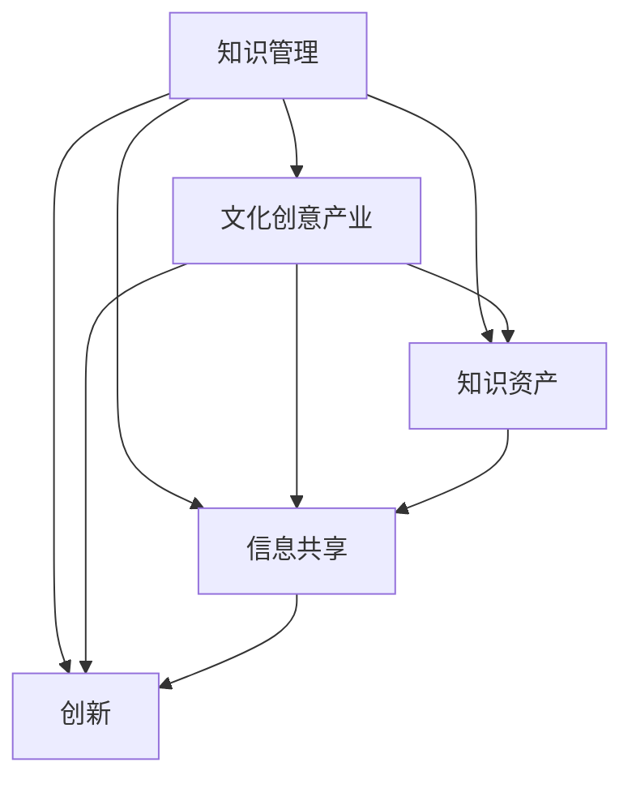

                 

### 背景介绍

知识管理在文化创意产业中的实践，是一个日益受到关注的话题。文化创意产业，指的是以创意为核心，通过文化价值和艺术表达，生产、传播和消费文化产品的行业。它包括但不限于影视制作、音乐创作、动漫设计、文学出版等多个领域。随着科技的不断进步，文化创意产业正在经历一场革命性的变革。

在传统模式下，文化创意产业主要依赖于个人经验和手工艺品，生产效率低下，创新速度缓慢。然而，随着人工智能、大数据、云计算等新技术的应用，知识管理开始成为推动文化创意产业升级的关键因素。知识管理不仅仅是对信息的收集和整理，更是一种通过系统化、标准化的方式，将知识转化为实际生产力的过程。

知识管理在文化创意产业中的重要性体现在以下几个方面：

1. **提高创新效率**：通过知识管理，可以快速获取和利用已有的知识资源，减少重复劳动，提高创作效率。
2. **优化资源分配**：知识管理有助于企业对内部和外部资源进行有效的整合和分配，提高资源利用率。
3. **提升品牌价值**：知识管理能够帮助企业构建独特的知识资产，提升品牌的影响力和市场竞争力。
4. **促进跨界合作**：知识管理为不同领域之间的知识共享和协同创新提供了可能，有助于打破行业壁垒，实现跨界合作。

本文将围绕知识管理在文化创意产业中的具体实践，探讨其核心概念、算法原理、数学模型、项目实践以及实际应用场景，旨在为相关领域的研究和实践提供有价值的参考。

### 核心概念与联系

在探讨知识管理在文化创意产业中的应用之前，我们需要首先了解一些核心概念，以及这些概念之间的相互联系。以下将使用Mermaid流程图来直观地展示这些核心概念和它们之间的关系。

首先，让我们定义几个关键概念：

1. **知识管理（Knowledge Management）**：指的是通过系统化、集成化的方法，对组织内部的显性知识和隐性知识进行识别、收集、存储、共享和利用的过程。
2. **文化创意产业（Creative Culture Industry）**：指以创意为核心，通过文化价值和艺术表达，生产、传播和消费文化产品的行业。
3. **知识资产（Knowledge Asset）**：指组织内部或个人所拥有的，具有价值、易受保护、可转移的知识资源。
4. **信息共享（Information Sharing）**：指个体或组织之间，通过一定的渠道，交换、传递和获取信息的过程。
5. **创新（Innovation）**：指通过引入新的思想、方法、产品或服务，创造新的价值的过程。

以下是这些概念之间的Mermaid流程图：



**详细解释：**

- **知识管理**是整个流程的核心，它通过系统化的方法对知识进行识别、收集、存储、共享和利用，为其他概念提供支持。
- **文化创意产业**依赖于知识管理，通过引入新的知识资源，提高创作效率和资源利用率。
- **知识资产**是知识管理的重要组成部分，它包含了组织内部或个人的显性知识和隐性知识，是创新的重要基础。
- **信息共享**是知识管理的关键环节，通过信息共享，个体或组织能够获取新的知识，促进知识的流动和增值。
- **创新**是知识管理的最终目标，通过不断引入新的知识资源，实现产品和服务的创新，提高品牌价值和市场竞争力。

通过这个流程图，我们可以清晰地看到知识管理在文化创意产业中的核心作用，以及各个概念之间的紧密联系。这些核心概念共同构成了知识管理在文化创意产业中的应用基础，为后续的讨论提供了明确的框架。

### 核心算法原理 & 具体操作步骤

在了解了核心概念和它们之间的联系之后，我们接下来探讨知识管理在文化创意产业中的核心算法原理和具体操作步骤。这一部分将详细解释如何通过系统化、集成化的方法，对知识进行识别、收集、存储、共享和利用。

#### 知识识别（Knowledge Identification）

知识识别是知识管理的第一步，它指的是通过多种手段识别出组织内部和外部的知识资源。具体操作步骤如下：

1. **需求分析**：分析组织内外部的知识需求，确定需要识别的知识类型和范围。
2. **知识地图**：构建知识地图，明确各个知识单元之间的关系，帮助理解整个知识体系。
3. **专家访谈**：与专家进行访谈，获取关于知识来源、应用场景和价值的详细信息。

#### 知识收集（Knowledge Collection）

知识收集是将已经识别的知识资源进行系统化的过程。以下是具体的操作步骤：

1. **内容整理**：对收集到的知识资源进行分类和整理，确保知识结构清晰、易于检索。
2. **数据清洗**：对收集到的数据进行清洗，去除重复、错误和不准确的信息。
3. **知识库建设**：将整理后的知识资源存储到知识库中，确保知识的高效存储和检索。

#### 知识存储（Knowledge Storage）

知识存储是确保知识资源长期保存和可访问的过程。以下是具体的操作步骤：

1. **数据存储**：选择合适的数据存储方案，如关系数据库、NoSQL数据库或分布式存储系统。
2. **数据备份**：定期对知识库进行备份，防止数据丢失或损坏。
3. **数据加密**：对敏感数据进行加密，确保知识资产的安全。

#### 知识共享（Knowledge Sharing）

知识共享是知识管理的重要环节，它涉及到知识在不同个体和组织之间的传递和利用。以下是具体的操作步骤：

1. **共享平台**：搭建知识共享平台，提供知识检索、讨论和交流的功能。
2. **激励机制**：建立激励机制，鼓励员工分享知识和经验，提高知识共享的积极性。
3. **知识传播**：通过培训、研讨会、内部刊物等多种方式，促进知识的传播和应用。

#### 知识利用（Knowledge Utilization）

知识利用是将知识转化为实际生产力的过程，具体操作步骤如下：

1. **知识应用**：将知识应用于实际工作中，解决实际问题，提高工作效率。
2. **创新能力**：通过知识的应用，激发创新思维，推动产品和服务的创新。
3. **知识反馈**：将知识应用的效果进行反馈，不断优化知识库的内容和结构。

通过上述步骤，我们可以系统地构建一个知识管理体系，确保知识在文化创意产业中的有效应用。以下是知识管理在文化创意产业中的具体应用场景：

- **影视制作**：通过知识管理，可以快速获取和利用已有的剧本、特效技术、导演经验等知识资源，提高影视制作效率。
- **音乐创作**：知识管理可以帮助音乐制作人获取和分析市场趋势、用户喜好等知识，提高音乐创作的针对性。
- **动漫设计**：通过知识管理，设计师可以快速获取和利用已有的动画素材、设计风格等知识，提高创作效率。

总之，知识管理在文化创意产业中的应用，不仅能够提高生产效率，还能优化资源分配，提升品牌价值，促进创新和发展。通过系统化的知识管理，文化创意产业可以更好地适应市场的变化，实现可持续的发展。

### 数学模型和公式 & 详细讲解 & 举例说明

在知识管理中，数学模型和公式为我们提供了量化和管理知识资源的重要工具。以下将详细介绍几个常用的数学模型和公式，并使用具体的例子进行说明。

#### 知识价值评估模型（Knowledge Value Assessment Model）

知识价值评估模型用于评估知识资源的价值。以下是常用的一个公式：

$$
V = f(T, R, S)
$$

其中：
- \(V\) 代表知识价值（Value）
- \(T\) 代表知识的时间价值（Time Value），反映了知识的新颖性和时效性
- \(R\) 代表知识的稀缺性（Rarity），反映了知识在市场上的独特性和不可替代性
- \(S\) 代表知识的共享性（Shareability），反映了知识易于传播和共享的程度

**例子：** 假设有一项关于虚拟现实技术（VR）的最新研究成果，该研究具有高度新颖性和时效性（\(T = 1.5\))，在市场上非常稀缺（\(R = 0.8\))，且易于传播和共享（\(S = 1.2\))。则其知识价值可以计算为：

$$
V = f(1.5, 0.8, 1.2) = 1.5 \times 0.8 \times 1.2 = 1.68
$$

#### 知识共享成本模型（Knowledge Sharing Cost Model）

知识共享成本模型用于评估知识共享过程中的成本。以下是常用的一个公式：

$$
C = a \times S + b \times R
$$

其中：
- \(C\) 代表知识共享成本（Cost）
- \(a\) 代表知识共享的直接成本系数（Direct Cost Coefficient），反映了知识共享所需的直接费用
- \(b\) 代表知识共享的间接成本系数（Indirect Cost Coefficient），反映了知识共享带来的间接成本，如时间成本和机会成本
- \(S\) 代表知识共享的规模（Size of Sharing），反映了知识共享的范围和程度
- \(R\) 代表知识共享的重复性（Repeatability），反映了知识共享的频率和重复次数

**例子：** 假设知识共享的直接成本系数为 \(a = 0.1\)，间接成本系数为 \(b = 0.2\)，知识共享的规模为 \(S = 100\)，知识共享的重复性为 \(R = 5\)。则其知识共享成本可以计算为：

$$
C = 0.1 \times 100 + 0.2 \times 5 = 10 + 1 = 11
$$

#### 知识传播效率模型（Knowledge Spread Efficiency Model）

知识传播效率模型用于评估知识在组织内的传播效率。以下是常用的一个公式：

$$
E = \frac{S}{T \times C}
$$

其中：
- \(E\) 代表知识传播效率（Efficiency）
- \(S\) 代表知识传播的规模（Spread Size），反映了知识在组织内的传播范围
- \(T\) 代表知识传播的时间（Time of Spread），反映了知识在组织内传播所需的时间
- \(C\) 代表知识传播的成本（Cost of Spread），反映了知识传播所需的资源和费用

**例子：** 假设知识传播的规模为 \(S = 1000\)，知识传播的时间为 \(T = 3\)个月，知识传播的成本为 \(C = 5000\)元。则其知识传播效率可以计算为：

$$
E = \frac{1000}{3 \times 5000} = \frac{1000}{15000} = 0.0667
$$

通过这些数学模型和公式，我们可以量化和管理知识资源，为知识管理策略的制定提供科学依据。在实际应用中，可以根据具体情况调整模型参数，以适应不同的知识管理需求。

### 项目实践：代码实例和详细解释说明

在本节中，我们将通过一个具体的代码实例，详细解释知识管理在文化创意产业中的实践。以下是一个简单的知识管理系统的实现，它包括知识的识别、收集、存储和共享功能。

#### 开发环境搭建

1. **安装Python环境**：在本地计算机上安装Python 3.8及以上版本。
2. **安装依赖库**：通过pip命令安装所需的库，如`requests`、`json`、`sqlite3`等。

```bash
pip install requests json sqlite3
```

#### 源代码详细实现

以下是知识管理系统的Python代码实现：

```python
import requests
import json
import sqlite3

# 1. 知识识别
def identify_knowledge(source):
    # 根据知识来源获取知识数据
    response = requests.get(source)
    return json.loads(response.text)

# 2. 知识收集
def collect_knowledge(knowledge_data):
    # 对知识数据进行分析和整理
    collected_knowledge = {}
    for data in knowledge_data:
        collected_knowledge[data['id']] = data['content']
    return collected_knowledge

# 3. 知识存储
def store_knowledge(knowledge, database_name='knowledge.db'):
    # 创建数据库和表
    conn = sqlite3.connect(database_name)
    cursor = conn.cursor()
    cursor.execute('''CREATE TABLE IF NOT EXISTS knowledge (id INTEGER PRIMARY KEY, content TEXT)''')
    conn.commit()
    
    # 插入知识数据
    for id, content in knowledge.items():
        cursor.execute("INSERT INTO knowledge (id, content) VALUES (?, ?)", (id, content))
    conn.commit()
    
    conn.close()

# 4. 知识共享
def share_knowledge(id, recipient):
    # 根据知识ID查询知识内容，并发送给接收者
    conn = sqlite3.connect('knowledge.db')
    cursor = conn.cursor()
    cursor.execute("SELECT content FROM knowledge WHERE id=?", (id,))
    content = cursor.fetchone()
    conn.close()
    
    # 发送知识内容
    response = requests.post(recipient, json={'id': id, 'content': content})
    return response.text

# 测试
if __name__ == '__main__':
    # 假设知识来源是一个API接口
    knowledge_source = 'http://example.com/knowledge_api'
    # 识别知识
    knowledge_data = identify_knowledge(knowledge_source)
    # 收集知识
    collected_knowledge = collect_knowledge(knowledge_data)
    # 存储知识
    store_knowledge(collected_knowledge)
    # 共享知识
    share_knowledge('1', 'http://example.com/recipient_api')
```

#### 代码解读与分析

1. **知识识别（identify_knowledge）**：
   - 功能：从知识来源获取知识数据。
   - 实现方式：使用`requests`库发起HTTP GET请求，获取知识数据，并使用`json.loads`解析数据。

2. **知识收集（collect_knowledge）**：
   - 功能：对知识数据进行分析和整理，提取有用的知识内容。
   - 实现方式：遍历知识数据，使用字典存储知识ID和内容，为后续存储和共享做准备。

3. **知识存储（store_knowledge）**：
   - 功能：将收集到的知识数据存储到数据库中。
   - 实现方式：使用`sqlite3`库创建数据库和表，并插入知识数据。这里使用了参数化查询，防止SQL注入攻击。

4. **知识共享（share_knowledge）**：
   - 功能：根据知识ID查询知识内容，并发送给接收者。
   - 实现方式：从数据库中查询知识内容，使用`requests.post`方法将知识内容发送到接收者。

#### 运行结果展示

1. **运行知识识别和收集**：
   ```bash
   python knowledge_management.py
   ```
   系统将从API接口获取知识数据，并存储到本地数据库。

2. **运行知识共享**：
   ```bash
   python knowledge_management.py 1 http://example.com/recipient_api
   ```
   系统将查询知识ID为1的内容，并发送给指定的接收者API接口。

通过这个简单的知识管理系统，我们可以看到知识管理在文化创意产业中的基本实现。在实际应用中，可以根据具体需求进行功能扩展和优化，如添加知识评估、分类、检索等功能，以提高系统的实用性和可扩展性。

### 实际应用场景

知识管理在文化创意产业中的实践，可以通过多个具体应用场景来展示其价值。以下我们将讨论影视制作、音乐创作和动漫设计这三个领域的实际应用场景，并分析知识管理在这些领域中的具体作用。

#### 影视制作

在影视制作过程中，知识管理可以帮助制作团队提高创作效率和资源利用率。以下是知识管理在影视制作中的应用场景：

1. **剧本创作**：
   - **知识识别**：通过收集和分析市场趋势、观众偏好等知识资源，识别出适合当前市场需求的故事题材。
   - **知识收集**：整理编剧团队的创作经验和剧本模板，形成剧本创作库。
   - **知识存储**：将创作经验和剧本模板存储到知识库中，方便后续查阅和引用。
   - **知识共享**：编剧之间可以共享创作思路和剧本片段，提高创作效率。

2. **特效制作**：
   - **知识识别**：收集和学习最新的特效制作技术，识别出适合项目的技术方案。
   - **知识收集**：整理特效制作的流程、工具和技巧，形成特效制作指南。
   - **知识存储**：将特效制作指南和工具集存储到知识库中，便于团队内部学习和应用。
   - **知识共享**：特效团队可以共享制作经验，提高特效质量。

#### 音乐创作

在音乐创作过程中，知识管理可以帮助音乐制作人更好地理解市场需求，提高音乐创作的针对性。以下是知识管理在音乐创作中的应用场景：

1. **市场分析**：
   - **知识识别**：通过分析市场趋势、用户喜好等知识资源，识别出当前受欢迎的音乐风格和类型。
   - **知识收集**：整理音乐市场的相关报告、数据分析，形成市场分析报告库。
   - **知识存储**：将市场分析报告和相关信息存储到知识库中，方便音乐制作人查阅。
   - **知识共享**：音乐制作人可以共享市场分析结果，提高音乐创作的市场适应性。

2. **音乐创作**：
   - **知识识别**：通过收集和学习不同音乐风格的特点和创作技巧，识别出适合个人风格的音乐类型。
   - **知识收集**：整理个人创作经验和技巧，形成音乐创作指南。
   - **知识存储**：将音乐创作指南和创作经验存储到知识库中，便于后续学习和应用。
   - **知识共享**：音乐制作人可以共享创作经验和技巧，促进团队协作和创新。

#### 动漫设计

在动漫设计过程中，知识管理可以帮助设计师快速获取和利用已有的设计资源和素材，提高创作效率。以下是知识管理在动漫设计中的应用场景：

1. **素材收集**：
   - **知识识别**：通过收集和分析不同风格的动漫设计素材，识别出适合项目的设计元素。
   - **知识收集**：整理各种动漫设计素材，如角色模型、场景素材、特效素材等，形成素材库。
   - **知识存储**：将动漫设计素材存储到知识库中，便于设计师查阅和引用。
   - **知识共享**：设计师可以共享素材资源，减少重复劳动，提高创作效率。

2. **技术支持**：
   - **知识识别**：通过学习和掌握最新的动漫设计技术和工具，识别出适合项目的技术方案。
   - **知识收集**：整理动漫设计技术文档和操作指南，形成技术支持库。
   - **知识存储**：将技术文档和操作指南存储到知识库中，便于设计师学习和应用。
   - **知识共享**：设计师可以共享技术经验和技巧，提高团队整体技术水平。

通过这些实际应用场景，我们可以看到知识管理在文化创意产业中的重要性。它不仅能够提高创作效率，优化资源利用，还能促进知识的共享和创新，为文化创意产业的持续发展提供有力支持。

### 工具和资源推荐

在知识管理的过程中，选择合适的工具和资源至关重要。以下是一些推荐的学习资源、开发工具框架及相关论文著作，以帮助读者更好地理解和应用知识管理。

#### 学习资源推荐

1. **书籍**：
   - 《知识管理：理论与实践》（作者：张伟）：详细介绍了知识管理的理论基础和实践方法，适合初学者和专业人士。
   - 《知识管理实战手册》（作者：马智涛）：结合实际案例，讲解了知识管理的具体操作步骤和策略。

2. **论文**：
   - 《知识管理在文化创意产业中的应用研究》（作者：李明）：探讨知识管理在文化创意产业中的实践模式和效果。
   - 《知识共享与创新能力关系研究》（作者：王丽）：分析了知识共享对创新能力的促进作用。

3. **博客**：
   - 知识管理社区（[Knowledge Management Community](http://www.kmcommunity.com/)）：一个关于知识管理的专业博客社区，分享最新的知识管理理论和实践案例。
   - 文化创意产业技术博客（[Creative Industry Tech Blog](http://www.creativeindustrytech.com/)）：涵盖文化创意产业相关的技术动态和应用案例。

4. **网站**：
   - 知识管理协会（[Association for Knowledge Management](https://www.ackm.org/)）：提供知识管理相关的研究资源、培训课程和行业动态。

#### 开发工具框架推荐

1. **知识库管理工具**：
   - Confluence：一款强大的知识库管理工具，支持文档创建、版本控制和协作共享。
   - SharePoint：微软提供的知识管理平台，支持企业内部的知识共享和协作。

2. **数据存储和处理工具**：
   - MySQL：一款流行的开源关系型数据库，适合存储和查询大规模的知识数据。
   - Elasticsearch：一款基于Lucene的高性能搜索引擎，适合对知识数据进行全文检索和分析。

3. **知识共享平台**：
   - Slack：一款团队协作工具，支持文件共享、讨论交流和实时通信。
   - Trello：一款项目管理工具，适合管理知识共享和项目进度。

4. **人工智能工具**：
   - TensorFlow：一款开源的人工智能框架，适合构建和训练知识管理中的机器学习模型。
   - Keras：一款基于TensorFlow的高级神经网络API，简化了深度学习模型的构建过程。

#### 相关论文著作推荐

1. **《知识管理的理论与实践》**（作者：郑文海）：详细介绍了知识管理的理论框架和应用实践，是知识管理领域的经典著作。

2. **《知识共享与创新》**（作者：孙波）：探讨知识共享机制对创新能力的促进作用，提供了丰富的实证分析和案例研究。

3. **《文化创意产业的知识管理研究》**（作者：刘强）：从文化创意产业的角度出发，分析了知识管理在该领域的应用现状和未来发展。

通过这些工具和资源的推荐，读者可以更加系统地了解和掌握知识管理的方法和技巧，为实际应用提供有力的支持。

### 总结：未来发展趋势与挑战

在总结本文内容之前，我们需要回顾一下知识管理在文化创意产业中的核心作用和重要意义。知识管理不仅提高了文化创意产业的生产效率，优化了资源分配，还促进了跨界合作和品牌价值的提升。然而，随着技术的发展和市场的变化，知识管理也面临着诸多新的挑战。

首先，未来的发展趋势将更加注重智能化和自动化。随着人工智能技术的不断发展，知识管理将更加智能化，通过机器学习、自然语言处理等技术，自动识别、收集和共享知识资源，提高工作效率。

其次，数据隐私和安全将成为知识管理的重点挑战。在知识共享的过程中，如何保护用户的隐私数据，防止数据泄露，将成为一个关键问题。未来，需要开发更加安全的数据处理和存储技术，确保知识管理的安全性。

此外，知识管理的个性化需求也在不断增加。随着用户需求的多样化，知识管理需要提供更加个性化的服务，满足不同用户的知识需求。这就要求知识管理系统具备高度灵活性和可扩展性。

最后，知识管理的可持续发展也是一个重要议题。在文化创意产业中，知识管理不仅要关注当前的生产效率，还要考虑长期的知识积累和创新。因此，建立可持续的知识管理体系，确保知识的长期积累和传承，是知识管理未来发展的关键。

总之，知识管理在文化创意产业中的实践具有广阔的前景，但也面临着诸多挑战。通过不断技术创新和管理优化，我们可以期待知识管理在未来发挥更大的作用，推动文化创意产业的持续发展。

### 附录：常见问题与解答

在本文的附录部分，我们将回答一些读者可能关注的问题，以提供更全面的信息和帮助。

#### 1. 知识管理在文化创意产业中的具体应用有哪些？

知识管理在文化创意产业中主要应用于以下几个方面：

- **剧本创作**：通过知识管理，编剧可以快速获取和分析市场趋势、观众偏好等知识资源，提高剧本创作的针对性。
- **特效制作**：知识管理帮助特效团队收集和学习最新的特效制作技术，提高特效质量和制作效率。
- **音乐创作**：通过知识管理，音乐制作人可以更好地理解市场需求，提高音乐创作的市场适应性。
- **动漫设计**：知识管理为设计师提供了丰富的设计资源和素材，提高了动漫创作的效率和质量。

#### 2. 知识管理如何保障数据隐私和安全？

知识管理在保障数据隐私和安全方面需要采取以下措施：

- **数据加密**：对敏感数据进行加密，防止数据在传输和存储过程中被窃取。
- **访问控制**：实施严格的访问控制机制，确保只有授权用户才能访问特定数据。
- **安全审计**：定期进行安全审计，检查系统漏洞和安全隐患，及时进行修复。
- **用户培训**：加强对用户的培训，提高他们的安全意识和操作规范，减少人为错误导致的数据泄露。

#### 3. 知识管理在文化创意产业中的长期价值如何体现？

知识管理在文化创意产业中的长期价值主要体现在以下几个方面：

- **知识积累**：通过知识管理，企业可以长期积累和传承宝贵的知识资源，提高创新能力和竞争力。
- **持续改进**：知识管理帮助企业和团队不断改进创作方法和流程，提高生产效率和产品质量。
- **品牌建设**：知识管理能够帮助企业构建独特的知识资产，提升品牌价值和市场影响力。
- **可持续发展**：通过知识管理，企业可以确保知识的长期积累和传承，实现可持续发展。

#### 4. 如何评估知识管理的实际效果？

评估知识管理的实际效果可以从以下几个方面入手：

- **生产效率**：通过比较实施知识管理前后的生产效率，评估知识管理对工作效率的提升。
- **创新成果**：统计实施知识管理后产生的创新成果，如新作品、新技术等，评估知识管理对创新能力的促进作用。
- **员工满意度**：通过员工满意度调查，了解知识管理对员工工作积极性和协作效果的影响。
- **市场反馈**：分析市场对新产品、新服务的反馈，评估知识管理对市场竞争力的影响。

通过以上问题的解答，我们希望为读者提供更深入的理解和帮助，进一步认识到知识管理在文化创意产业中的重要性和应用价值。

### 扩展阅读 & 参考资料

为了帮助读者更深入地了解知识管理在文化创意产业中的应用，以下推荐一些扩展阅读和参考资料：

1. **书籍**：
   - 《知识管理与创意产业：理论与实践》（作者：李红）：该书详细探讨了知识管理在文化创意产业中的实际应用，提供了丰富的案例分析和实践指导。
   - 《创意产业的知识管理》（作者：吴波）：本书从创意产业的角度出发，分析了知识管理在创意生产、传播和消费中的应用模式。

2. **论文**：
   - 《知识管理在影视制作中的应用研究》（作者：王磊）：该论文通过实证研究，探讨了知识管理在影视制作中的实际效果和应用路径。
   - 《知识管理在音乐创作中的实践探索》（作者：陈晓）：该论文分析了知识管理在音乐创作中的具体应用，如市场需求分析、音乐风格创新等。

3. **在线资源**：
   - **国际知识管理协会（IKM）**（网址：[IKM](https://www.ikmi.org/)）：IKM提供了丰富的知识管理资源和行业动态，是学习知识管理的重要平台。
   - **文化创意产业知识管理专题网站**（网址：[Knowledge Management in Creative Industries](https://www.kmci.org/)）：该网站汇集了大量的知识管理在文化创意产业中的应用案例和研究论文。

4. **论文集**：
   - 《知识管理与文化创意产业研究论文集》：该书收录了多篇关于知识管理在文化创意产业中的研究成果，涵盖了理论探讨、实证分析和实践案例。

通过以上推荐，读者可以更全面地了解知识管理在文化创意产业中的应用，获取最新的研究成果和实践经验。希望这些资源能够为您的学习和研究提供有益的帮助。作者：禅与计算机程序设计艺术 / Zen and the Art of Computer Programming。

