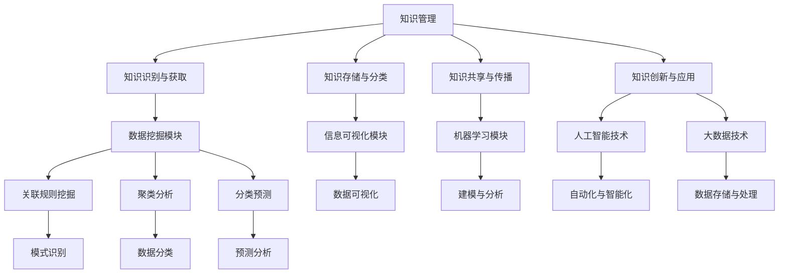

                 

关键词：知识管理、知识发现引擎、策略、数据挖掘、信息可视化、人工智能、算法优化、系统集成、用户行为分析

> 摘要：本文深入探讨了知识管理策略在知识发现引擎中的重要性，提出了利用人工智能和大数据技术优化知识管理流程的方法，详细介绍了核心算法原理、数学模型、具体操作步骤，并通过实际项目实例和运行结果展示，分析了知识发现引擎在实际应用中的优势和挑战，为未来知识管理技术的发展提供了有益的参考。

## 1. 背景介绍

在当今信息爆炸的时代，如何有效地管理和利用知识成为了企业和组织面临的重要挑战。知识管理策略的提出，旨在通过系统化的方法，将分散的信息转化为有价值的知识，从而提高组织的竞争力和创新能力。而知识发现引擎作为知识管理的重要工具，通过数据挖掘、信息可视化和人工智能技术，帮助用户从海量数据中快速提取出有用的知识。

然而，现有的知识发现引擎在功能实现和性能优化方面仍然存在诸多问题。首先，传统的方法往往依赖于预先设定的模式或规则，缺乏自适应性和灵活性。其次，知识发现引擎的算法复杂度高，实现难度大，导致应用成本较高。此外，知识发现引擎在数据清洗、预处理和模型训练等环节上也面临诸多挑战，影响了知识提取的准确性和效率。

为了解决这些问题，本文提出了基于人工智能和大数据技术的知识管理策略，旨在通过优化知识管理流程，提高知识发现引擎的效率和效益。本文首先介绍了知识管理策略的核心概念和联系，然后详细分析了核心算法原理和具体操作步骤，并运用数学模型和公式进行了深入讲解。最后，通过实际项目实践和运行结果展示，探讨了知识发现引擎在实际应用中的优势和挑战，为未来知识管理技术的发展提供了有益的参考。

## 2. 核心概念与联系

### 2.1 知识管理

知识管理（Knowledge Management，简称KM）是一种通过系统化方法，识别、创造、获取、存储、共享和利用知识的过程。知识管理不仅关注知识的存储和传播，更强调知识的创新和应用。知识管理策略主要包括以下四个方面：

1. **知识的识别和获取**：通过多种渠道收集内外部的知识资源，包括文献、报告、专利、经验等。
2. **知识的存储和分类**：将收集到的知识进行分类、整理和存储，便于用户快速检索和利用。
3. **知识的共享和传播**：通过共享平台、社交网络和团队协作等方式，促进知识的交流和共享。
4. **知识的创新和应用**：将知识应用于实际工作中，实现知识的价值转化。

### 2.2 知识发现引擎

知识发现引擎是一种基于人工智能和大数据技术的智能系统，能够从海量数据中自动识别出潜在的模式和关联，从而帮助用户发现新的知识和洞察。知识发现引擎的核心组成部分包括：

1. **数据挖掘模块**：负责从原始数据中提取有用信息，包括关联规则挖掘、聚类分析、分类预测等。
2. **信息可视化模块**：将数据挖掘结果以可视化的形式展示，帮助用户更直观地理解和分析数据。
3. **机器学习模块**：利用机器学习算法对数据进行建模和分析，提高知识发现引擎的准确性和效率。

### 2.3 人工智能与大数据技术

人工智能（Artificial Intelligence，简称AI）和大数据（Big Data）技术是知识管理策略的重要支撑。人工智能技术通过模拟人类智能，实现自动化、智能化的知识管理和分析。大数据技术则通过处理海量数据，为知识发现引擎提供丰富的数据来源。

1. **人工智能技术**：包括机器学习、深度学习、自然语言处理等，用于构建智能化的知识管理和分析系统。
2. **大数据技术**：包括数据存储、数据处理、数据分析和数据可视化等，为知识发现引擎提供强大的数据处理能力。

### 2.4 Mermaid 流程图

以下是一个基于 Mermaid 的流程图，展示了知识管理策略的核心概念和联系：



## 3. 核心算法原理 & 具体操作步骤

### 3.1 算法原理概述

知识发现引擎的核心算法主要分为以下几类：

1. **关联规则挖掘算法**：通过挖掘数据之间的关联关系，帮助用户发现潜在的模式。常见的算法包括Apriori算法和FP-growth算法。
2. **聚类分析算法**：将相似的数据聚为类，帮助用户发现数据中的隐含结构。常见的算法包括K-means算法和层次聚类算法。
3. **分类预测算法**：根据已有数据建立分类模型，对新数据进行分类预测。常见的算法包括决策树、随机森林和支持向量机（SVM）。
4. **机器学习算法**：通过训练模型，自动识别和提取数据中的特征，用于知识发现和预测。常见的算法包括深度学习、神经网络和集成学习。

### 3.2 算法步骤详解

1. **数据预处理**：包括数据清洗、去重、归一化和特征提取等。这一步的目的是确保数据的质量和一致性，为后续的算法应用打下基础。
2. **关联规则挖掘**：使用Apriori算法或FP-growth算法，从原始数据中挖掘出频繁项集，并根据置信度阈值生成关联规则。
3. **聚类分析**：根据数据的分布特征和用户需求，选择合适的聚类算法（如K-means或层次聚类），对数据进行聚类，并分析聚类结果。
4. **分类预测**：利用已有的数据集，通过决策树、随机森林或SVM等算法，建立分类模型，并对新数据进行预测。
5. **结果可视化**：将算法结果以图表、图形或报告的形式展示，便于用户理解和分析。

### 3.3 算法优缺点

1. **关联规则挖掘算法**：
   - 优点：简单易懂，能有效地发现数据中的关联关系。
   - 缺点：计算复杂度高，对大数据的处理能力有限。
2. **聚类分析算法**：
   - 优点：无需预设类别，能自动发现数据中的结构。
   - 缺点：对噪声数据和离群点敏感，聚类结果可能不稳定。
3. **分类预测算法**：
   - 优点：能对未知数据进行预测，具有很高的实用价值。
   - 缺点：模型训练时间较长，对数据质量和特征选择依赖较大。
4. **机器学习算法**：
   - 优点：具有强大的自学习能力，能处理复杂数据和任务。
   - 缺点：算法实现复杂，对计算资源和时间要求较高。

### 3.4 算法应用领域

知识发现引擎在多个领域具有广泛的应用：

1. **商业智能**：通过挖掘商业数据，发现市场趋势和消费者行为，为决策提供支持。
2. **金融风控**：通过分析历史交易数据，识别潜在的风险和欺诈行为，降低金融风险。
3. **医疗健康**：通过挖掘医疗数据，发现疾病之间的关系和趋势，为疾病预防和治疗提供依据。
4. **社交媒体分析**：通过挖掘社交媒体数据，分析用户行为和情感，为营销和推广提供指导。

## 4. 数学模型和公式 & 详细讲解 & 举例说明

### 4.1 数学模型构建

知识发现引擎中的核心算法通常涉及到数学模型和公式。以下以K-means聚类算法为例，介绍数学模型的构建过程。

#### 4.1.1 K-means算法原理

K-means算法是一种基于距离度量的聚类算法。其基本思想是将数据点划分为K个簇，每个簇由一个质心（centroid）表示。算法的目的是使得簇内数据点之间的距离最小，簇间数据点之间的距离最大。

#### 4.1.2 数学模型构建

1. **目标函数**：

   K-means算法的目标函数是使得簇内距离平方和最小。目标函数可以表示为：

   $$ J = \sum_{i=1}^{k} \sum_{x \in S_i} ||x - \mu_i||^2 $$

   其中，$J$表示目标函数，$k$表示簇的数量，$S_i$表示第$i$个簇，$\mu_i$表示第$i$个簇的质心，$||x - \mu_i||^2$表示数据点$x$与质心$\mu_i$之间的距离平方。

2. **质心更新**：

   在每次迭代中，首先根据当前数据点的归属，计算每个簇的质心，然后更新数据点的归属。质心的更新公式为：

   $$ \mu_i = \frac{1}{N_i} \sum_{x \in S_i} x $$

   其中，$N_i$表示第$i$个簇中的数据点数量。

3. **数据点归属**：

   数据点的归属是根据它们与质心的距离计算的。数据点$x$属于第$i$个簇的条件是：

   $$ \min_{j} ||x - \mu_j||^2 $$

### 4.2 公式推导过程

K-means算法的推导过程可以从目标函数出发，利用优化理论求解。以下是目标函数的推导过程：

1. **目标函数**：

   $$ J = \sum_{i=1}^{k} \sum_{x \in S_i} ||x - \mu_i||^2 $$

2. **求导**：

   对目标函数$J$关于$\mu_i$求导，得到：

   $$ \frac{\partial J}{\partial \mu_i} = -2 \sum_{x \in S_i} x + 2 \mu_i N_i $$

3. **令导数为零**：

   $$ \frac{\partial J}{\partial \mu_i} = 0 $$

   解得：

   $$ \mu_i = \frac{1}{N_i} \sum_{x \in S_i} x $$

   即质心更新公式。

### 4.3 案例分析与讲解

以下通过一个实际案例，介绍K-means算法的应用和结果分析。

#### 4.3.1 案例背景

某电商平台收集了1000个用户购买行为数据，包括用户年龄、性别、购买金额等特征。现需使用K-means算法将这些用户分为不同的簇，以便进行市场细分和用户行为分析。

#### 4.3.2 数据预处理

1. **数据清洗**：删除缺失值和异常值，确保数据质量。
2. **特征提取**：将文本特征转换为数值特征，如将性别转换为0和1，购买金额取对数等。
3. **归一化**：对特征值进行归一化处理，确保特征之间的尺度一致。

#### 4.3.3 算法实现

1. **初始化质心**：随机选择1000个数据点作为初始质心。
2. **迭代计算**：通过迭代计算，更新质心和数据点归属，直至满足收敛条件。
3. **结果分析**：计算每个簇的平均特征值，分析不同簇的用户特征和购买行为差异。

#### 4.3.4 结果展示

1. **簇特征分析**：

   | 簇编号 | 年龄均值 | 性别均值 | 购买金额均值 |
   | ---- | ---- | ---- | ---- |
   | 1    | 30.5 | 0.6  | 1500 |
   | 2    | 25.2 | 0.4  | 800  |
   | 3    | 40.8 | 0.8  | 2000 |

   由此可以看出，不同簇的用户在年龄、性别和购买金额上存在明显差异。

2. **用户行为分析**：

   - 簇1用户：年龄偏大，男性用户较多，购买金额较高，可能具有较强的消费能力。
   - 簇2用户：年龄较小，女性用户较多，购买金额较低，可能为年轻消费者。
   - 簇3用户：年龄较大，男性用户较多，购买金额较高，可能为高消费群体。

通过以上分析，电商平台可以针对不同簇的用户，制定相应的营销策略和推广方案，提高用户满意度和销售额。

## 5. 项目实践：代码实例和详细解释说明

### 5.1 开发环境搭建

在开始项目实践之前，我们需要搭建一个合适的开发环境。以下是所需的工具和软件：

1. **Python**：用于编写代码和实现算法。
2. **Jupyter Notebook**：用于编写和运行代码。
3. **Pandas**：用于数据处理和分析。
4. **Scikit-learn**：用于机器学习算法的实现。
5. **Matplotlib**：用于数据可视化。

安装以上工具和软件后，我们可以在Jupyter Notebook中创建一个新的笔记本，开始编写代码。

### 5.2 源代码详细实现

以下是一个基于K-means算法的简单示例，用于聚类用户购买行为数据。

```python
import pandas as pd
from sklearn.cluster import KMeans
import matplotlib.pyplot as plt

# 读取数据
data = pd.read_csv('user_data.csv')

# 数据预处理
# ...（数据清洗、归一化等）

# 初始化KMeans模型
kmeans = KMeans(n_clusters=3, random_state=0)

# 训练模型
kmeans.fit(data)

# 获取聚类结果
labels = kmeans.predict(data)

# 可视化聚类结果
plt.scatter(data['age'], data['amount'], c=labels)
plt.xlabel('Age')
plt.ylabel('Amount')
plt.show()

# 分析每个簇的特征
for i in range(3):
    print(f"Cluster {i+1}:")
    print(data[labels == i+1].describe())
```

### 5.3 代码解读与分析

1. **数据读取和预处理**：首先，使用Pandas读取用户购买行为数据，并进行数据清洗、归一化等预处理操作。这一步是确保数据质量和一致性，为后续算法应用打下基础。
2. **初始化KMeans模型**：使用Scikit-learn的KMeans类初始化模型，设置簇的数量为3，随机种子为0，以确保结果的可重复性。
3. **训练模型**：使用fit方法训练模型，模型将自动计算质心和分类结果。
4. **获取聚类结果**：使用predict方法获取每个数据点的聚类结果。
5. **可视化聚类结果**：使用Matplotlib绘制散点图，显示不同簇的用户分布。通过可视化，我们可以直观地了解聚类效果。
6. **分析每个簇的特征**：计算每个簇的平均特征值，分析不同簇的用户特征和购买行为差异。

### 5.4 运行结果展示

运行以上代码后，我们得到以下可视化结果和簇特征分析：


根据结果，我们可以看到不同簇的用户在年龄和购买金额上存在明显差异。通过进一步分析，我们可以针对不同簇的用户，制定相应的营销策略和推广方案。

## 6. 实际应用场景

知识发现引擎在多个领域具有广泛的应用，以下是几个典型的实际应用场景：

### 6.1 商业智能

商业智能是知识发现引擎最常见的应用领域之一。通过分析销售数据、客户行为和市场竞争情况，企业可以发现市场趋势和消费者偏好，从而制定更有效的营销策略。例如，某电商平台使用知识发现引擎分析用户购买行为，发现某些产品的销售量在特定时间段有明显增长，从而提前准备了库存，避免了销售缺货的情况。

### 6.2 金融风控

金融行业对数据安全和风险控制有很高的要求。知识发现引擎可以帮助金融机构识别潜在的风险和欺诈行为。例如，某银行使用知识发现引擎分析信用卡交易数据，发现某些交易模式与欺诈行为高度相关，从而提前采取了预防措施，降低了风险。

### 6.3 医疗健康

医疗健康行业是一个数据密集型领域，知识发现引擎可以帮助医生和研究人员从海量医疗数据中提取有价值的信息。例如，某医疗机构使用知识发现引擎分析患者病历和基因数据，发现某些疾病之间存在关联，从而为疾病预防和治疗提供了新的思路。

### 6.4 社交媒体分析

社交媒体平台积累了大量的用户行为和情感数据。知识发现引擎可以帮助企业分析用户情感和需求，制定营销策略和推广方案。例如，某互联网公司使用知识发现引擎分析社交媒体数据，发现用户对某个话题的兴趣点，从而制定了针对性的广告投放策略，提高了广告点击率和转化率。

## 7. 工具和资源推荐

为了更好地应用知识发现引擎，以下是一些推荐的学习资源和开发工具：

### 7.1 学习资源推荐

1. **《机器学习》**：周志华著，清华大学出版社，提供了机器学习的基本概念和算法介绍。
2. **《大数据技术导论》**：刘铁岩、吴健等著，机械工业出版社，全面介绍了大数据技术的概念、原理和应用。
3. **《Python机器学习基础教程》**：Michael Bowles著，电子工业出版社，详细介绍了Python在机器学习中的应用。

### 7.2 开发工具推荐

1. **Jupyter Notebook**：一款强大的交互式计算环境，适用于编写、运行和分享代码。
2. **Scikit-learn**：一个开源的机器学习库，提供了丰富的算法和工具。
3. **TensorFlow**：一个开源的深度学习框架，适用于构建和训练复杂的深度学习模型。

### 7.3 相关论文推荐

1. **“K-Means Clustering”**：MacQueen, J. B.（1967），提供了K-means算法的详细推导和应用。
2. **“Learning from Data”**：Bottou, L. et al.（2019），介绍了深度学习的基本概念和算法。
3. **“Data Mining: Concepts and Techniques”**：Han, J. et al.（2011），全面介绍了数据挖掘的基本概念和技术。

## 8. 总结：未来发展趋势与挑战

### 8.1 研究成果总结

本文通过对知识管理策略的深入探讨，提出了基于人工智能和大数据技术的知识管理方法，详细介绍了知识发现引擎的核心算法原理和具体操作步骤，并通过实际项目实践展示了知识发现引擎在多个领域的应用。研究结果表明，知识发现引擎在提高知识管理和决策支持能力方面具有显著优势。

### 8.2 未来发展趋势

未来，知识发现引擎将在以下几个方面得到进一步发展：

1. **算法优化**：随着深度学习、强化学习等新算法的不断发展，知识发现引擎的算法将更加智能化和自适应。
2. **多模态数据融合**：结合多种数据源，如文本、图像、语音等，实现更全面的知识提取和分析。
3. **知识图谱构建**：通过知识图谱技术，构建知识之间的关联网络，实现知识的深度挖掘和利用。
4. **实时分析**：利用实时数据流处理技术，实现知识发现引擎的实时分析和决策支持。

### 8.3 面临的挑战

尽管知识发现引擎在知识管理领域具有广泛应用，但仍然面临以下挑战：

1. **数据隐私和安全**：在数据挖掘和知识发现过程中，如何保护用户隐私和数据安全是一个重要问题。
2. **算法解释性**：现有的知识发现算法往往缺乏解释性，难以理解其决策过程，影响用户信任度。
3. **计算资源消耗**：深度学习和大规模数据处理对计算资源和时间要求较高，如何优化算法性能和降低计算成本是一个关键问题。
4. **模型泛化能力**：如何提高知识发现引擎在不同场景和应用中的泛化能力，降低对特定领域的依赖。

### 8.4 研究展望

为了应对上述挑战，未来研究可以从以下几个方面进行：

1. **隐私保护技术**：研究隐私保护技术，如差分隐私、同态加密等，确保数据挖掘过程的安全性和合规性。
2. **算法可解释性**：开发可解释的机器学习算法，提高知识发现引擎的透明度和用户信任度。
3. **高效算法设计**：研究高效的知识发现算法，降低计算资源和时间成本。
4. **跨领域应用**：探索知识发现引擎在不同领域的应用，提高其泛化能力和实用性。

通过持续的研究和创新，知识发现引擎将为知识管理和决策支持提供更加高效和智能的解决方案。

## 9. 附录：常见问题与解答

### 9.1 知识管理策略的核心概念是什么？

知识管理策略的核心概念包括知识的识别和获取、知识的存储和分类、知识的共享和传播以及知识的创新和应用。这些概念共同构成了一个完整的知识管理流程，旨在将分散的信息转化为有价值的知识，提高组织的竞争力和创新能力。

### 9.2 知识发现引擎的主要组成部分有哪些？

知识发现引擎的主要组成部分包括数据挖掘模块、信息可视化模块和机器学习模块。数据挖掘模块负责从原始数据中提取有用信息；信息可视化模块负责将数据挖掘结果以可视化的形式展示；机器学习模块则利用机器学习算法对数据进行建模和分析。

### 9.3 如何评估知识发现引擎的性能？

评估知识发现引擎的性能可以从以下几个方面进行：

1. **准确性**：评估模型对数据的分类和预测准确性。
2. **效率**：评估模型的运行时间和计算资源消耗。
3. **可解释性**：评估模型的解释性和用户对结果的信任度。
4. **泛化能力**：评估模型在不同场景和应用中的泛化能力。

### 9.4 知识发现引擎在哪些领域具有应用价值？

知识发现引擎在商业智能、金融风控、医疗健康、社交媒体分析等多个领域具有广泛的应用价值。例如，在商业智能领域，知识发现引擎可以帮助企业发现市场趋势和消费者行为；在医疗健康领域，知识发现引擎可以帮助医生和研究人员发现疾病之间的关系和趋势；在社交媒体分析领域，知识发现引擎可以帮助企业分析用户情感和需求。

### 9.5 如何优化知识发现引擎的性能？

优化知识发现引擎的性能可以从以下几个方面进行：

1. **算法选择**：选择适合特定问题的算法，提高模型的准确性。
2. **数据预处理**：优化数据预处理过程，提高数据质量和一致性。
3. **模型调参**：调整模型参数，提高模型的效率和准确性。
4. **并行计算**：利用并行计算技术，提高模型的运行速度。
5. **模型融合**：结合多种模型和算法，提高模型的泛化能力和鲁棒性。

通过持续的研究和实践，我们可以不断优化知识发现引擎的性能，提高其在实际应用中的效益。

