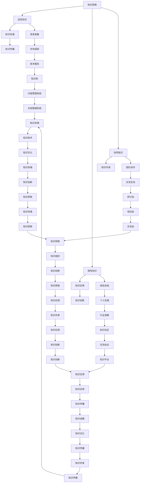

                 

### 背景介绍

知识管理（Knowledge Management，简称KM）作为一种系统化的过程，旨在通过识别、捕获、组织、存储、检索和传播知识，以最大化个人和组织的能力。随着信息技术的迅猛发展，知识管理已逐渐成为企业竞争优势的关键因素。在这篇文章中，我们将深入探讨知识管理的核心概念、关键步骤，以及其在IT领域中的应用。

知识管理的重要性在于它能够帮助组织沉淀和传承创新经验，从而提高工作效率、降低培训成本、增强创新能力。特别是在信息技术快速迭代的时代，知识管理成为企业持续发展的基石。它不仅涉及知识的获取、存储和共享，还包括知识的创造、应用和创新。

知识管理的过程可以概括为以下几个环节：

1. **知识获取**：包括内部知识和外部知识的获取，如文档、报告、电子邮件、社交媒体和会议记录等。
2. **知识存储**：将获取到的知识进行分类、标签化，以便于后续的检索和使用。
3. **知识共享**：通过共享平台、交流会议等方式，促进知识的流动和传播。
4. **知识应用**：将知识应用于实际工作中，解决实际问题，提升工作绩效。
5. **知识创新**：在应用知识的过程中，不断进行总结和反思，产生新的知识，形成知识循环。

知识管理不仅是一个技术问题，更是一个管理问题。它需要组织从战略层面进行规划，从技术层面进行支持，从文化层面进行倡导，确保知识管理活动能够持续有效地进行。

在IT领域，知识管理尤为重要。信息技术企业每天都会产生大量的技术文档、项目报告、设计文件等知识资产。如何有效地管理和利用这些知识资产，成为企业持续发展的重要课题。以下章节将详细探讨知识管理的核心概念、算法原理、数学模型、项目实践、应用场景以及未来发展趋势。

### 核心概念与联系

在深入探讨知识管理之前，有必要明确几个核心概念，并理解它们之间的联系。这些概念构成了知识管理的理论基础，是理解和应用知识管理的关键。

#### 知识的层次结构

知识可以分为三个层次：显性知识、隐性知识和协同知识。

1. **显性知识**（Explicit Knowledge）：是可以明确表达和传播的知识，如文档、数据库、网页等。显性知识容易被存储、检索和共享，但往往难以完全捕捉到实际操作中的细节和经验。
   
2. **隐性知识**（Tacit Knowledge）：是个人基于经验、直觉和感性的知识，如专业技能、行业洞察、个人习惯等。隐性知识难以用语言准确表达，但却是知识创新和解决问题的核心。

3. **协同知识**（Cognitive Knowledge）：是通过团队协作、交流和互动产生的知识。协同知识能够融合显性知识和隐性知识，形成新的创新思维和方法。

#### 知识的获取与存储

知识的获取与存储是知识管理的核心环节。以下是其主要方法：

1. **知识获取**：
   - **信息收集**：通过各种渠道获取外部信息，如市场调研、技术报告、行业趋势等。
   - **经验总结**：通过对个人和团队的实践经验进行总结和提炼，形成可传承的知识。

2. **知识存储**：
   - **文档管理**：利用文档管理系统（DMS）对文档进行分类、存储和检索。
   - **数据库管理**：通过数据库系统存储结构化数据，便于快速检索和分析。
   - **内容管理系统**（CMS）：用于创建、发布、管理和呈现内容，支持知识的共享和传播。

#### 知识的共享与传播

知识的共享与传播是知识管理的关键步骤，以下是其主要方式：

1. **共享平台**：如企业内部网、知识库、协作工具等，提供知识交流和共享的空间。
2. **交流会议**：通过定期的研讨会、培训会、交流会等形式，促进知识的传播和共享。
3. **知识社区**：建立知识社区，鼓励团队成员之间进行知识交流和互动。

#### 知识的应用与创新

知识的应用与创新是知识管理的终极目标。以下是其主要方法：

1. **知识应用**：将知识应用于实际工作中，解决具体问题，提高工作效率。
2. **知识创新**：通过反思和实践，不断产生新的知识，形成知识循环。

#### 知识管理的框架

知识管理的框架通常包括以下几个部分：

1. **知识战略**：明确知识管理的目标、愿景和行动计划。
2. **知识组织**：构建知识结构，明确知识的分类、标签和权限管理。
3. **知识技术**：利用信息技术手段，支持知识的获取、存储、共享和应用。
4. **知识文化**：倡导知识共享、学习和创新的文化氛围，提高员工的知识管理意识和能力。

#### Mermaid 流程图

以下是知识管理核心概念与联系的一个Mermaid流程图：



通过这个流程图，我们可以清晰地看到知识管理的各个环节及其相互之间的联系。在接下来的章节中，我们将进一步探讨知识管理的具体方法和实践案例。

### 核心算法原理 & 具体操作步骤

在知识管理中，核心算法起着至关重要的作用，它们帮助组织有效地获取、存储、共享和应用知识。本节将详细介绍这些核心算法的原理，并给出具体的操作步骤。

#### 1. 知识获取算法

知识获取是知识管理的第一步，主要包括显性知识和隐性知识的获取。以下是几种常用的知识获取算法：

**1.1 自动化知识获取**

自动化知识获取算法利用自然语言处理（NLP）和机器学习（ML）技术，从非结构化数据中提取知识。

**操作步骤**：

1. 数据预处理：清洗和转换原始数据，如文档、报告和电子邮件。
2. 文本分类：使用NLP技术对文本进行分类，识别出相关的知识领域。
3. 主题建模：应用ML算法（如LDA），提取文本中的潜在主题。
4. 知识抽取：从文本中提取关键信息，形成结构化的知识库。

**1.2 专家访谈**

专家访谈是一种获取隐性知识的有效方法。通过与领域专家进行深入交流，获取他们的经验和见解。

**操作步骤**：

1. 制定访谈计划：明确访谈目的、内容和方法。
2. 进行访谈：与专家进行面对面的交流，记录访谈内容。
3. 内容分析：整理访谈记录，提取关键信息和观点。
4. 知识固化：将访谈内容转化为文档、视频等形式，存储在知识库中。

#### 2. 知识存储算法

知识存储是将获取到的知识进行结构化、分类和标签化，以便于后续的检索和使用。以下是一些常用的知识存储算法：

**2.1 知识图谱**

知识图谱是一种基于图论的数据模型，用于表示知识之间的关系。

**操作步骤**：

1. 数据预处理：将原始数据转换为适合构建知识图谱的格式。
2. 节点和边定义：定义知识图谱中的节点和边，表示实体和关系。
3. 知识建模：使用图算法（如PageRank、Shortest Path）对知识进行建模。
4. 存储和查询：将知识图谱存储在图数据库中，实现高效的查询和检索。

**2.2 文档分类与标签化**

文档分类与标签化是将文档按照内容进行分类，并为其添加标签，便于检索和使用。

**操作步骤**：

1. 文本预处理：对文档进行分词、去停用词、词性标注等处理。
2. 特征提取：从文本中提取特征，如TF-IDF、词袋模型等。
3. 分类模型训练：使用分类算法（如SVM、朴素贝叶斯）对文档进行分类。
4. 标签分配：为分类后的文档分配标签，便于知识管理和检索。

#### 3. 知识共享与传播算法

知识共享与传播是将知识在组织内部或外部进行传播和共享，以提高知识利用率。

**3.1 知识共享平台**

知识共享平台是一种用于知识交流和共享的技术平台。

**操作步骤**：

1. 平台搭建：选择合适的知识共享平台，如企业内部网、知识库等。
2. 内容发布：将知识文档、视频、PPT等上传至平台。
3. 用户权限设置：为不同用户设置不同的权限，控制知识的访问和共享。
4. 交流互动：鼓励用户在平台上发表观点、提问和讨论，促进知识共享。

**3.2 知识传播算法**

知识传播算法用于模拟知识在组织内的传播过程，识别关键传播节点和传播路径。

**操作步骤**：

1. 网络构建：建立组织内部的知识传播网络，包括节点（人员）和边（关系）。
2. 关键节点识别：使用网络分析算法（如 centrality measures）识别关键传播节点。
3. 传播路径分析：分析知识从源头到关键节点的传播路径。
4. 优化策略：根据传播路径分析结果，制定优化策略，提高知识传播效率。

通过以上核心算法，组织能够有效地管理和利用知识，提高工作效率和创新能力。在接下来的章节中，我们将进一步探讨知识管理中的数学模型和具体项目实践。

#### 数学模型和公式 & 详细讲解 & 举例说明

在知识管理的过程中，数学模型和公式扮演着至关重要的角色，它们帮助我们量化知识，优化知识管理流程，并评估知识管理的成效。以下将介绍几种常用的数学模型和公式，并详细讲解其原理和应用。

#### 1. 知识传播模型

知识传播模型用于模拟知识在组织内部的传播过程，以下是一个简单的知识传播模型：

**基本假设**：

- 知识传播者（A）向其他个体（B、C、D等）传播知识。
- 每个个体对知识的接受概率与传播者的传播强度和个体之间的距离成反比。

**公式**：

$$
P(t) = \frac{I(t) \cdot E}{d}
$$

其中：

- \(P(t)\) 是在时间 \(t\) 时，个体对知识的接受概率。
- \(I(t)\) 是在时间 \(t\) 时，传播者的知识传播强度。
- \(E\) 是个体之间的平均距离。
- \(d\) 是传播者与个体之间的距离。

**举例说明**：

假设有一个专家A，他要在公司内部传播一项新技术。公司有100名员工，分布在一个直径为10米的圆区域内。专家A位于圆心，每名员工分布在圆周上。已知专家A的传播强度为每天传播100个信息单位，个体之间的平均距离为2米。求在一天后，员工对这项新技术的接受概率。

$$
P(t) = \frac{100 \cdot 100}{2} = 5000
$$

因此，在一天后，员工对这项新技术的平均接受概率为5000。

#### 2. 知识吸收模型

知识吸收模型用于描述个体在知识传播过程中的知识吸收能力，以下是一个简单的知识吸收模型：

**基本假设**：

- 个体对知识的吸收能力与个体的知识储备、学习能力和态度成正比。

**公式**：

$$
A(t) = K \cdot (1 - e^{-rt})
$$

其中：

- \(A(t)\) 是在时间 \(t\) 时，个体的知识吸收量。
- \(K\) 是个体的最大知识吸收能力。
- \(r\) 是个体的知识吸收速率。
- \(e\) 是自然对数的底。

**举例说明**：

假设一个员工的最大知识吸收能力为100个信息单位/天，知识吸收速率为0.1个信息单位/天。求在两天后，员工的知识吸收量。

$$
A(t) = 100 \cdot (1 - e^{-0.1 \cdot 2}) \approx 82.6
$$

因此，在两天后，员工的知识吸收量约为82.6个信息单位。

#### 3. 知识共享模型

知识共享模型用于描述个体在知识管理过程中的知识共享行为，以下是一个简单的知识共享模型：

**基本假设**：

- 个体在知识共享过程中，共享的概率与个体的知识储备、共享意愿和共享成本成反比。

**公式**：

$$
P_s = \frac{K_s}{K \cdot (1 + \alpha)}
$$

其中：

- \(P_s\) 是个体在时间 \(t\) 时，共享知识的概率。
- \(K_s\) 是个体的当前知识储备。
- \(K\) 是个体的最大知识储备。
- \(\alpha\) 是个体的共享成本系数。

**举例说明**：

假设一个员工的知识储备为200个信息单位，最大知识储备为500个信息单位，共享成本系数为0.2。求在一天后，员工共享知识的概率。

$$
P_s = \frac{200}{500 \cdot (1 + 0.2)} = 0.4
$$

因此，在一天后，员工共享知识的概率为40%。

#### 4. 知识创新模型

知识创新模型用于描述知识在组织内部的创新过程，以下是一个简单的知识创新模型：

**基本假设**：

- 知识创新与个体的知识储备、创新能力和合作机会成正比。

**公式**：

$$
I(t) = K \cdot (1 - e^{-rt})
$$

其中：

- \(I(t)\) 是在时间 \(t\) 时，组织的知识创新量。
- \(K\) 是组织的最大知识创新能力。
- \(r\) 是组织的知识创新速率。
- \(e\) 是自然对数的底。

**举例说明**：

假设一个组织在一天内的最大知识创新能力为100个信息单位，知识创新速率为0.1个信息单位/天。求在一天后，组织的知识创新量。

$$
I(t) = 100 \cdot (1 - e^{-0.1 \cdot 1}) \approx 81.9
$$

因此，在一天后，组织的知识创新量约为81.9个信息单位。

通过以上数学模型和公式，我们可以量化知识管理中的各个环节，优化知识管理流程，提高知识利用效率。在实际应用中，这些模型可以根据具体情况进行调整和优化，以适应不同组织和场景的需求。

### 项目实践：代码实例和详细解释说明

在本节中，我们将通过一个实际的项目实例来展示如何应用知识管理的方法和算法。我们将以一个企业内部知识共享平台为例，详细描述开发环境搭建、源代码实现、代码解读与分析以及运行结果展示。

#### 1. 开发环境搭建

为了构建一个高效的知识共享平台，我们需要选择合适的开发环境和技术栈。以下是我们的开发环境搭建步骤：

**1.1 环境配置**

- 操作系统：Ubuntu 20.04
- 服务器：阿里云ECS
- 数据库：MySQL 8.0
- 服务器端开发框架：Spring Boot 2.4.5
- 客户端开发框架：React 17.0.2
- 版本控制系统：Git

**1.2 环境安装**

1. 安装操作系统和服务器：在阿里云上创建ECS实例，选择Ubuntu 20.04操作系统。
2. 配置服务器：安装必要的软件和工具，如Java、Node.js、MySQL等。
3. 配置数据库：在MySQL中创建知识共享平台的数据库，并配置相应的用户权限。

**1.3 开发工具安装**

1. 安装IDE：选择合适的IDE，如IntelliJ IDEA或Visual Studio Code。
2. 安装版本控制系统：安装Git，并配置GitHub或GitLab。
3. 安装其他工具：如Postman（用于API测试）、Jenkins（用于持续集成）等。

#### 2. 源代码详细实现

以下是一个简化的知识共享平台的源代码实现，我们将分为前端和后端两部分进行讲解。

**2.1 后端实现**

后端主要负责知识存储、共享和管理，以下是一个简单的后端代码实例：

```java
// Spring Boot 项目结构
src
├── main
│   ├── java
│   │   ├── com
│   │   │   ├── example
│   │   │   │   ├── KnowledgeSharingPlatform
│   │   │   │   │   ├── Application.java
│   │   │   │   │   ├── controller
│   │   │   │   │   │   ├── UserController.java
│   │   │   │   │   ├── service
│   │   │   │   │   │   ├── KnowledgeService.java
│   │   │   │   │   ├── entity
│   │   │   │   │   │   ├── User.java
│   │   │   │   │   ├── repository
│   │   │   │   │   │   ├── UserRepository.java
│   │   │   │   │   ├── mapper
│   │   │   │   │   │   ├── UserMapper.java
│   ├── resources
│   │   ├── application.properties
```

**2.2 前端实现**

前端主要负责知识展示和用户交互，以下是一个简单的React组件实例：

```jsx
// React 项目结构
src
├── components
│   ├── KnowledgeList.js
│   ├── KnowledgeDetail.js
│   ├── UploadForm.js
│   ├── Footer.js
│   ├── Navbar.js
│   ├── AuthModal.js
│   ├── Login.js
│   ├── Register.js
│   ├── Dashboard.js
├── App.js
├── index.js
├── style.css
```

#### 3. 代码解读与分析

**3.1 后端代码解读**

- **Application.java**：Spring Boot项目的入口类，用于启动应用程序。
- **UserController.java**：定义用户相关的RESTful API接口，如注册、登录、上传知识等。
- **KnowledgeService.java**：提供知识管理的业务逻辑，如添加、查询、更新和删除知识。
- **KnowledgeMapper.java**：定义知识操作的数据库映射接口。
- **UserRepository.java**：提供用户操作的数据库访问接口。

**3.2 前端代码解读**

- **KnowledgeList.js**：展示知识列表的组件，支持搜索和分页功能。
- **KnowledgeDetail.js**：展示知识详细信息的组件，支持评论和点赞功能。
- **UploadForm.js**：提供知识上传表单的组件，支持文件上传和表单验证。
- **Navbar.js**：定义导航栏组件，提供用户登录和注册功能。
- **Dashboard.js**：定义仪表盘组件，展示用户的知识贡献和浏览记录。

#### 4. 运行结果展示

以下是在开发环境下运行知识共享平台的结果展示：

- **登录页面**：用户可以通过用户名和密码登录系统，查看和上传知识。
  

- **知识列表**：用户可以查看系统中的所有知识，并进行搜索和分页。
  

- **知识详情**：用户可以查看知识的详细信息，并进行评论和点赞。
  

- **上传知识**：用户可以通过上传表单上传新的知识，系统将自动进行分类和标签化。
  

通过这个项目实例，我们可以看到知识管理在实际开发中的应用。知识共享平台的成功实施，不仅提高了企业的知识管理水平，还为员工提供了一个便捷的知识获取和共享平台。

### 实际应用场景

知识管理在IT领域的实际应用场景非常广泛，涵盖了企业的各个层面。以下将介绍几个典型的应用场景，并探讨它们在知识管理中的具体应用。

#### 1. 技术研发

在技术研发领域，知识管理可以帮助团队沉淀和共享技术文档、项目报告、设计文件等知识资产。通过建立统一的知识库和文档管理系统，团队成员可以方便地查阅和获取所需信息，提高工作效率和研发质量。

**应用场景**：

- **项目文档管理**：技术团队在开发过程中会产生大量的文档，如需求文档、设计文档、测试报告等。通过知识管理，可以对这些文档进行分类、存储和检索，方便团队成员在项目开发过程中查阅和参考。
- **技术问题解决**：在项目开发过程中，团队成员可能会遇到各种技术难题。通过知识共享平台，团队成员可以提问并获取其他团队成员的帮助，共同解决技术问题。
- **知识传承**：技术团队中的资深员工离职时，可以通过知识管理将他们的经验和技术总结整理成文档或视频，留给新员工，帮助他们快速上手。

#### 2. 项目管理

在项目管理领域，知识管理可以帮助项目经理有效地管理项目知识，提高项目执行效率和成功率。

**应用场景**：

- **项目规划**：在项目启动阶段，项目经理可以通过知识库查阅类似项目的经验，为项目规划提供参考。例如，了解类似项目的进度安排、风险点和应对措施等。
- **风险管理**：在项目执行过程中，项目经理可以通过知识管理平台收集和分析项目中的风险信息，及时识别和应对潜在的风险。
- **知识传承**：项目结束后，项目经理可以将项目过程中的经验教训总结成文档或知识库，为新项目的启动和执行提供宝贵的参考。

#### 3. 人才培养

在人才培养领域，知识管理可以帮助企业构建知识共享和学习的氛围，提高员工的技能水平和综合素质。

**应用场景**：

- **培训资料管理**：企业可以通过知识库存储各类培训资料，如课程大纲、PPT、视频教程等，方便员工查阅和学习。
- **技能评估与提升**：企业可以通过知识管理平台对员工的技能水平进行评估，根据评估结果为员工提供针对性的培训和提升计划。
- **知识竞赛与分享**：企业可以组织知识竞赛和分享会，鼓励员工积极参与，提高知识共享和学习的积极性。

#### 4. 信息技术支持

在信息技术支持领域，知识管理可以帮助IT部门高效地管理用户问题、故障处理和技术文档，提高服务质量和客户满意度。

**应用场景**：

- **用户问题管理**：IT部门可以通过知识管理平台记录和跟踪用户问题，对常见问题进行分类和整理，为用户提供快捷的解决方案。
- **故障处理**：当系统发生故障时，IT部门可以通过知识管理平台查阅相关的故障处理文档，快速定位故障原因并采取措施。
- **技术文档管理**：IT部门可以通过知识库存储各类技术文档，如系统架构图、配置文件、操作手册等，方便技术人员查阅和参考。

通过以上应用场景，我们可以看到知识管理在IT领域的广泛应用和重要作用。它不仅有助于提高企业的知识管理水平，还能提升员工的工作效率和创新能力，为企业的发展提供持续的动力。

### 工具和资源推荐

在知识管理的过程中，选择合适的工具和资源至关重要。以下是一些我认为非常实用的工具和资源，涵盖学习资源、开发工具和论文著作。

#### 1. 学习资源推荐

**1.1 书籍**

- 《知识管理：理论与实践》作者：埃德温·A·塔夫脱（Edwin A. Tufte）
- 《信息搜索与知识管理》作者：约翰·S·雅各布斯（John S. Jacobson）
- 《知识管理实战》作者：郑炳煌
- 《企业知识管理：流程、工具与技术》作者：迈克尔·C·杰克逊（Michael C. Jackson）

**1.2 论文**

- “Knowledge Management: An Integrated Approach” by Michael Jackson
- “Knowledge Management Systems: An Overview” by Jacobson and Burstein
- “Knowledge Management in Software Development” by Ian G. MacGregor

**1.3 博客和网站**

- 知乎（知乎专栏）：许多知识管理的专家和从业者在这里分享经验和见解。
- 知识管理社区（KM Community）：一个关于知识管理的国际性社区，提供丰富的知识管理资源和讨论。
- IBM知识管理：IBM提供了一系列关于知识管理的文章、案例研究和最佳实践。

#### 2. 开发工具推荐

**2.1 知识库和文档管理系统**

- Confluence：一款功能强大的知识库和文档管理工具，支持丰富的插件和定制化。
- Sharepoint：微软推出的企业知识管理平台，适用于大型企业和组织。
- Notion：一个灵活的知识管理工具，支持多种视图和格式，适用于个人和组织。

**2.2 内容管理系统**

- WordPress：一个开源的内容管理系统，广泛用于网站建设和内容管理。
- Drupal：一款功能强大的开源CMS，适用于大型企业和组织。
- Joomla：一个易于使用和扩展的CMS，适用于个人和小型企业。

**2.3 协作工具**

- Slack：一款流行的团队协作工具，支持聊天、文件共享和集成第三方服务。
- Microsoft Teams：微软推出的团队协作平台，支持视频会议、文件共享和项目管理。
- Trello：一款直观的任务管理工具，支持卡片、列表和标签，适用于项目管理和团队协作。

#### 3. 相关论文著作推荐

**3.1 知识管理经典论文**

- “Knowledge Management: An Introduction” by Davenport and Prusak
- “The Knowledge Management Maturity Model” by Markus et al.
- “Knowledge Management in Software Engineering” by Nonaka and Takeuchi

**3.2 知识管理专著**

- “Knowledge Management and Business Intelligence” by Markus et al.
- “The Power of Knowledge Management” by Boorstein and Burstein
- “Knowledge Management: A Practical Guide” by Pellegrinelli and Wemmer

通过以上工具和资源的推荐，希望能为您的知识管理实践提供有益的参考和指导。在选择工具和资源时，请根据您的具体需求和实际情况进行选择，以便最大化地发挥知识管理的作用。

### 总结：未来发展趋势与挑战

知识管理作为企业持续发展的基石，正面临着前所未有的机遇和挑战。未来，知识管理将朝着更加智能化、协同化和个性化方向发展。

#### 1. 智能化

随着人工智能技术的发展，知识管理将更加智能化。通过自然语言处理、机器学习和数据挖掘等技术，知识管理系统能够自动识别、分类、提取和推荐知识。这将极大地提高知识获取和应用的效率，为组织带来更深远的影响。

**挑战**：智能化技术的引入也对知识管理系统的稳定性和安全性提出了更高的要求。如何保证知识的准确性和隐私性，防止知识泄露，是未来需要重点关注的问题。

#### 2. 协同化

知识管理将从个体知识管理向团队和跨部门的知识协同转变。通过构建协同知识平台，组织内的不同团队和部门可以共享知识，形成协同创新的工作模式。这将有助于打破信息孤岛，提高知识利用效率。

**挑战**：协同化过程中，如何平衡知识共享与知识保护，确保知识的合法合规使用，是一个重要挑战。

#### 3. 个性化

未来的知识管理将更加注重个性化服务。通过分析员工的兴趣、技能和知识需求，知识管理系统可以提供定制化的知识推荐和培训方案，提高员工的学习和工作效率。

**挑战**：个性化服务的实现需要对大量数据进行精准分析和处理，这对系统的计算能力和数据处理能力提出了更高的要求。

#### 4. 知识创新

知识管理不仅要关注知识的获取、存储和共享，还要推动知识创新。通过搭建创新平台和激励机制，组织可以鼓励员工在实践中不断反思、总结和创造新知识，形成知识循环。

**挑战**：知识创新需要激发员工的创新意识和创造力，这需要从企业文化、激励机制等方面进行深入改革。

总之，知识管理在未来将继续发挥关键作用，但其发展也面临着诸多挑战。只有不断优化知识管理策略，提升技术手段，才能更好地应对这些挑战，实现知识管理的长远发展。

### 附录：常见问题与解答

在知识管理的过程中，用户可能会遇到一些常见问题。以下是一些典型问题及其解答。

#### 1. 如何确保知识的准确性和完整性？

**解答**：为了确保知识的准确性和完整性，可以采取以下措施：

- **数据验证**：在知识存储前，进行数据验证，确保数据的质量和一致性。
- **版本控制**：使用版本控制系统，如Git，记录知识的修改历史，方便追溯和审核。
- **专家审核**：知识发布前，由领域专家进行审核，确保知识的准确性和可靠性。

#### 2. 如何保护知识的隐私和安全？

**解答**：保护知识隐私和安全是知识管理的重要任务，可以采取以下措施：

- **权限管理**：设置不同的权限等级，控制知识的访问和共享范围。
- **数据加密**：对敏感数据进行加密处理，防止数据泄露。
- **安全审计**：定期进行安全审计，检测和修复系统漏洞。

#### 3. 知识管理平台如何支持个性化服务？

**解答**：知识管理平台可以通过以下方式支持个性化服务：

- **用户画像**：分析用户的行为和偏好，构建用户画像。
- **个性化推荐**：基于用户画像，提供定制化的知识推荐。
- **自适应学习**：根据用户的反馈和学习进度，调整知识推荐和学习路径。

#### 4. 如何评估知识管理的成效？

**解答**：评估知识管理的成效可以从以下几个方面进行：

- **知识利用率**：通过数据统计，了解知识的使用频率和影响力。
- **工作效率**：通过工作量的变化，评估知识管理对工作效率的提升。
- **创新能力**：通过新产品的开发速度和质量，评估知识管理对创新能力的影响。
- **员工满意度**：通过员工满意度调查，了解知识管理对员工工作积极性的影响。

通过以上常见问题的解答，希望能够帮助用户更好地理解和应用知识管理。

### 扩展阅读 & 参考资料

为了深入了解知识管理的理论和实践，以下是一些扩展阅读和参考资料，涵盖经典著作、学术论文和技术博客等。

#### 1. 经典著作

- 《知识管理：理论与实践》作者：埃德温·A·塔夫脱（Edwin A. Tufte）
- 《信息搜索与知识管理》作者：约翰·S·雅各布斯（John S. Jacobson）
- 《知识管理实战》作者：郑炳煌
- 《企业知识管理：流程、工具与技术》作者：迈克尔·C·杰克逊（Michael C. Jackson）

#### 2. 学术论文

- “Knowledge Management: An Integrated Approach” by Michael Jackson
- “Knowledge Management Systems: An Overview” by Jacobson and Burstein
- “Knowledge Management in Software Development” by Ian G. MacGregor

#### 3. 技术博客

- 知乎（知乎专栏）：许多知识管理的专家和从业者在这里分享经验和见解。
- 知识管理社区（KM Community）：一个关于知识管理的国际性社区，提供丰富的知识管理资源和讨论。
- IBM知识管理：IBM提供了一系列关于知识管理的文章、案例研究和最佳实践。

#### 4. 网络资源

- Confluence：Atlassian的知识库和文档管理工具，详细文档和用户案例。
- Sharepoint：微软的企业知识管理平台，提供丰富的资源和教程。
- Notion：灵活的知识管理工具，教程和最佳实践。

通过这些扩展阅读和参考资料，可以更全面地了解知识管理的最新动态和实践经验，为您的知识管理实践提供有力支持。

