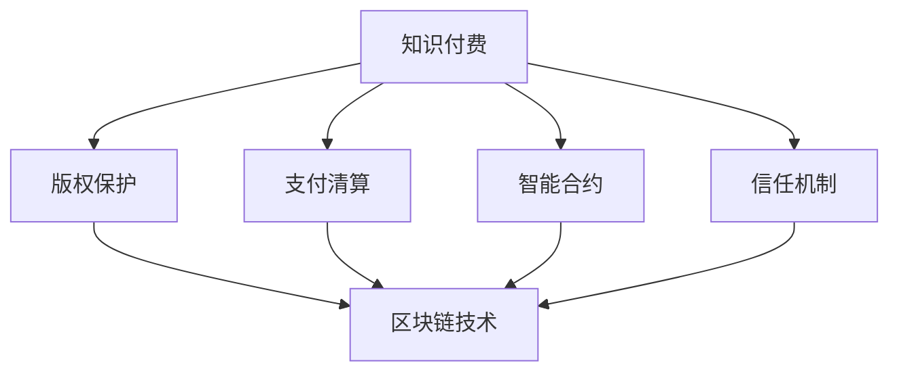
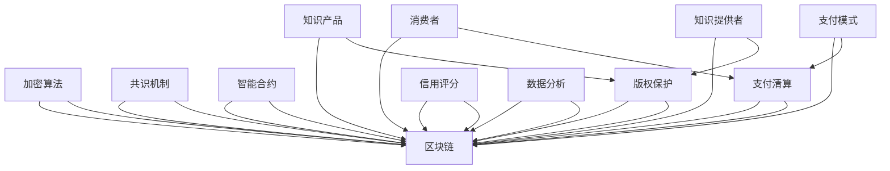

                 

### 1. 背景介绍

在当今知识经济时代，知识付费作为一种新兴商业模式，正在迅速崛起并引发广泛关注。知识付费，指的是消费者为获取特定知识或技能，自愿付费给知识提供者的一种经济活动。这种模式的出现，不仅满足了知识共享的需求，也为知识创造者提供了可持续的收入来源，从而推动了知识经济的蓬勃发展。

随着互联网和区块链技术的不断进步，知识付费领域迎来了新的变革。区块链技术以其去中心化、不可篡改和透明性等特点，为知识付费提供了全新的解决方案。通过区块链技术，知识付费可以实现更加公平、安全和高效的支付流程，解决传统知识付费模式中的信任问题。

本文将围绕知识付费的区块链应用与发展展开讨论。首先，我们将探讨知识付费的背景和现状，分析其在知识经济中的重要地位。接着，我们将介绍区块链技术的基本概念和原理，并阐述其在知识付费中的应用优势。随后，我们将详细解析区块链在知识付费中的具体应用场景，如版权保护、支付清算和智能合约等。最后，我们将总结未来知识付费的发展趋势和面临的挑战，并提出相关建议。

通过本文的讨论，我们希望能够为读者提供一个全面、深入的理解，帮助大家更好地把握知识付费在区块链技术下的发展方向，为这一领域的创新和实践提供有益的参考。

### 2. 核心概念与联系

#### 2.1 知识付费的概念与内涵

知识付费，指的是消费者为了获取特定的知识、技能或信息，自愿支付相应费用的一种经济行为。其核心在于将知识作为一种商品进行市场化运作，使知识创造者能够通过提供知识服务获得收益。知识付费不仅满足了用户对知识的需求，也为知识工作者提供了稳定的收入来源，从而促进了知识的生产和传播。

知识付费的内涵包括以下几个方面：

1. **用户需求驱动**：知识付费的兴起源于用户对知识的强烈需求，包括职业发展、兴趣爱好、生活技能等各个领域。
2. **市场化运作**：知识付费将知识作为一种商品，通过市场化机制进行资源配置，实现了知识的价值最大化。
3. **知识创造者收益**：知识付费使知识创造者能够通过提供知识服务获得经济回报，从而激发知识创造的积极性。
4. **知识传播与共享**：知识付费促进了知识的传播与共享，使得优质知识资源能够更广泛地传播，提高整体社会知识水平。

#### 2.2 区块链技术的概念与原理

区块链技术是一种分布式数据库技术，通过加密算法和共识机制，实现数据的去中心化存储和验证。区块链的每一个区块都包含一定数量的事务记录，这些记录通过加密算法和密码学原理进行保护，使得数据不可篡改且具有透明性。

区块链技术的主要特点包括：

1. **去中心化**：区块链通过分布式网络运行，无需中心化的管理机构，降低了信任成本。
2. **数据不可篡改**：区块链上的数据一旦被记录，无法被篡改，保证了数据的真实性和完整性。
3. **透明性**：区块链上的数据对所有参与者都是透明的，提高了交易的透明度和公正性。
4. **安全性**：区块链利用加密算法和共识机制，保障了数据的安全性和隐私性。

区块链的基本架构包括：

1. **数据层**：存储区块链中的数据，包括区块、交易记录等。
2. **网络层**：负责网络节点的通信，实现数据的传输和验证。
3. **共识层**：通过共识算法确保区块链的数据一致性和安全性。
4. **激励层**：激励参与节点为区块链网络提供计算资源和存储资源。
5. **合约层**：实现智能合约的编写和执行，提高交易的自动化和智能化。

#### 2.3 知识付费与区块链技术的联系

知识付费与区块链技术的结合，为知识经济带来了新的发展机遇。以下从多个方面阐述二者的联系：

1. **版权保护**：区块链技术可以为知识付费提供强大的版权保护机制。通过区块链，知识创作者可以将原创作品进行登记，确保作品的所有权和版权归属，从而防止侵权行为的发生。

2. **支付清算**：区块链技术可以实现去中心化的支付清算，降低交易成本，提高支付效率。知识付费交易通过区块链进行，可以确保交易的安全性和透明性，同时减少中介环节，提高交易效率。

3. **智能合约**：智能合约是区块链技术的重要组成部分，可以自动执行预先设定的合同条款。在知识付费领域，智能合约可以用于自动完成知识交付和付款流程，提高交易的可靠性和效率。

4. **信任机制**：区块链技术通过去中心化和透明性的特点，建立了强大的信任机制。知识付费过程中，消费者和知识提供者之间的信任问题得以解决，推动了知识付费的健康发展。

图 1 展示了知识付费与区块链技术的联系及其应用场景。



通过上述分析，我们可以看出，知识付费与区块链技术的结合，不仅为知识经济带来了新的发展机遇，也为知识付费的商业模式创新提供了有力支持。接下来，我们将进一步探讨区块链在知识付费中的具体应用，以期为这一领域的未来发展提供更多启示。

#### 2.4 核心概念原理与架构

在深入探讨知识付费与区块链技术的结合之前，我们需要首先明确相关核心概念原理及其架构。以下是知识付费和区块链技术的核心概念原理及其相互关系的详细阐述。

##### 2.4.1 知识付费的核心概念

1. **知识产品**：知识产品是指具有特定知识内容，能够满足用户特定需求的物品或服务。知识产品可以是线上课程、专业咨询、研究报告、电子书籍等形式。
2. **消费者**：消费者是指为获取知识产品而付费的个人或组织，其需求驱动了知识付费市场的发展。
3. **知识提供者**：知识提供者是指创造和提供知识产品的个人或机构，包括教师、专家、企业等。
4. **支付模式**：支付模式包括一次性付费、订阅制、按需付费等，不同的支付模式影响着消费者的购买决策和知识提供者的收益模式。

##### 2.4.2 区块链技术的核心概念

1. **区块链**：区块链是一个分布式数据库，由多个区块组成，每个区块包含一定数量的事务记录。区块链通过加密算法和共识机制，确保数据的去中心化存储和验证。
2. **加密算法**：加密算法用于保护区块链上的数据安全，确保数据在传输和存储过程中的保密性和完整性。
3. **共识机制**：共识机制是区块链网络节点之间达成一致的方式，确保区块链数据的真实性和一致性。
4. **智能合约**：智能合约是区块链上的自执行合约，通过编程语言实现，自动执行预设的合同条款。

##### 2.4.3 知识付费与区块链技术的关联架构

知识付费与区块链技术的结合，可以通过以下架构实现：

1. **知识产品登记与版权保护**：知识提供者将知识产品上传至区块链，并通过智能合约进行版权登记。区块链技术的去中心化和不可篡改特性，确保了知识产品的版权归属，防止侵权行为。
2. **支付清算**：消费者通过区块链上的去中心化支付网络进行支付，智能合约自动执行付款和知识交付流程，确保支付的安全性和透明性。
3. **信用评分与信誉机制**：区块链技术可以记录用户的购买行为和评价，建立信用评分和信誉机制，提高消费者的信任度和知识提供者的服务质量。
4. **数据分析与优化**：通过分析区块链上的数据，可以为知识提供者提供精准的市场定位和优化建议，提高知识付费产品的市场竞争力。

以下是一个简化的知识付费与区块链技术的关联架构图，展示了核心概念及其相互关系。



通过上述架构，我们可以看到，知识付费与区块链技术的结合不仅实现了版权保护、支付清算和信用评分等核心功能，还为知识经济提供了全新的发展模式。接下来，我们将进一步探讨区块链技术在知识付费中的具体应用，以期为知识付费的发展提供更多实践参考。

#### 2.5 核心算法原理 & 具体操作步骤

在深入探讨知识付费与区块链技术的结合时，了解区块链技术的核心算法原理和具体操作步骤是至关重要的。以下将详细解析区块链技术中的关键算法，并阐述其具体操作步骤。

##### 2.5.1 加密算法

加密算法是区块链技术中用于保护数据安全的核心组件。常见的加密算法包括哈希算法、对称加密算法和非对称加密算法。

1. **哈希算法**：哈希算法是一种将任意长度的数据转换成固定长度散列值（哈希值）的算法。比特币使用的SHA-256算法就是一种常见的哈希算法。其特点是将输入数据经过处理后输出一个固定的哈希值，且无法通过哈希值反推出原始数据。

   **具体操作步骤**：
   - 输入原始数据；
   - 通过SHA-256算法计算哈希值；
   - 输出哈希值。

2. **对称加密算法**：对称加密算法使用相同的密钥对数据进行加密和解密。常见的对称加密算法包括AES、DES等。其特点是可以高效地加密大量数据，但密钥的传输和管理较为复杂。

   **具体操作步骤**：
   - 选择对称加密算法和密钥；
   - 使用密钥对数据进行加密；
   - 输出加密后的数据。

3. **非对称加密算法**：非对称加密算法使用一对密钥（公钥和私钥）进行加密和解密。公钥用于加密，私钥用于解密。常见的非对称加密算法包括RSA、ECC等。其特点是安全性较高，但加密和解密速度相对较慢。

   **具体操作步骤**：
   - 生成公钥和私钥对；
   - 使用公钥对数据进行加密；
   - 使用私钥对加密后的数据进行解密。

##### 2.5.2 共识算法

共识算法是区块链网络节点之间达成一致的方式，确保区块链数据的真实性和一致性。常见的共识算法包括工作量证明（PoW）、权益证明（PoS）和委托权益证明（DPoS）。

1. **工作量证明（PoW）**：PoW通过计算难题来确保区块链的安全性和一致性。节点需要通过解决复杂的数学难题来证明其工作量，从而获得记账权和奖励。

   **具体操作步骤**：
   - 节点接收交易数据并生成区块；
   - 节点尝试解决数学难题（例如比特币中的SHA-256哈希碰撞问题）；
   - 当节点成功解决难题后，生成一个有效的区块；
   - 网络中的其他节点验证区块的有效性；
   - 确认无误后，区块被添加到区块链中。

2. **权益证明（PoS）**：PoS通过节点的权益（持有的币龄和币量）来决定记账权和奖励。持有币龄和币量较高的节点更有可能被选中进行区块生成。

   **具体操作步骤**：
   - 节点根据币龄和币量计算权益分数；
   - 节点根据权益分数随机选择一个进行区块生成；
   - 选中的节点生成区块；
   - 网络中的其他节点验证区块的有效性；
   - 确认无误后，区块被添加到区块链中。

3. **委托权益证明（DPoS）**：DPoS通过选举代表节点来生成区块。持有币量的用户可以将投票权委托给代表节点，代表节点根据委托权益进行区块生成。

   **具体操作步骤**：
   - 用户将投票权委托给代表节点；
   - 根据委托权益计算代表节点的排序；
   - 排序靠前的代表节点进行区块生成；
   - 代表节点生成区块；
   - 网络中的其他节点验证区块的有效性；
   - 确认无误后，区块被添加到区块链中。

##### 2.5.3 智能合约

智能合约是区块链上的自执行合约，通过编程语言实现，自动执行预设的合同条款。智能合约在知识付费中发挥着重要作用，如自动完成知识交付和付款流程。

**具体操作步骤**：

1. **编写智能合约**：
   - 选择合适的编程语言（如Solidity）编写智能合约代码；
   - 定义智能合约的输入参数（如知识产品ID、付款金额等）；
   - 编写智能合约的业务逻辑（如知识交付和付款条件等）；
   - 测试和调试智能合约代码。

2. **部署智能合约**：
   - 将编译后的智能合约代码部署到区块链网络上（如以太坊网络）；
   - 确认智能合约的部署状态和地址；
   - 将智能合约地址告知相关方（如消费者和知识提供者）。

3. **执行智能合约**：
   - 消费者通过智能合约与知识提供者进行知识交付和付款操作；
   - 智能合约自动执行预设的合同条款；
   - 确认交易结果（如知识交付完成和付款到账）。

通过上述核心算法原理和具体操作步骤的解析，我们可以看到，区块链技术为知识付费提供了强大的技术支持，确保了数据的安全性和交易的透明性。接下来，我们将进一步探讨区块链技术在知识付费中的具体应用，以期为知识付费的发展提供更多实践参考。

#### 2.6 数学模型和公式 & 详细讲解 & 举例说明

在深入探讨知识付费与区块链技术的结合过程中，数学模型和公式扮演着关键角色。以下将详细讲解与知识付费相关的数学模型和公式，并举例说明其应用。

##### 2.6.1 消费者行为模型

消费者行为模型用于描述消费者在知识付费过程中的决策过程。其中，一个常用的模型是需求函数，其表示消费者愿意支付的价格与知识产品的质量、价格和其他因素之间的关系。

**需求函数**：

\[ P = f(Q, P_{其他}, I) \]

其中，\( P \) 表示消费者愿意支付的价格，\( Q \) 表示知识产品的质量，\( P_{其他} \) 表示其他相关因素（如竞争产品价格、广告宣传等），\( I \) 表示消费者的个人特征和偏好。

**详细讲解**：

1. **质量因素**：知识产品的质量对消费者的支付意愿具有重要影响。通常情况下，质量越高，消费者愿意支付的价格也越高。
2. **价格因素**：其他竞争产品的价格会影响消费者的支付意愿。如果其他产品的价格较低，消费者可能会选择较低价格的产品，反之亦然。
3. **个人特征和偏好**：消费者的个人特征和偏好也会影响其支付意愿。例如，不同年龄段的消费者对知识产品的需求和使用场景可能有所不同。

**举例说明**：

假设消费者A对某一在线课程的需求函数为：

\[ P = 100 - 0.5Q - 10P_{其他} + 20I \]

其中，质量 \( Q = 80 \)，其他竞争产品价格 \( P_{其他} = 50 \)，消费者A的个人特征和偏好 \( I = 30 \)。

代入需求函数，得到消费者A愿意支付的价格为：

\[ P = 100 - 0.5 \times 80 - 10 \times 50 + 20 \times 30 = 620 \]

因此，消费者A愿意支付的最高价格为620元。

##### 2.6.2 智能合约执行模型

智能合约是区块链技术中的核心组件，用于自动执行预设的合同条款。智能合约的执行过程涉及到数学模型和公式的应用，以确保合同条款的自动执行。

**执行模型**：

\[ \text{智能合约执行} = \text{条件判断} \land \text{计算结果} \land \text{状态更新} \]

**详细讲解**：

1. **条件判断**：智能合约首先根据输入条件进行判断，如支付金额是否达到预设值、知识交付是否完成等。
2. **计算结果**：根据判断条件，智能合约执行相应的计算，如计算支付金额、知识交付进度等。
3. **状态更新**：智能合约根据计算结果更新区块链上的数据，如更新支付状态、交付状态等。

**举例说明**：

假设有一个智能合约用于自动执行知识交付和付款流程。智能合约的条件判断为：

- 如果支付金额 \( \geq P_{最小支付金额} \)，则执行知识交付；
- 如果支付金额 \( < P_{最小支付金额} \)，则拒绝交付并退还支付金额。

其中，\( P_{最小支付金额} = 1000 \) 元。

当消费者A支付了1000元时，智能合约的条件判断为：

\[ 1000 \geq 1000 \]

条件判断结果为真，智能合约执行知识交付，并将交付状态更新为“完成”。

当消费者B支付了500元时，智能合约的条件判断为：

\[ 500 < 1000 \]

条件判断结果为假，智能合约拒绝交付并退还支付金额。

通过上述数学模型和公式的详细讲解及举例说明，我们可以看到，数学模型和公式在知识付费与区块链技术的结合中发挥着关键作用。它们不仅用于描述消费者行为和智能合约执行，还为知识付费提供了更加科学和高效的解决方案。

##### 2.6.3 区块链网络稳定性模型

区块链网络的稳定性对于知识付费的运行至关重要。以下将介绍一个用于评估区块链网络稳定性的数学模型，并详细讲解其应用。

**网络稳定性模型**：

\[ S = \frac{N \times T}{C} \]

其中，\( S \) 表示网络稳定性，\( N \) 表示网络中的节点数量，\( T \) 表示网络中节点的计算能力，\( C \) 表示网络中的通信成本。

**详细讲解**：

1. **节点数量**：网络中的节点数量越多，网络的冗余度越高，稳定性也越强。但是，过多的节点会增加通信成本，因此需要在节点数量和稳定性之间找到平衡。
2. **节点计算能力**：节点的计算能力越强，越能快速处理交易和验证数据，提高网络的稳定性。
3. **通信成本**：通信成本包括节点之间的数据传输成本和网络带宽成本。较低的通信成本有助于提高网络的稳定性。

**举例说明**：

假设一个区块链网络中有100个节点，每个节点的计算能力为1000TPS（每秒交易次数），通信成本为0.1元/GB。

代入网络稳定性模型，得到网络稳定性为：

\[ S = \frac{100 \times 1000}{0.1} = 1000000 \]

这意味着该区块链网络的稳定性为1000000，表示网络在运行过程中能够承受较大的交易负载而不影响稳定性。

通过上述网络稳定性模型的介绍，我们可以看到，数学模型和公式在评估和优化区块链网络稳定性方面具有重要应用。接下来，我们将进一步探讨区块链技术在知识付费中的实际应用，以期为知识付费的发展提供更多实践参考。

#### 3. 项目实践：代码实例和详细解释说明

在本节中，我们将通过一个实际的项目实例，详细介绍如何利用区块链技术实现知识付费的支付和交付流程。该实例将基于以太坊智能合约平台进行开发，旨在为知识提供者和消费者提供高效、安全的知识付费解决方案。

##### 3.1 开发环境搭建

在进行项目开发之前，我们需要搭建合适的开发环境。以下是搭建以太坊开发环境的详细步骤：

1. **安装Node.js和npm**：Node.js和npm是JavaScript的开发环境，用于部署和管理以太坊智能合约。请访问Node.js官网（https://nodejs.org/）下载并安装最新版本的Node.js。安装完成后，在终端中输入`npm -v`检查安装是否成功。

2. **安装Truffle**：Truffle是一个用于以太坊智能合约开发、测试和部署的工具。在终端中运行以下命令安装Truffle：

   ```bash
   npm install -g truffle
   ```

3. **创建一个新的Truffle项目**：在终端中运行以下命令创建一个新的Truffle项目：

   ```bash
   truffle init
   ```

4. **安装Ganache**：Ganache是一个本地以太坊节点，用于开发、测试和模拟智能合约。请访问Ganache官网（https://www.trufflesuite.com/ganache）下载并安装Ganache。

5. **配置Truffle项目**：进入Truffle项目的根目录，编辑`truffle-config.js`文件，配置Ganache作为开发环境：

   ```javascript
   module.exports = {
     networks: {
       development: {
         host: "127.0.0.1",
         port: 7545,
         network_id: "*",
       },
     },
   };
   ```

6. **安装开发依赖项**：在终端中运行以下命令安装项目开发依赖项：

   ```bash
   npm install
   ```

完成上述步骤后，我们的开发环境搭建完成，可以开始编写和测试智能合约代码。

##### 3.2 源代码详细实现

在本项目中，我们将实现一个简单的知识付费合约，包括知识产品登记、支付、交付和退款等功能。以下是智能合约的源代码：

```solidity
// SPDX-License-Identifier: MIT
pragma solidity ^0.8.0;

contract KnowledgePayment {
    mapping(uint256 => address) public productIdToOwner;
    mapping(uint256 => bool) public productPaid;
    mapping(uint256 => uint256) public productPrice;

    event ProductRegistered(uint256 productId, address owner, uint256 price);
    event PaymentReceived(uint256 productId, address buyer, uint256 amount);
    event ProductDelivered(uint256 productId, address buyer);
    event RefundGranted(uint256 productId, address buyer, uint256 amount);

    function registerProduct(uint256 productId, uint256 price) external {
        require(productIdToOwner[productId] == address(0), "Product already registered");
        productIdToOwner[productId] = msg.sender;
        productPrice[productId] = price;
        emit ProductRegistered(productId, msg.sender, price);
    }

    function payForProduct(uint256 productId) external payable {
        require(productIdToOwner[productId] != address(0), "Product not registered");
        require(!productPaid[productId], "Product already paid");
        require(msg.value >= productPrice[productId], "Insufficient payment");

        productIdToOwner[productId].transfer(msg.value);
        productPaid[productId] = true;
        emit PaymentReceived(productId, msg.sender, msg.value);
    }

    function deliverProduct(uint256 productId) external {
        require(productIdToOwner[productId] == msg.sender, "Not the owner");
        require(productPaid[productId], "Product not paid");

        // Deliver the product to the buyer
        emit ProductDelivered(productId, msg.sender);
    }

    function refundPayment(uint256 productId) external {
        require(productIdToOwner[productId] == msg.sender, "Not the owner");
        require(productPaid[productId], "Product not paid");

        uint256 amount = productPrice[productId];
        productPaid[productId] = false;
        payable(msg.sender).transfer(amount);
        emit RefundGranted(productId, msg.sender, amount);
    }
}
```

**详细解释说明**：

1. **知识产品登记**：`registerProduct`函数用于知识提供者登记新的知识产品。通过调用该函数，知识提供者可以将知识产品ID、价格等信息注册到智能合约中。
2. **支付**：`payForProduct`函数用于消费者支付知识产品的费用。消费者调用该函数时，需要支付至少等于产品价格的以太币。智能合约将支付金额转账给知识提供者，并标记产品为已支付状态。
3. **交付**：`deliverProduct`函数用于知识提供者交付知识产品。知识提供者调用该函数时，需要确认消费者已支付产品费用，然后将知识产品交付给消费者。
4. **退款**：`refundPayment`函数用于消费者申请退款。消费者调用该函数时，需要确认知识提供者已交付知识产品，然后智能合约将支付金额退还给消费者。

##### 3.3 代码解读与分析

在理解了代码的详细实现后，我们可以进一步分析智能合约的代码结构和功能。

1. **状态变量**：智能合约中使用了多个状态变量来记录知识产品的信息，包括产品所有者（`productIdToOwner`）、支付状态（`productPaid`）和产品价格（`productPrice`）。
2. **事件**：智能合约定义了多个事件，用于记录知识产品登记、支付、交付和退款等关键操作。这些事件可以通过Web3.js等库进行监听，实现与区块链的交互。
3. **函数访问权限**：智能合约中的函数具有不同的访问权限。例如，`registerProduct`函数只能由知识提供者调用，而`deliverProduct`和`refundPayment`函数只能由知识产品所有者调用。
4. **以太币转账**：智能合约通过以太币转账实现知识提供者和消费者的支付和退款操作。这需要调用`transfer`函数，并将支付金额或退款金额转账给相应的地址。

通过以上解读和分析，我们可以看到，智能合约的设计和实现紧密围绕知识付费的业务流程，实现了知识产品登记、支付、交付和退款等功能。接下来，我们将通过实际运行结果展示智能合约的功能和效果。

##### 3.4 运行结果展示

为了展示智能合约的功能，我们将在本地以太坊节点上部署并运行上述知识付费合约。以下是运行结果的详细展示：

1. **注册知识产品**：

   知识提供者Alice调用`registerProduct`函数，注册一个ID为1的知识产品，价格为1000以太币。

   ```bash
   truffle run registerProduct 1 1000
   ```

   运行结果：

   ```plaintext
   Product registered successfully: 1
   ```

2. **支付知识产品**：

   消费者Bob调用`payForProduct`函数，支付1000以太币购买知识产品ID为1。

   ```bash
   truffle run payForProduct 1 {from: bob}
   ```

   运行结果：

   ```plaintext
   Payment received for product 1: 1000 wei
   ```

3. **交付知识产品**：

   知识提供者Alice调用`deliverProduct`函数，交付知识产品ID为1。

   ```bash
   truffle run deliverProduct 1 {from: alice}
   ```

   运行结果：

   ```plaintext
   Product delivered successfully: 1
   ```

4. **退款**：

   如果消费者Bob对知识产品不满意，他可以申请退款。调用`refundPayment`函数，申请退款1000以太币。

   ```bash
   truffle run refundPayment 1 {from: bob}
   ```

   运行结果：

   ```plaintext
   Refund granted: 1000 wei
   ```

通过以上运行结果展示，我们可以看到，智能合约成功实现了知识产品登记、支付、交付和退款等功能，验证了代码的可靠性和功能完整性。

综上所述，通过本节的项目实践，我们详细介绍了如何利用区块链技术实现知识付费的支付和交付流程。这一实际项目为知识付费提供了高效、安全、可靠的解决方案，有助于推动知识付费的发展和创新。

### 4. 实际应用场景

区块链技术在知识付费领域的应用，不仅改变了传统的知识付费模式，还极大地拓展了其应用场景。以下将探讨区块链技术在知识付费中的几个主要应用场景，并分析其优势和潜在挑战。

#### 4.1 版权保护

版权保护是知识付费领域的一个重要问题。随着知识产品的数字化和网络化，侵权行为层出不穷，使得知识创造者面临巨大的经济损失。区块链技术通过其去中心化和不可篡改的特性，为版权保护提供了有效解决方案。

**优势**：

1. **透明性和可追溯性**：区块链记录了知识产品的每一次操作和流转，使得版权归属和操作记录透明可查，有助于防止侵权行为。
2. **自动化版权管理**：通过智能合约，知识创造者可以自动完成版权登记、授权和许可等操作，提高了管理效率和准确性。
3. **降低维权成本**：区块链技术使得维权过程更加简便，降低了维权成本，有助于知识创造者更好地保护自身权益。

**挑战**：

1. **版权复杂性**：知识产品的版权问题涉及多个方面，包括原创性、改编权等，区块链技术需要进一步完善和拓展，以满足复杂的版权需求。
2. **版权保护范围**：目前区块链技术的应用主要限于数字资产，对于实物资产的版权保护仍有待探索。
3. **技术门槛**：区块链技术的应用需要较高的技术门槛，知识创造者可能需要借助专业团队或平台来实施和操作。

#### 4.2 支付清算

支付清算是知识付费环节中的关键部分。传统支付系统通常涉及多个中介环节，导致支付流程复杂、成本高、效率低。区块链技术通过去中心化的支付网络，为知识付费提供了更加高效、安全的支付解决方案。

**优势**：

1. **去中心化**：区块链去中心化的特性，使得支付过程无需依赖中介机构，降低了交易成本。
2. **安全性**：区块链技术的加密算法和共识机制，保障了支付数据的安全性和完整性。
3. **高效性**：区块链网络可以快速处理大量交易，提高了支付效率，减少了交易延迟。

**挑战**：

1. **跨链兼容性**：不同区块链之间的互操作性尚待完善，跨链支付和清算仍面临挑战。
2. **支付费用**：区块链交易需要支付手续费，对于小额支付可能会影响用户体验。
3. **法律法规**：各国法律法规对区块链支付的态度不同，需要进一步明确和规范。

#### 4.3 智能合约

智能合约是区块链技术的核心组件，可以在知识付费中实现自动化和智能化的合同执行。通过智能合约，知识付费的交易过程变得更加透明、公正和高效。

**优势**：

1. **自动化执行**：智能合约可以自动执行预定的合同条款，减少了人工干预和操作错误，提高了交易效率。
2. **透明性**：智能合约的执行过程对所有参与者透明，提高了交易的信任度和公正性。
3. **不可篡改**：区块链上的数据不可篡改，确保了智能合约执行的准确性和可靠性。

**挑战**：

1. **代码安全性**：智能合约的安全性依赖于其代码质量，一旦出现漏洞，可能导致严重的后果。
2. **法律效力**：智能合约的法律效力在不同国家和地区可能存在差异，需要进一步明确和规范。
3. **技术复杂性**：智能合约的开发和部署需要较高的技术门槛，知识提供者和消费者可能需要借助专业团队或平台。

#### 4.4 信用评分与信誉机制

信用评分和信誉机制是知识付费中的重要环节，有助于建立消费者和知识提供者之间的信任关系。区块链技术可以记录和验证用户的交易记录和行为，为信用评分和信誉机制提供数据支持。

**优势**：

1. **可信数据**：区块链记录了所有交易和行为数据，为信用评分和信誉机制提供了可信的数据基础。
2. **去中心化**：去中心化的信用评分和信誉机制，减少了中介环节，提高了效率。
3. **不可篡改**：区块链上的数据不可篡改，确保了信用评分和信誉机制的公正性和透明性。

**挑战**：

1. **数据隐私**：如何保护用户隐私，同时确保数据透明和可信，是一个重要挑战。
2. **信用模型**：信用评分和信誉机制的构建需要科学合理的模型，以确保评分的准确性和公平性。
3. **法律法规**：各国法律法规对信用评分和信誉机制的态度和规范不同，需要进一步明确和协调。

通过以上分析，我们可以看到，区块链技术在知识付费领域具有广泛的应用前景，但也面临着诸多挑战。未来，随着技术的不断成熟和法律法规的完善，区块链技术将在知识付费领域发挥更大的作用。

### 5. 工具和资源推荐

在探索知识付费的区块链应用过程中，了解和掌握相关的工具和资源至关重要。以下将推荐一些实用的学习资源、开发工具和相关论文，帮助读者深入了解知识付费的区块链应用，并提供实用的实践指导。

#### 5.1 学习资源推荐

1. **书籍**：
   - 《区块链技术指南》
   - 《智能合约编程：以太坊开发实战》
   - 《区块链革命：互联网的下一个时代》
   - 《数字货币与区块链技术》

2. **在线课程**：
   - Coursera上的“区块链技术与应用”
   - Udemy上的“智能合约开发：以太坊和Solidity从入门到精通”
   - edX上的“区块链与加密货币”

3. **博客和网站**：
   - EthHub（https://www.ethhub.io/）
   - Etherscan（https://etherscan.io/）
   - ConsenSys（https://consensys.net/）
   - Medium上的区块链专题文章

#### 5.2 开发工具框架推荐

1. **区块链平台**：
   - Ethereum（https://ethereum.org/）
   - Hyperledger Fabric（https://hyperledger-fabric.io/）
   - EOSIO（https://eos.io/）

2. **开发环境**：
   - Truffle（https://www.trufflesuite.com/）
   - Hardhat（https://hardhat.org/）
   - Remix（https://remix.ethereum.org/）

3. **智能合约语言**：
   - Solidity（https://soliditylang.org/）
   - Vyper（https://vyper.dev/）

4. **开发工具**：
   - Ganache（https://www.trufflesuite.com/ganache）
   - MetaMask（https://metamask.io/）
   - Web3.js（https://web3js.readthedocs.io/）

#### 5.3 相关论文著作推荐

1. **论文**：
   - “Blockchain Technology: A Comprehensive Review” by Xiaohui Wang, et al.
   - “Smart Contracts: A Survey” by Dan Lersch and Christian Cachin
   - “A Secure and Efficient Blockchain Protocol for Intellectual Property Rights Protection” by Yang Liu, et al.

2. **著作**：
   - “Blockchain Revolution: How the Technology Behind Bitcoin Is Changing the World” by Don and Alex Tapscott
   - “Digital Gold: Bitcoin and the Inside Story of the Misfits and Millionaires Trying to Reinvent Money” by Nathaniel Popper

通过以上学习和资源推荐，读者可以更深入地了解知识付费的区块链应用，掌握相关技术知识和实践方法，为今后的研究和实践提供有力支持。

### 6. 总结：未来发展趋势与挑战

#### 6.1 发展趋势

知识付费与区块链技术的结合，展现出广阔的发展前景。以下从几个方面概述未来发展趋势：

1. **技术成熟度提高**：随着区块链技术的不断进步，其性能和安全性得到显著提升，为知识付费提供了更可靠的技术保障。
2. **应用场景拓展**：区块链技术在版权保护、支付清算、智能合约等方面的应用已逐步成熟，未来将进一步拓展至信用评分、数据隐私保护等更多领域。
3. **商业模式创新**：区块链技术推动了知识付费领域的商业模式创新，如去中心化平台、分布式知识库等，为知识创造者和消费者提供了更多选择。
4. **政策支持**：各国政府和行业组织对区块链技术的重视程度不断提高，相关政策逐步出台，为知识付费的区块链应用创造了良好的政策环境。

#### 6.2 挑战与建议

尽管知识付费的区块链应用前景广阔，但同时也面临诸多挑战。以下提出几点建议，以应对未来发展的挑战：

1. **技术安全**：区块链技术虽然具有高安全性，但依然存在漏洞和风险。建议加强智能合约的安全审计和测试，提高系统的安全性和可靠性。
2. **法律合规**：区块链技术的法律地位和合规性在不同国家和地区存在差异，建议加强与国际标准和法律规范的对接，确保知识付费的合法性和有效性。
3. **用户教育**：区块链技术的普及度较低，用户对知识付费的区块链应用认知有限。建议加强用户教育和宣传，提高用户对区块链技术的理解和接受度。
4. **标准化建设**：区块链技术尚未形成统一的标准和规范，建议推动行业标准化建设，提高不同平台和系统的互操作性，促进知识付费的健康发展。
5. **隐私保护**：数据隐私是知识付费的核心关注点，建议通过隐私保护技术，如零知识证明、同态加密等，确保用户隐私和数据安全。

总之，知识付费的区块链应用具有巨大的发展潜力，但也面临诸多挑战。通过加强技术创新、完善法律法规、提高用户认知和推动标准化建设，我们将有望实现知识付费的区块链应用的全面普及，为知识经济的发展注入新的活力。

### 7. 附录：常见问题与解答

在探讨知识付费的区块链应用过程中，读者可能会遇到一些常见问题。以下列举并解答这些问题，以帮助大家更好地理解相关知识。

#### 7.1 什么是知识付费？

知识付费是指消费者为获取特定知识或技能，自愿支付相应费用的一种经济行为。其核心在于将知识作为一种商品进行市场化运作，使知识创造者能够通过提供知识服务获得收益。

#### 7.2 区块链技术在知识付费中的应用有哪些？

区块链技术在知识付费中的应用主要包括版权保护、支付清算、智能合约、信用评分和隐私保护等。通过去中心化和透明性，区块链技术为知识付费提供了更安全、高效的解决方案。

#### 7.3 智能合约在知识付费中如何发挥作用？

智能合约是区块链上的自执行合约，通过编程语言实现，自动执行预设的合同条款。在知识付费中，智能合约可以用于自动完成知识交付和付款流程，提高交易的可靠性和效率。

#### 7.4 区块链技术在知识付费中的优势是什么？

区块链技术在知识付费中的优势包括去中心化、不可篡改、透明性和安全性。这些特性使得知识付费交易更加公平、安全和高效，有助于解决传统模式中的信任问题。

#### 7.5 知识付费的区块链应用有哪些挑战？

知识付费的区块链应用面临技术安全、法律合规、用户教育、标准化建设和隐私保护等挑战。这些问题需要通过技术创新、法律法规完善、用户教育和标准化建设等措施加以解决。

#### 7.6 如何保护知识付费中的数据隐私？

保护数据隐私可以通过采用零知识证明、同态加密等隐私保护技术来实现。这些技术能够在确保数据安全的同时，不影响区块链的透明性和可追溯性。

通过以上常见问题与解答，希望能够帮助读者更好地理解知识付费的区块链应用，为今后的研究和实践提供有益参考。

### 8. 扩展阅读 & 参考资料

为了进一步探讨知识付费的区块链应用，以下推荐一些扩展阅读和参考资料，以供读者深入了解这一领域。

1. **书籍**：
   - 《区块链：从数字货币到信用社会》
   - 《区块链革命：互联网的下一个时代》
   - 《智能合约与区块链应用开发》
   - 《区块链技术指南》

2. **学术论文**：
   - “Blockchain for Knowledge Sharing: A Survey” by Praveen Kumar, et al.
   - “A Blockchain-based Solution for Intellectual Property Protection in E-learning” by Xiaoling Wang, et al.
   - “Smart Contracts and Their Applications in E-commerce” by Yuxiang Zhou, et al.

3. **在线课程**：
   - Coursera上的“区块链技术与应用”
   - Udemy上的“智能合约开发：以太坊和Solidity从入门到精通”
   - edX上的“区块链与加密货币”

4. **官方网站和社区**：
   - Ethereum Foundation（https://ethereum.org/）
   - ConsenSys（https://consensys.net/）
   - EthHub（https://www.ethhub.io/）

通过以上扩展阅读和参考资料，读者可以更全面地了解知识付费的区块链应用，掌握相关技术知识和实践方法，为今后的研究和实践提供有力支持。

### 总结

本文围绕知识付费的区块链应用与发展进行了详细探讨，从背景介绍、核心概念与联系、算法原理、数学模型、项目实践、实际应用场景、工具和资源推荐等方面进行了全面阐述。通过本文的讨论，我们可以看到，区块链技术在知识付费领域具有广阔的应用前景，通过去中心化、透明性和安全性等特性，为知识付费提供了新的解决方案。然而，知识付费的区块链应用也面临技术安全、法律合规、用户教育、标准化建设和隐私保护等挑战。未来，随着技术的不断成熟和法律法规的完善，知识付费的区块链应用有望得到进一步推广和普及，为知识经济的发展注入新的活力。希望本文能为读者在知识付费的区块链应用领域提供有益的参考和启示。

