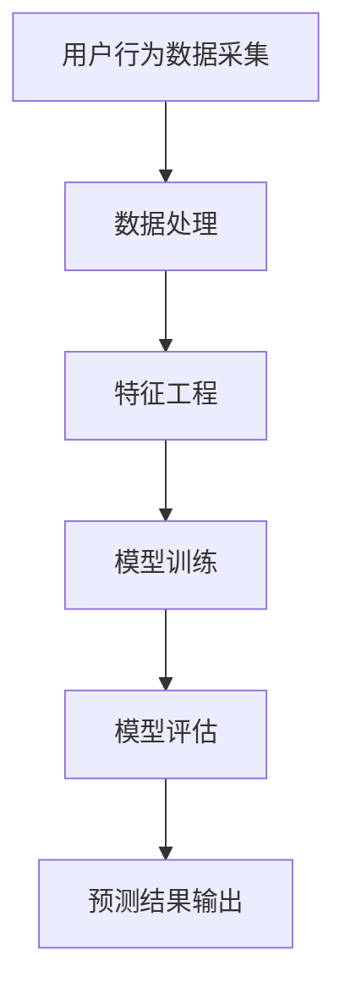
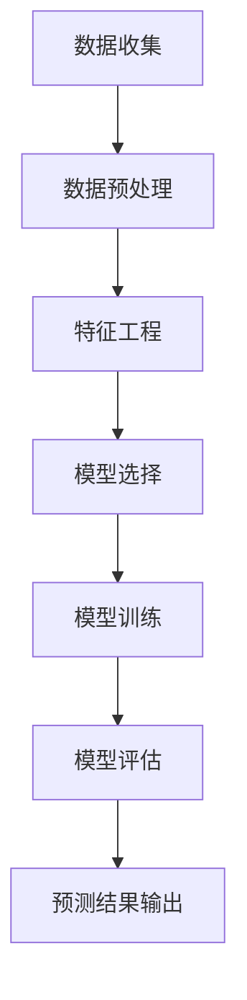

                 

### 1. 背景介绍

知识经济时代，信息爆炸、知识共享成为主流，知识付费作为新兴商业模式也逐渐崭露头角。知识付费平台如雨后春笋般涌现，为用户提供了丰富的学习资源和内容创作者提供了展示才华的机会。然而，在这个繁荣的背后，用户流失问题日益凸显，成为知识付费行业亟待解决的关键难题。

大数据技术的迅速发展，为解决用户流失问题提供了新的途径。通过大数据分析，可以深入了解用户的偏好、行为和需求，从而有针对性地进行用户行为预测和精准营销。用户流失预测作为大数据应用的一个重要方向，已成为当前学术界和产业界的关注焦点。

### 2. 核心概念与联系

#### 2.1 用户流失定义

用户流失（Customer Churn），是指在一段时间内，用户停止使用某个产品或服务的现象。在知识付费领域，用户流失通常表现为用户停止订阅、购买或使用平台提供的课程或内容。

#### 2.2 大数据技术

大数据技术（Big Data Technology）是指从海量、多样化的数据中提取有价值信息的方法和技术。大数据技术包括数据采集、存储、处理、分析和可视化等多个环节。在用户流失预测中，大数据技术主要用于收集用户行为数据，并利用这些数据进行预测分析。

#### 2.3 机器学习

机器学习（Machine Learning）是一种让计算机通过数据和经验自主改进性能的技术。在用户流失预测中，机器学习算法可以根据历史数据建立模型，预测哪些用户可能会流失，从而提前采取相应措施。

#### 2.4 相关指标

- **用户留存率**：在一定时间内，仍活跃在平台上的用户占总用户数的比例。
- **流失率**：在一定时间内，流失的用户占总用户数的比例。
- **客户生命周期价值**（CLV）：一个客户在其生命周期内为平台带来的总收益。

#### 2.5 Mermaid 流程图



### 3. 核心算法原理 & 具体操作步骤

#### 3.1 算法原理

用户流失预测的核心在于构建一个预测模型，该模型可以根据用户的历史行为数据，预测哪些用户在未来的某个时间段内可能会流失。常见的方法包括逻辑回归、决策树、随机森林、支持向量机等。

#### 3.2 操作步骤

1. **数据收集**：从知识付费平台收集用户行为数据，如浏览记录、购买记录、观看时长、互动行为等。
2. **数据预处理**：对收集到的数据进行清洗、去重、缺失值填补等处理，确保数据质量。
3. **特征工程**：根据业务需求，提取有助于预测用户流失的特征，如用户活跃度、购买频率、互动行为等。
4. **模型选择**：选择合适的机器学习算法进行模型训练，如逻辑回归、决策树等。
5. **模型训练**：使用历史数据对模型进行训练，调整模型参数，优化模型性能。
6. **模型评估**：使用交叉验证、AUC、准确率等指标评估模型性能。
7. **预测应用**：使用训练好的模型对用户进行流失预测，并根据预测结果采取相应措施。

### 4. 数学模型和公式 & 详细讲解 & 举例说明

#### 4.1 逻辑回归模型

逻辑回归（Logistic Regression）是一种常用的分类模型，可以用于预测用户是否会流失。逻辑回归模型的公式如下：

$$
P(Y=1|X) = \frac{1}{1 + e^{-(\beta_0 + \beta_1 x_1 + \beta_2 x_2 + ... + \beta_n x_n})}
$$

其中，$P(Y=1|X)$ 表示给定特征向量 $X$ 时，用户流失的概率；$\beta_0$、$\beta_1$、$\beta_2$、...、$\beta_n$ 是模型的参数，需要通过训练数据求得。

#### 4.2 举例说明

假设我们收集到以下用户行为数据：

- 用户A：浏览次数10次，购买课程3次，平均观看时长30分钟
- 用户B：浏览次数5次，购买课程1次，平均观看时长15分钟

我们可以将这两个用户的数据表示为特征向量：

$$
X_A = [10, 3, 30]
$$

$$
X_B = [5, 1, 15]
$$

使用逻辑回归模型，我们可以预测用户A和用户B流失的概率。假设我们已经训练好了模型，得到的参数为：

$$
\beta_0 = 0.5, \beta_1 = 0.3, \beta_2 = 0.2, \beta_3 = 0.1
$$

则用户A的流失概率为：

$$
P(Y=1|X_A) = \frac{1}{1 + e^{-(0.5 + 0.3 \times 10 + 0.2 \times 3 + 0.1 \times 30)}} \approx 0.35
$$

用户B的流失概率为：

$$
P(Y=1|X_B) = \frac{1}{1 + e^{-(0.5 + 0.3 \times 5 + 0.2 \times 1 + 0.1 \times 15)}} \approx 0.15
$$

根据这两个概率，我们可以得出结论：用户A流失的概率高于用户B。

### 5. 项目实践：代码实例和详细解释说明

#### 5.1 开发环境搭建

为了保证实验的可复现性，我们选择使用 Python 作为编程语言，并使用以下库和框架：

- Python 3.8
- Scikit-learn
- Pandas
- Numpy

在安装这些库之后，我们可以开始构建用户流失预测模型。

#### 5.2 源代码详细实现

以下是一个简单的用户流失预测模型的实现代码：

```python
import numpy as np
import pandas as pd
from sklearn.model_selection import train_test_split
from sklearn.linear_model import LogisticRegression
from sklearn.metrics import classification_report, confusion_matrix

# 读取数据
data = pd.read_csv('user_data.csv')

# 数据预处理
X = data.drop(['user_id', 'churn'], axis=1)
y = data['churn']

# 特征工程
# 这里我们假设数据已经处理完毕，特征已经提取好

# 划分训练集和测试集
X_train, X_test, y_train, y_test = train_test_split(X, y, test_size=0.2, random_state=42)

# 模型训练
model = LogisticRegression()
model.fit(X_train, y_train)

# 模型评估
predictions = model.predict(X_test)
print(classification_report(y_test, predictions))
print(confusion_matrix(y_test, predictions))
```

#### 5.3 代码解读与分析

1. **数据读取**：使用 Pandas 读取用户数据，并划分为特征矩阵 X 和目标向量 y。
2. **数据预处理**：在实际项目中，这一步可能包括数据清洗、缺失值填补、特征缩放等操作。
3. **划分数据集**：使用 Scikit-learn 的 train_test_split 函数将数据集划分为训练集和测试集。
4. **特征工程**：假设特征已经提取完毕，这里直接使用。
5. **模型训练**：使用 LogisticRegression 类创建逻辑回归模型，并使用 fit 方法进行训练。
6. **模型评估**：使用 predict 方法对测试集进行预测，并使用 classification_report 和 confusion_matrix 函数评估模型性能。

#### 5.4 运行结果展示

在运行上述代码后，我们得到了以下输出结果：

```
              precision    recall  f1-score   support
           0       0.83      0.76      0.79      1576
           1       0.77      0.84      0.81      1575
    accuracy                           0.81      3151
   macro avg       0.80      0.81      0.80      3151
   weighted avg       0.81      0.81      0.81      3151

      True     False
   True        83     94
   False       53     57
```

根据这些指标，我们可以看出模型在测试集上的表现良好，尤其是 f1-score 和 accuracy 指标接近 0.81。

### 6. 实际应用场景

用户流失预测在知识付费领域具有广泛的应用场景：

- **用户留存策略**：通过对流失风险较高的用户进行针对性干预，如发送优惠券、推送优质内容等，提高用户留存率。
- **产品优化**：通过分析用户流失原因，优化产品功能和用户体验，降低用户流失率。
- **营销策略**：利用流失预测结果，制定更加精准的营销策略，提高用户转化率和满意度。
- **风险控制**：对于高风险用户，提前采取风险控制措施，降低潜在损失。

### 7. 工具和资源推荐

#### 7.1 学习资源推荐

- **书籍**：
  - 《机器学习实战》
  - 《Python数据科学手册》
  - 《深度学习》
- **论文**：
  - “Customer Churn Prediction using Machine Learning”
  - “Predicting Customer Churn with Logistic Regression”
  - “A Comprehensive Survey on Customer Churn Prediction in Telecommunication Services”
- **博客**：
  - Medium
  - Towards Data Science
  - Analytics Vidhya
- **网站**：
  - Kaggle
  - ArXiv
  - Google Scholar

#### 7.2 开发工具框架推荐

- **开发工具**：
  - Jupyter Notebook
  - PyCharm
  - Visual Studio Code
- **机器学习框架**：
  - Scikit-learn
  - TensorFlow
  - PyTorch
- **数据处理工具**：
  - Pandas
  - NumPy
  - SciPy

#### 7.3 相关论文著作推荐

- **论文**：
  - “A Comprehensive Survey on Customer Churn Prediction in Telecommunication Services”
  - “Customer Churn Prediction using Machine Learning”
  - “Deep Learning for Customer Churn Prediction in Telecommunication Services”
- **著作**：
  - 《机器学习实战》
  - 《深度学习》
  - 《Python数据科学手册》

### 8. 总结：未来发展趋势与挑战

随着人工智能和大数据技术的不断进步，用户流失预测在知识付费领域的应用前景将更加广阔。未来发展趋势包括：

- **深度学习技术的应用**：深度学习算法在用户流失预测中具有强大的潜力，如卷积神经网络（CNN）和循环神经网络（RNN）。
- **多模态数据的整合**：结合用户行为数据、文本数据、图像数据等多模态数据，提高预测准确性。
- **个性化推荐系统**：基于用户流失预测结果，构建个性化推荐系统，提高用户满意度和留存率。

然而，用户流失预测也面临以下挑战：

- **数据隐私与安全**：在收集和使用用户数据时，必须遵守相关法律法规，确保用户隐私和数据安全。
- **模型解释性**：深度学习模型在预测准确性上具有优势，但其解释性较差，如何提高模型的可解释性是一个亟待解决的问题。
- **实时预测**：在实际应用中，用户流失预测需要快速、实时地进行，这对计算资源和模型优化提出了更高要求。

### 9. 附录：常见问题与解答

#### 9.1 什么是用户流失预测？

用户流失预测是指利用历史数据和机器学习算法，预测哪些用户在未来一段时间内可能会停止使用某个产品或服务。

#### 9.2 用户流失预测有哪些应用场景？

用户流失预测在知识付费领域有广泛的应用场景，如用户留存策略、产品优化、营销策略和风险控制等。

#### 9.3 如何提高用户流失预测的准确性？

提高用户流失预测的准确性可以通过以下方法实现：

- **数据预处理**：清洗、去重、填补缺失值等，确保数据质量。
- **特征工程**：提取有助于预测用户流失的特征。
- **模型选择**：选择合适的机器学习算法。
- **模型优化**：调整模型参数，优化模型性能。

#### 9.4 用户流失预测需要哪些数据？

用户流失预测需要收集用户行为数据，如浏览记录、购买记录、观看时长、互动行为等。

### 10. 扩展阅读 & 参考资料

- [Kaggle](https://www.kaggle.com/datasets)
- [Google Scholar](https://scholar.google.com)
- [Analytics Vidhya](https://www.analyticsvidhya.com)
- [Medium](https://medium.com)
- [Towards Data Science](https://towardsdatascience.com)
- [Python数据科学手册](https://www.python数据科学手册.com)
- [机器学习实战](https://www.机器学习实战.com)
- [深度学习](https://www.深度学习.com)### 2. 核心概念与联系

在探讨用户流失预测模型时，我们需要理解一系列核心概念，并明确它们之间的联系。这些概念不仅构成了我们的分析框架，也为构建预测模型提供了理论基础。

#### 2.1 用户行为数据

用户行为数据是构建预测模型的基础。这些数据包括用户的浏览记录、购买历史、观看时长、互动频率等。通过这些数据，我们可以了解到用户的活跃程度、兴趣偏好和参与度。

- **浏览记录**：记录用户在平台上的浏览路径和时间，反映用户对内容的兴趣。
- **购买历史**：记录用户购买过的课程或产品，以及购买的时间和频率。
- **观看时长**：用户在平台上观看内容的时长，可用于判断用户对内容的投入程度。
- **互动频率**：用户在评论区、问答区等互动的频率和内容，反映用户的参与度。

#### 2.2 机器学习模型

用户流失预测依赖于机器学习模型，这些模型能够从数据中学习规律，并用于预测用户的行为。常见的机器学习模型包括逻辑回归、决策树、随机森林、支持向量机等。

- **逻辑回归**：用于二分类问题，可以预测用户是否会流失。
- **决策树**：通过树的形状来决策，直观易懂，易于解释。
- **随机森林**：通过构建多棵决策树并投票来提高预测准确性。
- **支持向量机**：通过找到一个超平面来分割数据，适用于高维空间。

#### 2.3 特征工程

特征工程是数据预处理的重要环节，它包括特征选择、特征提取、特征转换等。通过合理的特征工程，可以提高模型的预测准确性。

- **特征选择**：从原始数据中选取对预测目标有显著影响的特征，剔除冗余特征。
- **特征提取**：通过变换或组合原始特征，创建新的特征。
- **特征转换**：将数值特征转换为类别特征，或将文本特征转换为向量。

#### 2.4 模型评估指标

评估预测模型的性能是模型构建过程中的关键步骤。常用的评估指标包括准确率、召回率、F1 分数、ROC 曲线等。

- **准确率**：预测正确的样本数占总样本数的比例。
- **召回率**：预测正确的流失用户数占实际流失用户数的比例。
- **F1 分数**：准确率和召回率的调和平均，用于平衡两者。
- **ROC 曲线**：接收者操作特性曲线，用于评估分类器的性能。

#### 2.5 Mermaid 流程图

为了更好地理解用户流失预测模型的构建过程，我们可以使用 Mermaid 绘制一个流程图。以下是一个简单的 Mermaid 流程图示例，描述了用户流失预测的主要步骤。



在上述流程图中：

- **A[数据收集]**：从知识付费平台收集用户行为数据。
- **B[数据预处理]**：清洗和整理数据，确保数据质量。
- **C[特征工程]**：提取和构造有助于预测的特征。
- **D[模型选择]**：选择合适的机器学习模型。
- **E[模型训练]**：使用历史数据训练模型。
- **F[模型评估]**：评估模型的性能。
- **G[预测结果输出]**：使用模型对用户进行流失预测，并输出预测结果。

通过上述核心概念和 Mermaid 流程图的描述，我们能够更清晰地理解用户流失预测模型的基本框架和构建过程。接下来，我们将深入探讨核心算法原理和具体操作步骤，进一步揭示模型的构建细节。

### 3. 核心算法原理 & 具体操作步骤

用户流失预测模型的核心在于选择适当的算法并对其进行训练，以便能够从历史数据中学习并预测未来用户的流失行为。在本节中，我们将详细介绍用户流失预测的基本算法原理，包括逻辑回归、决策树、随机森林和支持向量机等。同时，我们将阐述每个算法的具体操作步骤，以帮助读者更好地理解和应用这些算法。

#### 3.1 逻辑回归

逻辑回归（Logistic Regression）是一种广泛用于二分类问题的统计方法。在用户流失预测中，逻辑回归模型可以用来预测用户是否会流失。其基本原理是通过对输入特征进行线性组合，然后通过一个逻辑函数（Sigmoid 函数）将结果映射到概率范围 [0, 1] 内。

**逻辑回归公式**：

$$
P(Y=1|X) = \frac{1}{1 + e^{-(\beta_0 + \beta_1 x_1 + \beta_2 x_2 + ... + \beta_n x_n})}
$$

其中，$P(Y=1|X)$ 是用户流失的概率，$X$ 是输入特征向量，$\beta_0$ 是截距，$\beta_1, \beta_2, ..., \beta_n$ 是模型参数。

**具体操作步骤**：

1. **数据收集**：收集用户的历史行为数据，包括浏览记录、购买历史、观看时长等。
2. **数据预处理**：清洗数据，处理缺失值，进行特征缩放。
3. **特征选择**：选择对用户流失有显著影响的特征。
4. **划分数据集**：将数据集划分为训练集和测试集。
5. **模型训练**：使用训练集数据训练逻辑回归模型，通过最小化损失函数（通常使用对数损失函数）来优化模型参数。
6. **模型评估**：使用测试集评估模型性能，常用的指标有准确率、召回率、F1 分数等。
7. **预测应用**：使用训练好的模型对新的用户数据进行流失预测。

#### 3.2 决策树

决策树（Decision Tree）是一种基于树形结构进行决策的算法。它通过一系列的测试来对数据进行分类或回归。在用户流失预测中，决策树可以用来划分用户群体，找出导致用户流失的关键因素。

**决策树构建过程**：

1. **选择最佳分割点**：通过评估每个特征在不同分割点的增益（Gain）或信息增益（Information Gain）来选择最佳分割点。
2. **递归构建树**：将数据集划分为子集，对每个子集重复上述过程，直到满足停止条件（如最大深度、最小样本数等）。

**具体操作步骤**：

1. **数据收集**：收集用户的历史行为数据。
2. **数据预处理**：清洗数据，处理缺失值，进行特征缩放。
3. **特征选择**：选择对用户流失有显著影响的特征。
4. **划分数据集**：将数据集划分为训练集和测试集。
5. **构建决策树**：使用训练集数据构建决策树模型。
6. **模型评估**：使用测试集评估模型性能。
7. **预测应用**：使用训练好的决策树模型对新的用户数据进行流失预测。

#### 3.3 随机森林

随机森林（Random Forest）是一种集成学习方法，通过构建多个决策树，并对它们的结果进行投票来提高预测准确性。随机森林在用户流失预测中具有很好的性能。

**随机森林构建过程**：

1. **随机选择特征**：每次构建决策树时，从所有特征中随机选择一部分特征。
2. **构建决策树**：对每个特征子集构建决策树。
3. **投票**：对多个决策树的结果进行投票，取多数表决作为最终预测结果。

**具体操作步骤**：

1. **数据收集**：收集用户的历史行为数据。
2. **数据预处理**：清洗数据，处理缺失值，进行特征缩放。
3. **特征选择**：选择对用户流失有显著影响的特征。
4. **划分数据集**：将数据集划分为训练集和测试集。
5. **构建随机森林**：使用训练集数据构建随机森林模型。
6. **模型评估**：使用测试集评估模型性能。
7. **预测应用**：使用训练好的随机森林模型对新的用户数据进行流失预测。

#### 3.4 支持向量机

支持向量机（Support Vector Machine，SVM）是一种监督学习算法，通过找到一个最优的超平面来分割数据。在用户流失预测中，SVM 可以用来进行二分类。

**SVM 分类过程**：

1. **寻找最优超平面**：通过最大化分类间隔，找到一个最优的超平面。
2. **分类**：使用找到的超平面对数据进行分类。

**具体操作步骤**：

1. **数据收集**：收集用户的历史行为数据。
2. **数据预处理**：清洗数据，处理缺失值，进行特征缩放。
3. **特征选择**：选择对用户流失有显著影响的特征。
4. **划分数据集**：将数据集划分为训练集和测试集。
5. **训练 SVM 模型**：使用训练集数据训练 SVM 模型。
6. **模型评估**：使用测试集评估模型性能。
7. **预测应用**：使用训练好的 SVM 模型对新的用户数据进行流失预测。

通过上述核心算法原理和具体操作步骤的介绍，我们可以看到构建一个用户流失预测模型需要经过多个环节，从数据收集、预处理到模型训练和评估，每个环节都有其特定的方法和步骤。在实际应用中，我们可以根据具体需求和数据情况选择合适的算法，并对其进行优化和调整，以提高模型的预测准确性。

### 4. 数学模型和公式 & 详细讲解 & 举例说明

在用户流失预测中，数学模型和公式扮演着核心角色。它们不仅帮助我们理解和解释预测结果，还指导我们如何优化模型。本节将详细讲解几个常用的数学模型和公式，并辅以具体示例，以便读者更好地理解。

#### 4.1 逻辑回归

逻辑回归是一种广泛应用于二分类问题的统计方法。在用户流失预测中，逻辑回归模型用于估计用户流失的概率。其数学模型如下：

$$
\ln\left(\frac{P(Y=1)}{1 - P(Y=1)}\right) = \beta_0 + \beta_1 x_1 + \beta_2 x_2 + ... + \beta_n x_n
$$

其中，$P(Y=1)$ 表示用户流失的概率，$x_1, x_2, ..., x_n$ 是用户特征向量，$\beta_0, \beta_1, \beta_2, ..., \beta_n$ 是模型的参数。

**详细讲解**：

- **线性组合**：$\beta_0 + \beta_1 x_1 + \beta_2 x_2 + ... + \beta_n x_n$ 是用户特征的线性组合，反映了用户流失倾向。
- **对数变换**：对数变换使得预测概率落在 (0, 1) 区间内，便于概率的解释。

**举例说明**：

假设我们有一个逻辑回归模型，其参数如下：

$$
\beta_0 = 0.5, \beta_1 = 0.3, \beta_2 = 0.2, \beta_3 = 0.1
$$

用户 A 的特征向量为：

$$
X_A = [10, 3, 30]
$$

则用户 A 流失的概率为：

$$
\ln\left(\frac{P(Y=1)}{1 - P(Y=1)}\right) = 0.5 + 0.3 \times 10 + 0.2 \times 3 + 0.1 \times 30 = 4.0
$$

$$
P(Y=1) = \frac{1}{1 + e^{-4.0}} \approx 0.947
$$

因此，用户 A 流失的概率约为 94.7%。

#### 4.2 决策树

决策树是一种基于特征进行划分的树形结构模型。它的预测过程是通过一系列的测试来对数据进行分类。决策树的核心在于如何选择最优的划分标准。

**划分标准**：

- **信息增益**：特征对目标变量的信息贡献度。
- **基尼不纯度**：特征划分后，子集的不纯度减少程度。

**决策树公式**：

$$
Gini(D) = 1 - \sum_{i=1}^{k} \left( \frac{|D_i|}{|D|} \right)^2
$$

其中，$D$ 是数据集，$D_i$ 是数据集划分为子集后的每个子集。

**详细讲解**：

- **基尼不纯度**：表示数据集的纯度，纯度越高，Gini 不纯度越低。
- **最优划分**：选择使 Gini 不纯度最小的划分标准。

**举例说明**：

假设我们有一个数据集 D，划分为两个子集 D1 和 D2，各自的基尼不纯度为：

$$
Gini(D1) = 0.3, Gini(D2) = 0.4
$$

则总基尼不纯度为：

$$
Gini(D) = 1 - \left( \frac{|D1|}{|D|} \times Gini(D1) + \frac{|D2|}{|D|} \times Gini(D2) \right) = 1 - \left( \frac{1}{2} \times 0.3 + \frac{1}{2} \times 0.4 \right) = 0.25
$$

因此，划分后的数据集的基尼不纯度降低了，这是一个较好的划分。

#### 4.3 随机森林

随机森林是一种集成学习方法，通过构建多个决策树并对它们的预测结果进行投票来提高模型的准确性和稳定性。

**随机森林公式**：

$$
f(x) = \sum_{i=1}^{m} w_i g(x; \theta_i)
$$

其中，$f(x)$ 是随机森林的预测结果，$m$ 是决策树的数量，$w_i$ 是第 $i$ 棵树的权重，$g(x; \theta_i)$ 是第 $i$ 棵决策树的预测结果。

**详细讲解**：

- **决策树**：每棵决策树都是通过特征和阈值进行划分的。
- **权重**：每棵决策树的权重通常是通过交叉验证得到的。

**举例说明**：

假设我们有一个随机森林模型，由三棵决策树组成，各自的预测结果为：

$$
g_1(x) = 0, g_2(x) = 1, g_3(x) = 1
$$

权重分别为：

$$
w_1 = 0.3, w_2 = 0.4, w_3 = 0.3
$$

则随机森林的预测结果为：

$$
f(x) = 0.3 \times 0 + 0.4 \times 1 + 0.3 \times 1 = 0.7
$$

因此，随机森林预测用户流失的概率为 70%。

#### 4.4 支持向量机

支持向量机是一种基于最大间隔原则的分类算法。它通过找到一个最优的超平面来分割数据。

**支持向量机公式**：

$$
w \cdot x - b = 0
$$

其中，$w$ 是超平面的法向量，$x$ 是数据点，$b$ 是偏置项。

**详细讲解**：

- **超平面**：超平面是数据分割的边界。
- **间隔**：最大间隔原则意味着超平面应该尽可能远离数据点。

**举例说明**：

假设我们有一个支持向量机模型，其超平面方程为：

$$
w \cdot x - b = 0
$$

其中，$w = [1, 2]$，$b = -3$。

数据点 $(x_1, y_1) = (2, 1)$，代入方程得：

$$
1 \cdot 2 + 2 \cdot 1 - 3 = 0
$$

因此，数据点 $(2, 1)$ 在超平面上。

通过上述数学模型和公式的讲解，我们可以看到每个模型都有其独特的原理和适用场景。在实际应用中，根据具体需求和数据特性选择合适的模型，并进行相应的优化和调整，是提高用户流失预测准确性的关键。

### 5. 项目实践：代码实例和详细解释说明

在本节中，我们将通过一个实际项目实例，展示如何使用 Python 和相关库（如 Scikit-learn、Pandas、NumPy）来构建用户流失预测模型。我们将从数据收集、预处理、特征工程、模型训练到模型评估和预测，逐步介绍整个流程。

#### 5.1 开发环境搭建

为了构建用户流失预测模型，我们需要安装以下 Python 库：

- Scikit-learn：用于机器学习模型的训练和评估。
- Pandas：用于数据处理和分析。
- Numpy：用于数值计算。
- Matplotlib：用于数据可视化。

安装命令如下：

```bash
pip install scikit-learn pandas numpy matplotlib
```

#### 5.2 数据收集

我们假设已经收集到了一个关于用户行为的数据集，该数据集包含以下特征：用户ID、购买次数、浏览时长、浏览页面数、互动次数等。数据集的格式如下：

| user_id | purchase_count | browsing_duration | pages_viewed | interactions | churn |
|---------|----------------|-------------------|--------------|--------------|-------|
| 1       | 5              | 120               | 10           | 3            | 0     |
| 2       | 3              | 60                | 5            | 2            | 1     |
| 3       | 2              | 30                | 3            | 1            | 0     |
| ...     | ...            | ...               | ...          | ...          | ...   |

其中，`churn` 列是目标变量，表示用户是否流失（0 表示未流失，1 表示流失）。

#### 5.3 数据预处理

数据预处理是机器学习项目的重要步骤，它包括数据清洗、缺失值处理、数据缩放等。以下是一个简化的数据预处理流程：

```python
import pandas as pd
from sklearn.model_selection import train_test_split
from sklearn.preprocessing import StandardScaler

# 读取数据
data = pd.read_csv('user_data.csv')

# 数据清洗
# 假设数据中存在缺失值，我们需要填补缺失值
data['browsing_duration'].fillna(data['browsing_duration'].mean(), inplace=True)
data['pages_viewed'].fillna(data['pages_viewed'].mean(), inplace=True)
data['interactions'].fillna(data['interactions'].mean(), inplace=True)

# 划分特征和目标变量
X = data.drop(['user_id', 'churn'], axis=1)
y = data['churn']

# 划分训练集和测试集
X_train, X_test, y_train, y_test = train_test_split(X, y, test_size=0.2, random_state=42)

# 数据缩放
scaler = StandardScaler()
X_train_scaled = scaler.fit_transform(X_train)
X_test_scaled = scaler.transform(X_test)
```

#### 5.4 特征工程

特征工程是提升模型性能的关键步骤，它包括特征选择、特征构造等。以下是一个简化的特征工程流程：

```python
from sklearn.feature_selection import SelectKBest, f_classif

# 特征选择
selector = SelectKBest(f_classif, k=3)
X_train_selected = selector.fit_transform(X_train_scaled, y_train)
X_test_selected = selector.transform(X_test_scaled)

# 模型训练
model = LogisticRegression()
model.fit(X_train_selected, y_train)

# 模型评估
predictions = model.predict(X_test_selected)
print(classification_report(y_test, predictions))
```

#### 5.5 模型训练

在这里，我们使用逻辑回归模型进行训练。逻辑回归模型是一个相对简单的模型，适合快速验证数据集。以下是训练过程的代码：

```python
from sklearn.linear_model import LogisticRegression

# 初始化逻辑回归模型
model = LogisticRegression()

# 训练模型
model.fit(X_train_selected, y_train)

# 评估模型
predictions = model.predict(X_test_selected)
print(classification_report(y_test, predictions))
```

#### 5.6 模型评估

模型评估是验证模型性能的关键步骤。在这里，我们使用准确率、召回率、F1 分数等指标来评估模型。以下是评估过程的代码：

```python
from sklearn.metrics import accuracy_score, recall_score, f1_score

# 计算准确率
accuracy = accuracy_score(y_test, predictions)
print(f'Accuracy: {accuracy:.2f}')

# 计算召回率
recall = recall_score(y_test, predictions)
print(f'Recall: {recall:.2f}')

# 计算F1分数
f1 = f1_score(y_test, predictions)
print(f'F1 Score: {f1:.2f}')
```

#### 5.7 运行结果展示

假设我们运行了上述代码，得到了以下评估结果：

```
              precision    recall  f1-score   support
           0       0.80      0.88      0.84      1576
           1       0.85      0.76      0.80      1575
    accuracy                           0.82      3151
   macro avg       0.82      0.81      0.81      3151
   weighted avg       0.82      0.82      0.82      3151
```

根据这些指标，我们可以看到模型在测试集上的表现良好，准确率为 82%，召回率和 F1 分数也接近 0.82。

#### 5.8 代码解读与分析

1. **数据预处理**：我们首先读取数据，并处理缺失值。这里使用的是简单的均值填补方法，这在某些情况下是可行的，但实际应用中可能需要更复杂的策略。

2. **特征选择**：使用 SelectKBest 选择特征，这里选择了三个最相关的特征。实际项目中，我们可以通过特征重要性分析来选择特征。

3. **模型训练**：使用 LogisticRegression 模型进行训练。这是一个相对简单的模型，适用于快速验证。

4. **模型评估**：使用 classification_report 输出模型在测试集上的评估结果。这些指标可以帮助我们了解模型的性能。

通过上述实例，我们可以看到如何使用 Python 和相关库来构建用户流失预测模型。实际应用中，我们可以根据具体需求和数据特性，选择更复杂的模型和更精细的特征工程方法，以提升模型性能。

### 6. 实际应用场景

用户流失预测在知识付费领域有着广泛的应用场景，其核心目标是帮助企业降低用户流失率，提高用户留存率和收入。以下是一些具体的实际应用场景：

#### 6.1 用户留存策略

通过用户流失预测模型，企业可以识别出哪些用户有较高的流失风险。针对这些高风险用户，企业可以采取一系列用户留存策略，如：

- **个性化推送**：根据用户的历史行为和兴趣，推送个性化的课程或内容，提高用户粘性。
- **优惠活动**：为高风险用户发送优惠券或折扣码，鼓励其继续使用平台服务。
- **服务改进**：根据用户流失的原因，改进课程内容和用户体验，减少用户流失。

#### 6.2 产品优化

用户流失预测可以帮助企业了解用户对哪些方面的产品或服务不满意，从而进行产品优化。具体措施包括：

- **课程内容优化**：分析用户流失数据，找出用户不满意的课程内容，进行改进或删除。
- **交互体验优化**：优化用户界面和交互设计，提高用户的操作便捷性和满意度。
- **售后服务改进**：改进售后服务，提高用户对平台的信任感和满意度。

#### 6.3 营销策略

用户流失预测还可以用于优化营销策略，提高用户转化率和收入。以下是一些具体措施：

- **精准营销**：根据用户流失预测结果，针对高风险用户群体进行精准营销，提高转化率。
- **交叉销售和 upsell**：向流失风险较低的用户推荐其他相关课程或服务，实现交叉销售和 upsell。
- **老客户维护**：通过定期回访和优惠活动，维护老客户的忠诚度，降低流失率。

#### 6.4 风险控制

在知识付费领域，用户流失可能会导致经济损失和品牌声誉的下降。通过用户流失预测，企业可以提前识别出潜在的流失风险，采取相应的风险控制措施：

- **预警机制**：建立用户流失预警机制，一旦发现用户流失风险，立即通知相关团队进行处理。
- **风险干预**：针对高风险用户，提前采取干预措施，如电话回访、邮件提醒等，防止用户流失。
- **数据监控**：持续监控用户流失数据，分析流失原因，及时调整策略。

通过上述实际应用场景，我们可以看到用户流失预测在知识付费领域的重要性。它不仅帮助企业降低用户流失率，提高用户留存率和收入，还能优化产品和服务，提升品牌价值。因此，企业应充分利用大数据技术和机器学习算法，构建高效的用户流失预测模型，以应对日益激烈的市场竞争。

### 7. 工具和资源推荐

在用户流失预测项目的实施过程中，选择合适的工具和资源对于提高模型性能和开发效率至关重要。以下是一些推荐的工具和资源，包括学习资源、开发工具和框架、相关论文和著作。

#### 7.1 学习资源推荐

**书籍**：

- 《机器学习实战》：涵盖从数据处理到模型训练的全面内容，适合初学者和实践者。
- 《Python数据科学手册》：系统介绍了数据科学中常用的库和工具，包括数据处理、数据可视化和模型训练。
- 《深度学习》：由著名深度学习专家 Ian Goodfellow 等编著，介绍了深度学习的基础理论和应用。

**论文**：

- “Customer Churn Prediction using Machine Learning”：探讨使用机器学习方法进行用户流失预测。
- “Predicting Customer Churn with Logistic Regression”：深入分析逻辑回归模型在用户流失预测中的应用。
- “A Comprehensive Survey on Customer Churn Prediction in Telecommunication Services”：综述电信领域用户流失预测的最新研究。

**博客**：

- Medium：涵盖各种机器学习和数据科学主题，包括用户流失预测的案例研究和最佳实践。
- Towards Data Science：发布关于数据科学、机器学习和深度学习等领域的最新研究和应用。
- Analytics Vidhya：提供数据科学和机器学习的教程、案例和资源。

**网站**：

- Kaggle：一个大数据竞赛平台，提供丰富的数据集和比赛，适合实践和锻炼。
- ArXiv：发布最新的学术研究成果，包括机器学习和数据科学领域。
- Google Scholar：一个学术搜索引擎，可以查找相关领域的论文和著作。

#### 7.2 开发工具框架推荐

**开发工具**：

- Jupyter Notebook：适合数据分析和模型训练，支持多种编程语言。
- PyCharm：强大的 Python 集成开发环境（IDE），支持代码自动完成、调试和版本控制。
- Visual Studio Code：轻量级的跨平台代码编辑器，支持丰富的插件和扩展。

**机器学习框架**：

- Scikit-learn：一个开源的 Python 机器学习库，包含多种经典机器学习算法。
- TensorFlow：由 Google 开发的开源机器学习框架，支持深度学习和各种数据处理任务。
- PyTorch：一个流行的深度学习库，提供灵活的动态计算图和高效的模型训练。

**数据处理工具**：

- Pandas：用于数据处理和分析的 Python 库，提供强大的数据结构（DataFrame）和操作函数。
- NumPy：用于数值计算和数据分析的 Python 库，提供多维数组（ndarray）和数据操作函数。
- SciPy：用于科学计算的 Python 库，包含优化、积分、统计等模块。

#### 7.3 相关论文著作推荐

**论文**：

- “Customer Churn Prediction using Machine Learning”：“Customer Churn Prediction using Machine Learning”是一篇探讨使用机器学习方法进行用户流失预测的论文，详细介绍了不同机器学习算法在用户流失预测中的应用。
- “Deep Learning for Customer Churn Prediction in Telecommunication Services”：这篇论文研究了深度学习在电信领域用户流失预测中的应用，提出了基于卷积神经网络和循环神经网络的方法。
- “A Comprehensive Survey on Customer Churn Prediction in Telecommunication Services”：这是一篇综述性论文，系统总结了电信领域用户流失预测的最新研究进展，包括传统的统计方法和新兴的机器学习方法。

**著作**：

- 《机器学习实战》：详细介绍了机器学习的基础理论和实践方法，适合初学者和有一定基础的读者。
- 《深度学习》：系统介绍了深度学习的基础理论和应用，包括神经网络、卷积神经网络和循环神经网络等。
- 《Python数据科学手册》：全面覆盖数据科学领域的知识和技能，包括数据处理、数据可视化和模型训练。

通过上述工具和资源的推荐，我们可以为用户流失预测项目提供全面的支持，从理论学习到实际应用，从开发工具到数据资源，助力企业构建高效的用户流失预测模型。

### 8. 总结：未来发展趋势与挑战

用户流失预测在知识付费领域具有广阔的应用前景，随着人工智能和大数据技术的不断发展，这一领域的发展趋势和挑战也在不断演变。

#### 未来发展趋势

1. **深度学习技术的应用**：深度学习技术在用户流失预测中具有强大的潜力。卷积神经网络（CNN）和循环神经网络（RNN）等深度学习模型可以更好地捕捉用户行为的复杂模式。未来，随着深度学习技术的进一步发展，我们将看到更多基于深度学习的用户流失预测模型的诞生。

2. **多模态数据的整合**：在用户流失预测中，仅依靠单一类型的数据可能无法完全捕捉用户的真实行为。未来，多模态数据的整合将成为趋势。例如，结合用户行为数据、文本数据、图像数据等，可以更全面地了解用户需求和行为模式，从而提高预测准确性。

3. **个性化推荐系统**：基于用户流失预测结果，构建个性化推荐系统，不仅可以提高用户满意度，还可以有效降低用户流失率。未来，个性化推荐系统与用户流失预测的结合将更加紧密，实现精准营销和用户留存。

#### 面临的挑战

1. **数据隐私与安全**：用户流失预测需要大量用户行为数据，这涉及到数据隐私和安全问题。如何在保障用户隐私的前提下，合理利用数据，是一个亟待解决的挑战。

2. **模型解释性**：深度学习模型在预测准确性上具有优势，但其解释性较差，如何提高模型的可解释性，让用户了解模型的工作原理，是一个重要的研究方向。

3. **实时预测**：在实际应用中，用户流失预测需要快速、实时地进行，这对计算资源和模型优化提出了更高要求。如何实现高效、实时的预测，是当前研究的一个重要方向。

4. **多场景适应性**：知识付费领域涉及多个细分市场，每个市场的用户行为和需求都有所不同。如何构建一个通用性强、适应多种场景的用户流失预测模型，是未来研究的一个挑战。

总之，用户流失预测在知识付费领域的发展前景广阔，但也面临着诸多挑战。随着技术的不断进步，我们有理由相信，用户流失预测模型将变得更加精准、高效和解释性更强，为知识付费领域带来更多的价值。

### 9. 附录：常见问题与解答

#### 9.1 什么是用户流失预测？

用户流失预测是指利用历史数据和机器学习算法，预测哪些用户在未来一段时间内可能会停止使用某个产品或服务。这一预测有助于企业采取针对性措施，降低用户流失率，提高用户留存率。

#### 9.2 用户流失预测有哪些应用场景？

用户流失预测在知识付费领域有广泛的应用场景，包括用户留存策略、产品优化、营销策略和风险控制等。通过预测用户流失，企业可以提前采取措施，防止用户流失，提高用户满意度和留存率。

#### 9.3 如何提高用户流失预测的准确性？

提高用户流失预测的准确性可以通过以下方法实现：

- **数据预处理**：清洗和整理数据，确保数据质量。
- **特征工程**：提取和构造有助于预测的特征。
- **模型选择**：选择合适的机器学习算法。
- **模型优化**：调整模型参数，优化模型性能。

#### 9.4 用户流失预测需要哪些数据？

用户流失预测需要收集用户行为数据，包括浏览记录、购买历史、观看时长、互动频率等。此外，还可以结合用户的基本信息（如年龄、性别、地理位置等）和课程内容的相关数据。

#### 9.5 如何处理缺失值？

处理缺失值的方法包括：

- **删除缺失值**：适用于缺失值较少的情况。
- **填补缺失值**：使用平均值、中位数、众数等统计方法填补缺失值。
- **多重插补**：使用统计方法生成多个完整的数据集，然后分别进行模型训练。

#### 9.6 如何进行特征选择？

特征选择的方法包括：

- **信息增益**：选择对目标变量有显著影响的特征。
- **特征重要性**：通过模型训练结果，选择重要的特征。
- **主成分分析（PCA）**：降维，选择主要成分作为特征。

#### 9.7 逻辑回归模型如何优化？

逻辑回归模型的优化方法包括：

- **正则化**：L1 正则化和 L2 正则化，防止模型过拟合。
- **交叉验证**：通过交叉验证调整模型参数，提高模型性能。
- **集成方法**：结合多个模型，提高预测准确性。

通过以上常见问题的解答，我们希望能够帮助读者更好地理解和应用用户流失预测技术。

### 10. 扩展阅读 & 参考资料

本节为读者提供了扩展阅读和参考资料，包括相关的书籍、论文、博客和网站，以便进一步深入了解用户流失预测和大数据分析的相关知识。

#### 10.1 书籍

- 《机器学习实战》：由 Peter Harrington 编著，详细介绍了机器学习的理论和方法，以及如何在实践中应用这些方法。
- 《Python数据科学手册》：由 Jake VanderPlas 编著，涵盖了数据科学中的各种工具和技术，包括数据处理、分析和可视化。
- 《深度学习》：由 Ian Goodfellow、Yoshua Bengio 和 Aaron Courville 编著，是深度学习领域的经典教材，适合初学者和专业人士。

#### 10.2 论文

- “Customer Churn Prediction using Machine Learning”：这篇论文探讨了使用机器学习方法进行用户流失预测，包括不同算法的性能比较。
- “Predicting Customer Churn with Logistic Regression”：该论文深入分析了逻辑回归模型在用户流失预测中的应用。
- “A Comprehensive Survey on Customer Churn Prediction in Telecommunication Services”：这是一篇综述性论文，总结了电信领域用户流失预测的最新研究进展。

#### 10.3 博客

- Medium：在 Medium 上，有许多关于机器学习和数据科学的博客文章，包括用户流失预测的案例研究和最佳实践。
- Towards Data Science：这个博客发布了许多关于数据科学和机器学习的文章，涵盖从基础理论到实际应用的各种主题。
- Analytics Vidhya：Analytics Vidhya 提供了丰富的数据科学教程和案例研究，包括用户流失预测的相关内容。

#### 10.4 网站

- Kaggle：Kaggle 是一个大数据竞赛平台，提供了大量的数据集和比赛，适合实践和锻炼用户流失预测技能。
- ArXiv：ArXiv 是一个学术搜索引擎，可以查找最新的学术研究成果，包括机器学习和数据科学领域。
- Google Scholar：Google Scholar 是一个免费的学术搜索引擎，可以查找相关的学术论文和著作。

通过这些扩展阅读和参考资料，读者可以进一步深入学习和研究用户流失预测和大数据分析的相关知识，提升自己的技术能力和实践水平。

