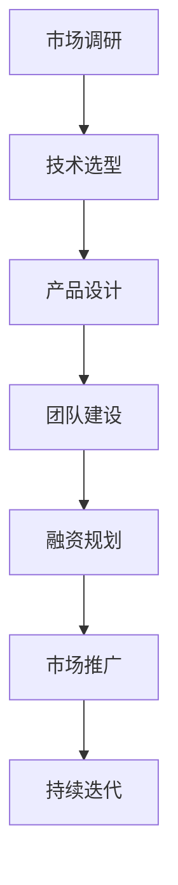

                 

关键词：知识经济、程序员创业、技术创业、创业策略、市场机会、创新能力、技术架构

> 摘要：本文将探讨知识经济背景下程序员如何抓住创业机遇，构建成功的创业项目。通过分析当前市场趋势和程序员的独特优势，本文将提出一系列实用的创业策略和操作步骤，为技术创业者提供有益的指导。

## 1. 背景介绍

知识经济时代，信息技术的飞速发展和全球化的深入，使得程序员的创业活动变得日益重要。随着云计算、大数据、人工智能等技术的普及，程序员不再仅仅局限于传统的软件开发工作，他们有机会成为技术创新的引领者，通过创业实现个人价值和商业成功。

程序员创业的优势在于他们对技术有深刻的理解和熟练的掌握，能够快速识别市场需求，并利用技术手段解决实际问题。然而，创业之路并非坦途，程序员的背景使得他们在市场策略、商业模式、团队管理等方面可能面临一定的挑战。

本文旨在为程序员创业者提供一套系统的方法论，帮助他们更好地理解创业环境，制定有效的创业策略，并成功地将技术创新转化为商业成果。

## 2. 核心概念与联系

### 2.1 程序员创业的核心要素

**技术能力**：程序员的技术背景是他们创业的基础。技术能力不仅包括编程技能，还包括对新兴技术的敏锐洞察力。

**市场需求**：创业项目必须解决实际存在的问题，满足市场需求。程序员需要具备市场敏锐度，了解用户需求，发现市场空白。

**团队协作**：创业项目通常需要跨学科、跨领域的团队合作。程序员需要学会如何组建和管理团队，发挥每个人的优势。

**商业模式**：程序员需要理解商业模式的构建，如何将技术转化为可持续的商业模式。

### 2.2 程序员创业与传统创业的区别

**技术驱动**：程序员创业往往以技术创新为核心，强调技术对商业模式的驱动。

**快速迭代**：程序员创业者通常采用敏捷开发方法，快速迭代产品，以适应市场的快速变化。

**高风险高回报**：程序员创业往往伴随着更高的风险，但一旦成功，回报也更为丰厚。

### 2.3 程序员创业的关键步骤

**市场调研**：了解市场需求，分析竞争态势，确定创业方向。

**技术选型**：根据市场需求选择合适的技术栈和开发工具。

**产品设计**：设计满足用户需求的产品原型，进行用户反馈和迭代。

**团队建设**：组建核心团队，明确分工，确保团队协作高效。

**融资规划**：制定融资计划，寻找合适的投资者。

**市场推广**：制定市场推广策略，扩大用户基础。

### 2.4 程序员创业的挑战与应对策略

**技术风险**：技术创新可能导致失败，程序员需要具备风险管理能力。

**市场风险**：市场需求变化快，程序员需要不断调整策略。

**资源有限**：初期创业资源有限，程序员需要高效利用资源。

### 2.5 Mermaid 流程图

下面是程序员创业流程的 Mermaid 流程图：



## 3. 核心算法原理 & 具体操作步骤

### 3.1 算法原理概述

程序员创业的核心在于快速识别市场机会，并利用技术手段将其转化为商业成果。这一过程可以被视为一种算法，其原理包括：

- **市场分析**：通过数据分析和用户调研，了解市场需求。
- **技术评估**：评估现有技术是否能够满足市场需求。
- **产品设计**：基于市场需求和技术评估，设计满足用户的产品。
- **团队协作**：通过有效的团队协作，实现产品开发和市场推广。

### 3.2 算法步骤详解

#### 3.2.1 市场分析

- **数据分析**：使用数据分析工具，如 Google Analytics、Tableau 等，收集和分析市场数据。
- **用户调研**：通过问卷调查、用户访谈等方式，了解用户需求。

#### 3.2.2 技术评估

- **技术调研**：研究现有技术，评估其是否能够满足市场需求。
- **技术选型**：选择合适的技术栈和开发工具。

#### 3.2.3 产品设计

- **需求分析**：根据市场分析和用户调研结果，确定产品需求。
- **原型设计**：设计产品原型，进行用户反馈和迭代。

#### 3.2.4 团队协作

- **团队组建**：根据项目需求，组建合适的团队。
- **协作管理**：使用项目管理工具，如 Jira、Trello 等，确保团队协作高效。

### 3.3 算法优缺点

**优点**：

- **快速响应**：通过敏捷开发方法，能够快速响应市场需求。
- **高效协作**：团队协作工具和流程，确保项目高效推进。

**缺点**：

- **技术风险**：技术创新可能导致失败。
- **市场风险**：市场需求变化快，可能需要频繁调整策略。

### 3.4 算法应用领域

- **互联网创业**：通过快速迭代和用户反馈，实现产品的持续优化。
- **人工智能创业**：利用人工智能技术，开发创新的解决方案。

## 4. 数学模型和公式 & 详细讲解 & 举例说明

### 4.1 数学模型构建

程序员创业的数学模型可以基于以下公式：

$$
利润 = 收入 - 成本
$$

其中，收入和成本可以通过以下公式计算：

$$
收入 = 用户数 \times 单价
$$

$$
成本 = 固定成本 + 变动成本
$$

### 4.2 公式推导过程

利润最大化的问题可以通过以下步骤推导：

1. **确定收入和成本的公式**：根据市场需求和产品定价，确定收入和成本的公式。
2. **构建利润公式**：将收入和成本代入利润公式中。
3. **优化目标**：确定优化目标，例如利润最大化或成本最小化。
4. **求解优化问题**：使用数学优化方法，求解优化问题。

### 4.3 案例分析与讲解

假设一家互联网公司，用户数为 1000，单价为 100 元，固定成本为 100 万元，变动成本为每用户 10 元。根据上述公式，可以计算该公司的利润：

$$
利润 = 1000 \times 100 - (1000000 + 1000 \times 10) = 900000 - 110000 = 790000 元
$$

通过优化用户数和单价，可以进一步提高利润。例如，将用户数增加 10%，单价增加 10%，则新的利润为：

$$
利润 = (1000 \times 110) \times (100 \times 1.1) - (1000000 + 1000 \times 11) = 1210000 - 111100 = 109900 元
$$

这表明，通过调整用户数和单价，可以在不增加成本的情况下，进一步提高利润。

## 5. 项目实践：代码实例和详细解释说明

### 5.1 开发环境搭建

为了构建一个简单的在线购物系统，我们需要搭建一个开发环境。以下是所需的工具和步骤：

- **工具**：
  - **编程语言**：Python
  - **Web 框架**：Flask
  - **数据库**：SQLite

- **步骤**：
  1. 安装 Python（建议使用 Python 3.8 或以上版本）。
  2. 使用 pip 安装 Flask 和 SQLite。
  3. 创建一个新的 Python 项目文件夹，并初始化一个虚拟环境。

### 5.2 源代码详细实现

以下是该在线购物系统的简化版本源代码：

```python
# 导入 Flask 和 SQLite
from flask import Flask, request, jsonify
import sqlite3

# 创建 Flask 应用
app = Flask(__name__)

# 连接到 SQLite 数据库
conn = sqlite3.connect('shopping.db')
c = conn.cursor()

# 创建商品表
c.execute('''CREATE TABLE IF NOT EXISTS products (id INTEGER PRIMARY KEY, name TEXT, price REAL)''')

# 添加商品
@app.route('/add_product', methods=['POST'])
def add_product():
    name = request.form['name']
    price = request.form['price']
    c.execute("INSERT INTO products (name, price) VALUES (?, ?)", (name, price))
    conn.commit()
    return jsonify({'message': 'Product added successfully'})

# 获取所有商品
@app.route('/get_products', methods=['GET'])
def get_products():
    c.execute("SELECT * FROM products")
    products = c.fetchall()
    return jsonify(products)

# 主函数
if __name__ == '__main__':
    app.run(debug=True)
```

### 5.3 代码解读与分析

上述代码是一个简单的 Flask 应用，用于管理一个在线购物系统的商品数据库。

- **数据库连接**：使用 SQLite 连接到数据库，并创建一个商品表。
- **添加商品**：定义一个添加商品的接口，接收 POST 请求，将商品信息插入数据库。
- **获取商品**：定义一个获取商品的接口，接收 GET 请求，从数据库中查询所有商品信息。

这个简单的例子展示了如何使用 Flask 框架和 SQLite 数据库构建一个基本的 Web 应用。在实际项目中，还需要添加更多的功能，如用户认证、购物车管理、订单处理等。

### 5.4 运行结果展示

- **添加商品**：

  ```bash
  curl -X POST -F "name=Apple&price=0.5" http://localhost:5000/add_product
  ```

  返回结果：

  ```json
  {"message": "Product added successfully"}
  ```

- **获取商品**：

  ```bash
  curl http://localhost:5000/get_products
  ```

  返回结果：

  ```json
  [(1, 'Apple', 0.5)]
  ```

## 6. 实际应用场景

### 6.1 电子商务平台

程序员可以创建电子商务平台，利用大数据分析和人工智能技术，提供个性化推荐、智能搜索和智能客服等功能。

### 6.2 教育平台

教育平台可以通过在线课程、实时互动和数据分析，提供个性化的学习体验。

### 6.3 医疗健康

程序员可以开发医疗健康应用，利用物联网和人工智能技术，提供远程诊断、健康管理和药物跟踪等服务。

### 6.4 金融科技

金融科技公司可以通过区块链技术和大数据分析，提供安全、高效的金融服务。

## 7. 工具和资源推荐

### 7.1 学习资源推荐

- **《深度学习》**：由 Goodfellow 等人撰写的深度学习经典教材。
- **《人工智能：一种现代方法》**：汉斯·莫拉维克等人撰写的全面的人工智能教材。
- **《程序员的数学》**：一本针对程序员的数学入门书籍。

### 7.2 开发工具推荐

- **GitHub**：代码托管和协作平台。
- **Docker**：容器化技术，用于简化部署和运行应用程序。
- **Kubernetes**：用于自动化部署、扩展和管理容器化应用程序。

### 7.3 相关论文推荐

- **《大规模在线学习中的自适应推荐系统》**：一篇关于自适应推荐系统的论文。
- **《基于区块链的金融科技应用》**：一篇关于区块链在金融科技中应用的论文。
- **《物联网架构设计与实施》**：一篇关于物联网架构设计和实施的论文。

## 8. 总结：未来发展趋势与挑战

### 8.1 研究成果总结

- **技术进步**：人工智能、大数据、云计算等技术的快速发展，为程序员创业提供了更多机会。
- **市场潜力**：随着互联网和移动互联网的普及，市场对技术创新的需求持续增长。
- **创业环境**：创业政策和环境的优化，为程序员创业提供了更好的支持。

### 8.2 未来发展趋势

- **个性化服务**：利用人工智能和大数据分析，提供更加个性化的服务。
- **智能合约**：区块链技术的应用，将推动智能合约的发展。
- **物联网**：物联网技术的普及，将带来更多的应用场景。

### 8.3 面临的挑战

- **技术风险**：技术创新可能导致失败，程序员需要具备风险管理能力。
- **市场竞争**：市场变化快，程序员需要不断创新，以保持竞争力。
- **团队管理**：程序员需要学会如何组建和管理团队，发挥每个人的优势。

### 8.4 研究展望

未来的研究将重点关注以下几个方面：

- **技术创新**：持续探索新技术，为程序员创业提供更多的可能性。
- **商业模式**：研究创新性的商业模式，实现技术与商业的完美结合。
- **跨界融合**：推动不同领域之间的融合，创造新的商业机会。

## 9. 附录：常见问题与解答

### 9.1 问题 1

**问题**：程序员创业如何选择合适的技术栈？

**解答**：选择合适的技术栈需要考虑以下几个因素：

- **市场需求**：根据市场需求选择能够满足项目需求的技术。
- **团队技能**：选择团队熟悉的技能，以减少学习和维护成本。
- **技术成熟度**：选择成熟的技术，降低技术风险。

### 9.2 问题 2

**问题**：程序员创业如何进行市场调研？

**解答**：进行市场调研可以采用以下方法：

- **数据分析**：使用数据分析工具，如 Google Analytics，收集市场数据。
- **用户调研**：通过问卷调查、用户访谈等方式，了解用户需求。
- **竞争分析**：分析竞争对手的产品、市场策略等。

### 9.3 问题 3

**问题**：程序员创业如何管理团队？

**解答**：管理团队可以采用以下策略：

- **明确分工**：根据团队成员的技能和兴趣，明确分工。
- **沟通协作**：使用项目管理工具，如 Jira，确保团队成员之间的有效沟通和协作。
- **激励制度**：建立合理的激励机制，提高团队的工作积极性。

---

本文由 **禅与计算机程序设计艺术 / Zen and the Art of Computer Programming** 撰写，旨在为程序员创业者提供一套实用的创业方法论。通过本文的探讨，我们希望程序员创业者能够更好地理解创业环境，制定有效的创业策略，并成功地将技术创新转化为商业成果。在知识经济的浪潮中，程序员创业者大有可为，让我们共同探索创新的道路，创造美好的未来。

