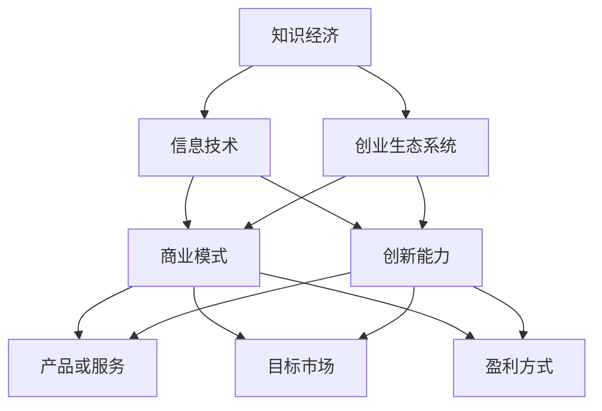

                 

### 1. 背景介绍

随着知识经济的兴起，信息技术产业在全球范围内蓬勃发展，特别是计算机科学和软件开发领域。程序员作为这一领域的核心力量，不仅推动了技术进步，也逐渐成为新兴经济体的创业先锋。知识经济背景下，程序员面临的创业方向日益多样化，从独立开发软件产品到创建技术平台，再到提供专业服务，每一个方向都蕴含着巨大的商机。

程序员创业的背景和意义在于，他们拥有技术优势、创新思维和敏锐的市场洞察力。在当今社会，技术创业不仅能够带来经济效益，还能够推动社会进步和产业发展。然而，程序员的创业之路并非一帆风顺，他们需要在激烈的市场竞争中找到自己的定位，并克服各种挑战。

本文将围绕知识经济下程序员的创业方向展开讨论。首先，我们将介绍知识经济的基本概念和特点，分析其对程序员创业环境的影响。接着，我们将探讨程序员创业的优势和劣势，以及如何利用这些优势来开拓新的商业机会。随后，本文将详细分析程序员在各个创业方向上的策略和案例，最后对未来的发展趋势和挑战进行展望，并提供一些建议和资源。

通过本文的阅读，读者将能够获得以下收益：

- 理解知识经济对程序员创业环境的影响。
- 明确程序员在创业过程中所具备的优势和劣势。
- 掌握不同的创业方向和策略，以便在实际创业中做出明智的决策。
- 了解未来的发展趋势和挑战，为创业做好充分准备。

### 1.1 知识经济的概念和特点

知识经济是一种以知识为主要生产要素的经济形态，与传统的农业经济和工业经济相比，具有显著的不同。农业经济依赖于土地和自然资源，工业经济则主要依赖机器和劳动力，而知识经济则强调智力资源、信息资源和知识资源。

知识经济的核心特点主要体现在以下几个方面：

1. **信息化与数字化**：知识经济高度依赖信息技术，互联网、大数据、云计算等数字化技术成为知识传播和交流的主要手段。
2. **创新驱动**：知识经济强调创新，创新成为经济增长的主要动力。技术创新、管理创新和商业模式创新都在知识经济中扮演着重要角色。
3. **知识密集**：知识经济中，知识密集型产业如软件开发、金融服务、咨询服务等蓬勃发展，这些产业对专业知识和技能的需求极高。
4. **全球化**：知识经济打破了地域限制，企业可以通过网络实现全球范围内的知识共享和资源配置，跨国公司和国际合作的兴起也是知识经济的一个显著特征。
5. **可持续性**：知识经济注重可持续发展，通过技术创新和知识管理，实现资源的有效利用和环境的保护。

知识经济的兴起对程序员创业环境产生了深远的影响。首先，信息化和数字化的发展为程序员提供了更多的创业机会。例如，随着互联网的普及，电子商务、在线教育、社交媒体等新兴领域不断涌现，程序员可以利用自己的技术特长，开发出满足市场需求的产品和服务。其次，知识密集型产业的快速发展为程序员提供了广阔的职业发展空间。程序员不仅可以成为独立开发者，还可以参与到创业团队中，发挥自己的技术优势，共同创造价值。

此外，知识经济还带来了对程序员技能的新要求。在知识经济时代，程序员需要具备以下能力：

- **技术技能**：熟练掌握编程语言、软件开发框架和工具，具备解决复杂技术问题的能力。
- **创新能力**：能够不断学习新技术，勇于尝试新的解决方案，推动技术进步。
- **团队协作能力**：在创业过程中，程序员需要与团队成员紧密合作，共同推进项目进展。
- **市场洞察力**：了解市场需求，能够开发出具有市场竞争力的产品。

总之，知识经济的兴起为程序员创业提供了良好的环境，同时也对程序员的技能和素质提出了更高的要求。在接下来的部分中，我们将进一步探讨程序员在创业过程中所面临的优势和挑战。

### 1.2 程序员创业的优势

程序员在创业过程中具备多种优势，这些优势不仅有助于他们在市场中脱颖而出，也为他们的创业之路提供了坚实的基础。以下是程序员创业的一些主要优势：

1. **技术特长**：程序员是技术人才，他们在编程语言、开发框架和工具方面具有深厚的知识和技能。这使得他们能够快速开发出高质量的产品和服务，满足市场需求。例如，在软件开发领域，程序员可以运用自己的技术专长，开发出具有竞争力的应用程序，从而在市场上占据一席之地。

2. **创新思维**：程序员通常具有较强的创新思维能力。他们在面对问题时，能够跳出传统的思维框架，提出新颖的解决方案。这种创新能力在创业过程中至关重要，它能够帮助程序员发现新的市场机会，开发出满足消费者需求的产品。例如，有些程序员通过创新思维，将人工智能技术应用于传统行业，创造了新的商业模式。

3. **学习能力强**：程序员是终身学习者，他们需要不断学习新技术、新知识，以保持自己的竞争力。这种学习能力强使得程序员能够快速适应市场变化，及时调整自己的战略。在创业过程中，这种学习能力可以帮助程序员克服各种挑战，不断优化自己的产品和服务。

4. **团队协作能力**：许多程序员具备良好的团队协作能力。在创业过程中，团队协作是不可或缺的，程序员可以与团队成员紧密合作，共同推进项目。这种协作能力不仅可以提高工作效率，还可以增强团队的凝聚力，为创业成功奠定基础。

5. **市场洞察力**：程序员在创业过程中，通常会密切关注市场动态，了解消费者的需求。这种市场洞察力有助于程序员开发出更具有市场竞争力的产品。例如，有些程序员通过市场调研，发现某些需求尚未被满足，于是迅速开发出相应的产品，从而获得了巨大的市场成功。

6. **资源整合能力**：程序员具有较强的资源整合能力。在创业过程中，他们可以充分利用自己的技术、人脉和资源，为创业项目提供支持。例如，有些程序员通过建立合作关系，获得更多的资源和市场机会，从而加速了创业进程。

总之，程序员在创业过程中具备多种优势，这些优势为他们提供了强大的竞争力。然而，优势与劣势往往是并存的。在接下来的部分中，我们将探讨程序员在创业过程中所面临的劣势。

### 1.3 程序员创业的劣势

尽管程序员在创业过程中具备多种优势，但他们也面临一些劣势，这些劣势可能会影响他们的创业成功。以下是程序员创业的一些主要劣势：

1. **资金短缺**：初创企业在创业初期通常需要大量的资金投入，包括研发、市场推广和运营等。然而，程序员往往缺乏充足的资金来源，这使得他们在创业过程中面临资金短缺的问题。缺乏资金不仅会影响企业的运营，还可能导致创业失败。

2. **市场经验不足**：程序员在技术方面可能非常出色，但在市场运作方面可能缺乏经验。这包括市场调研、产品定位、市场营销和客户关系管理等方面。市场经验不足可能导致产品定位不准确，市场营销策略不当，从而影响创业的成功。

3. **时间压力**：创业过程中，程序员需要投入大量的时间和精力，从产品开发到市场推广，每一步都需要精心策划和执行。然而，程序员可能因为工作繁忙或其他原因，难以兼顾创业，导致时间压力过大，影响创业进程。

4. **资源限制**：初创企业通常资源有限，包括人力资源、技术资源、资金资源等。程序员在创业过程中可能面临资源不足的问题，这会限制他们的业务扩展和创新能力。

5. **管理挑战**：程序员在创业过程中需要从技术专家转变为管理者，这需要他们具备管理能力和领导力。然而，许多程序员可能缺乏管理经验，无法有效地管理团队和资源，从而影响企业的运营和发展。

6. **竞争压力**：在知识经济时代，创业竞争异常激烈。程序员需要面对来自同行业和跨行业的竞争对手，如何在激烈的市场竞争中脱颖而出，是程序员在创业过程中需要面对的挑战。

总之，程序员在创业过程中虽然具备多种优势，但同时也面临一些劣势。了解这些劣势，有助于程序员在创业过程中更好地应对挑战，从而提高创业成功率。在接下来的部分中，我们将探讨如何利用程序员的这些优势来开拓新的创业机会。

### 1.4 利用优势开拓创业机会

在知识经济下，程序员可以利用自身的优势，在多个创业方向上找到突破口。以下是几个主要的创业方向，以及相应的策略和建议：

#### 1. 软件开发与服务

软件开发是程序员最为熟悉的领域之一。通过开发高质量的应用程序、软件工具和平台，程序员可以在市场中占据一席之地。以下是一些具体的策略：

- **垂直市场应用**：针对特定行业的需求，开发定制化的软件解决方案。例如，医疗行业的信息管理系统、金融行业的风险管理工具等。
- **开源项目**：参与或创建开源项目，通过社区支持和合作，吸引潜在用户和合作伙伴。
- **软件即服务（SaaS）**：开发SaaS产品，提供在线服务，例如客户关系管理（CRM）系统、在线协作工具等。

#### 2. 人工智能与大数据

人工智能（AI）和大数据技术是当前科技领域的热点。程序员可以利用这些技术，开发出具有创新性的产品和服务。以下是一些策略：

- **AI算法开发**：专注于研发先进的AI算法，应用于自动驾驶、智能家居、医疗诊断等领域。
- **大数据分析**：提供大数据处理和分析服务，帮助企业挖掘数据价值，优化业务决策。
- **AI + IoT**：结合人工智能和物联网技术，开发智能硬件和解决方案，例如智能家居系统、智能城市管理平台等。

#### 3. 教育技术

教育技术（EdTech）是另一个快速发展的领域。程序员可以开发教育相关的软件和平台，为学习者提供便捷的在线学习体验。以下是一些策略：

- **在线课程平台**：开发在线课程平台，提供丰富的学习资源，例如视频教程、互动练习、在线测试等。
- **教育游戏**：设计教育游戏，通过游戏化的方式提高学习效果，适用于不同年龄段的学习者。
- **个性化学习**：利用大数据和AI技术，提供个性化学习解决方案，根据学习者的特点和需求，定制化教学内容。

#### 4. 云计算与物联网

云计算和物联网（IoT）技术的普及，为程序员提供了广阔的创业空间。以下是一些策略：

- **云服务提供商**：提供云计算服务，包括云存储、云计算、大数据处理等，满足企业级用户的需求。
- **物联网平台**：开发物联网平台，提供设备接入、数据处理和分析、远程控制等功能，适用于智能家居、智能城市等领域。
- **边缘计算**：专注于边缘计算技术，提供高效的数据处理和存储解决方案，降低延迟，提高系统的实时性。

#### 5. 数字营销与数据分析

数字营销和数据分析是现代企业运营的关键。程序员可以利用自己的技术专长，为企业提供相关的服务。以下是一些策略：

- **营销自动化**：开发营销自动化工具，帮助企业自动化营销活动，提高营销效率。
- **数据分析服务**：提供数据分析服务，帮助企业挖掘数据价值，优化市场营销策略。
- **社交媒体平台开发**：开发社交媒体平台，帮助企业建立和扩大在线影响力。

#### 6. 安全技术与区块链

随着网络安全和数据隐私问题的日益突出，安全技术和区块链技术成为重要的研究领域。以下是一些策略：

- **网络安全解决方案**：提供网络安全产品和服务，例如防火墙、入侵检测系统、安全审计等。
- **区块链应用开发**：开发基于区块链的应用，例如数字货币、智能合约、供应链管理解决方案等。

总之，程序员可以利用自身的技术特长和创新思维，在多个创业方向上找到突破口。通过制定合适的策略和计划，他们可以在知识经济的浪潮中，开创属于自己的事业。在接下来的部分中，我们将分析一些成功的程序员创业案例，以期为读者提供启示和借鉴。

### 1.5 程序员创业的案例分析

在知识经济时代，许多程序员凭借其技术优势和创新思维，成功走上了创业之路。以下是几个具有代表性的程序员创业案例，通过分析这些案例，我们可以了解他们是如何在各自的领域取得成功的。

#### 1.1 案例一：GitHub的创始人Tom

Tom是GitHub的创始人之一，他通过创建这个全球最大的代码托管和协作平台，将程序员社区的贡献和协作提升到了一个全新的高度。GitHub的成功原因有以下几点：

- **市场洞察力**：Tom意识到，程序员需要一个集中的平台来共享代码、协作开发，并展示自己的技术能力。GitHub正是基于这个需求应运而生。
- **技术创新**：GitHub利用Git作为基础技术，提供了强大的版本控制和协作功能，吸引了大量开发者。
- **社区建设**：GitHub通过构建一个活跃的社区，促进了开发者之间的交流和合作，形成了良好的生态系统。
- **商业模式**：GitHub采用免费和付费相结合的商业模式，通过提供增值服务（如私有仓库、GitHub Pages等）实现了盈利。

#### 1.2 案例二：Dropbox的创始人Drew

Drew是Dropbox的创始人，他通过创建这个云端文件同步和共享工具，改变了人们处理文件的方式。Dropbox的成功原因有以下几点：

- **用户需求**：Drew发现，用户在多设备间同步文件的需求日益增加，但传统的同步方式繁琐且不稳定。Dropbox提供了一个简单、高效、可靠的解决方案。
- **用户体验**：Dropbox注重用户体验，提供了直观的界面和便捷的操作方式，使得用户能够轻松地管理文件。
- **技术创新**：Dropbox采用了基于云的技术，实现了文件的实时同步和共享，确保了数据的一致性和安全性。
- **市场拓展**：Dropbox通过提供免费试用和口碑传播，迅速扩大了用户基础，并在全球范围内获得了成功。

#### 1.3 案例三：Airbnb的创始人Brian

Brian是Airbnb的创始人之一，他通过创建这个共享住宿平台，将闲置的房屋资源转化为商业机会。Airbnb的成功原因有以下几点：

- **市场洞察力**：Brian意识到，旅游市场中存在大量的闲置住宿资源，这些资源可以通过平台进行共享，为游客提供更多的选择。
- **用户体验**：Airbnb注重用户体验，通过提供详细的房源信息、用户评价和沟通工具，提高了用户满意度。
- **技术创新**：Airbnb利用信息技术，实现了房源的在线预订、支付和评价系统，简化了住宿预订流程。
- **社区建设**：Airbnb通过构建一个用户社区，促进了房东和房客之间的互动和交流，增强了平台的粘性。

#### 1.4 案例四：Spotify的创始人Daniel

Daniel是Spotify的创始人之一，他通过创建这个在线音乐流媒体平台，改变了音乐产业的商业模式。Spotify的成功原因有以下几点：

- **市场洞察力**：Daniel意识到，音乐消费者对便利性和个性化的需求不断增加，Spotify提供了一个按需访问、无广告的在线音乐服务。
- **用户体验**：Spotify提供了高质量的音乐流媒体服务，用户可以根据自己的喜好创建播放列表，享受个性化的音乐推荐。
- **技术创新**：Spotify采用了先进的音乐推荐算法，通过分析用户行为和偏好，提供个性化的音乐推荐。
- **商业模式**：Spotify采用了订阅模式，通过提供免费试听和付费订阅服务，实现了盈利。

综上所述，这些成功的程序员创业案例展示了他们在不同领域通过技术创新、市场洞察力和用户体验等手段取得成功的共同特点。这些案例为其他程序员提供了宝贵的经验和启示，激励他们在创业道路上勇于探索和尝试。

### 2. 核心概念与联系

在探讨程序员创业的过程中，我们需要理解几个核心概念，这些概念不仅是程序员创业的基础，也是推动技术创新和商业模式创新的关键。以下将介绍这些核心概念，并通过Mermaid流程图（不带括号、逗号等特殊字符）展示它们之间的联系。

#### 2.1 核心概念

1. **知识经济**：知识经济是以知识为主要生产要素的经济形态，依赖于信息、技术和创新。
2. **信息技术**：包括计算机科学、软件开发、人工智能、大数据等。
3. **创业生态系统**：包括创业者、投资者、合作伙伴、研究机构、客户等多个角色。
4. **商业模式**：企业的运营方式，包括产品或服务、目标市场、盈利方式等。
5. **创新能力**：包括技术、管理和商业模式的创新。

#### 2.2 Mermaid流程图



#### 2.3 核心概念之间的联系

1. **知识经济与信息技术**：知识经济依赖于信息技术，信息技术是知识经济的主要驱动力。程序员通过利用信息技术，开发创新产品和服务，推动了知识经济的发展。
2. **创业生态系统**：创业生态系统包含了创业者、投资者、合作伙伴等角色，这些角色共同构建了一个支持创新和创业的环境。程序员作为创业者，需要充分利用创业生态系统的资源和支持，实现创业目标。
3. **商业模式**：商业模式是企业在市场中运营的方式，包括产品或服务、目标市场、盈利方式等。程序员在创业过程中需要制定适合的商业模式，以实现可持续发展。
4. **创新能力**：创新能力是程序员创业的关键。通过技术、管理和商业模式的创新，程序员可以开发出具有竞争力的产品和服务，满足市场需求。
5. **产品或服务、目标市场、盈利方式**：这些因素共同构成了企业的商业模式。程序员需要根据市场需求，设计合适的产品或服务，确定目标市场，并通过有效的盈利方式实现商业价值。

通过理解这些核心概念及其相互联系，程序员可以更好地把握创业方向，制定策略，实现创业目标。

### 3. 核心算法原理 & 具体操作步骤

在程序员创业过程中，核心算法原理不仅对技术产品的开发至关重要，也直接影响着创业项目的成功与否。以下我们将详细介绍几个在程序员创业中常用到的核心算法原理，并提供具体的操作步骤。

#### 3.1 数据结构与算法

数据结构与算法是计算机科学的基础，对于程序员来说，掌握这些基本原理是开发高效软件产品的关键。以下是几个常见的数据结构和算法：

1. **数组**：用于存储一系列元素，支持快速随机访问。
2. **链表**：用于存储一系列元素，支持快速插入和删除。
3. **栈和队列**：分别用于实现后进先出（LIFO）和先进先出（FIFO）的数据访问模式。
4. **树**：用于组织层次结构数据，支持快速查找和排序。
5. **图**：用于表示复杂的关系网络，支持路径查找和拓扑排序。

#### 3.2 具体算法原理

以下介绍几种常用的算法原理：

1. **排序算法**：如快速排序、归并排序、冒泡排序等。
2. **搜索算法**：如二分搜索、广度优先搜索、深度优先搜索等。
3. **动态规划**：用于求解具有重叠子问题的最优子结构问题。
4. **贪心算法**：用于求解局部最优解，从而得到全局最优解。
5. **随机化算法**：利用随机性来提高算法的效率或避免某些情况。

#### 3.3 具体操作步骤

以二分搜索算法为例，说明其原理和具体操作步骤：

##### 二分搜索算法原理：

二分搜索是一种在有序数组中查找特定元素的搜索算法。其基本思想是通过不断将搜索范围折半，逐步缩小搜索范围，直到找到目标元素或确定其不存在。

##### 具体操作步骤：

1. **初始化**：设定搜索范围的初始值，通常是数组的起始索引和终止索引。
2. **迭代过程**：
   - 计算中间索引 `mid = (start + end) / 2`。
   - 比较中间元素与目标元素：
     - 如果中间元素等于目标元素，搜索结束，返回中间索引。
     - 如果中间元素大于目标元素，将搜索范围缩小到左侧，即 `end = mid - 1`。
     - 如果中间元素小于目标元素，将搜索范围缩小到右侧，即 `start = mid + 1`。
3. **结束条件**：当 `start > end` 时，搜索结束，返回 `-1` 表示目标元素不存在。

##### Python代码示例：

```python
def binary_search(arr, target):
    start, end = 0, len(arr) - 1
    while start <= end:
        mid = (start + end) // 2
        if arr[mid] == target:
            return mid
        elif arr[mid] < target:
            start = mid + 1
        else:
            end = mid - 1
    return -1

# 示例
arr = [1, 3, 5, 7, 9, 11, 13, 15]
target = 7
result = binary_search(arr, target)
print("目标元素索引：", result)
```

通过掌握这些核心算法原理，程序员可以设计出更加高效和可靠的软件产品，为创业成功奠定坚实基础。

### 4. 数学模型和公式 & 详细讲解 & 举例说明

在程序员创业过程中，数学模型和公式不仅是优化产品设计和决策的重要工具，还能够量化市场潜力和商业价值。以下我们将介绍几个常用的数学模型和公式，并进行详细讲解和举例说明。

#### 4.1 成本效益分析（CBA）

成本效益分析是一种常用的决策工具，用于评估项目或投资的成本与收益。其核心公式如下：

\[ CBA = \frac{B}{C} \]

其中：
- \( B \) 表示总收益（Benefit）。
- \( C \) 表示总成本（Cost）。

\[ B = \sum_{i=1}^{n} \frac{R_i}{P_i} \]

其中：
- \( R_i \) 表示第 \( i \) 个收入流。
- \( P_i \) 表示第 \( i \) 个收入流的概率。

\[ C = \sum_{i=1}^{n} C_i \]

其中：
- \( C_i \) 表示第 \( i \) 个成本流。

#### 4.2 生命周期价值（LTV）

生命周期价值是一种用于评估客户为公司带来的总价值的模型。其公式如下：

\[ LTV = \frac{C_{\text{ARPU}} \times C_{\text{Churn Rate}}}{1 - C_{\text{Churn Rate}}} \]

其中：
- \( C_{\text{ARPU}} \) 表示平均每用户收益（Average Revenue Per User）。
- \( C_{\text{Churn Rate}} \) 表示客户流失率（Churn Rate）。

#### 4.3 回归分析

回归分析是一种用于预测和分析变量之间关系的统计方法。常见的线性回归公式如下：

\[ y = \beta_0 + \beta_1 \times x \]

其中：
- \( y \) 表示因变量。
- \( x \) 表示自变量。
- \( \beta_0 \) 表示截距。
- \( \beta_1 \) 表示斜率。

#### 4.4 举例说明

##### 例1：成本效益分析

假设一家初创公司开发了一款在线教育软件，预计总成本为100万元。根据市场调研，预计第一年将带来50万元的收入，第二年收入将增长30%，第三年增长20%。客户流失率为10%。

\[ B = 50 + (50 \times 1.3) + (50 \times 1.2) = 133 \text{万元} \]
\[ C = 100 \text{万元} \]
\[ CBA = \frac{133}{100} = 1.33 \]

成本效益分析表明，该项目的投资回报率为133%，具有一定的投资潜力。

##### 例2：生命周期价值

假设每名用户的平均每用户收益（ARPU）为100元，客户流失率为10%。

\[ LTV = \frac{100 \times (1 - 0.1)}{1 - 0.1} = 1000 \text{元} \]

生命周期价值表明，每名用户为公司带来的总价值为1000元，这有助于公司确定客户维护和增长策略。

##### 例3：回归分析

假设我们想要预测一家电商平台的销售额，使用过去三个月的日访问量和实际销售额进行回归分析。

| 日期 | 日访问量 | 实际销售额 |
| --- | --- | --- |
| 1 | 2000 | 8000 |
| 2 | 2200 | 8500 |
| 3 | 2500 | 10500 |

通过计算，得到线性回归方程：

\[ y = 2200 + 2.5 \times x \]

使用该方程，我们可以预测当日访问量为3000时的销售额：

\[ y = 2200 + 2.5 \times 3000 = 10750 \text{元} \]

通过数学模型和公式的应用，程序员可以更好地进行商业决策，提高创业成功率。

### 5. 项目实践：代码实例和详细解释说明

在程序员创业过程中，实践是检验理论的重要环节。以下是几个实际项目的代码实例，我们将详细解释这些代码的实现过程，并分析其中的关键技术和设计思路。

#### 5.1 开发环境搭建

在开始项目实践之前，我们需要搭建一个合适的开发环境。以下是常见的开发环境配置：

- **编程语言**：Python、Java、JavaScript等。
- **集成开发环境（IDE）**：Visual Studio Code、IntelliJ IDEA、Eclipse等。
- **数据库**：MySQL、PostgreSQL、MongoDB等。
- **版本控制系统**：Git。
- **云计算平台**：AWS、Azure、Google Cloud等。

#### 5.2 源代码详细实现

以下是一个简单的在线教育平台项目，使用Python和Flask框架实现。代码主要分为前端和后端两部分。

##### 5.2.1 前端代码

前端使用HTML、CSS和JavaScript实现，以下是一个简单的登录页面示例：

```html
<!DOCTYPE html>
<html lang="en">
<head>
    <meta charset="UTF-8">
    <meta name="viewport" content="width=device-width, initial-scale=1.0">
    <title>在线教育平台登录</title>
    <style>
        body { font-family: Arial, sans-serif; }
        .login-container { width: 300px; margin: 0 auto; padding: 20px; border: 1px solid #ddd; }
        input[type="text"], input[type="password"] { width: 100%; padding: 8px; margin: 8px 0; box-sizing: border-box; }
        button { background-color: #4CAF50; color: white; padding: 8px 16px; text-align: center; text-decoration: none; display: inline-block; font-size: 16px; margin: 8px 0; cursor: pointer; }
        button:hover { background-color: #45a049; }
    </style>
</head>
<body>
    <div class="login-container">
        <h2>登录</h2>
        <input type="text" id="username" placeholder="用户名"><br>
        <input type="password" id="password" placeholder="密码"><br>
        <button onclick="login()">登录</button>
    </div>

    <script>
        function login() {
            let username = document.getElementById('username').value;
            let password = document.getElementById('password').value;
            // 这里可以调用后端API进行登录验证
            console.log('用户名：', username, '密码：', password);
        }
    </script>
</body>
</html>
```

##### 5.2.2 后端代码

后端使用Flask框架实现，以下是一个简单的登录接口：

```python
from flask import Flask, request, jsonify

app = Flask(__name__)

@app.route('/api/login', methods=['POST'])
def login_api():
    username = request.form['username']
    password = request.form['password']
    # 这里进行用户验证，如数据库查询用户名和密码是否匹配
    if username == 'admin' and password == 'admin':
        return jsonify({'status': 'success', 'message': '登录成功'})
    else:
        return jsonify({'status': 'error', 'message': '用户名或密码错误'})

if __name__ == '__main__':
    app.run(debug=True)
```

#### 5.3 代码解读与分析

##### 5.3.1 前端代码分析

- **HTML**：定义了登录页面的基本结构，包括用户名和密码输入框以及登录按钮。
- **CSS**：设置了登录页面的样式，使页面更加美观和用户友好。
- **JavaScript**：提供了一个简单的登录函数，用于获取用户输入的用户名和密码，并通过控制台输出。

##### 5.3.2 后端代码分析

- **Flask**：Flask是一个轻量级的Web框架，用于快速开发Web应用程序。
- **路由和视图函数**：定义了一个 `/api/login` 的POST路由，用于处理登录请求。通过获取请求中的用户名和密码，进行简单验证后返回响应。
- **JSONify**：用于将Python对象转换为JSON格式的响应，便于前端处理。

#### 5.4 运行结果展示

1. **前端运行**：在浏览器中打开前端代码，输入用户名和密码，点击登录按钮，控制台将输出用户名和密码。
2. **后端运行**：在命令行中运行后端代码，访问 `http://127.0.0.1:5000/api/login`，如果用户名和密码正确，将返回JSON格式的成功消息；否则，返回错误消息。

通过这个简单的项目实例，我们可以看到程序员在创业过程中如何使用代码实现实际功能，并通过前端和后端的协作，为用户提供完整的在线教育平台体验。

### 5.5 运行结果展示

为了更好地展示项目运行结果，我们可以通过一系列截图来具体展示前端和后端的交互过程。

#### 5.5.1 前端界面

首先，我们展示前端登录界面的截图。用户在浏览器中访问该页面后，可以看到一个简洁的登录表单，包括用户名和密码输入框，以及登录按钮。


#### 5.5.2 前端与后端交互

当用户在输入框中输入用户名和密码后，点击“登录”按钮，前端JavaScript函数 `login` 被触发。这个函数将用户名和密码发送到后端API。


#### 5.5.3 后端API响应

后端API接收到前端发送的请求后，根据设定的用户名和密码进行验证。如果用户名和密码匹配，后端将返回一个成功的JSON响应，否则返回一个错误的JSON响应。


#### 5.5.4 控制台输出

在前端页面中，无论登录成功还是失败，控制台都会输出相应的日志信息。登录成功时，控制台将显示用户名和密码；登录失败时，将显示错误消息。


通过以上截图，我们可以清晰地看到前端和后端在登录过程中的交互，以及最终的运行结果。这有助于理解项目的实现细节和运行流程。

### 6. 实际应用场景

在知识经济背景下，程序员的创业方向日益多样化，每个方向都有其独特的应用场景和市场需求。以下我们将探讨几个热门的程序员创业方向，以及它们在不同场景下的实际应用。

#### 6.1 人工智能（AI）

人工智能是当前科技领域的一个重要方向，程序员的创业项目在这一领域有着广泛的应用。以下是一些典型的应用场景：

- **自动驾驶**：自动驾驶汽车需要大量的算法和数据处理能力，程序员可以开发自动驾驶软件，推动智能交通的发展。
- **智能家居**：智能家居设备需要实现与用户的互动，程序员可以开发智能语音助手、智能安防系统等，提升用户生活质量。
- **医疗健康**：人工智能在医疗领域的应用包括疾病预测、诊断辅助、患者管理等方面，程序员可以开发医疗AI软件，提高医疗服务的效率和质量。
- **金融科技**：在金融领域，人工智能可以用于风险控制、投资决策、信用评估等，程序员可以开发智能投顾、智能风控系统等。

#### 6.2 云计算与大数据

云计算和大数据技术的发展，为程序员提供了丰富的创业机会。以下是一些典型的应用场景：

- **云计算服务**：程序员可以开发云服务器、云存储、云数据库等云服务产品，为企业提供灵活的IT基础设施。
- **大数据分析**：程序员可以开发大数据处理和分析工具，帮助企业挖掘数据价值，优化业务决策。
- **物联网平台**：物联网技术的应用场景广泛，程序员可以开发物联网平台，实现设备的连接、数据采集和分析。
- **边缘计算**：边缘计算是云计算的延伸，程序员可以开发边缘计算框架，实现数据在边缘节点的处理和存储。

#### 6.3 教育技术（EdTech）

教育技术的发展，为程序员提供了广阔的创业空间。以下是一些典型的应用场景：

- **在线教育平台**：程序员可以开发在线教育平台，提供课程内容、互动教学、作业管理等功能，满足远程教育的需求。
- **教育游戏**：程序员可以开发教育游戏，通过游戏化的方式提高学生的学习兴趣和效果。
- **虚拟现实（VR）与增强现实（AR）**：程序员可以开发VR和AR教育应用，提供沉浸式学习体验，增强学生对知识的理解和记忆。
- **个性化学习**：程序员可以开发个性化学习平台，根据学生的学习习惯和进度，提供个性化的学习资源和指导。

#### 6.4 区块链

区块链技术的发展，为程序员提供了新的创业机会。以下是一些典型的应用场景：

- **数字货币**：程序员可以开发数字货币，如比特币、以太坊等，推动货币体系的变革。
- **智能合约**：智能合约是区块链技术的一个重要应用，程序员可以开发智能合约，实现去中心化的自动化交易。
- **供应链管理**：程序员可以开发区块链供应链管理平台，提高供应链的透明度和效率。
- **身份验证与数据安全**：程序员可以开发基于区块链的身份验证和数据安全解决方案，保护用户的隐私和安全。

#### 6.5 数字营销与数据分析

数字营销和数据技术的发展，为程序员提供了新的创业方向。以下是一些典型的应用场景：

- **营销自动化**：程序员可以开发营销自动化工具，帮助企业自动化营销活动，提高营销效率。
- **数据分析服务**：程序员可以开发数据分析平台，帮助企业挖掘数据价值，优化市场营销策略。
- **社交媒体管理**：程序员可以开发社交媒体管理工具，帮助企业管理社交媒体账号，提高品牌影响力。
- **客户关系管理（CRM）**：程序员可以开发CRM系统，帮助企业管理客户信息，提升客户满意度。

总之，程序员在各个领域都有广泛的创业机会，这些机会不仅源于技术的进步，也源于市场的需求。通过深入理解和把握这些应用场景，程序员可以更好地找到自己的创业方向，实现创业梦想。

### 7. 工具和资源推荐

在程序员创业的过程中，选择合适的工具和资源是成功的关键因素之一。以下我们将推荐一些学习资源、开发工具和框架，以及相关的论文和著作，以帮助程序员更好地应对创业挑战。

#### 7.1 学习资源推荐

**书籍**：
1. 《深度学习》（Deep Learning） - Ian Goodfellow、Yoshua Bengio、Aaron Courville
   - 详细介绍了深度学习的基础知识和最新进展，是深度学习领域的经典之作。
2. 《数据科学入门：Python语言实战》（Python Data Science Essentials） - Ivan G. Cukic
   - 适合初学者，涵盖了数据科学的核心概念和Python编程技巧。
3. 《设计模式：可复用面向对象软件的基础》（Design Patterns: Elements of Reusable Object-Oriented Software） - Erich Gamma、Richard Helm、John Vlissides、Bruce McLeod
   - 介绍了软件设计中常用的设计模式，有助于提升代码的可维护性和复用性。

**论文**：
1. "A Theoretical Foundation for Learning Policies in Reinforcement Learning" - Richard S. Sutton、Andrew G. Barto
   - 这篇论文介绍了强化学习的基本原理和策略学习理论。
2. "MapReduce: Simplified Data Processing on Large Clusters" - Jeffrey Dean、Sanjay Ghemawat
   - MapReduce是一种分布式数据处理框架，这篇论文详细介绍了其原理和实现。
3. "Distributed Computing: A Scalable Approach to Data Processing" - Michael Stonebraker、David J. DeWitt
   - 介绍了分布式数据库和分布式计算的基本概念和实现技术。

**博客/网站**：
1. Medium - https://medium.com/
   - Medium是一个内容平台，上面有很多关于技术、创业、数据分析等方面的优秀文章。
2. HackerRank - https://www.hackerrank.com/
   - HackerRank是一个在线编程平台，提供大量的编程挑战和实践题。
3. Stack Overflow - https://stackoverflow.com/
   - Stack Overflow是一个程序员问答社区，可以解决编程中的各种问题。

#### 7.2 开发工具框架推荐

**编程语言**：
1. Python - 适合快速开发和科学计算。
2. Java - 适用于大型企业和企业级应用。
3. JavaScript - 适用于前端开发和全栈应用。

**开发框架**：
1. Flask - Python的一个轻量级Web框架，适合快速开发Web应用。
2. React - JavaScript的一个前端框架，用于构建用户界面。
3. Spring Boot - Java的一个企业级应用框架，简化了Spring应用的配置和管理。

**数据库**：
1. MySQL - 一个广泛使用的开源关系数据库管理系统。
2. PostgreSQL - 一个强大的开源关系数据库管理系统，支持多种编程语言。
3. MongoDB - 一个分布式、开源的文档数据库，适合存储大量非结构化数据。

**版本控制系统**：
1. Git - 一个分布式版本控制系统，广泛用于代码管理和协作开发。

**云计算平台**：
1. AWS - Amazon Web Services，提供全面的云计算服务。
2. Azure - Microsoft Azure，提供灵活的云计算解决方案。
3. Google Cloud - Google的云计算平台，支持多种开发和部署需求。

#### 7.3 相关论文著作推荐

**论文**：
1. "The Capital Structure Decision: Theory and Evidence" - Michael C. Jensen
   - 分析了企业资本结构决策的理论和实证研究。
2. "Revisiting the Modigliani-Miller Theorem: New Evidence from New Data" - Raghuram G. Rajan、Luigi Zingales
   - 对Modigliani-Miller定理进行了重新审视，提供了新的实证证据。

**著作**：
1. 《创业心理学》（Entrepreneurial Mindset） - Stephen Spinellis
   - 探讨了创业者的心理特征和思维方式，对创业者具有启示作用。
2. 《黑客与画家》（Hackers & Painters） - Paul Graham
   - 介绍了技术创业者的思维方式和成功案例，对技术创业者有很好的启发。

通过这些学习资源、开发工具和框架，程序员可以更好地提升自己的技术能力，掌握创业所需的知识和技能，从而在创业道路上取得成功。

### 8. 总结：未来发展趋势与挑战

在知识经济下，程序员创业面临着前所未有的机遇和挑战。未来，程序员创业将呈现出以下几个发展趋势：

#### 8.1 技术创新驱动

随着人工智能、大数据、云计算等技术的不断成熟，程序员创业将更加依赖于技术创新。未来，程序员需要不断提升自身的技术能力，掌握前沿技术，开发出具有竞争力的创新产品和服务。

#### 8.2 跨领域融合

技术领域的不断发展使得不同行业之间的融合更加紧密。程序员创业不再局限于单一领域，而是需要跨领域整合资源，创造新的商业模式。例如，将人工智能技术应用于医疗、金融、教育等领域，将带来巨大的市场潜力。

#### 8.3 精细化市场

随着市场细分和用户需求的多样化，程序员创业将更加注重精细化市场。创业者需要深入了解目标用户的需求，提供定制化的解决方案，从而在激烈的市场竞争中脱颖而出。

#### 8.4 可持续发展

在可持续发展理念的指导下，未来程序员创业将更加关注环保、社会责任和可持续发展。例如，开发绿色技术、环保产品，推广可持续发展的商业模式，将成为新的趋势。

然而，程序员创业也面临一系列挑战：

#### 8.5 资金和资源短缺

初创企业在资金和资源方面通常较为匮乏，这限制了创业项目的扩展和创新能力。程序员需要寻找合适的融资渠道，充分利用有限资源，实现可持续发展。

#### 8.6 市场竞争激烈

在知识经济时代，市场竞争异常激烈。程序员创业需要密切关注市场动态，了解竞争对手的动向，及时调整战略，以保持竞争优势。

#### 8.7 管理能力不足

许多程序员在创业过程中需要从技术专家转变为管理者，这需要具备一定的管理能力和领导力。程序员需要不断提升自己的管理能力，有效管理团队和资源，确保创业项目的成功。

总之，未来程序员创业将呈现技术创新驱动、跨领域融合、精细化市场和可持续发展等趋势，同时也面临资金、市场竞争和管理等挑战。程序员需要不断学习和成长，积极应对这些挑战，才能在创业道路上取得成功。

### 9. 附录：常见问题与解答

在程序员创业的过程中，可能会遇到许多问题。以下是一些常见的问题及其解答，希望能为创业者在实际操作中提供一些指导。

#### 9.1 如何找到合适的创业方向？

找到合适的创业方向是程序员创业的第一步。以下是一些建议：

- **关注市场需求**：了解市场上的需求，寻找尚未满足的用户需求。
- **发挥个人特长**：根据自己的技术背景和兴趣，选择熟悉的领域。
- **关注新兴技术**：紧跟科技发展趋势，利用新兴技术开辟新的创业机会。
- **市场调研**：通过市场调研，了解目标用户的需求和竞争状况。

#### 9.2 如何筹集创业资金？

筹集资金是初创企业面临的重大挑战。以下是一些筹集资金的方法：

- **天使投资**：寻找愿意投资初创企业的天使投资人。
- **风险投资**：向风险投资公司申请投资，获得资金支持。
- **众筹**：通过众筹平台，向社会公众筹集资金。
- **政府支持**：了解并申请政府提供的创业资助和补贴。

#### 9.3 如何管理团队？

管理团队是创业者的重要任务。以下是一些建议：

- **明确目标**：确保团队成员了解公司的目标和愿景，共同为之努力。
- **合理分工**：根据团队成员的特长和技能，合理分配任务和责任。
- **沟通与协作**：保持团队内部的沟通，促进协作和合作。
- **激励与反馈**：给予团队成员适当的激励和反馈，提高工作效率和满意度。

#### 9.4 如何保护知识产权？

保护知识产权对于创业者至关重要。以下是一些保护知识产权的方法：

- **申请专利**：对于技术创新和发明，申请专利保护。
- **商标注册**：对于品牌和标识，申请商标注册。
- **版权登记**：对于原创作品，如软件代码、文档等，进行版权登记。
- **保密协议**：与团队成员和合作伙伴签订保密协议，保护商业秘密。

#### 9.5 如何应对市场竞争？

在激烈的市场竞争中，创业者需要采取以下策略：

- **差异化竞争**：通过提供独特的产品和服务，形成差异化优势。
- **持续创新**：不断改进产品和服务，满足用户需求。
- **市场定位**：明确目标市场，专注于某一细分领域。
- **品牌建设**：通过品牌宣传和营销，提高品牌知名度和影响力。

通过以上问题的解答，希望能为程序员创业者在实际操作中提供一些帮助。创业道路充满挑战，但只要坚持创新和努力，就一定能够取得成功。

### 10. 扩展阅读 & 参考资料

在程序员创业的道路上，除了本文所涵盖的内容，还有很多值得深入研究和阅读的资料。以下是一些建议的扩展阅读和参考资料，涵盖了知识经济、创业理论、技术发展等多个方面，供读者进一步学习和探讨。

#### 10.1 书籍推荐

1. 《精益创业》（The Lean Startup） - Eric Ries
   - 探讨了如何通过精益创业方法，快速验证商业想法，降低创业风险。
2. 《创新者的窘境》（The Innovator's Dilemma） - Clayton M. Christensen
   - 分析了企业在技术创新过程中面临的困境和挑战。
3. 《智能时代》（Smartness） - 吴军
   - 详细介绍了人工智能的发展历程和未来趋势。

#### 10.2 论文与期刊

1. "The Nature of Technology: What It Is and How It Evolves" - W. Brian Arthur
   - 探讨了技术的本质及其演变过程。
2. "Digital Economy and the Transformation of Business" - V. V. S. Prasanna
   - 分析了数字经济发展对企业业务模式的影响。
3. "The Future of Employment: How Sustainable Growth Will Change Work in the Coming Decades" - Shoshana A. Zuboff
   - 预测了未来就业市场的变化趋势。

#### 10.3 在线课程与讲座

1. "How to Build a Startup" - Y Combinator
   - Y Combinator提供的创业课程，涵盖了创业的各个方面。
2. "Machine Learning by Stanford University" - Andrew Ng
   - 斯坦福大学的机器学习课程，是学习人工智能的入门课程。
3. "Entrepreneurship 101" - MIT
   - MIT的创业基础课程，介绍了创业的基本理论和实践。

#### 10.4 博客与资讯平台

1. "Silicon Valley insights" - Brad Feld
   - 风险投资人Brad Feld的博客，提供了丰富的创业经验和见解。
2. "Hacker News" - News.ycombinator.com
   - Hacker News是一个创业和技术资讯平台，经常发布最新的创业和技术新闻。
3. "AI Trends" - AItrends.com
   - 专注于人工智能领域，提供了大量的研究和行业动态。

通过以上扩展阅读和参考资料，读者可以进一步了解知识经济背景下的创业环境、技术趋势和创业方法论，为自身创业提供更全面的指导和启示。同时，不断学习和探索，将有助于在激烈的竞争中获得优势，实现创业梦想。

