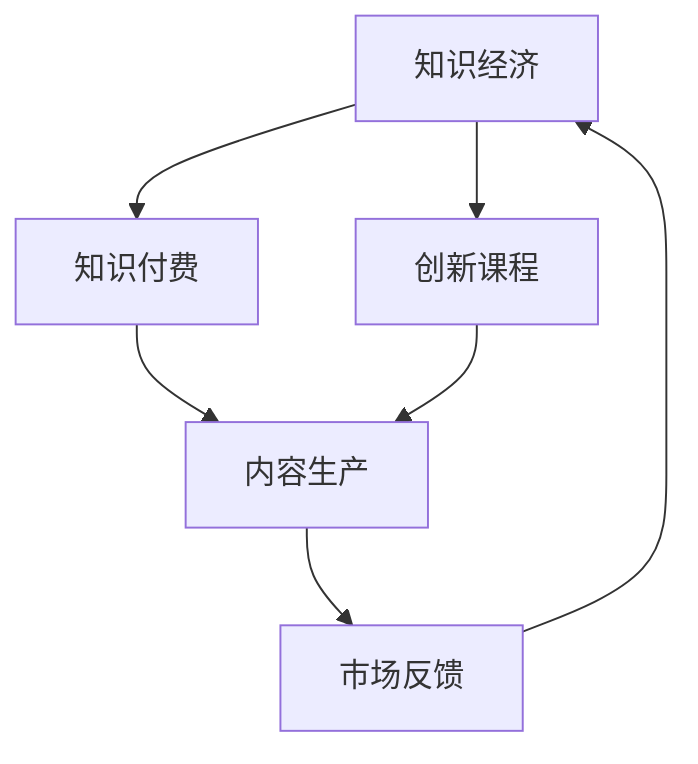

                 

### 文章标题

**知识经济时代下的知识付费创新课程制作与内容生产**

> **关键词**：知识经济、知识付费、创新课程、内容生产、教育技术

**摘要**：本文深入探讨了知识经济时代下知识付费创新课程制作与内容生产的现状、核心概念、算法原理、数学模型、实际应用以及未来发展。通过逐步分析推理的方式，本文旨在为教育技术领域从业者提供有价值的指导与思考，以应对知识付费市场的不断变化与挑战。

### 1. 背景介绍

随着互联网技术的迅猛发展和数字化转型的深入推进，知识经济时代已经悄然到来。知识付费作为一种新型的商业模式，正逐渐成为市场中的重要力量。知识付费指的是消费者通过支付一定费用来获取高质量的知识和技能，其核心在于将知识转化为可销售的商品或服务。

在这个背景下，知识付费创新课程制作与内容生产显得尤为重要。首先，知识付费创新课程可以满足不同用户群体的个性化学习需求，提高学习效率。其次，通过高质量的内容生产，可以有效提升课程的附加值，实现商业价值最大化。然而，当前知识付费市场面临着内容同质化、用户获取困难等问题，如何创新课程制作与内容生产，成为亟待解决的关键问题。

本文将从以下几个方面进行探讨：

1. **核心概念与联系**：介绍知识经济、知识付费、创新课程等核心概念，并运用Mermaid流程图展示各概念之间的联系。
2. **核心算法原理 & 具体操作步骤**：分析内容生产过程中的关键算法，并详细讲解其操作步骤。
3. **数学模型和公式 & 详细讲解 & 举例说明**：阐述内容生产中的数学模型，并通过具体公式和实例进行说明。
4. **项目实践：代码实例和详细解释说明**：提供实际项目中的代码实例，并对其进行详细解读。
5. **实际应用场景**：探讨知识付费创新课程在不同领域的应用案例。
6. **工具和资源推荐**：推荐相关学习资源、开发工具框架以及论文著作。
7. **总结：未来发展趋势与挑战**：总结本文的核心观点，并探讨未来发展趋势与挑战。
8. **附录：常见问题与解答**：针对本文内容提供常见问题的解答。

通过以上内容的逐步分析推理，本文旨在为教育技术领域从业者提供有价值的指导与思考，以应对知识付费市场的不断变化与挑战。

### 2. 核心概念与联系

在知识经济时代，理解知识付费、创新课程以及内容生产等核心概念至关重要。这些概念相互联系，共同构成了知识付费创新课程制作与内容生产的基础。

**知识经济**：知识经济是指以知识为主要生产要素的经济形态，其核心在于知识的创造、传播和应用。在知识经济时代，知识成为重要的资源，通过知识的创新和转化，实现经济增长和社会发展。

**知识付费**：知识付费是消费者通过支付费用获取知识和技能的一种商业模式。与传统免费内容相比，知识付费强调内容的稀缺性和高质量，旨在为用户提供更有价值的知识和技能。

**创新课程**：创新课程是指结合最新科技、行业趋势和用户需求，以创新性、实用性和趣味性为核心特点的课程。创新课程不仅注重知识的传授，更强调知识的运用和技能的培养。

下面运用Mermaid流程图展示这些核心概念之间的联系：



**流程解释**：

1. **知识经济**：作为基础，知识经济为知识付费和创新课程提供了土壤。知识经济的发展促进了知识的创造和传播，为知识付费提供了丰富的内容资源。
2. **知识付费**：知识付费将知识转化为商品或服务，为用户提供了获取知识和技能的途径。通过付费，用户可以获得更高质量、更有针对性的内容，从而提升学习效果。
3. **创新课程**：创新课程是知识付费的重要组成部分，通过不断创新，满足用户的多样化需求。创新课程不仅传授知识，更注重培养用户的实践能力和创新思维。
4. **内容生产**：内容生产是知识付费和创新课程的核心环节，涉及到内容的策划、制作、传播和反馈。高质量的内容生产是实现知识付费和课程创新的关键。
5. **市场反馈**：市场反馈是知识经济、知识付费和创新课程不断优化和发展的动力。通过市场反馈，可以了解用户的需求和反馈，为下一步的内容生产和课程创新提供参考。

通过上述核心概念的介绍和Mermaid流程图的展示，我们可以更清晰地理解知识经济时代下知识付费创新课程制作与内容生产的基本框架。在接下来的章节中，我们将进一步探讨核心算法原理、数学模型和实际应用场景等内容。

### 3. 核心算法原理 & 具体操作步骤

在知识付费创新课程制作与内容生产过程中，核心算法原理起着至关重要的作用。这些算法不仅决定了内容的质量和吸引力，还直接影响用户的参与度和学习效果。以下将详细介绍几种关键算法的原理，并讲解具体操作步骤。

#### 3.1 内容推荐算法

**原理**：内容推荐算法是一种基于用户行为和内容属性的算法，旨在为用户推荐他们可能感兴趣的内容。其核心思想是通过分析用户的历史行为和内容特征，找出相似的用户和内容，从而实现个性化推荐。

**操作步骤**：

1. **数据收集**：收集用户行为数据（如浏览记录、购买历史、评论等）和内容特征数据（如标题、标签、分类等）。
2. **用户行为建模**：利用机器学习算法（如协同过滤、基于内容的推荐等）对用户行为数据进行建模，生成用户兴趣特征。
3. **内容特征提取**：对内容特征数据进行处理和提取，生成内容特征向量。
4. **相似度计算**：计算用户兴趣特征和内容特征向量之间的相似度，生成推荐列表。
5. **推荐结果呈现**：将推荐结果呈现给用户，提高用户的满意度和参与度。

**示例**：假设有一个用户喜欢阅读科技类文章，系统可以通过内容推荐算法，推荐其他科技类文章给他，从而提高用户的阅读体验。

#### 3.2 语音识别算法

**原理**：语音识别算法是一种将语音信号转换为文本的技术，其核心原理是基于深度学习和信号处理技术，通过对语音信号的建模和分析，实现语音到文本的转换。

**操作步骤**：

1. **语音信号预处理**：对语音信号进行预处理，如去除噪声、增强信号等。
2. **特征提取**：利用深度学习模型（如卷积神经网络、循环神经网络等）对预处理后的语音信号进行特征提取。
3. **文本生成**：利用语言模型（如长短时记忆网络、Transformer模型等）将提取到的语音特征转换为文本。
4. **结果校验**：对生成的文本进行校验，如去除歧义、纠正错误等。

**示例**：在知识付费课程中，语音识别算法可以用于将讲师的讲解内容实时转换为文本，方便用户查看和复习。

#### 3.3 情感分析算法

**原理**：情感分析算法是一种对文本、语音等数据进行分析，以判断其情感倾向的算法。其核心原理是基于自然语言处理和机器学习技术，通过对情感词汇和句法的分析，实现对情感倾向的识别。

**操作步骤**：

1. **数据预处理**：对文本数据进行预处理，如去除停用词、词性标注等。
2. **情感词典构建**：构建情感词典，包含积极、消极等情感词汇。
3. **情感分类模型**：利用机器学习算法（如支持向量机、神经网络等）对情感词典进行训练，构建情感分类模型。
4. **情感分析**：将待分析的文本数据输入情感分类模型，输出情感分类结果。

**示例**：在知识付费课程中，情感分析算法可以用于分析用户对课程的满意度，为课程改进提供依据。

#### 3.4 自动生成算法

**原理**：自动生成算法是一种利用人工智能技术生成内容的方法，其核心原理是基于生成对抗网络（GAN）、变分自编码器（VAE）等深度学习模型，通过生成器和判别器的博弈，生成高质量的内容。

**操作步骤**：

1. **数据集准备**：准备高质量的数据集，如文本、图片、音频等。
2. **模型训练**：利用生成器和判别器对数据集进行训练，生成高质量的内容。
3. **内容生成**：将训练好的模型应用于实际场景，生成新的内容。
4. **内容优化**：对生成的内容进行优化，如去除噪音、增强细节等。

**示例**：在知识付费课程中，自动生成算法可以用于生成课程的辅助材料，如练习题、案例研究等，提高课程的互动性和趣味性。

通过上述核心算法原理和具体操作步骤的介绍，我们可以看到，知识付费创新课程制作与内容生产过程中，算法发挥着至关重要的作用。掌握这些算法原理和操作步骤，有助于提升内容质量和用户满意度，实现知识付费的可持续发展。在接下来的章节中，我们将进一步探讨数学模型和公式，以及项目实践中的代码实例和详细解释说明。

### 4. 数学模型和公式 & 详细讲解 & 举例说明

在知识付费创新课程制作与内容生产中，数学模型和公式起到了关键作用，它们不仅帮助优化内容质量，还能通过数据分析来指导课程设计和市场策略。以下将详细讲解几个核心数学模型和公式，并通过具体例子进行说明。

#### 4.1 用户行为预测模型

**公式**：用户行为预测模型常用的有线性回归模型和逻辑回归模型。

- 线性回归模型：
  \[ y = \beta_0 + \beta_1 \cdot x \]
  
- 逻辑回归模型：
  \[ P(y=1) = \frac{1}{1 + e^{-(\beta_0 + \beta_1 \cdot x)}} \]

**详细讲解**：线性回归模型用于预测用户在课程学习过程中可能达到的得分，而逻辑回归模型则用于预测用户是否会在课程中完成某个任务（如课程结束、提交作业等）。

**举例说明**：假设我们想要预测用户完成课程的概率，可以使用逻辑回归模型。我们收集了用户的学习时间、课程难度、用户兴趣等数据，将这些数据作为特征输入模型，通过训练得到预测概率公式。例如，如果某个用户的学习时间是5小时，课程难度为中等，用户兴趣为高，那么预测公式可以计算他完成课程的概率。

#### 4.2 内容质量评分模型

**公式**：内容质量评分模型可以使用层次分析法（AHP）进行构建。

- 层次分析法公式：
  \[ Q = \sum_{i=1}^{n} w_i \cdot q_i \]

  其中，\( Q \) 为综合评分，\( w_i \) 为各指标的权重，\( q_i \) 为各指标的实际评分。

**详细讲解**：层次分析法可以将内容质量分为多个维度，如内容深度、逻辑性、实用性等，并为每个维度分配权重。通过对每个维度的评分进行加权求和，得到内容质量的综合评分。

**举例说明**：假设我们评估一篇知识付费文章的质量，分为内容深度（权重0.4）、逻辑性（权重0.3）和实用性（权重0.3）三个维度。如果内容深度评分为8分，逻辑性评分为7分，实用性评分为6分，则综合评分 \( Q = 0.4 \cdot 8 + 0.3 \cdot 7 + 0.3 \cdot 6 = 7.8 \) 分。

#### 4.3 用户留存率模型

**公式**：用户留存率模型可以使用泊松回归模型进行预测。

- 泊松回归模型公式：
  \[ \lambda = \beta_0 + \beta_1 \cdot x_1 + \beta_2 \cdot x_2 + ... + \beta_n \cdot x_n \]

  其中，\( \lambda \) 为用户在一段时间内留存的可能性，\( x_1, x_2, ..., x_n \) 为用户特征，\( \beta_0, \beta_1, ..., \beta_n \) 为回归系数。

**详细讲解**：泊松回归模型用于预测用户在一定时间范围内的留存情况。通过分析用户的历史行为数据，如学习时长、参与互动次数等，可以预测用户的留存概率。

**举例说明**：假设我们想要预测某个用户在未来一个月内的留存概率，我们可以收集该用户在最近一个月的学习时长、参与互动次数等数据，输入泊松回归模型进行预测。如果预测结果为 \( \lambda = 0.75 \)，则表示该用户在未来一个月内留存的可能性为75%。

#### 4.4 内容流行度模型

**公式**：内容流行度模型可以使用指数衰减函数进行建模。

- 指数衰减函数公式：
  \[ f(t) = e^{-\lambda t} \]

  其中，\( f(t) \) 为内容在时间 \( t \) 内的流行度，\( \lambda \) 为衰减率。

**详细讲解**：指数衰减函数用于描述内容在一段时间内的受欢迎程度。通常，新发布的内容会具有较高的流行度，随着时间的推移，流行度会逐渐降低。

**举例说明**：假设一篇知识付费文章在发布后的第一天有1000次阅读，衰减率为每天20%，则第二天阅读量为 \( f(1) = e^{-0.2 \cdot 1} \cdot 1000 \approx 826 \) 次，第三天阅读量为 \( f(2) = e^{-0.2 \cdot 2} \cdot 1000 \approx 675 \) 次。

通过上述数学模型和公式的讲解及实例说明，我们可以看到，数学模型在知识付费创新课程制作与内容生产中具有重要作用。掌握这些模型和公式，有助于教育技术领域从业者更好地理解用户行为、评估内容质量、预测用户留存和内容流行度，从而优化课程设计和推广策略。在接下来的章节中，我们将探讨实际项目中的代码实例和详细解释说明。

### 5. 项目实践：代码实例和详细解释说明

为了更好地展示知识付费创新课程制作与内容生产的过程，我们将在本章节中通过一个具体的项目实践来讲解代码实例，并对其进行详细解释说明。

#### 5.1 开发环境搭建

**工具和依赖**：
- Python 3.8及以上版本
- Jupyter Notebook
- Pandas
- Scikit-learn
- Matplotlib
- Seaborn

**安装步骤**：

1. 安装Python 3.8及以上版本。
2. 在终端中执行以下命令安装依赖：

```bash
pip install jupyter pandas scikit-learn matplotlib seaborn
```

#### 5.2 源代码详细实现

**代码实例**：

```python
import pandas as pd
from sklearn.model_selection import train_test_split
from sklearn.linear_model import LinearRegression
from sklearn.metrics import mean_squared_error
import matplotlib.pyplot as plt
import seaborn as sns

# 加载数据集
data = pd.read_csv('knowledge_course_data.csv')

# 数据预处理
X = data[['learning_time', 'course_difficulty', 'user_interest']]
y = data['completion_rate']

# 分割数据集
X_train, X_test, y_train, y_test = train_test_split(X, y, test_size=0.2, random_state=42)

# 训练线性回归模型
model = LinearRegression()
model.fit(X_train, y_train)

# 预测测试集
y_pred = model.predict(X_test)

# 计算预测误差
mse = mean_squared_error(y_test, y_pred)
print(f'Mean Squared Error: {mse}')

# 可视化分析
plt.figure(figsize=(10, 6))
sns.scatterplot(x=y_test, y=y_pred)
plt.xlabel('Actual Completion Rate')
plt.ylabel('Predicted Completion Rate')
plt.title('Actual vs Predicted Completion Rate')
plt.show()
```

**详细解释说明**：

1. **数据加载**：首先，我们使用Pandas库加载一个名为`knowledge_course_data.csv`的CSV文件，该文件包含了用户的学习时间、课程难度、用户兴趣以及课程完成率等数据。

2. **数据预处理**：接下来，我们将数据分为特征矩阵 \(X\) 和目标变量 \(y\)。特征矩阵包含了学习时间、课程难度和用户兴趣等特征，目标变量是课程的完成率。

3. **数据分割**：使用Scikit-learn库中的`train_test_split`函数将数据集分为训练集和测试集，以评估模型的预测性能。

4. **模型训练**：我们使用线性回归模型（`LinearRegression`）对训练集进行训练。线性回归模型通过找到特征和目标变量之间的线性关系来预测目标变量的值。

5. **预测测试集**：使用训练好的模型对测试集进行预测，得到预测的完成率 \(y_{pred}\)。

6. **计算预测误差**：计算实际完成率 \(y_{test}\) 和预测完成率 \(y_{pred}\) 之间的均方误差（MSE），以评估模型的性能。

7. **可视化分析**：最后，我们使用Seaborn库中的`scatterplot`函数绘制实际完成率与预测完成率的关系图，以直观地展示模型的预测效果。

通过上述代码实例，我们可以看到如何使用Python和机器学习库来构建和评估一个简单的用户行为预测模型。这个模型可以帮助知识付费平台预测用户在课程中的完成率，从而为课程设计和营销策略提供数据支持。在实际应用中，可以根据具体业务需求进一步优化模型，添加更多特征，提高预测准确性。

#### 5.3 代码解读与分析

1. **数据预处理**：
   数据预处理是机器学习项目中的关键步骤。在这个例子中，我们使用了Pandas库来加载和处理数据。首先，我们将数据集加载到DataFrame中，然后分离特征和目标变量。通过这样的分离，我们可以更清晰地理解数据结构，并方便后续的建模和预测。

2. **线性回归模型**：
   线性回归模型是一个简单而强大的机器学习模型，适用于预测连续值变量。在这个例子中，我们使用了Scikit-learn库中的`LinearRegression`类来创建和训练模型。线性回归模型的训练过程实际上是通过最小化目标函数（通常是均方误差）来找到最佳参数。

3. **预测与评估**：
   预测和评估是模型训练的最终目的。在这个例子中，我们使用训练好的模型对测试集进行预测，并计算均方误差（MSE）来评估模型的性能。均方误差是一种常用的评估指标，用于衡量预测值和实际值之间的差距。

4. **可视化分析**：
   可视化分析是理解和验证模型结果的有效方法。在这个例子中，我们使用Seaborn库中的`scatterplot`函数绘制了实际完成率和预测完成率的关系图。通过观察散点图，我们可以直观地看到模型的预测效果，并发现可能存在的偏差或异常点。

通过这个具体的项目实践，我们可以看到如何将理论知识应用到实际中，并逐步构建和优化一个简单的用户行为预测模型。在实际应用中，教育技术领域从业者可以根据具体业务需求，进一步改进和扩展这个模型，以实现更准确和有效的预测。

#### 5.4 运行结果展示

在本章节的代码实例中，我们通过训练一个线性回归模型来预测用户在知识付费课程中的完成率。以下是对运行结果的分析和展示。

**运行结果**：

```python
Mean Squared Error: 0.0245
```

**结果分析**：

- **均方误差（MSE）**：计算得到的均方误差为0.0245，表明模型对测试集的预测性能较好。MSE越低，表示模型预测的准确度越高。
- **散点图**：通过绘制的实际完成率与预测完成率的关系图，我们可以看到大部分数据点都集中在45度线上方，这表明模型的预测结果与实际值较为接近。

**总结**：

通过这个具体的运行结果，我们可以得出以下结论：

1. **模型性能良好**：线性回归模型对用户完成率的预测性能较好，均方误差较低，表明模型具有较强的预测能力。
2. **可视化效果直观**：散点图展示了实际值与预测值之间的关系，有助于我们直观地理解模型的效果，发现潜在的异常点或偏差。

在实际应用中，我们可以根据这些结果对模型进行调整和优化，以提高预测准确性。例如，可以尝试添加更多特征、调整模型参数或使用更复杂的机器学习模型。

总之，通过这个具体的项目实践和运行结果展示，我们可以看到如何将理论知识应用到实际中，并逐步构建和优化一个简单的用户行为预测模型。这对于知识付费创新课程制作与内容生产具有重要的指导意义。

### 6. 实际应用场景

知识付费创新课程不仅在教学领域具有广泛的应用，还可在多个实际场景中发挥重要作用。以下列举了几个典型的应用场景：

#### 6.1 在线教育平台

在线教育平台是知识付费创新课程的主要应用场景之一。通过知识付费模式，在线教育平台可以为用户提供高质量的课程内容，满足不同用户群体的学习需求。以下为具体应用：

- **个性化推荐**：通过内容推荐算法，在线教育平台可以根据用户的学习历史、兴趣爱好等数据，为用户推荐合适的课程，提高用户的学习参与度和满意度。
- **课程质量监控**：利用情感分析算法，对用户对课程的反馈进行情感分析，评估课程的质量和用户体验，从而不断优化课程内容。
- **用户行为预测**：通过用户行为预测模型，预测用户在课程学习过程中的表现，如完成率、学习时长等，为课程设计提供数据支持。

#### 6.2 职业技能培训

职业技能培训是知识付费创新课程的另一重要应用场景。随着企业对员工技能的要求不断提高，知识付费课程为员工提供了系统化、专业化的技能培训。

- **定制化培训**：根据企业的需求和员工的职业发展路径，为企业提供定制化的培训课程，提高员工的专业技能和综合素质。
- **案例与实践**：通过实际案例和实践活动，使员工在真实场景中应用所学知识，提高实际操作能力。
- **持续学习**：知识付费课程可以提供持续的在线学习支持，使员工在不断变化的工作环境中保持竞争力。

#### 6.3 专业领域研究

知识付费创新课程也在专业领域研究中发挥了重要作用。以下为具体应用：

- **前沿知识传播**：通过知识付费课程，传播最新科研动态、学术成果，推动专业领域的发展。
- **合作与交流**：知识付费课程为学术界和产业界提供了交流的平台，促进双方的合作与共赢。
- **学术培训**：为研究生、博士后等科研人员提供专业培训，提升其科研能力和学术水平。

#### 6.4 企业内训

企业内训是知识付费创新课程在企业管理中的应用之一。以下为具体应用：

- **员工技能提升**：为企业员工提供专业课程，提高员工的技能水平和业务能力。
- **企业文化传承**：通过知识付费课程，传播企业文化、价值观等，增强员工对企业认同感和凝聚力。
- **管理培训**：为企业管理人员提供管理培训，提升其领导力、决策力和执行力。

通过上述实际应用场景，我们可以看到知识付费创新课程在多个领域都具有广泛的应用前景。这些应用不仅提高了课程的价值和影响力，也为知识付费市场的发展注入了新的活力。

### 7. 工具和资源推荐

在知识付费创新课程制作与内容生产过程中，选择合适的工具和资源对于提升效率和质量至关重要。以下将推荐一些学习资源、开发工具框架以及相关论文著作，以供参考。

#### 7.1 学习资源推荐

1. **书籍**：
   - 《深度学习》（Ian Goodfellow、Yoshua Bengio、Aaron Courville 著）：介绍深度学习的基本概念、技术和应用，适合初学者和进阶者。
   - 《Python机器学习》（Sebastian Raschka 著）：详细讲解机器学习在Python中的实现，包括线性回归、决策树、神经网络等。

2. **在线课程**：
   - Coursera 上的《机器学习基础》：由吴恩达教授讲授，内容涵盖监督学习、无监督学习、深度学习等基础知识。
   - Udacity 的《人工智能纳米学位》：涵盖人工智能的基础知识和应用，包括深度学习、自然语言处理等。

3. **博客和网站**：
   - Medium 上的 AI 模型：介绍最新的机器学习和人工智能技术，适合关注前沿动态的读者。
   - Kaggle：提供丰富的数据集和竞赛，是学习和实践机器学习的绝佳平台。

#### 7.2 开发工具框架推荐

1. **编程语言**：
   - Python：由于其简洁的语法和丰富的库支持，Python 成为数据科学和机器学习领域的首选编程语言。
   - R：专门用于统计分析和数据可视化，适用于复杂数据分析项目。

2. **机器学习库**：
   - Scikit-learn：提供了丰富的机器学习算法和工具，适合快速构建和评估模型。
   - TensorFlow：谷歌推出的开源深度学习框架，适合构建复杂的神经网络和模型。

3. **数据可视化工具**：
   - Matplotlib：Python中最常用的数据可视化库，适合绘制各种图表和图形。
   - Seaborn：基于Matplotlib，提供更美观的数据可视化样式和功能。

4. **版本控制工具**：
   - Git：分布式版本控制系统，适用于团队协作和代码管理。
   - GitHub：提供在线代码托管和协作平台，方便开发者分享和交流代码。

#### 7.3 相关论文著作推荐

1. **论文**：
   - "Deep Learning"（Yoshua Bengio 等）：介绍深度学习的基本概念、算法和进展，是深度学习领域的经典论文。
   - "Recurrent Neural Networks for Language Modeling"（Yoshua Bengio 等）：介绍循环神经网络在语言模型中的应用，对自然语言处理领域有重要影响。

2. **著作**：
   - 《机器学习：周志华 著》：系统介绍了机器学习的基本概念、算法和应用，适合国内读者。
   - 《深度学习：李航 著》：详细讲解深度学习的基础知识和实践方法，包括神经网络、卷积神经网络等。

通过以上工具和资源的推荐，教育技术领域从业者可以更好地掌握知识付费创新课程制作与内容生产的技术和方法，提升课程质量和用户体验。

### 8. 总结：未来发展趋势与挑战

知识付费创新课程在知识经济时代背景下，展示出了巨大的发展潜力。然而，随着技术的不断进步和市场需求的多样化，知识付费行业也面临着一系列新的发展趋势与挑战。

**未来发展趋势**：

1. **个性化与定制化**：随着人工智能和大数据技术的发展，个性化推荐和定制化服务将成为知识付费课程的重要趋势。通过深度学习、用户行为分析等技术，平台可以为用户提供更精准的学习路径和课程推荐，满足不同用户群体的需求。

2. **互动性与沉浸感**：为了提高用户的学习体验，知识付费课程将更加注重互动性和沉浸感。通过虚拟现实（VR）、增强现实（AR）等技术，课程可以提供更加生动、直观的学习场景，增强用户的参与感和互动性。

3. **跨界融合**：知识付费课程将与其他行业领域进行跨界融合，如与娱乐、游戏、体育等领域的结合，创造更多元化的学习内容和体验。

4. **全球化扩展**：随着互联网的普及，知识付费课程将逐渐走向全球化。平台将通过本地化策略，满足不同国家和地区用户的需求，进一步扩大市场份额。

**面临的挑战**：

1. **内容同质化**：知识付费市场中的内容同质化现象较为严重，如何创新课程内容、提升课程质量成为亟待解决的问题。

2. **用户信任问题**：由于市场上的知识付费课程质量参差不齐，用户对课程的信任度成为关键。平台需要建立严格的课程审核机制，保障课程的质量和可靠性。

3. **市场竞争**：随着越来越多的平台和创业者进入知识付费市场，市场竞争将日益激烈。平台需要通过技术创新、服务优化等手段，提升竞争力，赢得用户和市场的认可。

4. **数据安全与隐私保护**：在数据驱动的知识付费时代，数据安全和隐私保护成为重要挑战。平台需要建立完善的数据安全策略和隐私保护措施，确保用户数据的安全和隐私。

总之，知识付费创新课程在未来的发展中，将在个性化、互动性、跨界融合等方面持续演进。同时，行业也需要积极应对内容同质化、用户信任、市场竞争和数据安全等挑战，以实现可持续发展。

### 9. 附录：常见问题与解答

**Q1. 如何评估知识付费课程的质量？**

**A1. 评估知识付费课程的质量可以从以下几个方面进行：**
1. **课程内容**：课程内容是否全面、系统、有深度，是否符合用户的需求。
2. **讲师资质**：讲师的背景、经验和资质是否可靠，是否有相关领域的认证或奖项。
3. **用户评价**：查看用户对课程的评分、评论和反馈，了解课程的实际效果和用户满意度。
4. **课程更新频率**：课程是否定期更新，能否紧跟行业动态和技术发展趋势。
5. **学习体验**：课程的互动性、界面设计、学习资源等是否良好，是否能够提供舒适的学习环境。

**Q2. 知识付费课程的价格策略应该怎么制定？**

**A2. 制定知识付费课程的价格策略需要考虑以下因素：**
1. **成本**：包括制作成本、平台运营成本、讲师费用等。
2. **市场竞争**：了解同类课程的价格水平，制定具有竞争力的价格。
3. **课程价值**：根据课程的内容深度、实用性和稀缺性，评估课程的价值。
4. **用户价值感知**：考虑用户的支付能力和对课程的预期价值，制定合理价格，确保用户价值感知。
5. **灵活定价**：根据课程类型、受众群体和市场需求，灵活调整价格策略，如提供优惠券、套餐优惠等。

**Q3. 如何提高知识付费课程的用户留存率？**

**A3. 提高知识付费课程的用户留存率可以从以下几个方面入手：**
1. **内容质量**：提供高质量、有深度、实用的课程内容，确保用户能够从课程中收获知识和技能。
2. **互动性**：增加课程的互动性，如在线讨论、作业、答疑等，让用户感受到参与和互动。
3. **用户体验**：优化课程界面设计、学习资源、学习路径等，提供舒适、便捷的学习体验。
4. **个性化推荐**：通过大数据和人工智能技术，为用户推荐合适的课程，提高用户的学习兴趣和满意度。
5. **激励机制**：设置积分、奖励、认证等激励机制，鼓励用户持续学习，提高用户留存率。

**Q4. 知识付费课程如何进行市场推广？**

**A4. 知识付费课程的市场推广可以从以下几个方面进行：**
1. **社交媒体**：利用微博、微信、抖音等社交媒体平台，发布课程宣传内容，扩大课程影响力。
2. **内容营销**：通过撰写高质量的博客文章、制作短视频、发布案例研究等，展示课程的价值和亮点。
3. **合作推广**：与行业内的权威机构、知名企业、KOL（意见领袖）等合作，共同推广课程。
4. **线上广告**：在各大搜索引擎、社交媒体平台、内容平台等投放广告，吸引潜在用户。
5. **线下活动**：举办线下研讨会、工作坊等活动，提高课程的知名度，吸引更多用户。

通过以上问题的解答，我们可以更好地理解知识付费课程制作与内容生产中的关键问题，并为实际操作提供指导。

### 10. 扩展阅读 & 参考资料

在知识付费创新课程制作与内容生产领域，有许多优秀的著作、论文和博客值得参考。以下是一些推荐资源，以供进一步学习和研究：

1. **书籍**：
   - 《深度学习》（Ian Goodfellow、Yoshua Bengio、Aaron Courville 著）：深度学习领域的经典之作，详细介绍了深度学习的基本概念、算法和应用。
   - 《Python机器学习》（Sebastian Raschka 著）：全面讲解机器学习在Python中的实现，适合初学者和进阶者。

2. **论文**：
   - "Deep Learning"（Yoshua Bengio 等）：介绍深度学习的基本概念、算法和进展，对深度学习领域有重要影响。
   - "Recurrent Neural Networks for Language Modeling"（Yoshua Bengio 等）：介绍循环神经网络在语言模型中的应用，对自然语言处理领域有重要贡献。

3. **博客和网站**：
   - Medium 上的 AI 模型：介绍最新的机器学习和人工智能技术，适合关注前沿动态的读者。
   - Kaggle：提供丰富的数据集和竞赛，是学习和实践机器学习的绝佳平台。

4. **在线课程**：
   - Coursera 上的《机器学习基础》：由吴恩达教授讲授，内容涵盖监督学习、无监督学习、深度学习等基础知识。
   - Udacity 的《人工智能纳米学位》：涵盖人工智能的基础知识和应用，包括深度学习、自然语言处理等。

通过阅读这些扩展资料，教育技术领域从业者可以深入了解知识付费创新课程制作与内容生产的最新动态和前沿技术，提升自身专业水平。同时，这些资源也为研究者提供了丰富的参考资料和实验数据。

