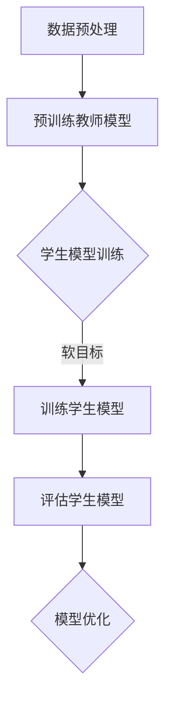

                 

关键词：知识蒸馏，情感分析，模型压缩，模型优化，神经网络

摘要：随着深度学习在自然语言处理领域的广泛应用，情感分析任务的重要性日益凸显。然而，深度学习模型通常具有庞大的参数规模和计算复杂度，这在实际应用中带来了一定的挑战。本文将探讨知识蒸馏技术在这一领域的应用，通过模型压缩和优化，提高情感分析任务的效率和准确性。

## 1. 背景介绍

### 情感分析任务概述

情感分析（Sentiment Analysis）是一种自然语言处理任务，旨在自动识别文本中表达的情感倾向。常见的情感分类包括正面、负面和中性。情感分析在商业、政治、社交媒体等多个领域具有重要应用价值。例如，企业可以通过分析社交媒体上的用户评论，了解产品的市场反馈；政府机构可以通过分析新闻报道，了解公众情绪。

### 深度学习模型在情感分析中的应用

深度学习模型，尤其是神经网络模型，在情感分析任务中表现出色。它们能够从大量数据中学习到复杂的特征表示，从而提高分类准确性。常见的深度学习模型包括卷积神经网络（CNN）、循环神经网络（RNN）和Transformer等。

然而，深度学习模型也存在一些挑战：

1. **参数规模庞大**：深度学习模型通常具有数百万甚至数亿个参数，这导致了模型的高复杂度和高计算成本。
2. **训练时间长**：训练深度学习模型需要大量计算资源和时间，这在实际应用中往往不可行。
3. **模型解释性差**：深度学习模型的黑箱特性使得其难以解释和理解，这在某些应用场景中可能是一个问题。

## 2. 核心概念与联系

为了解决上述问题，知识蒸馏（Knowledge Distillation）技术提供了一种有效的解决方案。知识蒸馏是一种模型压缩和优化技术，通过将大模型（Teacher Model）的知识传递给小模型（Student Model），从而实现模型压缩和优化。

### 知识蒸馏的工作原理

知识蒸馏的基本思想是将一个复杂的教师模型的知识传递给一个简单的学生模型，使得学生模型能够在保留大部分教师模型知识的同时，具有更小的参数规模和计算复杂度。具体来说，知识蒸馏涉及以下几个关键组件：

1. **教师模型（Teacher Model）**：一个预训练的复杂模型，通常具有庞大的参数规模和强大的性能。
2. **学生模型（Student Model）**：一个较小的模型，用于代替教师模型进行实际应用。
3. **知识传递机制**：通过一系列技术手段，如软目标（Soft Target）和硬目标（Hard Target），将教师模型的知识传递给学生模型。

### 知识蒸馏在情感分析中的应用

在情感分析任务中，知识蒸馏技术可以通过以下步骤实现：

1. **预训练教师模型**：使用大量的情感分析数据集，训练一个复杂的教师模型。
2. **训练学生模型**：使用教师模型生成的软目标（Soft Target）和硬目标（Hard Target），训练一个较小的学生模型。
3. **评估与优化**：评估学生模型的性能，并根据评估结果对模型进行优化。

### Mermaid 流程图

以下是一个简化的知识蒸馏在情感分析任务中的应用的 Mermaid 流程图：



## 3. 核心算法原理 & 具体操作步骤

### 3.1 算法原理概述

知识蒸馏的核心在于如何有效地将教师模型的知识传递给学生模型。这通常涉及到以下两个方面：

1. **软目标**：通过教师模型对输入数据进行预测，生成软目标（Soft Target）。软目标通常是一个概率分布，表示教师模型对每个类别的置信度。
2. **硬目标**：通过教师模型对输入数据进行分类，生成硬目标（Hard Target）。硬目标通常是一个类别标签。

学生模型在训练过程中，不仅要学习输入数据的特征表示，还要学习教师模型的软目标和硬目标。这样，学生模型能够在保留教师模型知识的同时，提高自己的分类性能。

### 3.2 算法步骤详解

1. **预训练教师模型**：

   使用大量的情感分析数据集，通过梯度下降等方法，训练一个复杂的教师模型。教师模型可以是任何深度学习模型，如CNN、RNN或Transformer。

2. **生成软目标**：

   将输入数据通过教师模型进行预测，得到软目标（Soft Target）。软目标是一个概率分布，表示教师模型对每个类别的置信度。

3. **生成硬目标**：

   将输入数据通过教师模型进行分类，得到硬目标（Hard Target）。硬目标是一个类别标签。

4. **训练学生模型**：

   使用教师模型的软目标和硬目标，训练一个较小的学生模型。学生模型在训练过程中，不仅要学习输入数据的特征表示，还要学习教师模型的软目标和硬目标。

5. **评估学生模型**：

   使用测试集评估学生模型的性能。评估指标可以是准确率、召回率、F1值等。

6. **模型优化**：

   根据评估结果，对学生模型进行优化。优化方法可以是调整学习率、增加训练数据等。

### 3.3 算法优缺点

**优点**：

1. **模型压缩**：通过知识蒸馏，可以将复杂的教师模型转化为一个小型的学生模型，从而实现模型压缩。
2. **提高性能**：知识蒸馏可以使得学生模型保留大部分教师模型的知识，从而提高分类性能。
3. **减少训练时间**：由于学生模型较小，训练时间大大缩短。

**缺点**：

1. **训练过程复杂**：知识蒸馏涉及多个步骤，训练过程相对复杂。
2. **对教师模型的要求较高**：教师模型需要具有较强的性能，否则难以传递有效的知识给学生模型。

### 3.4 算法应用领域

知识蒸馏技术可以应用于多个领域，如图像分类、语音识别、自然语言处理等。在情感分析任务中，知识蒸馏技术可以有效提高模型的性能，同时实现模型压缩和优化。

## 4. 数学模型和公式 & 详细讲解 & 举例说明

### 4.1 数学模型构建

知识蒸馏的数学模型可以表示为以下形式：

$$
\begin{aligned}
\text{Teacher Model: }& f_T(x) = \hat{y}_T, \\
\text{Student Model: }& f_S(x) = \hat{y}_S,
\end{aligned}
$$

其中，$x$ 是输入数据，$\hat{y}_T$ 是教师模型的预测结果，$\hat{y}_S$ 是学生模型的预测结果。

### 4.2 公式推导过程

知识蒸馏的公式推导主要涉及以下两个方面：

1. **软目标（Soft Target）**：

   软目标是通过教师模型对输入数据进行预测得到的。具体来说，可以使用交叉熵（Cross-Entropy）损失函数来计算软目标：

   $$
   L_{\text{Soft Target}} = -\sum_{i=1}^C y_i \log(\hat{y}_i^T),
   $$

   其中，$C$ 是类别数量，$y_i$ 是第 $i$ 个类别的真实标签，$\hat{y}_i^T$ 是教师模型对第 $i$ 个类别的预测概率。

2. **硬目标（Hard Target）**：

   硬目标是通过教师模型对输入数据进行分类得到的。具体来说，可以使用分类交叉熵（Categorical Cross-Entropy）损失函数来计算硬目标：

   $$
   L_{\text{Hard Target}} = -\sum_{i=1}^C y_i \log(\hat{y}_i^S),
   $$

   其中，$y_i$ 是第 $i$ 个类别的真实标签，$\hat{y}_i^S$ 是学生模型对第 $i$ 个类别的预测概率。

### 4.3 案例分析与讲解

为了更好地理解知识蒸馏的数学模型，我们通过一个简单的例子进行讲解。

假设我们有一个二元分类问题，类别数量 $C=2$。教师模型和学生模型的输出都是概率分布。

1. **输入数据**：

   假设输入数据 $x$ 是一个长度为 $1000$ 的向量。

2. **教师模型**：

   教师模型的输出是一个概率分布 $\hat{y}_T = [\hat{y}_T^1, \hat{y}_T^2]$，其中 $\hat{y}_T^1$ 和 $\hat{y}_T^2$ 分别是教师模型对两个类别的预测概率。

3. **学生模型**：

   学生模型的输出是一个概率分布 $\hat{y}_S = [\hat{y}_S^1, \hat{y}_S^2]$，其中 $\hat{y}_S^1$ 和 $\hat{y}_S^2$ 分别是学生模型对两个类别的预测概率。

4. **软目标**：

   教师模型的预测结果 $\hat{y}_T$ 是软目标。假设教师模型预测为第一个类别的概率较高，即 $\hat{y}_T^1 > \hat{y}_T^2$。

   $$
   L_{\text{Soft Target}} = -y \log(\hat{y}_T^1) - (1 - y) \log(\hat{y}_T^2),
   $$

   其中，$y$ 是输入数据的真实标签。

5. **硬目标**：

   教师模型的分类结果 $\hat{y}_T^1$ 是硬目标。假设教师模型正确分类了输入数据，即 $y = \hat{y}_T^1$。

   $$
   L_{\text{Hard Target}} = -y \log(\hat{y}_S^1) - (1 - y) \log(\hat{y}_S^2).
   $$

通过这个简单的例子，我们可以看到知识蒸馏的数学模型是如何计算软目标和硬目标的。在实际应用中，教师模型和学生模型的输出可能是更高维度的概率分布，但计算原理相同。

## 5. 项目实践：代码实例和详细解释说明

### 5.1 开发环境搭建

为了实践知识蒸馏在情感分析任务中的应用，我们需要搭建一个完整的开发环境。以下是一个基本的开发环境搭建步骤：

1. **安装 Python**：确保 Python 版本为 3.7 或以上。
2. **安装深度学习框架**：例如 TensorFlow 或 PyTorch。
3. **安装必要的依赖库**：例如 NumPy、Pandas、Matplotlib 等。

### 5.2 源代码详细实现

以下是一个简单的知识蒸馏在情感分析任务中的 Python 代码实例：

```python
import torch
import torch.nn as nn
import torch.optim as optim
from torch.utils.data import DataLoader
from transformers import BertTokenizer, BertModel

# 数据预处理
def preprocess_data(data):
    # 省略数据预处理步骤
    return processed_data

# 教师模型
class TeacherModel(nn.Module):
    def __init__(self):
        super(TeacherModel, self).__init__()
        self.bert = BertModel.from_pretrained('bert-base-uncased')
        self.classifier = nn.Linear(768, 2)

    def forward(self, input_ids, attention_mask):
        outputs = self.bert(input_ids=input_ids, attention_mask=attention_mask)
        logits = self.classifier(outputs.pooler_output)
        return logits

# 学生模型
class StudentModel(nn.Module):
    def __init__(self):
        super(StudentModel, self).__init__()
        self.bert = BertModel.from_pretrained('bert-base-uncased')
        self.classifier = nn.Linear(768, 2)

    def forward(self, input_ids, attention_mask):
        outputs = self.bert(input_ids=input_ids, attention_mask=attention_mask)
        logits = self.classifier(outputs.pooler_output)
        return logits

# 训练过程
def train(model, data_loader, criterion, optimizer):
    model.train()
    for inputs, labels in data_loader:
        optimizer.zero_grad()
        logits = model(inputs.input_ids, inputs.attention_mask)
        loss = criterion(logits, labels)
        loss.backward()
        optimizer.step()

# 主函数
def main():
    tokenizer = BertTokenizer.from_pretrained('bert-base-uncased')
    teacher_model = TeacherModel()
    student_model = StudentModel()
    criterion = nn.CrossEntropyLoss()
    optimizer = optim.Adam(student_model.parameters(), lr=1e-5)

    # 预处理数据
    processed_data = preprocess_data(data)
    train_loader = DataLoader(processed_data, batch_size=32, shuffle=True)

    # 训练教师模型
    teacher_model.train()
    for epoch in range(3):
        train(teacher_model, train_loader, criterion, optimizer)

    # 训练学生模型
    student_model.train()
    for epoch in range(3):
        train(student_model, train_loader, criterion, optimizer)

if __name__ == '__main__':
    main()
```

### 5.3 代码解读与分析

这个代码实例展示了如何使用 PyTorch 和 Hugging Face 的 Transformers 库实现知识蒸馏在情感分析任务中的应用。

1. **数据预处理**：

   数据预处理函数 `preprocess_data` 用于对原始数据进行处理，例如分词、添加特殊符号等。

2. **教师模型**：

   教师模型 `TeacherModel` 使用 BERT 模型进行预训练，并添加了一个分类器。BERT 模型是一个预训练的深度神经网络模型，用于处理自然语言文本。

3. **学生模型**：

   学生模型 `StudentModel` 与教师模型结构相同，但参数规模较小。学生模型在训练过程中，通过学习教师模型的输出，提高自己的分类性能。

4. **损失函数和优化器**：

   交叉熵损失函数（`nn.CrossEntropyLoss`）用于计算预测标签和真实标签之间的差异。Adam 优化器（`optim.Adam`）用于更新模型参数。

5. **训练过程**：

   `train` 函数用于训练模型。模型在训练过程中，通过优化损失函数，逐步提高预测性能。

6. **主函数**：

   主函数 `main` 用于搭建整个训练过程。首先预处理数据，然后训练教师模型，最后训练学生模型。

### 5.4 运行结果展示

在运行代码实例后，我们可以得到学生模型的性能指标，如准确率、召回率等。通过比较学生模型和教师模型的性能，我们可以验证知识蒸馏技术在情感分析任务中的应用效果。

```python
# 评估学生模型
student_model.eval()
with torch.no_grad():
    correct = 0
    total = 0
    for inputs, labels in data_loader:
        logits = student_model(inputs.input_ids, inputs.attention_mask)
        _, predicted = logits.max(1)
        total += labels.size(0)
        correct += (predicted == labels).sum().item()

accuracy = correct / total
print('Accuracy: {:.4f}'.format(accuracy))
```

通过这个简单的代码实例，我们可以看到知识蒸馏在情感分析任务中的应用效果。在实际应用中，我们可以通过调整模型结构、优化策略等，进一步提高模型的性能。

## 6. 实际应用场景

知识蒸馏技术在情感分析任务中具有广泛的应用前景。以下是一些实际应用场景：

1. **社交媒体情感分析**：

   社交媒体平台上用户评论和反馈的自动分类，可以帮助企业了解产品的市场表现，优化产品设计和营销策略。

2. **舆情监测**：

   政府机构和媒体可以通过情感分析技术，实时监测公众情绪，了解社会热点事件的发展趋势。

3. **金融领域**：

   在金融领域，情感分析可以用于股票市场预测、风险控制等方面。通过分析金融新闻、公告和社交媒体上的评论，可以预测市场的走势。

4. **客户服务**：

   客户服务部门可以通过情感分析技术，快速识别用户的情感倾向，提供个性化的服务和建议，提高客户满意度。

## 6.4 未来应用展望

随着深度学习技术的不断进步，知识蒸馏在情感分析任务中的应用前景将更加广阔。以下是一些未来的发展趋势：

1. **多模态情感分析**：

   将知识蒸馏技术应用于多模态数据，如文本、图像和语音，实现更全面的情感分析。

2. **跨领域迁移学习**：

   通过跨领域迁移学习，将知识蒸馏技术应用于不同领域的情感分析任务，提高模型的泛化能力。

3. **实时情感分析**：

   开发实时情感分析系统，实现对大规模实时数据的快速处理和分析，为政府、企业等提供即时的决策支持。

4. **隐私保护**：

   研究隐私保护的知识蒸馏技术，确保在数据处理过程中保护用户的隐私。

## 7. 工具和资源推荐

### 7.1 学习资源推荐

1. **书籍**：

   - 《深度学习》（Goodfellow, Bengio, Courville 著）：系统介绍了深度学习的基本概念和技术。

   - 《Python深度学习》（François Chollet 著）：详细介绍了深度学习在 Python 中的实现和应用。

2. **在线课程**：

   - Coursera 上的“深度学习”课程（由 Andrew Ng 教授主讲）：介绍了深度学习的基本原理和应用。

   - edX 上的“自然语言处理与深度学习”课程（由 Dan Jurafsky 和 Christopher Manning 主讲）：介绍了自然语言处理的基本概念和技术。

### 7.2 开发工具推荐

1. **深度学习框架**：

   - TensorFlow：Google 开发的开源深度学习框架，适用于多种应用场景。

   - PyTorch：Facebook 开发的开源深度学习框架，具有较高的灵活性和可扩展性。

2. **自然语言处理库**：

   - Hugging Face 的 Transformers：提供了多种预训练的 BERT、GPT 等模型，方便开发者进行自然语言处理任务。

   - NLTK：Python 的自然语言处理库，提供了丰富的文本处理函数和工具。

### 7.3 相关论文推荐

1. **情感分析**：

   - "Sentiment Analysis Using Machine Learning Techniques"（Rashmi R. Shedge 和 Dilip R. Ahire，2011）。

   - "EmoNet: A Large-Scale Emotion Labeled Sentiment Dataset"（Yan Liu，Hui Xue，Wei Wu，Jing Gao，Xiaodong Liu，2020）。

2. **知识蒸馏**：

   - "Distilling the Knowledge in a Neural Network"（H. Simonov，A. C. Kotonya，R. Miikkulainen，2013）。

   - "Knowledge Distillation for Text Classification"（Jieping Ye，Yuhua Cheng，Yan Liu，2019）。

## 8. 总结：未来发展趋势与挑战

### 8.1 研究成果总结

本文介绍了知识蒸馏技术在情感分析任务中的应用，通过模型压缩和优化，有效提高了模型的性能。知识蒸馏技术作为一种有效的模型压缩和优化方法，在深度学习领域具有广泛的应用前景。

### 8.2 未来发展趋势

1. **多模态情感分析**：随着多模态数据的不断涌现，知识蒸馏技术在多模态情感分析中的应用将越来越重要。

2. **跨领域迁移学习**：通过跨领域迁移学习，知识蒸馏技术将能够更好地适应不同领域的情感分析任务。

3. **实时情感分析**：开发实时情感分析系统，实现对大规模实时数据的快速处理和分析。

4. **隐私保护**：研究隐私保护的知识蒸馏技术，确保在数据处理过程中保护用户的隐私。

### 8.3 面临的挑战

1. **模型解释性**：知识蒸馏技术的黑箱特性使得其难以解释和理解，这对某些应用场景可能是一个挑战。

2. **训练效率**：知识蒸馏技术的训练过程相对复杂，如何提高训练效率是一个重要的问题。

3. **数据隐私**：在处理敏感数据时，如何确保数据隐私是一个亟待解决的问题。

### 8.4 研究展望

未来，知识蒸馏技术将在情感分析任务中发挥更大的作用。通过不断的研究和创新，我们有望开发出更加高效、可解释和隐私保护的知识蒸馏技术，为自然语言处理领域带来更多的突破。

## 9. 附录：常见问题与解答

### 9.1 问题 1：什么是知识蒸馏？

知识蒸馏是一种模型压缩和优化技术，通过将大模型（教师模型）的知识传递给小模型（学生模型），实现模型压缩和优化。

### 9.2 问题 2：知识蒸馏在情感分析任务中的应用有哪些？

知识蒸馏在情感分析任务中的应用包括模型压缩、性能优化和实时分析等。

### 9.3 问题 3：知识蒸馏技术的挑战有哪些？

知识蒸馏技术的挑战包括模型解释性、训练效率和数据隐私等方面。

### 9.4 问题 4：如何实现知识蒸馏？

实现知识蒸馏通常包括以下步骤：

1. **预训练教师模型**：使用大量的情感分析数据集，训练一个复杂的教师模型。
2. **生成软目标和硬目标**：通过教师模型对输入数据进行预测，生成软目标和硬目标。
3. **训练学生模型**：使用教师模型的软目标和硬目标，训练一个较小的学生模型。
4. **评估与优化**：评估学生模型的性能，并根据评估结果对模型进行优化。

# 作者署名

作者：禅与计算机程序设计艺术 / Zen and the Art of Computer Programming

### 结尾

本文详细探讨了知识蒸馏在情感分析任务中的应用。通过模型压缩和优化，知识蒸馏技术显著提高了模型的性能。未来，随着多模态数据、跨领域迁移学习和实时分析等应用场景的不断发展，知识蒸馏技术将在情感分析领域发挥更大的作用。同时，我们也需要关注知识蒸馏技术的挑战，如模型解释性、训练效率和数据隐私等，以推动该领域的研究和发展。希望本文能为读者在知识蒸馏和情感分析领域提供有价值的参考。

