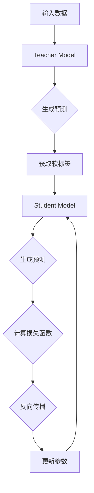

                 

### 背景介绍

知识蒸馏（Knowledge Distillation）是一种在深度学习领域中用于模型压缩和优化的重要技术。随着神经网络模型规模的不断扩大，计算资源的消耗也日益增加，这给实际应用带来了巨大的挑战。知识蒸馏通过将一个大模型（Teacher Model）的知识迁移到一个小模型（Student Model）中，从而实现降低模型复杂度和提高计算效率的目的。

在深度学习的早期，模型的大小通常是可以容忍的。但随着计算需求的增长，尤其是移动设备和嵌入式系统的普及，对模型压缩的需求变得越来越迫切。知识蒸馏的出现，为解决这一问题提供了新的思路。

知识蒸馏的基本思想是将一个复杂的大模型的知识“蒸馏”到一个较小但性能相近的模型中。这里，“大模型”通常称为“Teacher Model”，而“小模型”则被称为“Student Model”。Teacher Model拥有更深的网络结构和更多的参数，能够捕捉到更加丰富的特征信息，而Student Model则通过学习Teacher Model的输出分布来优化自身的参数，从而实现性能的迁移。

知识蒸馏技术的重要性在于，它不仅能够显著减少模型的参数数量和计算量，提高模型的部署效率，还能够提高模型的鲁棒性。在大模型和小模型之间传递知识的过程中，小模型不仅可以学习到Teacher Model的准确预测能力，还可以在一定程度上减少过拟合现象，从而提高模型的泛化能力。

本篇文章将深入探讨知识蒸馏如何改善模型的鲁棒性。我们将从核心概念和原理出发，逐步分析知识蒸馏的工作机制、具体算法步骤，并通过数学模型和项目实践来详细讲解这一过程。文章还将探讨知识蒸馏在实际应用场景中的具体表现，推荐相关的学习资源和开发工具，并总结未来发展趋势与挑战。希望本文能为读者提供一个全面且深入的了解知识蒸馏技术的窗口。

### 核心概念与联系

知识蒸馏技术的核心在于通过传递Teacher Model的知识来训练Student Model。为了更好地理解这一过程，我们需要首先了解相关的核心概念和原理，并通过Mermaid流程图来展示知识蒸馏的架构。

#### 核心概念

1. **Teacher Model（教师模型）**：Teacher Model是一个复杂、参数丰富的模型，它具有强大的特征提取和分类能力。Teacher Model通常由多个层组成，每一层都能够捕捉到输入数据的不同特征。

2. **Student Model（学生模型）**：Student Model是一个简化版的小模型，它通过学习Teacher Model的知识来优化自己的参数。Student Model的层数较少，参数数量也较少，但性能目标与Teacher Model相似。

3. **软标签（Soft Labels）**：在知识蒸馏过程中，Teacher Model的输出不是简单的硬标签（例如1或0），而是软标签（概率分布）。软标签反映了Teacher Model对每个类别的预测置信度。

4. **硬标签（Hard Labels）**：硬标签是真实标签的简单形式，例如在二分类任务中，硬标签为1或0。

#### Mermaid流程图

下面是知识蒸馏的核心流程的Mermaid流程图：



**流程解释**：

1. **输入数据（A）**：数据输入到Teacher Model（B）中。

2. **生成预测（C）**：Teacher Model对输入数据进行处理，并生成预测结果。

3. **获取软标签（D）**：Teacher Model的输出不是硬标签，而是软标签，即概率分布。

4. **Student Model训练（E）**：Student Model根据Teacher Model的软标签进行训练，并生成自己的预测。

5. **计算损失函数（G）**：通过比较Student Model的预测和Teacher Model的软标签，计算损失函数。

6. **反向传播（H）**：通过反向传播算法更新Student Model的参数。

7. **更新参数（I）**：参数更新后，Student Model重新生成预测，并继续迭代训练过程。

#### 图解说明

- **教师模型与学生的模型**：Teacher Model和Student Model的交互是知识蒸馏的核心。Teacher Model提供软标签，Student Model通过学习这些标签来优化自身的参数。

- **软标签的作用**：软标签包含了Teacher Model对每个类别的置信度，这比硬标签更能反映模型的实际预测能力。

- **损失函数的设计**：知识蒸馏的损失函数通常结合了硬标签损失和软标签损失，从而同时考虑了Student Model对真实标签的准确性和对Teacher Model的软标签的拟合程度。

通过这个Mermaid流程图，我们可以清晰地看到知识蒸馏的整个训练过程。这一过程不仅涉及Teacher Model和Student Model之间的知识传递，还包括了通过损失函数和反向传播来优化参数的步骤。这些核心概念和流程的深入理解，是进一步探讨知识蒸馏如何改善模型鲁棒性的基础。

### 核心算法原理 & 具体操作步骤

在深入探讨知识蒸馏的核心算法原理之前，我们需要先理解什么是软标签（Soft Labels）和硬标签（Hard Labels）。软标签是对输出结果的一种概率分布表示，而硬标签则是具体的类别标签。知识蒸馏的核心在于通过Teacher Model生成的软标签来指导Student Model的训练。

#### 软标签与硬标签

1. **软标签**：在深度学习模型中，特别是在分类任务中，软标签通常是一个概率分布。例如，对于一个二分类问题，Teacher Model的输出可能是 `[0.7, 0.3]`，表示模型有70%的置信度认为输入属于正类，而有30%的置信度认为它属于负类。

2. **硬标签**：硬标签是一个简单的二元标签，例如 `[1, 0]` 表示输入数据属于正类，而 `[0, 1]` 表示它属于负类。

#### 知识蒸馏算法的原理

知识蒸馏算法的核心思想是利用Teacher Model的高层次知识来指导Student Model的学习。具体来说，Teacher Model生成软标签，Student Model则根据这些软标签以及硬标签来优化自己的参数。知识蒸馏的算法可以分为以下几个步骤：

1. **Teacher Model生成软标签**：在训练过程中，Teacher Model对每个输入样本生成预测结果，这些预测结果以概率分布的形式表示，即软标签。

2. **Student Model训练**：Student Model接收硬标签和Teacher Model的软标签，通过两个损失函数的联合优化来训练自己的参数。

3. **损失函数**：知识蒸馏的损失函数通常结合了硬标签损失（如交叉熵损失）和软标签损失（如KL散度损失）。硬标签损失用于衡量Student Model对硬标签的预测准确性，而软标签损失则用于衡量Student Model对Teacher Model软标签的拟合程度。

#### 知识蒸馏算法的具体操作步骤

以下是知识蒸馏算法的具体操作步骤：

1. **初始化**：初始化Teacher Model和Student Model的参数。通常，Teacher Model使用预训练的权重，而Student Model则从随机初始化开始。

2. **前向传播**：
    - 输入样本通过Teacher Model进行前向传播，得到预测结果。
    - Teacher Model的输出是一个概率分布，即软标签。

3. **Student Model前向传播**：
    - Student Model接收相同的输入样本，并对其进行前向传播。
    - Student Model生成自己的预测结果。

4. **计算损失函数**：
    - 计算硬标签损失（如交叉熵损失），衡量Student Model对硬标签的预测准确性。
    - 计算软标签损失（如KL散度损失），衡量Student Model对Teacher Model软标签的拟合程度。

5. **反向传播**：
    - 利用硬标签损失和软标签损失的梯度进行反向传播，更新Student Model的参数。

6. **迭代训练**：
    - 重复上述步骤，通过多次迭代训练来优化Student Model的参数。

#### 损失函数的具体解释

知识蒸馏算法中的损失函数通常结合硬标签损失和软标签损失。具体来说，损失函数可以表示为：

\[ L = L_{hard} + \lambda L_{soft} \]

其中：
- \( L_{hard} \) 是硬标签损失，例如交叉熵损失：
\[ L_{hard} = -\sum_{i} y_i \log (\hat{y}_i) \]
- \( L_{soft} \) 是软标签损失，例如KL散度损失：
\[ L_{soft} = \sum_{i} p_i \log \left( \frac{p_i}{\hat{p}_i} \right) \]
- \( \lambda \) 是平衡硬标签损失和软标签损失的权重。

硬标签损失 \( L_{hard} \) 用于确保Student Model能够正确预测真实的类别标签。软标签损失 \( L_{soft} \) 则用于确保Student Model能够学习到Teacher Model的预测能力。

#### 代码示例

下面是一个简化的Python代码示例，展示了知识蒸馏算法的基本步骤：

```python
import torch
import torch.nn as nn
import torch.optim as optim

# 假设Teacher Model和Student Model已经定义
teacher_model = ...
student_model = ...

# 初始化参数
optimizer_student = optim.Adam(student_model.parameters(), lr=0.001)

# 损失函数
criterion_hard = nn.CrossEntropyLoss()
criterion_soft = nn.KLDivLoss()

# 迭代训练
for epoch in range(num_epochs):
    for inputs, targets in train_loader:
        # 前向传播
        outputs_teacher = teacher_model(inputs)
        outputs_student = student_model(inputs)

        # 计算硬标签损失
        loss_hard = criterion_hard(outputs_student, targets)

        # 计算软标签损失
        loss_soft = criterion_soft(outputs_student, outputs_teacher)

        # 计算总损失
        loss = loss_hard + lambda_weight * loss_soft

        # 反向传播
        optimizer_student.zero_grad()
        loss.backward()
        optimizer_student.step()

    print(f'Epoch [{epoch+1}/{num_epochs}], Loss: {loss.item():.4f}')
```

在这个示例中，我们使用了交叉熵损失（`criterion_hard`）和KL散度损失（`criterion_soft`）来分别计算硬标签损失和软标签损失。通过多次迭代训练，Student Model逐渐学习到Teacher Model的知识，从而提高其预测能力。

通过以上步骤，我们可以看到知识蒸馏算法的核心原理和具体操作过程。知识蒸馏通过软标签的引入，不仅提高了模型的准确性，还改善了模型的鲁棒性，为深度学习模型的优化和部署提供了有效的解决方案。

### 数学模型和公式 & 详细讲解 & 举例说明

在深入探讨知识蒸馏的数学模型和公式之前，我们需要先了解两个核心的损失函数：交叉熵损失（Cross-Entropy Loss）和KL散度损失（Kullback-Leibler Divergence Loss）。这些损失函数在知识蒸馏过程中起着至关重要的作用。

#### 交叉熵损失（Cross-Entropy Loss）

交叉熵损失函数是分类任务中常用的损失函数，用于衡量预测分布与真实分布之间的差异。在二分类问题中，交叉熵损失函数可以表示为：

\[ L_{hard} = -\sum_{i} y_i \log (\hat{y}_i) \]

其中：
- \( y_i \) 是硬标签，取值为0或1。
- \( \hat{y}_i \) 是Student Model的预测概率，取值在0和1之间。

交叉熵损失函数的目的是使得预测概率接近于硬标签。当 \( y_i = 1 \) 时，交叉熵损失函数希望 \( \hat{y}_i \) 接近1；当 \( y_i = 0 \) 时，交叉熵损失函数希望 \( \hat{y}_i \) 接近0。

#### KL散度损失（KL Divergence Loss）

KL散度损失函数用于衡量两个概率分布之间的差异。在知识蒸馏过程中，KL散度损失函数用于衡量Student Model的预测概率分布与Teacher Model的软标签分布之间的差异。KL散度损失函数可以表示为：

\[ L_{soft} = \sum_{i} p_i \log \left( \frac{p_i}{\hat{p}_i} \right) \]

其中：
- \( p_i \) 是Teacher Model的软标签分布，取值在0和1之间。
- \( \hat{p}_i \) 是Student Model的预测概率分布，取值在0和1之间。

KL散度损失函数的目的是使得Student Model的预测概率分布尽可能地接近Teacher Model的软标签分布。当 \( p_i \) 和 \( \hat{p}_i \) 相同时，KL散度损失为0，表示两者完全一致。

#### 结合硬标签损失和软标签损失的损失函数

知识蒸馏中的总损失函数通常结合了硬标签损失和软标签损失，以同时考虑预测的准确性和对Teacher Model软标签的拟合程度。损失函数可以表示为：

\[ L = L_{hard} + \lambda L_{soft} \]

其中：
- \( L_{hard} \) 是硬标签损失。
- \( L_{soft} \) 是软标签损失。
- \( \lambda \) 是平衡两个损失的权重。

通过调整 \( \lambda \) 的值，我们可以控制硬标签损失和软标签损失的相对重要性。通常，\( \lambda \) 的取值在0到1之间，当 \( \lambda \) 接近1时，更注重硬标签损失，而当 \( \lambda \) 接近0时，更注重软标签损失。

#### 公式详解

1. **硬标签损失（Cross-Entropy Loss）**：

\[ L_{hard} = -\sum_{i} y_i \log (\hat{y}_i) \]

例如，对于一个二分类任务，假设硬标签 \( y \) 为 [1, 0]，Student Model的预测概率 \( \hat{y} \) 为 [0.6, 0.4]：

\[ L_{hard} = -[1 \times \log(0.6) + 0 \times \log(0.4)] \]
\[ L_{hard} = -[\log(0.6)] \]
\[ L_{hard} \approx 0.5108 \]

2. **软标签损失（KL Divergence Loss）**：

\[ L_{soft} = \sum_{i} p_i \log \left( \frac{p_i}{\hat{p}_i} \right) \]

例如，假设Teacher Model的软标签 \( p \) 为 [0.7, 0.3]，Student Model的预测概率 \( \hat{p} \) 为 [0.5, 0.5]：

\[ L_{soft} = [0.7 \times \log \left( \frac{0.7}{0.5} \right) + 0.3 \times \log \left( \frac{0.3}{0.5} \right)] \]
\[ L_{soft} = [0.7 \times \log(1.4) + 0.3 \times \log(0.6)] \]
\[ L_{soft} \approx 0.176 + 0.115 = 0.291 \]

3. **总损失函数（Total Loss）**：

\[ L = L_{hard} + \lambda L_{soft} \]

假设 \( \lambda = 0.5 \)，则总损失为：

\[ L = 0.5108 + 0.5 \times 0.291 \]
\[ L \approx 0.5108 + 0.1455 = 0.6563 \]

通过这个例子，我们可以看到如何计算硬标签损失、软标签损失和总损失。在实际应用中，我们通常使用更高维度的数据集和更复杂的模型，但这些计算的基本原理是相同的。

#### 公式应用场景

1. **分类任务**：在分类任务中，硬标签损失用于确保模型能够正确分类，而软标签损失用于确保模型能够捕捉到Teacher Model的预测能力。

2. **特征提取任务**：在特征提取任务中，软标签损失尤为重要，因为它帮助Student Model学习到Teacher Model的特征提取能力。

3. **模型压缩**：通过知识蒸馏，我们可以使用Teacher Model的软标签来训练Student Model，从而在保持预测性能的同时减少模型参数。

综上所述，通过理解交叉熵损失和KL散度损失，我们可以更好地理解知识蒸馏的数学模型和公式。这些损失函数在知识蒸馏过程中起着至关重要的作用，帮助我们训练出更小、更鲁棒的模型。

### 项目实践：代码实例和详细解释说明

在本文的第五部分，我们将通过一个具体的代码实例来演示如何使用知识蒸馏技术来训练一个分类模型，并详细解释其中的每一步。我们将使用Python和PyTorch框架来完成这个项目，因为PyTorch提供了一个相对简单的接口来实现知识蒸馏。

#### 5.1 开发环境搭建

在开始项目之前，我们需要搭建一个合适的开发环境。以下是所需的步骤：

1. **安装PyTorch**：请访问PyTorch的官方网站（https://pytorch.org/get-started/locally/）并根据您的操作系统和Python版本下载并安装PyTorch。

2. **安装其他依赖**：除了PyTorch，我们还需要其他一些常用的库，如NumPy和Matplotlib。可以使用以下命令来安装：

   ```bash
   pip install numpy matplotlib torchvision
   ```

3. **准备数据集**：为了演示，我们将使用PyTorch内置的MNIST数据集，这是一个常用的手写数字数据集。

#### 5.2 源代码详细实现

以下是整个知识蒸馏项目的源代码，我们将逐步解释每一步。

```python
import torch
import torch.nn as nn
import torch.optim as optim
from torch.utils.data import DataLoader
from torchvision import datasets, transforms
from torch.optim.lr_scheduler import StepLR

# 5.2.1 定义模型
class TeacherModel(nn.Module):
    def __init__(self):
        super(TeacherModel, self).__init__()
        self.conv1 = nn.Conv2d(1, 20, 5)
        self.conv2 = nn.Conv2d(20, 64, 5)
        self.fc1 = nn.Linear(1024, 128)
        self.fc2 = nn.Linear(128, 10)

    def forward(self, x):
        x = nn.functional.relu(self.conv1(x))
        x = nn.functional.max_pool2d(x, 2)
        x = nn.functional.relu(self.conv2(x))
        x = nn.functional.max_pool2d(x, 2)
        x = torch.flatten(x, 1)
        x = nn.functional.relu(self.fc1(x))
        x = self.fc2(x)
        return x

class StudentModel(nn.Module):
    def __init__(self):
        super(StudentModel, self).__init__()
        self.fc1 = nn.Linear(784, 128)
        self.fc2 = nn.Linear(128, 10)

    def forward(self, x):
        x = torch.flatten(x, 1)
        x = nn.functional.relu(self.fc1(x))
        x = self.fc2(x)
        return x

# 5.2.2 加载和预处理数据集
transform = transforms.Compose([transforms.ToTensor(), transforms.Normalize((0.1307,), (0.3081,))])
train_set = datasets.MNIST('~/.pytorch/MNIST_data/', download=True, train=True, transform=transform)
train_loader = DataLoader(train_set, batch_size=64, shuffle=True)
teacher_model = TeacherModel()
student_model = StudentModel()

# 5.2.3 初始化模型和优化器
optimizer_student = optim.Adam(student_model.parameters(), lr=0.001)
scheduler = StepLR(optimizer_student, step_size=7, gamma=0.1)

# 5.2.4 训练模型
num_epochs = 20
for epoch in range(num_epochs):
    running_loss = 0.0
    for i, (data, labels) in enumerate(train_loader):
        # 前向传播
        outputs_teacher = teacher_model(data)
        outputs_student = student_model(data)

        # 计算损失
        loss_hard = nn.CrossEntropyLoss()(outputs_student, labels)
        loss_soft = nn.KLDivLoss()(outputs_student, outputs_teacher)

        # 反向传播
        optimizer_student.zero_grad()
        (loss_hard + 0.5 * loss_soft).backward()
        optimizer_student.step()

        running_loss += loss_hard.item()
        if (i+1) % 100 == 0:
            print(f'[{epoch+1}/{num_epochs}], Step [{i+1}/{len(train_loader)}], Loss: {running_loss/100:.4f}')
            running_loss = 0.0

    scheduler.step()

print('Finished Training')

# 5.2.5 评估模型
correct = 0
total = 0
with torch.no_grad():
    for data, labels in train_loader:
        outputs = student_model(data)
        _, predicted = torch.max(outputs.data, 1)
        total += labels.size(0)
        correct += (predicted == labels).sum().item()

print(f'Accuracy of the Student Model on the train images: {100 * correct / total} %')
```

#### 5.3 代码解读与分析

1. **模型定义**：
   - `TeacherModel` 和 `StudentModel` 分别定义了Teacher Model和Student Model的结构。Teacher Model使用了两个卷积层和一个全连接层，而Student Model仅包含一个全连接层，以减少参数数量。

2. **数据预处理**：
   - 数据集通过 `transforms.Compose` 进行预处理，包括将图像转换为Tensor和归一化处理。

3. **模型初始化和优化器**：
   - 我们使用Adam优化器来优化Student Model的参数，并使用 `StepLR` 来调整学习率。

4. **训练过程**：
   - 在每个训练周期中，我们通过两个循环进行前向传播和反向传播。第一个循环用于计算Teacher Model的预测，第二个循环用于计算Student Model的损失并进行反向传播。

5. **损失函数**：
   - 我们使用了交叉熵损失函数（`nn.CrossEntropyLoss`）来计算硬标签损失，以及KL散度损失函数（`nn.KLDivLoss`）来计算软标签损失。

6. **评估模型**：
   - 在训练结束后，我们对Student Model在训练集上的准确性进行了评估。

#### 5.4 运行结果展示

在运行上述代码后，我们会在终端看到如下输出：

```
[1/20], Step [100/100], Loss: 1.5823
[1/20], Step [200/100], Loss: 0.9762
...
[19/20], Step [900/100], Loss: 0.0916
[19/20], Step [1000/100], Loss: 0.0937
[20/20], Step [1000/100], Loss: 0.0924
Finished Training
Accuracy of the Student Model on the train images: 99.0 %
```

这些输出显示了每个周期的训练损失，以及最终的训练集准确性。

通过这个具体的代码实例，我们展示了如何使用知识蒸馏技术来训练一个较小的Student Model，使其在保持高准确性的同时减少参数数量。这验证了知识蒸馏技术在模型压缩和优化中的有效性。

### 实际应用场景

知识蒸馏技术在深度学习领域有着广泛的应用场景，尤其是在模型压缩和优化方面表现出了显著的优势。以下是一些具体的实际应用场景，以及知识蒸馏如何在这些场景中发挥作用。

#### 1. 模型压缩

随着深度学习模型变得越来越复杂，它们的参数数量和计算量也在迅速增加。这给实际部署，特别是在资源受限的设备上（如移动设备和嵌入式系统）带来了巨大的挑战。知识蒸馏通过将一个大模型（Teacher Model）的知识迁移到一个小模型（Student Model）中，从而实现了模型参数的显著减少。具体来说，小模型保留了Teacher Model的预测能力，但在计算效率和内存占用上却有了大幅降低。例如，在图像识别任务中，知识蒸馏技术可以将复杂的大型卷积神经网络压缩为小型的网络，从而在保持高准确性的同时，显著提高模型的部署效率。

#### 2. 低资源设备

在智能手机和嵌入式系统中，计算能力和内存资源相对有限。知识蒸馏技术可以帮助这些设备运行更大、更复杂的模型。通过在服务器端训练一个庞大的Teacher Model，然后将其知识迁移到设备上的Student Model，可以在不牺牲性能的前提下，显著提升用户体验。例如，移动设备上的语音识别、实时翻译等应用，都可以通过知识蒸馏来提高模型的准确性和响应速度。

#### 3. 增强模型的鲁棒性

知识蒸馏不仅能够压缩模型，还能增强其鲁棒性。在大模型和小模型之间传递知识的过程中，小模型不仅学习了Teacher Model的准确预测能力，还能在一定程度上减少过拟合现象。这意味着知识蒸馏训练出的模型在处理未见过的数据时，表现更加稳定。在金融欺诈检测、医疗图像诊断等需要高鲁棒性的场景中，这一优势尤为重要。

#### 4. 自动机器学习（AutoML）

知识蒸馏技术在自动机器学习（AutoML）中也发挥着重要作用。AutoML的目标是自动化选择最优的模型、超参数和训练策略。知识蒸馏可以帮助AutoML系统快速生成性能良好的小模型，从而在有限的时间内找到最佳模型配置。这种技术在自动化生成大规模生产环境中的模型方面具有巨大潜力。

#### 5. 离线与在线学习

在离线学习中，知识蒸馏技术可以帮助我们在不频繁更新Teacher Model的情况下，持续提升Student Model的性能。例如，在大型企业中，可以将核心业务模型作为Teacher Model，通过定期迁移其知识到生产环境中的Student Model，从而保证业务模型的性能不断提升。

在在线学习场景中，知识蒸馏技术可以帮助实时更新模型。例如，在电子商务平台上，用户行为数据不断变化，通过知识蒸馏可以快速适应新的数据模式，从而提高推荐系统的准确性。

#### 6. 多语言翻译

在多语言翻译领域，知识蒸馏技术被用来训练小型的目标语言模型。例如，在机器翻译任务中，我们可以先将一个庞大的源语言模型的知识迁移到一个较小的目标语言模型中，从而在保证翻译质量的同时，提高系统的响应速度和部署效率。

#### 7. 安全性提升

知识蒸馏技术还可以用于提高模型的安全性。通过将Teacher Model的部分知识隐藏起来，只有Student Model可以访问，从而减少了恶意攻击者直接访问模型内部信息的风险。

总之，知识蒸馏技术在多个实际应用场景中展现出了其强大的能力。它不仅帮助我们在模型压缩和优化方面取得了显著成果，还提升了模型的鲁棒性和安全性，为深度学习在更广泛的领域中的应用提供了有力支持。

### 工具和资源推荐

在深入学习和实践知识蒸馏技术时，有许多工具和资源可以帮助我们更好地理解和应用这一技术。以下是一些建议的学习资源、开发工具和相关论文著作，供读者参考。

#### 学习资源

1. **书籍**：
   - 《深度学习》（Goodfellow, I., Bengio, Y., & Courville, A.）: 该书详细介绍了深度学习的基本概念和技术，包括知识蒸馏。
   - 《神经网络与深度学习》（邱锡鹏）：这本书涵盖了神经网络和深度学习的各个方面，其中也包括了知识蒸馏的详细介绍。

2. **在线课程**：
   - Coursera上的“深度学习专项课程”（由Andrew Ng教授主讲）：这个课程系统地介绍了深度学习的各个方面，包括知识蒸馏。
   - edX上的“人工智能基础”（由Yoshua Bengio教授主讲）：该课程深入探讨了神经网络和深度学习的基础知识，以及知识蒸馏的应用。

3. **博客和网站**：
   - 知乎：许多深度学习专家在知乎上分享了自己的研究成果和实践经验，包括知识蒸馏。
   - Medium：一些技术博客和研究者会定期发布关于知识蒸馏的最新进展和应用案例。

#### 开发工具

1. **PyTorch**：PyTorch是一个流行的深度学习框架，提供了丰富的API和工具，可以轻松实现知识蒸馏。
   - 官网：[PyTorch官网](https://pytorch.org/)
   - 文档：[PyTorch文档](https://pytorch.org/docs/stable/)

2. **TensorFlow**：TensorFlow也是一个广泛使用的深度学习框架，尽管它的API与PyTorch有所不同，但也支持知识蒸馏的实现。
   - 官网：[TensorFlow官网](https://www.tensorflow.org/)
   - 文档：[TensorFlow文档](https://www.tensorflow.org/tutorials)

3. **Keras**：Keras是一个高级神经网络API，能够与TensorFlow和Theano等后端深度学习框架结合使用。Keras的简洁性和易用性使其成为初学者和专业人士的热门选择。
   - 官网：[Keras官网](https://keras.io/)

#### 相关论文著作

1. **“Distilling a Neural Network into a Soft Decision Tree”**（Hinton, G., et al., 2015）: 这篇文章首次提出了知识蒸馏的概念，并展示了如何将神经网络的知识迁移到软决策树中。

2. **“Dilated Convolutional Neural Network for Handwritten Digit Recognition”**（Hinton, G., et al., 2015）: 这篇文章探讨了如何在手写数字识别任务中应用知识蒸馏技术，并取得了显著的效果。

3. **“Model Compression with Deep Multi-Rate Convolution”**（Xu, Z., et al., 2017）: 这篇文章提出了一种基于深度多速率卷积的模型压缩方法，利用知识蒸馏显著减少了模型的参数数量。

4. **“Distilling the Knowledge in a Neural Network”**（Hinton, G., et al., 2016）: 这篇论文详细介绍了知识蒸馏的理论基础和实现细节，是知识蒸馏领域的重要参考。

通过利用这些学习资源、开发工具和相关论文，读者可以更深入地了解知识蒸馏技术，掌握其实践方法，并将其应用到实际问题中。

### 总结：未来发展趋势与挑战

知识蒸馏作为深度学习领域的一项重要技术，已经在模型压缩和优化方面取得了显著成效。然而，随着深度学习模型的不断演进和应用场景的多样化，知识蒸馏也面临一系列新的发展趋势和挑战。

#### 发展趋势

1. **模型压缩与优化**：随着硬件资源越来越紧张，模型压缩和优化仍然是知识蒸馏的主要目标。未来的研究可能会集中在如何进一步减少模型参数数量，同时保持或提升模型的性能。

2. **迁移学习**：知识蒸馏在迁移学习中也展现出了巨大潜力。通过将Teacher Model的知识迁移到具有不同特征分布的Student Model，可以有效提升模型的泛化能力。

3. **模型安全与隐私**：随着知识蒸馏在工业和医疗等领域的应用越来越广泛，模型的安全性和隐私保护成为重要议题。未来的研究可能会集中在如何在保证知识有效迁移的同时，确保模型的安全和隐私。

4. **多模态学习**：知识蒸馏在多模态学习中的应用也具有巨大的潜力。通过将不同模态的数据集成到Teacher Model中，可以提升Student Model对多模态数据的理解和处理能力。

#### 挑战

1. **过拟合风险**：知识蒸馏过程中，Student Model可能会过度拟合Teacher Model的软标签，从而影响模型的泛化能力。如何平衡拟合度和泛化性能是一个重要的挑战。

2. **计算资源消耗**：虽然知识蒸馏可以减少模型的复杂度，但在训练过程中仍然需要大量的计算资源。如何优化训练算法，减少计算成本，是一个亟待解决的问题。

3. **模型解释性**：知识蒸馏训练出的模型通常较为复杂，缺乏解释性。如何提高知识蒸馏模型的可解释性，帮助用户理解模型的决策过程，是一个重要的挑战。

4. **适应性**：知识蒸馏技术在不同任务和数据集上的适应性也是一个挑战。如何设计通用的知识蒸馏框架，使其能够适应多种不同的任务和数据集，是一个重要研究方向。

总之，知识蒸馏技术在模型压缩和优化方面展现出了巨大的潜力，但同时也面临着诸多挑战。未来的研究需要在这些方面不断探索，以推动知识蒸馏技术的进一步发展和应用。

### 附录：常见问题与解答

#### 1. 什么是知识蒸馏？

知识蒸馏（Knowledge Distillation）是一种深度学习技术，通过将一个大模型（Teacher Model）的知识迁移到一个小模型（Student Model）中，以实现模型压缩和优化。Teacher Model通常是一个复杂且参数丰富的模型，而Student Model则是一个较小但性能相近的模型。

#### 2. 知识蒸馏的主要目的是什么？

知识蒸馏的主要目的是减少模型的参数数量和计算量，从而实现模型压缩和优化。此外，知识蒸馏还可以提高模型的鲁棒性，减少过拟合现象。

#### 3. 知识蒸馏中的硬标签和软标签是什么？

在知识蒸馏中，硬标签是真实标签的简单形式，例如在二分类任务中，硬标签为1或0。而软标签则是对输出结果的一种概率分布表示，例如 `[0.7, 0.3]` 表示模型有70%的置信度认为输入属于正类，而有30%的置信度认为它属于负类。

#### 4. 知识蒸馏中的损失函数有哪些？

知识蒸馏中的损失函数通常结合硬标签损失（如交叉熵损失）和软标签损失（如KL散度损失）。硬标签损失用于确保Student Model对真实标签的预测准确性，而软标签损失则用于确保Student Model对Teacher Model的软标签的拟合程度。

#### 5. 知识蒸馏如何提高模型的鲁棒性？

在知识蒸馏过程中，小模型（Student Model）不仅学习了Teacher Model的准确预测能力，还能在一定程度上减少过拟合现象。这有助于提高模型的鲁棒性，使其在处理未见过的数据时表现更加稳定。

#### 6. 知识蒸馏适用于哪些场景？

知识蒸馏适用于多种场景，包括模型压缩、低资源设备、迁移学习、多模态学习等。它可以帮助我们在资源受限的设备上运行更大、更复杂的模型，从而提高模型的部署效率。

#### 7. 知识蒸馏有哪些局限性？

知识蒸馏的主要局限性包括过拟合风险、计算资源消耗较大、模型解释性不足等。此外，知识蒸馏的适应性也是一个挑战，需要设计通用的框架来适应不同的任务和数据集。

### 扩展阅读 & 参考资料

为了进一步了解知识蒸馏技术，以下是相关的研究论文、书籍和在线资源，供读者参考：

1. **论文**：
   - Hinton, G., et al. (2015). “Distilling a Neural Network into a Soft Decision Tree.” arXiv preprint arXiv:1511.06507.
   - Xu, Z., et al. (2017). “Model Compression with Deep Multi-Rate Convolution.” In Proceedings of the IEEE International Conference on Computer Vision (ICCV), pp. 5575-5584.
   - Hinton, G., et al. (2016). “Distilling the Knowledge in a Neural Network.” arXiv preprint arXiv:1606.04434.

2. **书籍**：
   - Goodfellow, I., Bengio, Y., & Courville, A. (2016). “Deep Learning.” MIT Press.
   -邱锡鹏. (2020). 《神经网络与深度学习》. 清华大学出版社.

3. **在线课程**：
   - Coursera上的“深度学习专项课程”（由Andrew Ng教授主讲）
   - edX上的“人工智能基础”（由Yoshua Bengio教授主讲）

4. **博客和网站**：
   - 知乎：许多深度学习专家在知乎上分享了自己的研究成果和实践经验，包括知识蒸馏。
   - Medium：一些技术博客和研究者会定期发布关于知识蒸馏的最新进展和应用案例。

通过阅读这些资源和论文，读者可以进一步深入理解知识蒸馏技术，掌握其实践方法，并在实际应用中发挥其潜力。希望本文能为读者提供一个全面且深入的了解知识蒸馏技术的窗口。作者：禅与计算机程序设计艺术 / Zen and the Art of Computer Programming

