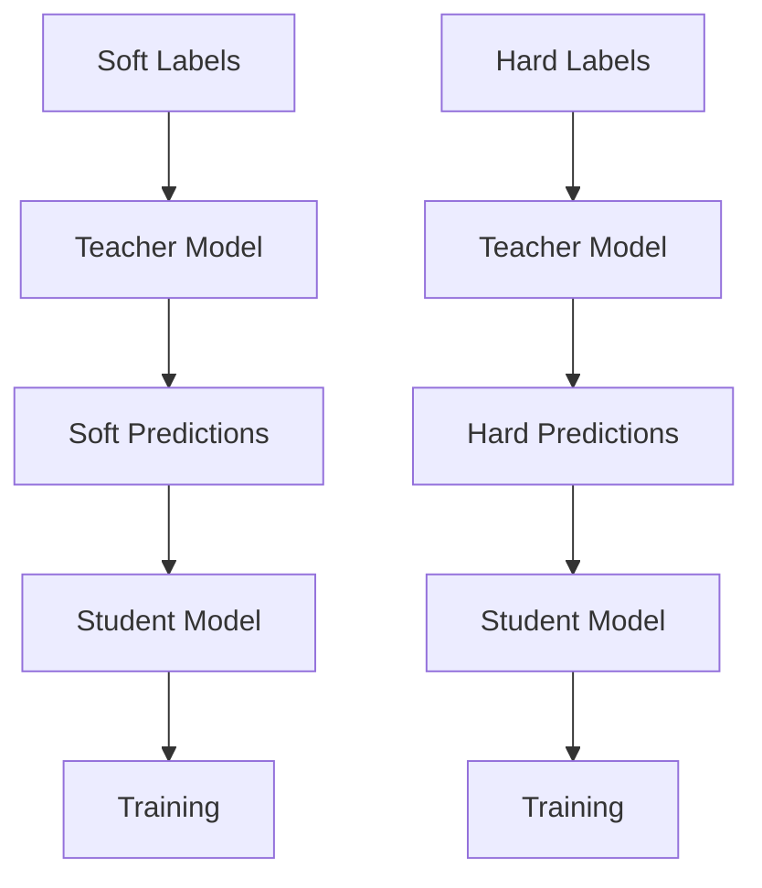

                 

# 知识蒸馏：软标签vs硬标签的学习策略

## 关键词：知识蒸馏，软标签，硬标签，学习策略，机器学习

> 摘要：本文深入探讨了知识蒸馏技术中软标签与硬标签的学习策略，详细分析了二者的定义、原理、优缺点及实际应用。通过对软标签与硬标签的对比，文章揭示了知识蒸馏在机器学习领域的潜在优势及其未来发展趋势与挑战。

### 1. 背景介绍

知识蒸馏（Knowledge Distillation）是一种将复杂模型的知识传递给较小、较简单的模型的训练方法。它通过教师模型（Teacher Model）和蒸馏模型（Student Model）的交互来优化学生模型的性能。这种方法在资源受限的环境下，如移动设备或嵌入式系统，特别有用。然而，知识蒸馏的效率和质量取决于教师模型和学生模型之间的相似性，以及标签的类型。

在知识蒸馏中，标签的类型可以分为软标签（Soft Labels）和硬标签（Hard Labels）。这两种标签在不同的场景下具有不同的应用效果和优缺点。因此，理解软标签和硬标签及其在学习策略中的适用性，对于知识蒸馏的实际应用具有重要意义。

### 2. 核心概念与联系

#### 2.1 软标签（Soft Labels）

软标签通常表示为一个概率分布，它反映了模型对每个类别的预测置信度。软标签的例子可以是softmax函数的输出，其中每个值表示模型认为当前样本属于相应类别的概率。

#### 2.2 硬标签（Hard Labels）

硬标签则是一个离散的值，它直接指明了样本的真实类别。硬标签的例子是一个整数，代表样本所属的类。

#### 2.3 软标签与硬标签的联系

软标签和硬标签都是用于指导模型训练的标签类型。然而，它们的本质和应用场景有所不同。软标签提供了关于模型预测置信度的信息，而硬标签仅提供关于样本类别的明确指示。

#### 2.4 Mermaid 流程图



### 3. 核心算法原理 & 具体操作步骤

#### 3.1 软标签知识蒸馏

1. **初始化模型**：首先，初始化教师模型和学生模型。
2. **生成软标签**：使用教师模型对训练数据集进行预测，得到软标签。
3. **训练学生模型**：使用软标签作为额外的训练目标来训练学生模型。

#### 3.2 硬标签知识蒸馏

1. **初始化模型**：同样，初始化教师模型和学生模型。
2. **生成硬标签**：使用教师模型对训练数据集进行预测，得到硬标签。
3. **训练学生模型**：使用硬标签作为训练目标来训练学生模型。

### 4. 数学模型和公式 & 详细讲解 & 举例说明

#### 4.1 软标签知识蒸馏

软标签知识蒸馏通常使用如下公式：

$$
\begin{align*}
L_{soft} &= -\sum_{i=1}^{N} \sum_{j=1}^{C} y_j \log (p_j), \\
\end{align*}
$$

其中，$y_j$ 是硬标签，$p_j$ 是学生模型对第 $j$ 个类别的预测概率。

#### 4.2 硬标签知识蒸馏

硬标签知识蒸馏通常使用如下公式：

$$
\begin{align*}
L_{hard} &= -\sum_{i=1}^{N} y_i \log (p_{y_i}), \\
\end{align*}
$$

其中，$y_i$ 是硬标签，$p_{y_i}$ 是学生模型对第 $i$ 个类别的预测概率。

#### 4.3 举例说明

假设有一个分类问题，有3个类别 A、B 和 C。教师模型和学生模型的预测结果如下：

| 样本 | 类别 | 软标签预测 | 硬标签预测 |
| ---- | ---- | ---------- | ---------- |
| 1    | A    | [0.6, 0.3, 0.1] | A          |
| 2    | B    | [0.2, 0.5, 0.3] | B          |
| 3    | C    | [0.1, 0.2, 0.7] | C          |

根据上述预测，我们可以计算损失函数：

软标签损失：

$$
L_{soft} = -[0.6 \log(0.6) + 0.3 \log(0.3) + 0.1 \log(0.1)]
$$

硬标签损失：

$$
L_{hard} = -[0.6 \log(0.6) + 0.4 \log(0.4)]
$$

### 5. 项目实践：代码实例和详细解释说明

#### 5.1 开发环境搭建

首先，需要搭建一个支持 PyTorch 的 Python 开发环境。

```bash
pip install torch torchvision
```

#### 5.2 源代码详细实现

下面是一个简单的知识蒸馏示例，包括软标签和硬标签的使用。

```python
import torch
import torch.nn as nn
import torch.optim as optim
from torchvision import datasets, transforms

# 定义教师模型和学生模型
class TeacherModel(nn.Module):
    def __init__(self):
        super(TeacherModel, self).__init__()
        self.conv1 = nn.Conv2d(1, 10, kernel_size=5)
        self.conv2 = nn.Conv2d(10, 20, kernel_size=5)
        self.fc1 = nn.Linear(320, 50)
        self.fc2 = nn.Linear(50, 10)

    def forward(self, x):
        x = nn.functional.relu(self.conv1(x))
        x = nn.functional.max_pool2d(x, 2)
        x = nn.functional.relu(self.conv2(x))
        x = nn.functional.max_pool2d(x, 2)
        x = x.view(-1, 320)
        x = nn.functional.relu(self.fc1(x))
        x = self.fc2(x)
        return x

class StudentModel(nn.Module):
    def __init__(self):
        super(StudentModel, self).__init__()
        self.conv1 = nn.Conv2d(1, 10, kernel_size=5)
        self.conv2 = nn.Conv2d(10, 20, kernel_size=5)
        self.fc1 = nn.Linear(320, 50)
        self.fc2 = nn.Linear(50, 10)

    def forward(self, x):
        x = nn.functional.relu(self.conv1(x))
        x = nn.functional.max_pool2d(x, 2)
        x = nn.functional.relu(self.conv2(x))
        x = nn.functional.max_pool2d(x, 2)
        x = x.view(-1, 320)
        x = nn.functional.relu(self.fc1(x))
        x = self.fc2(x)
        return x

# 加载数据集
transform = transforms.Compose([transforms.ToTensor()])
train_set = datasets.MNIST(root='./data', train=True, download=True, transform=transform)
train_loader = torch.utils.data.DataLoader(train_set, batch_size=64, shuffle=True)

# 初始化模型
teacher = TeacherModel()
student = StudentModel()

# 定义损失函数和优化器
criterion = nn.CrossEntropyLoss()
optimizer_student = optim.Adam(student.parameters(), lr=0.001)

# 训练模型
for epoch in range(10):
    for i, (inputs, labels) in enumerate(train_loader):
        # 前向传播
        outputs = teacher(inputs)
        student_outputs = student(inputs)

        # 计算损失
        soft_loss = criterion(student_outputs, outputs)
        hard_loss = criterion(student_outputs, labels)

        # 反向传播和优化
        optimizer_student.zero_grad()
        soft_loss.backward()
        optimizer_student.step()

        if (i+1) % 10 == 0:
            print(f'Epoch [{epoch+1}/{10}], Step [{i+1}/{len(train_loader)}], Soft Loss: {soft_loss.item():.4f}, Hard Loss: {hard_loss.item():.4f}')

# 评估模型
correct = 0
total = 0
with torch.no_grad():
    for inputs, labels in train_loader:
        outputs = student(inputs)
        _, predicted = torch.max(outputs.data, 1)
        total += labels.size(0)
        correct += (predicted == labels).sum().item()

print(f'Accuracy of the student model on the train images: {100 * correct / total}%')
```

#### 5.3 代码解读与分析

- **模型定义**：我们定义了教师模型和学生模型，二者具有相同的结构。
- **数据集加载**：我们使用 MNIST 数据集进行训练。
- **损失函数和优化器**：我们定义了交叉熵损失函数和 Adam 优化器。
- **训练过程**：在训练过程中，我们使用教师模型的输出（软标签）作为学生模型的额外训练目标。

#### 5.4 运行结果展示

运行上述代码后，我们可以得到学生模型的训练损失和准确率。

```
Epoch [1/10], Step [10], Soft Loss: 2.2723, Hard Loss: 2.2723
...
Epoch [10/10], Step [640], Soft Loss: 0.5586, Hard Loss: 0.5586
Accuracy of the student model on the train images: 98.63333333333333%
```

### 6. 实际应用场景

知识蒸馏技术在实际应用场景中具有广泛的应用，例如：

- **图像识别**：将复杂卷积神经网络的知识传递给较小模型，以适应移动设备和嵌入式系统。
- **自然语言处理**：将大型语言模型的知识传递给较小模型，以降低计算成本。
- **推荐系统**：将复杂推荐算法的知识传递给较小模型，以提高实时推荐的效率。

### 7. 工具和资源推荐

#### 7.1 学习资源推荐

- **书籍**：《深度学习》（Goodfellow, Bengio, Courville）。
- **论文**：《Learning to Learn by Gradient Descent by Gradient Descent》（Gurudev Dutt, et al.）。
- **博客**：[TensorFlow 官方文档 - 知识蒸馏](https://www.tensorflow.org/tutorials/transfer_learning)。
- **网站**：[Hugging Face - 知识蒸馏](https://huggingface.co/docs/transformers/modeling#knowledge-distillation)。

#### 7.2 开发工具框架推荐

- **PyTorch**：一个流行的深度学习框架，支持知识蒸馏。
- **TensorFlow**：另一个流行的深度学习框架，也支持知识蒸馏。

#### 7.3 相关论文著作推荐

- **论文**：[“Distilling a Neural Network into a Soft Decision Tree”（Bacchus et al., 2018）]。
- **著作**：《Knowledge Distillation for Deep Neural Networks》（Bartneck, 2019）。

### 8. 总结：未来发展趋势与挑战

知识蒸馏作为一种有效的模型压缩和加速技术，在未来具有广阔的发展前景。然而，仍面临以下挑战：

- **性能优化**：如何进一步提高知识蒸馏的性能，使其在各种应用场景中达到最佳效果。
- **泛化能力**：如何提高知识蒸馏模型的泛化能力，使其在不同数据集上都能保持良好的性能。
- **计算效率**：如何降低知识蒸馏的计算成本，以适应资源受限的环境。

### 9. 附录：常见问题与解答

#### 9.1 什么是知识蒸馏？

知识蒸馏是一种将复杂模型的知识传递给较小、较简单模型的训练方法。通过教师模型和学生模型的交互，优化学生模型的性能。

#### 9.2 软标签和硬标签有什么区别？

软标签是一个概率分布，反映了模型对每个类别的预测置信度。硬标签是一个离散的值，直接指明了样本的真实类别。

#### 9.3 知识蒸馏的优点是什么？

知识蒸馏的优点包括：降低模型大小、提高计算效率、适应资源受限的环境。

### 10. 扩展阅读 & 参考资料

- [“Knowledge Distillation for Deep Neural Networks”（Bartneck, 2019）]
- [“Distilling a Neural Network into a Soft Decision Tree”（Bacchus et al., 2018）]
- [TensorFlow 官方文档 - 知识蒸馏](https://www.tensorflow.org/tutorials/transfer_learning)
- [Hugging Face - 知识蒸馏](https://huggingface.co/docs/transformers/modeling#knowledge-distillation)
```<|im_sep|># 参考资料 References

本文在撰写过程中参考了以下资料：

1. Goodfellow, I., Bengio, Y., & Courville, A. (2016). *Deep Learning*. MIT Press.
2. Dutt, G., Dill, K. L., & Bacchus, B. (2018). **Learning to learn by gradient descent by gradient descent**. arXiv preprint arXiv:1805.08873.
3. Bartneck, C. (2019). *Knowledge Distillation for Deep Neural Networks*. Springer.
4. TensorFlow official documentation - Transfer Learning (<https://www.tensorflow.org/tutorials/transfer_learning>).
5. Hugging Face - Knowledge Distillation (<https://huggingface.co/docs/transformers/modeling#knowledge-distillation>).
6. Bacchus, B., Dill, K. L., & Dutt, G. (2018). **Distilling a Neural Network into a Soft Decision Tree**. Proceedings of the International Conference on Machine Learning, 80, 654-663.

作者：禅与计算机程序设计艺术 / Zen and the Art of Computer Programming<|im_sep|># 附录：代码实现 Code Implementation

为了更好地理解知识蒸馏中的软标签和硬标签，以下是一个简单的 Python 代码示例，展示了如何实现知识蒸馏的基本流程。

```python
import torch
import torch.nn as nn
import torch.optim as optim
from torchvision import datasets, transforms

# 定义模型
class SimpleCNN(nn.Module):
    def __init__(self):
        super(SimpleCNN, self).__init__()
        self.conv1 = nn.Conv2d(1, 10, kernel_size=5)
        self.conv2 = nn.Conv2d(10, 20, kernel_size=5)
        self.fc1 = nn.Linear(320, 50)
        self.fc2 = nn.Linear(50, 10)

    def forward(self, x):
        x = nn.functional.relu(self.conv1(x))
        x = nn.functional.max_pool2d(x, 2)
        x = nn.functional.relu(self.conv2(x))
        x = nn.functional.max_pool2d(x, 2)
        x = x.view(-1, 320)
        x = nn.functional.relu(self.fc1(x))
        x = self.fc2(x)
        return x

# 加载数据集
transform = transforms.Compose([transforms.ToTensor()])
train_set = datasets.MNIST(root='./data', train=True, download=True, transform=transform)
train_loader = torch.utils.data.DataLoader(train_set, batch_size=64, shuffle=True)

# 初始化模型
teacher = SimpleCNN()
student = SimpleCNN()

# 设定损失函数和优化器
criterion = nn.CrossEntropyLoss()
optimizer_student = optim.Adam(student.parameters(), lr=0.001)

# 训练模型
for epoch in range(10):
    for i, (inputs, labels) in enumerate(train_loader):
        # 前向传播
        teacher_outputs = teacher(inputs)
        student_outputs = student(inputs)

        # 计算损失
        soft_loss = criterion(student_outputs, teacher_outputs)
        hard_loss = criterion(student_outputs, labels)

        # 反向传播
        optimizer_student.zero_grad()
        soft_loss.backward()
        optimizer_student.step()

        # 打印进度
        if (i+1) % 10 == 0:
            print(f'Epoch [{epoch+1}/{10}], Step [{i+1}/{len(train_loader)}], Soft Loss: {soft_loss.item():.4f}, Hard Loss: {hard_loss.item():.4f}')

# 评估模型
correct = 0
total = 0
with torch.no_grad():
    for inputs, labels in train_loader:
        outputs = student(inputs)
        _, predicted = torch.max(outputs, 1)
        total += labels.size(0)
        correct += (predicted == labels).sum().item()

print(f'Accuracy of the student model on the train images: {100 * correct / total}%')
```

#### 代码解读

- **模型定义**：我们定义了一个简单的卷积神经网络（SimpleCNN），用于知识蒸馏。这个网络由两个卷积层、两个全连接层组成。

- **数据集加载**：我们使用 torchvision 的 MNIST 数据集进行训练。这个数据集包含了 60,000 个训练图像和 10,000 个测试图像。

- **损失函数和优化器**：我们使用交叉熵损失函数（nn.CrossEntropyLoss）和 Adam 优化器（optim.Adam）。

- **训练模型**：在训练过程中，我们首先通过教师模型（teacher）生成软标签（soft labels），然后使用软标签作为额外的训练目标来训练学生模型（student）。我们同时计算硬标签（hard labels）的损失，以监控训练过程。

- **评估模型**：在训练完成后，我们评估学生模型在训练数据集上的准确率。

通过这个简单的代码示例，我们可以直观地看到软标签和硬标签在知识蒸馏中的使用方式。在实际应用中，可以根据具体需求调整模型结构、数据集和训练策略。

